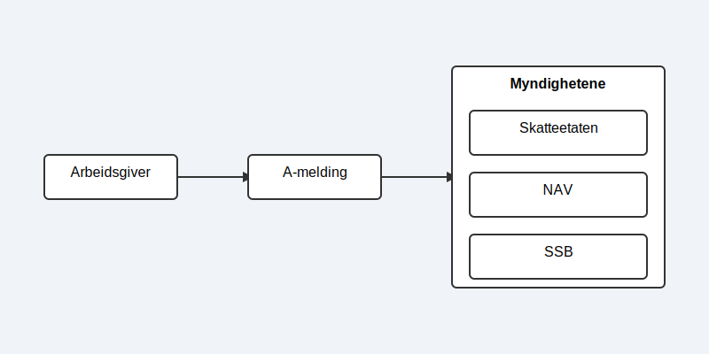
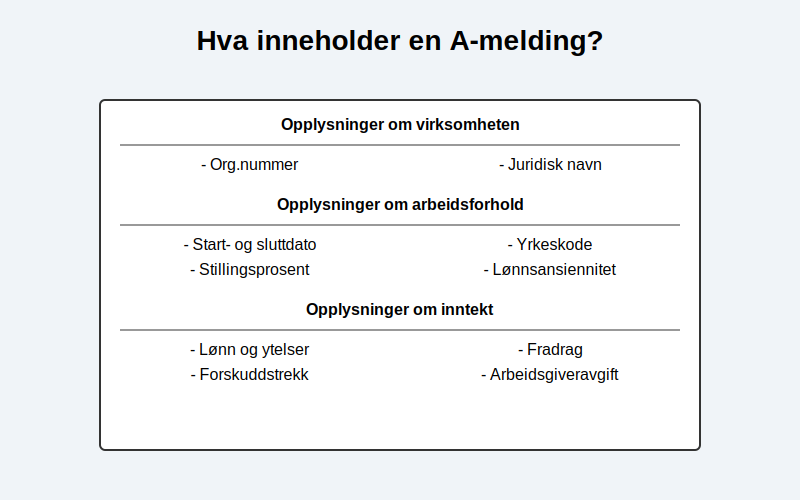

---
title: "Hva er a-melding?"
meta_title: "Hva er a-melding?"
meta_description: 'A-melding, også kjent som **[samordnet registermelding](/blogs/regnskap/samordnet-registermelding "Samordnet registermelding")**, er en månedlig digital rappo...'
slug: hva-er-a-melding
type: blog
layout: pages/single
---

A-melding, ogsÃ¥ kjent som **[samordnet registermelding](/blogs/regnskap/samordnet-registermelding "Samordnet registermelding")**, er en mÃ¥nedlig digital rapport som alle [arbeidsgivere](/blogs/regnskap/arbeidsgiver "Arbeidsgiver “ Roller og Ansvar i Norsk Arbeidsliv og Regnskap") i Norge er lovpÃ¥lagt Ã¥ sende inn til myndighetene. Rapporten inneholder detaljerte opplysninger om **inntekter**, **arbeidsforhold** og **[forskuddstrekk](/blogs/regnskap/hva-er-forskuddstrekk "Hva er Forskuddstrekk? Komplett Guide til Skattetrekk i Lønn")** for hver enkelt ansatt. FormÃ¥let med a-meldingen er Ã¥ forenkle rapporteringsprosessen for arbeidsgivere og samtidig sikre at sentrale etater som Skatteetaten, [NAV](/blogs/regnskap/hva-er-nav "NAV i Regnskap “ Rolle og Bruk av Arbeids- og velferdsdata") og Statistisk sentralbyrÃ¥ (SSB) har et nøyaktig og oppdatert datagrunnlag.

A-meldingen er et viktig eksempel på **[egenmelding](/blogs/regnskap/hva-er-egenmelding "Hva er Egenmelding? Komplett Guide til Selvrapportering i Norsk Regnskap")** - selvrapportering hvor arbeidsgivere selv har ansvar for å rapportere korrekte opplysninger om lønn og arbeidsforhold til myndighetene. Som en sentral del av **[opplysningsplikten](/blogs/regnskap/hva-er-opplysningsplikt "Hva er opplysningsplikt? Komplett guide til rapporteringsplikt")**, representerer a-meldingen bedrifters lovpålagte ansvar for å dele økonomisk informasjon med offentlige myndigheter.

Denne ordningen, kjent som [A-ordningen](/blogs/regnskap/hva-er-a-ordningen "Hva er A-ordningen?"), effektiviserer informasjonsflyten og danner grunnlaget for en rekke offentlige tjenester og statistikker, fra beregning av skatt og trygdeytelser til offisiell lønnsstatistikk.

## Hvem skal levere a-melding og når?

I utgangspunktet skal **alle** som har ansatte, eller som utbetaler lønn, ytelser eller godtgjørelser, levere a-melding. Dette gjelder for:

*   **Bedrifter og organisasjoner:** Uavhengig av størrelse og bransje.
*   **Private arbeidsgivere:** For eksempel om du har en vaskehjelp eller en gartner ansatt privat.
*   **Veldedige og frivillige organisasjoner:** Selv om lønnen er lav eller arbeidet er sporadisk.

Plikten gjelder selv om det ikke har vært noen lønnsutbetalinger i en måned, så lenge arbeidsforholdet består. I slike tilfeller leverer man en "null-melding" for å bekrefte at det ikke har vært aktivitet.

### Frister for levering

A-meldingen skal leveres **hver måned** med en fast frist den **5. i måneden etter** lønnsutbetalingen. Hvis den 5. faller på en helg eller helligdag, er fristen neste [virkedag](/blogs/regnskap/virkedager "Virkedager").

## Hva inneholder en a-melding?

En a-melding er bygget opp av informasjon om selve virksomheten og detaljerte opplysninger for hver ansatt. De sentrale elementene er:

*   **Opplysninger om arbeidsforhold:** Dette inkluderer startdato, eventuell sluttdato, stillingsprosent, yrkeskode og [type arbeidsforhold](/blogs/regnskap/hva-er-arbeidsforholdstype "Hva er arbeidsforholdstype?") (fast, midlertidig, etc.).
*   **Opplysninger om inntekt:** Her spesifiseres all skattepliktig og trekkpliktig lønn, faste og variable tillegg, [helligdagslønn og tilleggsgodtgjørelse](/blogs/regnskap/helligdager-regnskap-bedriftseiere "Helligdager (regnskap, bedriftseiere) - Komplett Guide til Feriepenger og Regnskapsføring") for arbeid på helligdager, naturalytelser (som fri bil eller telefon), og eventuelle godtgjørelser.
*   **[Forskuddstrekk](/blogs/regnskap/hva-er-forskuddstrekk "Hva er Forskuddstrekk? Komplett Guide til Skattetrekk i Lønn") og fradrag:** Beløpet som er trukket i skatt av den ansattes lønn.
*   **Arbeidsgiveravgift:** Grunnlaget for beregning av [arbeidsgiveravgift](/blogs/regnskap/hva-er-arbeidsgiveravgift "Hva er Arbeidsgiveravgift? En Komplett Guide til Norges Lønnsavgift").

## Hvordan levere a-melding?

Det finnes i hovedsak to måter å levere a-melding på:

1.  **Via et lønnssystem:** De fleste moderne [økonomisystemer](/blogs/regnskap/hva-er-regnskap "Hva er Regnskap? En Enkel Forklaring") har integrert funksjonalitet for lønn og a-melding. Systemet genererer automatisk rapporten basert på lønnskjøringen og sender den direkte til [Altinn](/blogs/regnskap/hva-er-altinn "Hva er Altinn? Norges Digitale Portal for Næringsliv og Privatpersoner"). Dette er den mest anbefalte metoden, da den reduserer risikoen for feil.
2.  **Direkte i Altinn:** For mindre virksomheter med få ansatte er det mulig å fylle ut og levere a-meldingen manuelt ved å logge inn på [Altinn](/blogs/regnskap/hva-er-altinn "Hva er Altinn? Norges Digitale Portal for Næringsliv og Privatpersoner") sine nettsider.

## Hva brukes informasjonen til?

Dataene fra a-meldingen er kritiske for flere offentlige funksjoner:

*   **[NAV](/blogs/regnskap/hva-er-nav "NAV i Regnskap “ Rolle og Bruk av Arbeids- og velferdsdata"):** Bruker informasjonen til Ã¥ beregne og utbetale ytelser som sykepenger, foreldrepenger, dagpenger og uføretrygd gjennom [folketrygden](/blogs/regnskap/hva-er-folketrygden "Hva er Folketrygden? Komplett Guide til Norges Nasjonale Trygdesystem"). Korrekte data sikrer at den ansatte fÃ¥r det de har krav pÃ¥.
*   **Skatteetaten:** Anvender dataene til å oppdatere skattekort, lage den forhåndsutfylte skattemeldingen, og kontrollere innbetaling av [forskuddstrekk](/blogs/regnskap/hva-er-forskuddstrekk "Hva er Forskuddstrekk? Komplett Guide til Skattetrekk i Lønn") og arbeidsgiveravgift.
*   **SSB:** Bruker anonymiserte data til å produsere viktig statistikk om lønn, sysselsetting og sykefravær i Norge.

## Konsekvenser av feil eller manglende levering

Å levere a-meldingen for sent eller med feilaktige opplysninger kan føre til sanksjoner. Skatteetaten kan ilegge [Tvangsmulkt](/blogs/regnskap/tvangsmulkt "Hva er Tvangsmulkt? Guide til Tvangsmulkt og Beregning i Norsk Regnskap") for hver dag meldingen er forsinket. Ved vesentlige feil kan det også medføre tilleggsskatt eller i alvorlige tilfeller anmeldelse.

Det er derfor svært viktig å ha gode rutiner for lønnskjøring og innsending av a-melding. Dette inkluderer korrekt føring av [ansattreskontro](/blogs/regnskap/hva-er-ansattreskontro "Hva er Ansattreskontro? En Guide til Ansattkontoer i Regnskap") for hver ansatt og månedlig [avregning](/blogs/regnskap/avregning "Hva er Avregning i Regnskap? Komplett Guide til Avregning") av lønn, trekk og arbeidsgiveravgift.

Les også: [Hva er en faktura?](/blogs/regnskap/hva-er-en-faktura "Hva er en Faktura? En Guide til Norske Fakturakrav")

## Relaterte ord

*   A-ordningen
*   Altinn
*   Lønn
*   Lønnskostnad
*   Tabelltrekk
*   Virksomhetsnummer

