---
title: "Hva er Ã…rsavslutning i Regnskap?"
meta_title: "Hva er Ã…rsavslutning i Regnskap?"
meta_description: '**Årsavslutning** er en kritisk og kompleks prosess som markerer slutten på et regnskapsår og sikrer at virksomhetens finansielle rapporter reflekterer den k...'
slug: hva-er-aarsavslutning
type: blog
layout: pages/single
---

**Årsavslutning** er en kritisk og kompleks prosess som markerer slutten på et regnskapsår og sikrer at virksomhetens finansielle rapporter reflekterer den korrekte økonomiske situasjonen. Denne prosessen omfatter en rekke tekniske og strategiske aktiviteter som krever grundig planlegging, systematisk gjennomføring og nøye kvalitetskontroll. Artikkelen gir en omfattende guide til alle aspekter ved årsavslutning i norsk regnskap.

For en grundig gjennomgang av [årsberetningen](/blogs/regnskap/arsberetning "Årsberetning: Innhold, Krav og Guide til Norsk Årsberetning"), se vår nye artikkel om årsberetning.

## Seksjon 1: Ã…rsavslutningens Grunnleggende Konsept

**Årsavslutning** er den systematiske prosessen hvor alle regnskapsmessige transaksjoner og justeringer fra regnskapsåret samles, kontrolleres og presenteres i de offisielle årsregnskapene. Prosessen sikrer at [balansen](/blogs/regnskap/hva-er-balanse "Hva er Balanse i Regnskap? Komplett Guide til Balansens Oppbygging og Funksjon") og resultatregnskapet gir et **rettvisende bilde** av virksomhetens økonomiske stilling og resultater.

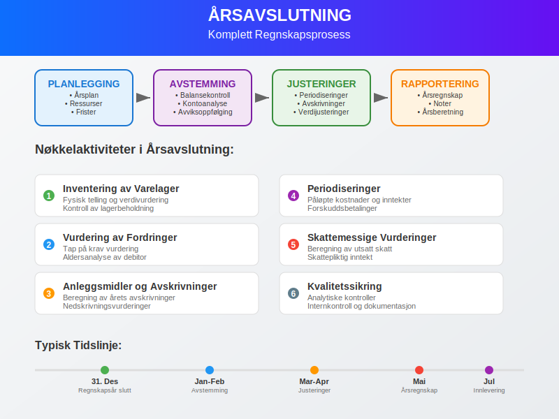

En viktig del av årsavslutningen er **sluttoppgjøret**, hvor alle kontoer avstemmes og endelig godkjennes. Les mer om prosessen for [Sluttoppgjør i regnskap](/blogs/regnskap/sluttoppgjor "Sluttoppgjør i regnskap") for en detaljert gjennomgang.

### 1.1 Formål med Årsavslutning

Årsavslutning tjener flere kritiske formål:

* **Juridisk overholdelse:** Oppfyller krav i regnskapslov og annen relevant lovgivning
* **Interessentkommunikasjon:** Gir reliable finansielle data til investorer, kreditorer og myndigheter
* **Intern styring:** Leverer grunnlag for strategiske beslutninger og fremtidig planlegging
* **Skatterapportering:** Danner basis for [skatteberegning](/blogs/regnskap/hva-er-skatt "Hva er Skatt? Komplett Guide til Norsk Skattesystem og Skatteberegning") og innlevering av selvangivelse, og reduserer risiko for [baksmell](/blogs/regnskap/baksmell "Baksmell i Regnskap og Skatt: Ã…rsaker, Eksempler og Behandling")

### 1.2 Tidsperspektiv og Frister

Norske virksomheter må følge strenge tidsfrister for årsavslutning:

* **Årsregnskap:** Senest 5 måneder etter regnskapsårets slutt
* **Årsberetning:** Samtidig med årsregnskapet
* **Generalforsamling:** Senest 6 måneder etter regnskapsårets slutt
* **Innlevering:** Til Regnskapsregisteret senest 7 måneder etter regnskapsårets slutt

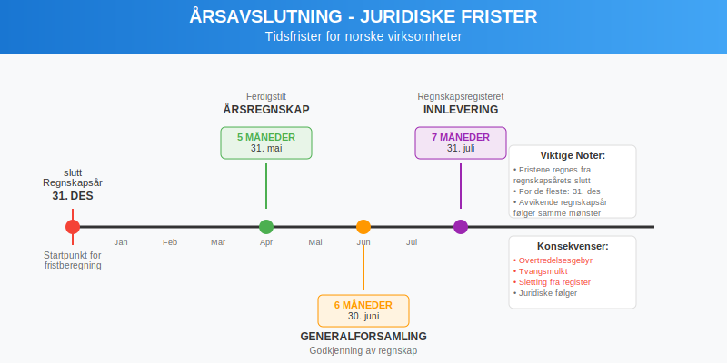

## Seksjon 2: Forberedende Fase - Planlegging og Organisering

### 2.1 Ã…rsavslutningsplan

En strukturert **årsavslutningsplan** er essensielt for effektiv gjennomføring:

| **Aktivitet** | **Ansvarlig** | **Frist** | **Status** |
|---------------|---------------|-----------|------------|
| Inventering av varelager | Lagersjef | 31. desember | Planlagt |
| [Avstemming](/blogs/regnskap/hva-er-avstemming "Hva er Avstemming i Regnskap? Komplett Guide til Regnskapsavstemming") av bankkontoer | Regnskapsfører | 5. januar | Planlagt |
| Vurdering av fordringer | Økonomisjef | 10. januar | Planlagt |
| [Avskrivningsberegninger](/blogs/regnskap/hva-er-avskrivning "Hva er Avskrivning? Komplett Guide til Avskrivningsmetoder") | Controller | 15. januar | Planlagt |
| [Periodiseringer](/blogs/regnskap/hva-er-periodisering "Hva er Periodisering i Regnskap? Komplett Guide til Periodiseringsprinsippet") | Regnskapsfører | 20. januar | Planlagt |

### 2.2 Ressursallokering

Vellykket årsavslutning krever:

* **Kompetent personal:** Erfarne regnskapsførere og controllere
* **Tekniske verktøy:** Moderne regnskapssystemer og analyseverktøy
* **Tidsmessige ressurser:** Tilstrekkelig tid til grundig kvalitetskontroll
* **Ekstern bistand:** Revisorer og spesialiserte rådgivere ved behov

> **Tip:** Unngå **skippertak** ved å starte planleggingen tidlig. Les mer i [Skippertak](/blogs/regnskap/skippertak "Hva er Skippertak? Hvordan unngå hektisk årsslutt") for praktiske råd.

### 2.3 Dokumentasjonsrutiner

Etablering av systematiske **dokumentasjonsrutiner** sikrer sporbarhet:

* Oppbevaring av alle bilag og dokumenter
* Arkivering av regnskapsjournaler og -rapporter
* Sikring av elektroniske data og backup-rutiner
* Utarbeidelse av kontrollspor for alle justeringsposter

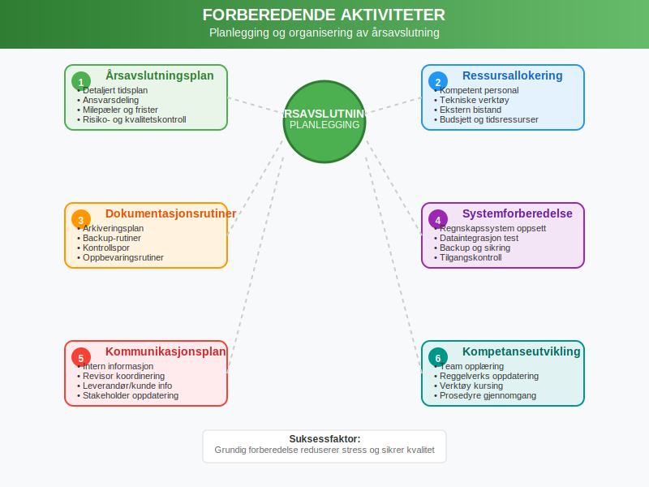

## Seksjon 3: Gjennomgang og Avstemming av Kontoer

### 3.1 Balansekontroller

Den første fasen i den praktiske årsavslutningen innebærer grundig **gjennomgang av alle balancekontoer**:

#### 3.1.1 Eiendelskontoer (Aktiva)

**Anleggsmidler:**
* Kontroll av [anleggsmidler](/blogs/regnskap/hva-er-anleggsmidler "Hva er Anleggsmidler? Komplett Guide til Faste Eiendeler") mot fysisk inventering
* Vurdering av [nedskrivningsbehov](/blogs/regnskap/hva-er-nedskrivning "Hva er Nedskrivning? Komplett Guide til Verdifall på Eiendeler") for fast eiendom og utstyr
* Beregning av [avskrivninger](/blogs/regnskap/hva-er-avskrivning "Hva er Avskrivning? Komplett Guide til Avskrivningsmetoder") for regnskapsåret
* Oppfølging av [varige driftsmidler](/blogs/regnskap/hva-er-varige-driftsmidler "Hva er Varige Driftsmidler? Komplett Guide til Materielle Anleggsmidler") og deres utvikling

**Omløpsmidler:**
* Inventering og verdivurdering av [varelager](/blogs/regnskap/hva-er-varelager "Hva er Varelager? Komplett Guide til Lagerregnskapsføring og Verdivurdering")
* [Avstemming](/blogs/regnskap/hva-er-avstemming "Hva er Avstemming i Regnskap? Komplett Guide til Regnskapsavstemming") av [kundefordringer](/blogs/regnskap/hva-er-debitor "Hva er Debitor i Regnskap? Komplett Guide til Kundefordringer og Debitorhåndtering") og vurdering av tap på krav
* Kontroll av banksaldoer og [kassebeholdning](/blogs/regnskap/hva-er-kassebeholdning "Hva er Kassebeholdning? Komplett Guide til Kontanter og Likvide Midler")
* Vurdering av kortsiktige investeringer til markedsverdi

### 3.2 Gjeldskontoer (Passiva)

**Langsiktig gjeld:**
* Avstemming av banklån mot låneavtaler og amortiseringsplaner
* Kontroll av [pensjonsforpliktelser](/blogs/regnskap/hva-er-tjenestepensjon "Hva er Tjenestepensjon? Komplett Guide til Bedriftspensjon og Regnskapsføring")
* Vurdering av andre langsiktige forpliktelser

**Kortsiktig gjeld:**
* Avstemming av [leverandørgjeld](/blogs/regnskap/hva-er-leverandorgjeld "Hva er Leverandørgjeld i Regnskap? En Komplett Guide til Kreditorhåndtering") mot fakturaer og kontrakter
* Beregning av påløpte kostnader og feriepengeforpliktelser
* Kontroll av [skattegjeld](/blogs/regnskap/hva-er-skatt "Hva er Skatt? Komplett Guide til Norsk Skattesystem og Skatteberegning") og avgiftsforpliktelser

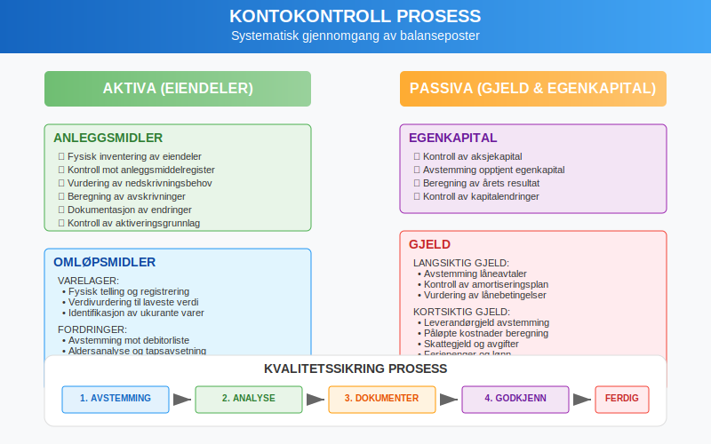

### 3.3 Egenkapitalkontoer

Gjennomgang av [egenkapital](/blogs/regnskap/hva-er-egenkapital "Hva er Egenkapital? Komplett Guide til Egenkapital i Regnskap") innebærer:

* Kontroll av [aksjekapital](/blogs/regnskap/hva-er-aksjekapital "Hva er Aksjekapital? Komplett Guide til Egenkapital i AS") mot aksjonærregistre
* Avstemming av opptjent egenkapital mot tidligere års avslutning
* Beregning av årets resultatoverføring
* Kontroll av utbyttebetalinger og kapitalendringer

## Seksjon 4: Periodiseringer og Justeringsposter

### 4.1 Periodiseringsprinsippet

[Periodiseringsprinsippet](/blogs/regnskap/hva-er-periodisering "Hva er Periodisering i Regnskap? Komplett Guide til Periodiseringsprinsippet") krever at alle inntekter og kostnader som vedrører regnskapsåret inkluderes, uavhengig av når betalingen skjer.

#### 4.1.1 Påløpte Kostnader

**Påløpte kostnader** er kostnader som er pådratt, men ikke fakturert eller betalt:

* **Lønn og feriepenger:** Opptjente rettigheter som ikke er utbetalt
* **Renter:** Påløpte rentekostnader på lån
* **Strøm og andre driftskostnader:** Forbruk som ikke er fakturert
* **Profesjonelle tjenester:** Leveranser mottatt, men ikke fakturert

#### 4.1.2 Forhåndsbetalte Kostnader

**Forhåndsbetalte kostnader** representerer utgifter betalt i inneværende år som vedrører neste år:

* Forsikringspremier betalt på forhånd
* Lisenser og abonnement for kommende år
* Forhåndsbetalte leasingavgifter
* Forskuddsbetalte markedsføringskostnader

### 4.2 Utsatt Inntekt og Påløpte Inntekter

**Utsatt inntekt:**
* Forskuddsbetaling fra kunder for fremtidige leveranser
* Abonnementsinntekter mottatt på forhånd
* Deposita og garantibeløp

**Påløpte inntekter:**
* Leveranser utført, men ikke fakturert
* Opptjente renter ikke mottatt
* Utført arbeid under [tungt salær](/blogs/regnskap/hva-er-tungt-salaer "Hva er Tungt Salær? Komplett Guide til Prosjektbasert Inntektsføring")

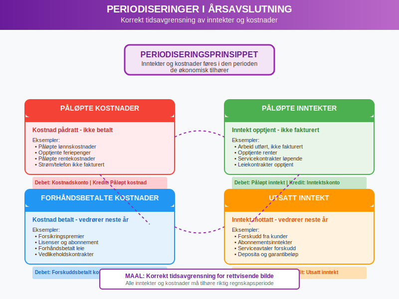

### 4.3 Teknisk Gjennomføring av Justeringsposter

Systematisk registrering av justeringsposter:

| **Type Justering** | **Debet** | **Kredit** | **Forklaring** |
|-------------------|-----------|------------|----------------|
| Påløpt lønn | Lønnskostnad | Påløpt lønn | Opptjent, ikke utbetalt |
| Forhåndsbetalt forsikring | Forskuddsbetalt kostnad | Forsikringskostnad | Justert til riktig periode |
| Utsatt inntekt | Salgsinntekt | Utsatt inntekt | Forskuddsbetaling |
| Avskrivning | Avskrivningskostnad | Akkumulerte avskrivninger | Periodisk verdireduksjon |

## Seksjon 5: Varelagerinventering og -vurdering

### 5.1 Inventering av Varelager

**Fysisk inventering** er en kritisk komponent i årsavslutningen:

#### 5.1.1 Planlegging av Inventering

* **Datofastsettelse:** Vanligvis siste virkedag i regnskapsåret
* **Personalressurser:** Tilstrekkelig og kompetent personale
* **Områdedeling:** Systematisk inndeling av lagerområder
* **Tellerutiner:** Dobbelt telling og kontrollprosedyrer

#### 5.1.2 Inventeringsprosess

1. **Forberedelse:** Rydding og organisering av lager
2. **Telling:** Systematisk registrering av alle vareenheter
3. **Dokumentasjon:** Detaljert registrering av telleresultater
4. **Kontroll:** Kryssjekk og verifisering av tellinger
5. **Rapportering:** Sammenstilling av endelige resultater

### 5.2 Verdivurdering av Varelager

[Varelager](/blogs/regnskap/hva-er-varelager "Hva er Varelager? Komplett Guide til Lagerregnskapsføring og Verdivurdering") skal verdsettes til **laveste verdi** av anskaffelseskost og netto realisasjonsverdi:

#### 5.2.1 Anskaffelseskost

**FIFO-metoden (First In, First Out):**
* Eldste innkjøp selges først
* Lagerverdien baseres på nyeste innkjøpspriser
* Enklest å implementere i inflasjonsperioder

**Gjennomsnittskostmetoden:**
* Vektet gjennomsnitt av alle innkjøp
* Jevner ut prisvariasjoner over tid
* Gir stabil [kostpris](/blogs/regnskap/hva-er-varekostnad "Hva er Varekostnad? Komplett Guide til Innkjøpskostnader og Lagerregnskapsføring")

#### 5.2.2 Netto Realisasjonsverdi

Vurdering av markedsverdier og salgsevne:

* **Markedspriser:** Aktuelle salgspriser i markedet
* **Lagerstatus:** Identifikasjon av [**ukurante varer**](/blogs/regnskap/ukurans "Ukurans i regnskap - nedskrivning av ukurante varer")
* **Sesongvariasjoner:** Justering for tidsmessige faktorer
* **Nedskrivningsbehov:** Reduksjon av bokført verdi ved verdifall

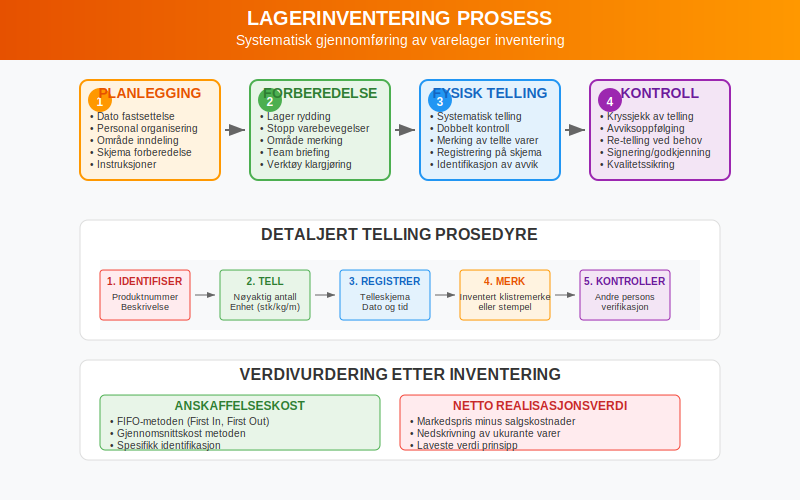

## Seksjon 6: Avskrivninger og Verdijusteringer

### 6.1 Systematiske Avskrivninger

[Avskrivning](/blogs/regnskap/hva-er-avskrivning "Hva er Avskrivning? Komplett Guide til Avskrivningsmetoder") reflekterer det systematiske verdifallet på [anleggsmidler](/blogs/regnskap/hva-er-anleggsmidler "Hva er Anleggsmidler? Komplett Guide til Faste Eiendeler") over deres brukstid.

#### 6.1.1 Lineære Avskrivninger

**Beregningsmetode:**
Årlig avskrivning = (Anskaffelseskost - [Utrangeringsverdi](/blogs/regnskap/hva-er-utrangeringsverdi "Hva er Utrangeringsverdi? Komplett Guide til Restverdi og Avhending")) / Brukstid i år

**Eksempel:**
* Anskaffelseskost: NOK 1.000.000
* Utrangeringsverdi: NOK 100.000
* Brukstid: 10 år
* Ã…rlig avskrivning: (1.000.000 - 100.000) / 10 = NOK 90.000

#### 6.1.2 Saldoavskrivninger

[Saldoavskrivning](/blogs/regnskap/hva-er-saldoavskrivning "Hva er Saldoavskrivning i Regnskap? Komplett Guide til Degressiv Avskrivning") gir høyere avskrivninger i begynnelsen av brukstiden:

* **Metode:** Fast prosentsats på gjenstående bokført verdi
* **Fordel:** Reflekterer raskere teknologisk utvikling
* **Ulempe:** Kompleksere beregninger og planlegging

### 6.2 Extraordinære Verdijusteringer

#### 6.2.1 Nedskrivninger

Når eiendelers markedsverdi eller bruksverdi er lavere enn bokført verdi:

* **Identifikasjon:** Signaler om verdifall
* **Beregning:** Forskjell mellom bokført verdi og gjenvinnbar verdi
* **Regnskapsføring:** Direkte belastning av årets resultat
* **Dokumentasjon:** Grundig begrunnelse for nedskrivningen

#### 6.2.2 Oppskrivninger

I spesielle tilfeller kan eiendeler skrives opp:

* **Juridiske krav:** Kun når tillatt etter regnskapsreglene
* **Markedsverdi:** Dokumentert økning i markedsverdi
* **Begrensninger:** Ikke over tidligere nedskrevne beløp

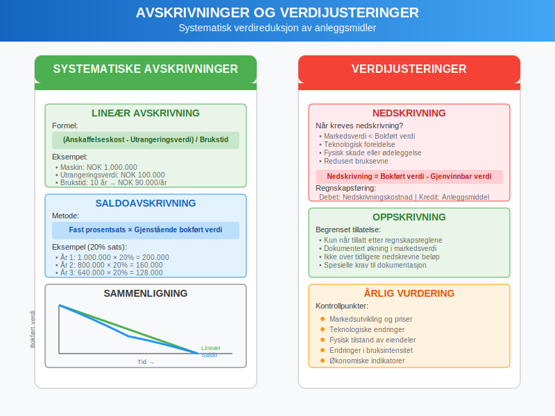

## Seksjon 7: Kreditorhåndtering og Gjeldsvurdering

### 7.1 Systematisk Gjennomgang av Gjeld

Ã…rsavslutningen krever grundig gjennomgang av alle gjeldsforhold:

#### 7.1.1 Leverandørgjeld

**Avstemmingsprosess:**
* Sammenligning av regnskapsbalanse mot leverandørkontoutskrift
* Kontroll av ubetalte fakturaer og kreditnotaer
* Identifikasjon av transitposter og feilregistreringer
* Korrigering av valutadifferanser ved utenlandsk gjeld

#### 7.1.2 LÃ¥neavstemminger

**Banklån og andre eksterne lån:**
* Avstemming mot bankoppgaver og låneavtaler
* Kontroll av rentekostnader og avdragsplaner
* Vurdering av [lånevilkår](/blogs/regnskap/hva-er-kreditt "Hva er Kreditt? Komplett Guide til Lånefinansiering og Kredittvurdering") og covenant-oppfyllelse
* Beregning av kortsiktig del av langsiktig gjeld

### 7.2 Avsetninger og Betingede Forpliktelser

#### 7.2.1 Avsetninger for Forpliktelser

**Kriterier for avsetning:**
* Nåværende forpliktelse som resultat av tidligere hendelser
* Sannsynlig utbetaling av ressurser
* Pålitelig estimat av beløpet

**Vanlige avsetninger:**
* Garantiforpliktelser på solgte produkter
* Restruktureringskostnader som er besluttet
* Rettslige tvister med sannsynlig tap
* Miljøoppriksningskostnader

#### 7.2.2 Betingede Forpliktelser

**Identifikasjon og vurdering:**
* Garantier gitt på vegne av tredjeparter
* Pågående rettslige prosesser med usikker utgang
* Skattemessige tvistesaker
* Produktansvarssaker

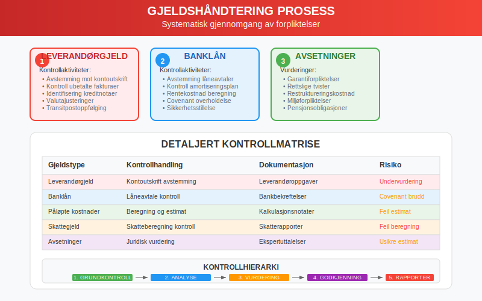

## Seksjon 8: Inntektsføring og Salgstransaksjoner

### 8.1 Prinsipper for Inntektsføring

**Inntektsføring** må følge strenge kriterier for å sikre korrekt periodisering:

#### 8.1.1 Leveringsbasert Inntektsføring

* **Levering:** Varene er overlevert til kunde
* **Risiko:** Eiendomsrett og risiko er overført
* **Betaling:** Betalingsforpliktelse er etablert
* **Måling:** Inntekten kan måles pålitelig

#### 8.1.2 Spesielle Inntektstyper

**Tjenestesalg:**
* Inntektsføring ved ferdigstillelse eller etter fremdriftsmetoden
* Håndtering av [tungt salær](/blogs/regnskap/hva-er-tungt-salaer "Hva er Tungt Salær? Komplett Guide til Prosjektbasert Inntektsføring") og langvarige kontrakter
* Periodisering av kontinuerlige tjenester

**Royalties og lisensinntekter:**
* Tidsmessig periodisering etter avtalevilkår
* HÃ¥ndtering av variable inntektskomponenter
* Valutajusteringer ved internasjonale avtaler

### 8.2 HÃ¥ndtering av Ã…ret Rundt-transaksjoner

#### 8.2.1 Desember-leveranser

**Kontrollpunkter:**
* Verifisering av leveringsdatoer og transportdokumenter
* Kontroll av faktureringsdatoer og betalingsvilkår
* Håndtering av "cut-off" problematikk ved årsskiftet
* Avstemming av vareleveranser mot fakturering

#### 8.2.2 Januarleveranser

**Retrospektiv kontroll:**
* Identifikasjon av leveranser som tilhører foregående år
* Korrigering av feilaktig periodisering
* Justering av både inntekter og relaterte kostnader
* Dokumentasjon av korreksjonene

## Seksjon 9: Skattemessige Vurderinger og Justeringer

### 9.1 Skattepliktig Inntekt

Beregning av **skattepliktig inntekt** krever justeringer fra regnskapsmessig resultat:

#### 9.1.1 Permanente Forskjeller

**Ikke-fradragsberettigede kostnader:**
* Representasjonskostnader over fradragsgrensen
* Bøter og administrative sanksjoner
* Visse typer gaver og tilskudd
* Kostnader til privatformål

**Skattefrie inntekter:**
* Mottatte konsernbidrag mellom norske selskaper
* Utbytte fra kvalifiserte eierposisjoner
* Gevinster unntatt fra beskatning

#### 9.1.2 Timing-forskjeller

**Avskrivningsforskjeller:**
* Regnskapsmessige avskrivninger versus skattemessige avskrivninger
* HÃ¥ndtering av ulike [saldoavskrivninger](/blogs/regnskap/hva-er-saldoavskrivning "Hva er Saldoavskrivning i Regnskap? Komplett Guide til Degressiv Avskrivning")
* Maksimale avskrivningssatser etter skatteloven

**Andre timing-forskjeller:**
* Nedskrivninger og reversering av nedskrivninger
* Avsetninger som ikke er fradragsberettigede
* Forskjeller i periodisering av inntekter og kostnader

### 9.2 Utsatt Skatt

**Utsatt skatt** representerer fremtidige skattekonsekvenser av timing-forskjeller:

#### 9.2.1 Beregning av Utsatt Skatt

* **Identifikasjon:** Alle timing-forskjeller mellom regnskaps- og skatteverdier
* **Beregning:** Timing-forskjeller × gjeldende skattesats
* **Klassifisering:** Utsatt skattefordel versus utsatt skattegjeld
* **Netting:** Motregning når vilkårene er oppfylt

#### 9.2.2 Regnskapsføring

| **Scenario** | **Debet** | **Kredit** | **Effekt** |
|--------------|-----------|------------|------------|
| Økning i utsatt skattegjeld | Skattekostnad | Utsatt skattegjeld | Høyere skatt |
| Reduksjon i utsatt skattegjeld | Utsatt skattegjeld | Skattekostnad | Lavere skatt |
| Økning i utsatt skattefordel | Utsatt skattefordel | Skattekostnad | Lavere skatt |

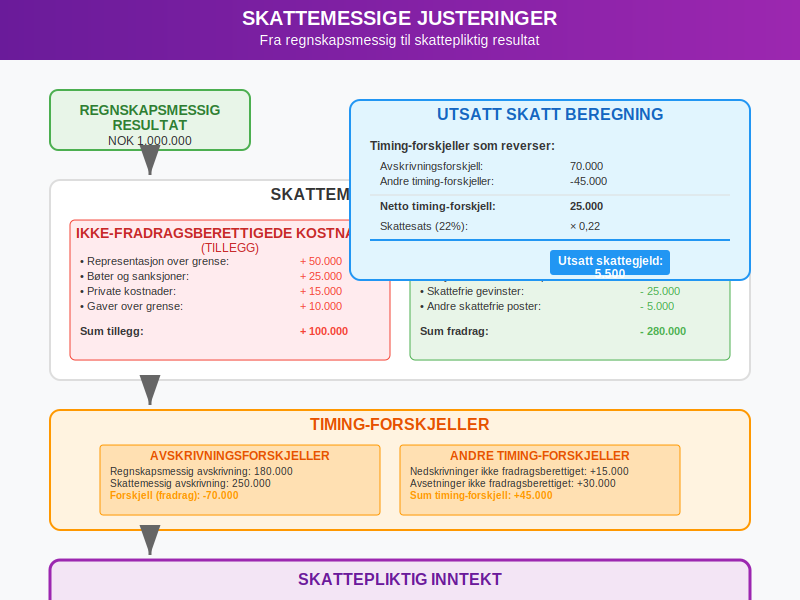

## Seksjon 10: Kvalitetssikring og Internkontroll

### 10.1 Systematisk Kvalitetskontroll

**Kvalitetssikring** av årsavslutningen krever systematisk tilnærming:

#### 10.1.1 Analytiske Prosedyrer

**Sammenligning med forrige år:**
* Analyse av vesentlige endringer i balanseposter
* Forklaring av avvik i størrelsesorden og utviklingstrender
* Kontroll av [nøkkeltall](/blogs/regnskap/hva-er-nokkeltall "Hva er Nøkkeltall? Komplett Guide til Finansielle Nøkkeltall i Regnskap") og forhold

**Budsjett- og prognosesammenligninger:**
* Avviksanalyse mot opprinnelige budsjetter
* Forklaring av større avvik fra prognoser
* Vurdering av realisme i forutsetninger

#### 10.1.2 Detaljkontroller

**Stikkprøvekontroller:**
* Tilfeldig utvalg av transaksjoner for detaljkontroll
* Sporing av transaksjoner fra bilag til hovedbok
* Kontroll av godkjennings- og autorisasjonsrutiner

**Fullstendighetskontroller:**
* Kontroll av nummerserier på fakturaer og bilag
* Avstemming av sub-ledgers mot hovedbok
* Kontroll av at alle perioder og avdelinger er inkludert

### 10.2 Internkontrollsystemer

#### 10.2.1 Fire-øyne-prinsippet

**Segregering av oppgaver:**
* Adskillelse mellom autorisasjon, registrering og oppbevaring
* Krav om to signaturer på betalinger over definerte beløpsgrenser
* Rotasjon av personale i sensitive funksjoner

#### 10.2.2 Dokumentasjon og Sporbarhiet

**Kontrollspor:**
* Komplett dokumentasjon av alle justeringsposter
* Godkjenning og autorisasjon av alle endringer
* Oppbevaring av støttedokumentasjon og analyser

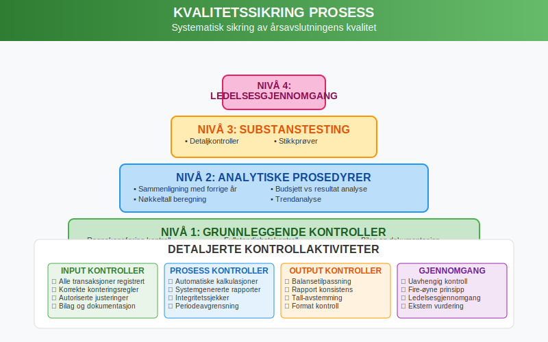

## Seksjon 11: Digitalisering og Moderne Verktøy

### 11.1 Teknologiske Løsninger

**Moderne regnskapssystemer** tilbyr avanserte funksjoner for årsavslutning:

#### 11.1.1 Automatiserte Prosesser

**Automatiske avstemminger:**
* Bankavstemminger med direkte integrasjon
* Automatisk matching av fakturaer og betalinger
* Systemgenererte periodiseringsposter

**Intelligent dataanalyse:**
* Automatisk identifikasjon av uvanlige transaksjoner
* Predictive analytics for risikostyring
* Real-time overvåking av [nøkkeltall](/blogs/regnskap/hva-er-nokkeltall "Hva er Nøkkeltall? Komplett Guide til Finansielle Nøkkeltall i Regnskap")

#### 11.1.2 Integrasjon og Dataflyt

**ERP-systemer:**
* Sømløs integrasjon mellom moduler (regnskap, lager, innkjøp, salg)
* Eliminering av manuell datainntasting og overføringer
* Real-time oppdatering av finansielle data

**Eksterne integrasjoner:**
* Direkte kobling til banker for kontooversikter
* Automatisk import av kursinformasjon
* Integrasjon med offentlige rapporteringsportaler

### 11.2 Kunstig Intelligens og Maskinlæring

#### 11.2.1 Automatisk Kategorisering

**Smart bokføring:**
* AI-basert kategorisering av transaksjoner
* Læring fra historiske data og mønstre
* Reduksjon av manuelle feil og tidsforbruk

#### 11.2.2 Prediktiv Analyse

**Risikostyring:**
* Tidlig identifikasjon av potensielle problemer
* Prognosemodeller for [kontantstrøm](/blogs/regnskap/hva-er-kontantstrom "Hva er Kontantstrøm? Komplett Guide til Cash Flow Analyse og Styring")
* Automatisk varsling ved avvik fra normalmønstre

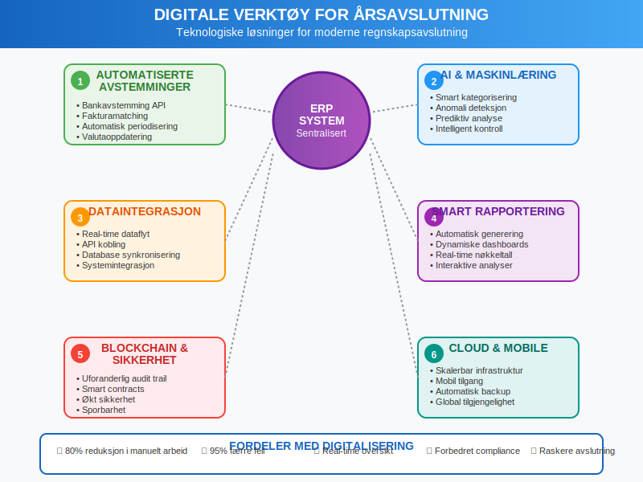

## Seksjon 12: Rapportering og Kommunikasjon

### 12.1 Finansielle Rapporter

Ã…rsavslutningen resulterer i flere kritiske finansielle rapporter:

#### 12.1.1 Hovedregnskaper

**Resultatregnskap:**
* Systematisk presentasjon av inntekter og kostnader
* Klassifisering etter art eller funksjon
* Sammenligningstall fra foregående år

**[Balanse](/blogs/regnskap/hva-er-balanse "Hva er Balanse i Regnskap? Komplett Guide til Balansens Oppbygging og Funksjon"):**
* Fullstendig oversikt over eiendeler, gjeld og [egenkapital](/blogs/regnskap/hva-er-egenkapital "Hva er Egenkapital? Komplett Guide til Egenkapital i Regnskap")
* Korrekt klassifisering mellom kortsiktige og langsiktige poster
* Noteinformasjon for komplekse poster

**[Kontantstrømoppstilling](/blogs/regnskap/hva-er-kontantstrom "Hva er Kontantstrøm? Komplett Guide til Cash Flow Analyse og Styring"):**
* Analysere [kontantstrømmer](/blogs/regnskap/hva-er-kontantstrom "Hva er Kontantstrøm? Komplett Guide til Cash Flow Analyse og Styring") fra drift, investering og finansiering
* Forklaring av endringer i [kontantbeholdning](/blogs/regnskap/hva-er-kassebeholdning "Hva er Kassebeholdning? Komplett Guide til Kontanter og Likvide Midler")
* Grunnlag for likviditetsanalyse

#### 12.1.2 Tilleggsrapporter

**Noter til regnskapet:**
* Detaljert forklaring av regnskapsprinsipper
* Utfyllende informasjon om større balanseposte
* Informasjon om betingede forpliktelser og usikkerhet

**Ã…rsberetning:**
* Ledelsens vurdering av resultater og utvikling
* Redegjørelse for fremtidsutsikter og strategier
* Informasjon om vesentlige hendelser og risikofaktorer

### 12.2 Interessentkommunikasjon

#### 12.2.1 Interne Interessenter

**Eiere og investorer:**
* Presentasjon av årsresultater og nøkkeltall
* Forklaring av strategiske initiativ og investeringer
* Prognoser og fremtidsutsikter

**Ledelse:**
* Detaljerte management-rapporter med analyser
* Budsjett- og prognoseavvik
* Rekommandasjoner for forbedringer

#### 12.2.2 Eksterne Interessenter

**Finansinstitusjoner:**
* Bankrapporter og covenant-dokumentasjon
* Likviditets- og soliditetsanalyser
* Informasjon om betydelige endringer i risikoprofil

**Offentlige myndigheter:**
* Selvangivelse for bedrifter
* MVA-oppgjør og -avstemminger
* Statistisk rapportering til SSB og andre organer

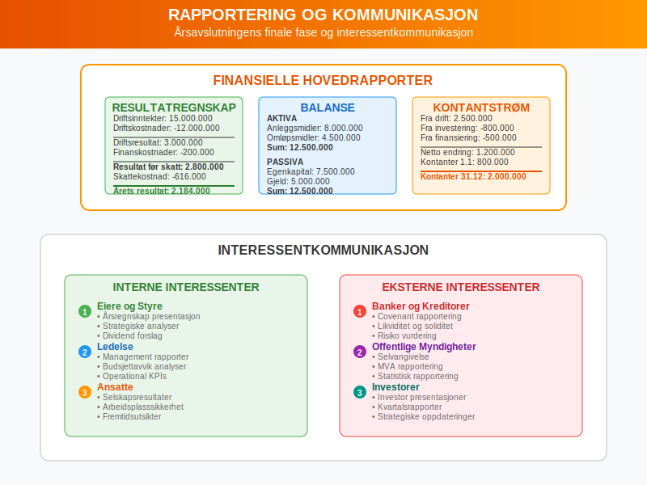

## Seksjon 13: Spesielle Situasjoner og Utfordringer

### 13.1 Fusjoner og Oppkjøp

**Ã…rsavslutning ved selskapsendringer** krever spesiell oppmerksomhet:

#### 13.1.1 Fusjonsprosessen

**Regnskapsmessige vurderinger:**
* Verdsettelse av eiendeler og gjeld på overtakelsestidspunktet
* Identifikasjon og måling av goodwill
* Harmonisering av regnskapsprinsipper
* Eliminering av interne transaksjoner

#### 13.1.2 Oppkjøpsregnskapet

**Allokering av kjøpspris:**
* Identifikasjon av identifiserbare eiendeler og forpliktelser
* Måling til virkelig verdi på kjøpstidspunktet
* Beregning av goodwill som restverdi
* Periodisering av transaksjonskoste

### 13.2 Internasjonale Operasjoner

#### 13.2.1 Valutaomregning

**Transaksjoner i utenlandsk valuta:**
* Måling på transaksjonstidspunktet til spotkurs
* Omregning av monetære poster på balansedagen
* HÃ¥ndtering av [valutagevinster](/blogs/kontoplan/8060-valutagevinst-agio "Konto 8060 - Valutagevinst (Agio)") og -tap
* Sikringsregnskapsføring ved relevant

**Utenlandske datterselskaper:**
* Omregning av årsregnskap til rapporteringsvaluta
* HÃ¥ndtering av omregningsdifferanser
* Konsolidering med morselskap

#### 13.2.2 Transfer Pricing

**Internprising mellom konsernselskaper:**
* Dokumentasjon av armlengdes prinsipp
* Vurdering av prisfastsettelse på immaterielle eiendeler
* Overholdelse av lokale dokumentasjonskrav
* Risikostyring relatert til skattemessige justeringer

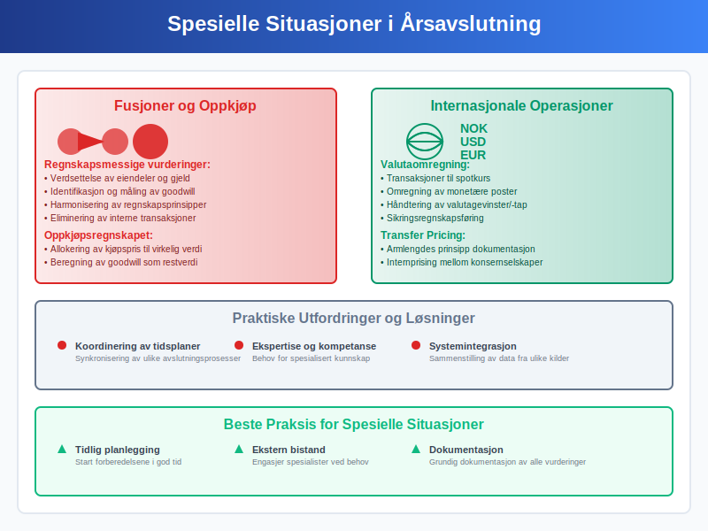

## Seksjon 14: Fremtidige Trender og Utvikling

### 14.1 Regulatoriske Endringer

**Regnskapsstandarder** utvikler seg kontinuerlig:

#### 14.1.1 IFRS-utvikling

**Nye standarder:**
* IFRS 16 Leieavtaler og dens praktiske implementering
* IFRS 17 Forsikringskontrakter for relevante virksomheter
* Kontinuerlige oppdateringer og tolkningsuttalelser

#### 14.1.2 Nasjonal Tilpasning

**Norske særregler:**
* Tilpasninger til norske forhold og tradisjon
* Forenklingsregler for små og mellomstore bedrifter
* Koordinering med skattelovgivning

### 14.2 Teknologisk Revolusjon

#### 14.2.1 Blockchain og Distribuerte Ledgers

**Potensielle anvendelser:**
* Økt sikkerhet og sporbarhet i transaksjonsregistrering
* Automatisering av komplekse transaksjoner gjennom smart contracts
* Reduksjon av avstemmings- og kontrollbehov

#### 14.2.2 Avansert Analyse og AI

**Fremtidens muligheter:**
* Prediktive modeller for risikostyring og prognoser
* Automatisk generering av finansielle rapporter
* Intelligent identifikasjon av feil og uregelmessigheter

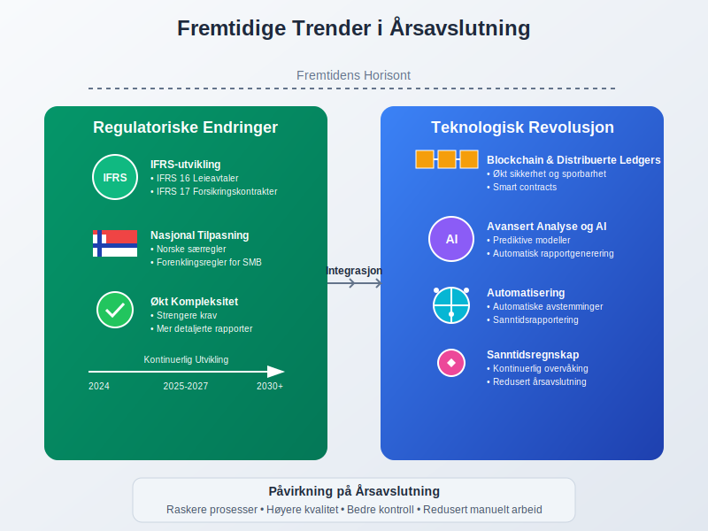

## Seksjon 15: Praktiske Tips og Beste Praksis

### 15.1 Planlegging og Forberedelse

**Vellykkede årsavslutninger** bygger på solid planlegging:

#### 15.1.1 Tidlig Start

* **Månedlige avstemminger:** Sørg for at alle kontoer stemmer hver måned
* **Kvartalsvise gjennomganger:** Identifiser potensielle problemer tidlig
* **Løpende dokumentasjon:** Oppretthold fullstendig dokumentasjon gjennom året

#### 15.1.2 Kompetanseutvikling

* **Opplæring:** Sørg for at personalet har nødvendig kompetanse
* **Ekstern bistand:** Planlegg behov for spesialisthjelp i god tid
* **Kvalitetssikring:** Etabler robuste kontrollrutiner

### 15.2 Effektivisering av Prosessen

#### 15.2.1 Standardisering

**Prosedyrer og sjekklister:**
* Detaljerte arbeidsoppgaver med ansvarsdeling
* Standardiserte arbeidsformer og dokumentmaler
* Tidsplaner med milepæler og kontrollpunkter

#### 15.2.2 Teknologi som Hjelpemiddel

**Digitale løsninger:**
* Maksimer bruken av automatiske funksjoner
* Invester i integrasjon mellom systemer
* Utnytt analyseverktøy for effektiv kontroll

## Konklusjon

**Årsavslutning** er en omfattende og kritisk prosess som krever systematisk planlegging, teknisk kompetanse og grundig kvalitetskontroll. Prosessen sikrer at virksomhetens finansielle rapporter gir et rettvisende bilde av den økonomiske situasjonen og overholder alle relevante regnskapsstandarder og juridiske krav.

### Sentrale Suksessfaktorer

**Planlegging og organisering:**
* Tidlig start med systematisk gjennomgang av alle områder
* Klar ansvarsdeling og kompetent personale
* Tilstrekkelige ressurser og realistiske tidsfrister

**Teknisk gjennomføring:**
* Grundig [avstemming](/blogs/regnskap/hva-er-avstemming "Hva er Avstemming i Regnskap? Komplett Guide til Regnskapsavstemming") og [avregning](/blogs/regnskap/hva-er-avregning "Hva er Avregning i Regnskap? Komplett Guide til Avregning") av alle balanseposter
* Korrekte [periodiseringer](/blogs/regnskap/hva-er-periodisering "Hva er Periodisering i Regnskap? Komplett Guide til Periodiseringsprinsippet") og justeringsposter
* Nøyaktige [avskrivnings](/blogs/regnskap/hva-er-avskrivning "Hva er Avskrivning? Komplett Guide til Avskrivningsmetoder")- og verdivurderinger

**Kvalitetssikring:**
* Systematiske kontrollprosedyrer og analytiske tester
* Dokumentasjon av alle vesentlige vurderinger og beslutninger
* Uavhengig gjennomgang og godkjenning

### Fremtidens Ã…rsavslutning

Teknologisk utvikling vil fortsette å transformere årsavslutningsprosessen med økt automatisering, kunstig intelligens og sanntidsrapportering. Samtidig vil regulatoriske krav og kompleksitet trolig øke, noe som understreker viktigheten av solid kompetanse og robuste prosesser.

Den moderne årsavslutningen representerer en balanse mellom tradisjonell regnskapsføring og innovativ teknologi, hvor målet er å levere pålitelige finansielle rapporter som tjener virksomhetens interessenter og støtter strategiske beslutninger. En vellykket årsavslutning danner ikke bare grunnlaget for lovpålagt rapportering, men fungerer også som et strategisk verktøy for analyse, planlegging og kommunikasjon med virksomhetens interessenter.

