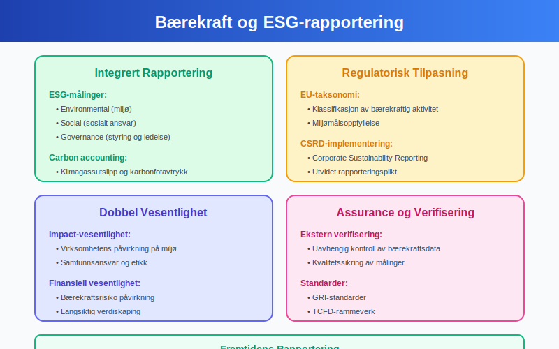

**Årsoppgave** er den obligatoriske skatterapporteringen som alle norske virksomheter må levere årlig til Skatteetaten. Denne omfattende rapporten inneholder detaljert informasjon om virksomhetens økonomiske aktivitet, inkludert inntekter, kostnader, eiendeler og gjeld. Årsoppgaven danner grunnlaget for [skatteberegning](/blogs/regnskap/hva-er-skatt "Hva er Skatt? Komplett Guide til Norsk Skattesystem og Skatteberegning"), offentlig statistikk og tilsyn, og er en sentral del av norsk skatte- og regnskapssystem.

Merk at årsoppgave er forskjellig fra [årsberetning](/blogs/regnskap/arsberetning "Årsberetning: Innhold, Krav og Guide til Norsk Årsberetning"), som dekker hele regnskapets årsrapport med ledelsesberetning, noter og revisjonsberetning.

## Seksjon 1: Ã…rsoppgavens Grunnleggende Funksjon

**Årsoppgave** representerer den formelle kommunikasjonen mellom virksomheter og norske skattemyndigheter. Dette systemet sikrer transparent rapportering av økonomisk aktivitet og danner grunnlaget for rettferdig beskatning og samfunnsøkonomisk planlegging.

### 1.1 Definisjonen av Ã…rsoppgave

**Årsoppgave** er den standardiserte skjemaet hvor virksomheter rapporterer sin økonomiske aktivitet for et helt regnskapsår. Rapporten inkluderer:

* **Resultatoppstilling:** Systematisk presentasjon av inntekter og kostnader
* **Balanseoppstilling:** Fullstendig oversikt over eiendeler, gjeld og [egenkapital](/blogs/regnskap/hva-er-egenkapital "Hva er Egenkapital? Komplett Guide til Egenkapital i Regnskap")
* **Tilleggsinformasjon:** Spesifikke opplysninger for skatteberegning og statistikk
* **Spesialskjemaer:** Ytterligere dokumentasjon avhengig av virksomhetstype

### 1.2 Juridisk Grunnlag og Hjemmel

Plikten til å levere årsoppgave er hjemlet i:

* **Skatteloven:** Grunnleggende bestemmelser om rapporteringsplikt
* **Ligningsloven:** Detaljerte regler for dokumentasjon og kontroll
* **Regnskapsloven:** Krav til regnskapsmessig grunnlag
* **Bokføringsloven:** Dokumentasjons- og oppbevaringskrav

### 1.3 Formål med Årsoppgave

**Samfunnsøkonomiske formål:**

* **Skatteinnkreving:** Sikrer korrekt beregning av [skatter](/blogs/regnskap/hva-er-skatt "Hva er Skatt? Komplett Guide til Norsk Skattesystem og Skatteberegning") og avgifter
* **Statistikkproduksjon:** Grunnlag for nasjonal regnskapsføring og økonomisk analyse
* **Tilsynsvirksomhet:** Muliggjør kontroll og etterlevelsestilsyn
* **Forskningsdata:** Bidrar til samfunnsforskning og politikkutvikling

**Virksomhetsformål:**

* **Skatteoptimalisering:** Identifisering av lovlige skattefordeler
* **Finansiell dokumentasjon:** Offisiell bekreftelse på økonomisk status
* **Kredittgrunnlag:** Dokumentasjon overfor finansinstitusjoner
* **Strategisk planlegging:** Grunnlag for fremtidig forretningsutvikling

## Seksjon 2: Rapporteringspliktige Virksomheter

### 2.1 Omfattede Virksomhetstyper

**Alle norske virksomheter** med økonomisk aktivitet har rapporteringsplikt:

#### 2.1.1 Aksjeselskaper og Allmennaksjeselskaper

**Kapitalselskaper** har omfattende rapporteringsplikt:

* **Ordinære AS:** Full årsoppgave med alle vedlegg
* **ASA:** Utvidet rapportering inkludert børsrelaterte opplysninger
* **Holdingselskaper:** Spesiell fokus på investeringer og konsernforhold
* **Datterselskaper:** Individuell rapportering uavhengig av konsernstruktur

**Tilleggskrav for aksjeselskaper:** I tillegg til årsoppgaven må alle aksjeselskaper levere [aksjonærregisteroppgave](/blogs/regnskap/aksjonaerregisteroppgave "Hva er Aksjonærregisteroppgave? Komplett Guide til Årlig Rapportering") som dokumenterer eierforhold og aksjonærstruktur.

#### 2.1.2 Personlige Foretak og Enkeltpersonforetak

**Enkeltpersonforetak** har forenklet rapportering:

* **Næringsdrivende:** Næringsoppgave (N1) som del av personlig selvangivelse
* [**Primærnæringer**](/blogs/regnskap/primarnaring "Hva er primærnæring? Komplett Guide til Primærnæring i Regnskap"): Spesialiserte skjemaer for landbruk og fiske
* **Frilansere:** Forenklet rapportering gjennom selvangivelse
* **Små virksomheter:** Reduserte krav avhengig av omsetning

#### 2.1.3 Partnerskap og Ansvarlige Selskaper

**Samvirkeforetak og partnerskap:**

* **ANS og DA:** Egen årsoppgave plus deltakeropplysninger
* **Samvirkeforetak:** Modifisert rapportering tilpasset samvirkestruktur
* **Kommandittselskap:** Separate rapporter for komplementar og kommandittister
* **Fylkeskommuner og kommuner:** Spesialiserte offentlige rapporteringsformer

### 2.2 Fritak og Unntak

#### 2.2.1 Virksomheter med Begrenset Rapporteringsplikt

**Små virksomheter** kan kvalifisere for reduserte krav:

* **Omsetningsgrense:** Under NOK 5 millioner årlig omsetning
* **Enkel virksomhet:** Få transaksjoner og enkle økonomiske forhold
* **Ideelle organisasjoner:** Begrenset til næringsaktivitet
* **Passive investeringsselskaper:** Forenklet rapportering for rene investeringer

#### 2.2.2 Midlertidige Fritak

**Spesielle situasjoner** kan gi midlertidig fritak:

* **Oppstart:** Nye virksomheter i etableringsfase
* **Avvikling:** Selskaper under avvikling med spesielle regler
* **Konkurs:** Modifiserte rapporteringskrav under konkursbehandling
* **Restrukturering:** Spesielle regler ved fusjon og fisjon

## Seksjon 3: Innhold og Komponenter i Ã…rsoppgave

### 3.1 Hovedskjemaer og Skjemastruktur

**Årsoppgaven** består av flere integrerte skjemaer som til sammen gir et komplett bilde av virksomhetens økonomiske aktivitet:

#### 3.1.1 Resultatregnskap (RF-1167)

**Resultatregnskapet** presenterer virksomhetens inntekter og kostnader:

| **Post** | **Beskrivelse** | **Referanse** | **Skattemessig Behandling** |
|----------|-----------------|---------------|------------------------------|
| Salgsinntekt | Brutto salg av varer og tjenester | Note 1 | Inntektsføres ved levering |
| [Varekostnad](/blogs/regnskap/hva-er-varekostnad "Hva er Varekostnad? Komplett Guide til Innkjøpskostnader og Lagerregnskapsføring") | Direkte kostnader ved solgte varer | Note 2 | Fradragsberettiget |
| [Lønnskostnader](/blogs/regnskap/hva-er-lonn "Hva er Lønn? Komplett Guide til Lønnsregnskapsføring") | Total personalkostnad | Note 3 | Fradrag med begrensninger |
| [Avskrivninger](/blogs/regnskap/hva-er-avskrivning "Hva er Avskrivning? Komplett Guide til Avskrivningsmetoder") | Systematisk verdireduksjon | Note 4 | Etter skattemessige satser |
| Finansinntekter | Renter og utbytte | Note 5 | Delvis skattefritt |

#### 3.1.2 Balanse (RF-1175)

**Balansen** viser virksomhetens økonomiske stilling på slutten av regnskapsåret:

**Eiendeler (Aktiva):**

* **[Anleggsmidler](/blogs/regnskap/hva-er-anleggsmidler "Hva er Anleggsmidler? Komplett Guide til Faste Eiendeler"):** Bygninger, maskiner og immaterielle eiendeler
* **[Omløpsmidler](/blogs/regnskap/hva-er-omlopsmiddel "Hva er Omløpsmiddel? Komplett Guide til Kortsiktige Eiendeler"):** [Varelager](/blogs/regnskap/hva-er-varelager "Hva er Varelager? Komplett Guide til Lagerregnskapsføring og Verdivurdering"), fordringer og kontanter
* **Finansielle eiendeler:** Aksjer, obligasjoner og andre investeringer

**Egenkapital og Gjeld (Passiva):**

* **[Egenkapital](/blogs/regnskap/hva-er-egenkapital "Hva er Egenkapital? Komplett Guide til Egenkapital i Regnskap"):** [Aksjekapital](/blogs/regnskap/hva-er-aksjekapital "Hva er Aksjekapital? Komplett Guide til Egenkapital i AS") og opptjent egenkapital
* **Langsiktig gjeld:** Lån og forpliktelser over ett år
* **Kortsiktig gjeld:** [Leverandørgjeld](/blogs/regnskap/hva-er-leverandorgjeld "Hva er Leverandørgjeld i Regnskap? En Komplett Guide til Kreditorhåndtering") og andre kortsiktige forpliktelser

### 3.2 Tilleggsskjemaer og Spesifikke Opplysninger

#### 3.2.1 Skatteposisjonsoppgave (SN-1122)

**Skatteposisjon** presenterer beregningen fra regnskapsmessig til skattepliktig resultat:

* **Permanente forskjeller:** Poster som aldri blir skattemessig relevante
* **Midlertidige forskjeller:** Timing-forskjeller mellom regnskap og skatt
* **Fremførbare underskudd:** Ubrukte skattemessige underskudd
* **[Utsatt skatt](/blogs/regnskap/hva-er-utsatt-skatt "Hva er Utsatt Skatt? Komplett Guide til Skatteperiodisering"):** Beregning av fremtidige skattekonsekvenser

#### 3.2.2 Spesifikasjon av Balanseposter

**Detaljerte oppgaver** for utvalgte balanseposter:

* **[Varige driftsmidler](/blogs/regnskap/hva-er-varige-driftsmidler "Hva er Varige Driftsmidler? Komplett Guide til Materielle Anleggsmidler"):** Anskaffelseskost, avskrivninger og bokført verdi
* **Fordringer:** Alteringsanalyse og tapsavsettelser
* **Gjeld:** Forfallsanalyse og renteforhold
* **Egenkapital:** Endringer i [aksjekapital](/blogs/regnskap/hva-er-aksjekapital "Hva er Aksjekapital? Komplett Guide til Egenkapital i AS") og opptjent kapital

#### 3.2.3 Internasjonale Forhold

**Grenseoverskridende transaksjoner** krever spesiell rapportering:

* **Transfer pricing:** Dokumentasjon av internprising
* **Kontrollerte utenlandske selskaper (CFC):** Rapportering av CFC-inntekt
* **Utbytte fra utlandet:** Skattegrunnlag og kreditberegning
* **Permanent etablering:** Aktivitet i utlandet gjennom fast driftssted

## Seksjon 4: Tidsfrister og Innleveringsprosess

### 4.1 Ordinære Frister

**Årsoppgaven** har strenge tidsfrister som må overholdes:

#### 4.1.1 Hovedregel for Innlevering

**Ordinær frist:** 31. mai følgende år

* **Aksjeselskaper:** Senest 31. mai for foregående regnskapsår
* **Personlige foretak:** Integrert med selvangivelse, frist 30. april/31. mai
* **Samvirkeforetak:** Samme frist som aksjeselskaper
* **Offentlige virksomheter:** Kan ha spesielle frister

#### 4.1.2 Spesielle Frister

**Forskjøvet regnskapsår:**

* **Variert regnskapsår:** Frist 5 måneder etter regnskapsårets slutt
* **Avvikende regnskapsår:** Tilpassede frister for spesielle bransjer
* **Konsernrapportering:** Koordinerte frister for morselskap og datterselskaper

### 4.2 Utsettelse og Forsinkelse

#### 4.2.1 Søknad om Utsettelse

**Forhåndssøknad** kan innvilges i spesielle tilfeller:

* **Ekstraordinære omstendigheter:** Force majeure situasjoner
* **Komplekse regnskapsforhold:** Omfattende transaksjoner som krever ekstra tid
* **Systemproblemer:** Tekniske utfordringer med rapporteringssystemer
* **Revisorkapasitet:** Begrenset tilgang på kvalifiserte revisorer

#### 4.2.2 Konsekvenser av Forsinkelse

**Sanksjonssystem** for for sen innlevering:

| **Forsinkelse** | **Gebyr** | **Ytterligere Konsekvenser** |
|-----------------|-----------|-------------------------------|
| 1-30 dager | NOK 5.000 | Formell påminnelse |
| 31-60 dager | NOK 10.000 | Tvangsmulkt kan ilegges |
| Over 60 dager | NOK 20.000 + | Ytterligere sanksjonsmuligheter |
| Gjentagende | Forhøyet gebyr | Potensielle strafferettslige konsekvenser |

### 4.3 Elektronisk Innlevering

#### 4.3.1 Altinn-plattformen

**Digital rapportering** gjennom Altinn er standardløsning:

* **Obligatorisk elektronisk levering:** For alle virksomheter over visse terskler
* **Brukerautentisering:** ID-porten eller virksomhetssertifikat
* **Integrasjon:** Direkteinnlevering fra regnskapssystemer
* **Bekreftelse:** Automatisk kvittering ved mottatt oppgave

#### 4.3.2 Systemintegrasjon

**Regnskapssystemer** kan integreres direkte:

* **API-tilkobling:** Direkte kommunikasjon mellom systemer
* **Standardformater:** XBRL og andre strukturerte rapporteringsformater
* **Automatisk validering:** Kontroll av fullstendighet og konsistens
* **Feilhåndtering:** Automatisk identifikasjon og rapportering av feil

## Seksjon 5: Skatteberegning og Skattepliktig Inntekt

### 5.1 Fra Regnskapsmessig til Skattepliktig Resultat

**Transformasjonsprosessen** fra regnskapsføring til skatteberegning krever systematiske justeringer:

#### 5.1.1 Permanente Forskjeller

**Permanente forskjeller** påvirker aldri fremtidig skatteberegning:

**Ikke-fradragsberettigede kostnader:**

* **Representasjon over grensen:** Kun 50% av representasjonskostnader er fradragsberettiget
* **Gaver og tilskudd:** Begrensede fradragsmuligheter for gaver til ansatte
* **Bøter og sanksjoner:** Administrative og strafferettslige sanksjoner
* **Private kostnader:** Kostnader uten tilknytning til næringsvirksomhet

**Skattefrie inntekter:**

* **Utbytte:** Fritaksmodellen for utbytte fra kvalifiserte eierandeler
* **Gevinster:** Fritaksmodellen for salg av aksjer og andeler
* **Konsernbidrag:** Mottatte konsernbidrag mellom norske selskaper
* **Offentlige tilskudd:** Visse former for offentlig støtte

#### 5.1.2 Midlertidige Forskjeller (Timing-forskjeller)

**Midlertidige forskjeller** utlignes over tid og skaper [utsatt skatt](/blogs/regnskap/hva-er-utsatt-skatt "Hva er Utsatt Skatt? Komplett Guide til Skatteperiodisering"):

**Avskrivningsforskjeller:**

* **Regnskapsmessige avskrivninger:** Lineære eller degressiv over økonomisk levetid
* **Skattemessige avskrivninger:** [Saldoavskrivning](/blogs/regnskap/hva-er-saldoavskrivning "Hva er Saldoavskrivning i Regnskap? Komplett Guide til Degressiv Avskrivning") etter maksimalsatser
* **Forskjellsbehandling:** Ulike prinsipper skaper timing-forskjeller
* **Skattemessige saldogrupper:** Spesifikke avskrivningssatser per aktivatype

**Andre timing-forskjeller:**

* **Nedskrivninger:** Ulik behandling av verdijusteringer
* **Avsetninger:** Skattemessig fradrag først ved faktisk utbetaling
* **[Periodiseringer](/blogs/regnskap/hva-er-periodisering "Hva er Periodisering i Regnskap? Komplett Guide til Periodiseringsprinsippet"):** Forskjeller i timing for inntekts- og kostnadsføring
* **Valutatap og -gevinst:** Ulik realisasjonstidspunkt

### 5.2 Spesielle Skatteposisjoner

#### 5.2.1 Framførbare Underskudd

**Skattemessige underskudd** kan fremføres til senere års anvendelse:

* **Fremføringsprinsinpp:** Ubegrenset fremføring i tid
* **Anvendelse:** Motregning mot fremtidige positive inntekter
* **Prioritetsrekkefølge:** Eldste underskudd anvendes først
* **Dokumentasjon:** Kontinuerlig sporing av ubrukte underskudd

#### 5.2.2 Tonnasjeskatteordning

**Spesiell beskatningsform** for skipsfart:

* **Kvalifikasjonskrav:** Strategisk viktig skipsfart i internasjonal fart
* **Beregningsgrunnlag:** Tonnasje fremfor inntekt som skattebase
* **Særregler:** Modifiserte regler for avskrivninger og finansiering
* **Tidsbegrensning:** Bindende valg for 10-Ã¥rsperioder

#### 5.2.3 Petroleum og Kraftproduksjon

**Særskilte skatteordninger** for naturressursindustrier:

* **Petroleumsskatt:** Ekstra skatt på 56% utover ordinær selskapsskatt
* **Grunnrenteskatt:** Særskatt på vannkraftproduksjon
* **Spesielle fradrag:** Fritaksperioder og særfradrag for leting og utvikling
* **Uplift-ordning:** Ekstra avskriningsgrunnlag for investeringer

### 5.3 Internasjonale Skatteforhold

#### 5.3.1 Transfer Pricing

**Internprising** mellom nærstående selskaper må dokumenteres:

* **Armlengdeprinsippet:** Prising som mellom uavhengige parter
* **Dokumentasjonskrav:** Master file og local file dokumentasjon
* **Forhåndssamtykke (APA):** Bindende avtaler om prisfastsettelse
* **Risikostyring:** Identifikasjon og håndtering av transfer pricing-risiko

#### 5.3.2 Kontrollerte Utenlandske Selskaper (CFC)

**CFC-reglene** sikrer norsk beskatning av passiv kapitalinntekt:

* **Kontrollterskler:** Norsk kontroll over 50% av stemmer eller kapital
* **Skattesatskriterium:** Utenlandsk effektiv skattesats under 18.5%
* **Gjennomskjæring:** Norsk beskatning av CFC-inntekt som utbytte
* **Beregningsmetodikk:** Systematisk beregning av tilleggsbeskatning

## Seksjon 6: Kontroll og Etterlevelse

### 6.1 Skatteforvaltningens Kontrollvirksomhet

**Skatteetaten** har omfattende kontrollmyndighet for å sikre korrekt rapportering:

#### 6.1.1 Automatiserte Kontroller

**Systemkontroller** identifiserer potensielle feil og avvik:

* **Konsistenssjekker:** Kryssjekk mellom relaterte poster i årsoppgaven
* **Bransjesammenligninger:** Avviksanalyse mot branjesnøkkeltall
* **Historiske trender:** Identifikasjon av uvanlige endringer fra tidligere år
* **Manuell oppfølging:** Flagging av saker for manuell gjennomgang

#### 6.1.2 MÃ¥lrettede Kontroller

**Risikobaserte kontroller** fokuserer på høyrisiko områder:

* **Transfer pricing:** Kontroll av internasjonale konsern-transaksjoner
* **Fradragskontroll:** Verifisering av ekstraordinære eller store fradrag
* **Omsetningsrapportering:** Sammenligning med MVA-rapportering og tredjeparts opplysninger
* **Skatteplanlegging:** Analyse av aggressive skatteplanleggingsstrukturer

For en grundig oversikt over revisjon i Norge, se vår artikkel [Revisjon](/blogs/regnskap/revisjon "Revisjon – Alt du trenger å vite om Revisjon i Norge").

### 6.2 Revisjonsplikt og Ekstern Kontroll

#### 6.2.1 Revisjonsplikt for Ã…rsoppgave

**Revisjonsplikt** avhenger av virksomhetens størrelse og struktur:

**Obligatorisk revisjon:**

* **Aksjeselskaper:** Alle AS med omsetning over NOK 5 millioner
* **Allmennaksjeselskaper:** Alle ASA uavhengig av størrelse
* **Datterselskaper:** I konsern med revisjonsplikt
* **Spesielle bransjer:** Finansinstitusjoner og andre regulerte virksomheter

**Frivillig revisjon:**

* **Små AS:** Under terskelverdiene kan velge revisjon
* **Kredittformål:** Revisjon for å tilfredsstille eksterne krav
* **Kvalitetssikring:** Frivillig revisjon for ekstra kvalitetskontroll

#### 6.2.2 Revisors Ansvar og Oppgaver

**Statsautoriserte revisorer** har spesifikt ansvar relatert til årsoppgaven:

* **Attestering:** Bekreftelse på at årsoppgaven stemmer med revidert regnskap
* **Kvalitetskontroll:** Gjennomgang av skatteberegninger og justeringsposter
* **Rapportering:** Rapportering av vesentlige forhold til Skatteetaten
* **Rådgivning:** Proaktiv rådgivning om skattemessige konsekvenser

### 6.3 Sanksjoner og Rettsmidler

#### 6.3.1 Administrative Sanksjoner

**Skatteetaten** kan ilegge ulike former for sanksjoner:

**Tilleggsskatt:**

* **Uaktsom overtredelse:** 20% tilleggsskatt av utlignet tilleggsskatt
* **Grov uaktsomhet:** 40% tilleggsskatt ved grovere forhold
* **Forsett:** 60% tilleggsskatt ved forsettlige forhold
* **Beregningsgrunnlag:** Tilleggsskatt beregnes av hovedstol og renter

**Andre sanksjoner:**

* **Forsinkelsesgebyr:** Ved for sen innlevering av årsoppgave
* **Tvangsmulkt:** Ved vedvarende manglende innlevering
* **Ansvarliggjøring:** Personlig ansvar for ledelse i grove tilfeller

#### 6.3.2 Rettsmidler og Klageadgang

**Rettssikkerhet** sikres gjennom etablerte klageordninger:

* **Klagerett:** Klage til skatteklagenemnda innen 6 uker
* **Dokumentasjonsrett:** Rett til innsyn i saksbehandlingsgrunnlag
* **Domstolsprøving:** Adgang til søksmål mot skattevedtak
* **Midlertidig stansning:** Mulighet for midlertidig stansning av innkreving

## Seksjon 7: Bransjespesifikke Forhold

### 7.1 Særlige Bransjetilpasninger

**Ulike bransjer** har spesifikke rapporteringskrav og skatteregler:

#### 7.1.1 Finansielle Institusjoner

**Banker og finansselskaper** har utvidede rapporteringskrav:

* **Finanstilsynets rapportering:** Parallell rapportering til flere myndigheter
* **Særskilte skjemaer:** Spesialtilpassede årsoppgaveskjemaer
* **Avsetningsregler:** Spesielle regler for tapsavsetninger
* **Verdipapirhandel:** Komplekse regler for finansielle instrumenter

#### 7.1.2 Forsikringsselskaper

**Forsikringsbransjen** har særegne regnskaps- og skatteregler:

* **Forsikringstekniske avsetninger:** Aktuarberegninger og risikoevaluering
* **[Livsforsikring](/blogs/regnskap/hva-er-livsforsikring "Hva er Livsforsikring? Komplett Guide til Forsikringsregnskap"):** Langsiktige forpliktelser og investeringsforvaltning
* **Skadeforsikring:** Skadereserver og gjenforsikring
* **Solvensregulering:** Kapitaldekning og solvensmargin

#### 7.1.3 Eiendomsutvikling og -forvaltning

**Eiendomsbransjen** har spesielle verdivurderings- og periodiseringsspørsmål:

* **Prosjekteiendommer:** Vurdering av eiendommer under utvikling
* **Leieinntekter:** Periodisering og indeksregulering
* **Tomteselskap:** Særregler for tomteutvikling og -salg
* **REIT-struktur:** Eiendomsinvesteringsselskaper med særskatteordning

### 7.2 Internasjonale Konsern

#### 7.2.1 Konsernrapportering

**Multinasjonale konsern** møter komplekse rapporteringskrav:

* **Country-by-Country Reporting:** Detaljert rapportering per jurisdiksjon
* **Master File/Local File:** Dokumentasjon av transfer pricing-politikk
* **Substansrapportering:** Dokumentasjon av økonomisk realitet
* **Komparative studier:** Benchmarking mot sammenlignbare transaksjoner

#### 7.2.2 Hybridt finansiering og Instrumenter

**Komplekse finansielle strukturer** krever spesiell oppmerksomhet:

* **Hybride instrumenter:** Instrumenter med både gjelds- og egenkapitalkarakter
* **Konvertible obligasjoner:** Sammensatte finansielle instrumenter
* **Strukturerte produkter:** Komplekse derivatinstrumenter
* **Skattemessig asymmetri:** Ulik behandling i ulike jurisdiksjoner

## Seksjon 8: Digitalisering og Fremtidige Trender

### 8.1 Teknologisk Utvikling

**Digitaliseringen** transformerer årsoppgaveprosessen fundamentalt:

#### 8.1.1 Automatisering av Rapportering

**Teknologiske løsninger** effektiviserer rapporteringsprosessen:

* **AI-basert kategorisering:** Automatisk klassifisering av transaksjoner
* **Machine learning:** Læring fra historiske mønstre for bedre nøyaktighet
* **Robotprosessautomatisering (RPA):** Automatisering av repetitive oppgaver
* **Intelligent dokumenthåndtering:** Automatisk uttrykk av informasjon fra dokumenter

#### 8.1.2 Sanntidsrapportering

**Real-time data** muliggjør kontinuerlig overvåking:

* **Kontinuerlig avstemming:** Løpende avstemming mellom systemer
* **Prediktiv analyse:** Prognoser for skatteposisjon og resultater
* **Tidlig varslingssystemer:** Automatisk identifikasjon av potensielle problemer
* **Dashboard-løsninger:** Real-time oversikt over nøkkeltall og status

### 8.2 Regulatoriske Innovasjoner

#### 8.2.1 Strukturerte Data og XBRL

**Standardiserte rapporteringsformater** forbedrer datakvalitet:

* **XBRL-implementering:** Utvidet bruk av maskinlesbare formater
* **Taksonomiutvikling:** Standardiserte dataelementer og definisjoner
* **Validering og kvalitetskontroll:** Automatisk kontroll av konsistens og fullstendighet
* **Interoperabilitet:** Forbedret datautveksling mellom systemer

#### 8.2.2 Kunstig Intelligens i Tilsyn

**AI-teknologi** revolusjonerer skatteforvaltningens kontrollvirksomhet:

* **Anomalideteksjon:** Automatisk identifikasjon av uvanlige mønstre
* **Risikoprofilering:** Intelligent vurdering av kontrollbehov
* **Prediktiv modellering:** Prognoser for skatteunndragelse og feil
* **Automated audit:** Delvis automatisering av kontrollaktiviteter

### 8.3 Bærekraft og ESG-rapportering

#### 8.3.1 Integrert Rapportering

**Bærekraftsrapportering** integreres stadig mer med finansiell rapportering:

* **ESG-målinger:** Environmental, Social and Governance indikatorer
* **Carbon accounting:** Rapportering av klimagassutslipp og karbonfotavtrykk
* **Sosialt ansvar:** Dokumentasjon av samfunnsansvar og etiske praksis
* **Styrings- og ledelsesstrukturer:** Transparens omkring beslutningsprosesser

#### 8.3.2 Regulatory Tilpasning

**Lovgivning** tilpasser seg økte krav til bærekraftsrapportering:

* **EU-taksonomi:** Klassifikasjon av bærekraftige økonomiske aktiviteter
* **CSRD-implementering:** Corporate Sustainability Reporting Directive
* **Dobbel vesentlighet:** Impact og finansiell vesentlighetsvurdering
* **Assurance-krav:** Ekstern verifisering av bærekraftsdata

## Seksjon 9: Beste Praksis og Anbefalinger

### 9.1 Forberedelse og Planlegging

**Suksessful årsoppgavearbeid** krever systematisk tilnærming gjennom hele året:

#### 9.1.1 Ã…rshjul for Ã…rsoppgave

**Strukturert årsplanlegging** sikrer rettidig og korrekt rapportering:

**Første kvartal:**
* **Januar:** Forberedelse av foregående års årsoppgave
* **Februar:** Innsamling av dokumentasjon og avstemminger
* **Mars:** Utarbeidelse og kvalitetskontroll

**Andre kvartal:**
* **April:** Ferdigstillelse og intern godkjenning
* **Mai:** Innlevering til Skatteetaten innen fristen
* **Juni:** Oppfølging av eventuelle henvendelser fra myndighetene

**Tredje og fjerde kvartal:**
* **Juli-September:** Planlegging for kommende år og oppdatering av rutiner
* **Oktober-Desember:** Løpende forberedelser og [avstemminger](/blogs/regnskap/hva-er-avstemming "Hva er Avstemming i Regnskap? Komplett Guide til Regnskapsavstemming")

#### 9.1.2 Kompetanseutvikling

**Kontinuerlig læring** er essensielt for kvalitetssikring:

* **Faglig oppdatering:** Følge med på endringer i skattelovgivning
* **Systemkunnskap:** Holde seg oppdatert på rapporteringssystemer
* **Bransjekunnskap:** Forstå spesifikke utfordringer for egen bransje
* **Tverrfaglig samarbeid:** Koordinering mellom regnskap, skatt og jus

### 9.2 Kvalitetssikring og Internkontroll

#### 9.2.1 Systematiske Kontrollrutiner

**Robuste kvalitetskontroller** minimerer risiko for feil:

**Fire-øyne-prinsippet:**
* **Utarbeidelse:** En person utarbeider oppgaven
* **Gjennomgang:** Annen person gjennomgår for feil og manglar
* **Godkjenning:** Ansvarlig leder godkjenner før innlevering
* **Dokumentasjon:** Alle kontrollhandlinger dokumenteres

**Analytiske kontroller:**
* **Trendsanalyse:** Sammenligning med tidligere år
* **Bransjesammenligninger:** Benchmarking mot bransjenorm
* **Forholdstall:** Kontroll av sentrale finansielle nøkkeltall
* **Rimelighetskontroller:** Vurdering av usannsynlige størrelser

#### 9.2.2 Dokumentasjon og Arkivering

**Omfattende dokumentasjon** sikrer etterprøvbarhet og læring:

* **Arbeidsoppgaver:** Detaljerte beregninger og forutsetninger
* **Kontrollhandlinger:** Dokumentasjon av alle kvalitetskontroller
* **Korrespondanse:** Arkivering av kommunikasjon med eksterne parter
* **Backup og sikkerhet:** Sikring av digital dokumentasjon

### 9.3 Teknologi og Systemoptimalisering

#### 9.3.1 Systemintegrasjon

**Effektiv systemlandskap** reduserer manuelt arbeid og feilrisiko:

* **ERP-integrasjon:** Sømløs dataflyt fra regnskapssystem til rapportering
* **Automatiserte avstemminger:** Eliminering av manuelle avstemmingsprosesser
* **Valideringsregler:** Innbyggede kontroller for datakvalitet
* **Backup og redundans:** Sikring mot systemfeil og datatap

#### 9.3.2 Data Analytics og Innsikt

**Avanserte analytiske verktøy** gir bedre innsikt og kvalitet:

* **Dashboard-løsninger:** Real-time oversikt over status og nøkkeltall
* **Trendsanalyse:** Identifikasjon av mønstre og utviklingstrender
* **Avviksanalyse:** Automatisk flagging av uvanlige transaksjoner
* **Prognostisering:** Prediktive modeller for fremtidig utvikling

## Seksjon 10: Risikoer og Utfordringer

### 10.1 Vanlige Feilkilder

**Identifikasjon av typiske feil** hjelper virksomheter å unngå kostbare misstake:

#### 10.1.1 Regnskapsmessige Feil

**Fundamentale regnskapsfeil** påvirker årsoppgavens kvalitet:

* **[Periodiseringsfeil](/blogs/regnskap/hva-er-periodisering "Hva er Periodisering i Regnskap? Komplett Guide til Periodiseringsprinsippet"):** Feil timing av inntekts- og kostnadsføring
* **Klassifiseringsfeil:** Feil plassering av poster i regnskapet
* **MÃ¥lingsfeil:** Feil verdsettelse av eiendeler og forpliktelser
* **Fullstendighetsfeil:** Manglende registrering av transaksjoner

#### 10.1.2 Skattemessige Feilvurderinger

**Skatteberegningsfeil** kan få alvorlige konsekvenser:

* **Permanente vs. midlertidige forskjeller:** Feil kategorisering av skatteforskjeller
* **Fradragsberettigelse:** Feil vurdering av fradragsmuligheter
* **[Transfer pricing](/blogs/regnskap/hva-er-transfer-pricing "Hva er Transfer Pricing? Komplett Guide til Internprising"):** Manglende dokumentasjon eller feil prisfastsettelse
* **Internasjonale forhold:** Komplekse regler for grenseoverskridende transaksjoner

### 10.2 Compliance-risiko

#### 10.2.1 Regulatorisk Risiko

**Endringer i lovverk** skaper kontinuerlige utfordringer:

* **Ny lovgivning:** Implementering av nye regler og standarder
* **Tolkningsendringer:** Endret praksis fra myndigheter
* **Internasjonale standarder:** Tilpasning til globale rapporteringsstandarder
* **Overgangsbestemmelser:** HÃ¥ndtering av midlertidige ordninger

#### 10.2.2 Systemrisiko

**Teknologiske sårbarheter** kan kompromittere rapporteringsprosessen:

* **Systemfeil:** Tekniske problemer med regnskaps- eller rapporteringssystemer
* **Cybersikkerhet:** Databrudde og digital sabotasje
* **Integrasjonsutfall:** Feil i dataoverføringer mellom systemer
* **Manglende backup:** Tap av kritiske data og dokumentasjon

### 10.3 Organisatoriske Utfordringer

#### 10.3.1 Kompetanseutfordringer

**Mangel på kvalifisert personale** er en økende utfordring:

* **Kompleksitet:** Økte krav til faglig kompetanse
* **Kapasitetsmangel:** Begrenset tilgang på erfarne medarbeidere
* **Kompetanseutvikling:** Behov for kontinuerlig opplæring
* **Ressursplanlegging:** Balansering av interne og eksterne ressurser

#### 10.3.2 Endringshåndtering

**Organisatoriske endringer** påvirker rapporteringsevnen:

* **Selskapsstrukturer:** Fusjoner, oppdelinger og omorganiseringer
* **Systembytte:** Implementering av nye teknologiløsninger
* **Prosessendringer:** Utvikling av nye rutiner og arbeidsmetoder
* **Kulturelle faktorer:** Sikring av kvalitetsbevisst organisasjonskultur

## Konklusjon

**Årsoppgave** er en omfattende og kritisk virksomhet som krever systematisk tilnærming, høy faglig kompetanse og robust kvalitetssikring. Som den sentrale rapporteringsmekanismen mellom norsk næringsliv og skattemyndigheter, spiller årsoppgaven en fundamental rolle i skatteinnkrevingen, samfunnsøkonomisk planlegging og tilsynsvirksomhet.

### Sentrale Suksessfaktorer

**Grundig forberedelse:**
* Tidlig start med systematisk planlegging gjennom året
* Løpende [avstemminger](/blogs/regnskap/hva-er-avstemming "Hva er Avstemming i Regnskap? Komplett Guide til Regnskapsavstemming") og kvalitetskontroller
* Tydelig ansvarsdeling og kompetent personale

**Teknisk presisjon:**
* Korrekt transformasjon fra regnskapsmessig til skattepliktig resultat
* Nøyaktig håndtering av permanente og midlertidige forskjeller
* Systematisk dokumentasjon av alle vurderinger og beslutninger

**Regulatorisk compliance:**
* Overholdelse av frister og formelle krav
* Korrekt anvendelse av bransjespesifikke regler
* Proaktiv håndtering av internasjonale skatteforhold

### Fremtidsperspektiver

Teknologisk utvikling vil fortsette å transformere årsoppgaveprosessen med økt automatisering, kunstig intelligens og sanntidsrapportering. Samtidig vil regulatoriske krav, særlig knyttet til bærekraft og transparens, trolig øke i kompleksitet og omfang.

Virksomheter som investerer i robust teknologi, kompetent personale og systematiske prosesser vil være best posisjonert for å møte fremtidens utfordringer. [Årsoppgaven](/blogs/regnskap/hva-er-aarsoppgave "Hva er Årsoppgave i Regnskap? Komplett Guide til Skatteoppgjør og Årsrapportering") vil forbli en hjørnestein i norsk skatte- og regnskapssystem, men måten den utarbeides og leveres på vil utvikle seg kontinuerlig.

Den moderne årsoppgaven representerer mer enn kun skatteoverholdelse - den fungerer som en strategisk kommunikasjonskanal hvor virksomheter demonstrerer sin samfunnsansvar, økonomiske gjennomsiktighet og bidrag til fellesskapet. En vellykket årsoppgave bygger ikke bare tillit til skattemyndighetene, men styrker også virksomhetens kredibilitet overfor alle interessenter og støtter langsiktig verdisskaping.
