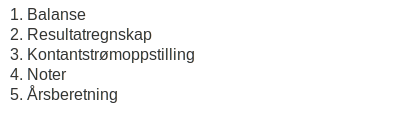

---
title: "Hva er Årsregnskap?"
seoTitle: "Hva er Årsregnskap?"
meta_description: '**Årsregnskap** er en lovpålagt, årlig rapport som gir en oppsummering av et foretaks finansielle stilling og resultater i løpet av en regnskapsperiode. År...'
slug: hva-er-aarsregnskap
type: blog
layout: pages/single
---

**Årsregnskap** er en lovpålagt, årlig rapport som gir en oppsummering av et foretaks finansielle stilling og resultater i løpet av en regnskapsperiode. Årsregnskapet består av flere regnskapsoppstillinger og tilleggsopplysninger som sammen gir en helhetlig innsikt i virksomhetens økonomi.

## Definisjon av Årsregnskap

Årsregnskapet er en formell rapport som viser et selskaps aktiviteter over en regnskapsperiode, vanligvis ett år. Rapporten omfatter både **balanse**, **resultatregnskap**, **kontantstrømoppstilling**, **noter** og ofte **årsberetning**, og utarbeides i henhold til norsk lovverk.

## Hvorfor er årsregnskap viktig?

- Dokumentasjon av økonomisk stilling for eierne
- Grunnlag for beslutninger hos investorer og kreditorer
- Krav for offentlig innsending til [Brønnøysundregistrene](/blogs/regnskap/bronnoysundregistrene "Brønnøysundregistrene - offentlige registre og tjenester")
- Underlag for skattemeldingen og skatteberegning
- Sikrer åpenhet og tillit hos interessenter

## Lovverk og krav

Utarbeidelse og presentasjon av årsregnskap reguleres primært av [bokføringsloven](/blogs/regnskap/hva-er-bokforingsloven "Hva er Bokføringsloven? Krav, Regler og Praktisk Veiledning") og [regnskapsloven](/blogs/regnskap/hva-er-regnskapsloven "Hva er Regnskapsloven? Lover, Krav og Ansvar i Norsk Regnskap"). For børsnoterte selskaper gjelder også [IFRS](/blogs/regnskap/hva-er-ifrs "Hva er IFRS? Komplett Guide til International Financial Reporting Standards").

## Hovedkomponenter i årsregnskapet

De viktigste delene av et årsregnskap er:

1.  **Balanse**: Oversikt over eiendeler, gjeld og egenkapital per balansedagen.
2.  **Resultatregnskap**: Viser inntekter og kostnader i perioden.
3.  **Kontantstrømoppstilling**: Sporer kontantstrøm fra drift, investering og finansiering.
4.  **Noter**: Gir detaljerte forklaringer til tallene (se [Noter til årsoppgjøret](/blogs/regnskap/noter-aarsoppgjoer "Noter i Årsoppgjøret: Forklaringer og Eksempler")).
5.  **Årsberetning**: Beskriver selskapets virksomhet, risiko og fremtidsutsikter (se [Årsberetning](/blogs/regnskap/arsberetning "Årsberetning: Innhold, Krav og Guide til Norsk Årsberetning")).

## Frister for innlevering

| Frist      | Virksomhetstype             | Krav til innsending                                                      |
|------------|-----------------------------|---------------------------------------------------------------------------|
| 31. juli   | AS, ASA                     | Innsending av årsregnskap og årsberetning til Brønnøysundregistrene        |
| 31. mai    | Enkeltpersonforetak         | Innsending av næringsoppgave til Skatteetaten                             |
| 31. august | Regnskapspliktige foretak   | Innsending av årsoppgave og eventuelle tillegg til Skatteetaten           |

## Bruk av årsregnskapet

Årsregnskapet er ikke bare et lovpålagt dokument, men også et verdifullt verktøy for å:

- Analysere selskapets soliditet og likviditet (se [Soliditetsgrad](/blogs/regnskap/hva-er-soliditet "Hva er Soliditetsgrad? Analyse av Egenkapital vs. Totalkapital"))
- Vurdere lønnsomhet og kostnadsstruktur (se [Resultatregnskap](/blogs/regnskap/hva-er-driftsregnskap "Hva er Driftsregnskap? Komplett Guide til Driftsregnskapet i Norge"))
- Planlegge investeringer og finansiering
- Overvåke kontantstrøm og betalingskapasitet (se [Kontantstrømoppstilling](/blogs/regnskap/hva-er-kontantstromoppstilling "Hva er Kontantstrømoppstilling? Guide til Kontantstrøm i Norsk Regnskap"))

## Hvordan utarbeide årsregnskap?

Utarbeidelsen krever grundig regnskapsføring gjennom året og involverer blant annet:

* Periodisering av inntekter og kostnader
* Avskrivninger og amortisering av eiendeler
* Avsetninger for tap og forpliktelser
* Oppstilling av noter med relevante forklaringer
* Godkjennelse i styret og generalforsamling

## Konklusjon

Et **årsregnskap** er selve ryggraden i finansiell rapportering for norske selskaper. Ved å følge lovpålagte krav og benytte de riktige regnskapsprinsippene, får eiere, investorer og myndigheter den innsikten de trenger for å vurdere selskapets økonomi på en pålitelig måte.

