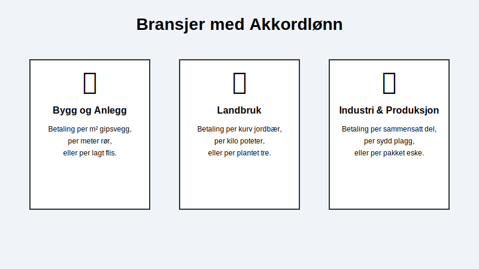

**Akkordlønn** er en form for **[produksjonslønn](/blogs/regnskap/hva-er-produksjonslonn "Hva er Produksjonslønn? Komplett Guide til Produksjonsbasert Lønn")** hvor betalingen avhenger direkte av mengden arbeid som utføres, i stedet for antall timer man jobber. Man får betalt per enhet som produseres eller per oppgave som fullføres. Dette kalles også å jobbe på akkord.

Selve ordet "akkord" refererer til avtalen som ligger til grunn for arbeidet, hvor en fast pris per enhet er bestemt på forhånd. Denne lønnsformen er ment å motivere til høyere produktivitet, ettersom den som jobber raskt og effektivt har mulighet til å tjene mer enn ved tradisjonell timelønn.

## Akkordlønn vs. Andre Lønnsformer

Den grunnleggende forskjellen mellom akkordlønn og andre lønnsformer ligger i hva som måles. Timelønn kompenserer for medgått tid, [fastlønn](/blogs/regnskap/hva-er-fastlonn "Hva er Fastlønn i Regnskap?") gir en fast månedlig utbetaling, mens akkordlønn kompenserer for oppnådd resultat. Dette ligner på [provisjon](/blogs/regnskap/hva-er-provisjon "Hva er Provisjon? Komplett Guide til Provisjon i Regnskap og Lønn"), men akkordlønn baseres på produksjonsvolum mens provisjon baseres på salgsverdi.

*   **[Fastlønn](/blogs/regnskap/hva-er-fastlonn "Hva er Fastlønn i Regnskap?"):** Gir den mest forutsigbare inntekten med fast månedlig eller årlig beløp, uavhengig av timer eller produksjon. Baserer seg på [grunnlønn](/blogs/regnskap/hva-er-grunnlonn "Hva er Grunnlønn i Regnskap?") og eventuelle faste tillegg.
*   **Timelønn:** Gir en forutsigbar og stabil inntekt basert på en fast timepris, uavhengig av produksjonstempo.
*   **Akkordlønn:** Gir en variabel inntekt som er direkte knyttet til egen innsats. Høyere produksjon gir høyere lønn. Dette er en form for **[produksjonslønn](/blogs/regnskap/hva-er-produksjonslonn "Hva er Produksjonslønn? Komplett Guide til Produksjonsbasert Lønn")**.

I mange tilfeller benyttes en hybridmodell, ofte kalt **kombinert akkord** eller **akkord med garantilønn**. Her har den ansatte en garantert [minstelønn](/blogs/regnskap/minstelonn "Minstelønn i Regnskap") (timelønn), med et tillegg for produksjon over et visst nivå. Dette gir en økonomisk trygghet samtidig som det insentiverer til økt innsats.

## Hvordan fastsettes akkordsatser?

En akkordavtale (eller akkordtariff) er en detaljert overenskomst som fastsetter prisen per enhet. For å komme frem til en rettferdig pris, er det vanlig å gjennomføre **arbeidsstudier** eller **tidsstudier**. Her analyseres og måles arbeidsoperasjonene for å finne ut hvor lang tid en gjennomsnittlig faglært arbeider bruker på å produsere én enhet. Denne normtiden danner grunnlaget for akkordsatsen, som skal gjøre det mulig å oppnå en fornuftig lønn ved normal arbeidsinnsats.

## Bransjer som bruker akkordlønn

Akkordlønn var historisk sett svært utbredt i industrien, men er i dag mest vanlig i bransjer hvor det er enkelt å måle og kvantifisere arbeidsresultater.

*   **Bygg og anlegg:** Betaling per installert gipsplate, per malte kvadratmeter eller per lagt meter med rør.
*   **Landbruk:** Lønn for innhøsting baseres ofte på antall kurver med bær eller kilo med grønnsaker som plukkes.
*   **Industri og produksjon:** I for eksempel tekstilindustrien kan lønnen være basert på antall sydde plagg. Innen logistikk kan det være betaling per pakket ordre.

## Fordeler og ulemper med akkordlønn

| Fordeler                                       | Ulemper                                                                 |
| ---------------------------------------------- | ----------------------------------------------------------------------- |
| **For den ansatte:** Potensial for høyere lønn.  | **For den ansatte:** Uforutsigbar inntekt, kan presse til å ta snarveier. |
| **For arbeidsgiver:** Økt produktivitet.       | **For arbeidsgiver:** Kan gå på bekostning av kvalitet og sikkerhet (HMS). |
| Gir direkte belønning for effektivt arbeid.    | Kan skape et konkurransepreget og stressende arbeidsmiljø.                |

## Akkordlønn i regnskapet

For en bedrift er korrekt håndtering av lønn en sentral del av [regnskapet](/blogs/regnskap/hva-er-regnskap "Hva er regnskap?"). Akkordlønn, som all annen lønn, må dokumenteres nøye. Grunnlaget for lønnsutbetalingen (f.eks. antall produserte enheter) må være sporbart og registreres i den ansattes [ansattreskontro](/blogs/regnskap/hva-er-ansattreskontro "Hva er Ansattreskontro? En Guide til Ansattkontoer i Regnskap"). 

Det månedlige [lønnslipp](/blogs/regnskap/hva-er-lonnslipp "Hva er Lønnslipp i Regnskap? Komplett Guide til Lønnsspecifikasjon") for akkordlønn må vise detaljert informasjon om produserte enheter, enhetspris og eventuelle tillegg eller garantilønn. Lønnen skal innrapporteres via [a-meldingen](/blogs/regnskap/hva-er-a-melding "Hva er a-melding?"), og det skal beregnes forskuddstrekk og arbeidsgiveravgift på vanlig måte.

## Relaterte ord

*   [Produksjonslønn](/blogs/regnskap/hva-er-produksjonslonn "Hva er Produksjonslønn? Komplett Guide til Produksjonsbasert Lønn")
*   Prestasjonslønn
*   Provisjonslønn
*   [Fastlønn](/blogs/regnskap/hva-er-fastlonn "Hva er Fastlønn i Regnskap?")
*   Timelønn
*   Akkordavtale
*   Lønn

