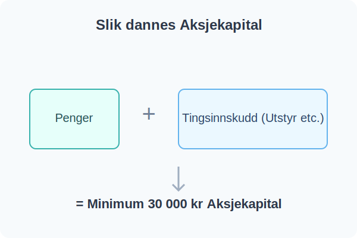

---
title: "Hva er Aksjekapital?"
meta_title: "Hva er Aksjekapital?"
meta_description: '**Aksjekapital** er den samlede verdien av eiernes innskudd i et [aksjeselskap (AS)](/blogs/regnskap/hva-er-et-aksjeselskap "Hva er et Aksjeselskap? Komplett Gu...'
slug: hva-er-aksjekapital
type: blog
layout: pages/single
---

**Aksjekapital** er den samlede verdien av eiernes innskudd i et [aksjeselskap (AS)](/blogs/regnskap/hva-er-et-aksjeselskap "Hva er et Aksjeselskap? Komplett Guide til Selskapsformen") ved oppstart. Som en spesifikk form for [finanskapital](/blogs/regnskap/hva-er-finanskapital "Hva er Finanskapital? Definisjon, Typer og Betydning i Regnskap"), fungerer denne kapitalen som selskapets grunnleggende [egenfinansiering](/blogs/regnskap/hva-er-egenfinansiering "Hva er Egenfinansiering? Komplett Guide til Egenkapitalfinansiering") og utgjør en viktig del av selskapets [egenkapital](/blogs/regnskap/hva-er-egenkapital "Hva er Egenkapital? Komplett Guide til Egenkapital i Regnskap"). Aksjekapitalen inngår som en sentral del av [passiva](/blogs/regnskap/hva-er-passiva "Hva er Passiva? En Guide til Gjeld og Egenkapital i Regnskap") i balansen og må spesifiseres i selskapets [vedtekter](/blogs/regnskap/hva-er-vedtekter-for-aksjeselskap "Hva er Vedtekter for Aksjeselskap? Krav og Innhold").

### Krav til Aksjekapital

For å stifte et **[aksjeselskap](/blogs/regnskap/hva-er-et-aksjeselskap "Hva er et Aksjeselskap? Komplett Guide til Selskapsformen")** i Norge, er det et lovpålagt krav i [aksjeloven](/blogs/regnskap/hva-er-aksjeloven "Hva er Aksjeloven? Regler for Aksjeselskaper i Norge") om å ha en aksjekapital på minimum **30 000 kroner**. Denne kapitalen trenger ikke utelukkende være kontanter. Den kan bestå av:

*   **Penger:** Kontantinnskudd på en egen bedriftskonto.
*   **[Tingsinnskudd (naturalinnskudd)](/blogs/regnskap/tingsinnskudd "Hva er Tingsinnskudd? Guide til apportinnskudd og naturalinnskudd")**: Verdier som maskiner, utstyr, eiendom eller andre [eiendeler](/blogs/regnskap/hva-er-aktiva "Hva er Aktiva? En Komplett Guide til Eiendeler i Regnskap") som er relevante for driften.

En kombinasjon av penger og tingsinnskudd er også vanlig. Verdien av tingsinnskudd må bekreftes av en revisor.

### Aksjekapitalens Rolle

Aksjekapitalen er knyttet til selskapets [aksjer](/blogs/regnskap/hva-er-en-aksje "Hva er en Aksje? En Enkel Forklaring"). Den totale aksjekapitalen fordeles på et antall aksjer, som hver får en **[pålydende](/blogs/regnskap/palydende "Hva er Pålydende? Guide til pålydende verdi per aksje")**.

Aksjonærenes eierskap og antall aksjer de eier, dokumenteres i et [**aksjebevis**](/blogs/regnskap/hva-er-et-aksjebevis "Hva er et Aksjebevis? En Komplett Guide").

`Pålydende verdi per aksje = Total aksjekapital / Antall aksjer`

Det er viktig å merke seg at selv om aksjer har samme **[pålydende](/blogs/regnskap/palydende "Hva er Pålydende? Guide til pålydende verdi per aksje")**, kan de ha ulike rettigheter hvis selskapet har opprettet forskjellige [aksjeklasser](/blogs/regnskap/hva-er-aksjeklasser "Hva er Aksjeklasser? A-aksjer og B-aksjer Forklart").

Denne kapitalen skal brukes til å finansiere driften, enten det er investeringer i utstyr, varekjøp eller dekning av løpende kostnader, før selskapet selv begynner å generere inntekter.

Hvis selskapet senere trenger mer kapital, kan aksjonærene:

* Øke aksjekapitalen gjennom en [kapitalforhøyelse](/blogs/regnskap/kapitalforhoyelse "Kapitalforhøyelse: Metoder og Regnskapsføring") (som er en form for [egenfinansiering](/blogs/regnskap/hva-er-egenfinansiering "Hva er Egenfinansiering? Komplett Guide til Egenkapitalfinansiering")) eller gjennom en emisjon. Les mer i [Emisjon](/blogs/regnskap/emisjon "Hva er Emisjon? En komplett guide til kapitalforhøyelse og aksjeutstedelse").
* Redusere aksjekapitalen gjennom en [kapitalnedsettelse](/blogs/regnskap/kapitalnedsettelse "Kapitalnedsettelse: Metoder og Regnskapsføring") for å returnere kapital til aksjonærene eller dekke underskudd.
* [Låne penger til selskapet](/blogs/regnskap/hva-er-aksjonaerlan-til-as "Hva er Aksjonærlån til AS? Finansiering, Skatt og Praktiske Råd") uten å utvanne eierandelene.
* Vurdere moderne finansieringsmetoder som [crowdfunding](/blogs/regnskap/hva-er-crowdfunding "Hva er Crowdfunding i Regnskap? Regnskapsføring, Skatt og Juridiske Krav") og andre former for [crowdsourcing](/blogs/regnskap/hva-er-crowdsourcing "Hva er Crowdsourcing i Regnskap? Fordeler, Utfordringer og Praktisk Anvendelse") for å hente kapital fra mange små investorer.
[Styret](/blogs/regnskap/hva-er-styre "Hva er Styre? Ansvar, Rolle og Oppgaver i Aksjeselskap") har det overordnede ansvaret for å godkjenne [kapitalforhøyelser](/blogs/regnskap/kapitalforhoyelse "Kapitalforhøyelse: Metoder og Regnskapsføring") og sikre forsvarlig egenkapital. Aksjonærer kan koordinere sin stemmegivning og beslutningstagning omkring kapitalspørsmål gjennom en [aksjonæravtale](/blogs/regnskap/aksjonaeravtale "Hva er en Aksjonæravtale? En Omfattende Guide til Aksjonæravtaler i Norge") for å sikre enhetlige vurderinger av finansieringsalternativer. Selskapet kan også gjennomføre en [aksjespleis](/blogs/regnskap/hva-er-aksjespleis "Hva er Aksjespleis? En Detaljert Guide") for å øke aksjekursen, eller en [aksjesplitt](/blogs/regnskap/hva-er-aksjesplitt "Hva er en Aksjesplitt? En Komplett Guide") for å senke den, selv om ingen av disse endrer den totale aksjekapitalen.

### Risiko for Aksjonærene

Som eier (aksjonær) er din økonomiske risiko i et [aksjeselskap](/blogs/regnskap/hva-er-et-aksjeselskap "Hva er et Aksjeselskap? Komplett Guide til Selskapsformen") i hovedsak begrenset til aksjekapitalen du har skutt inn. Hvis selskapet skulle gå konkurs, kan du normalt ikke tape mer enn ditt aksjeinnskudd. Dette er en av de store fordelene med selskapsformen AS.

I motsetning til risikoen, er potensiell [avkastning](/blogs/regnskap/hva-er-avkastning "Hva er Avkastning? Komplett Guide til Investeringsavkastning og Beregning") på aksjekapitalen ikke begrenset - aksjonærer kan tjene betydelig mer enn sitt opprinnelige innskudd gjennom utbytte og verdistigning av aksjene. Aksjekapitalen danner grunnlag for [skjermingsfradrag](/blogs/regnskap/hva-er-skjermingsfradrag "Hva er Skjermingsfradrag? Skattefradrag for Alternativkostnad ved Aksjeinvestering") i [aksjonærmodellen](/blogs/regnskap/aksjonaermodellen "Aksjonærmodellen: Skattemodell for Utbytte og Gevinst") ved utbyttebeskatning.

For detaljert informasjon om hvordan aksjekapital påvirker skatt på utbytte og gevinst, se vår [Aksjonærmodellen - Komplett Guide til Norsk Aksjebeskatning](/blogs/regnskap/aksjonaermodellen-guide "Aksjonærmodellen - Komplett Guide til Norsk Aksjebeskatning").

I regnskapet føres aksjekapitalen på passivasiden i balansen, under "[Egenkapital](/blogs/regnskap/hva-er-egenkapital "Hva er Egenkapital? Komplett Guide til Egenkapital i Regnskap")".

