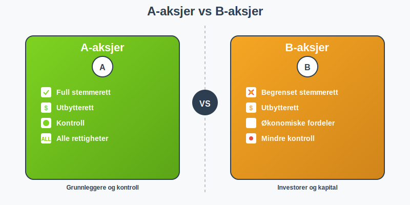

**Aksjeklasser** er ulike sett av aksjer som gir ulike rettigheter i selskapet. Dette er et viktig konsept for å forstå hvordan eierskap og kontroll kan struktureres i et [aksjeselskap (AS)](/blogs/regnskap/hva-er-et-aksjeselskap "Hva er et Aksjeselskap? Komplett Guide til Selskapsformen").

I utgangspunktet gir [aksjer](/blogs/regnskap/hva-er-en-aksje "Hva er en Aksje? En Enkel Forklaring") like rettigheter i et selskap. Alle aksjonærer får for eksempel lik rett til å delta og stemme på generalforsamlingen, lik rett til å motta utbytte og lik rett til å omsette aksjene.

### A-aksjer og B-aksjer

Det finnes et unntak i aksjeloven som sier at selskapet kan opprette ulike aksjeklasser, som gir ulike rettigheter. Det er vanlig å skille på **A-aksjer** og **B-aksjer**:

- **A-aksjer** inneholder som regel alle de opprinnelige rettighetene
- **B-aksjer** har som regel begrensede rettigheter

### Praktisk Eksempel

La oss si at du som stifter av et selskap ønsker å ha den administrative kontrollen av selskapet, samt økonomiske fordeler. Da oppretter du to aksjeklasser; en som gir stemmerett og en som gir utbytterett.

For å ikke miste kontrollen over ditt selskap kan du tilby andre aksjonærer kun utbytteaksjer (B-aksjer). De vil da få de økonomiske fordelene, men ikke oppnå stemmerett i selskapet.

### Vedtekter og Aksjeklasser

Det er **[vedtektene](/blogs/regnskap/hva-er-vedtekter-for-aksjeselskap "Hva er Vedtekter for Aksjeselskap? Krav og Innhold")** i et selskap som avgjør om selskapet har ulike aksjeklasser. Vedtektene må spesifisere:

- Hvilke aksjeklasser som finnes
- Hvilke rettigheter hver klasse har
- Eventuelle begrensninger for hver klasse

Dette er en viktig del av selskapets grunnleggende struktur og påvirker både [aksjekapitalen](/blogs/regnskap/hva-er-aksjekapital "Hva er Aksjekapital? Krav og Forklaring") og hvordan selskapet styres.

### Fordeler med Aksjeklasser

Aksjeklasser gir fleksibilitet for selskaper til å:

- **Hente kapital** uten å miste kontroll
- **Belønne investorer** med økonomiske rettigheter
- **Beholde stemmerett** hos grunnleggerne
- **Strukturere eierskap** på en måte som passer selskapets behov

### Relaterte Begreper

- **[Aksjeloven](/blogs/regnskap/hva-er-aksjeloven "Hva er Aksjeloven? Regler for Aksjeselskaper i Norge")** - Loven som regulerer aksjeselskaper
- **[Aksjeselskap (AS)](/blogs/regnskap/hva-er-et-aksjeselskap "Hva er et Aksjeselskap? Komplett Guide til Selskapsformen")** - Selskapsformen som kan ha aksjeklasser
- **[Aksjekapital](/blogs/regnskap/hva-er-aksjekapital "Hva er Aksjekapital? Krav og Forklaring")** - Den totale verdien av alle aksjer i selskapet

