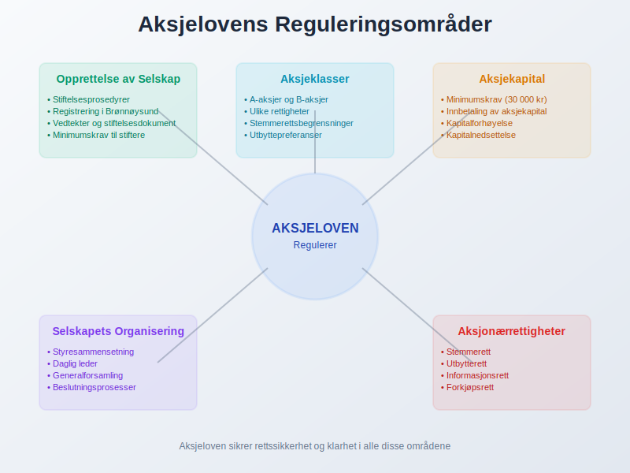

**Aksjeloven** er reglene som forteller hvordan du starter og driver selskaper med aksjer i Norge. Loven dekker alt fra hvordan du setter opp et selskap, til hvor mye penger du trenger for å starte, hvordan selskapet skal organiseres, og hvilke rettigheter og plikter de som eier [aksjer](/blogs/regnskap/hva-er-en-aksje "Hva er en Aksje? En Enkel Forklaring") har.

### Hva Regulerer Aksjeloven?

Aksjeloven gjelder ikke for allmennaksjeselskaper, samvirkeforetak eller selskaper som ikke har økonomisk formål og som ikke er betegnet som aksjeselskap. Loven fokuserer spesifikt på **[aksjeselskaper (AS)](/blogs/regnskap/hva-er-et-aksjeselskap "Hva er et Aksjeselskap? Komplett Guide til Selskapsformen")** og regulerer:

- **Opprettelse av selskap:** Prosedyrer for å starte et [aksjeselskap](/blogs/regnskap/hva-er-et-aksjeselskap "Hva er et Aksjeselskap? Komplett Guide til Selskapsformen")
- **[Aksjekapital](/blogs/regnskap/hva-er-aksjekapital "Hva er Aksjekapital? Krav og Forklaring"):** Minimumskrav til startkapital
- **Selskapets organisering:** Hvordan selskapet skal struktureres, inkludert kravet om å føre en [aksjeeierbok](/blogs/regnskap/hva-er-en-aksjeeierbok "Hva er en Aksjeeierbok? En Komplett Guide").
- **Aksjonærrettigheter:** Hvilke rettigheter og plikter [aksjonærer](/blogs/regnskap/hva-er-en-aksjonaer "Hva er en Aksjonær? En Komplett Guide") har
- **[Aksjeklasser](/blogs/regnskap/hva-er-aksjeklasser "Hva er Aksjeklasser? A-aksjer og B-aksjer Forklart"):** Regler for ulike typer aksjer
- **[Aksjespleis](/blogs/regnskap/hva-er-aksjespleis "Hva er Aksjespleis? En Detaljert Guide"):** Regler for sammenslåing av aksjer
- **[Aksjesplitt](/blogs/regnskap/hva-er-aksjesplitt "Hva er en Aksjesplitt? En Komplett Guide"):** Regler for å dele opp aksjer

### Det Viktigste du Bør Vite

For deg som driver en liten eller mellomstor bedrift, eller jobber med [regnskap](/blogs/regnskap/hva-er-regnskap "Hva er Regnskap? En komplett guide"), er det noen nøkkelpunkter i aksjeloven det er viktig å kjenne til:

#### Startkapital
Loven forteller hvor mye startkapital du må ha for å opprette et [aksjeselskap](/blogs/regnskap/hva-er-et-aksjeselskap "Hva er et Aksjeselskap? Komplett Guide til Selskapsformen"). Dette er direkte knyttet til selskapets [aksjekapital](/blogs/regnskap/hva-er-aksjekapital "Hva er Aksjekapital? Krav og Forklaring").

#### Styresammensetning
Aksjeloven regulerer hvordan du setter sammen et styre for selskapet, inkludert krav til styremedlemmer og deres ansvar.

Loven inneholder også regler om **[inhabilitet](/blogs/regnskap/inhabilitet "Hva er Inhabilitet i Regnskap?")** for styremedlemmer og daglig leder for å sikre objektivitet i beslutningsprosesser.

#### Generalforsamlinger
Loven spesifiserer hvordan og når du må holde møter med aksjeeierne (generalforsamlinger), som er selskapets øverste organ. [Aksjonæravtaler](/blogs/regnskap/aksjonaeravtale "Hva er en Aksjonæravtale? En Omfattende Guide til Aksjonæravtaler i Norge") kan supplere disse reglene med spesifikke avtaler om stemmegivning.

### Hvorfor er det Viktig å Følge Aksjeloven?

Det er veldig viktig å følge reglene i aksjeloven for å unngå trøbbel med loven og unngå å tape penger. Ved å følge loven sørger du også for at selskapet ditt er rettferdig og åpent om hvordan det drives, noe som er bra både for deg og for andre i markedet.

**Konsekvenser av å ikke følge aksjeloven:**
- Juridiske problemer og sanksjoner
- Økonomiske tap
- Tap av tillit fra investorer og kunder
- Problemer med selskapets legitimitet

**Fordeler ved å følge aksjeloven:**
- Juridisk beskyttelse
- Økt tillit fra interessenter
- Klarhet i roller og ansvar
- Bedre tilgang til finansiering

### Aksjeloven og Utbytte

Aksjeloven regulerer også hvordan selskaper kan dele ut **utbytte** til sine aksjonærer. Dette inkluderer regler for:

- Når utbytte kan utbetales
- [Maskimalt utbytte](/blogs/regnskap/maskimalt-utbytte "Maskimalt Utbytte - Komplett Guide til Utbytteregler og Beregning") som kan deles ut
- Prosedyrer for utbyttebeslutninger
- **Utbytteaksjer** og deres spesielle rettigheter

Disse reglene sikrer at utbyttebetalinger ikke setter selskapets finansielle stabilitet i fare.

### Relaterte Begreper og Artikler

For å få en fullstendig forståelse av aksjeloven, bør du også sette deg inn i disse relaterte begrepene:

- **[Aksjeselskap](/blogs/regnskap/hva-er-et-aksjeselskap "Hva er et Aksjeselskap? Komplett Guide til Selskapsformen")** - Selskapsformen som reguleres av aksjeloven
- **[Aksjeklasser](/blogs/regnskap/hva-er-aksjeklasser "Hva er Aksjeklasser? A-aksjer og B-aksjer Forklart")** - Ulike typer aksjer med forskjellige rettigheter
- **[Aksjekapital](/blogs/regnskap/hva-er-aksjekapital "Hva er Aksjekapital? Krav og Forklaring")** - Selskapets grunnleggende kapital
- **[Aksjer](/blogs/regnskap/hva-er-en-aksje "Hva er en Aksje? En Enkel Forklaring")** - Eierandeler i selskapet
- **[Aksjonærregisteret](/blogs/regnskap/hva-er-aksjonaerregisteret "Hva er Aksjonærregisteret? Komplett Guide til Norges Aksjonærregister")** - Offentlig register over alle aksjonærer
- **[Maskimalt utbytte](/blogs/regnskap/maskimalt-utbytte "Maskimalt Utbytte - Komplett Guide til Utbytteregler og Beregning")** - Begrensninger på utbyttebetalinger
- **Utbytte** - Overskuddsdeling til aksjonærer
- **Utbytteaksjer** - Aksjer med spesielle utbytterettigheter
 - **[Aksjonæravtale](/blogs/regnskap/aksjonaeravtale "Hva er en Aksjonæravtale? En Omfattende Guide til Aksjonæravtaler")** - Skriftlig avtale mellom aksjonærer om eierstyring, stemmerettigheter og salgsvilkår
 - **[Inhabilitet](/blogs/regnskap/inhabilitet "Hva er Inhabilitet i Regnskap?")** - Regler om habilitet og interessekonflikter i beslutningsprosesser

### Praktiske Råd for Bedriftseiere

Hvis du planlegger å starte et [aksjeselskap](/blogs/regnskap/hva-er-et-aksjeselskap "Hva er et Aksjeselskap? Komplett Guide til Selskapsformen") eller allerede driver et, her er noen praktiske råd:

1. **Sett deg grundig inn i aksjeloven** før du starter selskapet
2. **Konsulter juridisk ekspertise** ved komplekse spørsmål
3. **Hold deg oppdatert** på endringer i loven
4. **Dokumenter alle beslutninger** i henhold til lovens krav
5. **Følg frister** for rapportering og møter

Ved å følge aksjeloven sikrer du at selskapet ditt opererer innenfor lovens rammer og bygger tillit hos alle interessenter.

