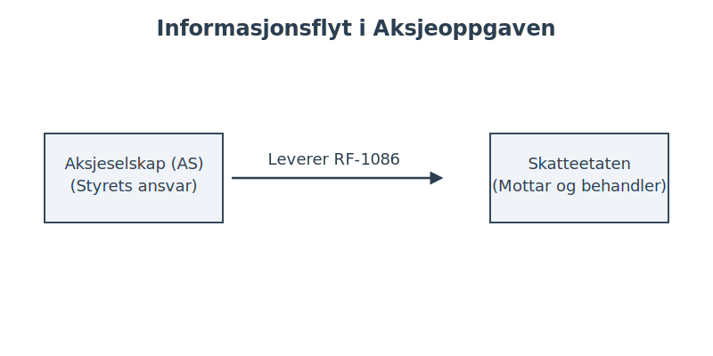
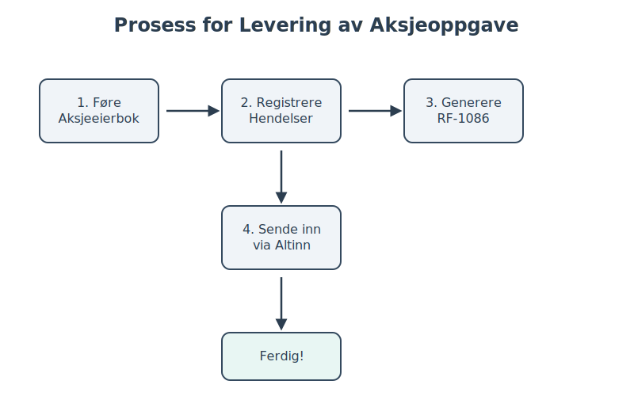

---
title: "Hva er en Aksjeoppgave? En Komplett Guide"
meta_title: "Hva er en Aksjeoppgave? En Komplett Guide"
meta_description: 'Aksjeoppgaven, offisielt kjent som **RF-1086**, er en årlig og obligatorisk rapportering for alle norske aksjeselskaper (AS) og allmennaksjeselskaper (ASA). De...'
slug: hva-er-aksjeoppgave
type: blog
layout: pages/single
---

Aksjeoppgaven, offisielt kjent som **RF-1086**, er en årlig og obligatorisk rapportering for alle norske aksjeselskaper (AS) og allmennaksjeselskaper (ASA). Denne rapporten gir Skatteetaten en detaljert oversikt over alle bevegelser og hendelser knyttet til selskapets aksjer gjennom inntektsåret. Informasjonen brukes til å forhåndsutfylle aksjonærenes personlige skattemeldinger og sikre korrekt skattlegging av aksjeinntekter og -formue.

Forståelse av aksjeoppgaven er avgjørende for både selskaper og deres [aksjonærer](/blogs/regnskap/hva-er-en-aksjonaer "Hva er en Aksjonær? En Komplett Guide"). Feil eller manglende rapportering kan føre til sanksjoner for selskapet og feil skatt for aksjonærene.

## Hvem er ansvarlig for å levere aksjeoppgaven?

Det er **selskapet** (styret) som har ansvaret for å utarbeide og levere aksjeoppgaven. Dette gjelder alle selskaper som er registrert som aksjeselskap eller allmennaksjeselskap i Foretaksregisteret, uavhengig av om det har vært aktivitet i selskapet eller ikke.

*   **Aksjeselskaper (AS):** Må levere aksjeoppgaven hvert år.
*   **Allmennaksjeselskaper (ASA):** Må levere aksjeoppgaven hvert år.
*   **Selskaper under stiftelse:** Må levere hvis de er stiftet før utgangen av inntektsåret.
*   **Selskaper under avvikling:** Må levere frem til selskapet er slettet i Foretaksregisteret.

Det er viktig å merke seg at selv om et **regnskapsbyrå** ([Hva er et regnskapsbyrå?](/blogs/regnskap/regnskapsbyra "Regnskapsbyrå: Hva gjør de og hvorfor er det viktig?")) eller en [forretningsfører](/blogs/regnskap/hva-er-forretningsforer "Hva er en forretningsfører?") utfører selve innleveringen, er det juridiske ansvaret alltid hos selskapets styre.

## Hva inneholder en aksjeoppgave?

Aksjeoppgaven er en omfattende rapport som skal fange opp alle endringer i eierskap og kapitalstruktur. Informasjonen danner grunnlaget for beregning av [skatt](/blogs/regnskap/hva-er-skatt "Hva er skatt?") på [utbytte](/blogs/regnskap/maskimalt-utbytte "Hva er maksimalt utbytte?"), gevinst/tap ved salg av aksjer, og formuesskatt for den enkelte aksjonær.

Her er de sentrale elementene som skal rapporteres:

*   **Selskapsinformasjon:** Navn, [organisasjonsnummer](/blogs/regnskap/hva-er-organisasjonsnummer "Hva er et organisasjonsnummer?"), og kontaktinformasjon.
*   **Aksjonærinformasjon:** Fullstendig navn, fødselsnummer eller organisasjonsnummer for alle aksjonærer.
*   **Aksjebeholdning:** Antall aksjer hver aksjonær eide ved inngangen og utgangen av året.
*   **Transaksjoner:** Alle kjøp og salg av aksjer, inkludert dato, antall aksjer, og pris.
*   **Kapitalendringer:** Hendelser som endrer [aksjekapitalen](/blogs/regnskap/hva-er-aksjekapital "Hva er aksjekapital?"), for eksempel:
    *   **Nyemisjon:** Utstedelse av nye aksjer.
    *   **Splitt/Spleis:** Endring i antall aksjer uten endring i samlet aksjekapital. Les mer om [aksjespleis](/blogs/regnskap/hva-er-aksjespleis "Hva er Aksjespleis? En Detaljert Guide") og [aksjesplitt](/blogs/regnskap/hva-er-aksjesplitt "Hva er en Aksjesplitt? En Komplett Guide").
    *   **Kapitalnedsettelse:** Reduksjon av aksjekapitalen.
*   **Utbytte:** Alt utdelt utbytte til aksjonærene, både kontant og i form av andre eiendeler.
*   **Aksjonærlån:** Lån gitt fra selskapet til personlige aksjonærer, som i mange tilfeller skattlegges som utbytte. Se vår guide om [aksjonærlån fra AS](/blogs/regnskap/hva-er-aksjonaerlan-fra-as "Hva er aksjonærlån fra et AS?").

Under ser du en illustrasjon av informasjonsflyten fra selskapet til Skatteetaten:

### Tabell: Eksempel på hendelser som skal rapporteres

| Hendelse | Beskrivelse | Hva skal rapporteres? |
| :--- | :--- | :--- |
| **Kjøp/Salg** | En aksjonær selger aksjer til en annen. | Kjøper, selger, dato, antall, pris (vederlag). |
| **Nyemisjon** | Selskapet utsteder nye aksjer for å hente inn mer [kapital](/blogs/regnskap/hva-er-kapital "Hva er kapital?"). | Hvem som har tegnet seg, antall nye aksjer, innbetalt beløp. |
| **Utbytte** | Selskapet deler ut [overskudd](/blogs/regnskap/hva-er-overskudd "Hva er overskudd?") til eierne. | Mottaker, utbetalt beløp, dato for generalforsamlingsvedtak. |
| **Arv/Gave** | Aksjer overføres som arv eller gave. | Ny eier, gammel eier, dato for overføring. Kontinuitetsprinsippet gjelder. |
| **Fusjon/Fisjon** | Selskapet slår seg sammen med et annet eller deles opp. | Detaljer om transaksjonen i henhold til [aksjeloven](/blogs/regnskap/hva-er-aksjeloven "Hva er aksjeloven?"). |

## Frister for levering

Fristen for å levere aksjeoppgaven er **31. januar** året etter inntektsåret. For inntektsåret 2024 er fristen altså 31. januar 2025.

Det er *ikke* mulig å søke om utsettelse for denne fristen. Ved for sen eller manglende levering vil selskapet bli ilagt en **tvangsmulkt** for hver dag fristen overskrides, opp til et maksbeløp fastsatt av Skatteetaten.

## Hvordan leveres aksjeoppgaven?

Aksjeoppgaven skal leveres elektronisk. De fleste selskaper bruker et [regnskapssystem](/blogs/regnskap/hva-er-regnskap "Hva er et regnskapssystem?") eller et eget aksjeeierbok-system som kan generere og sende inn oppgaven direkte til [Altinn](/blogs/regnskap/hva-er-altinn "Hva er Altinn?").

Prosessen kan oppsummeres slik:
1.  **Før en nøyaktig aksjeeierbok:** Selskapet må løpende føre en oversikt over alle aksjonærer og deres aksjebeholdning i en [aksjeeierbok](/blogs/regnskap/hva-er-en-aksjeeierbok "Hva er en aksjeeierbok?").
2.  **Registrer alle hendelser:** Alle transaksjoner og kapitalendringer må dokumenteres med bilag og føres korrekt.
3.  **Generer RF-1086:** Ved årets slutt genereres selve aksjeoppgaven fra systemet.
4.  **Send inn via Altinn:** Oppgaven sendes til Altinn, enten direkte fra systemet eller ved manuell opplasting.

## Hva skjer etter at aksjeoppgaven er levert?

Når Skatteetaten mottar aksjeoppgaven, blir informasjonen behandlet og brukt til å lage en personlig rapport til hver enkelt aksjonær: **"Aksjer og egenkapitalbevis" (RF-1088)**. Denne rapporten sendes ut i mars/april og fungerer som et grunnlag for aksjonærens [skattemelding](/blogs/regnskap/skattemelding "Hva er en skattemelding?").

Aksjonæren har selv ansvaret for å kontrollere at opplysningene i RF-1088 stemmer overens med deres egne opptegnelser. Hvis det er feil, må aksjonæren kontakte selskapet og be dem sende inn en korrigert aksjeoppgave.

*   **Kontroll:** Sjekk antall aksjer, inngangsverdi, og eventuelt utbytte.
*   **Korrigering:** Feil må rettes av selskapet som har levert den opprinnelige oppgaven.
*   **Personlig ansvar:** Du er selv ansvarlig for at skattemeldingen din er korrekt, selv om informasjonen er forhåndsutfylt.

## Oppsummering

Aksjeoppgaven er en hjørnestein i systemet for norsk aksjebeskatning. Den sikrer at riktig informasjon om eierskap, [formue](/blogs/regnskap/hva-er-formue "Hva er formue?") og inntekt blir rapportert til myndighetene. For selskaper er det kritisk å ha gode rutiner for føring av aksjeeierbok og rapportering for å unngå sanksjoner. For aksjonærer er det like viktig å forstå og kontrollere informasjonen som blir rapportert på deres vegne.

