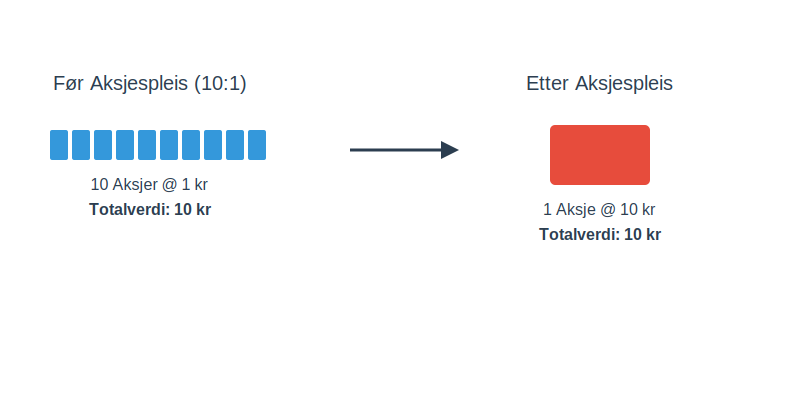

---
title: "Hva er Aksjespleis? En Detaljert Guide"
seoTitle: "Hva er Aksjespleis? En Detaljert Guide"
description: 'En **aksjespleis**, ofte kalt *omvendt aksjesplitt*, er en strategisk manøver et [aksjeselskap](/blogs/regnskap/hva-er-et-aksjeselskap "Hva er et aksjeselskap?...'
---

En **aksjespleis**, ofte kalt *omvendt aksjesplitt*, er en strategisk manøver et [aksjeselskap](/blogs/regnskap/hva-er-et-aksjeselskap "Hva er et aksjeselskap?") kan gjennomføre for å redusere antall utestående aksjer. Dette fører til at verdien per aksje øker tilsvarende, uten at den totale verdien av [aksjekapitalen](/blogs/regnskap/hva-er-aksjekapital "Hva er aksjekapital?") endres.

Tenk på det som å bytte ti 10-kronestykker mot én 100-kroneseddel. Verdien er den samme, men antallet enheter er færre. En aksjespleis er det motsatte av en [aksjesplitt](/blogs/regnskap/hva-er-aksjesplitt "Hva er en Aksjesplitt? En Komplett Guide"), hvor man i stedet deler opp aksjer for å senke prisen per aksje.

## Hvorfor gjennomfører selskaper en aksjespleis?

Det er flere grunner til at et selskap kan velge å gjennomføre en aksjespleis. Ofte er målet å gjøre aksjen mer attraktiv for investorer eller å oppfylle visse krav på en børs.

*   **Øke aksjekursen:** En svært lav aksjekurs kan gi inntrykk av at selskapet er i trøbbel eller av lav kvalitet. Ved å "spleise" aksjene, øker kursen per aksje, noe som kan forbedre selskapets image og tiltrekke seg større, institusjonelle investorer.
*   **Krav fra børsen:** Noen børser har minimumskrav til aksjekursen for å kunne være notert. En aksjespleis kan være nødvendig for å unngå å bli strøket fra listen.
*   **Redusere volatilitet:** Aksjer med svært lav kurs (såkalte "penny stocks") kan være utsatt for store prosentvise svingninger. En høyere aksjekurs kan bidra til mer stabilitet.
*   **Administrativ forenkling:** Å redusere antall aksjer kan forenkle administrasjonen og redusere kostnader knyttet til [aksjonærregisteret](/blogs/regnskap/hva-er-aksjonaerregisteret "Hva er Aksjonærregisteret?").

## Hvordan fungerer en aksjespleis i praksis?

Prosessen for en aksjespleis er regulert av [Aksjeloven](/blogs/regnskap/hva-er-aksjeloven "Les mer om Aksjeloven"). Beslutningen må tas i selskapets generalforsamling med tilstrekkelig flertall.

La oss se på et eksempel:

Et selskap, "Tech Invest AS", har 10 000 000 utestående aksjer med en kurs på 0,50 kr per aksje. Selskapets totale markedsverdi er 5 000 000 kr.

Styret ønsker en høyere aksjekurs og foreslår en aksjespleis i forholdet 10:1. Det vil si at 10 gamle aksjer slås sammen til 1 ny aksje.

**Før aksjespleis:**

| Egenskap | Verdi |
| --- | --- |
| Antall aksjer | 10 000 000 |
| Pålydende per aksje | 0,10 kr |
| Kurs per aksje | 0,50 kr |
| **Total markedsverdi** | **5 000 000 kr** |

**Etter aksjespleis (10:1):**

| Egenskap | Verdi |
| --- | --- |
| Antall aksjer | 1 000 000 (10 000 000 / 10) |
| Pålydende per aksje | 1,00 kr (0,10 kr * 10) |
| Kurs per aksje | 5,00 kr (0,50 kr * 10) |
| **Total markedsverdi** | **5 000 000 kr** |

Som tabellen viser, er selskapets totale verdi uendret. En aksjonær som eide 1000 aksjer verdt 500 kr før spleisen, vil eie 100 aksjer verdt 500 kr etter spleisen.

## Hva skjer med brøkaksjer?

En utfordring med aksjespleis er at noen aksjonærer kan ende opp med et antall aksjer som ikke er delelig med spleiseforholdet. Dette resulterer i *brøkaksjer*.

Hvis en aksjonær eier 15 aksjer i vårt eksempel med en 10:1 spleis, ville vedkommende fått 1,5 nye aksjer. Siden man ikke kan eie en halv aksje, blir slike overskytende aksjer vanligvis tvangsinnløst og utbetalt til aksjonæren. Detaljene for dette skal være beskrevet i innkallingen til generalforsamlingen.

## Fordeler og ulemper med aksjespleis

| Fordeler | Ulemper |
| --- | --- |
| Forbedret image og troverdighet | Kan signalisere at selskapet har hatt problemer |
| Tiltrekker seg institusjonelle investorer | Endrer ikke de underliggende økonomiske forholdene |
| Oppfyller børskrav | Kan føre til tvangsinnløsning for småaksjonærer |
| Redusert kursvolatilitet | Ingen garanti for at kursen vil holde seg oppe |

## Konklusjon

En aksjespleis er et verktøy selskaper kan bruke for å justere aksjestrukturen sin. Det er en ren kosmetisk endring som ikke i seg selv skaper verdi, men som kan ha psykologiske og administrative fordeler. For en investor er det viktig å forstå at en aksjespleis ikke endrer den fundamentale verdien av investeringen, men det kan være et signal om selskapets strategi og fremtidsutsikter. Det er alltid lurt å undersøke *hvorfor* selskapet gjennomfører spleisen før man tar videre beslutninger.

