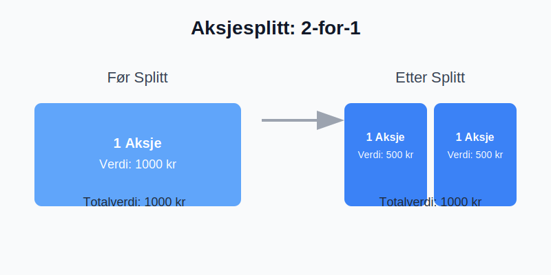

---
title: "Hva er en Aksjesplitt? En Komplett Guide"
seoTitle: "Hva er en Aksjesplitt? En Komplett Guide"
description: 'En **aksjesplitt** er en handling et selskap foretar for å øke antallet utestående aksjer ved å dele hver eksisterende aksje opp i flere nye aksjer. Selv om...'
---

En **aksjesplitt** er en handling et selskap foretar for å øke antallet utestående aksjer ved å dele hver eksisterende aksje opp i flere nye aksjer. Selv om antallet aksjer øker, forblir den totale markedsverdien av selskapet uendret, ettersom prisen per aksje justeres tilsvarende. Dette kan sammenlignes med å veksle en 200-kroneseddel i to 100-kronesedler; verdien er den samme, men den er fordelt på flere enheter.

En aksjesplitt er det motsatte av en [aksjespleis](/blogs/regnskap/hva-er-aksjespleis "Hva er en Aksjespleis?"), hvor man reduserer antall aksjer og øker prisen per aksje.

## Hvorfor gjennomfører selskaper en aksjesplitt?

Det er flere grunner til at et selskap kan velge å gjennomføre en aksjesplitt. De vanligste årsakene inkluderer:

*   **Økt likviditet og omsettelighet:** En lavere aksjekurs kan gjøre aksjen mer tilgjengelig for et bredere spekter av investorer, spesielt småinvestorer. Dette kan føre til høyere handelsvolum og bedre likviditet i aksjen.
*   **Psykologisk effekt:** En lavere aksjekurs kan virke mer attraktiv på investorer, selv om den underliggende verdien av selskapet er den samme. Noen investorer foretrekker å kjøpe 100 aksjer til 10 kroner stykket fremfor én aksje til 1000 kroner.
*   **Signal om optimisme:** En aksjesplitt kan signalisere at ledelsen har tro på fremtidig vekst. Historisk sett har selskaper som gjennomfører splitter ofte opplevd kursvekst i forkant, og splitten kan tolkes som et tegn på at ledelsen forventer at denne trenden vil fortsette.
*   **Justering i henhold til markedet:** Hvis aksjekursen har steget betydelig, kan en splitt bringe den ned på et nivå som er mer sammenlignbart med andre selskaper i samme bransje.

## Hvordan fungerer en aksjesplitt?

En aksjesplitt gjennomføres ved at selskapets styre foreslår splitten, som deretter må godkjennes av generalforsamlingen. Beslutningen må følge kravene i [Aksjeloven](/blogs/regnskap/hva-er-aksjeloven "Alt du trenger å vite om Aksjeloven").

En splitt blir vanligvis beskrevet med et forholdstall, for eksempel 2-for-1, 3-for-1 eller 10-for-1.

*   **2-for-1 splitt:** For hver aksje en investor eier, vil de motta to nye aksjer. Hvis en investor eide 100 aksjer før splitten, vil de eie 200 aksjer etterpå. Samtidig vil prisen per aksje halveres.
*   **3-for-1 splitt:** For hver aksje en investor eier, vil de motta tre nye aksjer. Prisen per aksje vil bli redusert til en tredjedel.

### Eksempel på en 2-for-1 aksjesplitt

La oss se på et tenkt selskap, "TechInvest AS", før og etter en 2-for-1 aksjesplitt.

| Før splitt | Etter splitt (2-for-1) |
| :--- | :--- |
| Antall utestående aksjer | 1 000 000 |
| Aksjekurs | 500 kr |
| Markedsverdi | 500 000 000 kr |
| Investors eierandel (100 aksjer) | 100 aksjer * 500 kr = 50 000 kr |
| Antall utestående aksjer | 2 000 000 |
| Aksjekurs | 250 kr |
| Markedsverdi | 500 000 000 kr |
| Investors eierandel (200 aksjer) | 200 aksjer * 250 kr = 50 000 kr |

Som tabellen viser, er den totale markedsverdien av selskapet og verdien av investorens eierandel nøyaktig den samme før og etter splitten. Det eneste som har endret seg er antall aksjer og prisen per aksje.

## Påvirkning på regnskapet

En aksjesplitt har ingen direkte innvirkning på selskapets balanse. [Aksjekapitalen](/blogs/regnskap/hva-er-aksjekapital "Hva er Aksjekapital?") og [egenkapitalen](/blogs/regnskap/hva-er-egenkapital "Forstå Egenkapital i ditt Regnskap") forblir uendret. Det som endres er aksjenes **pålydende verdi**.

Pålydende verdi er den opprinnelige verdien som er trykket på en aksje. Ved en aksjesplitt reduseres pålydende verdi i samme forhold som splitten. Hvis pålydende verdi var 10 kr før en 2-for-1 splitt, vil den være 5 kr etterpå. Dette må oppdateres i selskapets vedtekter og meldes til Foretaksregisteret.

Endringen i antall aksjer og pålydende verdi må også reflekteres i [aksjeeierboken](/blogs/regnskap/hva-er-en-aksjeeierbok "Hva er en Aksjeeierbok og Hvorfor er den Viktig?").

## Forskjellen på aksjesplitt og fondsemisjon

Det er viktig å ikke forveksle en aksjesplitt med en fondsemisjon. Selv om resultatet for aksjonæren (flere aksjer) kan virke likt, er de juridiske og regnskapsmessige prosessene forskjellige.

*   **Aksjesplitt:** Antall aksjer økes ved å redusere pålydende verdi. Aksjekapitalen er uendret.
*   **Fondsemisjon:** Selskapet utsteder nye aksjer (fondsaksjer) ved å overføre midler fra selskapets frie egenkapital til aksjekapitalen. Pålydende verdi per aksje forblir den samme.

## Skattemessige konsekvenser

For investorer i Norge er en aksjesplitt i seg selv **ikke en skattepliktig hendelse**. Siden verdien av din totale eierandel ikke endres, utløses ingen gevinst eller tap.

Din opprinnelige inngangsverdi (det du totalt betalte for aksjene) blir fordelt på det nye, høyere antallet aksjer. Dette betyr at inngangsverdien per aksje blir lavere. Dette er viktig å holde styr på for beregning av eventuell gevinst eller tap ved et fremtidig salg.

### Eksempel på inngangsverdi

*   Du kjøpte 100 aksjer for 400 kr per stykk. Total inngangsverdi er 40 000 kr.
*   Selskapet gjennomfører en 4-for-1 aksjesplitt. Du har nå 400 aksjer.
*   Din nye inngangsverdi per aksje er 40 000 kr / 400 aksjer = 100 kr.

Hvis du senere selger én av disse aksjene for 120 kr, vil din skattepliktige gevinst være 20 kr (120 kr - 100 kr).

## Konklusjon

En aksjesplitt er et verktøy selskaper kan bruke for å justere aksjekursen og øke likviditeten. For en investor endrer ikke en splitt den fundamentale verdien av investeringen, men den øker antallet aksjer man eier. Det er en teknisk justering som ikke har umiddelbare skattemessige konsekvenser, men som krever at man justerer sin kostpris per aksje for fremtidige transaksjoner. Forståelsen av hvordan en splitt fungerer er en viktig del av det å være en informert [aksjonær](/blogs/regnskap/hva-er-en-aksjonaer "Hva er en Aksjonær? En Komplett Guide").

