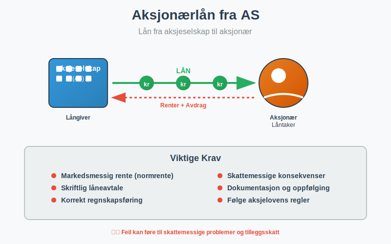
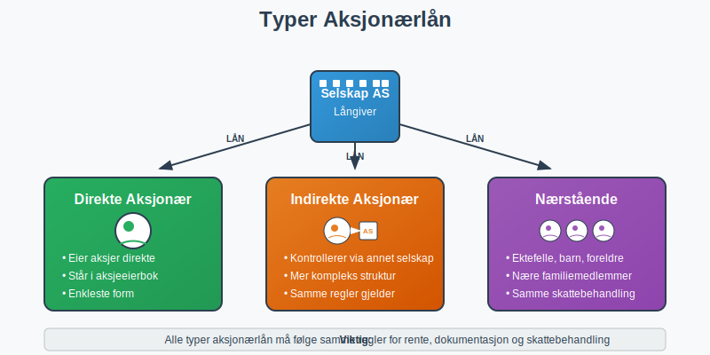
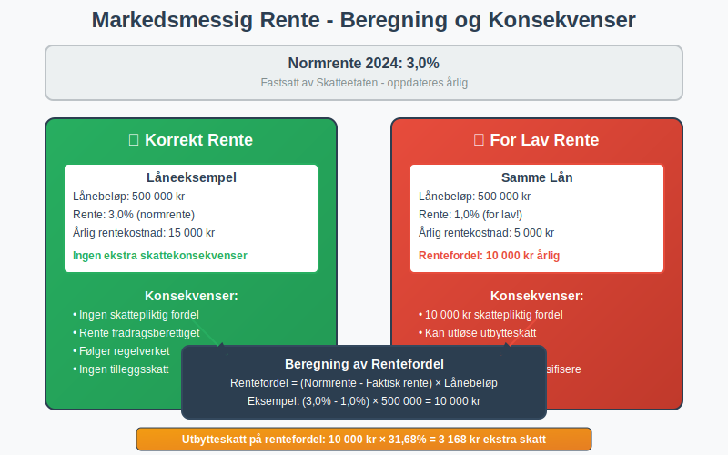
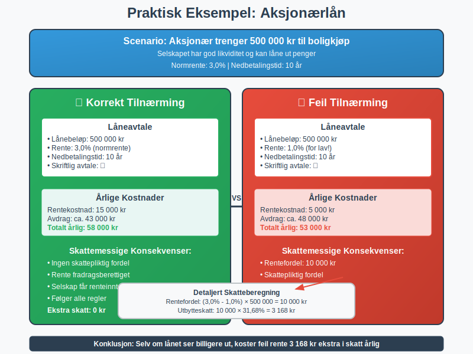

---
title: "Hva er Aksjonærlån fra AS?"
meta_title: "Hva er Aksjonærlån fra AS?"
meta_description: 'Et **aksjonærlån fra AS** er et lån som et [aksjeselskap](/blogs/regnskap/hva-er-et-aksjeselskap "Hva er et Aksjeselskap? Komplett Guide til Selskapsformen")...'
slug: hva-er-aksjonaerlan-fra-as
type: blog
layout: pages/single
---

Et **aksjonærlån fra AS** er et lån som et [aksjeselskap](/blogs/regnskap/hva-er-et-aksjeselskap "Hva er et Aksjeselskap? Komplett Guide til Selskapsformen") gir til en av sine [aksjonærer](/blogs/regnskap/hva-er-en-aksjonaer "Hva er en Aksjonær? En Komplett Guide"). Dette er en vanlig finansieringsform i mindre selskaper, men det følger strenge regler og skattemessige konsekvenser som må følges nøye.



### Hva er et Aksjonærlån?

Et aksjonærlån oppstår når et aksjeselskap låner ut penger til en person eller et selskap som eier [aksjer](/blogs/regnskap/hva-er-en-aksje "Hva er en Aksje? En Enkel Forklaring") i selskapet. Dette kan være:

- **Direkte aksjonærer:** Personer eller selskaper som eier aksjer direkte
- **Indirekte aksjonærer:** Personer som kontrollerer selskapet gjennom andre selskaper
- **Nærstående til aksjonærer:** Ektefeller, barn, foreldre og andre nære familiemedlemmer

Lånet må dokumenteres skriftlig og følge markedsmessige vilkår for å unngå skattemessige problemer.



### Skattemessige Konsekvenser

Aksjonærlån har betydelige skattemessige implikasjoner både for selskapet og låntakeren:

#### For Selskapet (Långiveren)
- **Renteberegning:** Selskapet må kreve markedsmessig rente på lånet
- **Renteinntekt:** Mottatt rente regnes som skattepliktig inntekt for selskapet
- **Dokumentasjon:** Alle lån må være skriftlig dokumentert med klare vilkår

#### For Aksjonæren (Låntakeren)
- **Fordel:** Hvis lånet gis til under markedsrente, regnes forskjellen som skattepliktig fordel
- **Renteutgift:** Betalt rente kan være fradragsberettiget avhengig av hva lånet brukes til
- **Tilbakebetaling:** Lånet må betales tilbake i henhold til avtalen

### Markedsmessig Rente

Et av de viktigste kravene er at lånet må ha **markedsmessig rente**. Dette betyr:

#### Normrente
Skatteetaten fastsetter en **normrente** som oppdateres årlig. For 2024 er normrenten:
- **3,0%** for lån til aksjonærer
- Renten justeres basert på utviklingen i markedsrentene

#### Konsekvenser av for lav rente
Hvis lånet gis til under normrenten, regnes forskjellen som:
- **Skattepliktig fordel** for aksjonæren
- **Utbytte** som kan utløse utbytteskatt



### Dokumentasjonskrav

Alle aksjonærlån må være **skriftlig dokumentert** med følgende informasjon:

#### Låneavtale
- **Lånebeløp:** Hvor mye som lånes
- **Rentesats:** Markedsmessig rente som skal betales
- **Nedbetalingsplan:** Hvordan og når lånet skal tilbakebetales
- **Sikkerhet:** Eventuelle sikkerheter for lånet
- **Misligholdsbestemmelser:** Hva som skjer ved manglende betaling

#### Regnskapsføring
Lånet må føres korrekt i selskapets [regnskap](/blogs/regnskap/hva-er-regnskap "Hva er Regnskap? En komplett guide"):
- **Balansen:** Lånet føres som fordring på aksjonær
- **Resultatregnskapet:** Renteinntekter føres som finansinntekt
- **Noter:** Aksjonærlån må spesifiseres i notene til regnskapet

### Praktiske Eksempler

#### Eksempel 1: Boligkjøp
En aksjonær trenger 500 000 kr til boligkjøp:
- **Lånebeløp:** 500 000 kr
- **Rente:** 3,0% (normrente)
- **Nedbetalingstid:** 10 år
- **Årlig rentekostnad:** 15 000 kr
- **Skattemessig behandling:** Renten er fradragsberettiget for aksjonæren

#### Eksempel 2: For lav rente
Samme lån, men med 1,0% rente:
- **Rentefordel:** (3,0% - 1,0%) × 500 000 = 10 000 kr årlig
- **Skattekonsekvens:** 10 000 kr regnes som skattepliktig fordel for aksjonæren
- **Utbytteskatt:** Kan utløse 31,68% utbytteskatt = 3 168 kr



### Risiko og Fallgruver

#### Vanlige Feil
- **Manglende dokumentasjon:** Lån uten skriftlig avtale
- **For lav rente:** Bruk av rente under normrenten
- **Manglende oppfølging:** Ikke kreve inn renter eller avdrag
- **Feil regnskapsføring:** Ikke føre lånet korrekt i regnskapet

#### Konsekvenser ved Feil
- **Skatteetaten kan omklassifisere** lånet som utbytte
- **Tilleggsskatt og renter** kan påløpe
- **Aksjonæren kan få uventet skatteregning**
- **Selskapet kan miste rentefradrag**

### Alternativer til Aksjonærlån

I stedet for aksjonærlån kan man vurdere:

#### Utbytte
- **Direkte utbetaling** av overskudd til aksjonærer
- **Utbytteskatt:** 31,68% for personlige aksjonærer (se [fritaksmetoden](/blogs/regnskap/hva-er-fritaksmetoden "Hva er Fritaksmetoden? Komplett Guide til Skattefritak for Utbytte") for skattefritak mellom selskaper)
- **Enklere administrasjon** enn lån

#### Lønn eller Bonus
- **Arbeidsgiverytelse** hvis aksjonæren jobber i selskapet
- **Arbeidsgiveravgift** og skatt på lønn
- **Pensjonsgivende inntekt**

#### Sikkerhetsstillelse
- **Selskapet stiller sikkerhet** for aksjonærens lån i bank
- **Mindre komplekst** enn direkte utlån
- **Fortsatt skattemessige konsekvenser** ved for gunstige vilkår

### Regnskapsføring av Aksjonærlån

Korrekt regnskapsføring er avgjørende:

#### I Selskapets Regnskap
```
Balanse:
- Fordringer på aksjonærer (omløpsmidler)
- Påløpte renteinntekter

Resultatregnskap:
- Renteinntekter (finansinntekter)
```

#### Noteopplysninger
Aksjonærlån må spesifiseres i notene med:
- **Lånebeløp per aksjonær**
- **Rentesats og vilkår**
- **Forfallstidspunkt**
- **Eventuelle sikkerheter**

### Kontroll og Oppfølging

#### Løpende Oppfølging
- **Månedlig renteberegning** og fakturering
- **Oppfølging av betalinger** og eventuelle mislighold
- **Oppdatering av låneavtaler** ved endringer

#### Årlig Gjennomgang
- **Kontroll av normrente** og justering ved behov
- **Vurdering av nedskrivningsbehov** ved mislighold
- **Oppdatering av noteopplysninger** i årsregnskapet

### Juridiske Aspekter

#### Aksjelovens Bestemmelser
[Aksjeloven](/blogs/regnskap/hva-er-aksjeloven "Hva er Aksjeloven? Regler for Aksjeselskaper i Norge") har spesielle regler for aksjonærlån:
- **Styrets godkjenning** kan være nødvendig for større lån
- **Generalforsamlingens samtykke** ved betydelige beløp
- **Inhabilitet** ved behandling av egne lån

#### Kreditorvern
- **Selskapets kreditorer** må beskyttes mot uthuling
- **Soliditetssvekking** kan være problematisk
- **Tilbakebetalingsevne** må vurderes

### Praktiske Råd

#### For Selskapet
1. **Etabler klare retningslinjer** for aksjonærlån
2. **Bruk standardiserte låneavtaler** utarbeidet av advokat
3. **Implementer rutiner** for oppfølging og renteberegning
4. **Sørg for korrekt regnskapsføring** fra dag én
5. **Hold deg oppdatert** på normrenten

#### For Aksjonæren
1. **Forstå skattekonsekvensene** før du tar opp lån
2. **Vurder alternativer** som utbytte eller lønn
3. **Sørg for skriftlig avtale** med klare vilkår
4. **Betal renter og avdrag** i henhold til avtalen
5. **Konsulter regnskapsfører** ved usikkerhet

### Relaterte Begreper

For å forstå aksjonærlån fullt ut, bør du også sette deg inn i:

- **[Aksjeselskap (AS)](/blogs/regnskap/hva-er-et-aksjeselskap "Hva er et Aksjeselskap? Komplett Guide til Selskapsformen")** - Selskapsformen som kan gi lån
- **[Aksjer](/blogs/regnskap/hva-er-en-aksje "Hva er en Aksje? En Enkel Forklaring")** - Eierandelene som gir rett til lån
- **[Aksjekapital](/blogs/regnskap/hva-er-aksjekapital "Hva er Aksjekapital? Krav og Forklaring")** - Selskapets grunnleggende kapital
- **[Aksjonærlån til AS](/blogs/regnskap/hva-er-aksjonaerlan-til-as "Hva er Aksjonærlån til AS? Finansiering, Skatt og Praktiske Råd")** - Det motsatte: lån fra aksjonær til selskap
- **[Aksjeloven](/blogs/regnskap/hva-er-aksjeloven "Hva er Aksjeloven? Regler for Aksjeselskaper i Norge")** - Loven som regulerer aksjonærlån
- **[Regnskap](/blogs/regnskap/hva-er-regnskap "Hva er Regnskap? En komplett guide")** - Regnskapsføring av lån og renter

Aksjonærlån kan være et nyttig finansieringsverktøy, men krever nøye planlegging og oppfølging for å unngå skattemessige problemer og sikre korrekt behandling i henhold til norsk lov.


