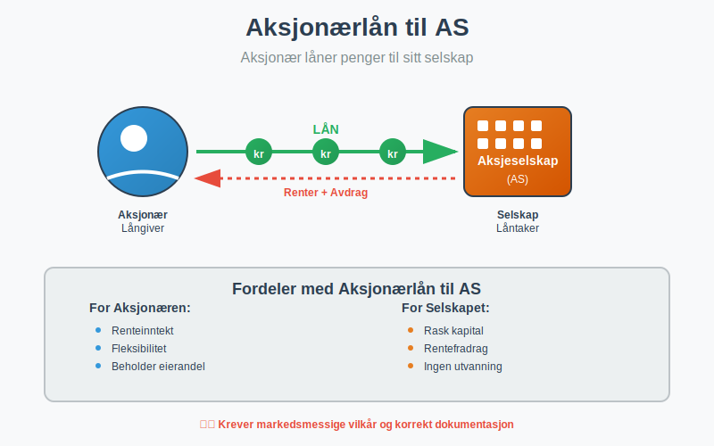

Et **aksjonærlån til AS** er et lån som en [aksjonær](/blogs/regnskap/hva-er-en-aksjonaer "Hva er en Aksjonær? En Komplett Guide") gir til sitt eget [aksjeselskap](/blogs/regnskap/hva-er-et-aksjeselskap "Hva er et Aksjeselskap? Komplett Guide til Selskapsformen"). Dette er en vanlig måte å tilføre kapital til selskapet på, spesielt i oppstartsfasen eller når selskapet trenger ekstra likviditet.



### Hva er et Aksjonærlån til AS?

Et aksjonærlån til AS oppstår når en aksjonær låner penger til selskapet sitt i stedet for å øke [aksjekapitalen](/blogs/regnskap/hva-er-aksjekapital "Hva er Aksjekapital? Krav og Forklaring"). Dette kan være:

- **Kortsiktig finansiering:** For å dekke midlertidige likviditetsbehov
- **Oppstartskapital:** Når selskapet trenger penger før det kan generere inntekter
- **Ekspansjonsfinansiering:** For investeringer og vekst
- **Alternativ til [kapitalforhøyelse](/blogs/regnskap/kapitalforhoyelse "Kapitalforhøyelse: Metoder og Regnskapsføring"):** Når man ikke ønsker å utvanne eierandelene

Lånet må dokumenteres skriftlig og følge markedsmessige vilkår for å unngå skattemessige problemer.


### Fordeler med Aksjonærlån til AS

#### For Aksjonæren (Långiveren)
- **Fleksibilitet:** Enklere å få pengene tilbake enn ved kapitalforhøyelse
- **Renteinntekt:** Kan motta markedsmessig rente på lånet
- **Sikkerhet:** Kan kreve sikkerhet for lånet
- **Kontroll:** Beholder samme eierandel i selskapet

#### For Selskapet (LÃ¥ntakeren)
- **Rask tilgang til kapital:** Ingen kompliserte kapitalforhøyelsesprosesser
- **Lavere kostnader:** Unngår kostnader ved emisjon av nye aksjer
- **Bevarer eierstruktur:** Ingen utvanning av eksisterende aksjonærer
- **Skattefordel:** Renteutgifter er fradragsberettigede


### Skattemessige Konsekvenser

#### For Aksjonæren (Långiveren)
- **Renteinntekt:** Mottatt rente regnes som skattepliktig kapitalinntekt
- **Tap på fordring:** Eventuelle tap kan være fradragsberettiget
- **Dokumentasjon:** Må kunne dokumentere lånet og renteinntektene

#### For Selskapet (LÃ¥ntakeren)
- **Renteutgift:** Betalt rente er fradragsberettiget i selskapet
- **Markedsmessig rente:** Må betale markedsmessig rente for å unngå problemer
- **Regnskapsføring:** Lånet må føres korrekt i [regnskapet](/blogs/regnskap/hva-er-regnskap "Hva er Regnskap? En komplett guide")

### Markedsmessig Rente og Vilkår

For at lånet skal være skattemessig akseptabelt, må det ha **markedsmessige vilkår**:

#### Rentesats
- **Normrente:** Skatteetaten fastsetter en normrente som veiledning
- **Markedsrente:** Renten må tilsvare det selskapet ville betalt til en ekstern långiver
- **Risikojustering:** Høyere risiko kan rettferdiggjøre høyere rente

#### LÃ¥nebetingelser
- **Nedbetalingsplan:** Klare avtaler om tilbakebetaling
- **Sikkerhet:** Eventuelle sikkerheter må dokumenteres
- **Oppsigelse:** Vilkår for oppsigelse av lånet


### Dokumentasjonskrav

Alle aksjonærlån til AS må være **skriftlig dokumentert**:

#### LÃ¥neavtale
- **Lånebeløp:** Hvor mye som lånes til selskapet
- **Rentesats:** Markedsmessig rente som skal betales
- **Nedbetalingsplan:** Hvordan og når lånet skal tilbakebetales
- **Sikkerhet:** Eventuelle sikkerheter selskapet stiller
- **Misligholdsbestemmelser:** Konsekvenser ved manglende betaling

#### Regnskapsføring
Lånet må føres korrekt i både aksjonærens og selskapets regnskap:

**I Selskapets Regnskap:**
- **Balansen:** Lånet føres som gjeld til aksjonær
- **Resultatregnskapet:** Renteutgifter føres som finanskostnad
- **Noter:** Aksjonærlån må spesifiseres i notene

**I Aksjonærens Regnskap:**
- **Balansen:** Lånet føres som fordring på selskap
- **Resultatregnskapet:** Renteinntekter føres som finansinntekt

### Praktiske Eksempler

#### Eksempel 1: Oppstartsfinansiering
Et nystartet selskap trenger 200 000 kr til utstyr:
- **Lånebeløp:** 200 000 kr fra aksjonær
- **Rente:** 4,0% (markedsmessig for oppstartsselskap)
- **Nedbetalingstid:** 5 år
- **Ã…rlig rentekostnad for selskap:** 8 000 kr
- **Skattefordel for selskap:** 8 000 kr × 22% = 1 760 kr

#### Eksempel 2: Likviditetsutfordring
Etablert selskap trenger midlertidig finansiering:
- **Lånebeløp:** 500 000 kr
- **Rente:** 3,5% (lavere risiko)
- **Nedbetalingstid:** 2 år
- **MÃ¥nedlige avdrag:** ca. 21 500 kr
- **Fleksibilitet:** Kan nedbetales raskere ved bedret likviditet


### Alternativer til Aksjonærlån

#### Kapitalforhøyelse
- **Permanent kapital:** Pengene blir permanent egenkapital
- **Utvanning:** Kan påvirke eierforhold hvis andre ikke deltar
- **Kompleksitet:** Krever generalforsamlingsvedtak og registrering

#### Innskuddskapital
- **Mellomløsning:** Kan senere konverteres til aksjekapital
- **Fleksibilitet:** Enklere å få tilbake enn aksjekapital
- **Skattemessig:** Spesielle regler for innskuddskapital

#### Ekstern finansiering
- **Banklån:** Tradisjonell finansiering fra bank
- **Høyere krav:** Strengere krav til sikkerhet og dokumentasjon
- **Uavhengighet:** Ikke avhengig av aksjonærenes private økonomi

### Risiko og Fallgruver

#### Vanlige Feil
- **Manglende dokumentasjon:** LÃ¥n uten skriftlig avtale
- **Ikke-markedsmessige vilkår:** For lav eller høy rente
- **Feil regnskapsføring:** Ikke føre lånet korrekt
- **Blanding med privat økonomi:** Ikke skille mellom privat og selskap

#### Konsekvenser ved Feil
- **Skatteetaten kan omklassifisere** lånet som kapitalinnskudd
- **Tap av rentefradrag** for selskapet
- **Skattemessige problemer** for aksjonæren
- **Juridiske utfordringer** ved manglende dokumentasjon

### Juridiske Aspekter

#### Aksjelovens Bestemmelser
[Aksjeloven](/blogs/regnskap/hva-er-aksjeloven "Hva er Aksjeloven? Regler for Aksjeselskaper i Norge") regulerer forholdet mellom aksjonærer og selskap:
- **Kreditorvern:** Aksjonærlån må ikke svekke kreditorenes stilling
- **Likestilling:** Alle aksjonærer må behandles likt
- **Styrets ansvar:** Styret må vurdere selskapets evne til å betjene lånet

#### Konkursloven
Ved konkurs har aksjonærlån spesiell status:
- **Ansvarlig lånekapital:** Kan bli underordnet andre kreditorer
- **Tilbakebetalingsrett:** Begrenset rett til tilbakebetaling ved konkurs
- **Dokumentasjon:** Viktig med korrekt dokumentasjon for å bevare rettigheter

### Praktiske RÃ¥d

#### For Aksjonæren
1. **Vurder risiko:** Forstå at lånet kan gå tapt ved konkurs
2. **Krev markedsmessige vilkår:** Både rente og sikkerhet
3. **Dokumenter alt:** Skriftlig avtale og oppfølging
4. **Følg opp betalinger:** Sørg for at renter og avdrag betales
5. **Konsulter eksperter:** Få juridisk og regnskapsmessig rådgivning

#### For Selskapet
1. **Vurder alternativer:** Sammenlign med andre finansieringsformer
2. **Sørg for bærekraft:** Ikke ta opp mer enn selskapet kan betjene
3. **Korrekt regnskapsføring:** Før lånet riktig fra dag én
4. **Overholdelse av avtaler:** Betal renter og avdrag i tide
5. **Kommunikasjon:** Hold aksjonæren informert om selskapets situasjon

### Regnskapsføring i Detalj

#### Etablering av LÃ¥net
```
Selskapets Regnskap:
Debet: Bank/Kasse (økning i eiendeler)
Kredit: Gjeld til aksjonær (økning i gjeld)

Aksjonærens Regnskap:
Debet: Fordring på selskap (økning i eiendeler)  
Kredit: Bank/Kasse (reduksjon i eiendeler)
```

#### Renteberegning og Betaling
```
Selskapets Regnskap:
Debet: Rentekostnad (kostnad)
Kredit: Gjeld til aksjonær (økt gjeld) eller Bank (betaling)

Aksjonærens Regnskap:
Debet: Bank/Kasse eller Fordring (økning)
Kredit: Renteinntekt (inntekt)
```

### Oppfølging og Kontroll

#### Løpende Oppfølging
- **Renteberegning:** MÃ¥nedlig eller kvartalsvis beregning
- **Betalingsoppfølging:** Kontroll av at avtaler overholdes
- **Likviditetsvurdering:** Vurdering av selskapets betalingsevne
- **Markedsrentejustering:** Ã…rlig vurdering av rentesats

#### Ã…rlig Gjennomgang
- **Avtalegjennomgang:** Vurdering av om avtalen fortsatt er hensiktsmessig
- **Risikoevaluering:** Vurdering av selskapets kredittverdighet
- **Skattemessig gjennomgang:** Kontroll av skattemessig behandling
- **Regnskapsrevisjon:** Kontroll av korrekt regnskapsføring

### Relaterte Begreper

For å forstå aksjonærlån til AS fullt ut, bør du også sette deg inn i:

- **[Aksjeselskap (AS)](/blogs/regnskap/hva-er-et-aksjeselskap "Hva er et Aksjeselskap? Komplett Guide til Selskapsformen")** - Selskapsformen som mottar lånet
- **[Aksjer](/blogs/regnskap/hva-er-en-aksje "Hva er en Aksje? En Enkel Forklaring")** - Eierandelene som gir rett til å låne til selskapet
- **[Aksjekapital](/blogs/regnskap/hva-er-aksjekapital "Hva er Aksjekapital? Krav og Forklaring")** - Alternativ til lån for kapitalinnsprøytning
- **[Aksjonærlån fra AS](/blogs/regnskap/hva-er-aksjonaerlan-fra-as "Hva er Aksjonærlån fra AS? Regler, Skatt og Praktiske Råd")** - Det motsatte: lån fra selskap til aksjonær
- **[Aksjeloven](/blogs/regnskap/hva-er-aksjeloven "Hva er Aksjeloven? Regler for Aksjeselskaper i Norge")** - Loven som regulerer forholdet mellom aksjonærer og selskap
- **[Regnskap](/blogs/regnskap/hva-er-regnskap "Hva er Regnskap? En komplett guide")** - Regnskapsføring av lån og renter

Aksjonærlån til AS kan være en effektiv finansieringsform, men krever nøye planlegging, korrekt dokumentasjon og oppfølging for å sikre både skattemessig og juridisk korrekt behandling.


