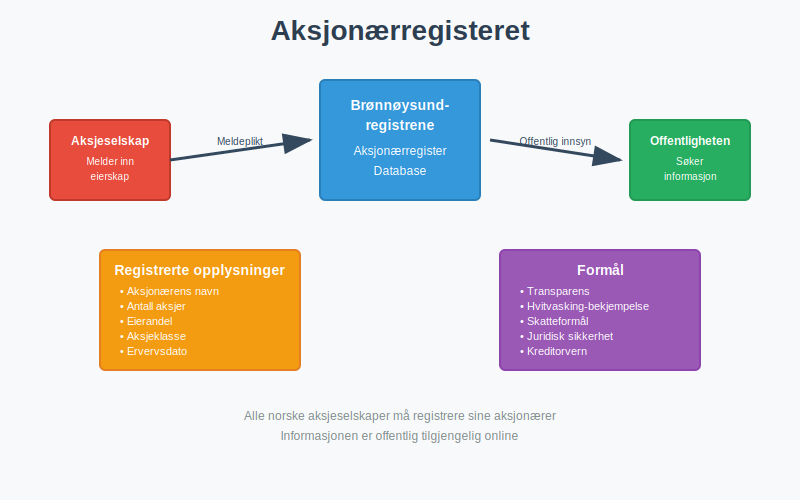
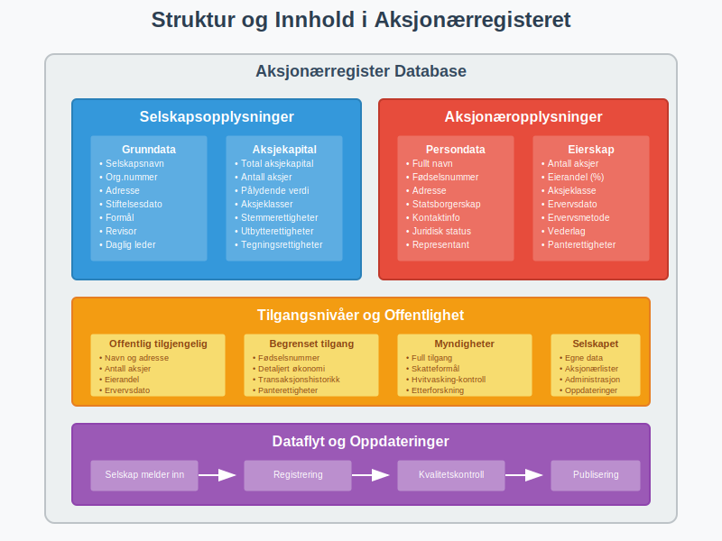
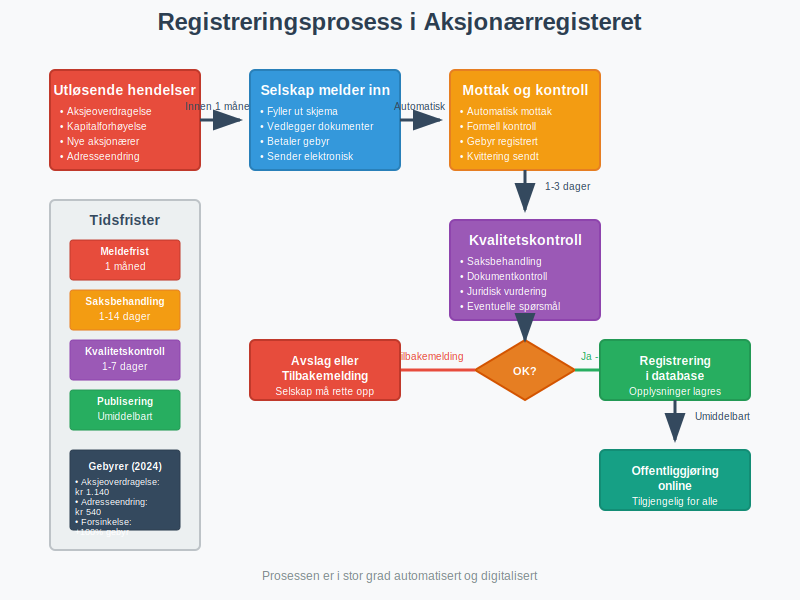
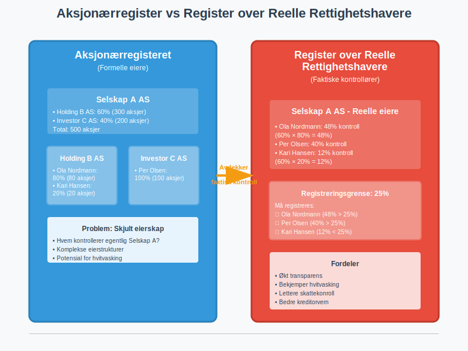
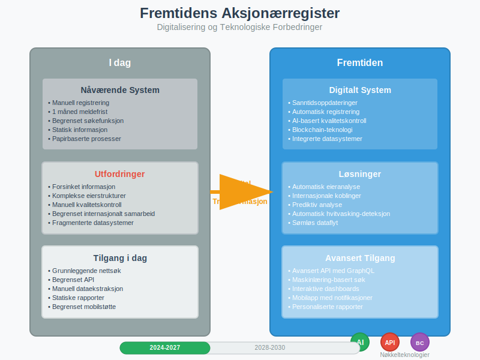

---
title: "Hva er Aksjonærregisteret?"
seoTitle: "Hva er Aksjonærregisteret?"
meta_description: '**Aksjonærregisteret** er et offentlig register som inneholder informasjon om alle aksjonærer i norske [aksjeselskaper (AS)](/blogs/regnskap/hva-er-et-aksjese...'
slug: hva-er-aksjonaerregisteret
type: blog
layout: pages/single
---

**Aksjonærregisteret** er et offentlig register som inneholder informasjon om alle aksjonærer i norske [aksjeselskaper (AS)](/blogs/regnskap/hva-er-et-aksjeselskap "Hva er et Aksjeselskap? Komplett Guide til Selskapsformen"). Registeret administreres av [**Brønnøysundregistrene**](/blogs/regnskap/bronnoysundregistrene "Hva er Brønnøysundregistrene? En Guide til Norges Registerforvalter") og gir innsyn i eierskap og eierstruktur i norske selskaper.

### Hva er Formålet med Aksjonærregisteret?

Det er viktig å skille mellom Aksjonærregisteret og selskapets egen [aksjeeierbok](/blogs/regnskap/hva-er-en-aksjeeierbok "Hva er en Aksjeeierbok? En Komplett Guide").

*   **Aksjeeierboken** er selskapets interne, løpende register over eiere. Denne må være oppdatert til enhver tid og danner grunnlaget for eiernes rettigheter.
*   **Aksjonærregisteret** er den årlige, offentlige rapporteringen til myndighetene, basert på informasjonen i aksjeeierboken per 31. desember. Denne rapporteringen skjer via [aksjonærregisteroppgaven (RF-1086)](/blogs/regnskap/aksjonaerregisteroppgave "Hva er Aksjonærregisteroppgave? Komplett Guide til Årlig Rapportering").

Aksjonærregisteret har flere viktige formål i det norske samfunnet:

*   **Transparens og åpenhet:** Sikrer offentlig innsyn i hvem som eier norske selskaper
*   **Bekjempelse av hvitvasking:** Hjelper myndigheter med å spore pengestrømmer og eierskap
*   **Skatteformål:** Gir skattemyndighetene oversikt over eierskap og kapitalstruktur
*   **Juridisk sikkerhet:** Beskytter [aksjonærer](/blogs/regnskap/hva-er-en-aksjonaer "Hva er en Aksjonær? En Komplett Guide") og kreditorer ved å dokumentere eierforhold

### Hvilke Opplysninger Registreres?

Aksjonærregisteret inneholder detaljert informasjon om både selskaper og deres eiere. Her er en oversikt over de viktigste opplysningene:

#### Opplysninger om Aksjonærer

| **Opplysningstype** | **Beskrivelse** | **Offentlig tilgjengelig** |
|---------------------|-----------------|----------------------------|
| Navn | Fullt navn på aksjonær | Ja |
| Fødselsnummer/Org.nr | Identifikasjon av aksjonær | Delvis* |
| Adresse | Bostedsadresse | Ja |
| Antall aksjer | Hvor mange [aksjer](/blogs/regnskap/hva-er-en-aksje "Hva er en Aksje? En Enkel Forklaring") som eies | Ja |
| Aksjeklasse | Type aksjer ([A-aksjer, B-aksjer](/blogs/regnskap/hva-er-aksjeklasser "Hva er Aksjeklasser? A-aksjer og B-aksjer Forklart")) | Ja |
| Eierandel | Prosentvis eierandel i selskapet | Ja |
| Ervervsdato | Når aksjene ble ervervet | Ja |

*Fødselsnummer vises kun delvis av personvernhensyn

#### Opplysninger om Selskapet

*   **Selskapsnavn** og organisasjonsnummer
*   **[Aksjekapital](/blogs/regnskap/hva-er-aksjekapital "Hva er Aksjekapital? Krav og Forklaring")** og antall aksjer
*   **Aksjeklasser** og deres rettigheter
*   **Styre** og [**daglig leder**](/blogs/regnskap/hva-er-daglig-leder "Hva er Daglig Leder? Rolle, Ansvar og Regnskapsmessige Forpliktelser")
*   **Revisor** og revisjonsplikt

### Hvem Har Tilgang til Aksjonærregisteret?

Tilgangen til aksjonærregisteret er **gradert** basert på hvem som spør og hvilket formål de har:

#### Offentlig Tilgjengelig Informasjon

Alle kan få tilgang til:

*   Aksjonærens navn og adresse
*   Antall aksjer og eierandel
*   Aksjeklasse
*   Ervervsdato

#### Begrenset Tilgang

Visse opplysninger er kun tilgjengelige for:

*   **Offentlige myndigheter** (skatt, politi, finanstilsyn)
*   **Selskapet selv** og dets representanter
*   **Andre aksjonærer** i samme selskap
*   **Kreditorer** med berettiget interesse

### Hvordan Fungerer Registreringen?

Registreringen i aksjonærregisteret skjer **automatisk** når det skjer endringer i eierskap. Her er prosessen:

#### Meldeplikt for Selskaper

[Aksjeselskaper](/blogs/regnskap/hva-er-et-aksjeselskap "Hva er et Aksjeselskap? Komplett Guide til Selskapsformen") har **meldeplikt** til aksjonærregisteret når:

1.  **Nye aksjonærer** kommer til
2.  **Eksisterende aksjonærer** endrer sin eierandel
3.  **Aksjer overføres** mellom parter
4.  **[Aksjekapitalen](/blogs/regnskap/hva-er-aksjekapital "Hva er Aksjekapital? Krav og Forklaring") endres**
5.  **Nye [aksjeklasser](/blogs/regnskap/hva-er-aksjeklasser "Hva er Aksjeklasser? A-aksjer og B-aksjer Forklart") opprettes**

#### Frister og Sanksjoner

| **Hendelse** | **Meldefrist** | **Sanksjon ved forsinkelse** |
|--------------|----------------|------------------------------|
| Aksjeoverdragelse | 1 måned | Gebyr kr 1.140 |
| Kapitalforhøyelse | 1 måned | Gebyr kr 1.140 |
| Endring av aksjeklasser | 1 måned | Gebyr kr 1.140 |
| Adresseendring | 1 måned | Gebyr kr 540 |

### Reelle Rettighetshavere

I tillegg til aksjonærregisteret finnes det et eget **register over reelle rettighetshavere**. Dette registeret fanger opp:

*   **Indirekte eierskap** gjennom holdingselskaper
*   **Kontroll** gjennom stemmerettigheter
*   **Økonomisk interesse** gjennom andre konstruksjoner

#### Terskelverdi for Registrering

Reelle rettighetshavere må registreres når de:

*   Eier **25% eller mer** av aksjene
*   Har **25% eller mer** av stemmene
*   Har **kontroll** på annen måte

### Praktiske Konsekvenser for Aksjonærer

Som aksjonær i et norsk [aksjeselskap](/blogs/regnskap/hva-er-et-aksjeselskap "Hva er et Aksjeselskap? Komplett Guide til Selskapsformen") påvirker aksjonærregisteret deg på flere måter:

#### Personvern og Offentlighet

*   **Ditt navn** og eierskap er offentlig tilgjengelig
*   **Fødselsnummer** vises kun delvis
*   **Adresse** er offentlig, men kan være c/o-adresse

#### Skattemessige Konsekvenser

Aksjonærregisteret brukes av skattemyndighetene til:

*   **Kontroll av [utbytte](/blogs/regnskap/hva-er-en-aksje "Hva er en Aksje? En Enkel Forklaring")** og kapitalgevinster
*   **Verifikasjon av [aksjonærlån](/blogs/regnskap/hva-er-aksjonaerlan-fra-as "Hva er Aksjonærlån fra AS? Regler, Skatt og Praktiske Råd")**
*   **Overvåking av [lån til selskapet](/blogs/regnskap/hva-er-aksjonaerlan-til-as "Hva er Aksjonærlån til AS? Finansiering, Skatt og Praktiske Råd")**

### Digitalisering og Fremtiden

Aksjonærregisteret er i stadig utvikling med fokus på:

#### Teknologiske Forbedringer

*   **Sanntidsoppdateringer** av eierskap
*   **Bedre søkefunksjonalitet** for offentligheten
*   **API-tilgang** for profesjonelle brukere
*   **Integrering** med andre offentlige registre

#### Økt Transparens

*   **Utvidet rapportering** av komplekse eierstrukturer
*   **Bedre sporing** av internasjonale eiere
*   **Styrket kontroll** med hvitvasking

### Internasjonalt Perspektiv

Norge er ikke alene om å ha et offentlig aksjonærregister. Mange land har lignende systemer:

#### Sammenligning med Andre Land

| **Land** | **Offentlig tilgang** | **Reelle rettighetshavere** | **Gebyr for innsyn** |
|----------|----------------------|----------------------------|---------------------|
| Norge | Ja | Ja | Gratis online |
| Danmark | Ja | Ja | Gratis online |
| Sverige | Ja | Nei | Gratis online |
| Tyskland | Begrenset | Ja | Gebyr |
| Storbritannia | Ja | Ja | Gratis online |

### Hvordan Få Tilgang til Informasjon

For å få tilgang til informasjon fra aksjonærregisteret kan du:

#### Online Søk

*   Besøk **Brønnøysundregistrenes** nettsider
*   Søk på **selskapsnavn** eller **organisasjonsnummer**
*   Få **gratis** tilgang til grunnleggende informasjon

#### Utvidet Informasjon

For mer detaljert informasjon:

*   **Bestill utskrift** mot gebyr
*   **Kontakt selskapet** direkte
*   **Bruk profesjonelle tjenester** for omfattende analyser

### Juridiske Aspekter og Regelverk

Aksjonærregisteret er regulert av flere lover og forskrifter:

#### Relevant Lovgivning

*   **[Aksjeloven](/blogs/regnskap/hva-er-aksjeloven "Hva er Aksjeloven? Regler for Aksjeselskaper i Norge")** - grunnleggende regler for aksjeselskaper
*   **Regnskapsloven** - krav til [regnskap](/blogs/regnskap/hva-er-regnskap "Hva er Regnskap? En komplett guide") og rapportering
*   **Hvitvaskingsloven** - regler om reelle rettighetshavere
*   **Forvaltningsloven** - saksbehandling og innsyn

#### Rettigheter og Plikter

Som aksjonær har du:

**Rettigheter:**
*   Innsyn i egne opplysninger
*   Rett til korreksjon av feil
*   Beskyttelse av personopplysninger

**Plikter:**
*   Melde adresseendringer
*   Oppgi korrekte opplysninger
*   Samarbeide ved kontroller

### Konklusjon

Aksjonærregisteret er en **hjørnestein** i det norske selskapsrettslige systemet. Det sikrer transparens, bekjemper økonomisk kriminalitet og gir nødvendig innsyn i eierskap av norske selskaper.

For deg som aksjonær eller som vurderer å investere i [aksjer](/blogs/regnskap/hva-er-en-aksje "Hva er en Aksje? En Enkel Forklaring"), er det viktig å forstå at ditt eierskap vil være **offentlig tilgjengelig**. Dette er prisen for å delta i det norske næringslivet, men det gir også trygghet og forutsigbarhet for alle parter.

Registeret vil fortsette å utvikle seg med teknologien, og vi kan forvente enda bedre tilgang til informasjon og økt transparens i årene som kommer.

