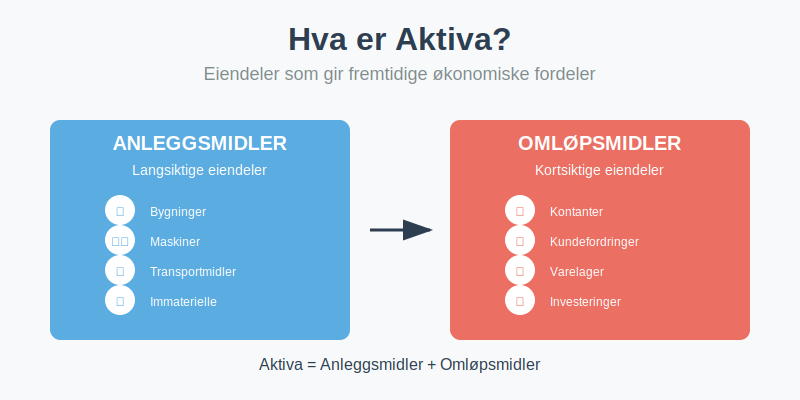
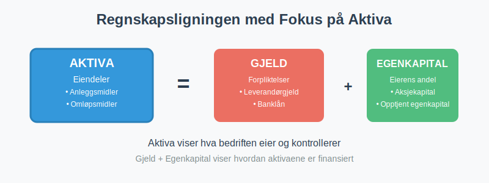
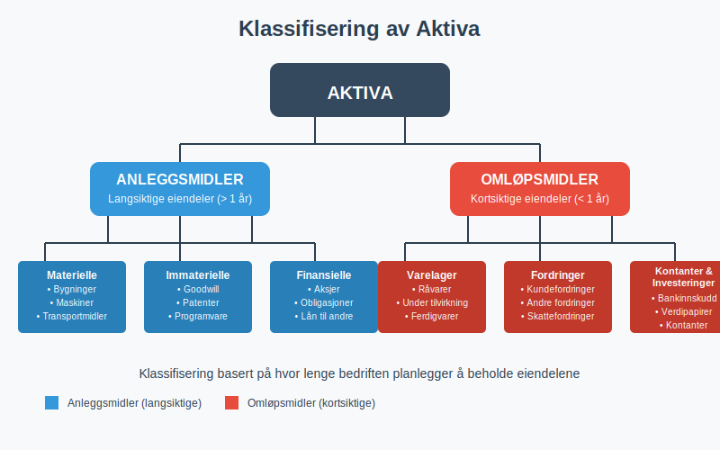
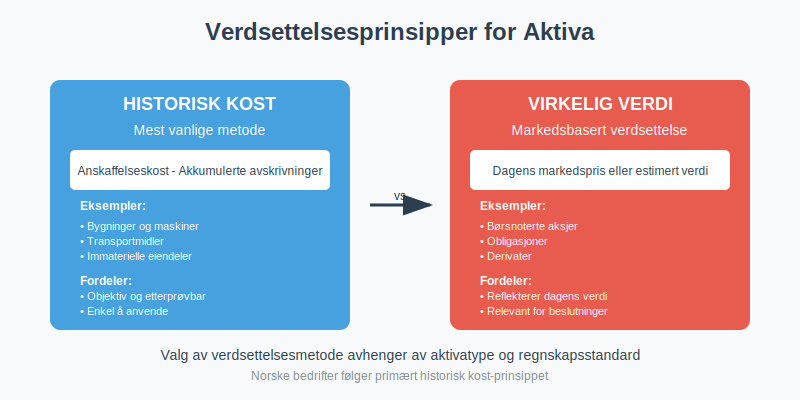
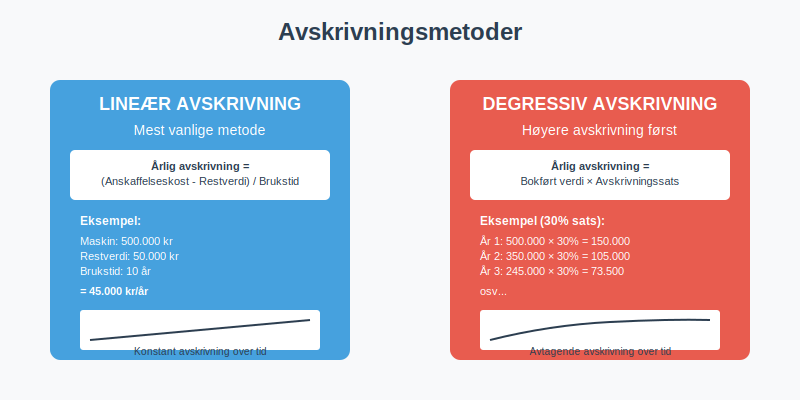
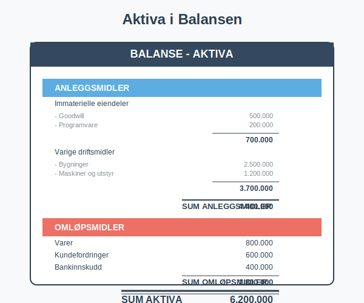
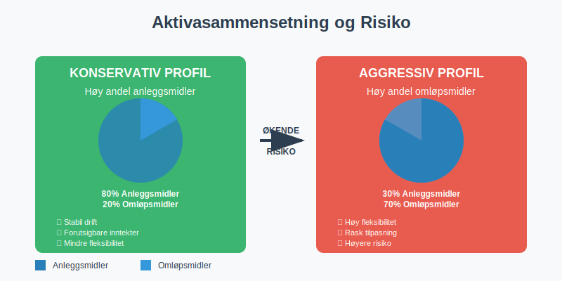
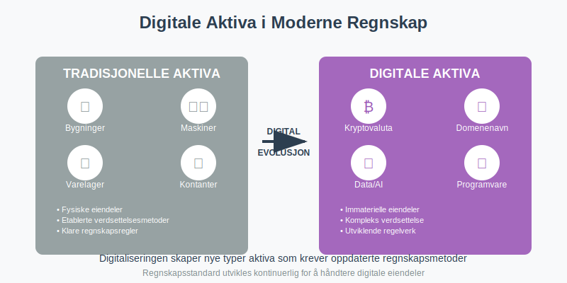

---
title: "Hva er aktiva?"
seoTitle: "Hva er aktiva?"
description: '**Aktiva**, også kjent som **[eiendeler](/blogs/regnskap/hva-er-eiendeler "Hva er Eiendeler? Komplett Oversikt over Eiendelstyper")**, er alle økonomiske ress...'
---

**Aktiva**, også kjent som **[eiendeler](/blogs/regnskap/hva-er-eiendeler "Hva er Eiendeler? Komplett Oversikt over Eiendelstyper")**, er alle økonomiske ressurser som en bedrift kontrollerer og som forventes å gi fremtidige økonomiske fordeler. Aktiva utgjør venstre side av [regnskapsligningen](/blogs/regnskap/hva-er-regnskap "Hva er Regnskap? En Dybdeanalyse for Norge") og er fundamentale for å forstå en bedrifts finansielle stilling. Korrekt registrering og oppfølging av aktiva krever systematisk [bokføring](/blogs/regnskap/hva-er-bokføring "Hva er Bokføring? En Komplett Guide til Norsk Bokføringspraksis") for å sikre nøyaktig dokumentasjon av alle [eiendeler](/blogs/regnskap/hva-er-eiendeler "Hva er Eiendeler? Komplett Oversikt over Eiendelstyper").



## Seksjon 1: Definisjon og Grunnleggende Prinsipper

### 1.1 Hva Kvalifiserer som Aktiva?

For at noe skal klassifiseres som aktiva, må det oppfylle tre grunnleggende kriterier:

* **Kontroll:** Bedriften må ha kontroll over ressursen som følge av tidligere hendelser
* **Fremtidige økonomiske fordeler:** Ressursen må forventes å bidra til fremtidige kontantstrømmer
* **Pålitelig måling:** Verdien må kunne måles på en pålitelig måte

### 1.2 Aktiva i Regnskapsligningen

Aktiva er den første komponenten i den fundamentale regnskapsligningen:

**Aktiva = [Passiva](/blogs/regnskap/hva-er-passiva "Hva er Passiva? En Guide til Gjeld og Egenkapital i Regnskap") (Gjeld + Egenkapital)**



Dette betyr at alle eiendeler i bedriften enten er finansiert gjennom gjeld (lån) eller egenkapital (eierens innskudd og tilbakeholdt overskudd). For en detaljert forklaring av disse finansieringskildene, se [Hva er passiva?](/blogs/regnskap/hva-er-passiva "Hva er Passiva? En Guide til Gjeld og Egenkapital i Regnskap").

## Seksjon 2: Klassifisering av Aktiva

Aktiva klassifiseres primært i to hovedkategorier basert på hvor lenge bedriften planlegger å beholde dem:



### 2.1 Anleggsmidler (Ikke-omløpsmidler)

**[Anleggsmidler](/blogs/regnskap/hva-er-anleggsmidler "Hva er Anleggsmidler? Komplett Guide til Faste Eiendeler i Regnskap")** er eiendeler som bedriften planlegger å beholde i mer enn ett år og som brukes i den løpende driften. For en dybdegående forklaring av alle aspekter ved anleggsmidler, se vår omfattende guide.

#### Materielle Anleggsmidler

* **Bygninger og tomter:** Kontorer, fabrikker, lagerlokaler
* **Maskiner og utstyr:** Produksjonsutstyr, datamaskiner, møbler
* **Transportmidler:** Firmabiler, lastebiler, gaffeltrucks

#### Immaterielle Anleggsmidler

* **[Goodwill](/blogs/regnskap/hva-er-goodwill "Hva er Goodwill? Komplett Guide til Goodwill og Immaterielle Eiendeler"):** Merverdi ved oppkjøp av andre selskaper
* **Patenter og lisenser:** Rettigheter til teknologi eller produkter
* **Programvare:** Spesialiserte datasystemer og applikasjoner
* **Varemerker:** Registrerte merkenavn og logoer

Immaterielle anleggsmidler behandles annerledes enn materielle eiendeler når det gjelder verdireduksjon over tid. I stedet for avskrivninger brukes [amortisering](/blogs/regnskap/hva-er-amortisering "Hva er Amortisering? En Komplett Guide til Avskrivninger") for å fordele kostnaden av immaterielle eiendeler over deres økonomiske levetid.

#### Finansielle Anleggsmidler

* **Langsiktige [investeringer](/blogs/regnskap/hva-er-investere "Hva er å Investere? Komplett Guide til Investeringer i Regnskap"):** Aksjer i andre selskaper
* **Obligasjoner:** Langsiktige rentebærende verdipapirer
* **Lån til tilknyttede selskaper:** Som [aksjonærlån fra AS](/blogs/regnskap/hva-er-aksjonaerlan-fra-as "Hva er Aksjonærlån fra AS? Skatt, Renter og Regnskapsføring")

### 2.2 Omløpsmidler

**[Omløpsmidler](/blogs/regnskap/hva-er-omlopsmiddel "Hva er Omløpsmidler? Komplett Guide til Kortsiktige Eiendeler i Regnskap")** er eiendeler som forventes å bli konvertert til kontanter eller forbrukt innen ett år. For en omfattende guide til alle aspektene ved omløpsmidler, inkludert klassifisering, verdsettelse, likviditetsanalyse og praktiske eksempler, se vår detaljerte artikkel om [omløpsmidler](/blogs/regnskap/hva-er-omlopsmiddel "Hva er Omløpsmidler? Komplett Guide til Kortsiktige Eiendeler i Regnskap").

#### Varelager

**[Lagerbeholdning](/blogs/regnskap/hva-er-lagerbeholdning "Hva er Lagerbeholdning? Komplett Guide til Lagerstyring og Verdivurdering")** utgjør ofte en betydelig del av omløpsmidlene og krever nøye styring og verdivurdering:

* **Råvarer:** Materialer som skal brukes i produksjon
* **Varer under tilvirkning:** Halvferdige produkter
* **Ferdigvarer:** Produkter klare for salg

For en omfattende guide til lagerstyring, verdivurderingsmetoder som FIFO og vektet gjennomsnitt, samt regnskapsføring av lagerbeholdning, se vår detaljerte artikkel om [lagerbeholdning](/blogs/regnskap/hva-er-lagerbeholdning "Hva er Lagerbeholdning? Komplett Guide til Lagerstyring og Verdivurdering").

#### Fordringer

* **Kundefordringer:** Penger kunder skylder for leverte varer/tjenester (se [debitor](/blogs/regnskap/hva-er-debitor "Hva er Debitor i Regnskap? Komplett Guide til Kundefordringer og Debitorhåndtering"))
* **Andre fordringer:** Forskuddsbetalte kostnader, [depositum](/blogs/regnskap/hva-er-depositum "Hva er Depositum i Regnskap? Typer, Regnskapsføring og Praktiske Eksempler")
* **Skattefordringer:** Tilgodehavende fra skattemyndighetene

#### Kortsiktige investeringer

* **[Bankinnskudd](/blogs/regnskap/hva-er-bankinnskudd "Hva er Bankinnskudd i Regnskap? Typer, Regnskapsføring og Rentehåndtering"):** Kontanter på bedriftens bankkontoer
* **Kortsiktige verdipapirer:** [Investeringer](/blogs/regnskap/hva-er-investere "Hva er å Investere? Komplett Guide til Investeringer i Regnskap") som kan selges raskt

## Seksjon 3: Verdsettelse av Aktiva

Verdsettelse av aktiva følger spesifikke regnskapsprinsipper som sikrer konsistens og sammenlignbarhet. For en dypere forståelse av verdivurderingsmetoder og deres praktiske anvendelse, se vår omfattende guide til [balansebasert verdivurdering](/blogs/regnskap/hva-er-balansebasert-verdivurdering "Balansebasert Verdivurdering - Metoder, Prinsipper og Praktisk Anvendelse"). For en bredere forståelse av hvordan eiendeler verdsettes i formuessammenheng, se også vår guide til [formuesverdi](/blogs/regnskap/hva-er-formuesverdi "Formuesverdi - Komplett Guide til Verdivurdering og Formuesvurdering").



### 3.1 Historisk Kost-Prinsippet

De fleste aktiva verdsettes til **historisk kost**, som er den opprinnelige [anskaffelseskostnaden](/blogs/regnskap/hva-er-anskaffelseskost "Hva er Anskaffelseskost? Beregning, Komponenter og Regnskapsføring") justert for:

* **Akkumulerte avskrivninger** (for anleggsmidler)
* **Nedskrivninger** (hvis verdien har falt permanent)
* **Oppskrivninger** (i spesielle tilfeller)

### 3.2 Virkelig Verdi

Enkelte aktiva, særlig finansielle instrumenter, kan verdsettes til **virkelig verdi** (markedsverdi):

| Aktivatype | Verdsettelsesmetode | Eksempel |
|:-----------|:-------------------|:---------|
| Bygninger | Historisk kost - avskrivninger | Kontor kjøpt for 5 mill., avskrevet 1 mill. = 4 mill. |
| Kundefordringer | Pålydende - tapsavsetning | Fordring 100.000, tapsrisiko 5% = 95.000 |
| Aksjer (omløp) | Virkelig verdi | Børsnoterte aksjer til dagens kurs |
| Varelager | Laveste av kost og netto salgspris | Varer kjøpt for 50.000, kan selges for 45.000 = 45.000 |

Når det oppstår avvik mellom bokført og faktisk lagerverdi, kreves systematisk [lagerkorreksjon](/blogs/regnskap/hva-er-lagerkorreksjon "Hva er Lagerkorreksjon? Komplett Guide til Lagerjustering i Regnskap") for å sikre korrekt verdsettelse.

Ved verdsettelse og presentasjon av aktiva er det viktig å følge konsistente [avrundingsprinsipper](/blogs/regnskap/avrunding-regnskap "Avrunding i Regnskap - Regler, Prinsipper og Praktiske Eksempler") for å sikre klarhet og sammenlignbarhet i regnskapet.

## Seksjon 4: Avskrivninger og Verdifall

### 4.1 Avskrivninger av Anleggsmidler

**[Avskrivninger](/blogs/regnskap/hva-er-avskrivning "Hva er Avskrivning i Regnskap? Metoder, Beregning og Praktiske Eksempler")** fordeler kostnaden av et anleggsmiddel over dets brukstid. Dette gjenspeiler at eiendelen gradvis mister verdi gjennom bruk og elde.

For en komplett guide til avskrivningsmetoder, beregninger og skattemessige regler, se vår detaljerte artikkel om [avskrivning i regnskap](/blogs/regnskap/hva-er-avskrivning "Hva er Avskrivning i Regnskap? Metoder, Beregning og Praktiske Eksempler").



#### Vanlige Avskrivningsmetoder

**Lineær avskrivning** (mest vanlig):
```
Årlig avskrivning = (Anskaffelseskost - Restverdi) / Brukstid
```

**Eksempel:** En maskin koster 500.000 kr, har en forventet brukstid på 10 år og restverdi på 50.000 kr.
```
Årlig avskrivning = (500.000 - 50.000) / 10 = 45.000 kr per år
```

#### Avskrivningssatser i Norge

| Aktivatype | Typisk avskrivningssats | Maksimal sats (skattemessig) |
|:-----------|:----------------------|:----------------------------|
| Kontormaskiner | 20-30% | 30% |
| Personbiler | 20-25% | 25% |
| Bygninger | 2-5% | 4% |
| Datautstyr | 30-50% | 50% |

### 4.2 Nedskrivninger

Hvis et aktivums verdi faller permanent under bokført verdi, må det **nedskrives**. Dette kan skje ved:

* Teknologisk utvikling som gjør eiendelen foreldet
* Markedsendringer som reduserer verdien
* Fysisk skade eller forringelse

## Seksjon 5: Aktiva i Balansen

I **balansen** presenteres aktiva på venstre side eller øverst, organisert etter likviditet (hvor lett de kan konverteres til kontanter). Aktiva utgjør den ene siden av den fundamentale regnskapsligningen og viser alle økonomiske ressurser som virksomheten kontrollerer. For en omfattende forklaring av balansens struktur og hvordan aktiva inngår i det totale bildet, se vår artikkel [Hva er balanse i regnskap?](/blogs/regnskap/hva-er-balanse "Hva er Balanse i Regnskap? Komplett Guide til Balansens Oppbygging og Funksjon").

For en dyptgående forståelse av alle aspektene ved regnskapsføring og analyse av balansen, inkludert verdivurdering av aktiva, regnskapsprinsipper og praktisk balansehåndtering, anbefaler vi vår detaljerte guide om [balanseregnskap](/blogs/regnskap/hva-er-balanseregnskap "Hva er Balanseregnskap? Komplett Guide til Balansens Oppbygging og Analyse").

For mer om hvordan balansen utarbeides ved årets slutt, se vår guide om [avslutningsbalanse](/blogs/regnskap/hva-er-avslutningsbalanse "Hva er Avslutningsbalanse? Komplett Guide til Årsavslutning").



### 5.1 Typisk Balanseoppsett for Aktiva

```
AKTIVA

ANLEGGSMIDLER
Immaterielle eiendeler
- Goodwill                           500.000
- Programvare                        200.000
Sum immaterielle eiendeler           700.000

Varige driftsmidler
- Bygninger                        2.500.000
- Maskiner og utstyr               1.200.000
- Transportmidler                    300.000
Sum varige driftsmidler            4.000.000

Finansielle anleggsmidler
- Investeringer i aksjer             150.000
Sum finansielle anleggsmidler        150.000

SUM ANLEGGSMIDLER                  4.850.000

OMLØPSMIDLER
Varer
- Råvarer                           400.000
- Ferdigvarer                       600.000
Sum varer                         1.000.000

Fordringer
- Kundefordringer                   800.000
- Andre fordringer                  100.000
Sum fordringer                      900.000

[Bankinnskudd og kontanter](/blogs/regnskap/hva-er-kontantbeholdning "Hva er Kontantbeholdning? Komplett Guide til Kontantforvaltning og Likviditet")           500.000

SUM OMLØPSMIDLER                  2.400.000

SUM AKTIVA                        7.250.000
```

## Seksjon 6: Praktiske Eksempler og Regnskapsføring

### 6.1 Kjøp av Anleggsmiddel

**Eksempel:** Bedriften kjøper en ny maskin for 300.000 kr + 75.000 kr i [MVA](/blogs/regnskap/hva-er-moms-mva "Hva er Merverdiavgift (MVA/Moms)? Komplett Guide til Norsk Merverdiavgift").

**Regnskapsføring:**
```
Debet: Maskiner og utstyr           300.000
Debet: Inngående MVA                 75.000
Kredit: Leverandørgjeld                     375.000
```

### 6.2 Månedlig Avskrivning

Hvis maskinen avskrives over 10 år (lineært):
```
Månedlig avskrivning = 300.000 / (10 × 12) = 2.500 kr
```

**Regnskapsføring hver måned:**
```
Debet: Avskrivninger                  2.500
Kredit: Akkumulerte avskrivninger             2.500
```

### 6.3 Salg av Kundefordring

**Eksempel:** Bedriften selger varer for 100.000 kr + 25.000 kr [MVA](/blogs/regnskap/hva-er-moms-mva "Hva er Merverdiavgift (MVA/Moms)? Komplett Guide til Norsk Merverdiavgift") på kreditt.

**Regnskapsføring:**
```
Debet: Kundefordringer             125.000
Kredit: Salgsinntekter                     100.000
Kredit: Utgående MVA                        25.000
```

## Seksjon 7: Aktiva og Finansiell Analyse

### 7.1 Nøkkeltall for Aktiva

Aktiva brukes i flere viktige finansielle nøkkeltall:

| Nøkkeltall | Formel | Hva det måler |
|:-----------|:-------|:-------------|
| Omløpshastighet | Omsetning / Gjennomsnittlig totalkapital | Hvor effektivt aktiva genererer salg |
| Likviditetsgrad 1 | Omløpsmidler / Kortsiktig gjeld | Evne til å betale kortsiktig gjeld |
| Likviditetsgrad 2 | (Omløpsmidler - Varer) / Kortsiktig gjeld | Likviditet uten å selge varelager |
| [Arbeidskapital](/blogs/regnskap/hva-er-arbeidskapital "Hva er Arbeidskapital? En Komplett Guide til Working Capital") | Omløpsmidler - Kortsiktig gjeld | Bedriftens kortsiktige finansielle helse |
| Egenkapitalandel | Egenkapital / Sum aktiva | Hvor mye av aktiva som er eierfinansiert |

### 7.2 Aktivasammensetning og Risiko

Sammensetningen av aktiva påvirker bedriftens risikoprofil:

* **Høy andel anleggsmidler:** Mindre fleksibilitet, men stabil drift
* **Høy andel omløpsmidler:** Mer fleksibilitet, men potensielt lavere avkastning
* **Høy andel kundefordringer:** Kredittrisiko og likviditetsutfordringer



## Seksjon 8: Norske Regnskapsregler for Aktiva

### 8.1 Regnskapsloven og God Regnskapsskikk

Norske bedrifter må følge **regnskapsloven** og **god regnskapsskikk** ved regnskapsføring av aktiva. Viktige prinsipper inkluderer:

* **Forsiktighetsprinsippet:** Ikke overvurder aktiva
* **Sammenlignbarhetsprinsippet:** Konsistent behandling over tid
* **Vesentlighetsprinsippet:** Fokus på det som påvirker beslutninger

### 8.2 Forskjeller mellom Regnskaps- og Skattemessige Regler

Det kan være forskjeller mellom hvordan aktiva behandles regnskapsmessig og skattemessig:

| Område | Regnskapsmessig | Skattemessig |
|:-------|:---------------|:-------------|
| Avskrivninger | Basert på faktisk brukstid | Maksimalsatser i skatteloven |
| Nedskrivninger | Når verdifall er permanent | Strengere krav til dokumentasjon |
| Oppskrivninger | Tillatt i visse tilfeller | Generelt ikke tillatt |

## Seksjon 9: Digitalisering og Moderne Aktivaforvaltning

### 9.1 Automatisering av Aktivaregistrering

Moderne regnskapssystemer tilbyr automatisering av aktivaforvaltning:

* **Automatisk avskrivningsberegning** basert på forhåndsdefinerte regler
* **Integrasjon med innkjøpssystemer** for automatisk registrering av nye aktiva
* **Varsling om vedlikeholdsbehov** og utskiftning av anleggsmidler

### 9.2 Digitale Aktiva

Med digitaliseringen har nye typer aktiva oppstått:

* **Kryptovaluta:** Digitale valutaer som Bitcoin
* **Digitale rettigheter:** Domenenavn, digitale lisenser
* **Data og algoritmer:** Verdifulle datasett og AI-modeller



## Seksjon 10: Praktiske Råd for Aktivaforvaltning

### 10.1 Best Practices

* **Regelmessig inventering:** Kontroller fysiske aktiva minst årlig
* **Dokumentasjon:** Hold orden på [kvitteringer](/blogs/regnskap/kvittering "Hva er Kvittering? En Guide til Kvitteringskrav i Norsk Regnskap") og kontrakter
* **Forsikring:** Sørg for adekvat forsikringsdekning
* **Vedlikehold:** Planlagt vedlikehold forlenger levetiden
* **[Avstemming](/blogs/regnskap/hva-er-avstemming "Hva er Avstemming i Regnskap? Komplett Guide til Regnskapsavstemming"):** Regelmessig avstemming av aktivakontoer mot eksterne kilder sikrer nøyaktighet

### 10.2 Vanlige Feil å Unngå

* **Glemme avskrivninger:** Kan føre til overvurderte aktiva
* **Ikke nedskrive verdiløse aktiva:** Gir et misvisende bilde
* **Blande drifts- og investeringsutgifter:** Påvirker resultatregnskapet
* **Manglende dokumentasjon:** Problemer ved revisjon eller skattekontroll

## Konklusjon

Aktiva er hjørnesteinen i enhver bedrifts økonomi og en fundamental del av [regnskapsføringen](/blogs/regnskap/hva-er-regnskap "Hva er Regnskap? En Dybdeanalyse for Norge"). Forståelse av hvordan aktiva klassifiseres, verdsettes og regnskapsføres er essensielt for:

* **Bedriftsledere:** For å ta informerte beslutninger om investeringer
* **Investorer:** For å vurdere bedriftens finansielle helse
* **Regnskapsførere:** For å sikre korrekt rapportering
* **Långivere:** For å vurdere sikkerhet og tilbakebetalingsevne

Ved å følge etablerte regnskapsprinsipper og holde seg oppdatert på regelverksendringer, kan bedrifter sikre at deres aktivaforvaltning bidrar til langsiktig suksess og finansiell stabilitet.

For mer informasjon om relaterte emner, se våre artikler om [saldobalanse](/blogs/regnskap/hva-er-saldobalanse "Hva er en Saldobalanse? Komplett Guide") og [aksjekapital](/blogs/regnskap/hva-er-aksjekapital "Hva er Aksjekapital? Krav og Regler for AS").


