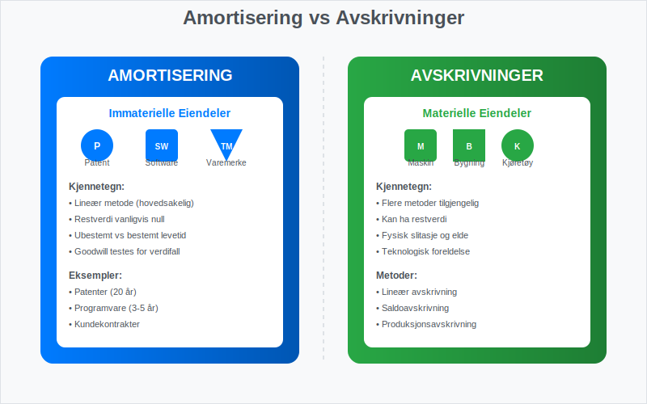
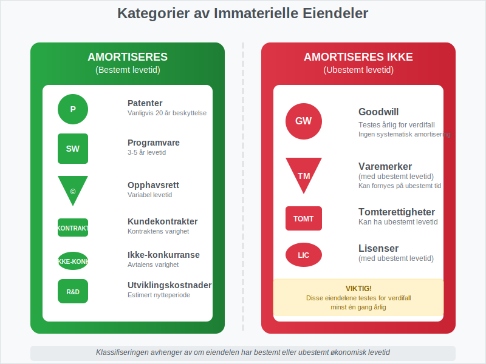
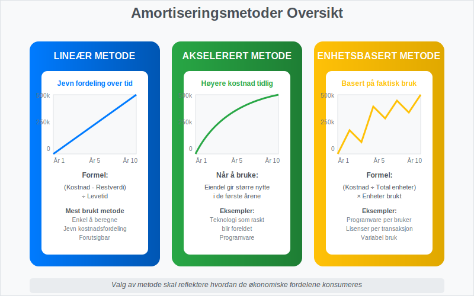
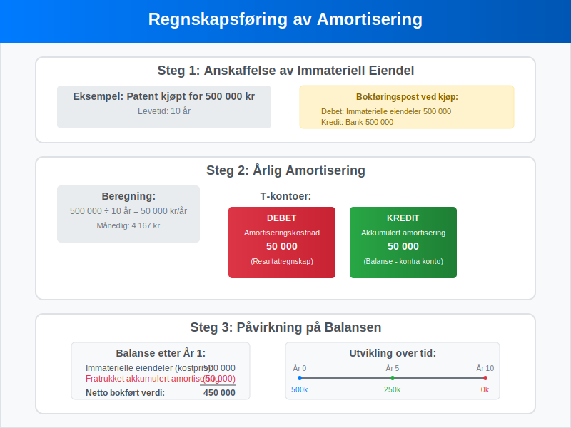
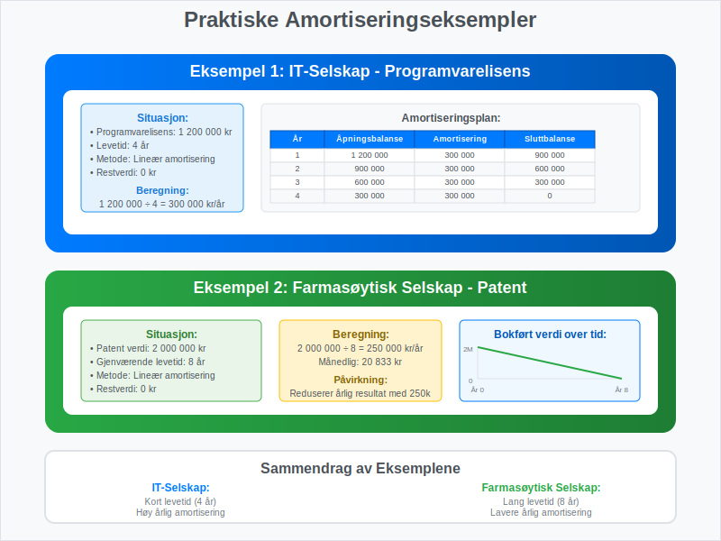
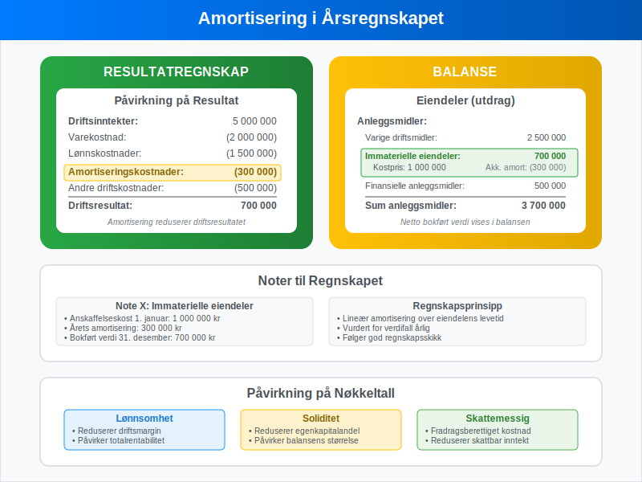
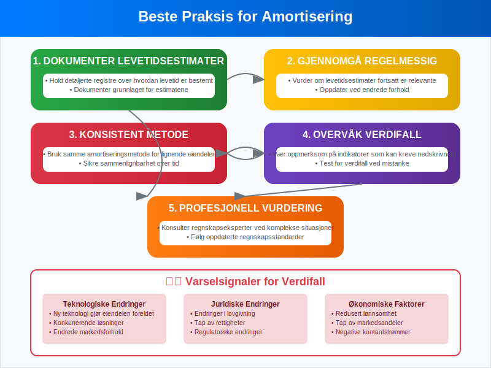

---
title: "Hva er amortisering?"
meta_title: "Hva er amortisering?"
meta_description: '**Amortisering** er en regnskapsmessig metode for å fordele [kostnaden](/blogs/regnskap/hva-er-kostnader "Hva er Kostnader i Regnskap? Komplett Guide til Kostn...'
slug: hva-er-amortisering
type: blog
layout: pages/single
---

**Amortisering** er en regnskapsmessig metode for å fordele [kostnaden](/blogs/regnskap/hva-er-kostnader "Hva er Kostnader i Regnskap? Komplett Guide til Kostnadstyper og Regnskapsføring") av [imaterielle rettigheter](/blogs/regnskap/hva-er-imaterielle-rettigheter "Hva er Imaterielle Rettigheter? Komplett Guide til Regnskapsføring og Verdivurdering") over deres økonomiske levetid. I motsetning til [avskrivninger](/blogs/regnskap/hva-er-avskrivning "Hva er Avskrivning i Regnskap? Metoder, Beregning og Praktiske Eksempler") som gjelder materielle eiendeler, brukes amortisering spesifikt for å redusere verdien av immaterielle eiendeler som patenter, [varemerker](/blogs/kontoplan/1050-varemerker "Konto 1050 - Varemerker") (se [Hva er varemerke?](/blogs/regnskap/hva-er-varemerke "Hva er varemerke? En Guide til Immaterielle Eiendeler i Regnskap")), goodwill og programvare.

For mer om emisjonsrabatt ved lån og obligasjoner, se [Hva er Disagio?](/blogs/regnskap/disagio "Hva er Disagio? Emisjonsrabatt på lån og obligasjoner").

## Forskjellen mellom Amortisering og Avskrivninger

Mange forveksler amortisering med avskrivninger, men det er viktige forskjeller mellom disse to regnskapsbegrepene.



### Hovedforskjeller:

| Aspekt | Amortisering | Avskrivninger |
|--------|-------------|---------------|
| **Eiendelstype** | Immaterielle eiendeler | Materielle eiendeler ([anleggsmidler](/blogs/regnskap/hva-er-anleggsmidler "Hva er Anleggsmidler? Komplett Guide til Faste Eiendeler i Regnskap")) |
| **Eksempler** | Patenter, goodwill, programvare | Maskiner, bygninger, biler |
| **Metoder** | Lineær metode (hovedsakelig) | Lineær, saldometode, produksjonsmetode |
| **Restverdi** | Vanligvis null | Kan ha restverdi |
| **Regnskapsstandard** | NGRS/IFRS | NGRS/IFRS |

## Typer Immaterielle Eiendeler som Amortiseres

Ikke alle [imaterielle rettigheter](/blogs/regnskap/hva-er-imaterielle-rettigheter "Hva er Imaterielle Rettigheter? Komplett Guide til Regnskapsføring og Verdivurdering") amortiseres. Noen har ubestemt levetid og testes i stedet for verdifall.



### Eiendeler som Amortiseres:

* **Patenter:** Beskytter oppfinnelser i en bestemt periode (vanligvis 20 år)
* **Opphavsrettigheter:** Gir eksklusiv rett til å bruke kreativt arbeid
* **Programvare:** Kjøpt eller utviklet programvare for intern bruk
* **Kundekontrakter:** Verdien av eksisterende kundeforhold
* **Ikke-konkurranse avtaler:** Avtaler som begrenser konkurranse

### Eiendeler som IKKE Amortiseres:

* **Goodwill:** Testes årlig for verdifall
* **Varemerker med ubestemt levetid:** Testes for verdifall
* **Tomterettigheter:** Kan ha ubestemt levetid

## Amortiseringsmetoder

Den mest brukte metoden for amortisering er den **lineære metoden**, men det finnes flere tilnærminger avhengig av eiendelens natur.



### 1. Lineær Amortisering

Dette er den vanligste metoden hvor kostnaden fordeles jevnt over eiendelens levetid.

**Formel:** Årlig amortisering = ([Anskaffelseskost](/blogs/regnskap/hva-er-anskaffelseskost "Hva er Anskaffelseskost? Beregning, Komponenter og Regnskapsføring") - Restverdi) ÷ Levetid i år

**Eksempel:**
- Patent anskaffet for 500 000 kr
- Levetid: 10 år
- Restverdi: 0 kr
- Årlig amortisering: 500 000 ÷ 10 = 50 000 kr

### 2. Akselerert Amortisering

Brukes når eiendelen gir større nytte i de første årene.

### 3. Enhetsbasert Amortisering

Basert på faktisk bruk eller produksjon, ofte brukt for programvare basert på antall brukere.

## Regnskapsføring av Amortisering

Amortisering regnskapsføres på samme måte som avskrivninger, men påvirker immaterielle eiendeler i balansen.



### Bokføringseksempel:

**Ved anskaffelse av patent (500 000 kr):**
```
Debet: Immaterielle eiendeler    500 000
Kredit: Bank                     500 000
```

**Ved årlig amortisering (50 000 kr):**
```
Debet: Amortiseringskostnad      50 000
Kredit: Akkumulert amortisering  50 000
```

## Praktiske Eksempler fra Norsk Næringsliv

La oss se på hvordan amortisering fungerer i praksis gjennom konkrete eksempler.



### Eksempel 1: IT-Selskap

**Situasjon:** Et IT-selskap kjøper en programvarelisens for 1 200 000 kr med 4 års levetid.

**Beregning:**
- Årlig amortisering: 1 200 000 ÷ 4 = 300 000 kr
- Månedlig amortisering: 300 000 ÷ 12 = 25 000 kr

**Amortiseringsplan:**

| Ã…r | Ã…pningsbalanse | Amortisering | Sluttbalanse |
|----|----------------|--------------|--------------|
| 1  | 1 200 000     | 300 000      | 900 000      |
| 2  | 900 000       | 300 000      | 600 000      |
| 3  | 600 000       | 300 000      | 300 000      |
| 4  | 300 000       | 300 000      | 0            |

### Eksempel 2: Farmasøytisk Selskap

**Situasjon:** Et farmasøytisk selskap har et patent verdt 2 000 000 kr med 8 års gjenværende levetid.

**Beregning:**
- Årlig amortisering: 2 000 000 ÷ 8 = 250 000 kr

## Amortisering og Skattemessige Forhold

I Norge følger skattemessig behandling av amortisering spesifikke regler som kan avvike fra regnskapsmessig behandling. Disse forskjellene kan skape [utsatt skattfordel](/blogs/kontoplan/1070-utsatt-skattfordel "Konto 1070 - Utsatt skattfordel") eller -plikt.

### Skattemessige Regler:

* **Goodwill:** Kan avskrives over 5 år skattemessig
* **Patenter:** Følger den faktiske levetiden
* **Programvare:** Vanligvis 3-5 år avskrivningstid
* **[Forskning og utvikling](/blogs/kontoplan/1000-forskning-og-utvikling "Hva er Konto 1000 - Forskning og utvikling?"):** Spesielle regler for FoU-kostnader

For mer informasjon om skattemessige avskrivninger, se vår guide om [aksjekapital](/blogs/regnskap/hva-er-aksjekapital "Hva er Aksjekapital? En Komplett Guide") som også dekker egenkapitalrelaterte emner.

## Amortisering i Ã…rsregnskapet

Se også vår artikkel om [årsregnskap](/blogs/regnskap/hva-er-aarsregnskap "Hva er Årsregnskap? Innhold, oppbygging og lovkrav i Norge") for en fullstendig oversikt over prinsipper og komponenter.

Amortisering påvirker både resultatregnskapet og balansen, og må presenteres korrekt i årsregnskapet.



### Presentasjon i Resultatregnskapet:

* Amortiseringskostnader føres som driftskostnader
* Kan spesifiseres separat eller inkluderes i "Avskrivninger"
* PÃ¥virker driftsresultatet negativt

### Presentasjon i Balansen:

* Immaterielle eiendeler vises til anskaffelseskost
* Akkumulert amortisering trekkes fra (som en negativ post)
* Netto bokført verdi vises i balansen

## Verdifall og Nedskrivninger

Selv om eiendeler amortiseres planmessig, kan det oppstå situasjoner hvor verdien faller raskere enn forventet. I slike tilfeller kan [nedskrivning](/blogs/regnskap/hva-er-nedskrivning "Hva er Nedskrivning? Komplett Guide til Nedskrivning av Eiendeler i Norsk Regnskap") være nødvendig.

### Indikatorer på Verdifall:

* Teknologiske endringer som gjør eiendelen foreldet
* Endringer i markedsforhold
* Juridiske endringer som påvirker eiendelens verdi
* Konkurranse som reduserer eiendelens nytte

### Nedskrivningstest:

Hvis det er indikasjoner på verdifall, må selskapet:

1. **Beregne gjenvinnbart beløp:** Det høyeste av virkelig verdi minus salgskostnader og bruksverdi
2. **Sammenligne med bokført verdi:** Hvis bokført verdi er høyere, skal det nedskrives
3. **Regnskapsføre nedskrivning:** Som en ekstraordinær kostnad

## Internasjonale Regnskapsstandarder

For selskaper som følger IFRS, gjelder spesifikke regler for amortisering av immaterielle eiendeler.

### IAS 38 - Immaterielle Eiendeler:

* **Innregningskriterier:** Eiendelen må være kontrollerbar og gi fremtidige økonomiske fordeler
* **MÃ¥ling:** Til anskaffelseskost minus akkumulert amortisering og verdifall
* **Amortiseringsperiode:** Over eiendelens brukstid, maksimalt 20 år hvis ikke bestemmelig
* **Metode:** Skal reflektere hvordan økonomiske fordeler konsumeres

## Digitalisering og Moderne Amortisering

Med økt digitalisering endres også naturen av immaterielle eiendeler som må amortiseres.

### Nye Typer Immaterielle Eiendeler:

* **Cloud-baserte programvareløsninger:** SaaS-abonnementer og lisenser
* **Digitale plattformer:** Utviklingskostnader for apps og nettsteder
* **Data og algoritmer:** Verdifulle datasett og AI-modeller
* **Digitale kundeforhold:** CRM-systemer og kundedata

### Utfordringer ved Moderne Amortisering:

* **Kortere levetid:** Teknologi blir raskt foreldet
* **Usikker verdi:** Vanskelig å estimere fremtidig nytte
* **Kompleks måling:** Utfordringer med å skille utviklingskostnader fra drift

## Beste Praksis for Amortisering

For å sikre korrekt amortisering bør selskaper følge etablerte beste praksis.



### Anbefalinger:

1. **Dokumenter levetidsestimater:** Hold detaljerte registre over hvordan levetid er bestemt
2. **Gjennomgå regelmessig:** Vurder om levetidsestimater fortsatt er relevante
3. **Konsistent metode:** Bruk samme amortiseringsmetode for lignende eiendeler
4. **Overvåk verdifall:** Vær oppmerksom på indikatorer som kan kreve nedskrivning
5. **Profesjonell vurdering:** Konsulter regnskapseksperter ved komplekse situasjoner

## Sammenheng med Andre Regnskapsbegreper

Amortisering henger sammen med flere andre viktige regnskapsbegreper som er essensielle for å forstå det totale bildet.

### Relaterte Begreper:

* **[Avskrivninger](/blogs/regnskap/hva-er-avskrivning "Hva er Avskrivning i Regnskap? Metoder, Beregning og Praktiske Eksempler"):** For materielle eiendeler
* **[Nedskrivning](/blogs/regnskap/hva-er-nedskrivning "Hva er Nedskrivning? Komplett Guide til Nedskrivning av Eiendeler i Norsk Regnskap"):** Når eiendelers verdi faller under bokført verdi
* **Goodwill:** Spesiell type immateriell eiendel som ikke amortiseres
* **Aktivering:** Når kostnader føres som eiendel i stedet for kostnad

For bedrifter som arbeider med [aksjeselskap](/blogs/regnskap/hva-er-et-aksjeselskap "Hva er et Aksjeselskap? En Komplett Guide") er det viktig å forstå hvordan amortisering påvirker selskapets finansielle stilling og rapportering til aksjonærer.

## Konklusjon

Amortisering er et fundamentalt regnskapsprinsipp som sikrer at kostnaden av immaterielle eiendeler fordeles rettferdig over deres økonomiske levetid. Ved å forstå de ulike metodene, regnskapsføringen og praktiske anvendelsene, kan bedrifter sikre korrekt finansiell rapportering og ta bedre beslutninger om investeringer i immaterielle eiendeler.

Korrekt amortisering er ikke bare et regnskapskrav, men også et verktøy for å forstå den virkelige kostnaden ved å eie og bruke immaterielle eiendeler i virksomheten.


