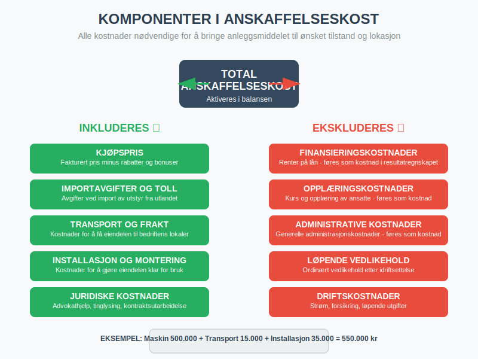

**Anleggsmidler** er **faste [eiendeler](/blogs/regnskap/hva-er-eiendel "Hva er Eiendel i Regnskap? Komplett Guide til Eiendom og Verdier")** som en bedrift planlegger å beholde og bruke i mer enn ett år i sin løpende drift. Disse [eiendelene](/blogs/regnskap/hva-er-eiendel "Hva er Eiendel i Regnskap? Komplett Guide til Eiendom og Verdier") utgjør ryggraden i mange bedrifters operasjoner og representerer ofte den største delen av [totalkapitalen](/blogs/regnskap/totalkapital "Totalkapital “ Sum av egenkapital og gjeld i regnskapet"). Anleggsmidler skiller seg fra [omløpsmidler](/blogs/regnskap/hva-er-omlopsmiddel "Hva er Omløpsmidler? Komplett Guide til Kortsiktige Eiendeler i Regnskap") ved at de ikke er ment for salg eller konvertering til kontanter på kort sikt.


## Seksjon 1: Definisjon og Karakteristika

### 1.1 Grunnleggende Definisjon

Anleggsmidler defineres som **eiendeler som**:

* **Holdes for bruk** i produksjon eller levering av varer og tjenester
* **Leies ut til andre** for inntektsgenerering
* **Brukes til administrative formål**
* **Forventes brukt i mer enn én regnskapsperiode** (vanligvis over ett år)

### 1.2 Kjennetegn ved Anleggsmidler


Anleggsmidler har flere distinkte egenskaper:

* **Langsiktig karakter:** Holdes i flere år
* **Produktiv bruk:** Bidrar til inntektsgenerering
* **Begrenset likviditet:** Ikke lett konverterbare til kontanter
* **Avskrivbare:** Verdi reduseres over tid (med unntak av tomter)
* **Betydelig verdi:** Ofte store investeringer

## Seksjon 2: Klassifisering av Anleggsmidler

Anleggsmidler klassifiseres i tre hovedkategorier basert på deres natur og egenskaper:


### 2.1 Materielle Anleggsmidler

**Materielle anleggsmidler** er fysiske eiendeler som kan berøres og sees. Disse utgjør ofte den største delen av anleggsmidlene. De fleste materielle anleggsmidler som brukes aktivt i drift klassifiseres som [varige driftsmidler](/blogs/regnskap/hva-er-varige-driftsmidler "Hva er Varige Driftsmidler? Komplett Guide til Avskrivbare Anleggsmidler").

#### Bygninger og Konstruksjoner

* **Kontorbygg:** Hovedkontor, avdelingskontorer
* **Produksjonslokaler:** Fabrikker, verksteder, lagerhaller
* **Spesialbygg:** Kjølelagre, renseanlegg, kraftstasjoner
* **Infrastruktur:** Veier, broer, kaier (for relevante bransjer)

#### Tomter og Grunn

* **Byggetomter:** Land hvor bygninger er oppført
* **Industriområder:** Områder for produksjonsvirksomhet
* **Naturressurser:** Gruver, steinbrudd, skogsområder (se [tømmerkonto](/blogs/regnskap/hva-er-tommerkonto "Hva er Tømmerkonto? Skatteoptimalisering for Skogbruk") for skattemessig behandling av skogsinntekter)

#### Maskiner og Teknisk Utstyr

* **Produksjonsmaskiner:** CNC-maskiner, presser, ovner
* **Transportbånd:** Automatiserte produksjonslinjer
* **Spesialutstyr:** Medisinsk utstyr, laboratorieapparatur
* **Sikkerhetssystemer:** Brannvern, alarmsystemer

Maskiner og teknisk utstyr som brukes aktivt i produksjon eller drift klassifiseres som [varige driftsmidler](/blogs/regnskap/hva-er-varige-driftsmidler "Hva er Varige Driftsmidler? Komplett Guide til Avskrivbare Anleggsmidler") og avskrives systematisk over deres økonomiske levetid.

#### Transportmidler

* **Firmabiler:** Personbiler for ansatte
* **Lastebiler:** For transport av varer
* **Spesialkjøretøy:** Gaffeltrucks, kraner, gravemaskiner
* **Fartøy:** Båter, skip (for maritime virksomheter)

#### Inventar og Utstyr

* **Kontormøbler:** Skrivebord, stoler, skap
* **IT-utstyr:** Datamaskiner, servere, nettverksutstyr
* **Verkstøy:** Håndverktøy, måleapparatur
* **Installasjonsutstyr:** Elektriske anlegg, rørleggerarbeid

### 2.2 Immaterielle Anleggsmidler

**Immaterielle anleggsmidler** er ikke-fysiske eiendeler som likevel har økonomisk verdi for bedriften. Disse eiendelene omfatter [immaterielle eiendeler](/blogs/regnskap/hva-er-imaterielle-eiendeler "Hva er Imaterielle Eiendeler? Komplett Guide til Immaterielle Verdier i Regnskap") som patenter, varemerker og goodwill. I motsetning til materielle anleggsmidler som avskrives, brukes [amortisering](/blogs/regnskap/hva-er-amortisering "Hva er Amortisering? En Komplett Guide til Avskrivninger") for å fordele kostnaden av immaterielle eiendeler over deres økonomiske levetid.


#### Utviklede Eiendeler

* **[Forskning og utvikling (FoU)](/blogs/kontoplan/1000-forskning-og-utvikling "Hva er Konto 1000 - Forskning og utvikling?"):** Kostnader til produktutvikling
* **Programvare:** Egenutviklede datasystemer
* **[Patenter](/blogs/kontoplan/1030-patenter "Konto 1030 - Patenter"):** Rettigheter til oppfinnelser og teknologi
* **Opphavsrettigheter:** Rettigheter til kreative verk

#### Ervervede Rettigheter

* **Lisenser:** Rettigheter til å bruke andres teknologi
* **Franchiserettigheter:** Rettigheter til å drive under etablerte merker
* **[Varemerker](/blogs/kontoplan/1050-varemerker "Konto 1050 - Varemerker"):** Registrerte merkenavn og logoer
* **Kundelister:** Verdifulle kundedatabaser

* **Domenenavn:** Viktige for digital markedsføring og merkevarebygging. Se [Domenenavn i Regnskap “ Behandling og Klassifisering](/blogs/regnskap/domenenavn "Domenenavn i Regnskap “ Behandling og Klassifisering").

#### Goodwill

**[Goodwill](/blogs/regnskap/hva-er-goodwill "Hva er Goodwill? Komplett Guide til Goodwill og Immaterielle Eiendeler")** oppstår ved oppkjøp av andre virksomheter og representerer:

* **Merkevaregjenkjenning:** Etablert omdømme i markedet
* **Kundelojalitet:** Stabile kunderelasjoner
* **Ansattes kompetanse:** Verdifull kunnskap og erfaring
* **Markedsposisjon:** Konkurransefortrinn

For en dybdegående forklaring av goodwill, se vår [komplette guide til goodwill](/blogs/regnskap/hva-er-goodwill "Hva er Goodwill? Komplett Guide til Goodwill og Immaterielle Eiendeler").

### 2.3 Finansielle Anleggsmidler

**Finansielle anleggsmidler** er langsiktige finansielle [investeringer](/blogs/regnskap/hva-er-investere "Hva er å Investere? Komplett Guide til Investeringer i Regnskap") som ikke er ment for handel.

#### Eierandeler i Andre Selskaper

* **Datterselskaper:** Kontrollerende eierandeler (>50%)
* **Tilknyttede selskaper:** Betydelig innflytelse (20-50%)
* **Joint ventures:** Felles kontrollerte virksomheter
* **Strategiske [investeringer](/blogs/regnskap/hva-er-investere "Hva er å Investere? Komplett Guide til Investeringer i Regnskap"):** Mindre eierandeler med strategisk formål

#### Langsiktige Fordringer

* **[Aksjonærlån til AS](/blogs/regnskap/hva-er-aksjonaerlan-til-as "Hva er Aksjonærlån til AS? Regler, Renter og Skattekonsekvenser"):** Lån gitt til aksjeselskapet
* **Lån til ansatte:** Langsiktige personallån
* **Deposita:** Langsiktige sikkerhetsstillelser
* **Obligasjoner:** Langsiktige rentebærende verdipapirer

## Seksjon 3: Anskaffelse og Innregning

### 3.1 Anskaffelseskost

[Anskaffelseskosten](/blogs/regnskap/hva-er-anskaffelseskost "Hva er Anskaffelseskost? Beregning, Komponenter og Regnskapsføring") for anleggsmidler inkluderer **alle kostnader** som er nødvendige for å bringe eiendelen til ønsket tilstand og lokasjon:



| Kostnadselement | Inkluderes | Eksempel |
|:----------------|:-----------|:---------|
| Kjøpspris | ✓ | Fakturert pris for maskinen |
| Importavgifter | ✓ | Toll og avgifter ved import |
| Transport | ✓ | Frakt til bedriftens lokaler |
| Installasjon | ✓ | Montering og tilkobling |
| Juridiske kostnader | ✓ | Advokathjelp ved eiendomskjøp |
| Finansieringskostnader | ✗ | Renter på lån (føres som kostnad) |
| Opplæringskostnader | ✗ | Kurs for ansatte (føres som kostnad) |

### 3.2 Bagatellgrense

I Norge gjelder en **bagatellgrense på 15.000 kroner** for anleggsmidler. Eiendeler under denne grensen kan:

* **Kostnadsføres direkte** i anskaffelsesåret
* **Aktiveres og avskrives** over flere år (valgfritt)

### 3.3 Egentilvirkede Anleggsmidler

For **egentilvirkede anleggsmidler** inkluderes:

* **Direkte materialkostnader**
* **Direkte lønnskostnader**
* **Andel av indirekte kostnader** (overhead)
* **Ikke finansieringskostnader** eller administrative kostnader

## Seksjon 4: Avskrivninger

### 4.1 Avskrivningsprinsippet

**[Avskrivninger](/blogs/regnskap/hva-er-avskrivning "Hva er Avskrivning i Regnskap? Metoder, Beregning og Praktiske Eksempler")** fordeler anskaffelseskosten for et anleggsmiddel over dets **brukstid**. Dette gjenspeiler at eiendelen gradvis mister verdi gjennom:

* **Fysisk slitasje:** Bruk og elde
* **Teknologisk foreldelse:** Nye teknologier gjør eiendelen mindre verdifull
* **Økonomisk foreldelse:** Endrede markedsforhold


### 4.2 Avskrivningsmetoder

#### Lineær Avskrivning (Mest Vanlig)

**Lineær avskrivning** fordeler kostnaden jevnt over brukstiden:

**Årlig avskrivning = (Anskaffelseskost - Restverdi) ÷ Brukstid**

**Eksempel:**
* Maskin kjøpt for 500.000 kr
* Forventet brukstid: 10 år
* Restverdi: 50.000 kr
* Årlig avskrivning: (500.000 - 50.000) ÷ 10 = 45.000 kr

#### Saldoavskrivning

**Saldoavskrivning** anvender en fast prosentsats på **bokført verdi**:

| Anleggsmiddeltype | Maksimal saldosats |
|:------------------|:-------------------|
| Personbiler | 25% |
| Maskiner og inventar | 20% |
| Bygninger | 4% |
| Ervervet goodwill | 20% |
| Patenter og lisenser | 20% |

**Eksempel [saldoavskrivning](/blogs/regnskap/hva-er-saldoavskrivning "Hva er Saldoavskrivning i Regnskap? Komplett Guide til Degressiv Avskrivning"):**
* Bil kjøpt for 400.000 kr (25% saldosats)
* År 1: 400.000 × 25% = 100.000 kr avskrivning
* År 2: 300.000 × 25% = 75.000 kr avskrivning
* År 3: 225.000 × 25% = 56.250 kr avskrivning

### 4.3 Avskrivningsplan

En **systematisk avskrivningsplan** bør etableres for alle anleggsmidler:


## Seksjon 5: Verdsettelse og Nedskrivninger

### 5.1 Løpende Verdsettelse

Anleggsmidler verdsettes til **anskaffelseskost minus akkumulerte avskrivninger**, med mindre det foreligger **verdifall**.

### 5.2 Nedskrivninger

**Nedskrivning** er nødvendig når **gjenvinnbart beløp** er lavere enn **bokført verdi**.

#### Indikatorer på Verdifall

* **Eksterne faktorer:**
  * Betydelig fall i markedsverdi
  * Negative endringer i teknologi eller marked
  * Økte renter som påvirker diskonteringsrente

* **Interne faktorer:**
  * Fysisk skade eller forringelse
  * Endringer i bruk eller forventet bruk
  * Dårligere økonomisk ytelse enn forventet

#### Beregning av Nedskrivning

**Nedskrivning = Bokført verdi - Gjenvinnbart beløp**

Hvor **gjenvinnbart beløp** er det høyeste av:
* **Virkelig verdi minus salgskostnader**
* **Bruksverdi** (nåverdi av fremtidige kontantstrømmer)

## Seksjon 6: Regnskapsføring

### 6.1 Innregning ved Anskaffelse

```
Debet: Anleggsmidler (balanse)     500.000
Kredit: Bank/Leverandørgjeld       500.000
```

### 6.2 Årlige Avskrivninger

```
Debet: Avskrivningskostnad (resultat)  45.000
Kredit: Akkumulerte avskrivninger      45.000
```

### 6.3 Salg av Anleggsmidler

Ved salg beregnes **gevinst/tap**:

**Gevinst/Tap = Salgspris - Bokført verdi**

**Eksempel:**
* Bokført verdi: 200.000 kr
* Salgspris: 180.000 kr
* Tap ved salg: 20.000 kr

```
Debet: Bank                           180.000
Debet: Akkumulerte avskrivninger      300.000
Debet: Tap ved salg av anleggsmidler   20.000
Kredit: Anleggsmidler                 500.000
```

## Seksjon 7: Praktiske Eksempler

### 7.1 Produksjonsbedrift

**TechProd AS** - Teknologiprodusent:


| Anleggsmiddeltype | Verdi (NOK) | Andel |
|:------------------|:------------|:------|
| Produksjonsmaskiner | 15.000.000 | 45% |
| Bygninger | 8.000.000 | 24% |
| IT-systemer | 3.000.000 | 9% |
| Transportmidler | 2.500.000 | 8% |
| Patenter og lisenser | 2.000.000 | 6% |
| Inventar og utstyr | 1.500.000 | 5% |
| Tomter | 1.000.000 | 3% |
| **Total** | **33.000.000** | **100%** |

### 7.2 Servicebedrift

**ConsultCorp AS** - Konsulentselskap:

| Anleggsmiddeltype | Verdi (NOK) | Andel |
|:------------------|:------------|:------|
| Kontorbygg | 5.000.000 | 50% |
| IT-utstyr og programvare | 2.000.000 | 20% |
| Kontormøbler | 1.500.000 | 15% |
| Firmabiler | 1.000.000 | 10% |
| Kundelister og goodwill | 500.000 | 5% |
| **Total** | **10.000.000** | **100%** |

## Seksjon 8: Skattemessige Forhold

### 8.1 Skattemessige Avskrivninger

**Skattemessige avskrivninger** kan avvike fra **regnskapsmessige avskrivninger**, noe som kan skape [utsatt skattfordel](/blogs/kontoplan/1070-utsatt-skattfordel "Konto 1070 - Utsatt skattfordel") eller -plikt:

#### Saldogrupper for Skatteformål

| Saldogruppe | Beskrivelse | Sats |
|:------------|:------------|:-----|
| a | Bygninger og anlegg | 4% |
| b | Personbiler, traktorer, maskiner | 25% |
| c | Maskiner, redskap, instrumenter | 20% |
| d | Personbiler over 500.000 kr | 25% |
| e | Skip, rigger, fly | 14% |

### 8.2 Gevinst og Tap

* **Gevinst ved salg:** Skattepliktig inntekt
* **Tap ved salg:** Fradragsberettiget kostnad
* **Gjenvinning:** Ved [saldoavskrivning](/blogs/regnskap/hva-er-saldoavskrivning "Hva er Saldoavskrivning i Regnskap? Komplett Guide til Degressiv Avskrivning") kan gevinst inntil tidligere avskrivninger være skattepliktig

## Seksjon 9: Digitalisering og Fremtiden

### 9.1 Digitale Anleggsmidler

Moderne bedrifter investerer stadig mer i **digitale anleggsmidler**:


* **Cloud-infrastruktur:** Langsiktige avtaler om skybaserte tjenester
* **Kunstig intelligens:** Proprietære AI-systemer og algoritmer
* **Dataanalyse-plattformer:** Avanserte analyseverktøy
* **Automatiseringssystemer:** Robotiserte prosesser (RPA)

### 9.2 Utfordringer ved Digitale Eiendeler

* **Rask teknologisk utvikling:** Kortere brukstid
* **Vanskelig verdsettelse:** Utfordrende å estimere fremtidig verdi
* **Immaterielle karakter:** Kompliserer identifikasjon og måling
* **Regulatorisk usikkerhet:** Utviklende regnskapsregler

## Seksjon 10: Beste Praksis og Anbefalinger

### 10.1 Anleggsmiddelforvaltning


#### Strategisk Planlegging

* **Langsiktig kapitalbudsjett:** Planlegg investeringer 3-5 år frem
* **Livssyklusanalyse:** Vurder totalkostnader over eiendelens levetid
* **Teknologiutvikling:** Følg med på teknologiske trender
* **Bærekraftshensyn:** Vurder miljøpåvirkning og energieffektivitet

#### Operasjonell Forvaltning

* **Vedlikeholdsplaner:** Systematisk vedlikehold forlenger levetid
* **Forsikringsdekning:** Adekvat forsikring mot skader og tap
* **Sikkerhetstiltak:** Beskyttelse mot tyveri og sabotasje
* **Dokumentasjon:** Komplett dokumentasjon av alle anleggsmidler

### 10.2 Regnskapsmessig Oppfølging

#### Månedlige Rutiner

* **Avskrivningsberegninger:** Kontroller automatiske beregninger
* **Verdifall-vurdering:** Vurder indikatorer på verdifall
* **Forsikringsoppgjør:** Følg opp skader og erstatninger

#### Årlige Rutiner

* **Fysisk inventering:** Tell og kontroller alle anleggsmidler
* **Verdsettelsesgjennomgang:** Vurder alle verdsettelsesforutsetninger
* **Avskrivningsmetode-evaluering:** Vurder om metoder fortsatt er hensiktsmessige
* **Nedskrivningstesting:** Grundig testing av verdifall

## Seksjon 11: Sammenheng med Andre Regnskapselementer

### 11.1 Påvirkning på Nøkkeltall

Anleggsmidler påvirker viktige **finansielle nøkkeltall**:

| Nøkkeltall | Beregning | Påvirkning av anleggsmidler |
|:-----------|:----------|:---------------------------|
| Totalkapitalrentabilitet | Resultat ÷ Totalkapital | Høye anleggsmidler reduserer rentabilitet |
| Egenkapitalandel | Egenkapital ÷ Totalkapital | Anleggsmidler øker totalkapital |
| Likviditetsgrad | Omløpsmidler ÷ Kortsiktig gjeld | Høy andel anleggsmidler reduserer likviditet |
| Kapitalomsetning | Omsetning ÷ Totalkapital | Effektiv bruk av anleggsmidler øker omsetning |

### 11.2 Relasjon til Kontantstrøm


* **Investeringsaktiviteter:** Kjøp og salg av anleggsmidler
* **Driftsaktiviteter:** Avskrivninger påvirker ikke kontantstrøm
* **Finansieringsaktiviteter:** Lånefinansiering av anleggsmidler

## Konklusjon

**Anleggsmidler** er fundamentale for de fleste bedrifters drift og representerer ofte betydelige investeringer som påvirker bedriftens **langsiktige konkurranseevne** og **finansielle stilling**. Korrekt håndtering av anleggsmidler - fra anskaffelse og verdsettelse til avskrivninger og eventuell avhending - er kritisk for:

* **Nøyaktig finansiell rapportering**
* **Optimal skatteplanlegging**
* **Effektiv kapitalforvaltning**
* **Strategisk beslutningsstøtte**

Ved å følge etablerte regnskapsprinsipper og beste praksis kan bedrifter sikre at deres anleggsmidler bidrar maksimalt til verdiskaping og langsiktig suksess. For mer informasjon om relaterte emner, se våre artikler om [aktiva generelt](/blogs/regnskap/hva-er-aktiva "Hva er Aktiva? En Komplett Guide til Eiendeler i Regnskap"), [avskrivninger](/blogs/regnskap/hva-er-amortisering "Hva er Amortisering? Forskjell fra Avskrivninger og Regnskapsføring"), [aksjeselskaper](/blogs/regnskap/hva-er-et-aksjeselskap "Hva er et Aksjeselskap? Krav, Stiftelse og Drift i Norge") og [gevinst- og tapskonto](/blogs/regnskap/gevinst-og-tapskonto "Gevinst- og tapskonto i Regnskap: Håndtering av gevinster og tap ved avhending").


