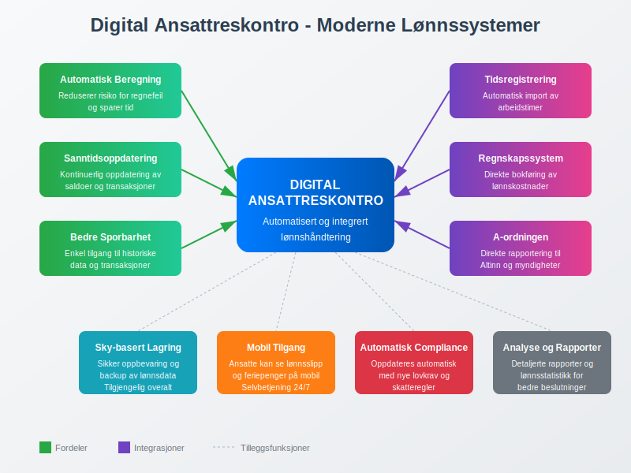

**Ansattreskontro** er et sentralt element i norsk lønnsbuchholderi som fungerer som en individuell konto for hver ansatt i bedriften. Den registrerer alle økonomiske transaksjoner mellom arbeidsgiver og arbeidstaker, inkludert [**lønnslipp**](/blogs/regnskap/hva-er-lonnslipp "Lønnslipp - Komplett Guide til Lønnsspecifikasjon og Regnskapsføring"), [**lønn**](/blogs/regnskap/hva-er-lonn "Hva er Lønn i Regnskap? Komplett Guide til Lønnsformer, Beregning og Regnskapsføring"), fradrag, forskudd og andre ytelser. Ansattreskontro er grunnlaget for korrekt [lønnskjøring](/blogs/regnskap/hva-er-regnskap "Hva er Regnskap? En Komplett Guide til Norsk Regnskap") og rapportering til offentlige myndigheter.

For en generell oversikt over reskontro, se [Hva er Reskontro?](/blogs/regnskap/hva-er-reskontro "Hva er Reskontro? En Guide til Underreskontro og Hovedbok").

I motsetning til [kundereskontro](/blogs/regnskap/hva-er-kundereskontro "Hva er Kundereskontro? Komplett Guide til Kundeledger og Fordringsstyring") som sporer transaksjoner med kunder, fokuserer ansattreskontro på å administrere alle økonomiske forhold med ansatte.

Hvordan ansattreskontro føres avhenger av [arbeidsforholdstypen](/blogs/regnskap/hva-er-arbeidsforholdstype "Hva er arbeidsforholdstype?"), da ulike ansettelsesformer har forskjellige krav til dokumentasjon og rapportering.

## Hva inneholder en ansattreskontro?

En ansattreskontro fungerer som en detaljert oversikt over alle økonomiske forhold mellom bedriften og den enkelte ansatte. Den gir et komplett bilde av lønnsforholdet gjennom hele ansettelsesperioden.

### Hovedkomponenter i ansattreskontro:

* **[Grunnlønn](/blogs/regnskap/hva-er-grunnlonn "Hva er Grunnlønn i Regnskap?") og tillegg:** Fast månedslønn, timelønn, overtidsbetaling, og spesielle tillegg som [akkordlønn](/blogs/regnskap/hva-er-akkordlonn "Hva er Akkordlønn? En Guide til Prestasjonslønn")
* **Fradrag:** Forskuddstrekk, [pensjonsinnskudd](/blogs/regnskap/hva-er-pensjon "Hva er Pensjon? Komplett Guide til Norsk Pensjonssystem"), [fagforeningskontingent](/blogs/regnskap/hva-er-kontingent "Hva er Kontingent? Komplett Guide til Medlemsavgifter og Regnskapsføring"), og andre lovpålagte eller frivillige fradrag - for detaljert [pensjonsrapportering](/blogs/regnskap/hva-er-pensjonsrapportering "Hva er Pensjonsrapportering? Komplett Guide til Pensjon i Regnskap")
* **Forskudd og lån:** Utbetalte forskudd på lønn, [ansattutlegg](/blogs/regnskap/ansattutlegg "Ansattutlegg - En komplett guide til utlegg fra ansatte") som krever [godtgjørelse](/blogs/regnskap/hva-er-godtgjorelse "Hva er Godtgjørelse (Regnskap)? Komplett Guide til Refusjon og Utlegg"), og eventuelle ansattlån
* **Feriepenger:** Opptjente og utbetalte feriepenger, samt feriepengegjeld
* **Sykepenger:** Arbeidsgiverperiode og refusjoner fra NAV
* **Andre ytelser:** Naturalytelser, bonuser, og andre skattepliktige fordeler

## Ansattreskontro i praksis

Ansattreskontro oppdateres kontinuerlig gjennom lønnsperioden og danner grunnlaget for månedlig rapportering gjennom [A-meldingen](/blogs/regnskap/hva-er-a-melding "Hva er A-melding? En Guide til Månedlig Rapportering").

### Typisk månedlig syklus:

1. **Registrering av arbeidstid:** Timer, overtid, fravær registreres
2. **Lønnsberegning:** [Bruttolønn](/blogs/regnskap/hva-er-bruttolonn "Hva er Bruttolønn? Definisjon, Beregning og Praktisk Anvendelse") beregnes basert på timeregistrering og avtalt lønn
3. **Fradragsberegning:** Skatt, pensjon og andre fradrag beregnes
4. **Oppdatering av ansattreskontro:** Alle transaksjoner registreres på den ansattes konto
5. **Lønnsutbetaling:** Nettolønn utbetales til ansatt
6. **Rapportering:** Data fra ansattreskontro brukes til [A-ordningen](/blogs/regnskap/hva-er-a-ordningen "Hva er A-ordningen? En Guide til Samordnet Rapportering")

## Eksempel på ansattreskontro

Her er et forenklet eksempel på hvordan en ansattreskontro kan se ut for en måned:

| **Transaksjon** | **Debet** | **Kredit** | **Saldo** | **Beskrivelse** |
|-----------------|-----------|------------|-----------|-----------------|
| Grunnlønn | 45 000 | | 45 000 | Månedslønn januar |
| Overtidstillegg | 3 500 | | 48 500 | 10 timer overtid |
| Forskuddstrekk | | 12 500 | 36 000 | Skatt og avgifter |
| [Pensjonsinnskudd](/blogs/regnskap/hva-er-pensjon "Hva er Pensjon? Komplett Guide til Norsk Pensjonssystem") | | 2 400 | 33 600 | 2% av bruttolønn |
| Fagforeningskontingent | | 450 | 33 150 | MÃ¥nedlig kontingent |
| **Netto utbetaling** | | **33 150** | **0** | **Til utbetaling** |

### Årlig oppgjør og feriepenger

Ansattreskontro spiller en kritisk rolle ved årsskiftet når feriepenger skal beregnes og utbetales:

* **Feriepengeberegning:** 12% av feriepengegivende inntekt
* **Feriepengegjeld:** Opptjente, men ikke utbetalte feriepenger
* **Utbetaling:** Vanligvis i juni eller ved fratredelse

## Juridiske krav til ansattreskontro

Norsk lovgivning stiller strenge krav til dokumentasjon av lønnsforhold, og ansattreskontro er et sentralt verktøy for å oppfylle disse kravene.

### Bokføringsloven og ansattreskontro:

* **Dokumentasjonsplikt:** Alle lønnsutbetalinger må dokumenteres og kunne spores
* **Oppbevaringsplikt:** Lønnsbilag og ansattkontoer må oppbevares i minimum 5 år
* **Revisjonsplikt:** Ansattreskontro må være tilgjengelig for revisjon og kontroll

### Arbeidsmiljøloven og lønnsopplysninger:

* **Lønnsslipp:** Ansatte har rett til detaljert [lønnslipp](/blogs/regnskap/hva-er-lonnslipp "Hva er Lønnslipp i Regnskap? Komplett Guide til Lønnsspecifikasjon") basert på ansattreskontro
* **Innsyn:** Ansatte kan kreve innsyn i egen ansattreskontro
* **Korreksjon:** Feil i ansattreskontro må rettes umiddelbart

## Digitalisering og moderne lønnssystemer

Moderne lønnssystemer har automatisert mye av arbeidet med ansattreskontro, men prinsippene forblir de samme.

### Fordeler med digitale systemer:

* **Automatisk beregning:** Reduserer risiko for regnefeil
* **Integrert rapportering:** Direkte kobling til A-melding og andre rapporter
* **Sanntidsoppdatering:** Kontinuerlig oppdatering av saldoer og transaksjoner
* **Bedre sporbarhet:** Enkel tilgang til historiske data og transaksjoner

### Integrasjon med andre systemer:

* **Tidsregistreringssystemer:** Automatisk import av arbeidstimer
* **Regnskapssystem:** Direkte bokføring av lønnskostnader
* **Bankintegrasjon:** Automatisk lønnsutbetaling
* **Offentlige systemer:** Direkte rapportering til Altinn og A-ordningen

## Vanlige utfordringer og løsninger

Selv med moderne systemer kan det oppstå utfordringer knyttet til ansattreskontro:

### Typiske problemområder:

* **Komplekse lønnsstrukturer:** Håndtering av [akkordlønn](/blogs/regnskap/hva-er-akkordlonn "Hva er Akkordlønn? En Guide til Prestasjonslønn"), provisjon og variable tillegg
* **Feriepengeopptjening:** Korrekt beregning av feriepengegivende inntekt
* **Forskudd og tilbakebetalinger:** Håndtering av ansattlån og forskudd
* **Naturalytelser:** Verdsetting og skattlegging av fordeler i natura

### Best practices:

1. **Regelmessig avstemming:** MÃ¥nedlig kontroll av alle ansattkontoer
2. **Dokumentasjon:** Grundig dokumentasjon av alle transaksjoner
3. **Backup og sikkerhet:** Sikker oppbevaring av lønnsdata
4. **Opplæring:** Kontinuerlig opplæring av personale som håndterer lønn

## Ansattreskontro og compliance

Korrekt føring av ansattreskontro er avgjørende for å overholde norske regnskaps- og skatteregler.

### Kontrollpunkter:

* **Månedlig:** Avstemming mot lønnsutbetalinger og A-melding
* **Kvartalsvis:** Kontroll av forskuddstrekk og avgiftsberegninger
* **Årlig:** Feriepengeoppgjør og årsoppgave til Skatteetaten
* **Ved revisjon:** Dokumentasjon av alle lønnsrelaterte transaksjoner

## Fremtiden for ansattreskontro

Med økende digitalisering og automatisering utvikler ansattreskontro seg kontinuerlig:

### Kommende trender:

* **Kunstig intelligens:** Automatisk deteksjon av avvik og feil
* **Blockchain:** Sikker og transparent registrering av lønnsdata
* **Sanntidsrapportering:** Kontinuerlig oppdatering til offentlige myndigheter
* **Selvbetjening:** Ansatte får større kontroll over egen lønnsdata

## Konklusjon

Ansattreskontro er et fundamentalt verktøy i norsk lønnsbuchholderi som sikrer korrekt registrering, beregning og rapportering av alle lønnsrelaterte transaksjoner. Ved å forstå hvordan ansattreskontro fungerer, kan bedrifter sikre compliance med norsk lovgivning og opprettholde gode relasjoner med sine ansatte.

For bedrifter som ønsker å optimalisere sin lønnsadministrasjon, er det viktig å investere i moderne lønnssystemer som automatiserer ansattreskontro-prosessene samtidig som de opprettholder full sporbarhet og kontroll over alle transaksjoner.
