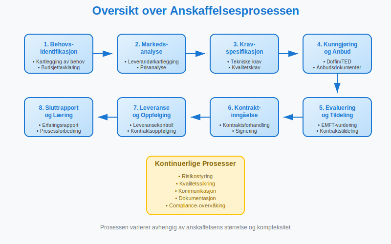
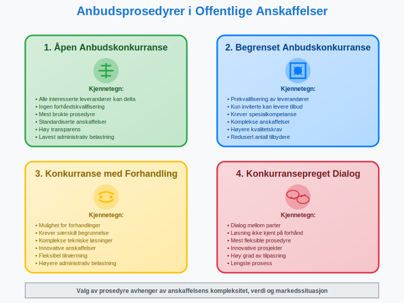
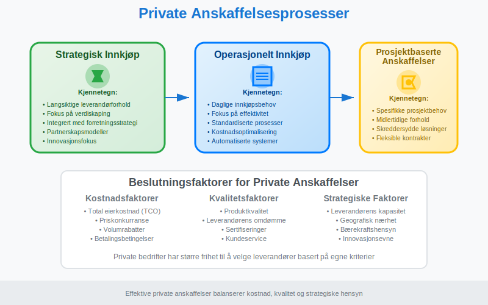
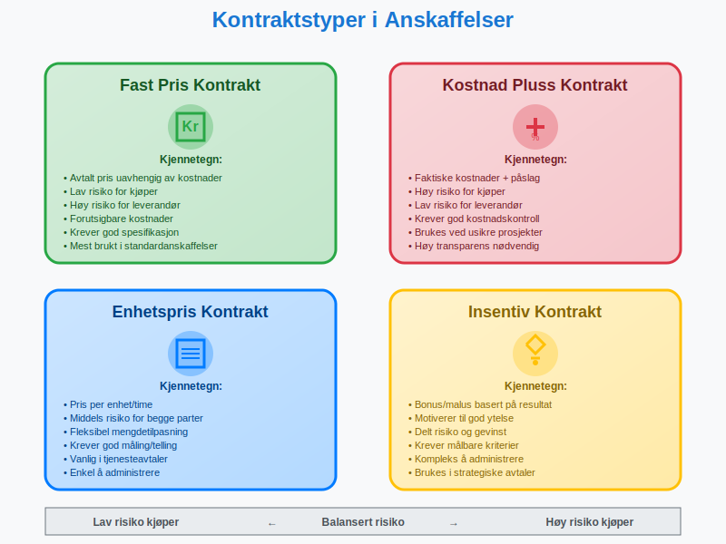
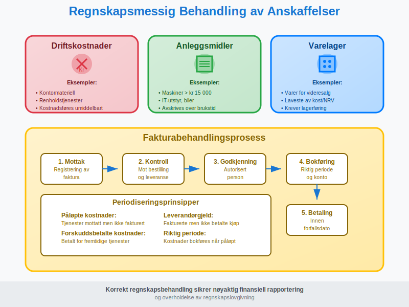
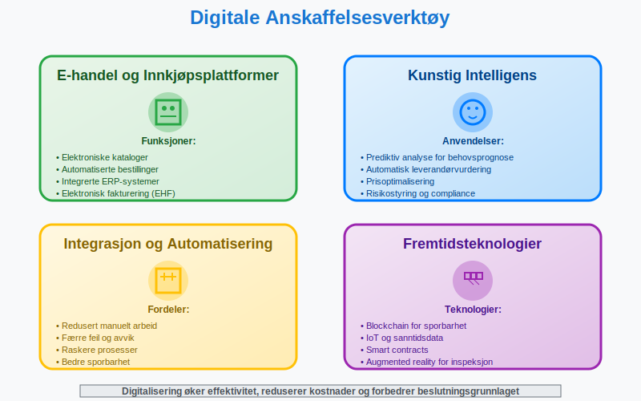
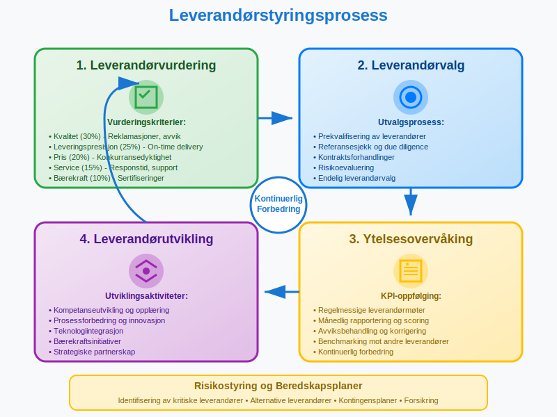
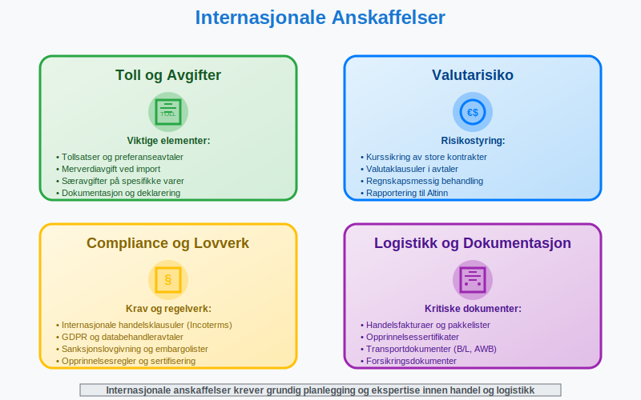

---
title: "Hva er anskaffelser?"
meta_title: "Hva er anskaffelser?"
meta_description: '**Anskaffelser** er prosessen med å kjøpe varer, tjenester eller bygge- og anleggsarbeider for å dekke en organisasjons behov. I Norge skilles det mellom **o...'
slug: hva-er-anskaffelser
type: blog
layout: pages/single
---

**Anskaffelser** er prosessen med å kjøpe varer, tjenester eller bygge- og anleggsarbeider for å dekke en organisasjons behov. I Norge skilles det mellom **offentlige anskaffelser**, som er underlagt strenge regelverk, og **private anskaffelser**, som har større frihet i valg av leverandører og prosedyrer. For handelsbedrifter utgjør [varekjøp](/blogs/regnskap/hva-er-varekjop "Hva er Varekjøp? Komplett Guide til Regnskapsføring og Innkjøpsstyring") en spesiell kategori anskaffelser som er ment for videresalg til kunder.

## Offentlige Anskaffelser

Offentlige anskaffelser reguleres av **anskaffelsesloven** og tilhørende forskrifter. Formålet er å sikre at offentlige midler brukes effektivt, og at alle leverandører får like muligheter til å konkurrere om offentlige kontrakter.

### Terskelverdier og Prosedyrer

Anskaffelsesregelverket opererer med ulike terskelverdier som bestemmer hvilke prosedyrer som skal følges:

| Kontraktsverdi | Prosedyre | Kunngjøring |
|---|---|---|
| Under 100 000 kr | Forenklet prosess | Ikke påkrevd |
| 100 000 - 1 300 000 kr | Nasjonal konkurranse | Doffin |
| Over 1 300 000 kr | EU-konkurranse | Doffin + TED |
| Bygge- og anleggskontrakter over 33 500 000 kr | EU-konkurranse | Doffin + TED |

*Beløpene er eksklusive merverdiavgift og gjelder for 2024*

### Anbudsprosedyrer

Det finnes flere typer anbudsprosedyrer i offentlige anskaffelser:

#### 1. Ã…pen anbudskonkurranse
- **Alle** interesserte leverandører kan levere [tilbud](/blogs/regnskap/hva-er-tilbud "Hva er Tilbud? Komplett Guide til Tilbudsprosess og Regnskapsmessig Behandling")
- Mest brukte prosedyre for standardiserte anskaffelser
- Ingen forhåndskvalifisering av leverandører

#### 2. Begrenset anbudskonkurranse
- **Prekvalifisering** av leverandører
- Kun inviterte leverandører kan levere [tilbud](/blogs/regnskap/hva-er-tilbud "Hva er Tilbud? Komplett Guide til Tilbudsprosess og Regnskapsmessig Behandling")
- Brukes når spesialkompetanse kreves

#### 3. Konkurranse med forhandling
- Mulighet for **forhandlinger** med leverandører
- Brukes ved komplekse anskaffelser
- Krever særskilt begrunnelse

#### 4. Konkurransepreget dialog
- **Dialog** mellom oppdragsgiver og leverandører
- Brukes når løsningen ikke er kjent på forhånd
- Mest fleksible prosedyre

### Evalueringskriterier

Offentlige anskaffelser skal tildeles basert på **økonomisk mest fordelaktige tilbud** (EMFT). Dette kan vurderes ut fra:

* **Pris** eller kostnad
* **Kvalitet** av varer/tjenester
* **Miljøhensyn** og [bærekraft](/blogs/regnskap/baerekraft "Bærekraft i Regnskap: En Komplett Guide til Bærekraft og Bærekraftsrapportering")
* **Sosiale hensyn**
* **Innovasjon** og tekniske egenskaper

## Private Anskaffelser

Private virksomheter har større frihet i sine anskaffelser, men må likevel følge god forretningsskikk og eventuelle bransjestandarder.

### Innkjøpsstrategier

Private bedrifter kan velge mellom ulike innkjøpsstrategier:

#### Strategisk Innkjøp
- **Langsiktige** leverandørforhold
- Fokus på **verdiskaping**
- Integrert med forretningsstrategien

#### Operasjonelt Innkjøp
- **Daglige** innkjøpsbehov
- Fokus på **effektivitet**
- Standardiserte prosesser

#### Prosjektbaserte Anskaffelser
- **Spesifikke** prosjektbehov
- **Midlertidige** leverandørforhold
- Skreddersydde løsninger

## Kontraktstyper og Avtaleformer

Uavhengig av om det er offentlige eller private anskaffelser, finnes det flere typer kontrakter:

### Prismodeller

| Kontraktstype | Beskrivelse | Risiko for kjøper | Risiko for leverandør |
|---|---|---|---|
| **Fast pris** | Avtalt pris uavhengig av kostnader | Lav | Høy |
| **Kostnad pluss** | Faktiske kostnader + påslag | Høy | Lav |
| **Enhetspris** | Pris per enhet/time | Middels | Middels |
| **Insentivkontrakt** | Bonus/malus basert på resultat | Lav-Middels | Middels-Høy |

### Rammeavtaler

**Rammeavtaler** er særlig viktige i offentlige anskaffelser:

* Etablerer **vilkår** for fremtidige kjøp
* Gyldig i opptil **4 år**
* Kan ha **flere leverandører**
* Krever **minikonkurranse** ved bestilling

## Regnskapsmessig Behandling

Anskaffelser har betydelige regnskapsmessige konsekvenser som må håndteres korrekt.

### Klassifisering av Anskaffelser

Anskaffelser klassifiseres forskjellig i regnskapet:

#### Driftskostnader
- **Forbruksvarer** og tjenester
- Kostnadsføres **umiddelbart**
- Eksempler: kontormateriell, renholdstjenester

#### Anleggsmidler
- **Varige** driftsmidler over kr 15 000
- **Avskrives** over brukstiden
- Eksempler: maskiner, IT-utstyr, biler

#### Varelager
- Varer for **videresalg**
- Verdsettes til **laveste** av kost og netto realisasjonsverdi
- Krever **lagerføring** og periodisk telling

### Leverandørgjeld og Fakturabehandling

Korrekt behandling av leverandørfakturaer og [kreditorhåndtering](/blogs/regnskap/hva-er-kreditor "Hva er Kreditor? Komplett Guide til Leverandørgjeld og Kreditorhåndtering") er kritisk:

1. **Mottak** og registrering av [faktura](/blogs/regnskap/hva-er-en-faktura "Hva er en Faktura? En Guide til Norske Fakturakrav") gjennom [bilagsmottak](/blogs/regnskap/hva-er-bilagsmottak "Bilagsmottak - Komplett Guide til Dokumentmottak og Fakturabehandling")
2. **Kontroll** mot bestilling og leveranse
3. **Godkjenning** av autorisert person gjennom [attestering](/blogs/regnskap/hva-er-attestering "Hva er Attestering? En Komplett Guide til Bilagsbehandling og Godkjenning")
4. **Bokføring** i riktig periode
5. **Betaling** innen forfallsdato

### Periodisering

**Periodiseringsprinsippet** krever at kostnader bokføres i riktig periode:

* **Påløpte kostnader**: Tjenester mottatt men ikke fakturert
* **Forskuddsbetalte kostnader**: Betalt for fremtidige tjenester
* **[Leverandørgjeld](/blogs/regnskap/hva-er-leverandorgjeld "Hva er Leverandørgjeld i Regnskap? Komplett Guide til Kreditorhåndtering og Regnskapsføring")**: Fakturerte men ikke betalte kjøp

## Digitalisering av Anskaffelser

Moderne anskaffelser blir stadig mer digitaliserte, noe som påvirker både prosesser og [regnskapsføring](/blogs/regnskap/hva-er-regnskap "Hva er Regnskap? En Komplett Guide til Norsk Regnskapsføring").

### E-handel og Innkjøpsplattformer

* **Elektroniske kataloger** for standardvarer
* **Automatiserte bestillinger** basert på lagernivå
* **Integrerte** ERP-systemer
* **Elektronisk fakturering** ([EHF](/blogs/regnskap/hva-er-ehf "Hva er EHF? Komplett Guide til Elektronisk Handelsformat i Norge")-format)

### Kunstig Intelligens i Anskaffelser

AI-teknologi revolusjonerer anskaffelsesprosesser:

* **Prediktiv analyse** for behovsprognose
* **Automatisk** leverandørvurdering
* **Prisoptimalisering** basert på markedsdata
* **Risikostyring** og compliance-overvåking

## Bærekraftige Anskaffelser

**Bærekraft** blir stadig viktigere i anskaffelsesprosesser, både i offentlig og privat sektor.

### Miljøkrav

* **Miljøsertifiseringer** (ISO 14001, EMAS)
* **Livssyklusanalyse** av produkter
* **Karbonfotavtrykk** og klimaregnskap
* **Sirkulærøkonomi** og gjenbruk

### Sosiale Krav

* **Arbeidsforhold** hos leverandører
* **Menneskerettigheter** i leverandørkjeden
* **Lokal** verdiskaping
* **Mangfold** og inkludering

### CSRD og Leverandørkjeden

For større norske bedrifter som omfattes av [**CSRD (Corporate Sustainability Reporting Directive)**](/blogs/regnskap/hva-er-csrd "CSRD - Corporate Sustainability Reporting Directive: Komplett Guide for Norske Bedrifter"), blir bærekraftige anskaffelser enda viktigere. CSRD krever rapportering om **verdikjeden**, inkludert leverandørers arbeidsforhold og miljøpåvirkning.

Dette betyr at bedrifter må:
* **Kartlegge** bærekraftspraksis hos leverandører
* **Dokumentere** ESG-data fra leverandørkjeden
* **Rapportere** om verdikjedens påvirkning på mennesker og miljø

## Leverandørstyring

Effektiv **leverandørstyring** er kritisk for suksessfulle anskaffelser. For en omfattende guide til alle aspekter av leverandørstyring, inkludert strategisk kategorisering, risikostyring, digitalisering og beste praksis, se vår detaljerte artikkel om **[leverandører](/blogs/regnskap/hva-er-leverandor "Hva er Leverandør? Komplett Guide til Leverandørstyring og Leverandørforhold")**.

### Leverandørvurdering

Systematisk vurdering av leverandører basert på:

| Kriterium | Vekting | MÃ¥ling |
|---|---|---|
| **Kvalitet** | 30% | Reklamasjoner, avvik |
| **Leveringspresisjon** | 25% | On-time delivery |
| **Pris** | 20% | Konkurransedyktighet |
| **Service** | 15% | Responstid, support |
| **Bærekraft** | 10% | Sertifiseringer, rapporter |

### Kontraktsoppfølging

* **Regelmessige** leverandørmøter
* **KPI-oppfølging** og rapportering
* **Kontinuerlig forbedring**
* **Risikostyring** og beredskapsplaner

## Juridiske Aspekter

Anskaffelser involverer komplekse juridiske forhold som må håndteres profesjonelt.

### Kontraktsrett

* **Avtaleloven** og kjøpsloven
* **Standardkontrakter** (NS-serien)
* **Internasjonale** handelsklausuler (Incoterms)
* **Tvisteløsning** og voldgift

### Immaterielle Rettigheter

Ved anskaffelse av IT-løsninger og tjenester:

* **Opphavsrett** til programvare
* **Lisensavtaler** og bruksrettigheter
* **Databehandleravtaler** (GDPR)
* **Kildekode** og escrow-avtaler

## Internasjonale Anskaffelser

Grenseoverskridende anskaffelser krever særskilt oppmerksomhet.

### Toll og Avgifter

* **Tollsatser** og preferanseavtaler
* **Merverdiavgift** ved import
* **Særavgifter** på spesifikke varer
* **Dokumentasjon** og deklarering

### Valutarisiko

* **Kurssikring** av store kontrakter
* **Valutaklausuler** i avtaler
* **Regnskapsmessig** behandling av kursgevinst/-tap
* **Rapportering** til [Altinn](/blogs/regnskap/hva-er-altinn "Hva er Altinn? En Komplett Guide til Norges Digitale Forvaltningsplattform")

## Fremtiden for Anskaffelser

Anskaffelsesområdet er i kontinuerlig utvikling, drevet av teknologi og endrede forventninger.

### Trender og Utviklingstrekk

* **Automatisering** av rutineprosesser
* **Blockchain** for sporbarhet
* **IoT** og sanntidsdata
* **Bærekraft** som konkurransefortrinn

### Kompetanseutvikling

Moderne anskaffelser krever nye kompetanser:

* **Strategisk** tenkning
* **Teknologiforståelse**
* **Bærekraftskunnskap**
* **Dataanalyse** og -tolkning

Anskaffelser er et komplekst fagområde som krever både juridisk, økonomisk og teknisk kompetanse. For bedrifter som ønsker å optimalisere sine anskaffelsesprosesser, er det viktig å ha gode systemer for både innkjøp og [regnskapsføring](/blogs/regnskap/hva-er-regnskap "Hva er Regnskap? En Komplett Guide til Norsk Regnskapsføring") av anskaffelsene.

