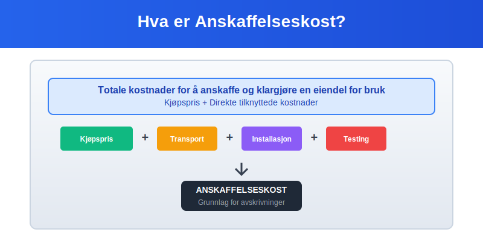
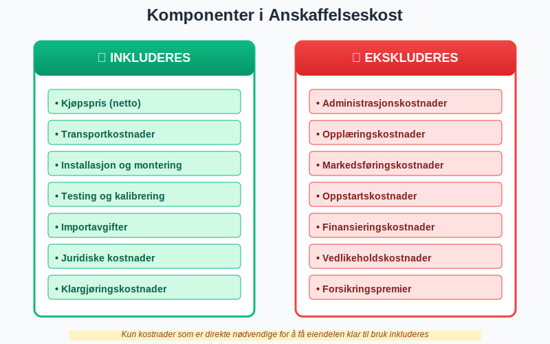
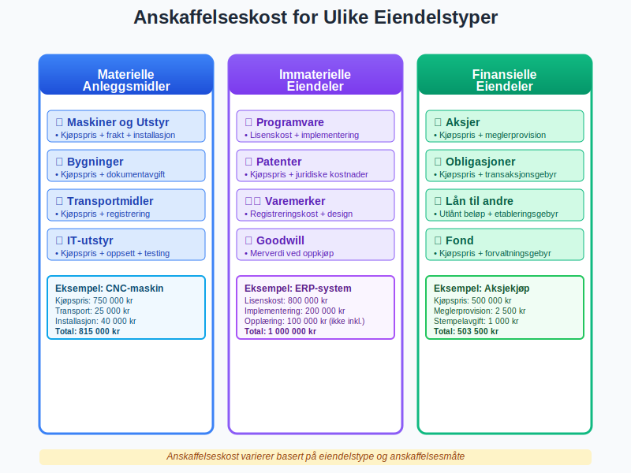
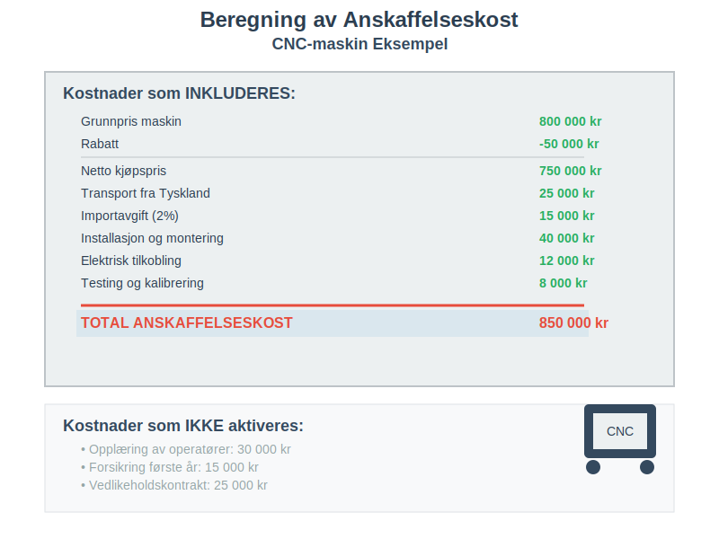
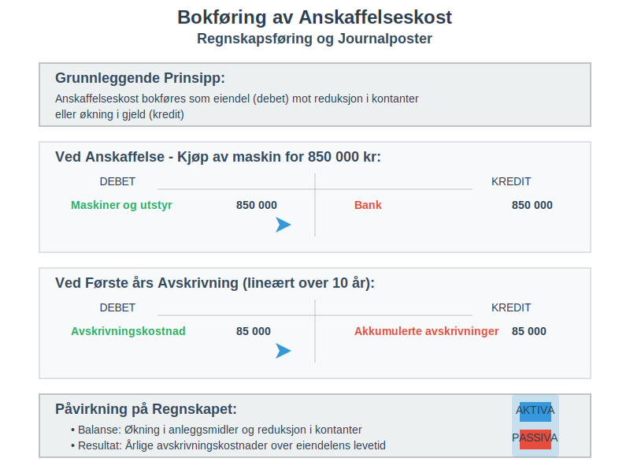
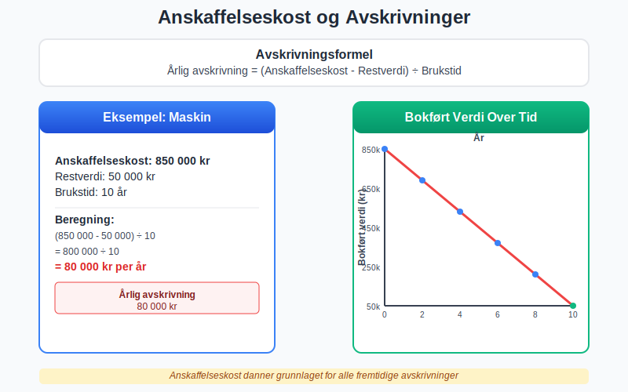
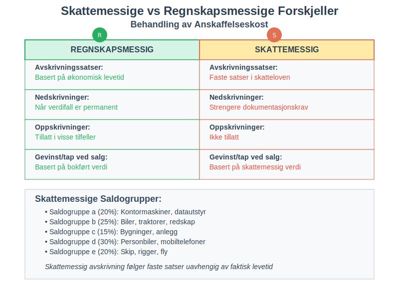
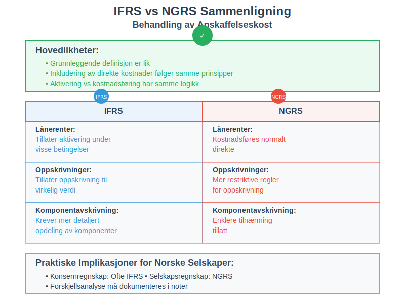
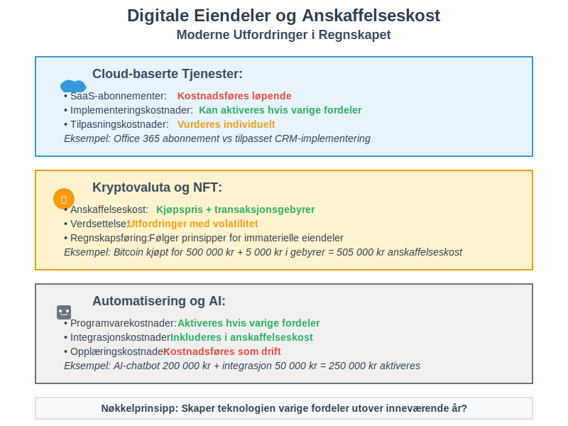
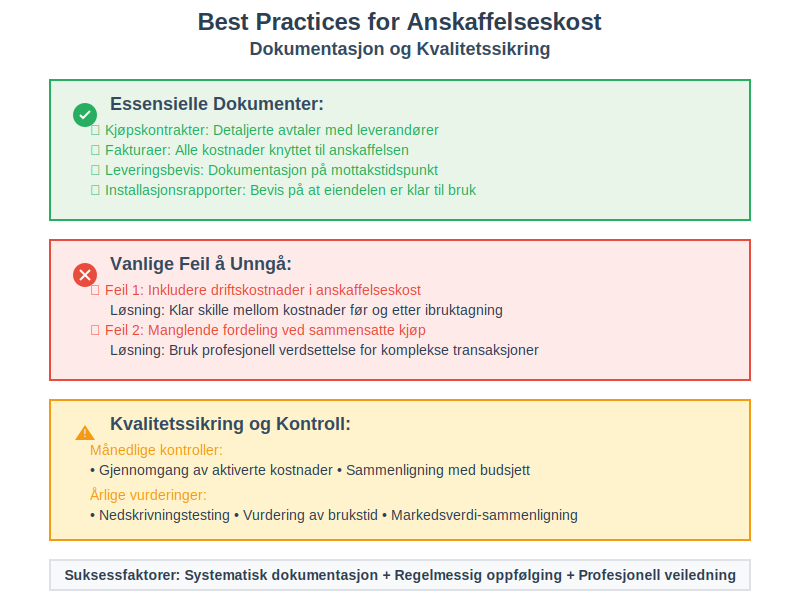

---
title: "Hva er anskaffelseskost?"
seoTitle: "Hva er anskaffelseskost?"
meta_description: '**Anskaffelseskost** er det totale beløpet en bedrift betaler for å anskaffe og klargjøre en eiendel for bruk. Dette inkluderer ikke bare kjøpsprisen, men o...'
slug: hva-er-anskaffelseskost
type: blog
layout: pages/single
---

**Anskaffelseskost** er det totale beløpet en bedrift betaler for å anskaffe og klargjøre en eiendel for bruk. Dette inkluderer ikke bare kjøpsprisen, men også alle direkte kostnader som er nødvendige for å få eiendelen klar til sitt tiltenkte formål. Anskaffelseskost danner grunnlaget for verdsettelse av [aktiva](/blogs/regnskap/hva-er-aktiva "Hva er Aktiva? En Komplett Guide til Eiendeler") og er avgjørende for korrekt beregning av avskrivninger og [amortisering](/blogs/regnskap/hva-er-amortisering "Hva er Amortisering? Fordeling av Immaterielle Eiendeler").

For nærmere forklaring av det skattemessige kostprisbegrepet «inngangsverdi», se [Inngangsverdi](/blogs/regnskap/inngangsverdi "Inngangsverdi: Kostpris, Beregning og Skattegrunnlag i Norsk Regnskap").

Anskaffelseskost er en del av det bredere kostnadsbegrepet [kostpris](/blogs/regnskap/hva-er-kostpris "Hva er Kostpris? Kostnadsberegning og Lønnsomhetsanalyse"), som omfatter alle kostnader knyttet til anskaffelse, produksjon og levering av varer og tjenester.



## Seksjon 1: Definisjon og Grunnleggende Prinsipper

### 1.1 Hva Inngår i Anskaffelseskost?

Anskaffelseskost består av alle [kostnader](/blogs/regnskap/hva-er-kostnader "Hva er Kostnader i Regnskap? Komplett Guide til Kostnadstyper og Regnskapsføring") som er **direkte henførbare** til anskaffelsen og klargjøringen av eiendelen. Dette følger det grunnleggende regnskapsprinsippet om at alle kostnader som er nødvendige for å få en eiendel klar til bruk, skal aktiveres i balansen som [aktivering](/blogs/regnskap/hva-er-aktivering "Hva er Aktivering i Regnskap?").



### 1.2 Hovedkomponenter i Anskaffelseskost

* **Kjøpspris:** Det faktiske beløpet betalt til selger
* **Importavgifter og ikke-refunderbare skatter:** MVA som ikke kan trekkes fra
* **Transportkostnader:** Frakt og leveringskostnader (dokumentert med [fraktbrev](/blogs/regnskap/hva-er-fraktbrev "Hva er Fraktbrev? Komplett Guide til Transportdokumenter og Regnskapsføring"))
* **Installasjonskostnader:** Montering og oppstilling
* **Profesjonelle tjenester:** Advokat-, revisor- og konsulenthonorar
* **Testingskostnader:** Kostnader for å teste at eiendelen fungerer korrekt
* **Klargjøringskostnader:** Modifikasjoner for å tilpasse eiendelen til bruk

### 1.3 Hva som IKKE Inngår i Anskaffelseskost

Enkelte kostnader skal **ikke** inkluderes i anskaffelseskost, men kostnadsføres direkte:

* **Administrasjonskostnader:** Generelle overhead-kostnader
* **Opplæringskostnader:** Kurs for ansatte i bruk av eiendelen
* **Markedsføringskostnader:** Kostnader for å markedsføre produkter laget med eiendelen
* **Oppstartskostnader:** Kostnader i oppstartsfasen av drift
* **Finansieringskostnader:** Renter på lån (med visse unntak)

## Seksjon 2: Anskaffelseskost for Ulike Eiendelstyper

Beregningen av anskaffelseskost varierer avhengig av type eiendel og hvordan den anskaffes.



### 2.1 Materielle Anleggsmidler

For [materielle anleggsmidler](/blogs/regnskap/hva-er-anleggsmidler "Hva er Anleggsmidler? Komplett Guide til Faste Eiendeler i Regnskap") er korrekt beregning av anskaffelseskost særlig viktig siden dette danner grunnlaget for avskrivninger over eiendelens levetid.

#### Maskiner og Utstyr

For maskiner og produksjonsutstyr inkluderer anskaffelseskost typisk:

| Kostnadselement | Eksempel | Inkluderes |
|:----------------|:---------|:-----------|
| Kjøpspris | 500 000 kr | ✓ |
| Frakt | 15 000 kr | ✓ |
| Installasjon | 25 000 kr | ✓ |
| Testing | 10 000 kr | ✓ |
| Opplæring | 20 000 kr | ✗ |
| **Total anskaffelseskost** | **550 000 kr** | |

#### Bygninger og Eiendom

Ved kjøp av bygninger må følgende vurderes:

* **Kjøpspris for tomt og bygning:** Må fordeles mellom ikke-avskrivbar tomt og avskrivbar bygning
* **Dokumentavgift:** 2,5% av kjøpesummen (aktiveres)
* **Tinglysingsgebyr:** Aktiveres som del av anskaffelseskost
* **Meglerhonorarer:** Aktiveres hvis direkte knyttet til kjøpet
* **Advokatkostnader:** Aktiveres for juridisk bistand ved kjøp

### 2.2 Immaterielle Eiendeler

For [immaterielle eiendeler](/blogs/regnskap/hva-er-imaterielle-eiendeler "Hva er Imaterielle Eiendeler? Komplett Guide til Immaterielle Verdier i Regnskap") som patenter, programvare og lisenser:

#### Kjøpte Immaterielle Eiendeler

* **Kjøpspris:** Beløp betalt til selger
* **Juridiske kostnader:** For registrering og overføring
* **Konsulenthonorar:** For due diligence og verdsettelse

#### Egenutviklede Immaterielle Eiendeler

* **Direkte lønnskostnader:** For utviklingsteam
* **Direkte materialkostnader:** Spesialisert programvare og utstyr
* **Allokerte overhead-kostnader:** Kun direkte henførbare kostnader

For detaljert informasjon om aktivering av egenutviklede immaterielle eiendeler, se [konto 1000 - Forskning og utvikling](/blogs/kontoplan/1000-forskning-og-utvikling "Hva er Konto 1000 - Forskning og utvikling?").

### 2.3 Finansielle Eiendeler

For investeringer i aksjer og obligasjoner:

* **Kjøpspris:** Markedspris på kjøpstidspunkt
* **Meglerprovisjoner:** Kostnader for handel
* **Stempelavgifter:** Offentlige avgifter ved handel
* **Ikke inkludert:** Påløpte renter (regnskapsføres separat)

## Seksjon 3: Beregning og Praktiske Eksempler

### 3.1 Detaljert Beregningseksempel: Produksjonsmaskin

La oss se på et komplett eksempel for anskaffelse av en produksjonsmaskin:



**Scenario:** Et produksjonsselskap kjøper en ny CNC-maskin.

#### Kostnadsoppstilling:

| Kostnadselement | Beløp (NOK) | Kommentar |
|:----------------|:------------|:----------|
| Grunnpris maskin | 800 000 | Listepris fra leverandør |
| Rabatt | -50 000 | Forhandlet prisavslag |
| **Netto kjøpspris** | **750 000** | |
| Transport fra Tyskland | 25 000 | Spesialtransport (dokumentert med [fraktbrev](/blogs/regnskap/hva-er-fraktbrev "Hva er Fraktbrev? Komplett Guide til Transportdokumenter og Regnskapsføring")) |
| Importavgift | 15 000 | 2% av importverdi |
| Installasjon og montering | 40 000 | Teknisk personell |
| Elektrisk tilkobling | 12 000 | Ny strømforsyning |
| Testing og kalibrering | 8 000 | Kvalitetssikring |
| **Total anskaffelseskost** | **850 000** | |

#### Kostnader som IKKE aktiveres:

* Opplæring av operatører: 30 000 kr (kostnadsføres)
* Forsikring første år: 15 000 kr (kostnadsføres)
* Vedlikeholdskontrakt: 25 000 kr (kostnadsføres)

### 3.2 Sammensatt Anskaffelse: Eiendomskjøp

Ved kjøp av næringseiendom må anskaffelseskost fordeles mellom tomt og bygning:

#### Kjøpsdetaljer:
* **Total kjøpesum:** 5 000 000 kr
* **Takst tomt:** 1 500 000 kr
* **Takst bygning:** 3 500 000 kr

#### Fordeling av anskaffelseskost:

| Element | Beregning | Beløp |
|:--------|:----------|:------|
| Tomt (30%) | 5 000 000 × (1 500 000 ÷ 5 000 000) | 1 500 000 |
| Bygning (70%) | 5 000 000 × (3 500 000 ÷ 5 000 000) | 3 500 000 |
| Dokumentavgift (2,5%) | 5 000 000 × 2,5% | 125 000 |
| Tinglysing | Fast sats | 2 000 |
| Advokat | Faktiske kostnader | 15 000 |
| **Total aktivert** | | **5 142 000** |

**Fordeling for avskrivningsformål:**
* Tomt (ikke avskrivbar): 1 531 250 kr
* Bygning (avskrivbar): 3 610 750 kr

## Seksjon 4: Regnskapsføring og Bokføring

### 4.1 Grunnleggende Bokføringsprinsipper

Anskaffelseskost bokføres som en eiendel (debet) mot reduksjon i kontanter eller økning i gjeld (kredit).



#### Eksempel: Kjøp av maskin for 850 000 kr

**Ved anskaffelse:**
```
Debet: Maskiner og utstyr        850 000
Kredit: Bank                     850 000
```

**Ved første års avskrivning (lineært over 10 år):**
```
Debet: Avskrivningskostnad       85 000
Kredit: Akkumulerte avskrivninger 85 000
```

### 4.2 Spesielle Situasjoner

#### Bytte av Eiendeler

Ved bytte av eiendeler må anskaffelseskost for ny eiendel beregnes basert på virkelig verdi:

* **Kommersiell substans:** Ny eiendel verdsettes til virkelig verdi
* **Ingen kommersiell substans:** Ny eiendel verdsettes til bokført verdi av gammel eiendel

#### Egentilvirkning

For egentilvirkede eiendeler inkluderes kun kostnader frem til eiendelen er klar til bruk:

* **Direkte materialkostnader**
* **Direkte lønnskostnader**
* **Direkte henførbare indirekte kostnader**

## Seksjon 5: Påvirkning på Avskrivninger og Amortisering

### 5.1 Avskrivningsgrunnlag

Anskaffelseskost danner grunnlaget for beregning av [avskrivninger](/blogs/regnskap/hva-er-avskrivning "Hva er Avskrivning i Regnskap? Metoder, Beregning og Praktiske Eksempler") over eiendelens brukstid.



#### Avskrivningsformel:
**Årlig avskrivning = (Anskaffelseskost - Restverdi) ÷ Brukstid**

#### Eksempel med ulike avskrivningsmetoder:

| Metode | År 1 | År 2 | År 3 | År 4 | År 5 |
|:-------|:-----|:-----|:-----|:-----|:-----|
| Lineær (20%) | 170 000 | 170 000 | 170 000 | 170 000 | 170 000 |
| Saldometode (30%) | 255 000 | 178 500 | 124 950 | 87 465 | 61 226 |

*Basert på anskaffelseskost 850 000 kr, 5 års brukstid, ingen restverdi*

### 5.2 Nedskrivninger

Hvis eiendelens verdi faller permanent under bokført verdi, må den skrives ned:

**Nedskrivning = Bokført verdi - Gjenvinnbart beløp**

#### Regnskapsføring av nedskrivning:
```
Debet: Nedskrivningskostnad      100 000
Kredit: Akkumulerte nedskrivninger 100 000
```

## Seksjon 6: Skattemessige Konsekvenser

### 6.1 Skattemessig vs Regnskapsmessig Behandling

Skattemessig behandling av anskaffelseskost kan avvike fra regnskapsmessig behandling:



#### Hovedforskjeller:

| Aspekt | Regnskapsmessig | Skattemessig |
|:-------|:----------------|:-------------|
| **Avskrivningssatser** | Økonomisk levetid | Faste satser i skatteloven |
| **Nedskrivninger** | Når verdifall er permanent | Strengere krav til dokumentasjon |
| **Oppskrivninger** | Tillatt i visse tilfeller | Ikke tillatt |
| **Gevinst/tap ved salg** | Basert på bokført verdi | Basert på skattemessig verdi |

### 6.2 Saldogrupper for Avskrivning

Skattemessig fordeles eiendeler i ulike saldogrupper med faste avskrivningssatser:

* **Saldogruppe a (20%):** Kontormaskiner, datautstyr
* **Saldogruppe b (25%):** Biler, traktorer, redskap
* **Saldogruppe c (15%):** Bygninger, anlegg
* **Saldogruppe d (30%):** Personbiler, mobiltelefoner
* **Saldogruppe e (20%):** Skip, rigger, fly

## Seksjon 7: Internasjonale Regnskapsstandarder

### 7.1 IFRS vs NGRS

Behandling av anskaffelseskost under internasjonale standarder:



#### Hovedlikheter:
* **Grunnleggende definisjon** er lik
* **Inkludering av direkte kostnader** følger samme prinsipper
* **Aktivering vs kostnadsføring** har samme logikk

#### Hovedforskjeller:
* **Lånerenter:** IFRS tillater aktivering under visse betingelser
* **Oppskrivninger:** IFRS tillater oppskrivning til virkelig verdi
* **Komponentavskrivning:** IFRS krever mer detaljert opdeling

### 7.2 Praktiske Implikasjoner

For norske selskaper som rapporterer etter IFRS:

* **Konsernregnskap:** Ofte IFRS
* **Selskapsregnskap:** Norske regnskapsstandarder
* **Forskjellsanalyse:** Må dokumenteres i noter

## Seksjon 8: Digitalisering og Moderne Utfordringer

### 8.1 Digitale Eiendeler

Moderne forretningsdrift skaper nye utfordringer for anskaffelseskost:



#### Cloud-baserte Tjenester:
* **SaaS-abonnementer:** Kostnadsføres løpende
* **Implementeringskostnader:** Kan aktiveres hvis de skaper varige fordeler
* **Tilpasningskostnader:** Vurderes individuelt

#### Kryptovaluta og NFT:
* **Anskaffelseskost:** Inkluderer kjøpspris og transaksjonsgebyrer
* **Verdsettelse:** Utfordringer med volatilitet
* **Regnskapsføring:** Følger prinsipper for immaterielle eiendeler

### 8.2 Automatisering og AI

Investering i automatisering og kunstig intelligens:

* **Programvarekostnader:** Aktiveres hvis de skaper varige fordeler
* **Integrasjonskostnader:** Inkluderes i anskaffelseskost
* **Opplæringskostnader:** Kostnadsføres som driftskostnader

## Seksjon 9: Praktiske Tips og Best Practices

### 9.1 Dokumentasjon og Sporbarhet

For korrekt håndtering av anskaffelseskost:



#### Essensielle Dokumenter:
* **Kjøpskontrakter:** Detaljerte avtaler med leverandører
* **Fakturaer:** Alle kostnader knyttet til anskaffelsen
* **Leveringsbevis:** Dokumentasjon på når eiendelen ble mottatt
* **Installasjonsrapporter:** Bevis på at eiendelen er klar til bruk
* **Testresultater:** Kvalitetssikring og funksjonalitet

### 9.2 Vanlige Feil og Hvordan Unngå Dem

#### Feil 1: Inkludering av Driftskostnader
**Problem:** Blande anskaffelseskost med løpende driftskostnader
**Løsning:** Klar skille mellom kostnader før og etter ibruktagning

#### Feil 2: Manglende Fordeling ved Sammensatte Kjøp
**Problem:** Ikke fordele kostnad mellom ulike eiendeler
**Løsning:** Bruk profesjonell verdsettelse for komplekse transaksjoner

#### Feil 3: Feil Behandling av Finansieringskostnader
**Problem:** Aktivere renter som ikke kvalifiserer
**Løsning:** Følg strenge kriterier for aktivering av lånerenter

### 9.3 Kvalitetssikring og Kontroll

#### Månedlige Kontroller:
* **Gjennomgang av aktiverte kostnader**
* **Sammenligning med budsjett**
* **Vurdering av klassifisering**

#### Årlige Vurderinger:
* **Nedskrivningstesting**
* **Vurdering av brukstid**
* **Sammenligning med markedsverdier**

## Konklusjon

Anskaffelseskost er et fundamentalt konsept i regnskapet som påvirker både balanse og resultatregnskap over mange år. Korrekt beregning og regnskapsføring av anskaffelseskost er avgjørende for:

* **Riktig verdsettelse av eiendeler** i balansen
* **Korrekte avskrivninger** over eiendelens levetid  
* **Skattemessig compliance** og optimalisering
* **Informative finansielle rapporter** for interessenter

Ved å følge etablerte prinsipper og best practices sikrer bedrifter at deres [aktiva](/blogs/regnskap/hva-er-aktiva "Hva er Aktiva? En Komplett Guide til Eiendeler") verdsettes korrekt og at avskrivninger og [amortisering](/blogs/regnskap/hva-er-amortisering "Hva er Amortisering? Fordeling av Immaterielle Eiendeler") beregnes på et solid grunnlag.

For komplekse transaksjoner eller spesielle eiendelstyper anbefales det å konsultere regnskapseksperter for å sikre korrekt behandling i henhold til gjeldende regnskapsstandarder og skattelovgivning.


