---
title: "Hva er arbeidsgiveravgift?"
seoTitle: "Hva er arbeidsgiveravgift?"
meta_description: '**Arbeidsgiveravgift** er en avgift som arbeidsgivere i Norge må betale til staten basert på [**lønn**](/blogs/regnskap/hva-er-lonn "Hva er Lønn i Regnskap?...'
slug: hva-er-arbeidsgiveravgift
type: blog
layout: pages/single
---

**Arbeidsgiveravgift** er en avgift som arbeidsgivere i Norge må betale til staten basert på [**lønn**](/blogs/regnskap/hva-er-lonn "Hva er Lønn i Regnskap? Komplett Guide til Lønnsformer, Beregning og Regnskapsføring")sutbetalinger til sine ansatte. Denne avgiften utgjør en betydelig del av de totale [lønnskostnadene](/blogs/regnskap/lonnskostnad "Hva er Lønnskostnad i Regnskap?") for bedrifter og er en viktig inntektskilde for staten. Avgiften varierer geografisk og har flere unntak og fritak som gjør den til et komplekst, men essensielt element i norsk lønnshåndtering. Sammen med ansattes [trygdeavgift](/blogs/regnskap/hva-er-trygdeavgift "Hva er Trygdeavgift? Komplett Guide til Beregning og Regnskapsføring") finansierer arbeidsgiveravgift det norske velferdssystemet.

For en grundig gjennomgang av rollen som **arbeidsgiver** og deres ansvar, se [Arbeidsgiver](/blogs/regnskap/arbeidsgiver "Arbeidsgiver").

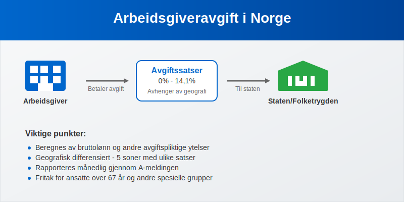

## Seksjon 1: Grunnleggende om Arbeidsgiveravgift

### 1.1 Hva er Arbeidsgiveravgift?

Arbeidsgiveravgift er en **avgift på lønn** som arbeidsgivere betaler til staten som en prosentandel av den totale lønnsutbetalingen til ansatte. Avgiften beregnes av [bruttolønnen](/blogs/regnskap/hva-er-bruttolonn "Hva er Bruttolønn? Definisjon, Beregning og Praktisk Anvendelse") og andre skattepliktige ytelser, og varierer mellom **0% og 14,1%** avhengig av hvor virksomheten er lokalisert geografisk.

Avgiften ble innført som en del av finansieringen av [folketrygden](/blogs/regnskap/hva-er-folketrygden "Hva er Folketrygden? Komplett Guide til Norges Nasjonale Trygdesystem") og andre offentlige velferdsordninger. Den er en direkte kostnad for arbeidsgiver og kommer i tillegg til den lønnen som utbetales til den ansatte.

### 1.2 Historisk Utvikling

Arbeidsgiveravgiften har gjennomgått flere endringer siden innføringen. Systemet med geografisk differensiering ble etablert for å stimulere næringsutvikling i distriktene ved å gi lavere avgiftssatser utenfor de sentrale områdene.

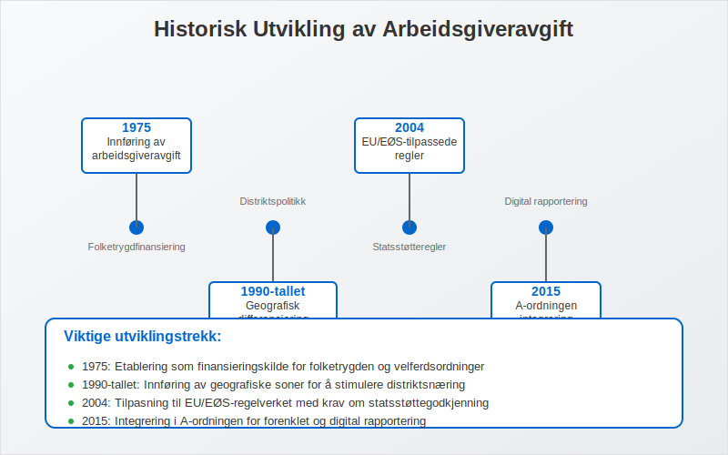

**Viktige milepæler:**

* **1975:** Innføring av arbeidsgiveravgift som en del av [folketrygdfinansieringen](/blogs/regnskap/hva-er-folketrygden "Hva er Folketrygden? Komplett Guide til Norges Nasjonale Trygdesystem")
* **1990-tallet:** Etablering av geografisk differensiering med soner
* **2004:** Innføring av EU/EØS-tilpassede regler
* **2015:** Integrering i [A-ordningen](/blogs/regnskap/hva-er-a-ordningen "Hva er A-ordningen?") og [A-meldingen](/blogs/regnskap/hva-er-a-melding "Hva er a-melding?")

## Seksjon 2: Geografiske Soner og Satser

### 2.1 Soneinndeling

Norge er delt inn i **fem geografiske soner** for arbeidsgiveravgift, hvor hver sone har sin egen avgiftssats. Inndelingen er basert på regionale utviklingshensyn og EU/EØS-regelverket.

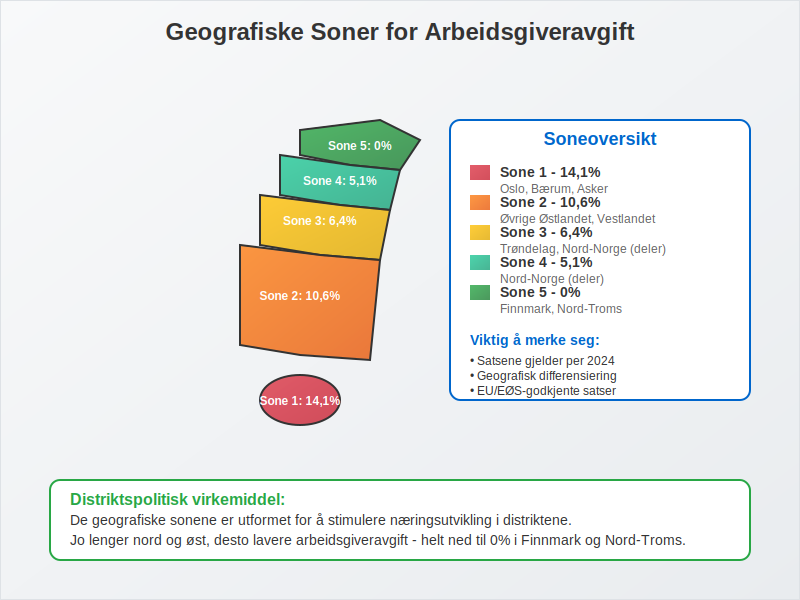

### 2.2 Gjeldende Satser (2024)

| Sone | Geografisk område | Avgiftssats | Beskrivelse |
|------|------------------|-------------|-------------|
| **Sone 1** | Oslo, Bærum, Asker | **14,1%** | Høyeste sats - sentrale strøk |
| **Sone 2** | Øvrige Østlandet, Vestlandet | **10,6%** | Standard sats for de fleste områder |
| **Sone 3** | Trøndelag, Nord-Norge (deler) | **6,4%** | Redusert sats for mindre sentrale områder |
| **Sone 4** | Nord-Norge (deler) | **5,1%** | Lav sats for distriktskommuner |
| **Sone 5** | Finnmark, Nord-Troms | **0%** | Fritak for nordligste områder |

### 2.3 Beregningsgrunnlag

Arbeidsgiveravgiften beregnes av følgende lønnskomponenter:

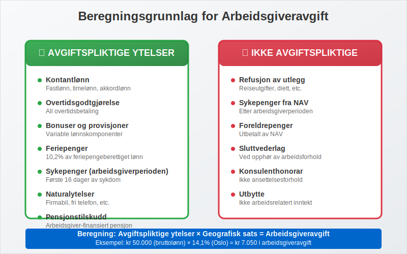

**Avgiftspliktige ytelser:**

* Kontantlønn ([fastlønn](/blogs/regnskap/hva-er-fastlonn "Hva er Fastlønn i Regnskap?"), timelønn, [akkordlønn](/blogs/regnskap/hva-er-akkordlonn "Hva er akkordlønn?"))
* Overtidsgodtgjørelse
* [Helligdagslønn og tilleggsgodtgjørelse](/blogs/regnskap/helligdager-regnskap-bedriftseiere "Helligdager (regnskap, bedriftseiere) - Komplett Guide til Feriepenger og Regnskapsføring") for arbeid på helligdager
* Bonuser og [provisjoner](/blogs/regnskap/hva-er-provisjon "Hva er Provisjon? Komplett Guide til Provisjon i Regnskap og Lønn")
* [Feriepenger](/blogs/regnskap/hva-er-feriepenger "Hva er Feriepenger i Regnskap? Beregning, Regnskapsføring og Praktiske Eksempler")
* Sykepenger fra arbeidsgiver (arbeidsgiverperioden)
* Naturalytelser (firmabil, fri telefon, etc.)
* [Pensjonstilskudd](/blogs/regnskap/hva-er-pensjon "Hva er Pensjon? Komplett Guide til Norsk Pensjonssystem") fra arbeidsgiver (se også [tjenestepensjon](/blogs/regnskap/hva-er-tjenestepensjon "Hva er Tjenestepensjon? Komplett Guide til Bedriftspensjon og Regnskapsføring"))

**Viktig:** Arbeidsgiveravgift beregnes av hele [bruttolønnen](/blogs/regnskap/hva-er-bruttolonn "Hva er Bruttolønn? Definisjon, Beregning og Praktisk Anvendelse"), selv om den ansatte har [frikort](/blogs/regnskap/hva-er-frikortgrense "Hva er Frikortgrense i Norge? Skattefri Inntekt og Praktiske Eksempler") og ikke betaler skatt på inntekten. Frikort påvirker kun skattetrekket, ikke arbeidsgiveravgiften.

## Seksjon 3: Fritak og Unntak

### 3.1 Aldersbaserte Fritak

Arbeidsgiveravgiften har spesielle regler for eldre arbeidstakere som en del av sysselsettingspolitikken.

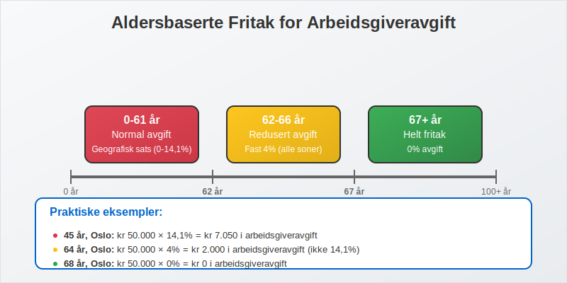

**Fritak for ansatte over 62 år:**

* **Helt fritak** for lønn til ansatte som er **67 år eller eldre**
* **Redusert avgift** for ansatte mellom **62-66 år** (kun 4% avgift uavhengig av sone)
* Gjelder kun for **ordinære ansettelsesforhold** (ikke konsulenter eller frilansere)

### 3.2 Andre Fritak og Unntak

| Type fritak | Beskrivelse | Vilkår |
|-------------|-------------|---------|
| **Lærlinger** | Fritak første to år av læretiden | Godkjent lærlingkontrakt |
| **Forskere** | Fritak for utenlandske forskere | Spesielle vilkår, tidsbegrenset |
| **Sjøfolk** | Redusert avgift for ansatte på skip | Norskregistrerte skip |
| **Små utbetalinger** | Fritak under visse beløpsgrenser | Under kr 1.000 per måned |

### 3.3 Praktiske Eksempler på Beregning

La oss se på konkrete eksempler på hvordan arbeidsgiveravgiften beregnes i ulike situasjoner:

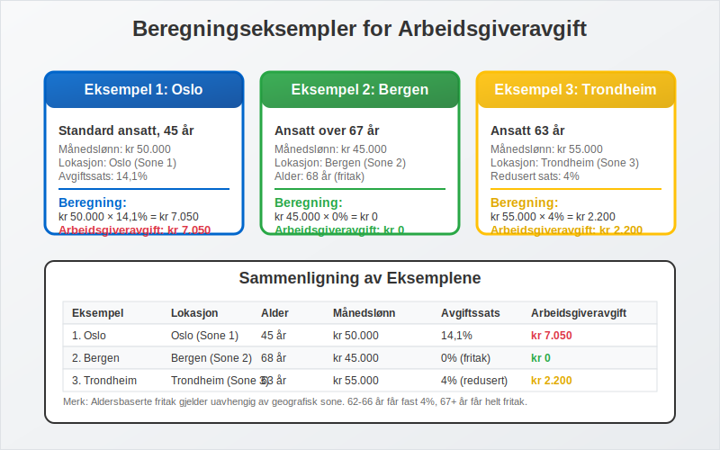

**Eksempel 1: Standard ansatt i Oslo**
* Månedslønn: kr 50.000
* Sone: 1 (Oslo)
* Avgiftssats: 14,1%
* **Arbeidsgiveravgift: kr 50.000 × 14,1% = kr 7.050**

**Eksempel 2: Ansatt over 67 år i Bergen**
* Månedslønn: kr 45.000
* Sone: 2 (Bergen)
* Aldersgruppe: Over 67 år
* **Arbeidsgiveravgift: kr 0 (helt fritak)**

**Eksempel 3: Ansatt 63 år i Trondheim**
* Månedslønn: kr 55.000
* Sone: 3 (Trondheim)
* Aldersgruppe: 62-66 år
* **Arbeidsgiveravgift: kr 55.000 × 4% = kr 2.200**

## Seksjon 4: Rapportering og Betaling

### 4.1 A-meldingen som Rapporteringskanal

Arbeidsgiveravgiften rapporteres månedlig gjennom [A-meldingen](/blogs/regnskap/hva-er-a-melding "Hva er a-melding?") som en del av [A-ordningen](/blogs/regnskap/hva-er-a-ordningen "Hva er A-ordningen?"). Dette systemet forenkler rapporteringen betydelig sammenlignet med tidligere ordninger.

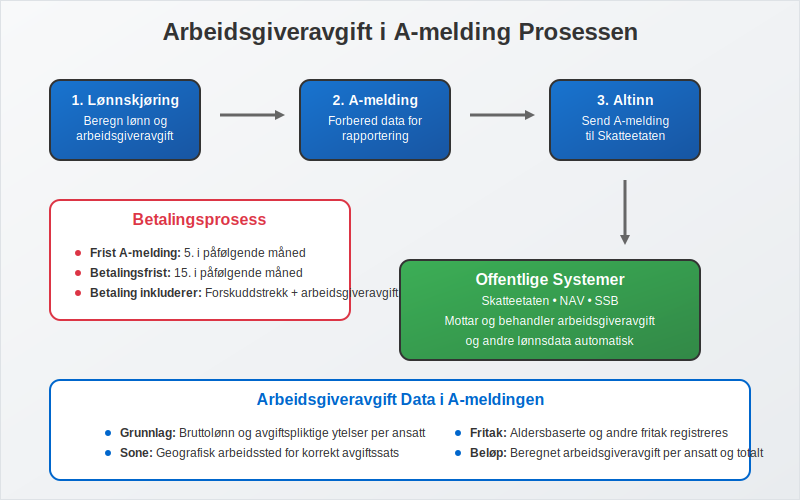

**Rapporteringsprosess:**

1. **Lønnskjøring:** Beregn lønn og arbeidsgiveravgift
2. **A-melding:** Rapporter data til Skatteetaten via [Altinn](/blogs/regnskap/hva-er-altinn "Hva er Altinn? Norges Digitale Portal for Næringsliv og Privatpersoner")
3. **Betaling:** Betal samlet forskuddstrekk og arbeidsgiveravgift
4. **Bokføring:** Registrer i [regnskapet](/blogs/regnskap/hva-er-regnskap "Hva er regnskap?")

### 4.2 Frister og Betalingsrutiner

| Måned | A-melding frist | Betalingsfrist | Merknad |
|-------|----------------|----------------|---------|
| **Januar** | 5. februar | 15. februar | Første termin |
| **Februar** | 5. mars | 15. mars | |
| **Mars** | 5. april | 15. april | |
| **April** | 5. mai | 15. mai | |
| **Mai** | 5. juni | 15. juni | |
| **Juni** | 5. juli | 15. juli | Feriemåned - vær ekstra oppmerksom |

**Viktige frister:**
* **A-melding:** Senest den 5. i påfølgende måned
* **Betaling:** Senest den 15. i påfølgende måned
* **Forsinkelsesgebyr:** Påløper ved for sen innlevering eller betaling

### 4.3 Regnskapsmessig Behandling

Arbeidsgiveravgiften skal behandles korrekt i bedriftens regnskap som en del av lønnskostnadene, sammen med andre obligatoriske arbeidsgiverutgifter som [obligatorisk tjenestepensjon](/blogs/regnskap/obligatorisk-tjenestepensjon "Hva er Obligatorisk Tjenestepensjon? Komplett Guide til OTP").

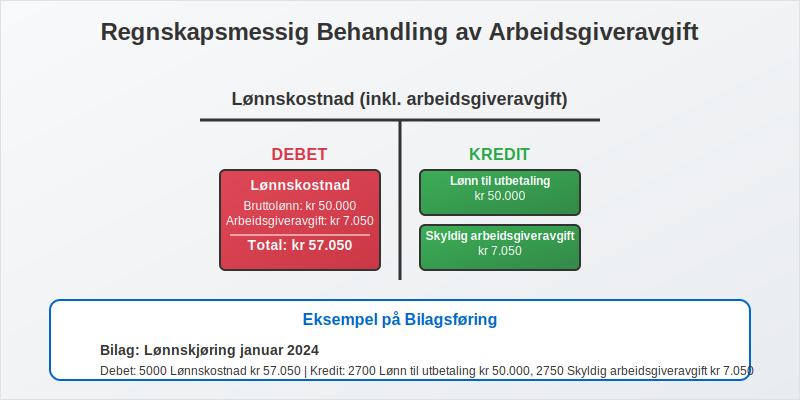

**Konteringseksempel:**
```
Debet: Lønnskostnad (inkl. arbeidsgiveravgift)    kr 57.050
  Kredit: Lønn til utbetaling                     kr 50.000
  Kredit: Skyldig arbeidsgiveravgift               kr  7.050
```

## Seksjon 5: Spesielle Situasjoner og Utfordringer

### 5.1 Virksomheter med Flere Lokasjoner

Bedrifter som opererer i flere geografiske soner må håndtere ulike avgiftssatser for samme lønnskjøring.


**Praktisk håndtering:**
* Separate lønnskjøringer per lokasjon
* Korrekt sonekoding i lønnssystemet
* Dokumentasjon av arbeidssted for hver ansatt

### 5.2 Konsulenter og Frilansere

**Viktig skille:**
* **Ansatte:** Arbeidsgiveravgift påløper
* **Konsulenter/frilansere:** Ingen arbeidsgiveravgift (men kan være merverdiavgift)
* **[Lett salær](/blogs/regnskap/hva-er-lett-salaer "Hva er Lett Salær i Regnskap?"):** Ingen arbeidsgiveravgift for kvalifiserende arbeidstyper
* **Grensedragning:** Basert på [arbeidsrettslige kriterier](/blogs/regnskap/hva-er-arbeidsforholdstype "Hva er arbeidsforholdstype?") som definerer [arbeidsforholdstypen](/blogs/regnskap/hva-er-arbeidsforholdstype "Hva er arbeidsforholdstype?")

### 5.3 Internasjonale Forhold

For virksomheter med utenlandske ansatte eller som opererer internasjonalt, gjelder spesielle regler.

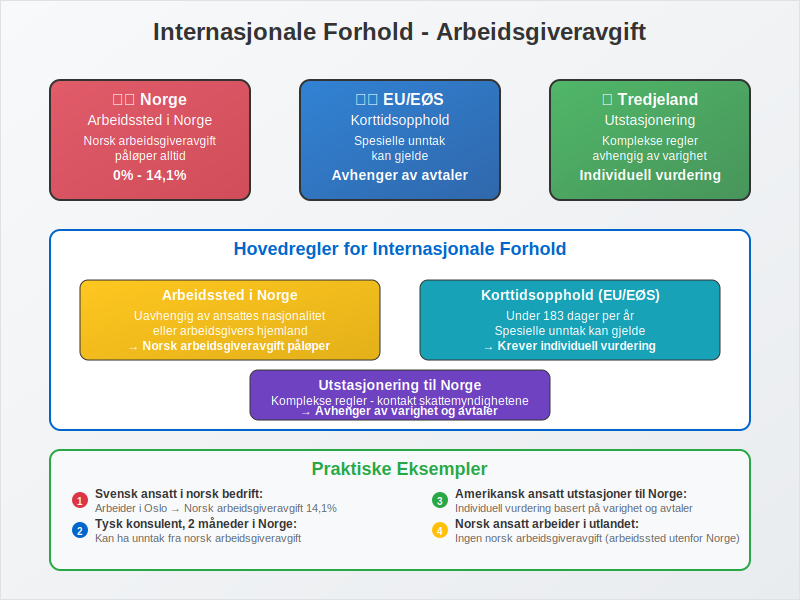

**Hovedregler:**
* **Arbeidssted i Norge:** Norsk arbeidsgiveravgift påløper
* **Korttidsopphold:** Spesielle unntak kan gjelde
* **Utstasjonering:** Komplekse regler avhengig av varighet og avtaler

## Seksjon 6: Fremtidige Endringer og Utvikling

### 6.1 Politiske Diskusjoner

Arbeidsgiveravgiften er gjenstand for kontinuerlige politiske diskusjoner, særlig knyttet til:

* **Konkurransekraft:** Høye avgifter kan svekke norske bedrifters konkurranseevne
* **Distriktspolitikk:** Geografisk differensiering som virkemiddel
* **EU/EØS-tilpasning:** Krav om statsstøttegodkjenning for lave satser

### 6.2 Digitalisering og Automatisering

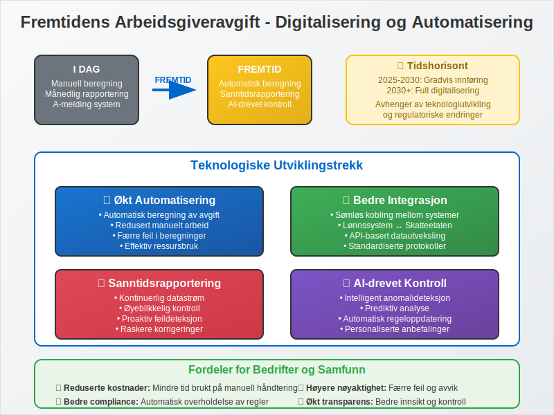

**Teknologiske utviklingstrekk:**
* Økt automatisering i beregning og rapportering
* Bedre integrasjon mellom lønnssystemer og offentlige systemer
* Sanntidsrapportering og -kontroll

## Seksjon 7: Praktiske Tips og Beste Praksis

### 7.1 Rutiner for Korrekt Håndtering

**Månedlige rutiner:**
1. **Kontroller sonekoding** for alle ansatte
2. **Beregn korrekt avgift** basert på alle avgiftspliktige ytelser
3. **Lever A-melding** innen fristen
4. **Betal avgiften** innen betalingsfristen
5. **Bokfør transaksjonen** korrekt i regnskapet

### 7.2 Vanlige Feil og Hvordan Unngå Dem

| Vanlig feil | Konsekvens | Hvordan unngå |
|-------------|------------|---------------|
| **Feil sonekoding** | Feil avgiftsberegning | Oppdater ved flytting/endring |
| **Glemte ytelser** | For lav avgift | Sjekkliste over avgiftspliktige ytelser |
| **Aldersgruppe-feil** | Feil fritak | Oppdater personnummer og alder |
| **For sen rapportering** | Gebyr og renter | Automatiske påminnelser |

### 7.3 Kontroll og Etterlevelse

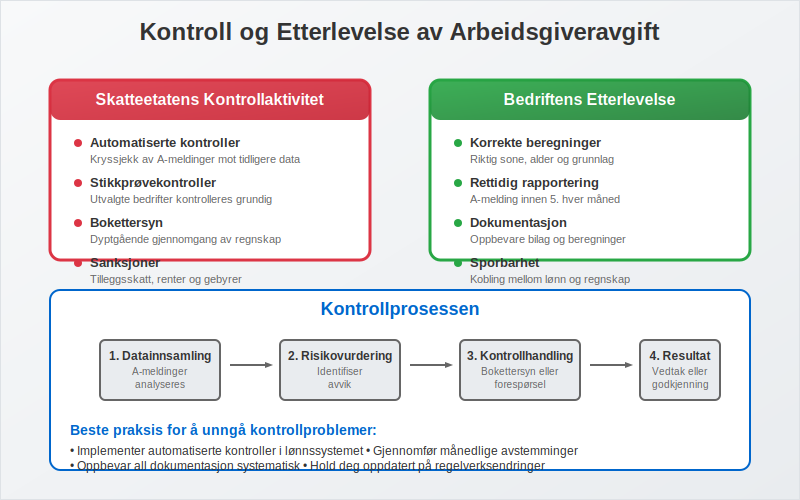

**Skatteetatens kontrollaktivitet:**
* Automatiserte kontroller av A-meldinger
* Stikkprøvekontroller av bedrifter
* Bokettersyn med fokus på lønnskostnader

**Forberedelse til kontroll:**
* Dokumenter alle beregninger og vurderinger
* Oppbevar lønnsbilag og arbeidskontrakter
* Sørg for sporbarhet mellom lønnssystem og regnskap

## Konklusjon

Arbeidsgiveravgift er en kompleks, men fundamental del av norsk lønnshåndtering. Med korrekt forståelse av regelverket, geografiske forskjeller og rapporteringskrav, kan bedrifter sikre korrekt beregning og rapportering. 

Den geografiske differensieringen gjør systemet til et viktig distriktspolitisk virkemiddel, mens integrasjonen i A-ordningen har forenklet den administrative håndteringen betydelig. For bedrifter er det essensielt å ha gode rutiner og systemer som sikrer korrekt beregning og rettidig rapportering.

Ved å følge beste praksis og holde seg oppdatert på regelverksendringer, kan arbeidsgivere unngå kostbare feil og bidra til et velfungerende system for finansiering av norske velferdsordninger.

## Relaterte Artikler

* [Obligatorisk Tjenestepensjon](/blogs/regnskap/obligatorisk-tjenestepensjon "Hva er Obligatorisk Tjenestepensjon? Komplett Guide til OTP") - Lovpålagt pensjonsordning for arbeidsgivere
* [A-ordningen](/blogs/regnskap/hva-er-a-ordningen "Hva er A-ordningen?") - Det samordnede rapporteringssystemet
* [A-meldingen](/blogs/regnskap/hva-er-a-melding "Hva er a-melding?") - Månedlig rapportering av lønn og avgifter
* [Lett Salær](/blogs/regnskap/hva-er-lett-salaer "Hva er Lett Salær i Regnskap?") - Lønnsordning uten arbeidsgiveravgift
* [Akkordlønn](/blogs/regnskap/hva-er-akkordlonn "Hva er akkordlønn?") - Spesiell lønnsform med avgiftskonsekvenser
* [Arbeidsforholdstype](/blogs/regnskap/hva-er-arbeidsforholdstype "Hva er arbeidsforholdstype?") - Juridiske rammer for arbeidsforhold og avgiftskonsekvenser
* [Altinn](/blogs/regnskap/hva-er-altinn "Hva er Altinn?") - Digital rapporteringsplattform
* [Regnskap](/blogs/regnskap/hva-er-regnskap "Hva er regnskap?") - Regnskapsmessig behandling av lønnskostnader


