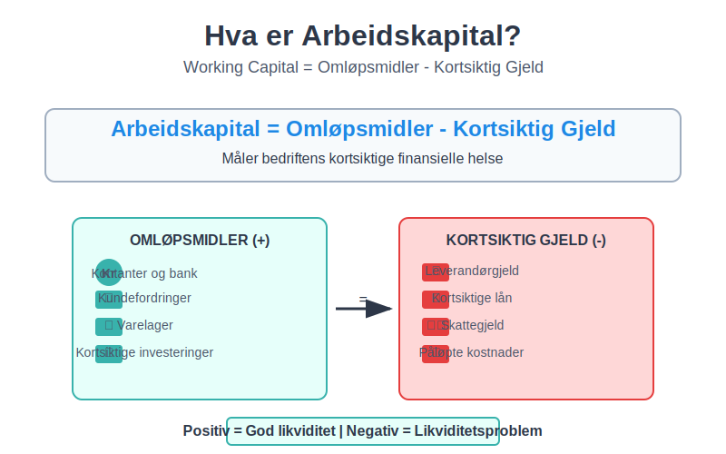
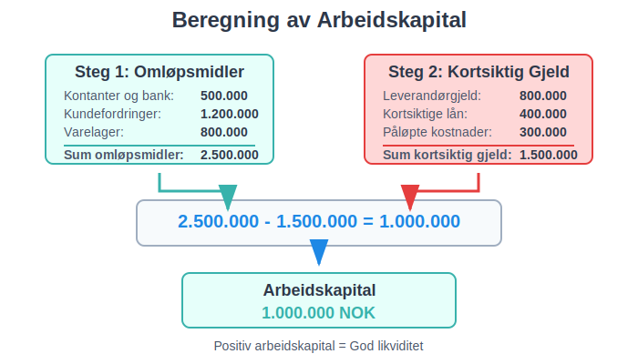
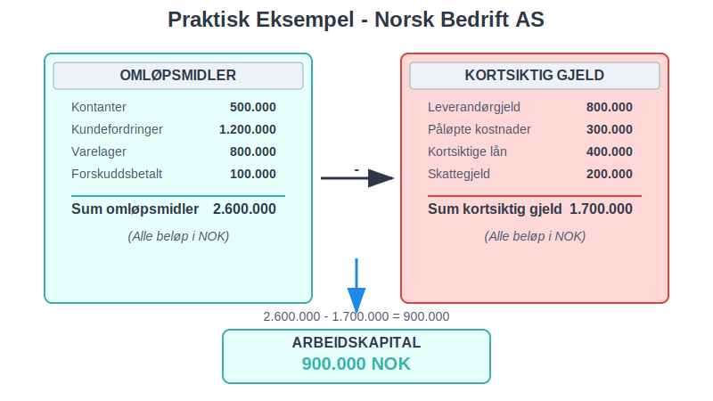
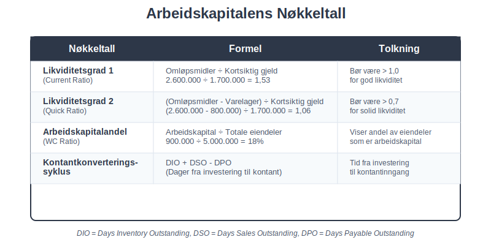
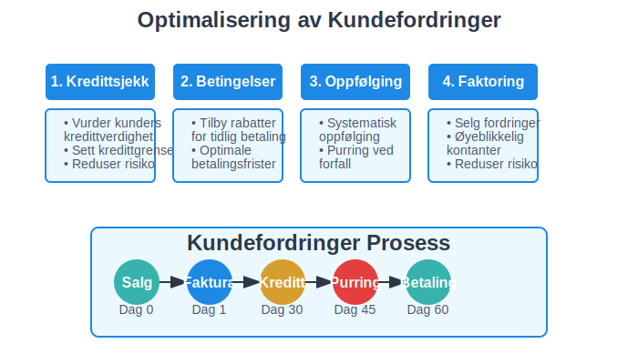
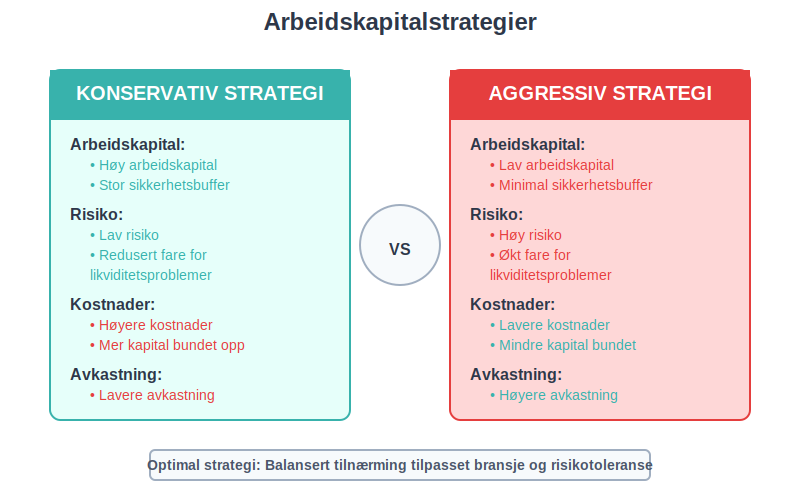
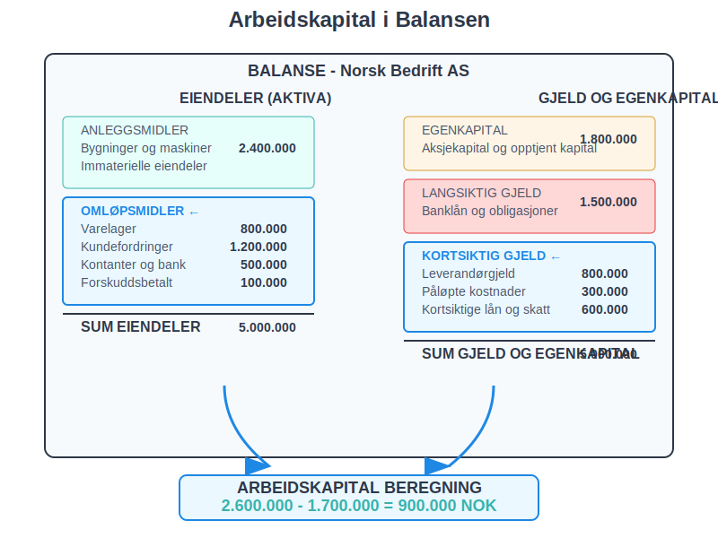
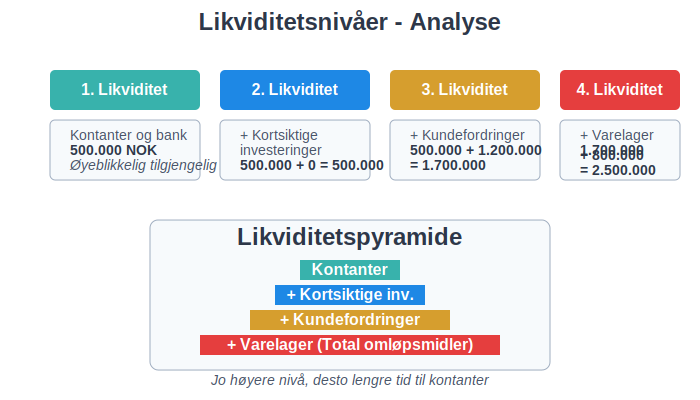
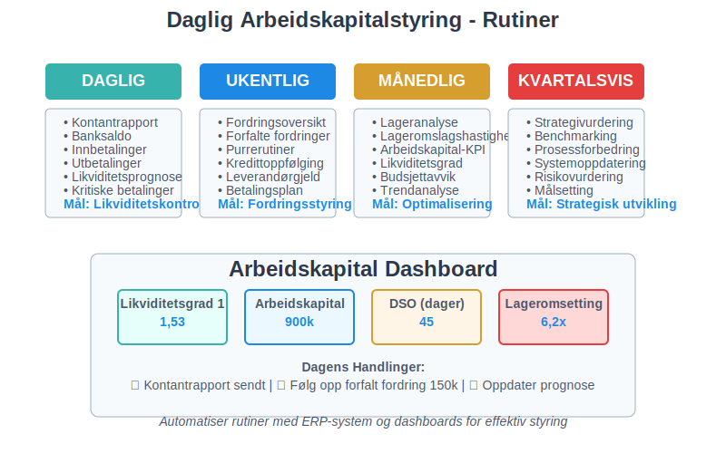

---
title: "Hva er arbeidskapital?"
meta_title: "Hva er arbeidskapital?"
meta_description: '**Arbeidskapital** er differansen mellom [omløpsmidler](/blogs/regnskap/hva-er-aktiva "Hva er Aktiva? En Komplett Guide til Eiendeler i Regnskap") og kortsikti...'
slug: hva-er-arbeidskapital
type: blog
layout: pages/single
---

**Arbeidskapital** er differansen mellom [omløpsmidler](/blogs/regnskap/hva-er-aktiva "Hva er Aktiva? En Komplett Guide til Eiendeler i Regnskap") og kortsiktig gjeld, og representerer bedriftens evne til å finansiere den daglige driften. Som en sentral komponent i bedriftens totale [kapital](/blogs/regnskap/hva-er-kapital "Hva er Kapital? Komplett Guide til Kapitaltyper i Regnskap og Økonomi") og [finanskapital](/blogs/regnskap/hva-er-finanskapital "Hva er Finanskapital? Definisjon, Typer og Betydning i Regnskap"), er arbeidskapital et kritisk mål på **[likviditet](/blogs/regnskap/hva-er-likviditet "Hva er Likviditet? Komplett Guide til Likviditetsstyring og Analyse")** og **finansiell helse** som viser om bedriften kan møte sine kortsiktige forpliktelser. God arbeidskapitalstyring er grunnleggende for å opprettholde [betalingsevne](/blogs/regnskap/hva-er-betalingsevne "Hva er Betalingsevne? Analyse, Nøkkeltall og Vurdering av Likviditet") og sikre bedriftens finansielle stabilitet.

For å vurdere bedriftens **kapitalbehov**, se vår artikkel om [Kapitalbehov](/blogs/regnskap/kapitalbehov "Hva er Kapitalbehov? Guide til Kapitalbehov og Finansieringsplan for Norske Bedrifter").

## Seksjon 1: Definisjon og Grunnleggende Prinsipper

### 1.1 Hva er Arbeidskapital?

**Arbeidskapital** (working capital) beregnes som:

**Arbeidskapital = Omløpsmidler - [Kortsiktig gjeld](/blogs/regnskap/kortsiktig-gjeld "Hva er Kortsiktig Gjeld? Komplett Guide til Kortsiktige Forpliktelser")**

Dette målet viser hvor mye **likvide ressurser** bedriften har tilgjengelig etter at alle kortsiktige forpliktelser er dekket. En positiv arbeidskapital indikerer at bedriften har tilstrekkelige ressurser til å drive virksomheten, mens negativ arbeidskapital kan signalisere **[likviditetsproblemer](/blogs/regnskap/hva-er-likviditet "Hva er Likviditet? Komplett Guide til Likviditetsstyring og Analyse")**.

### 1.2 Komponenter i Arbeidskapital

Arbeidskapital består av to hovedkomponenter som finnes i [balansen](/blogs/regnskap/hva-er-balanse "Hva er Balanse i Regnskap? Komplett Guide til Balansens Oppbygging og Funksjon"):

#### Omløpsmidler (Aktiva)

* **[Kassebeholdning](/blogs/regnskap/hva-er-kassebeholdning "Hva er Kassebeholdning? Komplett Guide til Kontanter og Likvide Midler") og [bankinnskudd](/blogs/regnskap/hva-er-bankinnskudd "Hva er Bankinnskudd i Regnskap? Typer, Regnskapsføring og Rentehåndtering"):** Mest likvide eiendeler
* **Kundefordringer:** Penger kunder skylder bedriften
* **Varelager:** Råvarer, varer under tilvirkning og ferdigvarer som aktiveres gjennom [varekjøp](/blogs/regnskap/hva-er-varekjop "Hva er Varekjøp? Komplett Guide til Regnskapsføring og Innkjøpsstyring") og verdsettes basert på [varekostnad](/blogs/regnskap/hva-er-varekostnad "Hva er Varekostnad? Komplett Guide til Kostnadsstyring og Regnskapsføring")
* **Forskuddsbetalte kostnader:** Forhåndsbetalte utgifter
* **Kortsiktige investeringer:** Verdipapirer som kan selges raskt

#### Kortsiktig Gjeld ([Passiva](/blogs/regnskap/hva-er-passiva "Hva er Passiva? En Guide til Gjeld og Egenkapital i Regnskap"))

For en detaljert gjennomgang av alle typer kortsiktig gjeld, se vår omfattende guide om [kortsiktig gjeld](/blogs/regnskap/kortsiktig-gjeld "Hva er Kortsiktig Gjeld? Komplett Guide til Kortsiktige Forpliktelser").

* **[Leverandørgjeld](/blogs/regnskap/hva-er-kreditor "Hva er Kreditor? Komplett Guide til Leverandørgjeld og Kreditorhåndtering"):** Penger bedriften skylder leverandører
* **Påløpte kostnader:** Opptjente men ikke betalte utgifter
* **Kortsiktige lån:** Lån som forfaller innen ett år
* **Skattegjeld:** Skyldig skatt til myndighetene
* **Annen kortsiktig gjeld:** Diverse kortsiktige forpliktelser

## Seksjon 2: Beregning og Analyse av Arbeidskapital

### 2.1 Praktisk Beregningseksempel

La oss se på et konkret eksempel fra en norsk bedrift:

| Omløpsmidler | Beløp (NOK) | Kortsiktig Gjeld | Beløp (NOK) |
|:-------------|:------------|:-----------------|:------------|
| Kontanter | 500.000 | Leverandørgjeld | 800.000 |
| Kundefordringer | 1.200.000 | Påløpte kostnader | 300.000 |
| Varelager | 800.000 | Kortsiktige lån | 400.000 |
| Forskuddsbetalt | 100.000 | Skattegjeld | 200.000 |
| **Sum omløpsmidler** | **2.600.000** | **Sum kortsiktig gjeld** | **1.700.000** |

**Arbeidskapital = 2.600.000 - 1.700.000 = 900.000 NOK**

### 2.2 Arbeidskapitalens Nøkkeltall

For å analysere arbeidskapital brukes flere viktige nøkkeltall:

| Nøkkeltall | Formel | Tolkning |
|:-----------|:-------|:---------|
| **[Likviditetsgrad 1](/blogs/regnskap/hva-er-likviditetsgrad "Hva er Likviditetsgrad? Beregning, Analyse og Tolkning av Likviditetsnøkkeltall")** | Omløpsmidler ÷ Kortsiktig gjeld | Bør være > 1,0 for god likviditet |
| **[Likviditetsgrad 2](/blogs/regnskap/hva-er-likviditetsgrad "Hva er Likviditetsgrad? Beregning, Analyse og Tolkning av Likviditetsnøkkeltall")** | (Omløpsmidler - Varelager) ÷ Kortsiktig gjeld | Bør være > 0,7 for solid likviditet |
| **Arbeidskapitalandel** | Arbeidskapital ÷ Totale eiendeler | Viser andel av eiendeler som er arbeidskapital |
| **Kontantkonverteringssyklus** | DIO + DSO - DPO | Tid fra investering til kontantinngang |

### 2.3 Bransjespesifikke Forskjeller

Arbeidskapitalbehov varierer betydelig mellom bransjer:

* **Detaljhandel:** Høyt varelager, lave kundefordringer
* **Produksjon:** Høyt varelager og kundefordringer
* **Tjenester:** Lave varelager, høye kundefordringer
* **Bygg og anlegg:** Høye kundefordringer, variable varelager

## Seksjon 3: Arbeidskapitalens Komponenter i Detalj

### 3.1 Kundefordringer (Accounts Receivable)

**Kundefordringer** representerer penger kunder skylder for leverte varer eller tjenester. Effektiv styring av kundefordringer er kritisk for arbeidskapital. For en dyptgående forståelse av [debitor](/blogs/regnskap/hva-er-debitor "Hva er Debitor i Regnskap? Komplett Guide til Kundefordringer og Debitorhåndtering") og debitorhåndtering, se vår omfattende guide.

#### Optimalisering av Kundefordringer

* **Kredittsjekk:** Vurder kunders [kredittverdighet](/blogs/regnskap/hva-er-bonitet "Hva er bonitet?") før salg
* **Betalingsbetingelser:** Tilby rabatter for tidlig betaling
* **Automatisk avstemming:** Bruk [BankGiro](/blogs/regnskap/hva-er-bankgiro "Hva er BankGiro? Komplett Guide til Norsk Betalingssystem") for raskere innbetaling og automatisk avstemming
* **Oppfølging:** Systematisk oppfølging av forfalte fordringer gjennom [betalingspåminnelser](/blogs/regnskap/hva-er-betalingspåmminelse "Hva er Betalingspåmminelse? Komplett Guide til Purring og Inkasso i Norge")
* **Inkassoalternativer:** Velg mellom [egeninkasso](/blogs/regnskap/hva-er-egeninkasso "Hva er Egeninkasso? Komplett Guide til Selvinkasso og Fordringshåndtering") eller profesjonelle inkassotjenester for hardnakkede saker
* **[Factoring](/blogs/regnskap/hva-er-factoring "Hva er Factoring? Komplett Guide til Fakturakjøp og Finansiering"):** Selg fordringer til factoringselskaper for øyeblikkelig kontantstrøm og redusert kredittrisiko

### 3.2 Varelager (Inventory)

**[Lagerbeholdning](/blogs/regnskap/hva-er-lagerbeholdning "Hva er Lagerbeholdning? Komplett Guide til Lagerstyring og Verdivurdering")** binder opp betydelig arbeidskapital og må balanseres mellom tilgjengelighet og kostnader. Effektiv lagerstyring krever forståelse av verdivurderingsmetoder som FIFO og vektet gjennomsnitt, samt systematisk oppfølging av lageromsetning og lagerkostnader.

#### Lageroptimalisering

* **Just-in-time:** Reduser lagernivåer gjennom bedre planlegging
* **ABC-analyse:** Prioriter styring av høyverdige varer
* **Lageromslagshastighet:** Øk hvor ofte lageret omsettes
* **Sesongplanlegging:** Tilpass lagernivåer til sesongvariasjoner

For [detaljhandel](/blogs/regnskap/hva-er-detaljhandel "Hva er Detaljhandel? Komplett Guide til Regnskap og Økonomistyring for Butikker") er lageroptimalisering spesielt kritisk på grunn av høyt transaksjonsvolum, mange varelinjer og utfordringer som svinn og tyveri som påvirker arbeidskapitalen betydelig.

### 3.3 Leverandørgjeld (Accounts Payable)

**[Leverandørgjeld](/blogs/regnskap/hva-er-kreditor "Hva er Kreditor? Komplett Guide til Leverandørgjeld og Kreditorhåndtering")** er en viktig finansieringskilde som kan optimaliseres for bedre arbeidskapital.

#### Strategier for Leverandørgjeld

* **Betalingsbetingelser:** Forhandle lengre betalingsfrister
* **[Leverandørkreditt](/blogs/regnskap/hva-er-leverandorkreditt "Hva er Leverandørkreditt? Komplett Guide til Leverandørfinansiering"):** Utnytt leverandørers kredittfasiliteter som en kostnadseffektiv finansieringsform
* **Kontantrabatter:** Vurder om tidlig betaling lønner seg
* **Sentralisert innkjøp:** Oppnå bedre betingelser gjennom volum

## Seksjon 4: Arbeidskapitalstyring og Optimalisering

### 4.1 Arbeidskapitalstrategier

Bedrifter kan velge mellom ulike strategier for arbeidskapitalstyring:

#### Konservativ Strategi

* **Høy arbeidskapital:** Stor sikkerhetsbuffer
* **Lav risiko:** Redusert fare for likviditetsproblemer
* **Høyere kostnader:** Mer kapital bundet opp
* **Lavere avkastning:** Mindre effektiv kapitalbruk

#### Aggressiv Strategi

* **Lav arbeidskapital:** Minimal sikkerhetsbuffer
* **Høy risiko:** Økt fare for likviditetsproblemer
* **Lavere kostnader:** Mindre kapital bundet opp
* **Høyere avkastning:** Mer effektiv kapitalbruk

### 4.2 [Kontantstrømstyring](/blogs/regnskap/hva-er-kontantstrom "Hva er Kontantstrøm? Komplett Guide til Cash Flow Analyse og Styring")

Arbeidskapital påvirker direkte bedriftens **[kontantstrøm](/blogs/regnskap/hva-er-kontantstrom "Hva er Kontantstrøm? Komplett Guide til Cash Flow Analyse og Styring")** og er en sentral del av [likviditetsstyring](/blogs/regnskap/hva-er-likviditetsstyring "Hva er Likviditetsstyring i Regnskap? Kontantstrøm, Arbeidskapital og Finansiell Planlegging"). Arbeidskapitalstyring må koordineres med:

* **Budsjetter:** Planlegg arbeidskapitalbehov
* **Prognoser:** Forutsi sesongvariasjoner
* **Finansiering:** Sikre tilstrekkelig kredittramme
* **Forskuddsbetalinger:** Bruk [avanse](/blogs/regnskap/hva-er-avanse "Hva er Avanse? Forskuddsbetaling, Regnskapsføring og Praktiske Råd") for å forbedre [kontantstrøm](/blogs/regnskap/hva-er-kontantstrom "Hva er Kontantstrøm? Komplett Guide til Cash Flow Analyse og Styring")
* **Overvåking:** Løpende oppfølging av nøkkeltall

## Seksjon 5: Arbeidskapital i Regnskapet

### 5.1 Presentasjon i Ã…rsregnskapet

Arbeidskapital fremkommer ikke direkte i [regnskapet](/blogs/regnskap/hva-er-regnskap "Hva er Regnskap? En Dybdeanalyse for Norge"), men beregnes fra balanseopplysninger. For en dyptgående forståelse av balansens oppbygging og hvordan arbeidskapitalkomponentene inngår i det totale bildet, se vår omfattende guide om [balanseregnskap](/blogs/regnskap/hva-er-balanseregnskap "Hva er Balanseregnskap? Komplett Guide til Balansens Oppbygging og Analyse").

#### Balansepresentasjon

**EIENDELER (AKTIVA)**
* Anleggsmidler
* **Omløpsmidler** ← Del av arbeidskapital
  - Varelager
  - Kundefordringer
  - Kontanter og bankinnskudd

**GJELD OG EGENKAPITAL**
* Egenkapital
* Langsiktig gjeld
* **Kortsiktig gjeld** ← Del av arbeidskapital
  - Leverandørgjeld
  - Annen kortsiktig gjeld

### 5.2 Kontantstrømoppstilling og Arbeidskapital

**[Kontantstrømoppstillingen](/blogs/regnskap/hva-er-kontantstromoppstilling "Hva er Kontantstrømoppstilling? Komplett Guide til Kontantstrømanalyse og Rapportering")** er et kritisk finansielt dokument som viser hvordan endringer i arbeidskapital påvirker bedriftens [kontantstrøm](/blogs/regnskap/hva-er-kontantstrom "Hva er Kontantstrøm? Komplett Guide til Cash Flow Analyse og Styring") fra drift. Arbeidskapitalendringer er en av hovedkomponentene i kontantstrømoppstillingen og kan ha betydelig innvirkning på bedriftens likviditet.

I kontantstrømoppstillingen vises endringer i arbeidskapital som påvirker kontantstrømmen fra drift:

| Endring i arbeidskapitalkomponenter | Effekt på kontantstrøm |
|:-------------------------------------|:-----------------------|
| Økning i kundefordringer | Negativ (mindre kontanter) |
| Reduksjon i kundefordringer | Positiv (mer kontanter) |
| Økning i varelager | Negativ (mindre kontanter) |
| Reduksjon i varelager | Positiv (mer kontanter) |
| Økning i leverandørgjeld | Positiv (mer kontanter) |
| Reduksjon i leverandørgjeld | Negativ (mindre kontanter) |

For en omfattende forståelse av hvordan arbeidskapitalendringer beregnes og presenteres i kontantstrømoppstillingen, inkludert direkte og indirekte metoder, se vår detaljerte guide til [kontantstrømoppstilling](/blogs/regnskap/hva-er-kontantstromoppstilling "Hva er Kontantstrømoppstilling? Komplett Guide til Kontantstrømanalyse og Rapportering"). For dyptgående analyseteknikker og strategier for å optimalisere kontantstrøm gjennom arbeidskapitalstyring, anbefaler vi vår omfattende artikkel om [kontantstrømanalyse](/blogs/regnskap/hva-er-kontantstromanalyse "Hva er Kontantstrømanalyse? Komplett Guide til Cash Flow Analyse").

## Seksjon 6: Arbeidskapital og Finansiell Analyse

### 6.1 Likviditetsanalyse

Arbeidskapital er grunnlaget for **[likviditetsanalyse](/blogs/regnskap/hva-er-likviditetsgrad "Hva er Likviditetsgrad? Beregning, Analyse og Tolkning av Likviditetsnøkkeltall")** som vurderer bedriftens betalingsevne:

#### Likviditetsnivåer

1. **Første likviditet:** [Kontantbeholdning](/blogs/regnskap/hva-er-kontantbeholdning "Hva er Kontantbeholdning? Komplett Guide til Kontantforvaltning og Likviditet") - kontanter og bankinnskudd
2. **Andre likviditet:** + kortsiktige investeringer
3. **Tredje likviditet:** + kundefordringer
4. **Fjerde likviditet:** + varelager (total omløpsmidler)

For systematisk planlegging og styring av likviditet gjennom detaljert kontantstrømplanlegging, er [likviditetsbudsjett](/blogs/regnskap/likviditetsbudsjett "Hva er Likviditetsbudsjett? Komplett Guide til Kontantstrømplanlegging") et essensielt verktøy som komplementerer arbeidskapitalanalysen ved å gi fremtidsrettet oversikt over inn- og utbetalinger.

### 6.2 Arbeidskapitalens Påvirkning på Lønnsomhet

Arbeidskapital påvirker lønnsomhet gjennom:

* **Kapitalkostnader:** Bundet kapital har en kostnad som påvirker [nullpunkt-analyse](/blogs/regnskap/hva-er-nullpunkt "Hva er Nullpunkt (Break-Even) i Regnskap? Lønnsomhetsanalyse og Økonomisk Planlegging")
* **Operasjonell effektivitet:** Optimal arbeidskapital forbedrer drift
* **Vekstmuligheter:** Tilstrekkelig arbeidskapital muliggjør vekst
* **Risikostyring:** Balanserer risiko og avkastning

Effektiv arbeidskapitalstyring påvirker direkte bedriftens [bruttofortjeneste](/blogs/regnskap/hva-er-bruttofortjeneste "Hva er Bruttofortjeneste? Beregning, Analyse og Betydning for Bedriften") ved å optimalisere kostnadene knyttet til varelager, kundefordringer og leverandørgjeld.

For å analysere hvordan arbeidskapital påvirker lønnsomhet på ulike nivåer i organisasjonen, kan [avdelingsregnskap](/blogs/regnskap/hva-er-avdelingsregnskap "Hva er Avdelingsregnskap? Kostnadsfordeling og Lønnsomhetsanalyse") være et verdifullt verktøy for å måle effektivitet og kapitalallokering per avdeling.

## Seksjon 7: Praktiske Tips for Arbeidskapitalstyring

### 7.1 Daglig Arbeidskapitalstyring

#### Rutiner for Optimal Styring

* **Daglig kontantrapport:** Overvåk likviditetssituasjonen
* **Ukentlig fordringsoversikt:** Følg opp forfalte kundefordringer med [betalingsoppfordringer](/blogs/regnskap/hva-er-betalingsoppfordring "Betalingsoppfordring - Komplett Guide til Purring og Inkasso i Norge")
* **Månedlig lageranalyse:** Vurder lagernivåer og omslagshastighet
* **Kvartalsvis strategivurdering:** Evaluer arbeidskapitalstrategi

### 7.2 Teknologi og Automatisering

Moderne teknologi kan forbedre arbeidskapitalstyring:

* **ERP-systemer:** Integrert styring av alle komponenter
* **Automatisk fakturering:** Reduser tid fra levering til faktura
* **Elektronisk betaling:** Raskere innbetaling fra kunder
* **Prediktiv analyse:** Forutsi arbeidskapitalbehov

## Seksjon 8: Arbeidskapital i Ulike Livsfaser

### 8.1 Oppstartsfase

**Utfordringer:**
* Høyt arbeidskapitalbehov
* Begrenset tilgang til finansiering
* Usikre kontantstrømmer

**Strategier:**
* Konservativ tilnærming
* Fokus på kontantstrøm
* Minimere varelager
* Vurdere alternative finansieringsformer som [crowdsourcing](/blogs/regnskap/hva-er-crowdsourcing "Hva er Crowdsourcing i Regnskap? Fordeler, Utfordringer og Praktisk Anvendelse")

### 8.2 Vekstfase

**Utfordringer:**
* Økende arbeidskapitalbehov
* Rask vekst i kundefordringer
* Skalering av operasjoner

**Strategier:**
* Balansert tilnærming
* Investere i systemer
* Profesjonalisere kredittstyring

### 8.3 Moden fase

**Utfordringer:**
* Optimalisere effektivitet
* Konkurranse på marginer
* Stabile men lavere vekstrater

**Strategier:**
* Aggressiv optimalisering for [selvfinansiering](/blogs/regnskap/hva-er-selvfinansiering "Hva er Selvfinansiering? Komplett Guide til Intern Finansiering og Kapitaloppbygging")
* Fokus på kapitalomsetting
* Avanserte styringsverktøy

## Konklusjon

Arbeidskapital er et fundamentalt konsept i **finansiell styring** som krever kontinuerlig oppmerksomhet og optimalisering. Ved å forstå sammenhengen mellom [omløpsmidler](/blogs/regnskap/hva-er-aktiva "Hva er Aktiva? En Komplett Guide til Eiendeler i Regnskap") og kortsiktig gjeld, kan bedrifter forbedre sin **likviditet**, redusere **finansieringskostnader** og øke **lønnsomhet**.

Effektiv arbeidskapitalstyring krever:

* **Systematisk overvåking** av nøkkeltall og trender
* **Balansert tilnærming** mellom risiko og avkastning
* **Integrert styring** av alle arbeidskapitalkomponenter
* **Kontinuerlig forbedring** av prosesser og systemer

For mer informasjon om relaterte emner, se våre artikler om [aktiva](/blogs/regnskap/hva-er-aktiva "Hva er Aktiva? En Komplett Guide til Eiendeler i Regnskap"), [saldobalanse](/blogs/regnskap/hva-er-saldobalanse "Hva er Saldobalanse? En Komplett Guide") og [regnskap](/blogs/regnskap/hva-er-regnskap "Hva er Regnskap? En Dybdeanalyse for Norge").
