---
title: "Hva er Arbeidspapirer i Revisjon?"
seoTitle: "Hva er Arbeidspapirer i Revisjon?"
meta_description: '**Arbeidspapirer i revisjon** er den systematiske dokumentasjonen som [revisorer](/blogs/regnskap/hva-er-regnskap "Hva er Regnskap? En komplett guide") utarbeid...'
slug: hva-er-arbeidspapirer-revisjon
type: blog
layout: pages/single
---

**Arbeidspapirer i revisjon** er den systematiske dokumentasjonen som [revisorer](/blogs/regnskap/hva-er-regnskap "Hva er Regnskap? En komplett guide") utarbeider under revisjonsoppdraget for å støtte sine konklusjoner og oppfylle profesjonelle standarder. Disse dokumentene utgjør grunnlaget for revisjonsuttalelsen og sikrer kvalitet og sporbarhet i revisjonsprosessen.

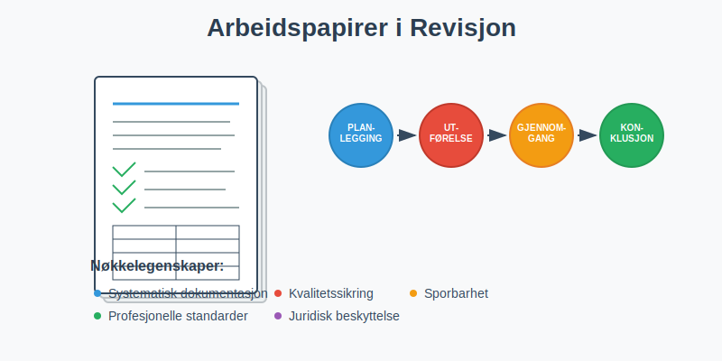

## Hva er Arbeidspapirer?

Arbeidspapirer er **alle dokumenter og registreringer** som revisoren utarbeider eller innhenter under revisjonsoppdraget. De dokumenterer:

- **Revisjonsplanlegging:** Strategi, risikovurderinger og tilnærming
- **Utførte prosedyrer:** Detaljerte beskrivelser av revisjonshandlinger
- **Innhentede bevis:** Dokumentasjon som støtter revisjonskonklusjonene
- **Konklusjoner:** Revisorens vurderinger og beslutninger

Arbeidspapirene må være **tilstrekkelige og hensiktsmessige** til å støtte revisjonsuttalelsen og gjøre det mulig for en erfaren revisor å forstå arbeidet som er utført.

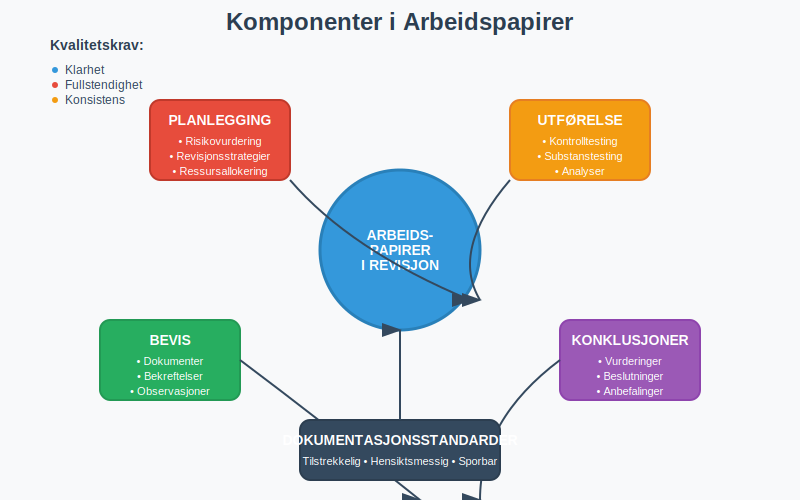

## Formål med Arbeidspapirer

### Primære Formål

#### Dokumentasjon av Revisjonsarbeid
- **Bevis for utført arbeid:** Viser at revisjonen er utført i henhold til standarder
- **Støtte for konklusjoner:** Dokumenterer grunnlaget for revisjonsuttalelsen
- **Kvalitetssikring:** Muliggjør gjennomgang og kontroll av arbeidet

#### Kommunikasjon og Koordinering
- **Teamarbeid:** Koordinerer arbeid mellom revisjonsmedarbeidere
- **Gjennomgang:** Muliggjør effektiv gjennomgang av arbeidet
- **Kunnskapsoverføring:** Bevarer kunnskap for fremtidige oppdrag

### Sekundære Formål

#### Juridisk Beskyttelse
- **Forsvar ved søksmål:** Dokumenterer at revisjonen er utført forsvarlig
- **Regulatorisk etterlevelse:** Viser overholdelse av lover og standarder
- **Forsikringsformål:** Støtter krav ved profesjonsansvarsforsikring

#### Effektivitet og Kontinuitet
- **Planlegging av fremtidige revisjoner:** Gir grunnlag for neste års revisjon
- **Opplæring:** Brukes til opplæring av nye medarbeidere
- **Metodeutvikling:** Bidrar til forbedring av revisjonsprosesser

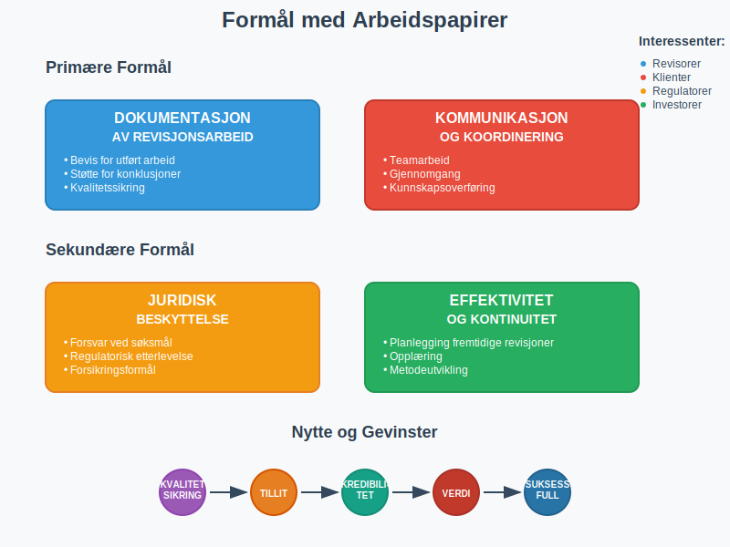

## Krav til Arbeidspapirer

### Lovmessige Krav

#### Revisorloven
Revisorloven stiller krav om at revisorer skal:
- **Dokumentere revisjonsarbeidet:** Tilstrekkelig dokumentasjon av alle vesentlige forhold
- **Oppbevare dokumenter:** Minimum 10 år etter avsluttet oppdrag
- **Sikre konfidensialitet:** Beskytte klientinformasjon

#### International Standards on Auditing (ISA)
ISA 230 "Revisjonsdokumentasjon" krever:
- **Tilstrekkelig dokumentasjon:** Må støtte revisjonsuttalelsen
- **Rettidig ferdigstillelse:** Innen 60 dager etter [revisjonsberetningens dato](/blogs/regnskap/hva-er-revisjonsberetning "Hva er Revisjonsberetning?")
- **Sporbarhet:** Klar sammenheng mellom arbeid og konklusjoner

### Kvalitetskrav

#### Klarhet og Forståelighet
- **Tydelig språk:** Enkelt å forstå for erfarne revisorer
- **Logisk struktur:** Systematisk oppbygning av dokumentasjonen
- **Fullstendighet:** Alle vesentlige forhold må være dokumentert

#### Sporbarhet og Referanser
- **Kryssreferanser:** Klare henvisninger mellom dokumenter
- **Kildehenvisninger:** Referanser til underliggende dokumenter
- **Konklusjonsspor:** Tydelig sammenheng mellom bevis og konklusjoner

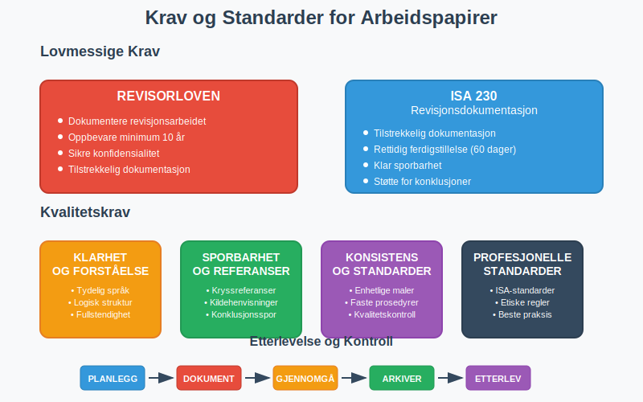

## Struktur og Organisering

### Hovedkategorier

#### Permanente Filer
Inneholder informasjon som er relevant over flere år:

| Kategori | Innhold | Eksempler |
|----------|---------|-----------|
| **Selskapsinfo** | Grunnleggende selskapsdata | Vedtekter, organisasjonskart, eierstruktur |
| **Avtaler** | Langsiktige kontrakter | Leieavtaler, låneavtaler, forsikringer |
| **Regnskapsrutiner** | [Interne kontrollsystemer](/blogs/regnskap/hva-er-internkontroll "Hva er Internkontroll? En Komplett Guide til Internkontroll i Norge") | Regnskapsmanualer, autorisasjonsmatriser |
| **Tidligere revisjoner** | Historisk informasjon | Tidligere års konklusjoner, påpekte forhold |

#### Løpende Filer
Inneholder informasjon spesifikk for inneværende års revisjon:

| Kategori | Innhold | Eksempler |
|----------|---------|-----------|
| **Planlegging** | Revisjonsplanlegging | Risikovurderinger, revisjonsstrategier |
| **Utførelse** | Revisjonshandlinger | Tester, analyser, bekreftelser |
| **Gjennomgang** | Kvalitetskontroll | Gjennomgangsnotater, oppfølging |
| **Avslutning** | Konklusjoner | Sammendrag, revisjonsuttalelse |

### Organisering av Arbeidspapirer

#### Numerisk System
- **Hovedseksjoner:** 100-serien (planlegging), 200-serien (utførelse)
- **Underseksjoner:** 110 (risikovurdering), 120 (revisjonsplan)
- **Individuelle papirer:** 110.1, 110.2, etc.

#### Alfabetisk System
- **A-serien:** Administrative forhold
- **B-serien:** Balanseposter
- **R-serien:** Resultatposter
- **S-serien:** Sammendrag og konklusjoner

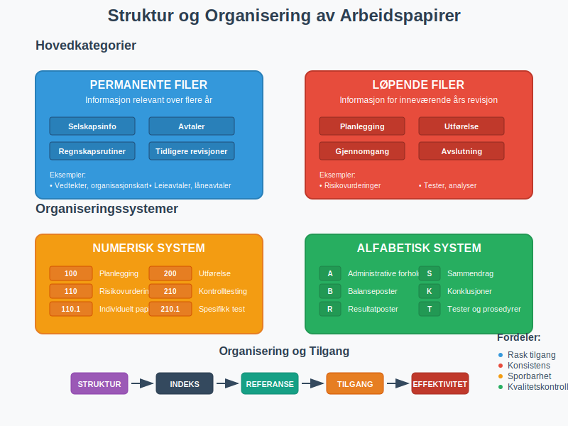

## Innhold i Arbeidspapirer

### Planleggingsdokumentasjon

#### Risikovurdering
- **Forretningsrisiko:** Analyse av klientens bransje og marked
- **Revisjonsrisiko:** Vurdering av risiko for vesentlig feilinformasjon
- **Kontrollrisiko:** Evaluering av interne kontroller
- **Oppdagelsesrisiko:** Planlagt nivå for substanstesting

#### Revisjonsplan
- **Revisjonsstrategier:** Tilnærming for hver regnskapsområde
- **Ressursallokering:** Tidsbudsjett og personalressurser
- **Tidsplan:** Milepæler og frister for revisjonsarbeidet
- **Spesialområder:** Planlegging for komplekse eller risikofylte områder

### Utførelsesdokumentasjon

#### Tester av Kontroller
- **Kontrollbeskrivelser:** Dokumentasjon av klientens kontroller
- **Testprosedyrer:** Detaljerte beskrivelser av utførte tester
- **Testresultater:** Funn og konklusjoner fra kontrolltesting
- **Avvik og oppfølging:** Identifiserte svakheter og korrigerende tiltak. Systematisk [avvikshåndtering](/blogs/regnskap/hva-er-avvikshåndtering "Hva er Avvikshåndtering i Regnskap? Prosess, Metoder og Beste Praksis") sikrer at alle avvik dokumenteres, analyseres og følges opp på en strukturert måte.

#### Substanstester
- **Utvalgsmetoder:** Beskrivelse av hvordan utvalg er foretatt
- **Testprosedyrer:** Detaljerte beskrivelser av substanstester
- **Testresultater:** Funn, avvik og konklusjoner
- **Ekstrapolering:** Vurdering av funnenes betydning for populasjonen

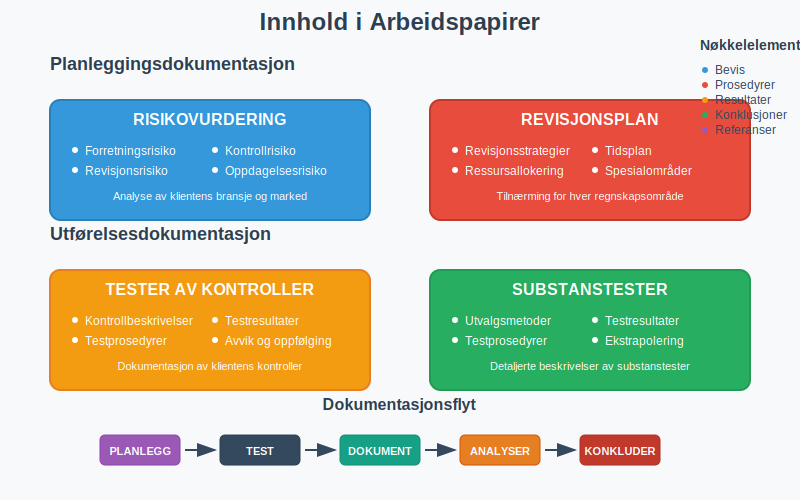

## Digitale Arbeidspapirer

### Fordeler med Digitalisering

#### Effektivitet
- **Automatisering:** Automatiske beregninger og sammenstillinger
- **Søkefunksjonalitet:** Rask tilgang til informasjon
- **Standardisering:** Konsistente maler og prosedyrer
- **Integrasjon:** Kobling til klientens systemer

#### Kvalitet
- **Konsistens:** Standardiserte arbeidsmetoder
- **Sporbarhet:** Automatisk logging av endringer
- **Gjennomgang:** Elektroniske gjennomgangsverktøy
- **Arkivering:** Sikker og strukturert oppbevaring

### Utfordringer og Løsninger

#### Tekniske Utfordringer
- **Systemkompatibilitet:** Sikre at systemer fungerer sammen
- **Datasikkerhet:** Beskytte sensitiv klientinformasjon
- **Backup og gjenoppretting:** Sikre mot datatap
- **Oppdateringer:** Holde systemer oppdaterte

#### Organisatoriske Utfordringer
- **Opplæring:** Sikre at personalet behersker systemene
- **Standarder:** Utvikle konsistente arbeidsmetoder
- **Kvalitetskontroll:** Opprettholde kvalitet i digitale prosesser
- **Endringsledelse:** Håndtere overgangen fra papirbaserte systemer

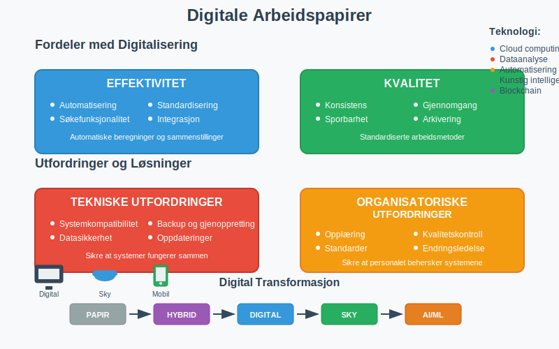

## Gjennomgang og Kvalitetskontroll

### Gjennomgangsprosess

#### Nivåer av Gjennomgang
1. **Selvgjennomgang:** Revisor gjennomgår eget arbeid
2. **Kollegagjennomgang:** Erfaren kollega gjennomgår arbeidet
3. **Partnergjennomgang:** Partner gjennomgår kritiske områder
4. **Kvalitetskontrollgjennomgang:** Uavhengig gjennomgang av høyrisikoklienter

#### Gjennomgangsfokus
- **Tilstrekkelighet:** Er dokumentasjonen tilstrekkelig?
- **Hensiktsmessighet:** Støtter dokumentasjonen konklusjonene?
- **Konsistens:** Er arbeidet konsistent med revisjonsplanen?
- **Standarder:** Er profesjonelle standarder fulgt?

### Kvalitetsindikatorer

#### Kvantitative Mål
- **Dokumentasjonsgrad:** Andel av planlagte prosedyrer som er dokumentert
- **Gjennomgangstid:** Tid brukt på gjennomgang av arbeidspapirer
- **Avviksrate:** Antall identifiserte mangler eller feil
- **Ferdigstillelsestid:** Tid fra revisjonsavslutning til ferdig dokumentasjon

#### Kvalitative Vurderinger
- **Klarhet:** Er dokumentasjonen klar og forståelig?
- **Relevans:** Er dokumentasjonen relevant for konklusjonene?
- **Objektivitet:** Er vurderingene objektive og balanserte?
- **Profesjonalitet:** Oppfyller dokumentasjonen profesjonelle standarder?

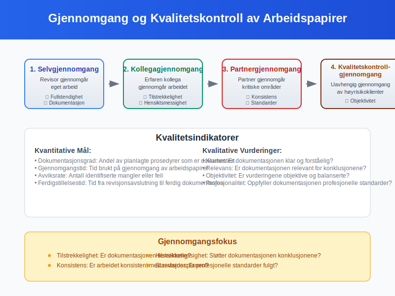

## Oppbevaring og Arkivering

### Oppbevaringsperiode

#### Lovmessige Krav
- **Minimum 10 år:** Krav i henhold til revisorloven
- **Regnskapsår + 10:** Regnes fra regnskapsårets slutt
- **Spesielle forhold:** Lengre oppbevaring ved tvister eller undersøkelser
- **Elektronisk arkivering:** Samme krav som for fysiske dokumenter

#### Praktiske Hensyn
- **Tilgjengelighet:** Sikre at dokumenter kan hentes frem ved behov
- **Lesbarhet:** Opprettholde dokumentenes lesbarhet over tid
- **Sikkerhet:** Beskytte mot tap, skade eller uautorisert tilgang
- **Kostnader:** Balansere oppbevaringskostnader mot nytte

### Arkiveringssystemer

#### Fysisk Arkivering
- **Organisering:** Systematisk filing og merking
- **Lagring:** Sikre og tørre oppbevaringsforhold
- **Tilgangskontroll:** Begrense tilgang til autorisert personell
- **Kassasjon:** Sikker destruksjon etter oppbevaringsperioden

#### Elektronisk Arkivering
- **Filformater:** Bruk av standardiserte og holdbare formater
- **Metadata:** Systematisk registrering av dokumentegenskaper
- **Backup:** Regelmessig sikkerhetskopi til separate lokasjoner
- **Migrering:** Overføring til nye systemer ved teknologiskifte

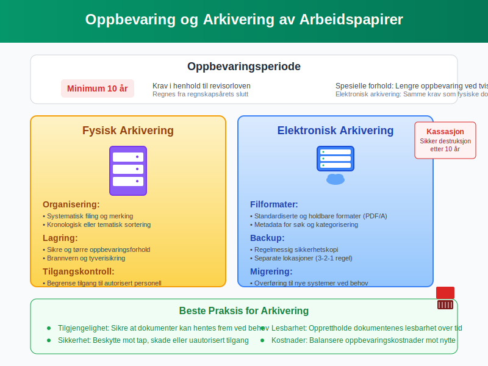

## Beste Praksis

### For Revisorer

#### Under Revisjonsarbeidet
- **Dokumenter løpende:** Ikke vent til slutten med dokumentasjon
- **Vær spesifikk:** Beskriv nøyaktig hva som er gjort og hvorfor
- **Bruk standarder:** Følg etablerte maler og prosedyrer
- **Kryssreferanser:** Sikre klar sammenheng mellom dokumenter

#### Ved Gjennomgang
- **Vær kritisk:** Still spørsmål ved ufullstendig dokumentasjon
- **Fokuser på risiko:** Prioriter gjennomgang av høyrisikoområder
- **Dokumenter gjennomgang:** Registrer gjennomgangsnotater og oppfølging
- **Følg opp:** Sikre at identifiserte mangler blir rettet

### For Bedrifter som Revideres

#### Forberedelse til Revisjon
- **Organiser dokumenter:** Ha dokumentasjon klar og tilgjengelig
- **Beskriv prosesser:** Dokumenter regnskaps- og kontrollprosesser
- **Identifiser endringer:** Informer om vesentlige endringer siden forrige år
- **Tilgjengelig personell:** Sikre at nøkkelpersoner er tilgjengelige

#### Under Revisjonen
- **Samarbeid aktivt:** Gi rask tilgang til forespurt informasjon
- **Vær åpen:** Diskuter utfordringer og bekymringer åpent
- **Følg opp:** Implementer anbefalte forbedringer
- **Lær:** Bruk revisjonen som en læringsmulighet

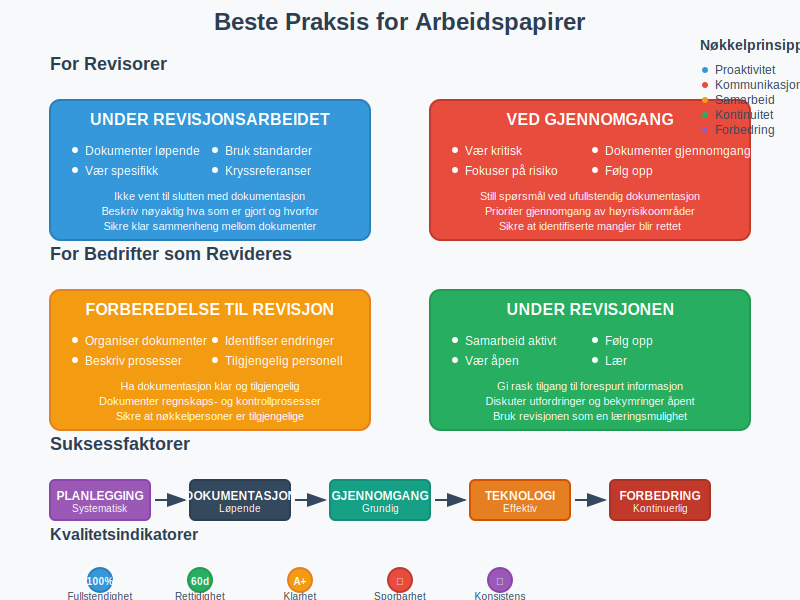

## Utfordringer og Løsninger

### Vanlige Utfordringer

#### Tidsmangel
- **Problem:** Ikke nok tid til grundig dokumentasjon
- **Løsning:** Planlegg dokumentasjon som del av revisjonsarbeidet
- **Verktøy:** Bruk standardiserte maler og automatisering
- **Kultur:** Skape forståelse for dokumentasjonens viktighet

#### Kompleksitet
- **Problem:** Vanskelig å dokumentere komplekse vurderinger
- **Løsning:** Bryt ned komplekse områder i mindre deler
- **Struktur:** Bruk systematiske tilnærminger og rammeverk
- **Ekspertise:** Involver spesialister ved behov

#### Teknologi
- **Problem:** Utfordringer med digitale verktøy og systemer
- **Løsning:** Invester i opplæring og teknisk støtte
- **Standarder:** Etabler klare retningslinjer for teknologibruk
- **Oppgradering:** Hold systemer oppdaterte og funksjonelle

### Fremtidige Utviklingstrender

#### Kunstig Intelligens
- **Automatisering:** AI kan automatisere rutineoppgaver i dokumentasjon
- **Analyse:** Maskinlæring kan identifisere mønstre og avvik
- **Kvalitet:** AI kan bidra til konsistent dokumentasjonskvalitet
- **Utfordringer:** Behov for menneskelig vurdering og kontroll

#### Dataanalyse
- **Store datamengder:** Mulighet for analyse av komplette datasett
- **Visualisering:** Bedre presentasjon av analyseresultater
- **Kontinuerlig revisjon:** Mulighet for løpende overvåking
- **Kompetanse:** Behov for nye ferdigheter hos revisorer

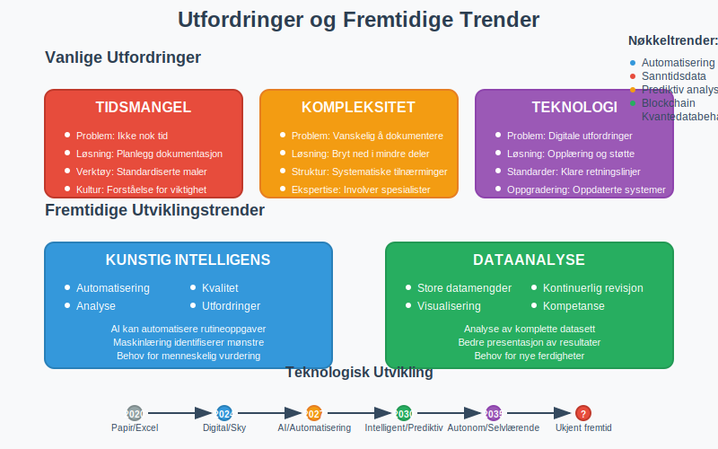

## Konklusjon

Arbeidspapirer i revisjon er **fundamentet** for kvalitetsrevisjon og profesjonell praksis. De sikrer at revisjonsarbeidet er:

- **Dokumentert:** Tilstrekkelig bevis for konklusjoner
- **Sporbart:** Klar sammenheng mellom arbeid og uttalelser  
- **Kvalitetssikret:** Grunnlag for gjennomgang og kontroll
- **Forsvarlig:** Beskyttelse mot juridiske og profesjonelle risikoer

**Suksessfaktorer** for gode arbeidspapirer:
- Systematisk tilnærming og konsistent struktur
- Løpende dokumentasjon under revisjonsarbeidet
- Grundig gjennomgang og kvalitetskontroll
- Effektiv bruk av teknologi og digitale verktøy
- Kontinuerlig forbedring av prosesser og metoder

Ved å følge etablerte standarder og beste praksis kan revisorer sikre at arbeidspapirene oppfyller sitt formål som grunnlag for pålitelige revisjonsuttalelser og bidrar til tilliten til [regnskapsrapportering](/blogs/regnskap/hva-er-regnskap "Hva er Regnskap? En komplett guide") i norsk næringsliv.

