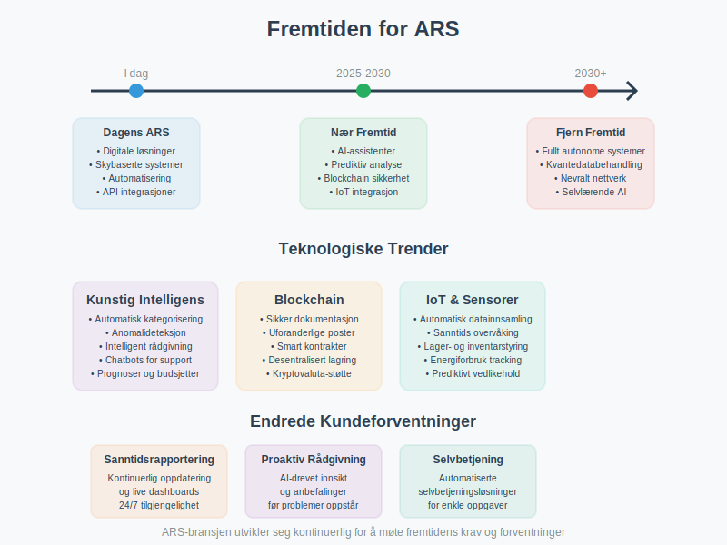

Et **ARS (Autorisert Regnskapsførerselskap)** er et regnskapsfirma som har fått offisiell autorisasjon fra Finanstilsynet til å utføre regnskapsførertjenester i Norge. Autorisasjonen sikrer at selskapet oppfyller strenge krav til kompetanse, kvalitet og etikk, og gir bedrifter trygghet for at deres [regnskap](/blogs/regnskap/hva-er-regnskap "Hva er Regnskap? En Komplett Guide til Regnskapsføring") håndteres av kvalifiserte fagpersoner.

## Hva betyr ARS-autorisasjon?

ARS-autorisasjonen er en kvalitetssikring som viser at regnskapsfirmaet oppfyller Finanstilsynets krav til faglig kompetanse, organisering og kvalitetssikring. Dette gir bedrifter en garanti for at deres regnskapsførsel utføres i henhold til gjeldende lover og forskrifter.

### Forskjellen mellom ARS og vanlige regnskapsfirmaer

| Aspekt | ARS (Autorisert) | Vanlig regnskapsfirma |
|--------|------------------|----------------------|
| **Autorisasjon** | Godkjent av Finanstilsynet | Ingen offisiell godkjenning |
| **Kompetansekrav** | Dokumentert fagkompetanse | Varierende kompetanse |
| **Kvalitetssikring** | Obligatorisk kvalitetssystem | Frivillig |
| **Tilsyn** | Underlagt Finanstilsynets kontroll | Ingen ekstern kontroll |
| **Ansvarsforsikring** | Obligatorisk | Frivillig |
| **Etiske retningslinjer** | Må følge strenge etiske krav | Varierende standarder |

## Krav for ARS-autorisasjon

For å oppnå ARS-autorisasjon må regnskapsfirmaet oppfylle en rekke strenge krav som sikrer høy kvalitet på tjenestene.

### Faglige krav

* **Daglig leder** må være autorisert regnskapsfører eller statsautorisert revisor
* **Minimum 50% av de ansatte** som utfører regnskapsførertjenester må være autoriserte regnskapsførere
* **Kontinuerlig kompetanseutvikling** gjennom obligatorisk etterutdanning
* **Dokumentert erfaring** innen regnskapsføring og relaterte områder

### Organisatoriske krav

* **Kvalitetssikringssystem** som sikrer korrekt utførelse av oppdrag
* **Internkontrollsystem** for å forebygge feil og mangler
* **Rutiner for håndtering** av kundemidler og sensitive opplysninger
* **Forsvarlig organisering** av virksomheten

### Økonomiske krav

* **Ansvarsforsikring** på minimum 5 millioner kroner per skadetilfelle
* **Økonomisk soliditet** som sikrer kontinuitet i tjenesteyting
* **Separate kontoer** for kundemidler

## Fordeler ved å velge et ARS

Å velge et autorisert regnskapsførerselskap gir flere konkrete fordeler for din bedrift.

### Kvalitetsgaranti

* **Faglig kompetanse:** Garantert høy faglig standard
* **Oppdatert kunnskap:** Kontinuerlig oppdatering på regelverksendringer
* **Kvalitetssikring:** Systematisk kontroll av alle leveranser
* **Etisk standard:** Høye etiske krav til alle ansatte

### Juridisk trygghet

* **Ansvarsforsikring:** Økonomisk beskyttelse ved feil
* **Tilsynsmyndighet:** Finanstilsynet fører kontroll
* **Klageadgang:** Mulighet for klage til Finanstilsynet
* **Lovpålagt taushetsplikt:** Streng beskyttelse av sensitive opplysninger

### Tjenestekvalitet

* **Helhetlig rådgivning:** Kompetanse innen [aksjeselskap](/blogs/regnskap/hva-er-et-aksjeselskap "Hva er et Aksjeselskap? En Komplett Guide"), [MVA](/blogs/regnskap/hva-er-regnskap "Hva er Regnskap? En Komplett Guide til Regnskapsføring") og skatterett
* **Digitale løsninger:** Moderne verktøy og systemer
* **Proaktiv rådgivning:** Forebyggende råd og veiledning
* **Tilgjengelighet:** Dedikerte kontaktpersoner

## ARS sine ansvarsområder

Et autorisert regnskapsførerselskap har omfattende ansvar overfor sine klienter og samfunnet.

### Faglig ansvar

* **Korrekt regnskapsføring** i henhold til [regnskapsloven](/blogs/regnskap/hva-er-regnskap "Hva er Regnskap? En Komplett Guide til Regnskapsføring")
* **Riktig MVA-behandling** og innrapportering
* **Korrekt lønnsbehandling** og [a-melding](/blogs/regnskap/hva-er-a-melding "Hva er A-melding? En Komplett Guide")
* **Ã…rsregnskapsutarbeidelse** og rapportering til offentlige myndigheter

### RÃ¥dgivningsansvar

* **Proaktiv rådgivning** om skatteoptimalisering
* **Veiledning** ved etablering av [aksjeselskap](/blogs/regnskap/hva-er-et-aksjeselskap "Hva er et Aksjeselskap? En Komplett Guide")
* **Støtte** ved fusjon, fisjon og andre omorganiseringer
* **Hjelp** med finansiering og [aksjekapital](/blogs/regnskap/hva-er-aksjekapital "Hva er Aksjekapital? En Komplett Guide")

### Etisk ansvar

* **Uavhengighet** i rådgivning og tjenesteyting
* **Konfidensialitet** i håndtering av klientopplysninger
* **Integritet** i alle forretningsforhold
* **Objektivitet** i faglige vurderinger

## Hvordan velge riktig ARS

Valg av regnskapsførerselskap er en viktig beslutning som påvirker din bedrifts økonomi og compliance.

### Evalueringskriterier

| Kriterium | Hva du bør vurdere |
|-----------|-------------------|
| **Bransjeerfaring** | Erfaring med din type virksomhet |
| **Tjenestespekter** | Dekker alle dine behov |
| **Teknologi** | Moderne digitale løsninger |
| **Kommunikasjon** | Tilgjengelighet og responstid |
| **Pris** | Transparent og konkurransedyktig prissetting |
| **Referanser** | Anbefalinger fra andre klienter |

### Spørsmål å stille

* Hvilken erfaring har dere med min bransje?
* Hvordan håndterer dere [fakturaer](/blogs/regnskap/hva-er-en-faktura "Hva er en Faktura? En Guide til Norske Fakturakrav") og betalinger?
* Hvilke digitale løsninger tilbyr dere?
* Hvordan sikrer dere kvalitet i leveransene?
* Hva inkluderer deres ansvarsforsikring?
* Hvordan håndterer dere endringer i regelverk?

### Red flags å unngå

* Manglende ARS-autorisasjon
* Uklare prisavtaler
* DÃ¥rlig kommunikasjon
* Manglende bransjeerfaring
* Ingen kvalitetssikringssystem
* Utdaterte teknologiske løsninger

## ARS og digitalisering

Moderne ARS-selskaper benytter avanserte digitale løsninger for å effektivisere regnskapsføringen og gi bedre service til sine klienter.

### Teknologiske løsninger

* **Skybaserte regnskapssystemer** for sanntidsrapportering
* **Automatisk bilagsbehandling** med [OCR-teknologi](/blogs/regnskap/hva-er-ocr "Hva er OCR? OCR i Norske Regnskapsprosesser “ En Komplett Guide")
* **Integrerte løsninger** med bank og [Altinn](/blogs/regnskap/hva-er-altinn "Hva er Altinn? En Komplett Guide til Norges Digitale Forvaltning")
* **Mobile apper** for enkel bilagsregistrering
* **Dashboards** for økonomisk oversikt
* **[ERP-systemer](/blogs/regnskap/hva-er-erp-system "Hva er ERP-system? Komplett Guide til Enterprise Resource Planning")** for helhetlig forretningsintegrasjon

### Fordeler med digitalisering

* **Økt effektivitet** i regnskapsføringen
* **Redusert feilrisiko** gjennom automatisering
* **Bedre oversikt** over økonomien
* **Raskere rapportering** til myndigheter
* **Miljøvennlig** med mindre papirbruk

## Kostnader ved ARS-tjenester

Kostnadene for ARS-tjenester varierer basert på bedriftens størrelse, kompleksitet og tjenestebehov.

### Typiske prismodeller

| Prismodell | Beskrivelse | Egnet for |
|------------|-------------|-----------|
| **Fast månedspris** | Forutsigbar kostnad | Stabile virksomheter |
| **Timepris** | Betaling per arbeidet time | Varierende behov |
| **Transaksjonspris** | Pris per bilag/transaksjon | Høyt transaksjonsvolum |
| **Pakkeløsninger** | Kombinerte tjenester | Helhetlige behov |

### Faktorer som påvirker prisen

* **Bedriftsstørrelse** og omsetning
* **Antall transaksjoner** per måned
* **Kompleksitet** i regnskapet
* **Tilleggstjenester** som lønnskjøring og rådgivning
* **Digitalisering** av prosesser
* **Bransje** og spesielle krav

## Fremtiden for ARS

ARS-bransjen er i kontinuerlig utvikling, drevet av teknologiske fremskritt og endrede kundebehov.

### Teknologiske trender

* **Kunstig intelligens** for automatisert kategorisering
* **Maskinlæring** for anomalideteksjon
* **Blockchain** for sikker dokumentasjon
* **API-integrasjoner** med flere systemer
* **Prediktiv analyse** for bedre prognoser

### Endrede kundeforventninger

* **Sanntidsrapportering** og kontinuerlig oppdatering
* **Proaktiv rådgivning** basert på data
* **Selvbetjeningsløsninger** for enkle oppgaver
* **Mobiloptimaliserte** løsninger
* **Bærekraftige** og miljøvennlige prosesser

## Konklusjon

Et **ARS (Autorisert Regnskapsførerselskap)** representerer den høyeste standarden innen regnskapsførertjenester i Norge. Gjennom strenge autorisasjonskrav sikrer Finanstilsynet at disse selskapene leverer tjenester av høy kvalitet, med nødvendig fagkompetanse og etisk standard.

For bedrifter som ønsker trygghet, kvalitet og profesjonell håndtering av sitt [regnskap](/blogs/regnskap/hva-er-regnskap "Hva er Regnskap? En Komplett Guide til Regnskapsføring"), er valg av et ARS en investering i langsiktig økonomisk helse og compliance. Den ekstra kostnaden oppveies ofte av redusert risiko, bedre rådgivning og økt effektivitet i regnskapsføringen.

Ved valg av ARS bør du vurdere selskapets bransjeerfaring, teknologiske løsninger, kommunikasjon og prismodell for å finne den beste partneren for din virksomhets behov.

