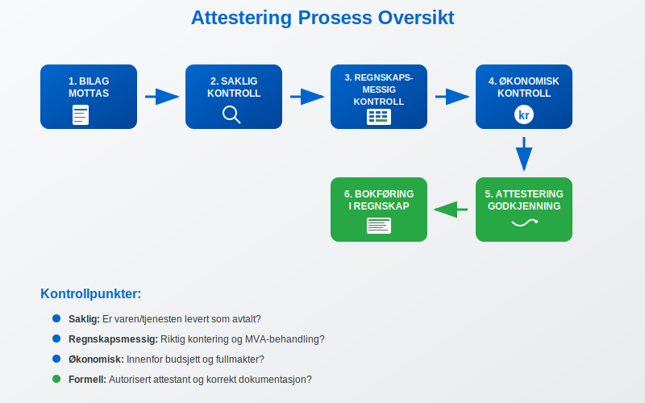
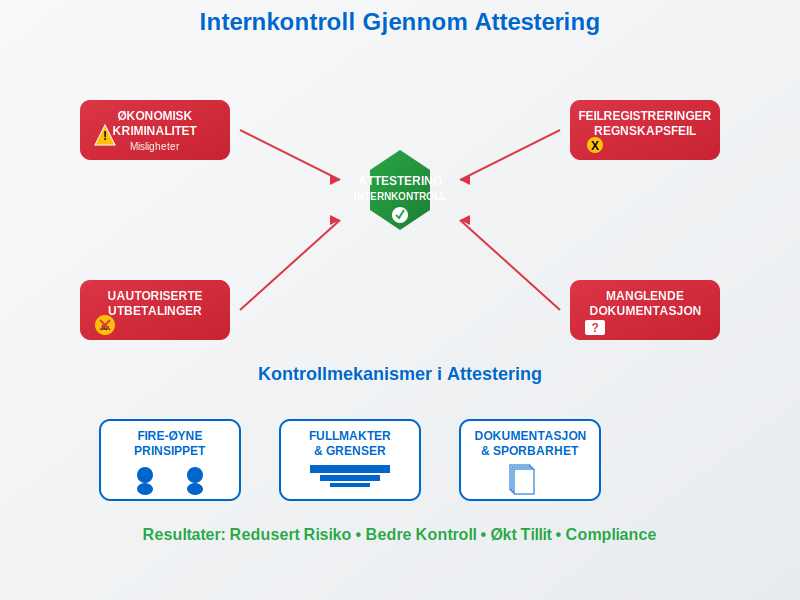
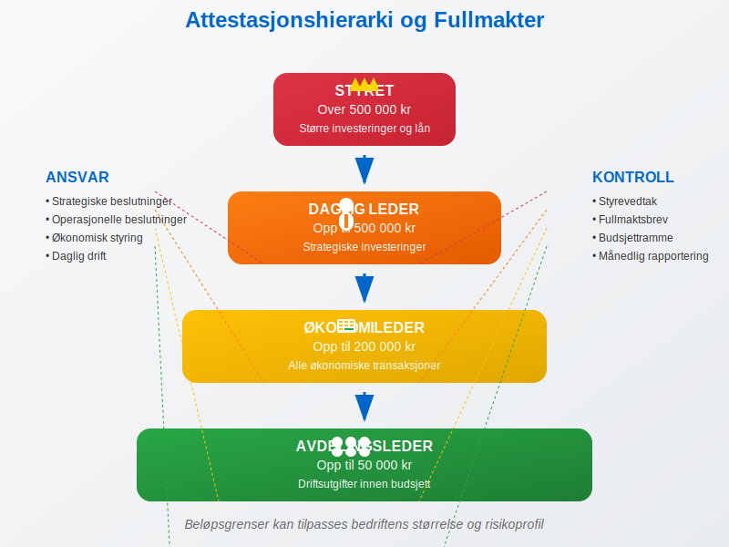
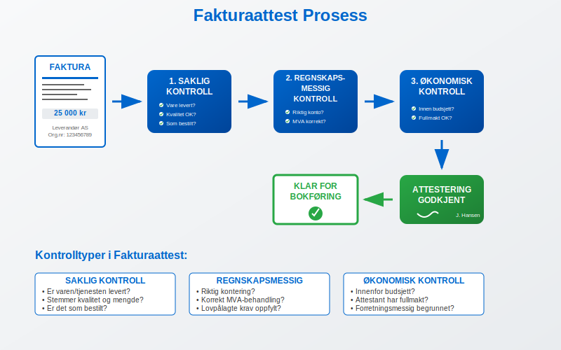
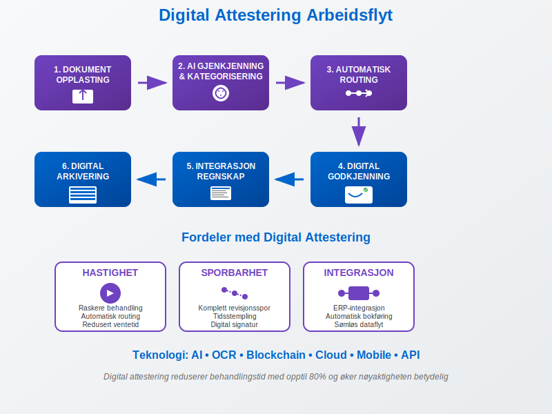
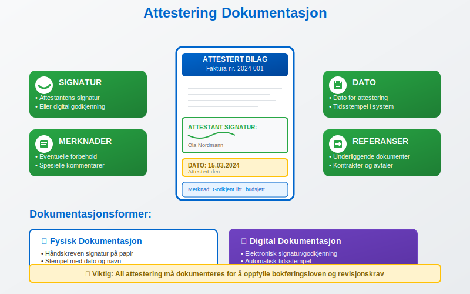
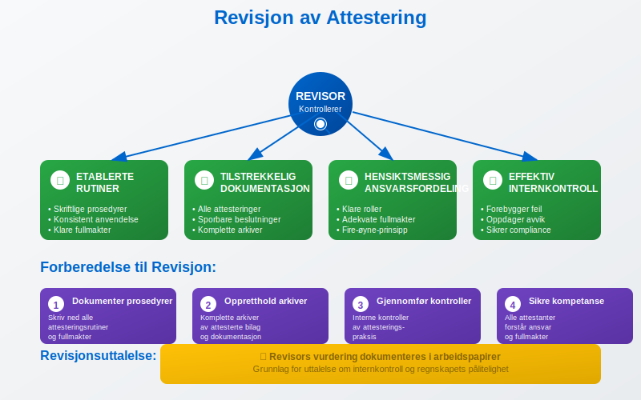
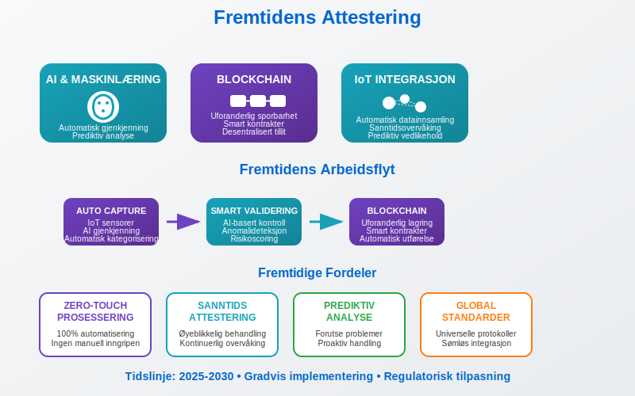

---
title: "Hva er attestering?"
meta_title: "Hva er attestering?"
meta_description: '**Attestering** er en kritisk internkontrollprosess hvor autoriserte personer godkjenner og bekrefter at bilag, fakturaer og andre regnskapsdokumenter er korrek...'
slug: hva-er-attestering
type: blog
layout: pages/single
---

**Attestering** er en kritisk internkontrollprosess hvor autoriserte personer godkjenner og bekrefter at bilag, fakturaer og andre regnskapsdokumenter er korrekte, lovlige og i samsvar med bedriftens retningslinjer før de bokføres. Attestering sikrer at alle økonomiske transaksjoner er dokumentert, godkjent og sporbare. Effektiv attestering forutsetter systematisk [bilagsmottak](/blogs/regnskap/hva-er-bilagsmottak "Bilagsmottak - Komplett Guide til Dokumentmottak og Fakturabehandling") som grunnlag for korrekt dokumenthåndtering, og er en sentral komponent i [QA (Quality Assurance)](/blogs/regnskap/hva-er-qa-kvalitetssikring "Hva er QA (Quality Assurance) i Regnskap? Komplett Guide til Kvalitetssikring") for å sikre kvalitetssikring av regnskapsprosesser.

## Hva er Attestering?

Attestering er en formell godkjenningsprosess som innebærer at en autorisert person bekrefter at:

* Bilaget er **ekte og korrekt**
* Transaksjonen er **forretningsmessig begrunnet**
* Beløpet stemmer overens med **avtaler og kontrakter**
* Alle nødvendige **dokumenter er vedlagt**
* Transaksjonen er i henhold til **budsjett og [fullmakter](/blogs/regnskap/fullmakt "Fullmakt i Regnskap: Guide til Autorisasjon og Signatur i Norsk Regnskap")**

### Juridisk Grunnlag

Attestering er forankret i [**bokføringsloven**](/blogs/regnskap/hva-er-bokforingsloven "Hva er Bokføringsloven? Komplett Guide til Norsk Bokføringslovgivning") og **regnskapsloven**, som krever at alle regnskapsbilag skal være dokumentert og sporbare. Bedrifter må kunne vise til en klar **godkjenningskjede** for alle økonomiske transaksjoner.

## Attestering som Internkontroll

Attestering fungerer som et **[internkontrollverktøy](/blogs/regnskap/hva-er-internkontroll "Hva er Internkontroll? En Komplett Guide til Internkontroll i Norge")** som beskytter bedriften mot:

* **Økonomisk kriminalitet** og misligheter
* **Feilregistreringer** og regnskapsfeil  
* **Uautoriserte utbetalinger**
* **Manglende dokumentasjon**

Når avvik oppdages i attesteringsprosessen, er det viktig å ha etablerte rutiner for [avvikshåndtering](/blogs/regnskap/hva-er-avvikshåndtering "Hva er Avvikshåndtering i Regnskap? Prosess, Metoder og Beste Praksis") som sikrer systematisk identifisering, analyse og korrigering av feilene.

### Fire-øyne-prinsippet

Mange bedrifter følger **fire-øyne-prinsippet**, hvor minst to personer må være involvert i godkjenningsprosessen:

1. **Bestiller/Mottaker** - bekrefter levering og kvalitet
2. **Attestant** - godkjenner betaling og bokføring

## Roller og Ansvar i Attesteringsprosessen

### Attestanter og Fullmakter

Bedrifter må etablere klare **attestasjonsregler** som definerer:

| Rolle | Attestasjonsgrense | Ansvar |
|-------|-------------------|---------|
| Avdelingsleder | Opp til 50 000 kr | Driftsutgifter innen budsjett |
| Økonomileder | Opp til 200 000 kr | Alle økonomiske transaksjoner |
| Daglig leder | Opp til 500 000 kr | Strategiske investeringer |
| Styret | Over 500 000 kr | Større investeringer og lån |

### Ansvarsfordeling

**Bestiller** har ansvar for:

* Ã… sikre at varen/tjenesten er levert som avtalt
* Kontrollere at [fakturaen](/blogs/regnskap/hva-er-en-faktura "Hva er en Faktura? En Guide til Norske Fakturakrav") stemmer med bestilling
* Bekrefte at leveransen er i henhold til kontrakt

**Attestant** har ansvar for:

* Kontrollere at transaksjonen er innenfor budsjett
* Verifisere at alle nødvendige dokumenter foreligger
* Sikre at utbetalingen er i henhold til fullmakter
* Godkjenne bokføring på riktig konto

## Typer Attestering

### 1. Fakturaattest

Den vanligste formen for attestering gjelder [fakturaer](/blogs/regnskap/hva-er-en-faktura "Hva er en Faktura? En Guide til Norske Fakturakrav") og innkjøpsbilag. For en detaljert gjennomgang av hele prosessen for **[inngående fakturaer](/blogs/regnskap/innganende-faktura "Inngående Faktura - Komplett Guide til Mottak og Behandling av Leverandørfakturaer")** fra mottak til betaling, inkludert attestering og kontrollrutiner, se vår omfattende guide.

* **Saklig kontroll** - er varen/tjenesten levert?
* **Regnskapsmessig kontroll** - riktig kontering og MVA-behandling
* **Økonomisk kontroll** - innenfor budsjett og fullmakter?

### 2. Lønnsattest

For lønn og personalutgifter kreves spesiell attestering, inkludert særlig oppmerksomhet ved **[tungt salær](/blogs/regnskap/hva-er-tungt-salaer "Hva er Tungt Salær? Guide til Betydelige Honorarer og Vederlag")** hvor høye beløp krever forsterket kontroll og dokumentasjon:

* Kontroll av **timeregistreringer**
* Godkjenning av **overtid og tillegg**
* Verifisering av **fravær og permisjon**
* Attestering av **reiseregninger**

### 3. Bankattest

For bankutbetalinger og overføringer:

* Kontroll av **mottakerinformasjon**
* Verifisering av **beløp og valuta**
* Godkjenning av **betalingsformål**
* Sikring av **dobbel signatur** ved store beløp

## Digitale Attesteringsløsninger

Moderne bedrifter bruker ofte **digitale attesteringssystemer** som automatiserer prosessen:

### Fordeler med Digital Attestering

* **Automatisk routing** til riktig attestant
* **Digital sporbarhet** og revisjonsspor
* **Raskere behandling** av [bilag](/blogs/regnskap/hva-er-bilag "Hva er Bilag i Regnskap? Komplett Guide til Regnskapsbilag og Dokumentasjon")
* **Redusert papirbruk** og arkivering
* **Integrert med regnskapssystem**

### Integrasjon med Regnskapssystem

Digitale løsninger kan integreres med:

* **ERP-systemer** for automatisk kontering
* **Bankintegrasjon** for betalingsutførelse  
* **Arkivsystemer** for dokumentlagring
* **Rapporteringsverktøy** for oppfølging

## Beste Praksis for Attestering

### Etablering av Attesteringsrutiner

1. **Definer klare fullmakter** og attestasjonsgrenser
2. **Opprett skriftlige prosedyrer** for attestering
3. **Implementer fire-øyne-prinsippet** hvor det er hensiktsmessig
4. **Sørg for regelmessig opplæring** av attestanter
5. **Gjennomfør periodiske kontroller** av attesteringspraksis
6. **Integrer attestering** i [dagsoppgjør](/blogs/regnskap/hva-er-dagsoppgjør "Hva er Dagsoppgjør i Regnskap? Prosess, Rutiner og Beste Praksis") rutiner

### Dokumentasjonskrav

Alle attesteringer må dokumenteres med:

* **Attestantens signatur** eller digitale godkjenning
* **Dato for attestering**
* **Eventuelle merknader** eller forbehold
* **Referanse til underliggende dokumenter**

## Vanlige Utfordringer og Løsninger

### Utfordring 1: Manglende Kompetanse

**Problem:** Attestanter mangler kunnskap om regnskapsregler

**Løsning:** 
* Regelmessig opplæring i [regnskapsføring](/blogs/regnskap/hva-er-regnskap "Hva er Regnskap? En Komplett Guide til Norsk Regnskapsføring")
* Klare retningslinjer og sjekklister
* Støtte fra økonomiavdelingen

### Utfordring 2: Tidspress og Forsinkelser

**Problem:** Attestering forsinker betalinger og leverandørforhold

**Løsning:**
* Digitale attesteringsløsninger
* Klare frister for attestering
* Stedfortredere ved fravær

### Utfordring 3: Manglende Sporbarhet

**Problem:** Vanskelig å spore hvem som har attestert hva

**Løsning:**
* Digital attestering med automatisk logging
* Systematisk arkivering av attesterte [bilag](/blogs/regnskap/hva-er-bilag "Hva er Bilag i Regnskap? Komplett Guide til Regnskapsbilag og Dokumentasjon")
* Regelmessige revisjoner av attesteringspraksis

## Attestering og Revisjon

### Revisors Kontroll

Revisor vil kontrollere at bedriften har:

* **Etablerte attesteringsrutiner** som følges konsekvent
* **Tilstrekkelig dokumentasjon** av alle attesteringer
* **Hensiktsmessig ansvarsfordeling** og fullmakter
* **Effektiv internkontroll** gjennom attesteringsprosessen

Revisors vurdering av attesteringsprosessene dokumenteres i [arbeidspapirer](/blogs/regnskap/hva-er-arbeidspapirer-revisjon "Hva er Arbeidspapirer i Revisjon? Komplett Guide til Revisjonsdokumentasjon"), som utgjør grunnlaget for revisjonsuttalelsen om internkontrollen.

### Forberedelse til Revisjon

For å være godt forberedt til revisjon bør bedriften:

* Dokumentere alle **attesteringsprosedyrer**
* Opprettholde **komplette arkiver** av attesterte [bilag](/blogs/regnskap/hva-er-bilag "Hva er Bilag i Regnskap? Komplett Guide til Regnskapsbilag og Dokumentasjon")
* Gjennomføre **interne kontroller** av attesteringspraksis
* Sikre at alle attestanter forstår sitt **ansvar og fullmakter**

## Attestering i Ulike Bedriftstyper

### Små Bedrifter

I mindre bedrifter kan attestering være enklere, men like viktig:

* **Daglig leder** attesterer ofte alle større utgifter
* **Ekstern regnskapsfører** kan bistå med kontroller
* **Enkle digitale løsninger** kan effektivisere prosessen

### Store Bedrifter

Større organisasjoner krever mer komplekse attesteringsstrukturer:

* **Hierarkiske fullmakter** med flere nivåer
* **Spesialiserte attestanter** for ulike områder
* **Avanserte ERP-systemer** med innebygd attestering
* **Dedikerte internkontrollfunksjoner**

## Fremtiden for Attestering

### Automatisering og AI

Teknologisk utvikling påvirker attesteringsprosesser:

* **Automatisk gjenkjenning** av bilagstyper
* **AI-basert kontroll** av bilagsinnhold
* **Maskinlæring** for å identifisere avvik
* **Blockchain** for uforanderlig sporbarhet

### Regulatoriske Endringer

Nye krav kan påvirke attestering:

* **Økt digitalisering** av offentlige rapporter
* **Strengere krav** til internkontroll
* **Standardisering** av attesteringsprosesser
* **Integrerte løsninger** med [Altinn](/blogs/regnskap/hva-er-altinn "Hva er Altinn? En Komplett Guide til Norges Digitale Forvaltningsplattform")

## Konklusjon

Attestering er en **fundamental internkontrollprosess** som sikrer korrekt og lovlig behandling av alle økonomiske transaksjoner. Ved å etablere klare rutiner, bruke moderne teknologi og sikre kompetent personell, kan bedrifter oppnå:

* **Redusert risiko** for feil og misligheter
* **Bedre økonomisk kontroll** og oversikt
* **Effektive prosesser** som støtter forretningsdriften
* **Trygghet** for at regnskapet er korrekt og revisjonssikkert

God attesteringspraksis er ikke bare et lovkrav, men en **strategisk fordel** som bidrar til bedre økonomistyring og økt tillit fra interessenter, investorer og myndigheter.

