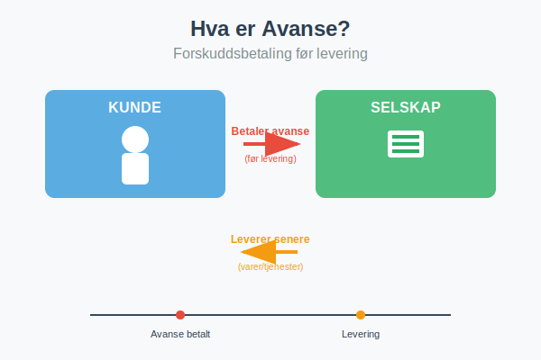
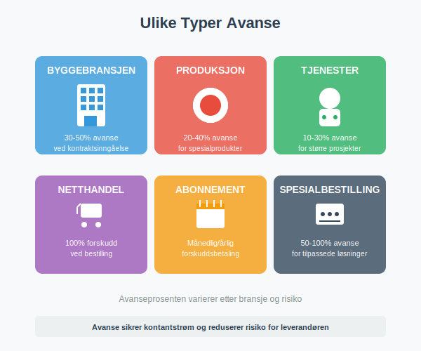
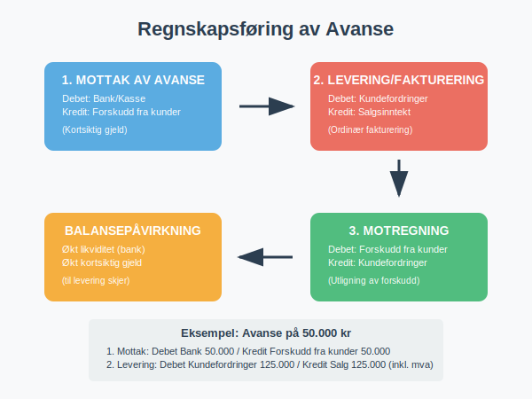

---
title: "Hva er Avanse?"
meta_title: "Hva er Avanse?"
meta_description: '**Avanse** er en forskuddsbetaling som kunden betaler til leverandøren før varer eller tjenester leveres. Dette er en vanlig forretningspraksis som sikrer kon...'
slug: hva-er-avanse
type: blog
layout: pages/single
---

**Avanse** er en forskuddsbetaling som kunden betaler til leverandøren før varer eller tjenester leveres. Dette er en vanlig forretningspraksis som sikrer kontantstrøm for leverandøren og reduserer risiko ved større prosjekter eller spesialbestillinger.



### Hva er Avanse?

Avanse, også kalt **forskuddsbetaling** eller **depositum**, er et beløp som kunden betaler på forhånd før leverandøren har levert varene eller utført tjenestene. Dette skiller seg fra ordinær [fakturering](/blogs/regnskap/hva-er-en-faktura "Hva er en Faktura? En Guide til Norske Fakturakrav") hvor betaling skjer etter levering.

Avanse brukes særlig når:

* **Leveringstiden er lang:** Som i byggebransjen eller ved produksjon av spesialtilpassede produkter
* **Investeringskostnadene er høye:** Leverandøren trenger kapital til å kjøpe materialer eller starte produksjon
* **Kunden er ukjent:** For å redusere kredittrisiko ved nye kunder
* **Prosjektet er stort:** Ved omfattende prosjekter som krever betydelige ressurser

### Ulike Typer Avanse

Avansepraksis varierer betydelig mellom bransjer og typer av transaksjoner:



#### Bransjespesifikke Avanseprosenter

| Bransje | Typisk Avanseprosent | Begrunnelse |
|---------|---------------------|-------------|
| **Byggebransjen** | 30-50% | Høye materialkostnader og lang byggetid |
| **Produksjon** | 20-40% | Spesialtilpassede produkter og råvarekostnader |
| **Tjenester** | 10-30% | Større prosjekter med betydelig tidsbruk |
| **Netthandel** | 100% | Betaling ved bestilling før forsendelse |
| **Abonnement** | 100% | Månedlig eller årlig forskuddsbetaling |
| **Spesialbestilling** | 50-100% | Høy risiko og tilpassede løsninger |

### Fordeler med Avanse

#### For Leverandøren (Selgeren)

**Økonomiske fordeler:**
* **Forbedret kontantstrøm:** Penger kommer inn før utgifter til produksjon
* **Redusert kredittrisiko:** Mindre risiko for tap ved kundens betalingssvikt
* **Finansiering av prosjektet:** Kundens penger finansierer deler av produksjonen
* **Lavere finansieringskostnader:** Mindre behov for [arbeidskapital](/blogs/regnskap/hva-er-arbeidskapital "Hva er Arbeidskapital? Beregning og Betydning") fra bank

**Operasjonelle fordeler:**
* **Sikret kundeengasjement:** Kunden er mer forpliktet til kjøpet
* **Planleggingssikkerhet:** Lettere å planlegge produksjon og ressurser
* **Kvalitetssikring:** Tid til å levere høy kvalitet uten tidspress

#### For Kunden (Kjøperen)

**Potensielle fordeler:**
* **Prioritert behandling:** Ofte raskere levering ved forskuddsbetaling
* **Prisrabatt:** Noen leverandører gir rabatt for forskuddsbetaling
* **Sikret levering:** Garantert plass i produksjonskøen
* **Budsjettmessig forutsigbarhet:** Kjent kostnad på forhånd

### Regnskapsføring av Avanse

Korrekt regnskapsføring av avanse er viktig for både leverandør og kunde. Prosessen følger spesifikke regnskapsregler:



#### For Leverandøren (Mottar Avanse)

**Ved mottak av avanse:**
```
Debet: Bank/Kasse                    50.000
Kredit: Forskudd fra kunder          50.000
```

Avansen føres som **kortsiktig gjeld** i [balansen](/blogs/regnskap/hva-er-aktiva "Hva er Aktiva? Forklaring av Eiendeler i Balansen") fordi leverandøren har en forpliktelse til å levere varer eller tjenester.

**Ved levering og fakturering:**
```
Debet: Kundefordringer              125.000
Kredit: Salgsinntekt                100.000
Kredit: Utgående merverdiavgift      25.000
```

**Ved motregning av forskudd:**
```
Debet: Forskudd fra kunder           50.000
Kredit: Kundefordringer              50.000
```

#### For Kunden (Betaler Avanse)

**Ved betaling av avanse:**
```
Debet: Forskudd til leverandører     50.000
Kredit: Bank                         50.000
```

**Ved mottak av faktura:**
```
Debet: Varekjøp/Tjenestekjøp        100.000
Debet: Inngående merverdiavgift      25.000
Kredit: Leverandørgjeld             125.000
```

**Ved motregning:**
```
Debet: Leverandørgjeld               50.000
Kredit: Forskudd til leverandører    50.000
```

### Skattemessige Konsekvenser

#### Merverdiavgift (MVA)

**For leverandøren:**
* **Ingen MVA-plikt ved mottak:** MVA påløper først ved levering av varer/tjenester
* **Ordinær MVA-behandling:** Ved fakturering følges normale MVA-regler
* **Kontantmetodefordel:** Bedre likviditet siden MVA betales senere

**For kunden:**
* **Ingen MVA-fradrag ved forskudd:** Fradrag først når faktura mottas
* **Ordinært fradrag:** Ved fakturering kan inngående MVA trekkes fra som normalt

#### Inntektsskatt

**Leverandøren:**
* **Ingen skatteplikt ved mottak:** Inntekt regnskapsføres først ved levering
* **Periodisering:** Følger regnskapsmessig periodisering av inntekt
* **Kontantstrømfordel:** Skatten påløper senere enn kontantstrømmen

### Juridiske Aspekter og Avtaler

#### Avanseavtaler

En god avanseavtale bør inneholde:

**Grunnleggende vilkår:**
* **Avansens størrelse:** Prosent eller fast beløp
* **Betalingsfrister:** Når avansen skal betales
* **Leveringsfrister:** Når levering skal skje
* **Spesifikasjoner:** Detaljert beskrivelse av varer/tjenester

**Sikkerhet og garantier:**
* **Avansesikkerhet:** Bankgaranti eller forsikring for avansen
* **[Depositum](/blogs/regnskap/hva-er-depositum "Hva er Depositum i Regnskap? Typer, Regnskapsføring og Praktiske Eksempler"):** Kontant sikkerhet for kontraktoppfyllelse
* **Leveringsgaranti:** Sikkerhet for at levering skjer som avtalt
* **Kvalitetsgaranti:** Standarder for leveransen
* **Forsinkelsesklausuler:** Konsekvenser ved forsinket levering

**Misligholdsbestemmelser:**
* **Kundens mislighold:** Hva skjer hvis kunden ikke betaler restbeløp
* **Leverandørens mislighold:** Tilbakebetaling av avanse ved manglende levering
* **Heving av avtale:** Vilkår for å heve avtalen
* **Erstatningsansvar:** Ansvar for tap ved kontraktsbrudd

#### Forbrukerrettigheter

Ved salg til **forbrukere** gjelder spesielle regler:

* **Angrerett:** 14 dagers angrerett ved fjernsalg og salg utenfor fast utsalgssted
* **Avansebegrensning:** Begrenset adgang til å kreve avanse fra forbrukere
* **Tilbakebetalingsplikt:** Rask tilbakebetaling ved utøvelse av angrerett
* **Informasjonsplikt:** Klar informasjon om avansens størrelse og vilkår

### Praktiske Eksempler

#### Eksempel 1: Byggeprosjekt

**Situasjon:** Byggefirma skal bygge garasje for 400.000 kr ekskl. MVA

**Avanseavtale:**
* Avanse: 40% = 160.000 kr
* Betaling ved kontraktsinngåelse
* Restbetaling ved ferdigstillelse

**Regnskapsføring hos byggefirma:**

*Ved mottak av avanse:*
```
Debet: Bank                         200.000
Kredit: Forskudd fra kunder         160.000
Kredit: Utgående MVA                 40.000
```

*Ved ferdigstillelse og fakturering:*
```
Debet: Kundefordringer              300.000
Kredit: Byggekontrakter             240.000
Kredit: Utgående MVA                 60.000

Debet: Forskudd fra kunder          200.000
Kredit: Kundefordringer             200.000
```

#### Eksempel 2: Spesialproduksjon

**Situasjon:** Maskinprodusent skal lage spesialtilpasset utstyr for 800.000 kr

**Avanseavtale:**
* 50% avanse ved bestilling = 400.000 kr
* 25% ved dellevering = 200.000 kr  
* 25% ved ferdigstillelse = 200.000 kr

**Fordeler for produsent:**
* Finansiering av råvarer og arbeidskraft
* Redusert risiko ved spesialtilpasning
* Sikret kundeengasjement

**Fordeler for kunde:**
* Prioritert produksjon
* Mulighet for endringer underveis
* Kvalitetssikring gjennom oppfølging

### Risikohåndtering

#### For Leverandøren

**Kredittvurdering:**
* Sjekk kundens [kredittverdighet](/blogs/regnskap/hva-er-regnskap "Hva er Regnskap? En komplett guide") før avtale
* Krev referanser ved større prosjekter
* Vurder kredittforsikring ved høye beløp

**Kontraktssikring:**
* Detaljerte leveringsvilkår
* Klare betalingsfrister
* Forsinkelsesrenter ved sen betaling

**Operasjonell risiko:**
* Realistiske leveringsfrister
* Kvalitetskontroll underveis
* Reserveplaner ved problemer

#### For Kunden

**Leverandørvurdering:**
* Sjekk leverandørens soliditet og referanser
* Vurder tidligere leveranser og kvalitet
* Kontroller forsikringer og garantier

**Avansesikring:**
* Krev bankgaranti for større avansbeløp
* Vurder avanseforsikring
* Begrens avansens størrelse når mulig

**Kontraktsikring:**
* Klare leveringsfrister med sanksjoner
* Detaljerte spesifikasjoner
* Rett til inspeksjon underveis

### Alternativer til Avanse

#### Remburs (Letter of Credit)

* **Banksikret betaling:** Banken garanterer betaling ved levering
* **Internasjonal handel:** Vanlig ved import/eksport
* **Redusert risiko:** For begge parter

#### Bankgaranti

* **Leveringsgaranti:** Bank garanterer leverandørens forpliktelser
* **Avansesikkerhet:** Sikrer tilbakebetaling av avanse
* **Kostnadseffektivt:** Lavere kostnader enn avanse

#### Factoring

* **Finansiering av fordringer:** Selg fordringer til finansselskap
* **Økt likviditet:** Rask tilgang til kontanter
* **Risikoovertakelse:** Finansselskap overtar kredittrisiko

### Digitale Løsninger og Fremtiden

#### Moderne Betalingsløsninger

**Digitale plattformer:**
* Escrow-tjenester som holder avansen til levering er godkjent
* Blockchain-baserte smarte kontrakter
* Automatisert utbetaling ved oppfylte vilkår

**Integrerte systemer:**
* Kobling mellom bestillingssystem og [regnskapssystem](/blogs/regnskap/hva-er-regnskap "Hva er Regnskap? En komplett guide")
* Automatisk regnskapsføring av avanse
* Sanntidsrapportering av kontantstrøm

#### Regulatoriske Endringer

**Økt forbrukerbeskyttelse:**
* Strengere regler for avanse til forbrukere
* Krav til avansesikring i flere bransjer
* Bedre informasjonsplikt

**Digitalisering:**
* Elektroniske avtaler og signaturer
* Automatiserte betalingsprosesser
* Forbedret sporbarhet og kontroll

### Konklusjon

Avanse er et viktig finansielt verktøy som gir fordeler for både leverandører og kunder når det brukes riktig. **Korrekt regnskapsføring**, **juridisk sikring** og **risikohåndtering** er avgjørende for vellykket bruk av avanse.

**Viktige punkter å huske:**

* Avanse forbedrer kontantstrøm og reduserer risiko for leverandøren
* Korrekt regnskapsføring som kortsiktig gjeld til levering skjer
* Detaljerte avtaler beskytter begge parter
* Bransjepraksis varierer betydelig
* Forbrukerrettigheter setter begrensninger
* Moderne teknologi gir nye muligheter for sikring

Ved å følge beste praksis for avanse kan bedrifter dra nytte av fordelene samtidig som de minimerer risikoen. Dette krever god forståelse av både regnskapsmessige, juridiske og praktiske aspekter ved forskuddsbetalinger.


