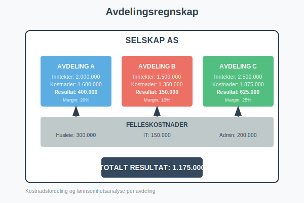
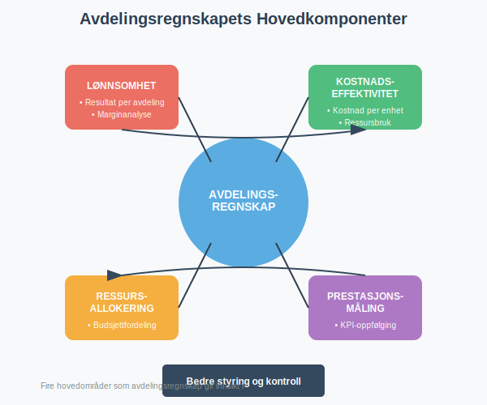
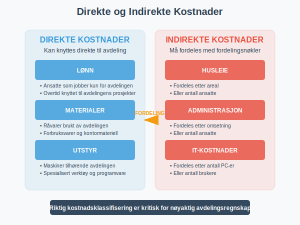
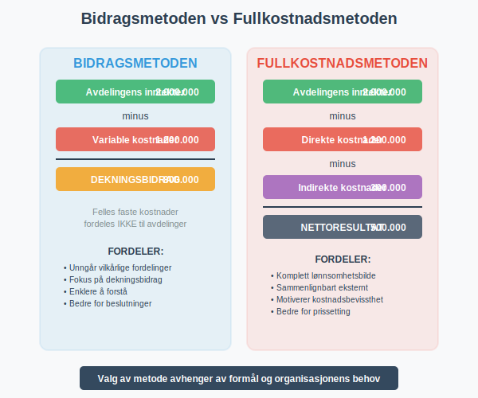
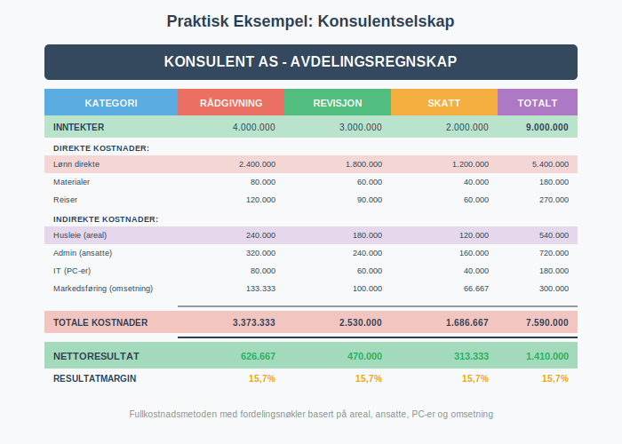
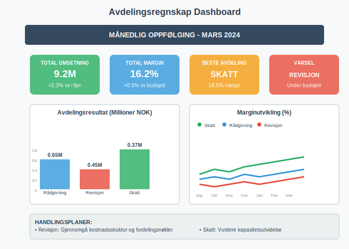
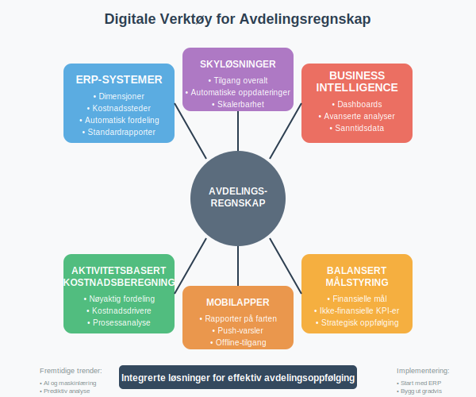

---
title: "Hva er Avdelingsregnskap?"
meta_title: "Hva er Avdelingsregnskap?"
meta_description: '**Avdelingsregnskap** er en regnskapsmetode som fordeler kostnader og inntekter på ulike avdelinger eller divisjoner i en bedrift. Dette gir ledelsen mulighet ...'
slug: hva-er-avdelingsregnskap
type: blog
layout: pages/single
---

**Avdelingsregnskap** er en regnskapsmetode som fordeler kostnader og inntekter på ulike avdelinger eller divisjoner i en bedrift. Dette gir ledelsen mulighet til å måle **lønnsomhet og effektivitet** på avdelingsnivå, og er et viktig verktøy for intern styring og kontroll.



### Hva er Avdelingsregnskap?

Avdelingsregnskap, også kalt **divisjonsregnskap** eller **segmentregnskap**, er en utvidelse av det tradisjonelle [regnskapet](/blogs/regnskap/hva-er-regnskap "Hva er Regnskap? En komplett guide") hvor man deler opp virksomheten i mindre enheter for å få bedre innsikt i:

- **Lønnsomhet per avdeling:** Hvilke avdelinger som bidrar mest til resultatet
- **Kostnadseffektivitet:** Hvor effektivt hver avdeling bruker sine ressurser
- **Ressursallokering:** Hvor ressursene bør fordeles for optimal avkastning
- **Prestasjonsmåling:** Hvordan hver avdeling presterer mot mål og budsjett

Avdelingsregnskap bygger på prinsippene fra [driftsregnskapet](/blogs/regnskap/hva-er-driftsregnskap "Hva er Driftsregnskap? Komplett Guide til Driftsregnskapet i Norge"), som fokuserer på operative inntekter og kostnader, men fordeler disse på avdelingsnivå for mer detaljert analyse og styring.

For å få en fullstendig forståelse av lønnsomhetsanalyse, er det viktig å forstå [bruttobegrepet](/blogs/regnskap/hva-er-brutto "Hva er Brutto i Regnskap? Definisjon, Beregning og Praktisk Anvendelse") generelt og [bruttofortjeneste](/blogs/regnskap/hva-er-bruttofortjeneste "Hva er Bruttofortjeneste? Beregning, Analyse og Betydning for Bedriften") spesielt som grunnlaget for å vurdere hver avdelings bidrag til bedriftens totale lønnsomhet.



### Hovedprinsipper i Avdelingsregnskap

#### Direkte Kostnader
**Direkte kostnader** kan knyttes direkte til en spesifikk avdeling:

- **Lønn:** Ansatte som jobber kun for én avdeling
- **Materialer:** RÃ¥varer og forbruksvarer brukt av avdelingen
- **Utstyr:** Maskiner og verktøy som tilhører avdelingen
- **Reisekostnader:** Reiser knyttet til avdelingens aktiviteter

#### Indirekte Kostnader (Felleskostnader)
**Indirekte kostnader** må fordeles mellom avdelingene basert på fordelingsnøkler:

- **Husleie:** Fordeles ofte etter areal eller antall ansatte
- **Strøm og oppvarming:** Kan fordeles etter areal eller forbruk
- **Administrasjon:** Fordeles etter omsetning eller antall ansatte
- **IT-kostnader:** Fordeles etter antall brukere eller datautstyr



### Fordelingsnøkler for Felleskostnader

Valg av **fordelingsnøkkel** er kritisk for å få et rettvisende bilde av hver avdelings lønnsomhet:

| Kostnadskategori | Vanlige Fordelingsnøkler | Fordeler | Ulemper |
|------------------|-------------------------|----------|---------|
| **Husleie** | Areal, antall ansatte | Enkelt å måle | Reflekterer ikke alltid faktisk bruk |
| **Lønn administrasjon** | Antall ansatte, lønnssum | Logisk sammenheng | Kan straffe avdelinger med høyt utdannede ansatte |
| **IT-kostnader** | Antall PC-er, brukere | Direkte sammenheng | Reflekterer ikke kompleksitet |
| **Markedsføring** | Omsetning, antall kunder | Følger nytte | Kan være urettferdig for nye avdelinger |
| **Strøm** | Areal, antall ansatte | Enkelt å implementere | Reflekterer ikke faktisk forbruk |

### Metoder for Avdelingsregnskap

#### 1. Bidragsmetoden
Fokuserer på **[dekningsbidrag](/blogs/regnskap/hva-er-nullpunkt "Hva er Nullpunkt (Break-Even) i Regnskap? Beregning av Dekningsbidrag og Lønnsomhetsanalyse")** per avdeling:

```
Avdelingens inntekter
- Avdelingens variable kostnader
= Dekningsbidrag

Dekningsbidrag for alle avdelinger
- Felles faste kostnader
= Totalt resultat
```

**Fordeler:**
- Viser hver avdelings bidrag til å dekke faste kostnader
- Unngår vilkårlige fordelinger av faste kostnader
- Enklere å forstå og implementere

#### 2. Fullkostnadsmetoden
Fordeler **alle kostnader** til avdelingene:

```
Avdelingens inntekter
- Avdelingens direkte kostnader
- Andel av indirekte kostnader
= Avdelingens nettoresultat
```

**Fordeler:**
- Gir et "komplett" bilde av hver avdelings lønnsomhet
- Lettere å sammenligne med eksterne benchmarks
- Motiverer til kostnadsbevissthet



### Praktisk Implementering

#### Trinn 1: Definere Avdelinger
Avdelingene må være **klart avgrenset** og ha:
- Egen ledelse eller ansvarlig person
- Identifiserbare inntekter eller kostnader
- Mulighet for påvirkning av resultatet
- Tilstrekkelig størrelse til å rettferdiggjøre oppfølging

#### Trinn 2: Identifisere Kostnader og Inntekter
**Direkte poster:**
- Lønn til ansatte i avdelingen
- Materialer brukt av avdelingen
- Utstyr og maskiner tilhørende avdelingen
- Reiser og andre direkte utgifter

**Indirekte poster som må fordeles:**
- Husleie og lokalkostnader
- Felles administrasjon
- IT og kommunikasjon
- Markedsføring og salg

#### Trinn 3: Velge Fordelingsnøkler
Eksempel på fordelingsnøkler for et konsulentselskap:

| Avdeling | Ansatte | Areal (m²) | Omsetning | PC-er |
|----------|---------|------------|-----------|-------|
| **RÃ¥dgivning** | 8 | 120 | 4.000.000 | 8 |
| **Revisjon** | 6 | 90 | 3.000.000 | 6 |
| **Skatt** | 4 | 60 | 2.000.000 | 4 |
| **Administrasjon** | 2 | 30 | - | 2 |
| **Totalt** | 20 | 300 | 9.000.000 | 20 |

### Detaljert Eksempel: Konsulentselskap

La oss se på et praktisk eksempel med et konsulentselskap som har tre avdelinger:

#### Direkte Inntekter og Kostnader

| | RÃ¥dgivning | Revisjon | Skatt | Totalt |
|---|------------|----------|-------|--------|
| **Inntekter** | 4.000.000 | 3.000.000 | 2.000.000 | 9.000.000 |
| **Lønn direkte** | 2.400.000 | 1.800.000 | 1.200.000 | 5.400.000 |
| **Materialer** | 80.000 | 60.000 | 40.000 | 180.000 |
| **Reiser** | 120.000 | 90.000 | 60.000 | 270.000 |

#### Felleskostnader som skal fordeles

| Kostnad | Beløp | Fordelingsnøkkel | Rådgivning | Revisjon | Skatt |
|---------|-------|------------------|------------|----------|-------|
| **Husleie** | 600.000 | Areal | 240.000 | 180.000 | 120.000 |
| **Administrasjon** | 800.000 | Ansatte | 320.000 | 240.000 | 160.000 |
| **IT-kostnader** | 200.000 | PC-er | 80.000 | 60.000 | 40.000 |
| **Markedsføring** | 300.000 | Omsetning | 133.333 | 100.000 | 66.667 |

#### Resultat per Avdeling (Fullkostnadsmetoden)

| | RÃ¥dgivning | Revisjon | Skatt | Totalt |
|---|------------|----------|-------|--------|
| **Inntekter** | 4.000.000 | 3.000.000 | 2.000.000 | 9.000.000 |
| **Direkte kostnader** | 2.600.000 | 1.950.000 | 1.300.000 | 5.850.000 |
| **Indirekte kostnader** | 773.333 | 580.000 | 386.667 | 1.740.000 |
| **Totale kostnader** | 3.373.333 | 2.530.000 | 1.686.667 | 7.590.000 |
| **Nettoresultat** | **626.667** | **470.000** | **313.333** | **1.410.000** |
| **Resultatmargin** | **15,7%** | **15,7%** | **15,7%** | **15,7%** |



### Analyse og Oppfølging

#### Nøkkeltall for Avdelingsanalyse

**Lønnsomhetstall:**
- **Resultatmargin:** Nettoresultat / Inntekter
- **[Dekningsgrad](/blogs/regnskap/hva-er-dekningsgrad "Hva er Dekningsgrad? Komplett Guide til Beregning og Analyse"):** Dekningsbidrag / Inntekter
- **Avkastning på investert kapital:** Resultat / Investert kapital

**Effektivitetstall:**
- **Inntekt per ansatt:** Inntekter / Antall ansatte
- **Kostnader per ansatt:** Totale kostnader / Antall ansatte
- **Produktivitet:** Produserte enheter / Arbeidstimer

**Veksttall:**
- **Inntektsvekst:** Endring i inntekter fra i fjor
- **Markedsandel:** Avdelingens andel av total omsetning
- **Kundevekst:** Endring i antall kunder

#### Rapportering og Oppfølging

**MÃ¥nedlig rapportering:**
- Resultat mot budsjett
- Utvikling i nøkkeltall
- Avvik og forklaringer
- Handlingsplaner

**Kvartalsvis analyse:**
- Dypere analyse av avvik
- Benchmarking mot andre avdelinger
- Vurdering av fordelingsnøkler
- Strategiske tiltak



### Utfordringer og Fallgruver

#### Vanlige Problemer

**Feil fordelingsnøkler:**
- Bruker fordelingsnøkler som ikke reflekterer faktisk ressursbruk
- Endrer ikke fordelingsnøkler når virksomheten endrer seg
- Bruker for enkle nøkler som ikke fanger kompleksiteten

**Motivasjonsproblemer:**
- Avdelingsledere fokuserer kun på sitt eget resultat
- Suboptimalisering på bekostning av helheten
- Motstand mot å dele ressurser med andre avdelinger

**Tekniske utfordringer:**
- Manglende systemer for å samle inn data
- Tidkrevende manuell rapportering
- Inkonsistent rapportering mellom avdelinger

#### Løsningsstrategier

**Forbedre fordelingsnøkler:**
- Bruk aktivitetsbasert kostnadsfordeling (ABC)
- Gjennomgå og oppdater nøkler regelmessig
- Involver avdelingslederne i valg av nøkler

**Balansere målstyring:**
- Kombiner avdelingsmål med konsernmål
- Belønning basert på både avdelings- og totalresultat
- Fremme samarbeid mellom avdelinger

**Investere i systemer:**
- Implementer integrerte ERP-systemer
- Automatiser datainnsamling og rapportering
- Standardiser rapporteringsformater

### Juridiske og Skattemessige Aspekter

#### Regnskapslovens Krav
[Regnskapsloven](/blogs/regnskap/hva-er-regnskap "Hva er Regnskap? En komplett guide") krever ikke avdelingsregnskap, men:
- Større selskaper må gi **segmentinformasjon** i årsrapporten
- Konsern må rapportere per **forretningsområde** og **geografisk segment**
- Børsnoterte selskaper har strengere krav til segmentrapportering

#### Skattemessige Konsekvenser
- Avdelingsregnskap påvirker ikke **skattepliktig inntekt**
- Kan brukes til å dokumentere **armslengdeprinsippet** i konsern
- Viktig for **internprising** mellom selskaper i samme konsern

### Digitale Verktøy og Systemer

#### ERP-systemer
Moderne ERP-systemer støtter avdelingsregnskap gjennom:
- **Dimensjoner:** Automatisk koding av transaksjoner
- **Kostnadssteder:** Fordeling av kostnader til avdelinger
- **Rapportering:** Standardiserte rapporter per avdeling
- **Budsjett:** Budsjettoppfølging per avdeling

#### Spesialiserte Verktøy
- **Business Intelligence (BI):** Avanserte analyser og dashboards
- **Aktivitetsbasert kostnadsberegning (ABC):** Mer nøyaktig kostnadsfordeling
- **Balansert målstyring (BSC):** Kombinerer finansielle og ikke-finansielle mål



### Beste Praksis

#### Implementering
1. **Start enkelt:** Begynn med få avdelinger og enkle fordelingsnøkler
2. **Involver ledelsen:** Sikre støtte fra toppledelsen
3. **Tren personalet:** Gi opplæring i prinsipper og systemer
4. **Test og juster:** Evaluer og forbedre systemet kontinuerlig

#### Drift
1. **Regelmessig rapportering:** MÃ¥nedlige rapporter med analyse
2. **Benchmarking:** Sammenlign med bransjestandarder
3. **Kontinuerlig forbedring:** Oppdater metoder og systemer
4. **Kommunikasjon:** Del innsikter på tvers av organisasjonen

### Fremtidige Trender

#### Teknologiske Utviklinger
- **Kunstig intelligens:** Automatisk identifikasjon av kostnadsdriver
- **Sanntidsrapportering:** Kontinuerlig oppdatering av avdelingsresultater
- **Prediktiv analyse:** Prognoser basert på historiske data
- **Mobilløsninger:** Tilgang til rapporter på mobile enheter

#### Metodiske Utviklinger
- **Aktivitetsbasert kostnadsberegning:** Mer nøyaktig kostnadsfordeling
- **Lean accounting:** Fokus på verdiskapende aktiviteter
- **Bærekraftsregnskap:** Inkludering av miljø- og sosiale faktorer

### Relaterte Begreper

For å forstå avdelingsregnskap fullt ut, bør du også sette deg inn i:

- **[Regnskap](/blogs/regnskap/hva-er-regnskap "Hva er Regnskap? En komplett guide")** - Grunnleggende regnskapsprinsipper
- **[Anleggsmidler](/blogs/regnskap/hva-er-anleggsmidler "Hva er Anleggsmidler? Klassifisering og Regnskapsføring")** - Fordeling av avskrivninger på avdelinger
- **[Arbeidskapital](/blogs/regnskap/hva-er-arbeidskapital "Hva er Arbeidskapital? Beregning og Betydning")** - Kapitalallokering per avdeling
- **[Anskaffelseskost](/blogs/regnskap/hva-er-anskaffelseskost "Hva er Anskaffelseskost? Komponenter og Regnskapsføring")** - Kostnadsberegning for avdelingsaktiva

### Konklusjon

Avdelingsregnskap er et **kraftig styringsverktøy** som gir ledelsen detaljert innsikt i hver avdelings bidrag til selskapets totale resultat. Ved å implementere et godt avdelingsregnskapssystem kan bedrifter:

- **Identifisere lønnsomme og ulønnsomme avdelinger**
- **Optimalisere ressursallokering**
- **Forbedre beslutningsgrunnlaget**
- **Motivere avdelingsledere til bedre prestasjoner**

Suksess med avdelingsregnskap krever **riktige fordelingsnøkler**, **gode systemer** og **engasjert ledelse** på alle nivåer. Med moderne teknologi blir det stadig enklere å implementere og drifte avanserte avdelingsregnskapssystemer som gir verdifull innsikt for bedre styring og kontroll.


