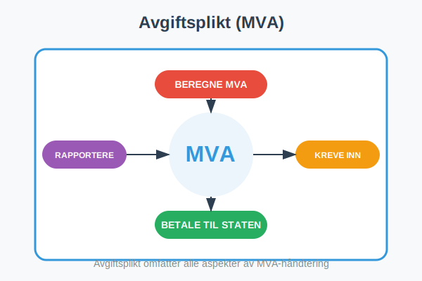
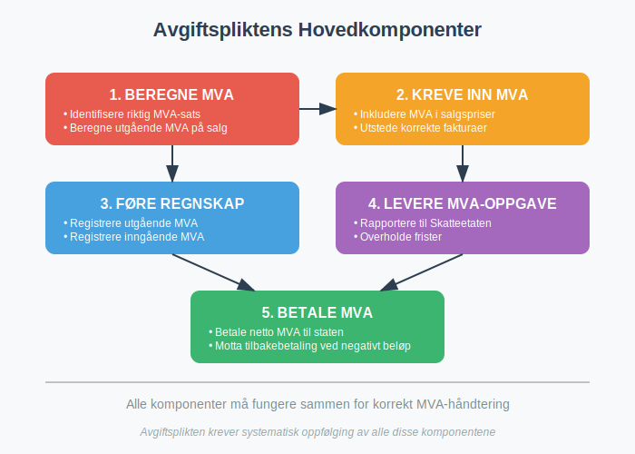
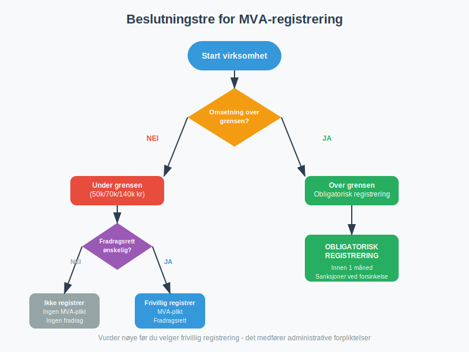
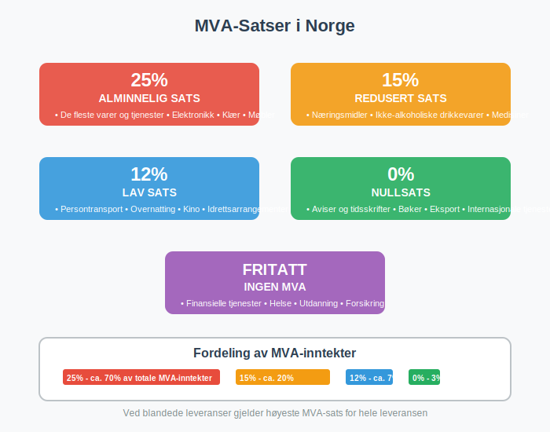
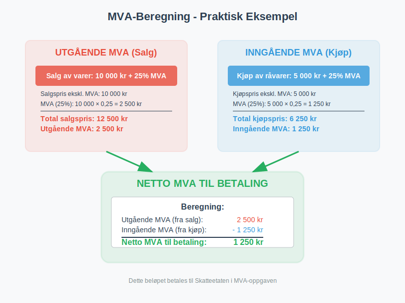
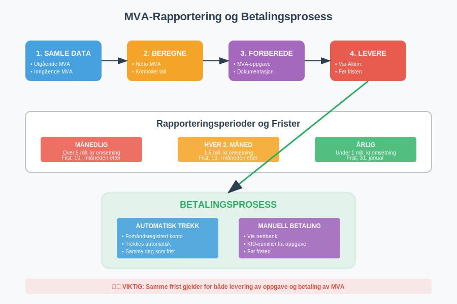
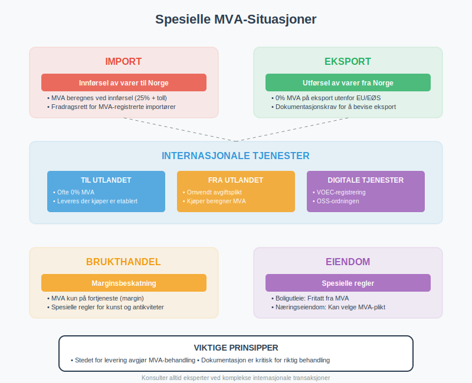
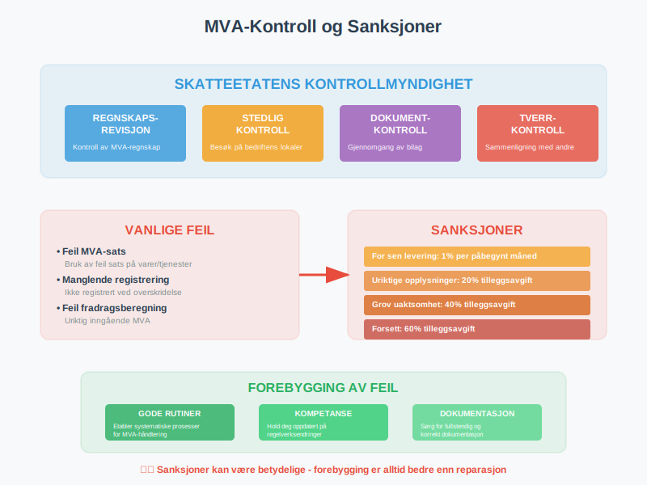
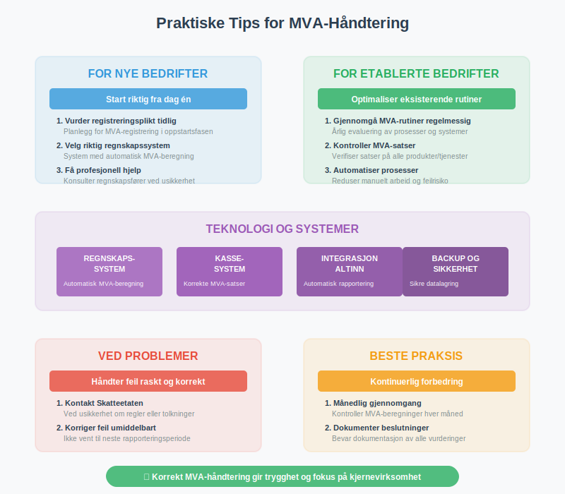

---
title: "Hva er Avgiftsplikt (MVA)?"
seoTitle: "Hva er Avgiftsplikt (MVA)?"
description: '**Avgiftsplikt (MVA)** er plikten til å beregne, kreve inn og betale merverdiavgift til staten. Dette er en fundamental del av det norske skattesystemet som pÃ...'
---

**Avgiftsplikt (MVA)** er plikten til å beregne, kreve inn og betale merverdiavgift til staten. Dette er en fundamental del av det norske skattesystemet som påvirker de fleste [bedrifter](/blogs/regnskap/hva-er-et-aksjeselskap "Hva er et Aksjeselskap? Komplett Guide til Selskapsformen") som selger varer og tjenester i Norge.

For en grundig oversikt over [Merverdiavgift](/blogs/regnskap/merverdiavgift "Merverdiavgift: Komplett Guide til MVA i Norge"), se vår omfattende guide.
For en detaljert innføring i moms, se [Hva er Moms (MVA)?](/blogs/regnskap/hva-er-moms-mva "Hva er Moms? Komplett Guide til Merverdiavgift (MVA) i Norge").



### Hva er Avgiftsplikt?

Avgiftsplikt innebærer at en virksomhet har **juridisk ansvar** for å:

- **Beregne MVA** på salg av varer og tjenester
- **Kreve inn MVA** fra kunder
- **Betale MVA** til Skatteetaten
- **Føre korrekt regnskap** over MVA-transaksjoner
- **Levere [MVA-melding](/blogs/regnskap/hva-er-mva-melding "Hva er MVA-melding? Komplett Guide til Merverdiavgiftsrapportering i Norge")** til rett tid

Dette er et klassisk eksempel på **[egenmelding](/blogs/regnskap/hva-er-egenmelding "Hva er Egenmelding? Komplett Guide til Selvrapportering i Norsk Regnskap")** - selvrapportering hvor virksomheten selv har ansvar for å beregne, rapportere og betale riktig MVA til myndighetene.

Avgiftsplikten oppstår når virksomheten oppfyller visse kriterier for omsetning og aktivitet, og er en viktig del av [regnskapet](/blogs/regnskap/hva-er-regnskap "Hva er Regnskap? En komplett guide") til enhver virksomhet.



### Når Oppstår Avgiftsplikt?

#### Omsetningsgrense
Avgiftsplikt oppstår når virksomheten når **omsetningsgrensen**:

| Virksomhetstype | Omsetningsgrense | Registreringsplikt |
|-----------------|------------------|-------------------|
| **Alminnelig virksomhet** | 50 000 kr | Obligatorisk |
| [**Primærnæring**](/blogs/regnskap/primarnaring "Hva er primærnæring? Komplett Guide til Primærnæring i Regnskap") | 70 000 kr | Obligatorisk |
| **Kunstnere og frilansere** | 50 000 kr | Obligatorisk |
| **[Ideelle organisasjoner](/blogs/regnskap/hva-er-forening "Hva er Forening i Regnskap? Regnskapsføring for Foreninger og Organisasjoner")** | 140 000 kr | Obligatorisk |

#### Frivillig Registrering
Virksomheter under omsetningsgrensen kan **frivillig registrere seg** for MVA hvis:

- De har **fradragsberettiget inngående MVA**
- De planlegger å nå omsetningsgrensen
- De ønsker å fremstå som profesjonelle
- De handler med andre MVA-registrerte virksomheter



### MVA-Satser i Norge

Norge har **differensierte MVA-satser** avhengig av type vare eller tjeneste:

#### Gjeldende Satser

| MVA-Sats | Anvendelse | Eksempler |
|----------|------------|-----------|
| **25%** | Alminnelig sats | De fleste varer og tjenester |
| **15%** | Redusert sats | Næringsmidler, ikke-alkoholiske drikkevarer |
| **12%** | Lav sats | Persontransport, overnatting, kino |
| **0%** | Nullsats | Aviser, bøker, eksport |
| **Fritatt** | Ingen MVA | Finansielle tjenester, helse, utdanning |

> **Kontoplan:** For å bokføre inngående merverdiavgift med lav sats (12\%) brukes konto 1614. Les mer i [Konto 1614 - Inngående merverdiavgift lav sats](/blogs/kontoplan/1614-inngaaende-merverdiavgift-lav-sats "Konto 1614 - Inngående merverdiavgift lav sats").

#### Spesielle Regler
- **Blandede leveranser:** Høyeste sats gjelder
- **Tjenester til utlandet:** Ofte 0% eller fritatt “ se [Hva er Fjernleverbare Tjenester i Regnskap?](/blogs/regnskap/hva-er-fjernleverbare-tjenester "Fjernleverbare Tjenester - MVA-regler, Bokføring og Praktiske Eksempler") for mer informasjon
- **Tjenester fra utlandet:** [Omvendt avgiftsplikt](/blogs/regnskap/omvendt-avgiftsplikt "Omvendt Avgiftsplikt - Komplett Guide til Reverse Charge MVA") kan gjelde
- **Import:** 25% + eventuelle tollsatser
- **Brukthandel:** Spesielle marginsregler



### Registrering i MVA-registeret

Alle virksomheter som oppfyller kravene til avgiftsplikt må registrere seg i **[MVA-registeret](/blogs/regnskap/hva-er-mva-registeret "Hva er MVA-registeret? Komplett Guide til Merverdiavgiftsregisteret i Norge")**. Dette er Skatteetatens offisielle register over alle MVA-registrerte virksomheter i Norge.

#### Registreringsprosess
1. **Vurder registreringsplikt** basert på omsetning
2. **Søk om registrering** via Altinn eller Skatteetaten
3. **Få tildelt organisasjonsnummer** hvis ikke allerede har det
4. **Motta MVA-nummer** fra Skatteetaten
5. **Start MVA-rapportering** fra registreringsdato

For en detaljert gjennomgang av hele registreringsprosessen, plikter og rettigheter som følger med MVA-registrering, samt konsekvenser av manglende registrering, se vår omfattende guide til [MVA-registeret](/blogs/regnskap/hva-er-mva-registeret "Hva er MVA-registeret? Komplett Guide til Merverdiavgiftsregisteret i Norge").

#### Nødvendig Dokumentasjon
- **Organisasjonsnummer** eller søknad om dette
- **Beskrivelse av virksomheten** og aktiviteter
- **Forventet omsetning** og MVA-grunnlag
- **Regnskapsopplysninger** hvis virksomheten er etablert

#### Frister for Registrering
- **Innen 1 måned** etter at omsetningsgrensen er nådd
- **Før oppstart** hvis man velger frivillig registrering
- **Senest ved første MVA-pliktige salg**

### Beregning av MVA

#### Utgående MVA (MVA på Salg)
```
Utgående MVA = Salgspris × MVA-sats / (100 + MVA-sats)
```

**Eksempel:**
- Salgspris inkl. MVA: 1 250 kr
- MVA-sats: 25%
- Utgående MVA: 1 250 × 25 / 125 = 250 kr
- Salgspris ekskl. MVA: 1 000 kr

#### Inngående MVA (MVA på Kjøp)
```
Inngående MVA = Kjøpspris × MVA-sats / (100 + MVA-sats)
```

**Eksempel:**
- Kjøpspris inkl. MVA: 625 kr
- MVA-sats: 25%
- Inngående MVA: 625 × 25 / 125 = 125 kr
- Kjøpspris ekskl. MVA: 500 kr

#### Netto MVA til Betaling
```
Netto MVA = Utgående MVA - Inngående MVA
```



### Fradragsrett for Inngående MVA

#### Generelle Prinsipper
- **Full fradragsrett:** For kjøp til MVA-pliktig virksomhet
- **Ingen fradragsrett:** For private formål eller fritatte aktiviteter
- **Delvis fradragsrett:** Ved blandet bruk (privat/næring)

#### Fradragsberettigede Utgifter
- **Råvarer og handelsvarer** til videresalg (spesielt relevant for [detaljhandel](/blogs/regnskap/hva-er-detaljhandel "Hva er Detaljhandel? Komplett Guide til Regnskap og Økonomistyring for Butikker"))
- **Driftsmidler** som maskiner, utstyr, biler
- **Tjenester** som regnskap, juridisk bistand, markedsføring
- **Driftskostnader** som strøm, telefon, husleie

#### Ikke-Fradragsberettigede Utgifter
- **Private utgifter** og representasjon over grenser
- **Kjøp til fritatte aktiviteter** (helse, utdanning, finans)
- **Personbiler** (med visse unntak)
- **Alkohol og tobakk** til representasjon

### MVA-Oppgave og Rapportering

MVA-registrerte virksomheter må levere **[MVA-melding](/blogs/regnskap/hva-er-mva-melding "Hva er MVA-melding? Komplett Guide til Merverdiavgiftsrapportering i Norge")** til Skatteetaten i henhold til fastsatte frister. Denne meldingen inneholder detaljert informasjon om virksomhetens MVA-transaksjoner for perioden.

#### Rapporteringsperioder
| Omsetning (årlig) | Rapporteringsperiode | Frist |
|-------------------|---------------------|-------|
| **Under 1 mill. kr** | Årlig | 31. januar |
| **1-5 mill. kr** | Hver 2. måned | 10. i måneden etter |
| **Over 5 mill. kr** | Månedlig | 10. i måneden etter |

#### Innhold i MVA-Oppgaven
1. **Utgående MVA** per sats og kode
2. **Inngående MVA** som kan fradras
3. **Netto MVA** til betaling eller tilbakebetaling
4. **Spesifikasjoner** av omsetning og kjøp
5. **Eventuelle justeringer** og korrigeringer

#### Levering og Betaling
- **Elektronisk levering** via Altinn eller regnskapssystem
- **Automatisk trekk** fra bankkonto eller manuell betaling
- **Samme frist** for levering og betaling
- **Forsinkelsesgebyr** ved for sen levering/betaling



### Fritak fra Avgiftsplikt

#### Objektive Fritak
Visse aktiviteter er **fritatt fra MVA** uavhengig av omsetning:

- **Finansielle tjenester:** Bank, forsikring, verdipapirtjenester
- **Helse- og sosialtjenester:** Leger, tannleger, fysioterapeuter
- **Undervisning:** Skoler, universiteter, kursvirksomhet
- **Kultur og idrett:** Museer, biblioteker, idrettslag
- **Eiendomsutleie:** Boligutleie og visse næringseiendommer

#### Betingede Fritak
- **Småbedrifter** under omsetningsgrensen
- [**Primærnæring**](/blogs/regnskap/primarnaring "Hva er primærnæring? Komplett Guide til Primærnæring i Regnskap") under 70 000 kr omsetning
- **[Ideelle organisasjoner](/blogs/regnskap/hva-er-forening "Hva er Forening i Regnskap? Regnskapsføring for Foreninger og Organisasjoner")** under 140 000 kr omsetning

#### Konsekvenser av Fritak
- **Ingen utgående MVA** på salg
- **Ingen fradragsrett** for inngående MVA
- **Lavere administrative kostnader**
- **Mulig konkurranseulempe** mot MVA-registrerte

### Spesielle Situasjoner

#### Import og Eksport
**Import:**
- **MVA beregnes** ved innførsel til Norge
- **Samme sats** som ved innenlandsk salg
- **Fradragsrett** for importør hvis MVA-registrert

**Eksport:**
- **0% MVA** på eksport til land utenfor EU/EØS
- **Dokumentasjonskrav** for å dokumentere eksport
- **Full fradragsrett** for kostnader knyttet til eksport

#### Tjenester til Utlandet
- **Hovedregel:** Leveres der kjøper er etablert
- **0% MVA** på mange tjenester til utlandet
- **Spesielle regler** for transport, eiendom, kultur
- **Stedbunden tjeneste:** Tjenester levert på et geografisk bestemt sted “ se [Stedbunden tjeneste](/blogs/regnskap/hva-er-stedbunden-tjeneste "Hva er Stedbunden tjeneste i Regnskap?") for detaljer
- **[Fjernleverbare tjenester](/blogs/regnskap/hva-er-fjernleverbare-tjenester "Hva er Fjernleverbare Tjenester i Regnskap? MVA-regler og Bokføring")** har egne stedsbestemmelsesregler

#### Brukthandel og Kunstgjenstander
- **Marginsbeskatning:** MVA kun på fortjeneste
- **Spesielle regler** for antikviteter og kunstgjenstander
- **Dokumentasjonskrav** for innkjøpspriser



### Regnskapsføring av MVA

For en komplett guide til [momsregnskap](/blogs/regnskap/momsregnskap "Momsregnskap - Komplett Guide til MVA-regnskapsføring"), se vår detaljerte artikkel om alle aspekter ved MVA-regnskapsføring.

#### Kontoplan for MVA
**Balanseposter:**
- **2700 - Utgående merverdiavgift** (kortsiktig gjeld)
- **2701 - Inngående merverdiavgift** (kortsiktig fordring)
- **2740 - Oppgjørskonto for MVA** (netto posisjon)

**Resultatposter:**
- MVA påvirker **ikke** resultatet direkte
- Kun **netto kontantstrøm** påvirker likviditeten

#### Praktisk Regnskapsføring
**Ved salg:**
```
Debet: Kundefordringer 1 250 kr
Kredit: Salgsinntekt 1 000 kr
Kredit: Utgående MVA 250 kr
```

**Ved kjøp:**
```
Debet: Varekjøp 500 kr
Debet: Inngående MVA 125 kr
Kredit: Leverandørgjeld 625 kr
```

**Ved MVA-oppgjør:**
```
Debet: Utgående MVA 250 kr
Kredit: Inngående MVA 125 kr
Kredit: Oppgjørskonto MVA 125 kr
```

### Kontroll og Sanksjoner

#### Skatteetatens Kontrollmyndighet
- **Regnskapsrevisjon:** Kontroll av MVA-regnskapet
- **Stedlig kontroll:** Besøk på virksomhetens lokaler
- **Dokumentkontroll:** Gjennomgang av bilag og systemer
- **Tverrkontroll:** Sammenligning med andre opplysninger

#### Vanlige Feil og Mangler
- **Feil MVA-sats** på varer og tjenester
- **Manglende registrering** ved overskridelse av grenser
- **Feil fradragsberegning** for inngående MVA
- **For sen levering** av MVA-oppgaver
- **Mangelfulle bilag** og dokumentasjon

#### Sanksjoner ved Overtredelser
| Overtredelse | Sanksjon | Beløp/Prosent |
|--------------|----------|---------------|
| **For sen levering** | Forsinkelsesgebyr | 1% per påbegynt måned |
| **Uriktige opplysninger** | Tilleggsavgift | 20% av beløpet |
| **Grov uaktsomhet** | Tilleggsavgift | 40% av beløpet |
| **Forsett** | Tilleggsavgift | 60% av beløpet |



### Digitalisering og Teknologi

#### Elektroniske Systemer
- **Regnskapssystemer** med automatisk MVA-beregning
- **Kassasystemer** som håndterer MVA-satser
- **Integrasjon** mellom systemer og Skatteetaten
- **Automatisk rapportering** og betaling

#### Fremtidige Endringer
- **Kontinuerlig rapportering:** Sanntidsrapportering av transaksjoner
- **Digitale kvitteringer:** Elektronisk [kvittering](/blogs/regnskap/kvittering "Hva er Kvittering? En Guide til Kvitteringskrav i Norsk Regnskap") dokumentasjon
- **Kunstig intelligens:** Automatisk kontroll og validering
- **Blockchain:** Sikker og transparent dokumentasjon

### Internasjonale Aspekter

#### EU/EØS-Handel
- **Fellesmarkedsregler:** Harmoniserte MVA-regler
- **VOEC-registrering:** For e-handel til forbrukere
- **OSS-ordningen:** Forenklet rapportering for tjenester
- **Omvendt avgiftsplikt:** Ved kjøp fra utlandet

#### Globale Trender
- **Digitale tjenester:** Nye regler for teknologiselskaper
- **E-handel:** Utvidede rapporteringskrav
- **Miljøavgifter:** Grønne avgifter integrert med MVA
- **Automatisering:** Redusert manuelt arbeid

### Praktiske Råd for Bedrifter

#### For Nye Bedrifter
1. **Vurder registreringsplikt** tidlig i prosessen
2. **Velg riktig regnskapssystem** med MVA-funksjonalitet
3. **Sett opp rutiner** for MVA-håndtering fra start
4. **Få profesjonell hjelp** ved usikkerhet
5. **Hold deg oppdatert** på regelverksendringer

#### For Etablerte Bedrifter
1. **Gjennomgå MVA-rutiner** regelmessig
2. **Kontroller MVA-satser** på alle produkter/tjenester
3. **Optimaliser fradragsretten** for inngående MVA
4. **Automatiser prosesser** der det er mulig
5. **Planlegg for fremtidige endringer** i regelverket

#### Ved Problemer
1. **Kontakt Skatteetaten** ved usikkerhet
2. **Søk profesjonell hjelp** fra regnskapsfører eller revisor
3. **Korriger feil** så snart de oppdages
4. **Dokumenter alle beslutninger** og vurderinger
5. **Lær av feil** og forbedre rutinene



### Relaterte Begreper og Artikler

For å forstå avgiftsplikt (MVA) fullt ut, bør du også sette deg inn i:

- **[Regnskap](/blogs/regnskap/hva-er-regnskap "Hva er Regnskap? En komplett guide")** - Grunnlaget for MVA-rapportering
- **[Aksjeselskap](/blogs/regnskap/hva-er-et-aksjeselskap "Hva er et Aksjeselskap? Komplett Guide til Selskapsformen")** - Selskapsform som ofte er MVA-pliktig
- **[Faktura](/blogs/regnskap/hva-er-en-faktura "Hva er en Faktura? En Guide til Norske Fakturakrav")** - Dokumentasjon av MVA-pliktige salg
- **[A-ordningen](/blogs/regnskap/hva-er-a-ordningen "Hva er A-ordningen? Komplett Guide til Rapportering")** - Relatert rapporteringsordning
- **[Altinn](/blogs/regnskap/hva-er-altinn "Hva er Altinn? Digital Kommunikasjon med Offentlige Myndigheter")** - Plattform for MVA-rapportering

### Oppsummering

Avgiftsplikt (MVA) er en **fundamental forpliktelse** for de fleste norske bedrifter som selger varer og tjenester. Korrekt håndtering av MVA krever:

- **Forståelse** av når avgiftsplikt oppstår
- **Kunnskap** om MVA-satser og fradragsregler  
- **Rutiner** for beregning og rapportering
- **Systemer** som støtter MVA-håndtering
- **Oppdatert kunnskap** om regelverksendringer

Ved å følge regelverket og etablere gode rutiner kan bedrifter **minimere risiko** og **optimalisere** sin MVA-håndtering som en naturlig del av den daglige driften.


