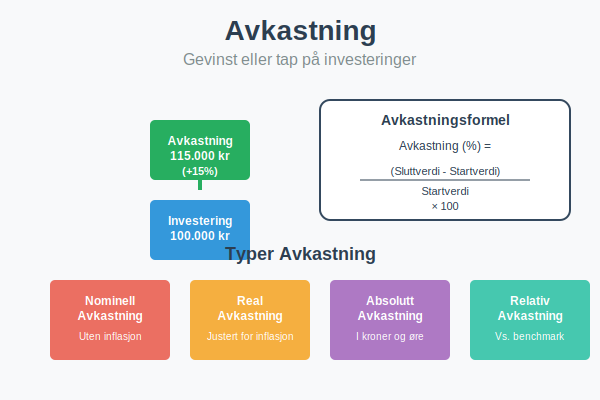
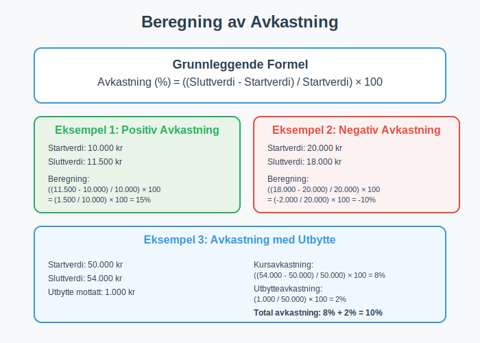
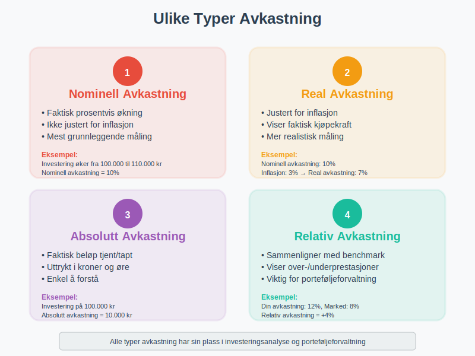
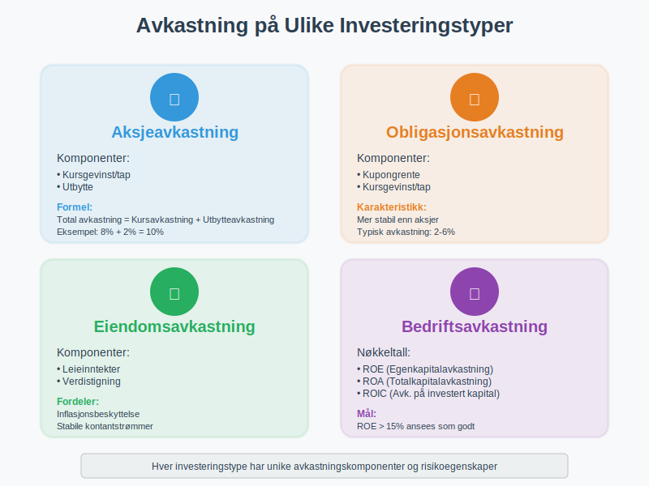
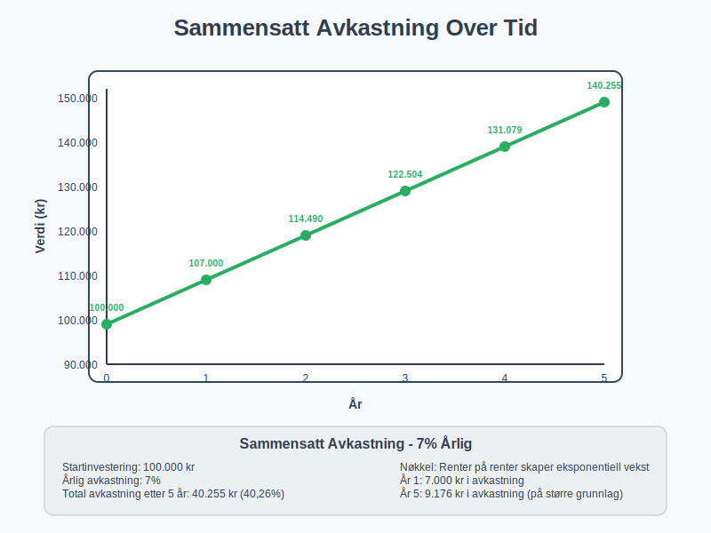
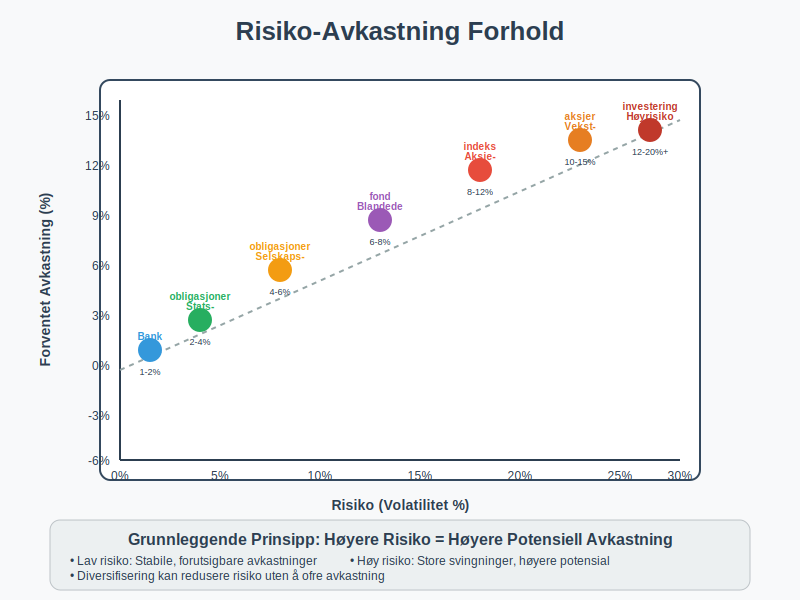
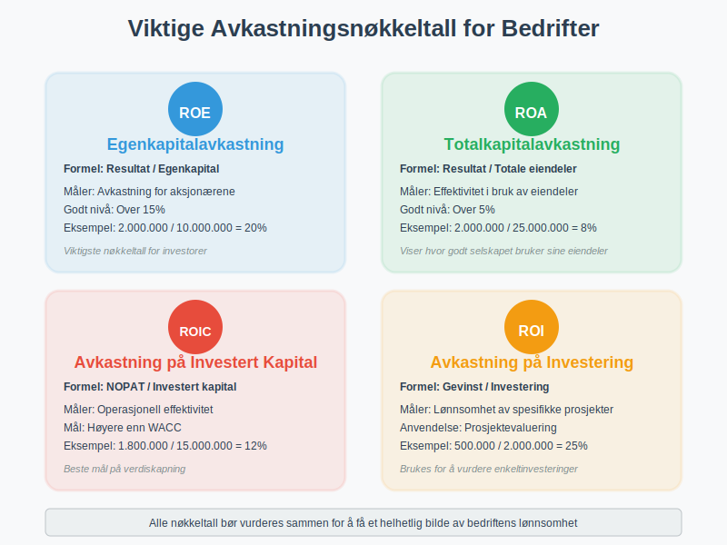
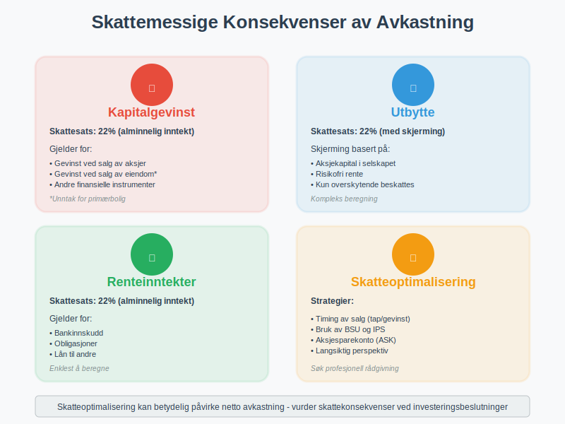
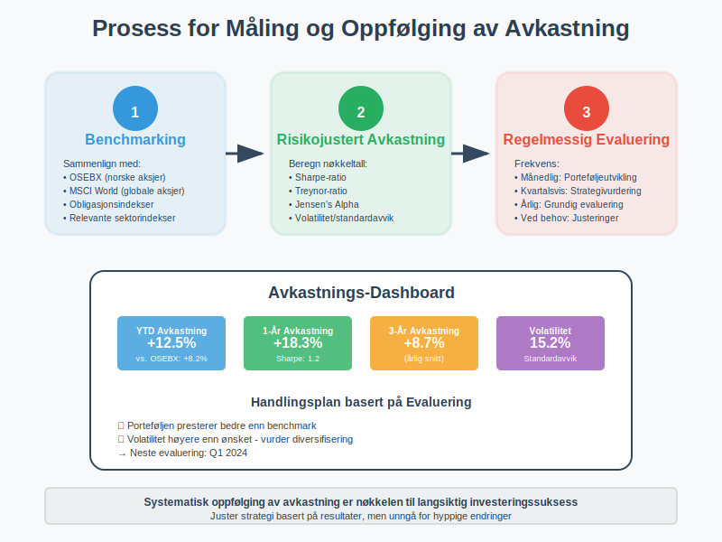

---
title: "Hva er Avkastning?"
seoTitle: "Avkastning | Slik beregner du avkastning på investering | ReAI"
description: "Avkastning er gevinst eller tap på en investering målt i prosent. Lær å beregne nominell og real avkastning, CAGR og risikojustert avkastning med praktiske eksempler."
summary: "Avkastning forklart: beregning, typer, CAGR og risiko."
---

**Avkastning** er gevinsten eller tapet du får på en [investering](/blogs/regnskap/hva-er-investere "Hva er å Investere? Komplett Guide til Investeringer i Regnskap"), uttrykt som en prosentandel av det opprinnelige investerte beløpet. Dette er et grunnleggende konsept innen økonomi og finans som påvirker alle typer investeringsbeslutninger, fra [aksjer](/blogs/regnskap/hva-er-en-aksje "Hva er en Aksje? En Enkel Forklaring") til eiendom og [aksjeselskap](/blogs/regnskap/hva-er-et-aksjeselskap "Hva er et Aksjeselskap? Komplett Guide til Selskapsformen").

## Hva er Avkastning?

Avkastning måler hvor mye penger du tjener eller taper på en investering i forhold til det du opprinnelig investerte. Den uttrykkes vanligvis som en **årlig prosentsats** og er et viktig verktøy for å sammenligne ulike investeringsmuligheter.

### Grunnleggende Formel for Avkastning

Den enkleste formelen for å beregne avkastning er:

**Avkastning (%) = ((Sluttverdi - Startverdi) / Startverdi) × 100**

## Typer Avkastning

### 1. Nominell Avkastning
**Nominell avkastning** er den faktiske prosentvise økningen i verdi uten justering for inflasjon. Dette er den mest grunnleggende måten å måle avkastning på.

### 2. Real Avkastning
**Real avkastning** justerer for [inflasjon](/blogs/regnskap/hva-er-inflasjon "Hva er Inflasjon? Komplett Guide til Inflasjon i Regnskap og Økonomi") og viser den faktiske kjøpekraften du har fått eller tapt:

**Real avkastning = Nominell avkastning - Inflasjonsrate**

### 3. Absolutt Avkastning
**Absolutt avkastning** er det faktiske beløpet du har tjent eller tapt, uttrykt i kroner og øre i stedet for prosent.

### 4. Relativ Avkastning
**Relativ avkastning** sammenligner din avkastning med en referanseindeks eller benchmark. For en dypere forståelse av verdivurdering, se også [Q-ratio](/blogs/regnskap/hva-er-q-ratio "Hva er Q-ratio (Tobin's Q)? Komplett Guide til Verdivurdering og Markedsanalyse") som sammenligner markedsverdi med bokført verdi.

## Avkastning på Ulike Investeringstyper

### Aksjeavkastning
Avkastning på [aksjer](/blogs/regnskap/hva-er-en-aksje "Hva er en Aksje? En Enkel Forklaring") består av to komponenter:

* **Kursgevinst/tap:** Endring i aksjekursen som ved salg blir [kapitalgevinst](/blogs/regnskap/hva-er-kapitalgevinst "Hva er Kapitalgevinst? Komplett Guide til Skatt og Regnskapsføring") eller kapitaltap
* **Utbytte:** Kontantutbetalinger fra selskapet  
  Se også [Utbytteaksjer](/blogs/regnskap/utbytteaksjer "Utbytteaksjer “ Guide til utbytteaksjer og utbytteavkastning") for en komplett guide til aksjer som gir regelmessig utbytte.

**Total aksjeavkastning = Kursavkastning + Utbytteavkastning**

For å beregne og sammenligne utbytteavkastning, se [yield](/blogs/regnskap/hva-er-yield "Hva er Yield? Komplett Guide til Yield-Analyse og Beregning i Regnskap") som forklarer dividend yield, earnings yield og andre yield-målinger for aksjer.

### Obligasjonsavkastning
Obligasjoner gir avkastning gjennom:

* **Kupongrente:** Faste rentebetalinger
* **Kursgevinst/tap:** Endring i obligasjonens markedsverdi

For en detaljert forståelse av obligasjonsavkastning, se [yield](/blogs/regnskap/hva-er-yield "Hva er Yield? Komplett Guide til Yield-Analyse og Beregning i Regnskap") som forklarer current yield, yield to maturity og andre obligasjonsavkastningsbegreper.

### Eiendomsavkastning
Eiendomsinvesteringer genererer avkastning via:

* **Leieinntekter:** Månedlige eller årlige leiebetalinger
* **Verdistigning:** Økning i eiendomsverdien over tid

### Bedriftsavkastning
For [aksjeselskap](/blogs/regnskap/hva-er-et-aksjeselskap "Hva er et Aksjeselskap? Komplett Guide til Selskapsformen") måles avkastning ofte som:

* **Egenkapitalavkastning (ROE):** Resultat i forhold til egenkapital
* **Totalkapitalavkastning (ROA):** Resultat i forhold til totale eiendeler
* **Avkastning på investert kapital (ROIC):** Operasjonelt resultat i forhold til investert kapital

## Beregning av Avkastning - Praktiske Eksempler

### Eksempel 1: Enkel Aksjeinvestering
Du kjøper aksjer for 10 000 kr og selger dem ett år senere for 11 500 kr:

**Avkastning = ((11 500 - 10 000) / 10 000) × 100 = 15%**

### Eksempel 2: Investering med Utbytte
Du investerer 50 000 kr i aksjer som gir 2% utbytte og stiger 8% i verdi:

* **Kursavkastning:** 8%
* **Utbytteavkastning:** 2%
* **Total avkastning:** 10%

### Eksempel 3: Sammensatt Avkastning over Flere År
En investering på 100 000 kr med 7% årlig avkastning over 5 år:

| År | Startverdi | Avkastning (7%) | Sluttverdi |
|---|---|---|---|
| 1 | 100 000 | 7 000 | 107 000 |
| 2 | 107 000 | 7 490 | 114 490 |
| 3 | 114 490 | 8 014 | 122 504 |
| 4 | 122 504 | 8 575 | 131 079 |
| 5 | 131 079 | 9 176 | 140 255 |

**Total avkastning over 5 år:** 40,26%

## Sammensatt årlig vekstrate (CAGR)

**Sammensatt årlig vekstrate (CAGR)** (Compound Annual Growth Rate) beregner den konstante årlige veksten over en investeringsperiode slik at investeringens start- og sluttverdi over perioden matches, uavhengig av svingninger i mellomtiden. Formel:

**CAGR = ((Sluttverdi / Startverdi)^(1 / Antall år) - 1) × 100**

| Eksempel: Beregning av CAGR |
|------------------------------|
| Startverdi | Sluttverdi | Antall år | CAGR |
| 100 000 kr | 140 255 kr | 5 år | 7 % |

## Risiko og Avkastning

### Risiko-Avkastning Forholdet
Et grunnleggende prinsipp i finans er at **høyere potensial avkastning kommer med høyere risiko**:

* **Lav risiko, lav avkastning:** Bankinnskudd, statsobligasjoner
* **Moderat risiko, moderat avkastning:** Selskapsobligasjoner, blandede fond
* **Høy risiko, høy potensial avkastning:** Aksjer, vekstselskaper

### Volatilitet og Standardavvik
**Volatilitet** måler hvor mye avkastningen svinger over tid og er et mål på risiko:

* **Lav volatilitet:** Stabile, forutsigbare avkastninger
* **Høy volatilitet:** Store svingninger i avkastning

## Avkastningskrav og Verdsettelse

### Hva er Avkastningskrav?
**Avkastningskrav** er den minimumsavkastningen en investor krever for å gjøre en investering, basert på:

* **Risikofri rente:** Avkastning på sikre investeringer
* **Risikopremie:** Ekstra avkastning for å kompensere for risiko
* **Inflasjon:** Forventet prisstigning

Avkastningskrav brukes ofte som [diskonteringsrente](/blogs/regnskap/hva-er-diskontering "Hva er Diskontering? Komplett Guide til Nåverdi og Diskonterte Kontantstrømmer") når man beregner nåverdien av fremtidige kontantstrømmer i investeringsanalyser og [inntjeningsbasert verdivurdering](/blogs/regnskap/hva-er-inntjeningsbasert-verdivurdering "Inntjeningsbasert Verdivurdering - DCF, P/E og Verdsettelsesmetoder").

### CAPM-Modellen
**Capital Asset Pricing Model (CAPM)** beregner avkastningskrav:

**Avkastningskrav = Risikofri rente + Beta × Markedspremie**

## Måling av Avkastning i Bedrifter

For å forstå bedriftsavkastning er det viktig å først forstå de ulike typene [profitt](/blogs/regnskap/hva-er-profitt "Hva er Profitt? Komplett Guide til Profitt og Lønnsomhet") som ligger til grunn for avkastningsberegningene, da alle avkastningsmål bygger på bedriftens evne til å generere overskudd.

### Nøkkeltall for Bedriftsavkastning

| Nøkkeltall | Formel | Hva det måler |
|---|---|---|
| **ROE** | Resultat / Egenkapital | Avkastning på egenkapital |
| **ROA** | Resultat / Totale eiendeler | Avkastning på totale eiendeler |
| **ROIC** | NOPAT / Investert kapital | Avkastning på investert kapital |
| **ROI** | Gevinst / Investering | Avkastning på investering |

### Tolkning av Nøkkeltall
* **ROE over 15%:** Generelt ansett som god avkastning
* **ROA over 5%:** Indikerer effektiv bruk av eiendeler
* **ROIC over WACC:** Skaper verdier for aksjonærene

Disse avkastningsmålene er også sentrale komponenter i [inntjeningsbasert verdivurdering](/blogs/regnskap/hva-er-inntjeningsbasert-verdivurdering "Inntjeningsbasert Verdivurdering - DCF, P/E og Verdsettelsesmetoder"), hvor de brukes til å vurdere selskapers verdi basert på deres evne til å generere avkastning.

## Faktorer som Påvirker Avkastning

### Makroøkonomiske Faktorer
* **Renter:** Påvirker obligasjons- og aksjeavkastning
* **Inflasjon:** Reduserer real avkastning
* **Økonomisk vekst:** Påvirker bedriftenes lønnsomhet
* **Valutakurser:** Viktig for internasjonale investeringer

### Selskapsspesifikke Faktorer
* **[Lønnsomhet](/blogs/regnskap/hva-er-profitt "Hva er Profitt? Komplett Guide til Profitt og Lønnsomhet"):** Bedriftens evne til å generere overskudd
* **Vekst:** Forventet fremtidig vekst i inntekter og resultat
* **Konkurranseposisjon:** Markedsandel og konkurransefortrinn
* **Ledelse:** Kvalitet på selskapets ledelse

En bedrifts [bruttofortjeneste](/blogs/regnskap/hva-er-bruttofortjeneste "Hva er Bruttofortjeneste? Beregning, Analyse og Betydning for Bedriften") er en kritisk komponent i [lønnsomhetsanalysen](/blogs/regnskap/hva-er-profitt "Hva er Profitt? Komplett Guide til Profitt og Lønnsomhet") og påvirker direkte avkastningen for investorer ved å vise bedriftens evne til å generere overskudd på kjernevirksomheten.

### Markedsfaktorer
* **Tilbud og etterspørsel:** Påvirker priser og avkastning
* **Markedssentiment:** Investorenes optimisme eller pessimisme
* **Likviditet:** Hvor lett det er å kjøpe og selge investeringen

## Skattemessige Konsekvenser av Avkastning

### Skatt på Kapitalgevinst
I Norge beskattes **kapitalgevinst** som [alminnelig inntekt](/blogs/regnskap/alminnelig-inntekt "Alminnelig inntekt “ Komplett guide til skattemessig resultat og beregning") med 22% skattesats for:

* Gevinst ved salg av aksjer
* Gevinst ved salg av eiendom (med unntak for primærbolig)
* Gevinst ved salg av andre finansielle instrumenter

### Skatt på Utbytte
**Utbytte** fra norske aksjer beskattes som [alminnelig inntekt](/blogs/regnskap/alminnelig-inntekt "Alminnelig inntekt “ Komplett guide til skattemessig resultat og beregning"), men med fradrag for skjerming basert på [aksjekapital](/blogs/regnskap/hva-er-aksjekapital "Hva er Aksjekapital? Krav og Forklaring"). For utbytte mellom selskaper kan [fritaksmetoden](/blogs/regnskap/hva-er-fritaksmetoden "Hva er Fritaksmetoden? Komplett Guide til Skattefritak for Utbytte") gi betydelige skattefordeler.

### Skatt på Renteinntekter
**Renteinntekter** beskattes som [alminnelig inntekt](/blogs/regnskap/alminnelig-inntekt "Alminnelig inntekt “ Komplett guide til skattemessig resultat og beregning") med 22% skattesats.

## Strategier for å Forbedre Avkastning

### Diversifisering
**Diversifisering** reduserer risiko uten nødvendigvis å redusere forventet avkastning:

* **Geografisk diversifisering:** Invester i ulike land og regioner
* **Sektordiversifisering:** Spre investeringer på ulike bransjer
* **Aktivaklassediversifisering:** Kombiner aksjer, obligasjoner og andre aktiva
* **Profesjonell diversifisering:** **[Investeringsselskaper](/blogs/regnskap/hva-er-investeringsselskap "Hva er et Investeringsselskap? Komplett Guide til Investeringsselskaper i Norge")** tilbyr profesjonell forvaltning og diversifisering av investeringsporteføljer, noe som kan gi bedre risikojustert avkastning enn det enkeltinvestorer kan oppnå på egen hånd

### Langsiktig Perspektiv
**Langsiktige investeringer** drar nytte av:

* **Sammensatt avkastning:** Renter på renter over tid
* **Redusert volatilitet:** Kortsiktige svingninger jevnes ut
* **Lavere kostnader:** Færre transaksjoner og gebyrer

### Kostnadsbevissthet
**Lave kostnader** forbedrer netto avkastning:

* **Forvaltningsgebyrer:** Velg rimelige fond og produkter
* **Transaksjonsgebyrer:** Reduser antall handler
* **Skatter:** Optimaliser skatteeffektivitet

### Reinvestering
**Reinvestering** av utbytte og renter maksimerer sammensatt avkastning over tid.

## Måling og Oppfølging av Avkastning

### Benchmarking
Sammenlign din avkastning med relevante **referanseindekser**:

* **OSEBX:** For norske aksjer
* **MSCI World:** For globale aksjer
* **Obligasjonsindekser:** For renteporteføljer

### Risikojustert Avkastning
Vurder avkastning i forhold til risiko:

* **Sharpe-ratio:** Meravkastning per risikoenhet
* **Treynor-ratio:** Meravkastning per systematisk risiko
* **Jensen's Alpha:** Meravkastning utover forventet avkastning

### Regelmessig Evaluering
* **Månedlig:** Følg med på porteføljens utvikling
* **Kvartalsvis:** Vurder om strategien fungerer
* **Årlig:** Gjør grundige evalueringer og justeringer

## Vanlige Feil ved Avkastningsberegning

### Feil 1: Ignorere Inflasjon
Mange glemmer å justere for [inflasjon](/blogs/regnskap/hva-er-inflasjon "Hva er Inflasjon? Komplett Guide til Inflasjon i Regnskap og Økonomi") når de beregner **real avkastning**.

### Feil 2: Ikke Inkludere Alle Kostnader
Glem ikke å trekke fra:
* Forvaltningsgebyrer
* Transaksjonsgebyrer  
* Skatter

### Feil 3: Kortsiktig Fokus
Vurder avkastning over **lengre tidsperioder** for å få et riktigere bilde.

### Feil 4: Survivorship Bias
Ikke sammenlign kun med investeringer som har "overlevd" - inkluder også de som har feilet.

## Avkastning i Ulike Markedssituasjoner

### Oksemarked (Bull Market)
I **stigende markeder**:

* Aksjer gir generelt høy avkastning
* Risikoappetitten øker
* Volatiliteten kan være lav

### Bjørnemarked (Bear Market)
I **fallende markeder**:

* Aksjer gir ofte negativ avkastning
* Defensive investeringer presterer bedre
* Volatiliteten øker betydelig

### Sidelengs Markeder
I **stabile markeder**:

* Utbytteaksjer kan være attraktive
* Obligasjoner gir stabil avkastning
* Aktiv forvaltning kan ha fordeler

## Fremtidige Trender for Avkastning

### Demografiske Endringer
* **Aldrende befolkning:** Kan påvirke sparemønstre og avkastningskrav
* **Pensjonsutfordringer:** Økt fokus på langsiktig avkastning

### Teknologiske Endringer
* **Digitalisering:** Nye investeringsmuligheter og lavere kostnader
* **Kunstig intelligens:** Bedre analyse og porteføljeoptimalisering

### Miljømessige Faktorer
* **Bærekraftige investeringer:** ESG-faktorer påvirker avkastning
* **Klimarisiko:** Nye risikoer og muligheter

### Regulatoriske Endringer
* **Skatteendringer:** Kan påvirke netto avkastning
* **Nye reguleringer:** Påvirker investeringsmuligheter

## Konklusjon

**Avkastning** er et fundamentalt konsept som påvirker alle investeringsbeslutninger. For å oppnå god avkastning er det viktig å:

* **Forstå risiko:** Høyere avkastning kommer med høyere risiko
* **Diversifisere:** Spre risiko på tvers av ulike investeringer
* **Tenke langsiktig:** Dra nytte av sammensatt avkastning
* **Kontrollere kostnader:** Maksimer netto avkastning
* **Følge opp regelmessig:** Juster strategi etter behov

Enten du investerer i [aksjer](/blogs/regnskap/hva-er-en-aksje "Hva er en Aksje? En Enkel Forklaring"), driver et [aksjeselskap](/blogs/regnskap/hva-er-et-aksjeselskap "Hva er et Aksjeselskap? Komplett Guide til Selskapsformen"), eller vurderer [aksjonærlån](/blogs/regnskap/hva-er-aksjonaerlan-til-as "Hva er Aksjonærlån til AS? Finansiering, Skatt og Praktiske Råd"), er forståelse av avkastning essensielt for å ta gode finansielle beslutninger. For bedrifter er [sysselsatt kapital](/blogs/regnskap/hva-er-sysselsatt-kapital "Hva er Sysselsatt Kapital? Komplett Guide til ROCE og Kapitaleffektivitet") et nøkkelbegrep for å måle avkastningen på den totale kapitalen som aktivt brukes i virksomheten. Avkastning er også grunnlaget for [inntjeningsbasert verdivurdering](/blogs/regnskap/hva-er-inntjeningsbasert-verdivurdering "Inntjeningsbasert Verdivurdering - DCF, P/E og Verdsettelsesmetoder"), som brukes til å verdsette selskaper basert på deres fremtidige inntjeningsevne.

Husk at **tidligere avkastning ikke garanterer fremtidig avkastning**, og det er alltid viktig å vurdere din egen risikotoleranse og investeringshorisont før du tar investeringsbeslutninger.

