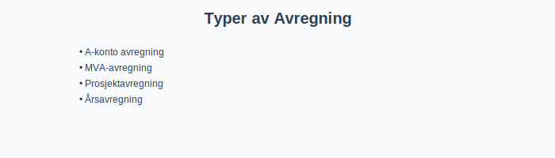
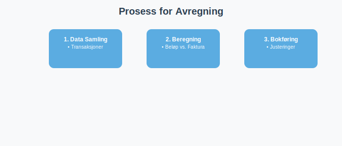

---
title: "Hva er Avregning i Regnskap?"
meta_title: "Hva er Avregning i Regnskap?"
meta_description: '**Avregning i regnskap** er prosessen for å **beregne** og **bokføre** korrekte beløp basert på estimater, delbetalinger, periodiseringer eller eksterne dat...'
slug: hva-er-avregning
type: blog
layout: pages/single
---

**Avregning i regnskap** er prosessen for å **beregne** og **bokføre** korrekte beløp basert på estimater, delbetalinger, periodiseringer eller eksterne data. Korrekt avregning sikrer at regnskapet reflekterer den faktiske økonomiske situasjonen og bidrar til **pålitelig økonomistyring** i norske bedrifter.


## Hva er Avregning?

Avregning innebærer å sammenligne og justere regnskapsdata for å sikre at alle beløp er korrekte og fullstendige. Dette kan omfatte:

* **Delbetalinger:** Som [A-konto betaling](/blogs/regnskap/hva-er-a-konto-betaling "Hva er A-konto Betaling? En Enkel Forklaring")
* **Estimater:** Som forbruk av tjenester eller materialer før endelig faktura foreligger
* **Rekonsiliering:** Som [MVA-avregning](/blogs/regnskap/hva-er-mva-melding "Hva er MVA-melding? Komplett Guide til Merverdiavgiftsrapportering i Norge")
* **Periodiseringer:** Som [opptjent ikke fakturert inntekt](/blogs/kontoplan/1530-opptjent-ikke-fakturert-inntekt "Konto 1530: Opptjent ikke fakturert inntekt - Komplett Guide til Periodisering")



## Typer Avregning

| Type avregning    | Beskrivelse                                                                                             | Eksempel                                |
|-------------------|---------------------------------------------------------------------------------------------------------|----------------------------------------|
| A-konto avregning | Delbetaling før endelig faktura via [A-konto betaling](/blogs/regnskap/hva-er-a-konto-betaling "Hva er A-konto Betaling? En Enkel Forklaring") | 30% ved bestilling, 70% ved levering |
| MVA-avregning     | Avstemming av merverdiavgift gjennom [MVA-melding](/blogs/regnskap/hva-er-mva-melding "Hva er MVA-melding? Komplett Guide til Merverdiavgiftsrapportering i Norge")      | Terminvise MVA-oppgjør              |
| Prosjektavregning | Justering basert på prosjektets ferdigstillelsesgrad                                                    | Bygg- og anleggsprosjekter           |
| Årsavregning      | Endelig avregning ved [Årsavslutning](/blogs/regnskap/hva-er-aarsavslutning "Årsavslutning i Regnskap - Komplett Guide til Årsoppgjør og Regnskapsavslutning")             | Justering av [avsetninger](/blogs/regnskap/avsetning "Avsetning i Regnskap - Komplett Guide til Avsetninger og Estimater")           |
| Lønnsavregning    | Avstemming av lønn og trygdeavgift                                                                      | [A-melding](/blogs/regnskap/hva-er-a-melding "Hva er A-melding? Komplett Guide til A-ordningen") og skattetrekk      |

## Prosess for Avregning

Trinnvis oversikt over avregningsprosessen:



### 1. Identifisering av Avregningsbehov

Første trinn er å identifisere hvilke transaksjoner som krever avregning:

* **Forskuddsbetaling:** Når kunden har betalt på forhånd
* **[Estimerte kostnader](/blogs/regnskap/hva-er-kostnader "Hva er Kostnader? Komplett Guide til Kostnadstyper og Regnskapsføring"):** Når faktisk kostnad ikke er kjent
* **[Periodiseringer](/blogs/regnskap/hva-er-periodisering "Hva er Periodisering? Komplett Guide til Periodisering i Regnskap"):** Inntekter og kostnader som tilhører regnskapsåret

### 2. Datainnsamling og Dokumentasjon

Sikre at alle relevante data er tilgjengelig:

* **[Bilag](/blogs/regnskap/bilag "Bilag i Regnskap - Komplett Guide til Regnskapsbilag og Dokumentasjon"):** Fakturaer, kvitteringer, kontrakter
* **Bankutskrifter:** For avstemming av betalinger
* **Tidsrapporter:** For lønnsavregning og prosjektarbeid

### 3. Beregning og Justering

Utføre selve avregningen:

* **Sammenligning:** Sammenlign estimater med faktiske tall
* **Justering:** Bokfør differanser på korrekte konti
* **Kontroll:** Sikre at alle justeringer er korrekte

### 4. Bokføring og Rapportering

Registrere avregningen i regnskapet:

* **[Kontering](/blogs/regnskap/hva-er-kontering "Hva er Kontering? Komplett Guide til Kontering i Regnskap"):** Bruke riktig [kontoplan](/blogs/regnskap/hva-er-kontoplan "Hva er Kontoplan? Komplett Guide til Kontoplaner i Norsk Regnskap")
* **Dokumentasjon:** Lagre alle støttedokumenter
* **Rapportering:** Inkludere i relevante rapporter

## Avregning i Kontoplan

Norsk standardkontoplan inneholder flere konti som brukes til avregning:

### Omløpsmidler (Klasse 1)

| Konto | Beskrivelse | Formål |
|-------|-------------|---------|
| [1530](/blogs/kontoplan/1530-opptjent-ikke-fakturert-inntekt "Konto 1530: Opptjent ikke fakturert inntekt - Komplett Guide til Periodisering") | Opptjent ikke fakturert inntekt | Avregning av inntekter |
| [1560](/blogs/kontoplan/1560-andre-fordringer-pa-selskap-samme-konsern "Konto 1560: Andre fordringer på selskap samme konsern - Komplett Guide til Konsernfordringer") | Andre fordringer på selskap samme konsern | Konsernmessig avregning |
| [1790](/blogs/kontoplan/1790-interimskonto "Konto 1790: Interimskonto - Komplett Guide til Midlertidige Regnskapsposter") | Interimskonto | Midlertidige avregninger |

### Kortsiktig Gjeld (Klasse 2)

| Konto | Beskrivelse | Formål |
|-------|-------------|---------|
| [2160](/blogs/kontoplan/2160-uopptjent-inntekt "Konto 2160: Uopptjent inntekt - Komplett Guide til Forhåndsbetaling") | Uopptjent inntekt | Avregning av forhåndsbetalinger |
| [2500](/blogs/kontoplan/2500-betalbar-skatt-ikke-utlignet "Konto 2500: Betalbar skatt ikke utlignet - Komplett Guide til Skatteberegning") | Betalbar skatt ikke utlignet | Skatteavregning |
| [2540](/blogs/kontoplan/2540-forhaandskatt "Konto 2540: Forskuddsskatt - Komplett Guide til Forskuddsbetaling") | Forskuddsskatt | Avregning av forskuddsskatt |

## Vanlige Avregningseksempler

### Eksempel 1: Prosjektavregning

**Situasjon:** Byggeprosjekt på 10 millioner kroner, 60% ferdig

**Beregning:**
* Kontraktsverdi: 10 000 000 kr
* Ferdigstillelse: 60%
* Opptjent inntekt: 6 000 000 kr
* Fakturert til nå: 5 500 000 kr
* **Avregning:** 500 000 kr til konto 1530

**Bokføring:**
```
Debet: 1530 Opptjent ikke fakturert inntekt  500 000
Kredit: 3000 Salgsinntekt                    500 000
```

### Eksempel 2: MVA-avregning

**Situasjon:** Termin 2 MVA-oppgjør

**Beregning:**
* Utgående MVA: 250 000 kr
* Inngående MVA: 180 000 kr
* **Til betaling:** 70 000 kr

**Bokføring:**
```
Debet: 2740 Skyldige offentlige avgifter       70 000
Kredit: 1920 Bankinnskudd                      70 000
```

### Eksempel 3: Lønnsavregning

**Situasjon:** Månedlig lønnsavregning

**Komponenter:**
* Bruttolønn: 450 000 kr
* Arbeidsgiveravgift: 63 000 kr
* Skattetrekk: 135 000 kr
* **Netto utbetaling:** 315 000 kr

## Digitalisering av Avregning

Moderne [ERP-systemer](/blogs/regnskap/hva-er-erp-system "Hva er ERP-system? Komplett Guide til ERP-systemer for Norske Bedrifter") kan automatisere mange avregningsprosesser:

### Automatiserte Funksjoner

* **Bankintegrasjon:** Automatisk avstemming av betalinger
* **Prosjektoppfølging:** Kontinuerlig beregning av ferdigstillelse
* **MVA-beregning:** Automatisk generering av MVA-melding
* **Periodisering:** Automatisk periodisering av faste kostnader

### Kontrollmiljø

* **Fireadde øyne-prinsipp:** Krav til godkjenning av avregninger
* **Sporbarhet:** Fullstendig auditspor for alle justeringer
* **Rapportering:** Automatisk generering av avregningsrapporter

## Lovgivning og Regnskapsstandarder

Avregning må følge norske regnskapsstandarder:

### Regnskapsloven

* **§ 4-1:** Krav til [god regnskapsskikk](/blogs/regnskap/god-regnskapsskikk "God regnskapsskikk - Komplett Guide til Regnskapsprinsipper og Beste Praksis")
* **§ 5-1:** Krav til regnskapets innhold og oppstilling
* **§ 6-1:** Krav til [internkontroll](/blogs/regnskap/hva-er-internkontroll "Hva er internkontroll? Komplett Guide til Internkontroll i Norske Bedrifter")

### Norsk Regnskapsstandard (NRS)

* **NRS 13:** Inntektsføring og avregning
* **NRS 15:** Anleggskontrakter og avregning
* **NRS 19:** Skatter og avregning

## Viktige Datoer for Avregning

### MÃ¥nedsavregning

* **Lønn:** 15. hver måned
* **MVA:** 10. i måneden etter terminen
* **Bankavstemminger:** MÃ¥nedlig

### Kvartalsavregning

* **[Ã…rsoppgave](/blogs/regnskap/hva-er-aarsoppgave "Hva er Ã…rsoppgave? Komplett Guide til Ã…rsoppgaven for Norske Bedrifter"):** 31. mai
* **Kvartalsrapporter:** 30 dager etter kvartalets slutt

### Ã…rsavregning

* **[Årsavslutning](/blogs/regnskap/hva-er-aarsavslutning "Årsavslutning i Regnskap - Komplett Guide til Årsoppgjør og Regnskapsavslutning"):** 31. desember
* **Årsregnskap:** 5 måneder etter regnskapsårets slutt

## Vanlige Feil ved Avregning

### Typiske Feilkilder

1. **Manglende periodisering:** Ikke å periodisere inntekter og kostnader korrekt
2. **Feil tidspunkt:** Feil regnskapsføring av avregninger
3. **Mangelfull dokumentasjon:** Ikke å dokumentere grunnlag for avregninger
4. **Dobbeltføring:** Å bokføre samme avregning flere ganger

### Kontrollrutiner

* **MÃ¥nedlig avstemming:** Regelmessig kontroll av alle mellomregnskap
* **Uavhengig kontroll:** Sørge for at andre kontrollerer avregninger
* **Systematisk gjennomgang:** Ã…rlig gjennomgang av avregningsrutiner

## Beste Praksis for Avregning

### Organisatoriske Tiltak

1. **Klare retningslinjer:** Etabler skriftlige rutiner for avregning
2. **Ansvarsdeling:** Skill mellom utførelse og kontroll
3. **Kompetanse:** Sikre at ansatte har nødvendig kompetanse
4. **Oppfølging:** Regelmessig oppfølging av avregningsprosesser

### Tekniske Tiltak

1. **Systemintegrasjon:** Koble sammen ulike systemer
2. **Automatisering:** Automatiser rutineavregninger
3. **Rapportering:** Etabler gode rapporteringsrutiner
4. **Backup:** Sikre backup av alle avregningsdata

## Fremtidens Avregning

### Teknologiske Trender

* **Kunstig intelligens:** AI-basert avregning og feildeteksjon
* **Blockchain:** Sikker og sporbar avregning
* **Sanntidsrapportering:** Kontinuerlig avregning og rapportering
* **Automatisering:** Fullautomatisk avregning av standardtransaksjoner

### Regulatoriske Endringer

* **Digitalisering:** Økt krav til digital rapportering
* **Sanntidsdata:** Myndighetenes krav til sanntidsdata
* **Internasjonalisering:** Harmonisering med internasjonale standarder

## Viktigheten av Avregning i Regnskap

Riktig avregning bidrar til:

* **Nøyaktighet:** Sikrer at regnskapet gjenspeiler reelle tall
* **Overholdelse:** Følger lover og regnskapsstandarder
* **Helhetlig kontroll:** Understøtter internkontroll og revisjon
* **Beslutningsgrunnlag:** Gir ledelsen korrekt informasjon
* **Tillit:** Skaper tillit hos interessenter og myndigheter

Riktig avregning er avgjørende for en **robust og pålitelig regnskapsrapportering** og fundamentet for god [økonomistyring](/blogs/regnskap/hva-er-oekonomistyring "Hva er økonomistyring? Komplett Guide til Økonomistyring i Norske Bedrifter").

## Oppsummering

Avregning er en kritisk prosess i norsk regnskap som omfatter alle typer justeringer og avstemminger for å sikre korrekte regnskapstall. Fra enkle A-konto betalinger til komplekse prosjektavregninger, krever hver type avregning systematisk tilnærming og solid dokumentasjon.

Ved å implementere robuste avregningsrutiner, bruke moderne teknologi og følge beste praksis, kan norske bedrifter sikre **transparent økonomistyring** og oppfylle alle regulatoriske krav. Avregning er ikke bare en teknisk prosess, men en strategisk aktivitet som bidrar til bedriftens langsiktige suksess.


