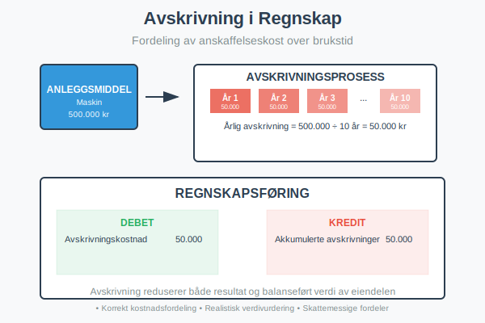
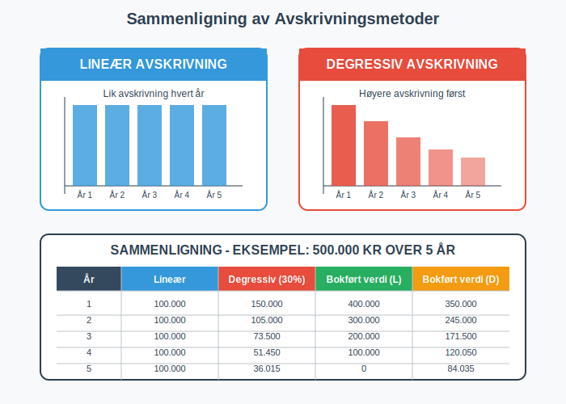
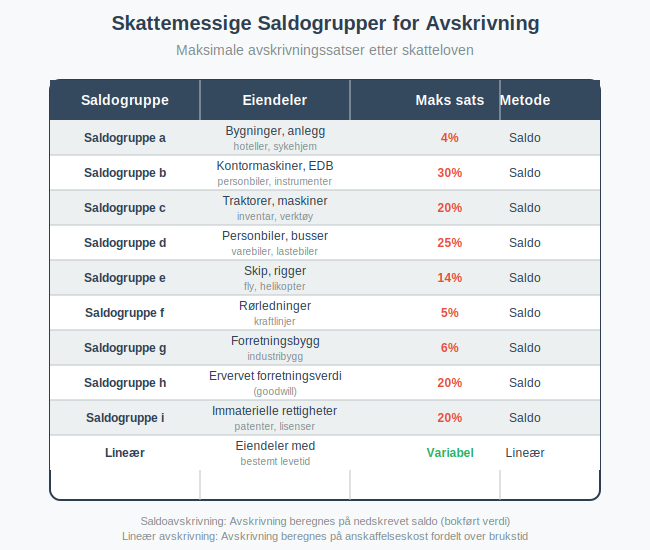

---
title: "Hva er Avskrivning i Regnskap?"
seoTitle: "Avskrivning | Metoder, satser og bokføring | ReAI"
description: "Avskrivning fordeler anskaffelseskost på anleggsmidler over brukstid. Lær lineær og saldoavskrivning, skattemessige satser og praktisk bokføring med eksempler."
summary: "Avskrivning forklart: metoder, skattemessige satser og bokføring."
---

**Avskrivning** er en regnskapsmessig metode for å fordele [anskaffelseskosten](/blogs/regnskap/hva-er-anskaffelseskost "Hva er Anskaffelseskost? Komplett Guide til Beregning og Regnskapsføring") til [anleggsmidler](/blogs/regnskap/hva-er-anleggsmidler "Hva er Anleggsmidler? Materielle, Immaterielle og Finansielle Eiendeler") over deres **brukstid**. Dette gjelder spesielt for [varige driftsmidler](/blogs/regnskap/hva-er-varige-driftsmidler "Hva er Varige Driftsmidler? Komplett Guide til Avskrivbare Anleggsmidler") som maskiner, bygninger og [transportmidler](/blogs/kontoplan/6010-avskrivning-pa-transportmidler-mask-og-invent "Konto 6010 - Avskrivning på transportmidler, maskiner og inventar"). Avskrivning gjenspeiler at eiendeler mister verdi over tid og sikrer korrekt kostnadsfordeling i [regnskapet](/blogs/regnskap/hva-er-regnskap "Hva er Regnskap? En komplett guide").

Avskrivning er en sentral del av kostnadsstyring og henger nært sammen med bredere kostnadsbegreper som [inntakskost og kostpris](/blogs/regnskap/hva-er-inntakskost "Hva er Inntakskost og Kostpris? Komplett Guide til Kostnadsberegning"), som omfatter alle aspekter av kostnadsberegning og -fordeling i virksomheten.

Før eiendelene kan avskrives over tid, må kostnaden **aktiveres** i balansen i henhold til regnskapsreglene. For en dypere forståelse av aktivering, se [Hva er Aktivering i Regnskap?](/blogs/regnskap/hva-er-aktivering "Hva er Aktivering i Regnskap?").



## Hva er Avskrivning?

Avskrivning er en **ikke-kontant kostnad** som reduserer den bokførte verdien av et anleggsmiddel over tid. Formålet er å:

* **Fordele kostnader** over eiendelens økonomiske levetid
* **Gjenspeile verdiforringelse** på grunn av slitasje og elde
* **Sikre korrekt resultatmåling** ved å matche kostnader med inntekter
* **Gi realistisk verdivurdering** av [aktiva](/blogs/regnskap/hva-er-aktiva "Hva er Aktiva? Komplett Guide til Eiendeler i Balansen") i balansen gjennom [balansebasert verdivurdering](/blogs/regnskap/hva-er-balansebasert-verdivurdering "Balansebasert Verdivurdering - Metoder, Prinsipper og Praktisk Anvendelse")

### Grunnleggende Prinsipper

Avskrivning bygger på **sammenstillingsprinsippet** i regnskapet:

- **Kostnader** skal føres i samme [termin](/blogs/regnskap/hva-er-termin "Hva er Termin? Regnskapsperioder og Terminplanlegging") som de tilhørende **inntektene**
- **Anleggsmidler** bidrar til inntektsgenerering over flere år
- **Anskaffelseskosten** må derfor fordeles over brukstiden på terminbasis
- **Akkumulerte avskrivninger** reduserer eiendelens bokførte verdi

## Avskrivningsmetoder

Det finnes flere metoder for å beregne avskrivninger, hver med sine fordeler og anvendelsesområder.



For en detaljert gjennomgang av **lineær avskrivning**, se vår egen artikkel [Lineær Avskrivning](/blogs/regnskap/lineaer-avskrivning "Lineær Avskrivning i Regnskap “ Guide til Beregning og Eksempler").

### Lineær Avskrivning

**Lineær avskrivning** er den mest brukte metoden i Norge. Den fordeler anskaffelseskosten jevnt over eiendelens brukstid.

#### Formel for Lineær Avskrivning:
```
Årlig avskrivning = (Anskaffelseskost - Restverdi) ÷ Brukstid i år
```

#### Eksempel: Lineær Avskrivning
En maskin kjøpes for **500.000 kr** med forventet brukstid på **10 år** og restverdi på **50.000 kr**.

**Beregning:**
- Avskrivningsgrunnlag: 500.000 - 50.000 = 450.000 kr
- Årlig avskrivning: 450.000 ÷ 10 = 45.000 kr per år
- Avskrivningssats: 45.000 ÷ 500.000 = 9% per år

### Degressiv Avskrivning (Saldoavskrivning)

**[Saldoavskrivning](/blogs/regnskap/hva-er-saldoavskrivning "Hva er Saldoavskrivning i Regnskap? Komplett Guide til Degressiv Avskrivning")** (degressiv avskrivning) gir høyere avskrivning i de første årene og lavere senere. Dette gjenspeiler at mange eiendeler mister mest verdi tidlig i brukstiden.

#### Formel for Degressiv Avskrivning:
```
Årlig avskrivning = Bokført verdi × Avskrivningssats
```

#### Eksempel: Degressiv Avskrivning
Samme maskin med **25% avskrivningssats**:

| År | Bokført verdi (start) | Avskrivning | Bokført verdi (slutt) |
|----|----------------------|-------------|----------------------|
| 1  | 500.000             | 125.000     | 375.000              |
| 2  | 375.000             | 93.750      | 281.250              |
| 3  | 281.250             | 70.313      | 210.937              |
| 4  | 210.937             | 52.734      | 158.203              |
| 5  | 158.203             | 39.551      | 118.652              |

### Valg av Avskrivningsmetode

Valget mellom metodene avhenger av:

* **Eiendelens karakter:** Teknologi avskrives ofte degressivt
* **Bruksmønster:** Jevn bruk favoriserer lineær avskrivning
* **Skattemessige regler:** [Saldogrupper](/blogs/regnskap/saldogruppe "Hva er Saldogruppe? Guide til Skattemessige Avskrivningsgrupper") krever degressiv avskrivning
* **Regnskapsstandarder:** IFRS kan kreve spesifikke metoder

## Skattemessige Avskrivninger

I Norge reguleres skattemessige avskrivninger av **[skatteloven](/blogs/regnskap/hva-er-skatt "Hva er Skatt? Komplett Guide til Bedriftsskatt, MVA og Skatteplanlegging")** gjennom et system med **[saldogrupper](/blogs/regnskap/saldogruppe "Hva er Saldogruppe? Guide til Skattemessige Avskrivningsgrupper")**.



### Viktige Saldogrupper

| Saldogruppe | Eiendeler | Maksimal sats | Metode |
|-------------|-----------|---------------|---------|
| **a** | Bygninger, hoteller | 4% | Saldo |
| **b** | Kontormaskiner, EDB | 30% | Saldo |
| **c** | Maskiner, inventar | 20% | Saldo |
| **d** | Biler, transportmidler | 25% | Saldo |
| **e** | Skip, fly | 14% | Saldo |
| **f** | Rørledninger | 5% | Saldo |
| **g** | Forretningsbygg | 6% | Saldo |
| **h** | Goodwill | 20% | Saldo |
| **i** | Immaterielle rettigheter | 20% | Saldo |

### Forskjell Mellom Regnskapsmessig og Skattemessig Avskrivning

**Regnskapsmessig avskrivning:**
- Basert på **faktisk brukstid** og **økonomisk levetid**
- Kan bruke **lineær** eller **degressiv** metode
- Skal gjenspeile **reell verdiforringelse**

**Skattemessig avskrivning:**
- Følger **faste satser** i skatteloven
- Hovedsakelig **saldoavskrivning**
- Kan avvike fra regnskapsmessig avskrivning
- Utgjør en viktig kategori av **skattefradrag** for virksomheter

Avskrivninger er en av de viktigste kategoriene av fradragsberettigede kostnader i norsk skatterett. For en omfattende oversikt over alle typer skattefradrag og reglene som gjelder, se vår detaljerte guide om [fradrag i regnskap](/blogs/regnskap/hva-er-fradrag "Hva er fradrag i regnskap? Komplett Guide til Skattefradrag og Regnskapsføring").

## Regnskapsføring av Avskrivninger

### Grunnleggende Regnskapsføring

Avskrivninger regnskapsføres månedlig eller årlig med følgende bilag:

```
Debet: Avskrivningskostnad (kostnadskonto)
Kredit: Akkumulerte avskrivninger (motkonto til anleggsmiddel)
```

### Eksempel: Månedlig Avskrivning

For maskinen i eksemplet over (45.000 kr årlig):
- **Månedlig avskrivning:** 45.000 ÷ 12 = 3.750 kr

**Regnskapsføring hver måned:**
```
Debet: Avskrivningskostnad        3.750
Kredit: Akkumulerte avskrivninger 3.750
```

### Påvirkning på Regnskapet

#### Resultatregnskap
- **Avskrivningskostnad** reduserer **[driftsresultatet](/blogs/regnskap/hva-er-driftsresultat "Hva er Driftsresultat? Komplett Guide til Beregning og Analyse")**
- Kostnaden er **fradragsberettiget** skattemessig
- Påvirker **kontantstrøm** indirekte gjennom skatt

#### Balanse
- **Anleggsmiddel** vises til **historisk kost**
- **Akkumulerte avskrivninger** trekkes fra som **motkonto**
- **Bokført verdi** = Historisk kost - Akkumulerte avskrivninger

### Eksempel: Balansepresentasjon

| Anleggsmidler | År 1 | År 2 | År 3 |
|---------------|------|------|------|
| Maskiner (historisk kost) | 500.000 | 500.000 | 500.000 |
| Akkumulerte avskrivninger | (45.000) | (90.000) | (135.000) |
| **Bokført verdi** | **455.000** | **410.000** | **365.000** |

## Praktiske Eksempler

### Eksempel 1: Kontormøbler

Et selskap kjøper kontormøbler for **200.000 kr** med forventet brukstid på **8 år** og restverdi på **20.000 kr**.

**Lineær avskrivning:**
- Avskrivningsgrunnlag: 200.000 - 20.000 = 180.000 kr
- Årlig avskrivning: 180.000 ÷ 8 = 22.500 kr
- Månedlig avskrivning: 22.500 ÷ 12 = 1.875 kr

**Skattemessig (saldogruppe c - 20%):**
- År 1: 200.000 × 20% = 40.000 kr
- År 2: 160.000 × 20% = 32.000 kr
- År 3: 128.000 × 20% = 25.600 kr

### Eksempel 2: Firmabil

En firmabil kjøpes for **400.000 kr** med forventet brukstid på **5 år** og restverdi på **100.000 kr**.

**Regnskapsmessig (lineær):**
- Årlig avskrivning: (400.000 - 100.000) ÷ 5 = 60.000 kr

**Skattemessig (saldogruppe d - 25%):**
- År 1: 400.000 × 25% = 100.000 kr
- År 2: 300.000 × 25% = 75.000 kr
- År 3: 225.000 × 25% = 56.250 kr

### Midlertidige Forskjeller

Forskjellen mellom regnskapsmessig og skattemessig avskrivning skaper **midlertidige forskjeller** som må håndteres i regnskapet:

- **[Utsatt skatt](/blogs/regnskap/hva-er-skatt "Hva er Skatt? Komplett Guide til Bedriftsskatt, MVA og Skatteplanlegging")** når skattemessig avskrivning > regnskapsmessig
- **Utsatt skattefordel** når regnskapsmessig avskrivning > skattemessig

## Spesielle Situasjoner

### Komponentavskrivning

For store og komplekse anleggsmidler kan **komponentavskrivning** være nødvendig:

* **Bygninger:** Tak, fasade, tekniske installasjoner avskrives separat
* **Maskiner:** Hovedkomponent og reservedeler med ulik levetid
* **IT-systemer:** Maskinvare og programvare avskrives forskjellig

### Nedskrivning vs. Avskrivning

**Avskrivning** er planlagt verdiforringelse, mens **[nedskrivning](/blogs/regnskap/hva-er-nedskrivning "Hva er Nedskrivning? Komplett Guide til Nedskrivning av Eiendeler i Norsk Regnskap")** er verdifall utover normal avskrivning:

- **Avskrivning:** Systematisk fordeling over brukstid
- **[Nedskrivning](/blogs/regnskap/hva-er-nedskrivning "Hva er Nedskrivning? Komplett Guide til Nedskrivning av Eiendeler i Norsk Regnskap"):** Plutselig verdifall (teknologisk utvikling, skade)
- **Reversering:** Nedskrivninger kan reverseres, avskrivninger ikke

Ved vurdering av nedskrivningsbehov beregnes gjenvinnbart beløp ofte ved [diskontering](/blogs/regnskap/hva-er-diskontering "Hva er Diskontering? Komplett Guide til Nåverdi og Diskonterte Kontantstrømmer") av fremtidige kontantstrømmer til nåverdi.

### Avskrivning ved Salg

Ved salg av anleggsmiddel før utløp av brukstiden:

1. **Beregn akkumulerte avskrivninger** frem til salgsdato
2. **Bokført verdi** = Anskaffelseskost - Akkumulerte avskrivninger
3. **Gevinst/tap** = Salgspris - Bokført verdi

**Eksempel:**
- Maskin kjøpt for 500.000 kr, avskrevet med 180.000 kr
- Bokført verdi: 320.000 kr
- Salgspris: 350.000 kr
- **Gevinst:** 350.000 - 320.000 = 30.000 kr

## Avskrivning og Kontantstrøm

### Ikke-kontant Kostnad

Avskrivning er en **ikke-kontant kostnad**:

* **Reduserer resultat** uten å påvirke kontantstrøm direkte
* **Skatteeffekt:** Reduserer skattbar inntekt og dermed skatt
* **Kontantstrømanalyse:** Legges tilbake til nettoresultat og brukes til [selvfinansiering](/blogs/regnskap/hva-er-selvfinansiering "Hva er Selvfinansiering? Komplett Guide til Intern Finansiering og Kapitaloppbygging")

### Skatteeffekt av Avskrivninger

**Eksempel på skatteeffekt:**
- Avskrivning: 100.000 kr
- Skattesats: 22%
- **Skattebesparelse:** 100.000 × 22% = 22.000 kr
- **Netto kontantstrømeffekt:** 22.000 kr (positiv)

## Digitale Verktøy og Automatisering

### Regnskapssystemer

Moderne regnskapssystemer automatiserer avskrivningsberegninger:

* **Automatisk beregning** basert på forhåndsdefinerte regler
* **Månedlige avsetninger** for jevn kostnadsfordeling
* **Rapportering** av både regnskapsmessige og skattemessige avskrivninger
* **Sporing** av individuelle anleggsmidler

### Anleggsmiddelregister

Et godt **anleggsmiddelregister** inneholder:

- **Identifikasjon:** Unikt nummer, beskrivelse, lokasjon
- **Økonomiske data:** Anskaffelseskost, avskrivningsmetode, brukstid
- **Avskrivningshistorikk:** Akkumulerte avskrivninger, bokført verdi
- **Vedlikehold:** Kostnader, oppgraderinger, reparasjoner

## Vanlige Feil og Fallgruver

### Typiske Feil

* **Glemme avskrivninger:** Fører til overvurderte aktiva og feil resultat
* **Feil brukstid:** For kort/lang periode gir feil kostnadsfordeling
* **Blande metoder:** Inkonsistent bruk av lineær vs. degressiv
* **Ignorere restverdi:** Påvirker avskrivningsgrunnlaget betydelig

### Beste Praksis

1. **Etabler klare retningslinjer** for avskrivningsmetoder
2. **Vurder brukstid** realistisk basert på erfaring
3. **Dokumenter valg** av metoder og forutsetninger
4. **Gjennomgå regelmessig** om forutsetninger fortsatt gjelder
5. **Skill mellom** regnskapsmessige og skattemessige avskrivninger

## Forskjell fra Amortisering

Mange forveksler avskrivning med [amortisering](/blogs/regnskap/hva-er-amortisering "Hva er Amortisering? Forskjell fra Avskrivninger og Praktiske Eksempler"), men det er viktige forskjeller:

| Aspekt | Avskrivning | Amortisering |
|--------|-------------|--------------|
| **Gjelder** | Materielle anleggsmidler | Immaterielle eiendeler |
| **Eksempler** | Bygninger, maskiner, biler | Goodwill, patenter, programvare |
| **Metoder** | Lineær eller degressiv | Hovedsakelig lineær |
| **Synlighet** | Fysisk slitasje observerbar | Verdiforringelse mindre synlig |

## Internasjonale Standarder

### IFRS vs. Norsk GAAP

**IFRS-krav:**
- **Komponentavskrivning** obligatorisk for betydelige komponenter
- **Årlig vurdering** av brukstid og restverdi
- **Nedskrivningstester** ved indikasjoner på verdifall

**Norsk GAAP:**
- **Enklere regler** for små og mellomstore bedrifter
- **Mindre detaljkrav** til komponentavskrivning
- **Praktisk tilnærming** til vurderinger

## Relaterte Begreper

For å forstå avskrivning fullt ut, bør du også kjenne til:

- **[Anleggsmidler](/blogs/regnskap/hva-er-anleggsmidler "Hva er Anleggsmidler? Materielle, Immaterielle og Finansielle Eiendeler")** - Eiendelene som avskrives
- **[Anskaffelseskost](/blogs/regnskap/hva-er-anskaffelseskost "Hva er Anskaffelseskost? Komplett Guide til Beregning og Regnskapsføring")** - Grunnlaget for avskrivningsberegning
- **[Aktiva](/blogs/regnskap/hva-er-aktiva "Hva er Aktiva? Komplett Guide til Eiendeler i Balansen")** - Hvor avskrivninger påvirker balansen
- **[Amortisering](/blogs/regnskap/hva-er-amortisering "Hva er Amortisering? Forskjell fra Avskrivninger og Praktiske Eksempler")** - Tilsvarende prinsipp for immaterielle eiendeler

## Konklusjon

**Avskrivning** er et fundamentalt regnskapsprinsipp som sikrer korrekt kostnadsfordeling og realistisk verdivurdering av anleggsmidler. Ved å forstå de ulike metodene, [skattemessige reglene](/blogs/regnskap/hva-er-skatt "Hva er Skatt? Komplett Guide til Bedriftsskatt, MVA og Skatteplanlegging") og praktiske anvendelsene, kan bedrifter:

* **Optimalisere** skatteposisjonen gjennom riktig avskrivningsstrategi
* **Forbedre** beslutningsgrunnlaget for investeringer
* **Sikre** korrekt regnskapsføring og rapportering
* **Unngå** vanlige feil som kan påvirke resultat og balanse

Korrekt håndtering av avskrivninger er essensielt for å gi et **rettvisende bilde** av bedriftens økonomiske stilling og resultater. Avskrivningsberegninger er en kritisk komponent i [årsavslutning](/blogs/regnskap/hva-er-aarsavslutning "Hva er Årsavslutning i Regnskap? Komplett Guide til Årsoppgjør og Regnskapsavslutning"), hvor alle anleggsmidler må vurderes og årets avskrivninger beregnes for å sikre korrekte årsregnskap.
 
## Realisering ved avhending

Når eiendeler selges eller avhendes, må den bokførte verdien realiseres, og eventuell gevinst eller tap må resultatføres. For detaljer om dette, se [Realisering](/blogs/regnskap/realisering "Realisering i regnskap: Gevinst og tap ved salg av eiendeler").


