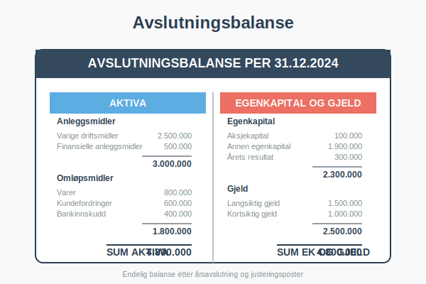
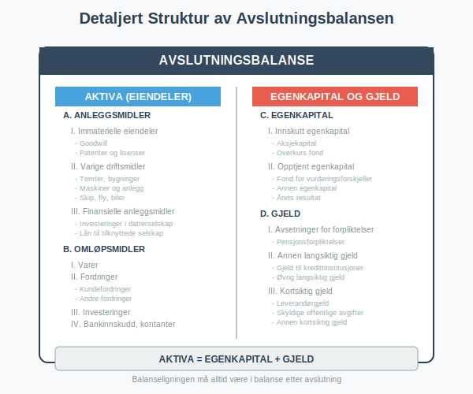

En **avslutningsbalanse** er den endelige [balansen](/blogs/regnskap/hva-er-aktiva "Hva er Aktiva? Komplett Guide til Eiendeler i Balansen") som viser et selskaps finansielle stilling ved slutten av et [regnskapsår](/blogs/regnskap/hva-er-regnskap "Hva er Regnskap? En komplett guide"). Dette er balansen etter at alle transaksjoner er registrert, justeringsposter er ført, og [årsavslutningsprosessen](/blogs/regnskap/hva-er-aarsavslutning "Hva er Årsavslutning i Regnskap? Komplett Guide til Årsoppgjør og Regnskapsavslutning") er fullført.



### Hva er en Avslutningsbalanse?

Avslutningsbalansen representerer selskapets **endelige finansielle posisjon** på balansedagen og danner grunnlaget for:

* **Årsrapporten:** Offisiell rapportering til interessenter
* **Skatteberegning:** Grunnlag for skattepliktig resultat og [skattemelding](/blogs/regnskap/skattemelding "Skattemelding - Komplett Guide til Utfylling og Innlevering")
* **[Inngående balanse](/blogs/regnskap/inngaaende-balanse "Hva er Inngående Balanse? Komplett Guide til Åpningsbalanse"):** Startpunkt for neste regnskapsår (avslutningsbalansens [utgående balanse](/blogs/regnskap/hva-er-utgaaende-balanse "Hva er Utgående Balanse (UB)? Komplett Guide til Saldooverføring") blir neste års inngående balanse)
* **Kreditorvurdering:** Vurdering av selskapets soliditet
* **Investorbeslutninger:** Grunnlag for investeringsvurderinger

Avslutningsbalansen skiller seg fra løpende balanser ved at den inkluderer alle **avslutningsjusteringer** og **[periodiseringer](/blogs/regnskap/hva-er-periodisering "Hva er Periodisering i Regnskap? Komplett Guide til Periodiseringsprinsippet")** som sikrer korrekt [periodisering](/blogs/regnskap/hva-er-periodisering "Hva er Periodisering i Regnskap? Komplett Guide til Periodiseringsprinsippet") av inntekter og kostnader.


### Prosessen for Utarbeidelse av Avslutningsbalanse

#### 1. Råbalanse
Første steg er å utarbeide en **råbalanse** basert på løpende bokføring:

* **Kontosaldoer:** Alle kontoer med saldo per balansedagen
* **Foreløpige tall:** Før justeringsposter og avslutning
* **Grunnlag for justering:** Identifisering av nødvendige justeringer

#### 2. Justeringsposter
Kritiske justeringer som må foretas:

**Periodiseringer:**
* **Påløpte kostnader:** Kostnader som tilhører perioden men ikke er fakturert
* **Påløpte inntekter:** Inntekter som tilhører perioden men ikke er fakturert
* **Forskuddsbetalte kostnader:** Kostnader betalt på forskudd for neste periode
* **Forskuddsmottatte inntekter:** Inntekter mottatt på forskudd for neste periode

**Verdireguleringer:**
* **[Avskrivninger](/blogs/regnskap/hva-er-avskrivning "Hva er Avskrivning? Metoder og Beregning"):** Planmessige avskrivninger på [anleggsmidler](/blogs/regnskap/hva-er-anleggsmidler "Hva er Anleggsmidler? Typer og Regnskapsføring")
* **Nedskrivninger:** Verdifall på eiendeler
* **Oppskrivninger:** Verdijusteringer oppover (begrenset)


#### 3. Avslutningsposter
**Resultatavslutning:**
* Alle inntektskontoer nullstilles mot resultatkonto
* Alle kostnadskontoer nullstilles mot resultatkonto
* Årets resultat overføres til egenkapitalen som [utgående balanse](/blogs/regnskap/hva-er-utgaaende-balanse "Hva er Utgående Balanse (UB)? Komplett Guide til Saldooverføring")

**Disposisjoner:**
* Utbytte til aksjonærer
* Overføringer til/fra fond
* Avsettinger til fremtidige forpliktelser

### Struktur og Innhold i Avslutningsbalansen

#### Eiendeler (Aktiva)

| **Anleggsmidler** | **Beskrivelse** | **Eksempel** |
|-------------------|-----------------|--------------|
| Immaterielle eiendeler | Ikke-fysiske eiendeler | Goodwill, patenter, programvare |
| Varige driftsmidler | Fysiske anleggsmidler | Bygninger, maskiner, inventar |
| Finansielle anleggsmidler | Langsiktige investeringer | Aksjer, obligasjoner, lån |

| **Omløpsmidler** | **Beskrivelse** | **Eksempel** |
|------------------|-----------------|--------------|
| Varer | Lagerbeholdning | Råvarer, varer under tilvirkning, ferdigvarer |
| Fordringer | Krav på betaling | Kundefordringer, andre fordringer |
| Investeringer | Kortsiktige plasseringer | Markedsbaserte verdipapirer |
| Bankinnskudd | Likvide midler | Kontanter, bankinnskudd |

#### Egenkapital og Gjeld

| **Egenkapital** | **Beskrivelse** | **Eksempel** |
|-----------------|-----------------|--------------|
| Innskutt egenkapital | Kapital fra eierne | [Aksjekapital](/blogs/regnskap/hva-er-aksjekapital "Hva er Aksjekapital? Krav og Forklaring"), [overkurs](/blogs/regnskap/hva-er-overkurs "Hva er Overkurs? En Guide til Overkurs i Regnskap") |
| Opptjent egenkapital | Akkumulert resultat | Annen egenkapital, årets resultat |

| **Gjeld** | **Beskrivelse** | **Eksempel** |
|-----------|-----------------|--------------|
| Avsetninger | Usikre forpliktelser | Pensjonsforpliktelser, garantiavsetninger |
| Annen langsiktig gjeld | Gjeld > 1 år | Banklån, obligasjoner |
| Kortsiktig gjeld | Gjeld < 1 år | Leverandørgjeld, skyldige offentlige avgifter |



### Forskjeller mellom Inngående Balanse og Avslutningsbalanse

#### [Inngående Balanse](/blogs/regnskap/inngaaende-balanse "Hva er Inngående Balanse? Komplett Guide til Åpningsbalanse")
* **Tidspunkt:** 1. januar (første dag i regnskapsåret)
* **Grunnlag:** Forrige års avslutningsbalanse
* **Justeringer:** Kun eventuelle rettelser av feil
* **Formål:** Startpunkt for ny regnskapsperiode

#### Avslutningsbalanse
* **Tidspunkt:** 31. desember (siste dag i regnskapsåret)
* **Grunnlag:** Løpende bokføring + justeringsposter
* **Justeringer:** Omfattende [periodiseringer](/blogs/regnskap/hva-er-periodisering "Hva er Periodisering i Regnskap? Komplett Guide til Periodiseringsprinsippet") og verdireguleringer
* **Formål:** Endelig rapportering av finansiell stilling

| **Aspekt** | **Inngående Balanse** | **Avslutningsbalanse** |
|------------|-------------------|------------------------|
| **Kompleksitet** | Enkel overføring | Omfattende justeringer |
| **Usikkerhet** | Lav (kjente tall) | Høyere (estimater og vurderinger) |
| **Revisjonsomfang** | Begrenset | Omfattende |
| **Regulatoriske krav** | Minimale | Strenge krav til dokumentasjon |

### Juridiske Krav og Standarder

#### Regnskapsloven
**Krav til avslutningsbalanse:**
* **Rettvisende bilde:** Balansen må gi et rettvisende bilde av selskapets stilling
* **Forsiktighet:** Konservativ verdsetting av eiendeler og gjeld
* **Sammenlignbarhet:** Konsistent anvendelse av regnskapsprinsipper
* **Vesentlighet:** Alle vesentlige poster må være inkludert

#### Regnskapsstandarder
**Norsk Regnskapsstandard (NRS):**
* Detaljerte krav til klassifisering og verdsetting
* Spesifikke krav til noter og tilleggsopplysninger
* Krav til sammenligningstall fra foregående år

**IFRS (for børsnoterte selskaper):**
* Internasjonale standarder for regnskapsføring
* Mer detaljerte krav til virkelig verdi-vurderinger
* Omfattende notekrav

### Praktiske Eksempler

#### Eksempel 1: Mindre Aksjeselskap
**Selskap:** Håndverker AS
**Omsetning:** 5 millioner kr

**Viktige avslutningsposter:**
```
Påløpte feriepenger:
Debet: Lønnskostnad          150.000
Kredit: Skyldig feriepenger  150.000

Avskrivning maskiner:
Debet: Avskrivning           200.000
Kredit: Akk. avskrivning     200.000

Periodisering forsikring:
Debet: Forskuddsbetalt       25.000
Kredit: Forsikringskostnad   25.000
```

#### Eksempel 2: Handelsbedrift
**Selskap:** Import AS
**Omsetning:** 20 millioner kr

**Spesielle vurderinger:**
* **Varelageret:** Verdsetting til laveste av kost og netto realisasjonsverdi
* **Kundefordringer:** Vurdering av tapsutsatte fordringer
* **Valutaeksponering:** Omregning av utenlandsk gjeld


### Kvalitetssikring og Kontroll

#### Intern Kontroll
**Kontrollaktiviteter:**
* **Avstemming:** Alle balansekontoer avstemmes mot underlag
* **Analytisk gjennomgang:** Sammenligning med budsjett og foregående år
* **Dokumentasjon:** All dokumentasjon arkiveres systematisk
* **Godkjenning:** Formell godkjenning av justeringsposter

#### Ekstern Revisjon
**Revisjonshandlinger:**
* **Substansrevisjon:** Detaljert gjennomgang av vesentlige poster
* **Analytiske handlinger:** Analyse av nøkkeltall og utviklingstrender
* **Bekreftelser:** Eksterne bekreftelser fra banker og kunder
* **Etterfølgende hendelser:** Vurdering av hendelser etter balansedagen

### Digitalisering og Moderne Verktøy

#### Regnskapssystemer
**Automatiserte prosesser:**
* **Periodiseringer:** Automatisk beregning av påløpte poster
* **Avskrivninger:** Automatiske avskrivningsberegninger
* **Valutaomregning:** Automatisk omregning til balansedagskurs
* **Rapportgenerering:** Automatisk generering av balanserapporter

#### Kunstig Intelligens
**AI-støttede funksjoner:**
* **Anomalideteksjon:** Identifisering av uvanlige transaksjoner
* **Prediktiv analyse:** Forventet utvikling av nøkkeltall
* **Automatisk kategorisering:** Intelligent klassifisering av transaksjoner

### Vanlige Feil og Fallgruver

#### Typiske Feil
* **Manglende [periodiseringer](/blogs/regnskap/hva-er-periodisering "Hva er Periodisering i Regnskap? Komplett Guide til Periodiseringsprinsippet"):** Ikke registrerte påløpte poster
* **Feil verdsetting:** Ikke-korrekt verdsetting av eiendeler
* **Klassifiseringsfeil:** Feil plassering av poster i balansen
* **Manglende dokumentasjon:** Utilstrekkelig dokumentasjon av vurderinger

#### Konsekvenser av Feil
* **Feilaktig resultat:** Påvirker årets resultat og skattegrunnlag
* **Kreditorrisiko:** Feilaktig fremstilling av selskapets soliditet
* **Regulatoriske sanksjoner:** Bøter og andre sanksjoner fra myndigheter
* **Omdømmeskade:** Tap av tillit fra interessenter


### Bruk av Avslutningsbalansen

#### For Ledelsen
* **Strategiske beslutninger:** Grunnlag for fremtidige investeringer
* **Finansiering:** Vurdering av finansieringsbehov
* **Risikostyring:** Identifisering av finansielle risikoer
* **Prestasjonsmåling:** Evaluering av selskapets prestasjoner

#### For Investorer
* **Investeringsbeslutninger:** Vurdering av investeringsmuligheter
* **Verdsetting:** Grunnlag for verdsetting av selskapet
* **Risikoevaluering:** Vurdering av investeringsrisiko
* **Sammenligning:** Sammenligning med andre selskaper

#### For Kreditorer
* **Kredittvurdering:** Vurdering av selskapets kredittverdighet
* **Sikkerhet:** Vurdering av sikkerhet for lån
* **Overvåking:** Løpende overvåking av låntakers finansielle helse
* **Covenant-testing:** Kontroll av lånevilkår

### Nøkkeltall fra Avslutningsbalansen

#### Soliditetstall
* **Egenkapitalandel:** Egenkapital / Sum eiendeler
* **Gjeldsgrad:** Total gjeld / Egenkapital
* **[Rentedekningsgrad](/blogs/regnskap/hva-er-dekningsgrad "Hva er Dekningsgrad? Komplett Guide til Beregning og Analyse"):** Driftsresultat / Rentekostnader

#### Likviditetstall
* **Likviditetsgrad 1:** Omløpsmidler / Kortsiktig gjeld
* **Likviditetsgrad 2:** (Omløpsmidler - Varer) / Kortsiktig gjeld
* **Arbeidskapital:** Omløpsmidler - Kortsiktig gjeld

#### Lønnsomhetstall
* **Totalkapitalrentabilitet:** (Resultat + Rentekostnader) / Gjennomsnittlig totalkapital
* **Egenkapitalrentabilitet:** Årets resultat / Gjennomsnittlig egenkapital


### Fremtidige Utviklingstrender

#### Teknologiske Endringer
* **Sanntidsrapportering:** Kontinuerlig oppdatering av balanseinformasjon
* **Blockchain:** Økt transparens og sporbarhet
* **Automatisering:** Redusert manuelt arbeid i avslutningsprosessen

#### Regulatoriske Endringer
* **Økt digitalisering:** Krav til elektronisk rapportering
* **Bærekraftsrapportering:** Integrering av ESG-faktorer
* **Internasjonalisering:** Harmonisering av regnskapsstandarder

### Relaterte Begreper

For å forstå avslutningsbalanse fullt ut, bør du også sette deg inn i:

* **[Aktiva](/blogs/regnskap/hva-er-aktiva "Hva er Aktiva? Komplett Guide til Eiendeler i Balansen")** - Eiendelssiden av balansen
* **[Anleggsmidler](/blogs/regnskap/hva-er-anleggsmidler "Hva er Anleggsmidler? Typer og Regnskapsføring")** - Langsiktige eiendeler i balansen
* **[Avskrivning](/blogs/regnskap/hva-er-avskrivning "Hva er Avskrivning? Metoder og Beregning")** - Viktig justeringspost i avslutningen
* **[Aksjekapital](/blogs/regnskap/hva-er-aksjekapital "Hva er Aksjekapital? Krav og Forklaring")** - Del av egenkapitalen i balansen
* **[Regnskap](/blogs/regnskap/hva-er-regnskap "Hva er Regnskap? En komplett guide")** - Det overordnede regnskapssystemet


