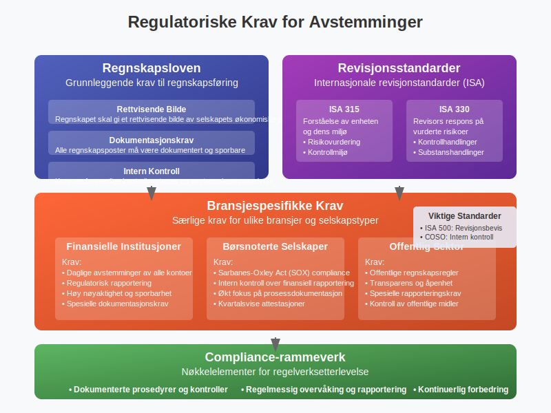

**Avstemming i regnskap** er en kritisk prosess som sikrer at regnskapsdata er nøyaktige og pålitelige. Dette innebærer å sammenligne og kontrollere regnskapsposter mot eksterne kilder og interne kontroller for å identifisere og korrigere eventuelle avvik. Avstemming er en sentral del av [QA (Quality Assurance)](/blogs/regnskap/hva-er-qa-kvalitetssikring "Hva er QA (Quality Assurance) i Regnskap? Komplett Guide til Kvalitetssikring") i regnskapsføring.


## Hva er Avstemming?

Avstemming er prosessen med å **kontrollere og bekrefte** at regnskapsdata stemmer overens med:

* **Eksterne kilder:** Som [bankutskrifter](/blogs/regnskap/hva-er-kontoutskrift "Hva er Kontoutskrift i Regnskap? En Guide til Kontoutskrifter"), leverandørfakturaer og kundebekreftelser
* **Interne kontroller:** Som [varetelling](/blogs/regnskap/varetelling "Varetelling: Systematisk Lageropptelling og Korreksjon") og anleggsmiddelregistre
* **Systemdata:** Mellom ulike regnskapssystemer og moduler

Formålet er å sikre at [regnskapet](/blogs/regnskap/hva-er-regnskap "Hva er Regnskap? En komplett guide") gir et rettvisende bilde av selskapets økonomiske situasjon.


Sluttoppgjøret er den endelige fasen der alle avstemminger og justeringer bekreftes. Se nærmere på [Sluttoppgjør i regnskap](/blogs/regnskap/sluttoppgjor "Sluttoppgjør i regnskap") for en grundig gjennomgang av denne prosessen.

## Typer Avstemminger

### Bankavstemminger

**Bankavstemminger** er den vanligste formen for avstemming og innebærer å sammenligne selskapets kassabok med [bankens kontoutskrift](/blogs/regnskap/hva-er-kontoutskrift "Hva er Kontoutskrift i Regnskap? En Guide til Kontoutskrifter"). Dette krever grundig forståelse av [banktransaksjoner](/blogs/regnskap/hva-er-banktransaksjoner "Hva er Banktransaksjoner i Regnskap? Typer, Regnskapsføring og Kontroll") og deres regnskapsføring. For en detaljert guide til bankavstemming, se vår [omfattende artikkel om bankavstemming](/blogs/regnskap/hva-er-bankavstemming "Hva er Bankavstemming i Regnskap? Komplett Guide").

#### Hovedkomponenter i Bankavstemminger:

* **Innskudd i transitt:** Innskudd registrert i kassaboken men ikke ennå på bankutskriften
* **Utestående sjekker:** Sjekker utstedt men ikke ennå innløst av banken
* **Bankgebyrer:** Gebyrer trukket av banken men ikke registrert i kassaboken
* **Renteinntekter:** Renter kreditert av banken men ikke registrert


### Balanseavstemminger

Balanseavstemminger sikrer at alle [balanseposter](/blogs/regnskap/hva-er-aktiva "Hva er Aktiva? Forklaring av Eiendeler i Balansen") er korrekt dokumentert og støttet av underliggende dokumentasjon. [Saldobalansen](/blogs/regnskap/hva-er-saldobalanse "Hva er Saldobalanse i Regnskap? Komplett Guide til Utarbeidelse og Analyse") fungerer som det grunnleggende verktøyet for å sikre at alle kontoer er riktig avstemt og at regnskapsligningen er i balanse.

#### Viktige Balanseposter å Avstemme:

| Balansepost | Avstemmingsmetode | Hyppighet |
|-------------|-------------------|-----------|
| Kundefordringer | Aldersanalyse og kundebekreftelser | MÃ¥nedlig |
| Leverandørgjeld | Leverandørkontoutskrifter | Månedlig |
| Varelager | Fysisk telling og [verdivurdering](/blogs/regnskap/hva-er-balansebasert-verdivurdering "Balansebasert Verdivurdering - Metoder, Prinsipper og Praktisk Anvendelse") | Kvartalsvis |
| Anleggsmidler | Anleggsmiddelregister | Ã…rlig |
| Bankinnskudd | [Bankutskrifter](/blogs/regnskap/hva-er-kontoutskrift "Hva er Kontoutskrift i Regnskap? En Guide til Kontoutskrifter") | Daglig/Ukentlig |

Når lageravstemminger avdekker avvik mellom bokført og fysisk beholdning, kreves systematisk [lagerkorreksjon](/blogs/regnskap/hva-er-lagerkorreksjon "Hva er Lagerkorreksjon? Komplett Guide til Lagerjustering i Regnskap") for å sikre nøyaktige regnskapsdata.

### Mellomregningsavstemminger

**Mellomregningskontoer** krever spesiell oppmerksomhet da de ofte inneholder midlertidige posteringer som må klareres regelmessig.

Vanlige mellomregningskontoer:

* **Forskuddsbetalt kostnad:** Kostnader betalt på forhånd
* **Påløpte kostnader:** Kostnader pådratt men ikke fakturert
* **Forskuddsbetaling fra kunder:** Betalinger mottatt før levering
* **Mva-mellomregning:** Midlertidige mva-posteringer


## Avstemmingsprosessen

### Trinn 1: Forberedelse

* **Samle dokumentasjon:** Bankutskrifter, fakturaer, kvitteringer
* **Identifiser kontoer:** Bestem hvilke kontoer som skal avstemmes
* **Sett tidsramme:** Definer avstemmingsperioden

### Trinn 2: Sammenligning

* **Sammenlign saldoer:** Kontroller at regnskapssaldo stemmer med ekstern kilde
* **Identifiser avvik:** Noter alle forskjeller mellom kildene
* **Kategoriser avvik:** Klassifiser avvik etter type og årsak

Systematisk [differanseanalyse](/blogs/regnskap/hva-er-differanse "Hva er Differanse i Regnskap? Komplett Guide til Budsjettavvik og Skattemessige Forskjeller") og [avregning](/blogs/regnskap/avregning "Hva er Avregning i Regnskap? Komplett Guide til Avregning") av identifiserte forskjeller er essensielt for å forstå årsaker til avstemmingsdifferanser og implementere riktige korrigerende tiltak.

### Trinn 3: Undersøkelse

* **Analyser avvik:** Finn årsaken til hver forskjell
* **Verifiser transaksjoner:** Kontroller underliggende dokumentasjon
* **Spor posteringer:** Følg transaksjoner gjennom systemet

### Trinn 4: Korrigering

* **Juster posteringer:** Foreta nødvendige regnskapskorrigeringer
* **Dokumenter endringer:** Behold sporbarhet for alle justeringer
* **Godkjenn korrigeringer:** Sikre autorisasjon av endringer

### Trinn 5: Dokumentasjon

* **Utarbeid avstemmingsrapport:** Dokumenter hele prosessen
* **Arkiver dokumentasjon:** Oppbevar for fremtidig referanse og revisjon
* **Kommuniser resultater:** Informer relevante interessenter


## Beste Praksis for Avstemminger

### Hyppighet og Timing

**Daglige avstemminger:**
* Bankinnskudd og kontantbeholdning - inkludert systematisk **[kasseoppgjør](/blogs/regnskap/hva-er-kasseoppgjor "Hva er Kasseoppgjør? Komplett Guide til Kasseavstemming og Kontantoppgjør")** for å avstemme fysisk kassebeholdning mot registrerte transaksjoner
* Kritiske kundekontoer
* Høyvolum transaksjonskontoer

**Ukentlige avstemminger:**
* Leverandørgjeld
* Lønn og personalrelaterte kontoer
* Mva-kontoer

**MÃ¥nedlige avstemminger:**
* Alle balanseposter
* Mellomregningskontoer
* Detaljerte kundefordringer

**Kvartalsvise avstemminger:**
* Varelager og [anleggsmidler](/blogs/regnskap/hva-er-anleggsmidler "Hva er Anleggsmidler? Forklaring og Eksempler")
* Komplekse finansielle instrumenter
* Konsernelimineringer

### Kontrollmiljø

#### Fire-øyne-prinsippet
* **Utfører:** Person som gjennomfører avstemmingen
* **Kontrollør:** Uavhengig person som verifiserer arbeidet
* **Godkjenner:** Autorisert person som godkjenner korrigeringer
* **Arkiverer:** Sikrer korrekt dokumentasjon og oppbevaring

#### Segregering av Oppgaver
* Samme person bør ikke både registrere transaksjoner og utføre avstemminger
* Autorisasjon av korrigeringer bør skje på høyere nivå
* Tilgang til avstemmingsdokumentasjon bør kontrolleres


## Teknologi og Automatisering

### Automatiserte Avstemmingsverktøy

Moderne regnskapssystemer tilbyr automatiserte avstemmingsfunksjoner:

* **Regelbasert matching:** Automatisk matching basert på forhåndsdefinerte regler
* **[KID-nummer](/blogs/regnskap/hva-er-kid-nummer "Hva er KID-nummer? Komplett Guide til Kunde-IDentifikasjon i Norge") matching:** Automatisk identifikasjon og avstemming av betalinger basert på betalingsreferanser
* **Fuzzy matching:** Identifisering av sannsynlige match selv med små avvik
* **Maskinlæring:** Kontinuerlig forbedring av matchingalgoritmer
* **Integrerte bankfeeder:** Direkte import av banktransaksjoner

### Fordeler med Automatisering

| Fordel | Beskrivelse | PÃ¥virkning |
|--------|-------------|------------|
| Tidsbesparelse | Reduserer manuelt arbeid | 60-80% reduksjon i tid |
| Nøyaktighet | Eliminerer menneskelige feil | 95%+ nøyaktighet |
| Konsistens | Standardiserte prosesser | Jevn kvalitet |
| Sporbarhet | Automatisk dokumentasjon | Bedre revisjonsspor |
| Skalerbarhet | Håndterer økt volum | Vekst uten proporsjonale kostnader |


## Utfordringer og Løsninger

### Vanlige Utfordringer

#### Volumutfordringer
* **Problem:** Store mengder transaksjoner gjør manuell avstemming tidkrevende
* **Løsning:** Implementer automatiserte avstemmingsverktøy og unntak-basert rapportering

#### Komplekse Transaksjoner
* **Problem:** Sammensatte transaksjoner som er vanskelige å spore
* **Løsning:** Utvikle standardiserte prosedyrer og bruk spesialiserte verktøy

#### Tidspress
* **Problem:** Krav om rask måneds-/kvartalsavslutning
* **Løsning:** Implementer kontinuerlige avstemmingsprosesser og forbered i forkant

#### Datakvalitet
* **Problem:** Inkonsistente eller ufullstendige data
* **Løsning:** Etabler datakvalitetskontroller og standardiserte dataformater

### Løsningsstrategier

#### Risikobasert Tilnærming
* **Høyrisiko kontoer:** Daglig eller ukentlig avstemming
* **Mellomrisiko kontoer:** Månedlig avstemming med stikkprøvekontroller
* **Lavrisiko kontoer:** Kvartalsvis eller årlig avstemming

#### Kontinuerlig Forbedring
* Regelmessig evaluering av avstemmingsprosesser
* Identifisering og eliminering av ineffektiviteter
* Opplæring og kompetanseutvikling av personale


## Regulatoriske Krav og Compliance

### Regnskapsloven
[Regnskapsloven](/blogs/regnskap/hva-er-regnskap "Hva er Regnskap? En komplett guide") krever at regnskapet skal gi et **rettvisende bilde** av selskapets økonomiske stilling. Avstemminger er essensielle for å oppfylle dette kravet.

### Revisjonsstandarder
Revisorer forventer dokumenterte avstemmingsprosesser som del av intern kontroll:

* **ISA 315:** Forståelse av enheten og dens miljø
* **ISA 330:** Revisors respons på vurderte risikoer
* **ISA 500:** Revisjonsbevis

### Bransjespesifikke Krav

#### Finansielle Institusjoner
* Daglige avstemminger av alle kontoer
* Regulatorisk rapportering krever høy nøyaktighet
* Spesielle krav til dokumentasjon og sporbarhet

#### Børsnoterte Selskaper
* Sarbanes-Oxley Act (SOX) compliance
* Krav om intern kontroll over finansiell rapportering
* Økt fokus på prosessdokumentasjon



## Praktiske Eksempler

### Eksempel 1: Bankavstemminger

**Situasjon:** Selskapet har en kassabok-saldo på 150 000 kr, mens bankutskriften viser 145 000 kr.

**Avstemmingsprosess:**
1. **Identifiser forskjellen:** 150 000 - 145 000 = 5 000 kr
2. **Analyser årsaker:**
   - Utestående sjekk: 3 000 kr
   - Innskudd i transitt: 2 000 kr
   - Bankgebyr ikke registrert: 500 kr
   - Rente kreditert av bank: 500 kr

**Avstemmingsoppstilling:**
```
Kassabok-saldo:                    150 000 kr
Minus: Utestående sjekker:          (3 000 kr)
Plus: Innskudd i transitt:           2 000 kr
Minus: Bankgebyr:                     (500 kr)
Plus: Rente fra bank:                  500 kr
Justert kassabok-saldo:            149 000 kr

Bank-saldo:                        145 000 kr
Plus: Innskudd i transitt:           2 000 kr
Minus: Utestående sjekker:          (3 000 kr)
Justert bank-saldo:                144 000 kr
```

**Korrigeringer i kassabok:**
- Registrer bankgebyr: 500 kr
- Registrer renteinntekt: 500 kr
- Ny kassabok-saldo: 150 000 - 500 + 500 = 150 000 kr

### Eksempel 2: Kundefordringer

**Situasjon:** Avstemming av kundefordringer per 31. desember.

**Prosess:**
1. **Utskriv aldersanalyse** fra regnskapssystemet
2. **Sammenlign med kundebekreftelser** (sirkulering)
3. **Identifiser avvik** og undersøk årsaker
4. **Vurder tapsavsetninger** basert på alder og risiko

**Aldersanalyse:**
| Aldersgruppe | Beløp | Tapsavsetning % | Avsetning |
|--------------|-------|-----------------|-----------|
| 0-30 dager | 500 000 kr | 0% | 0 kr |
| 31-60 dager | 200 000 kr | 2% | 4 000 kr |
| 61-90 dager | 100 000 kr | 5% | 5 000 kr |
| Over 90 dager | 50 000 kr | 20% | 10 000 kr |
| **Totalt** | **850 000 kr** | | **19 000 kr** |


## Digitalisering og Fremtiden

### Kunstig Intelligens og Maskinlæring

**AI-drevne avstemminger** blir stadig mer sofistikerte:

* **Mønstergjenkjenning:** Identifiserer komplekse sammenhenger i data
* **Prediktiv analyse:** Forutsier potensielle avstemmingsproblemer
* **Naturlig språkbehandling:** Analyserer tekstbeskrivelser for bedre matching
* **Kontinuerlig læring:** Forbedrer nøyaktighet over tid

### Blockchain og Distribuerte Systemer

* **Uforanderlige poster:** Reduserer behov for tradisjonelle avstemminger
* **Smart contracts:** Automatiserer avstemmingsprosesser
* **Sanntidsvalidering:** Kontinuerlig verifisering av transaksjoner

### Cloud-baserte Løsninger

* **Skalerbarhet:** HÃ¥ndterer varierende volumer effektivt
* **Tilgjengelighet:** 24/7 tilgang fra hvor som helst
* **Integrasjon:** Sømløs kobling mellom systemer
* **Kostnadseffektivitet:** Reduserte IT-kostnader


## Konklusjon

**Avstemming i regnskap** er en fundamental prosess som sikrer pålitelighet og nøyaktighet i finansiell rapportering. Gjennom systematiske kontroller og sammenligninger bidrar avstemminger til å:

* **Opprettholde dataintegritet** i regnskapssystemene
* **Identifisere og korrigere feil** før de påvirker beslutninger
* **Overholde regulatoriske krav** og revisjonsstandarder
* **Bygge tillit** hos interessenter og investorer

Moderne teknologi gjør avstemmingsprosesser mer effektive og nøyaktige, men det grunnleggende prinsippet om kontroll og verifisering forblir uendret. Organisasjoner som investerer i robuste avstemmingsprosesser vil ha et solid fundament for pålitelig finansiell rapportering.

For å lykkes med avstemminger er det viktig å:

* Etablere klare prosedyrer og ansvarsområder
* Implementere passende teknologiske løsninger
* Sikre kompetent og opplært personale
* Opprettholde fokus på kontinuerlig forbedring

Ved å følge beste praksis og utnytte moderne verktøy kan organisasjoner transformere avstemmingsarbeid fra en tidkrevende oppgave til en verdiskapende aktivitet som styrker den finansielle kontrollen.

Avstemminger er spesielt kritiske under [årsavslutning](/blogs/regnskap/hva-er-aarsavslutning "Hva er Årsavslutning i Regnskap? Komplett Guide til Årsoppgjør og Regnskapsavslutning"), hvor alle kontoer må være korrekt avstemt og alle avvik må være [avregnet](/blogs/regnskap/hva-er-avregning "Hva er Avregning i Regnskap? Komplett Guide til Avregning") før årsregnskapet kan ferdigstilles og godkjennes.
