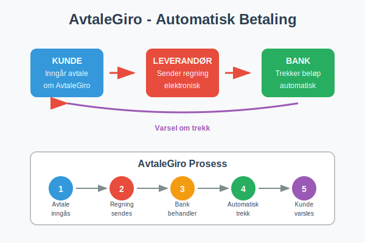
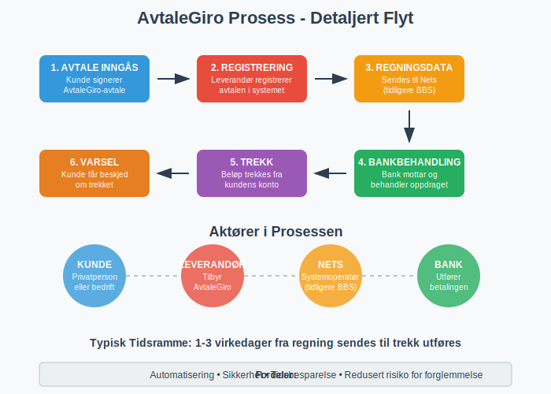
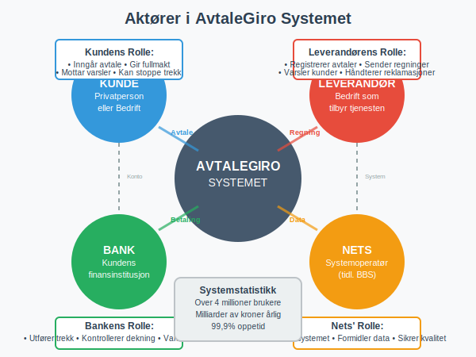
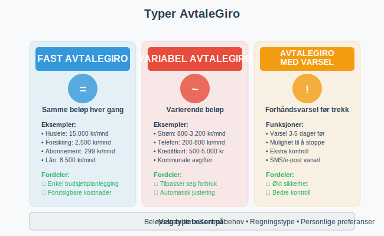
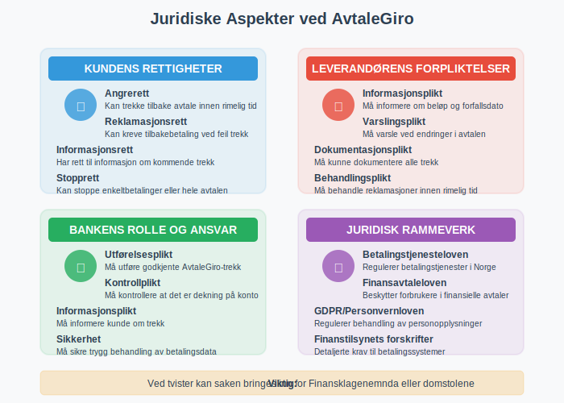
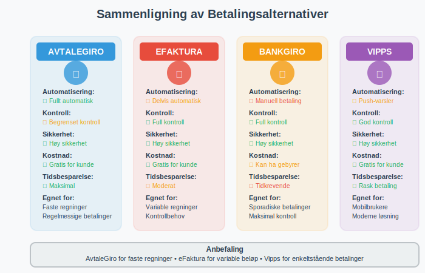

**AvtaleGiro** er Norges mest brukte system for automatisk betaling av regninger. Dette betalingssystemet gjør det mulig for både privatpersoner og bedrifter å automatisere regelmessige betalinger, slik at regninger betales automatisk fra bankkonto uten manuell inngripen. Som en av de mest populære [elektroniske betalingsmidlene](/blogs/regnskap/hva-er-betalingsmidler "Hva er Betalingsmidler? Tvungne, Elektroniske og Tradisjonelle Metoder") i Norge, representerer AvtaleGiro en viktig del av det moderne betalingslandskapet.

### Hva er AvtaleGiro?

AvtaleGiro er et **elektronisk betalingssystem** som ble etablert i Norge på 1990-tallet som en del av det moderne [giro-systemet](/blogs/regnskap/hva-er-giro "Hva er Giro? Komplett Guide til Giro-systemet i Norge"). Systemet gjør det mulig å inngå avtaler med leverandører om automatisk trekk av regninger fra bankkonto på forfallsdato.

Hovedprinsippet er enkelt:
- **Kunde** inngår avtale med leverandør om AvtaleGiro
- **Leverandør** sender regningsinformasjon elektronisk til kundens bank
- **Banken** trekker beløpet automatisk på forfallsdato
- **Kunden** får varsel om trekket i forkant

Dette systemet brukes av over **4 millioner nordmenn** og håndterer milliarder av kroner i betalinger årlig.

### Hvordan Fungerer AvtaleGiro?

#### Teknisk Prosess
AvtaleGiro fungerer gjennom et samarbeid mellom leverandør, bank og kunde:

1. **Avtale inngås:** Kunde signerer AvtaleGiro-avtale med leverandør
2. **Registrering:** Leverandør registrerer avtalen i sitt system
3. **Regningsdata:** Leverandør sender regningsinformasjon til Nets (tidligere BBS)
4. **Bankbehandling:** Kundens bank mottar og behandler betalingsoppdraget
5. **Trekk:** Beløpet trekkes fra kundens konto på forfallsdato
6. **Varsel:** Kunde får beskjed om trekket via bank eller leverandør

For automatisk identifikasjon og avstemming av betalinger brukes ofte **[KID-nummer](/blogs/regnskap/hva-er-kid-nummer "Hva er KID-nummer? Komplett Guide til Kunde-IDentifikasjon i Norge")** som følger med betalingsinformasjonen og sikrer at innbetalinger automatisk knyttes til riktig kunde og avtale.

#### Aktører i Systemet
- **Nets:** Operatør av AvtaleGiro-systemet i Norge
- **Banker:** Behandler betalingsoppdragene
- **Leverandører:** Bedrifter som tilbyr AvtaleGiro
- **Kunder:** Privatpersoner og bedrifter som bruker tjenesten

### Fordeler med AvtaleGiro

#### For Privatpersoner
- **Automatisering:** Slipper å huske å betale regninger
- **Tidsbesparelse:** Ingen manuell behandling av regninger
- **Sikkerhet:** Redusert risiko for forglemmelse og purregebyr
- **Oversikt:** Enkel oppfølging gjennom nettbank
- **Fleksibilitet:** Kan stoppe eller endre avtaler enkelt

#### For Bedrifter
- **Forbedret [arbeidskapital](/blogs/regnskap/hva-er-arbeidskapital "Hva er Arbeidskapital? Definisjon og Beregning"):** Raskere innbetaling fra kunder
- **Reduserte kostnader:** Mindre manuell behandling av betalinger
- **Bedre kundeservice:** Færre henvendelser om betalinger
- **Økt sikkerhet:** Redusert risiko for betalingsmisligholdelse
- **Automatisert [regnskap](/blogs/regnskap/hva-er-regnskap "Hva er Regnskap? En komplett guide"):** Enklere bokføring av innbetalinger

### Typer AvtaleGiro

Det finnes flere varianter av AvtaleGiro tilpasset ulike behov:

#### Fast AvtaleGiro
- **Faste beløp:** Samme beløp trekkes hver måned
- **Eksempler:** Husleie, forsikringer, abonnementer
- **Forutsigbarhet:** Enkel budsjettplanlegging

#### Variabel AvtaleGiro
- **Varierende beløp:** Beløpet kan endre seg fra gang til gang
- **Eksempler:** Strømregninger, telefonregninger, kredittkortregninger
- **Fleksibilitet:** Tilpasser seg faktisk forbruk

#### AvtaleGiro med Varsel
- **Forhåndsvarsel:** Kunde får beskjed før trekk
- **Kontroll:** Mulighet til å stoppe trekk hvis nødvendig
- **Sikkerhet:** Ekstra kontroll over betalinger

### Oppsett og Administrasjon

#### Hvordan Sette Opp AvtaleGiro

**For Privatpersoner:**
1. **Kontakt leverandør:** Be om AvtaleGiro-avtale
2. **Fyll ut skjema:** Oppgi kontonummer og personlige opplysninger
3. **Signer avtale:** Bekreft avtalen skriftlig eller digitalt
4. **Bekreftelse:** Motta bekreftelse fra leverandør og bank
5. **Aktivering:** Avtalen aktiveres innen 1-2 uker

**For Bedrifter:**
1. **Kontakt bank:** Avklar muligheter for AvtaleGiro som leverandør
2. **Teknisk oppsett:** Implementer nødvendig IT-løsning
3. **Avtale med Nets:** Inngå avtale om bruk av AvtaleGiro-systemet
4. **Testing:** Test systemet før lansering
5. **Kunderegistrering:** Begynn registrering av kunder

#### Administrasjon av Avtaler

| Handling | Privatperson | Bedrift |
|----------|-------------|---------|
| **Stoppe avtale** | Kontakt leverandør eller bank | Administrer via kundesystem |
| **Endre kontonummer** | Oppgi nytt kontonummer til leverandør | Oppdater i AvtaleGiro-system |
| **Overvåke trekk** | Sjekk kontoutskrift i nettbank | Følg opp via rapporter |
| **Reklamasjon** | Kontakt leverandør innen 8 uker | Håndter kundehenvendelser |

### Juridiske Aspekter

#### Kundens Rettigheter
- **Angrerett:** Kan trekke tilbake avtale innen rimelig tid
- **Reklamasjonsrett:** Kan kreve tilbakebetaling ved feil trekk
- **Informasjonsrett:** Har rett til informasjon om kommende trekk
- **Stopprett:** Kan stoppe enkeltbetalinger eller hele avtalen

#### Leverandørens Forpliktelser
- **Informasjonsplikt:** Må informere om beløp og forfallsdato
- **Varslingsplikt:** Må varsle ved endringer i avtalen
- **Dokumentasjonsplikt:** Må kunne dokumentere alle trekk
- **Behandlingsplikt:** Må behandle reklamasjoner innen rimelig tid

#### Bankens Rolle
- **Utførelsesplikt:** Må utføre godkjente AvtaleGiro-trekk
- **Kontrollplikt:** Må kontrollere at det er dekning på konto
- **Informasjonsplikt:** Må informere kunde om trekk
- **Sikkerhet:** Må sikre trygg behandling av betalingsdata

### Kostnader og Gebyrer

#### For Privatpersoner
De fleste banker tilbyr AvtaleGiro **gratis** for privatpersoner:
- **Ingen oppsettgebyr:** Gratis å etablere avtaler
- **Ingen månedlige kostnader:** Ingen løpende gebyrer
- **Gratis endringer:** Kan endre eller stoppe avtaler uten kostnad

#### For Bedrifter
Bedrifter må betale for å tilby AvtaleGiro:

| Kostnadselement | Typisk Kostnad | Beskrivelse |
|----------------|---------------|-------------|
| **Oppsettgebyr** | 5.000 - 15.000 kr | Engangsgebyr for etablering |
| **Månedlig abonnement** | 200 - 500 kr | Fast månedlig kostnad |
| **Per transaksjon** | 1 - 3 kr | Gebyr per gjennomført trekk |
| **Teknisk integrasjon** | 10.000 - 50.000 kr | IT-utvikling og testing |

### Sikkerhet og Personvern

#### Sikkerhetstiltak
- **Kryptering:** All kommunikasjon er kryptert
- **Autentisering:** Sterke krav til identifisering
- **Overvåking:** Kontinuerlig overvåking av systemet
- **Backup:** Sikre rutiner for datalagring

#### Personvernhensyn
- **Databehandling:** Kun nødvendige data behandles
- **Lagringstid:** Data slettes når ikke lenger nødvendig
- **Tilgangskontroll:** Begrenset tilgang til sensitive data
- **Samtykke:** Basert på kundens eksplisitte samtykke

### Alternativer til AvtaleGiro

#### [Elektronisk Faktura (eFaktura)](/blogs/regnskap/hva-er-efaktura "Hva er eFaktura? Komplett Guide til Elektronisk Fakturering i Norge")
- **Forskjell:** Kunde må godkjenne hver betaling
- **Kontroll:** Mer kontroll, men krever mer oppmerksomhet
- **Bruksområde:** Egnet for varierende regninger

#### BankGiro
- **Manuell betaling:** Krever aktiv handling fra kunde for hver faktura
- **[OCR-avstemming](/blogs/regnskap/hva-er-ocr "Hva er OCR? OCR i Norske Regnskapsprosesser – En Komplett Guide"):** Automatisk avstemming via [BankGiro](/blogs/regnskap/hva-er-bankgiro "Hva er BankGiro? Komplett Guide til Norsk Betalingssystem")
- **Fleksibilitet:** Full kontroll over betalingstidspunkt
- **Egnet for:** Enkeltbetalinger og varierende regninger

#### Vipps Regning
- **Mobilbetaling:** Betaling via mobilapp
- **Varsling:** Push-varsler om nye regninger
- **Moderne:** Populært blant yngre brukere

### Praktiske Tips

#### For Privatpersoner
- **Start gradvis:** Begynn med faste regninger som forsikring
- **Overvåk kontoen:** Sjekk regelmessig at trekkene er korrekte
- **Hold oversikt:** Lag liste over alle AvtaleGiro-avtaler
- **Budsjetter:** Ta hensyn til automatiske trekk i budsjett
- **Dekning:** Sørg for tilstrekkelig dekning på konto

#### For Bedrifter
- **Kundeservice:** Informer kunder godt om AvtaleGiro
- **Teknisk kvalitet:** Invester i robust IT-løsning
- **Oppfølging:** Følg opp mislykkede trekk raskt
- **Rapportering:** Bruk AvtaleGiro-data til [regnskapsføring](/blogs/regnskap/hva-er-regnskap "Hva er Regnskap? En komplett guide")
- **Kundeopplevelse:** Gjør det enkelt å administrere avtaler

### Fremtiden for AvtaleGiro

#### Teknologiske Utviklinger
- **Digitalisering:** Mer digital håndtering av avtaler
- **Sanntidsbetalinger:** Raskere behandling av betalinger
- **Kunstig intelligens:** Smartere håndtering av unntak
- **Mobilintegrasjon:** Bedre mobilopplevelse

#### Markedstrender
- **Økt bruk:** Fortsatt vekst i antall avtaler
- **Nye aktører:** Fintech-selskaper utfordrer tradisjonelle banker
- **Regulering:** Nye EU-reguleringer påvirker systemet
- **Bærekraft:** Fokus på miljøvennlige betalingsløsninger

### Konklusjon

AvtaleGiro er et **robust og pålitelig** betalingssystem som har revolusjonert måten nordmenn betaler regninger på. For privatpersoner gir det **trygghet og bekvemmelighet**, mens bedrifter får **forbedret likviditet og reduserte kostnader**.

Systemets **høye sikkerhet** og **enkle administrasjon** gjør det til et naturlig valg for regelmessige betalinger. Med kontinuerlig teknologisk utvikling vil AvtaleGiro fortsette å være en sentral del av det norske betalingslandskapet.

Ved å forstå hvordan AvtaleGiro fungerer, kan både privatpersoner og bedrifter dra nytte av fordelene systemet tilbyr, samtidig som de unngår vanlige fallgruver og utfordringer.
