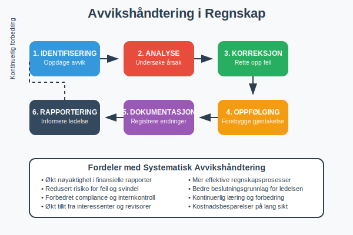
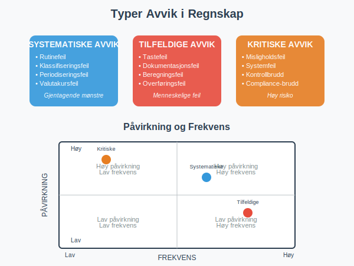
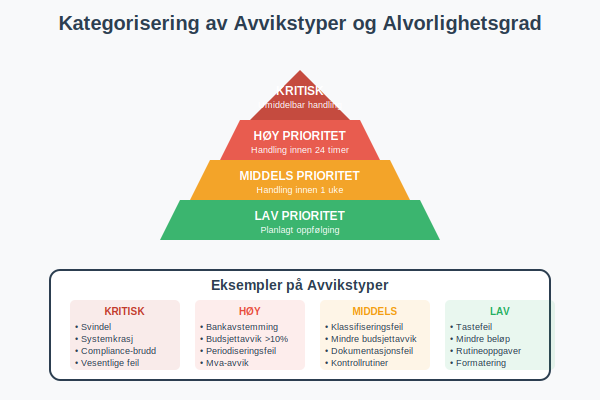
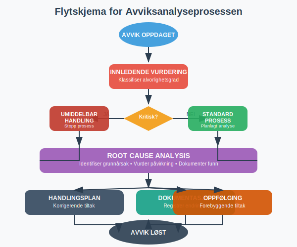
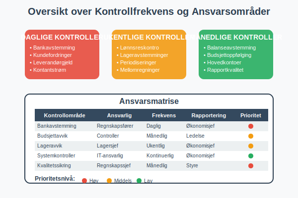
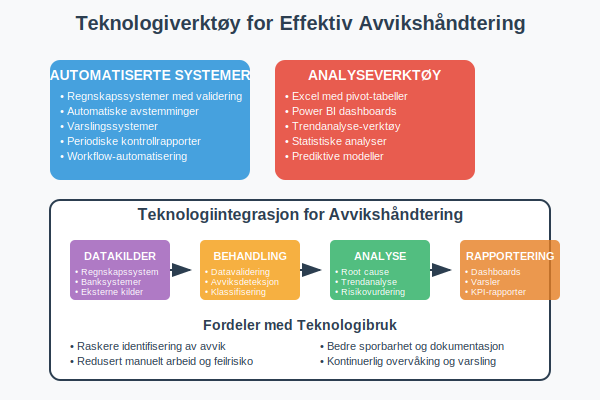
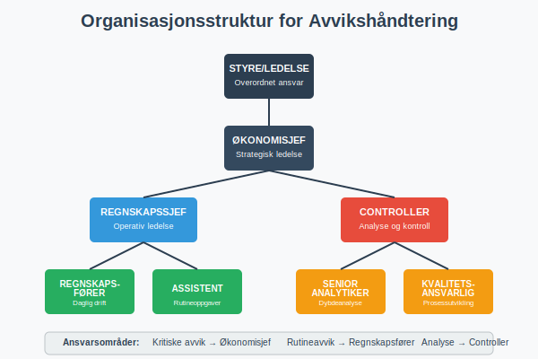
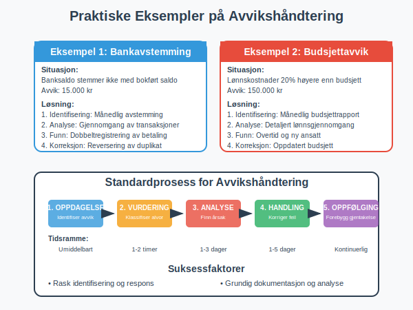
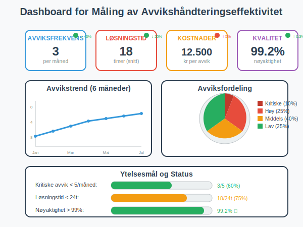
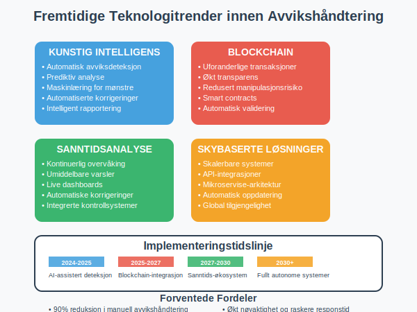

---
title: "Hva er Avvikshåndtering i Regnskap?"
meta_title: "Hva er Avvikshåndtering i Regnskap?"
meta_description: '**Avvikshåndtering i regnskap** er en kritisk prosess som sikrer nøyaktighet og pålitelighet i finansielle rapporter. Det handler om å systematisk identifis...'
slug: hva-er-avvikshandtering
type: blog
layout: pages/single
---

**Avvikshåndtering i regnskap** er en kritisk prosess som sikrer nøyaktighet og pålitelighet i finansielle rapporter. Det handler om å systematisk identifisere, analysere og korrigere forskjeller mellom forventede og faktiske regnskapstall. En effektiv avvikshåndtering er grunnleggende for god [regnskapskontroll](/blogs/regnskap/hva-er-regnskap "Hva er Regnskap? En komplett guide") og finansiell styring, og utgjør en viktig del av [QA (Quality Assurance)](/blogs/regnskap/hva-er-qa-kvalitetssikring "Hva er QA (Quality Assurance) i Regnskap? Komplett Guide til Kvalitetssikring") i regnskapsföring.

## Hva er Avvikshåndtering?

Avvikshåndtering er prosessen med å **identifisere, undersøke og korrigere** forskjeller mellom:

- **Budsjetterte og faktiske tall**
- **Forventede og registrerte transaksjoner**
- **Kontrollsummer og detaljerte poster**
- **Periodiske avstemminger og løpende saldoer**

Målet er å sikre at [regnskapet](/blogs/regnskap/hva-er-regnskap "Hva er Regnskap? En komplett guide") gir et **rettvisende bilde** av selskapets finansielle stilling og resultater.

## Typer Avvik i Regnskap

### Systematiske Avvik
- **Rutinefeil:** Feil i standardprosedyrer eller systemer
- **Klassifiseringsfeil:** Feil kontoføring av transaksjoner
- **Periodiseringsfeil:** Feil tidspunkt for registrering
- **Valutakursfeil:** Feil omregning av utenlandsk valuta

### Tilfeldige Avvik
- **Tastefeil:** Menneskelige feil ved registrering
- **Dokumentasjonsfeil:** Manglende eller feil bilag
- **Beregningsfeil:** Feil i kalkulasjoner
- **Overføringsfeil:** Feil ved dataoverføring

### Kritiske Avvik
- **Misligholdsfeil:** Bevisste feilregistreringer
- **Systemfeil:** Tekniske problemer i regnskapssystem
- **Kontrollbrudd:** Svikt i interne kontroller
- **Compliance-brudd:** Brudd på regnskapsregler

## Avvikshåndteringsprosessen

### 1. Identifisering av Avvik

**Automatisk identifisering:**
- Systemgenererte rapporter og varsler
- Automatiske avstemminger
- Kontrollrutiner i regnskapssystem
- Periodiske balansesjekker

**Manuell identifisering:**
- MÃ¥nedlige avstemminger
- Budsjettoppfølging
- Analyse av nøkkeltall
- Revisjon av transaksjoner

### 2. Klassifisering og Prioritering

| Avvikstype | Prioritet | Tidsramme | Ansvarlig |
|------------|-----------|-----------|-----------|
| Kritiske feil | Høy | Umiddelbart | Regnskapssjef |
| Systematiske feil | Middels | 1-3 dager | Regnskapsfører |
| Mindre feil | Lav | 1 uke | Assistent |
| Rutineavvik | Planlagt | MÃ¥nedlig | Team |

### 3. Analyse og Utredning

**Root Cause Analysis:**
- Identifiser grunnårsaken til avviket
- Vurder om det er et enkeltstående tilfelle
- Undersøk om det påvirker andre områder
- Dokumenter funn og konklusjoner

**Risikovurdering:**
- Vurder påvirkning på [finansielle rapporter](/blogs/regnskap/hva-er-regnskap "Hva er Regnskap? En komplett guide")
- Identifiser potensielle konsekvenser
- Vurder behov for ekstern rapportering
- Prioriter korrigerende tiltak

### 4. Korrigerende Tiltak

**Umiddelbare tiltak:**
- Korriger feilregistreringer
- Oppdater berørte kontoer
- Informer relevante parter
- Dokumenter endringer

**Forebyggende tiltak:**
- Forbedre kontrollrutiner
- Oppdater prosedyrer
- Øk kompetanse
- Implementer nye kontroller

## Beste Praksis for Avvikshåndtering

### Etabler Klare Rutiner

**Daglige kontroller:**
- Kontroller bankavstemming
- Verifiser kundefordringer
- Sjekk leverandørgjeld
- Overvåk kontantstrøm

**Ukentlige kontroller:**
- Gjennomgå [lønnsreskontro](/blogs/regnskap/hva-er-ansattreskontro "Hva er Ansattreskontro? Komplett Guide")
- Kontroller lageravstemminger
- Verifiser periodiseringer
- Sjekk mellomregninger

**MÃ¥nedlige kontroller:**
- Fullstendig balanseavstemming
- Budsjettoppfølging og analyse
- Gjennomgang av alle hovedkontoer
- Kvalitetssikring av rapporter

### Dokumentasjon og Sporbarhet

**Avviksdokumentasjon skal inneholde:**
- Beskrivelse av avviket
- Oppdagelsesdato og -metode
- Ansvarlig person for oppfølging
- Korrigerende tiltak som er iverksatt
- Oppfølgingsdato og status
- Godkjenning fra overordnet

**Sporbarhet:**
- Alle endringer må kunne spores tilbake
- Bevare originale dokumenter
- Loggføre alle korrigeringer
- Sikre revisjonsspor i systemet

## Teknologi og Verktøy

### Regnskapssystemer med Avvikshåndtering

**Automatiserte kontroller:**
- Innebygde valideringsregler
- Automatisk avstemming av kontoer
- Varsler ved uvanlige transaksjoner
- Periodiske kontrollrapporter

**Rapporteringsverktøy:**
- Dashboards for avviksovervåking
- Automatiske avviksrapporter
- Trendanalyse og prognoser
- Integrerte kontrollpanel

### Excel og Analyseverktøy

**Avvikshåndtering i Excel:**
- Pivot-tabeller for analyse
- Betingede formateringer for varsler
- Automatiske formler for kontroller
- Makroer for rutineoppgaver

## Organisering av Avvikshåndtering

### Roller og Ansvar

| Rolle | Ansvar | Kompetansekrav |
|-------|--------|----------------|
| **Regnskapssjef** | Overordnet ansvar, kritiske avvik | Autorisert regnskapsfører |
| **Regnskapsfører** | Daglig oppfølging, analyse | Fagbrev/høyskole |
| **Assistent** | Rutinekontroller, registrering | Grunnleggende regnskapskunnskap |
| **Controller** | Budsjettavvik, analyse | Økonomisk utdanning |

### Rapporteringslinjer

**Intern rapportering:**
- Daglige statusrapporter til regnskapssjef
- Ukentlige sammendrag til ledelsen
- MÃ¥nedlige avviksrapporter til styre
- Kvartalsvise trendanalyser

**Ekstern rapportering:**
- Revisor ved vesentlige avvik
- Skattemyndigheter ved skattemessige feil
- Finanstilsyn ved børsnoterte selskaper
- Kreditorer ved vesentlige endringer

## Praktiske Eksempler

### Eksempel 1: Bankavstemming

**Situasjon:** Banksaldo stemmer ikke med bokført saldo

**Avvikshåndtering:**
1. **Identifisering:** Månedlig bankavstemming viser avvik på 15.000 kr
2. **Analyse:** Gjennomgang av banktransaksjoner og bokføringer
3. **Funn:** Dobbeltregistrering av leverandørbetaling
4. **Korreksjon:** Reversering av duplikat og oppdatering av leverandørgjeld
5. **Oppfølging:** Forbedret rutine for betalingsregistrering

### Eksempel 2: Budsjettavvik

**Situasjon:** Lønnskostnader 20% høyere enn budsjett

**Avvikshåndtering:**
1. **Identifisering:** MÃ¥nedlig budsjettrapport viser betydelig avvik
2. **Analyse:** Detaljert gjennomgang av lønnsutbetalinger
3. **Funn:** Overtidskostnader ikke budsjettert, ny ansatt startet tidligere
4. **Korreksjon:** Oppdatert budsjett og forbedret prognoser
5. **Oppfølging:** Månedlig oppfølging av lønnsbudsjett

## Utfordringer og Løsninger

### Vanlige Utfordringer

**Ressursmangel:**
- For lite tid til grundige kontroller
- Mangel på kompetent personale
- Begrenset tilgang til verktøy

**Systemutfordringer:**
- Manglende integrasjon mellom systemer
- Utilstrekkelige kontrollrutiner
- Komplekse rapporteringsstrukturer

**Organisatoriske utfordringer:**
- Uklare ansvarsforhold
- Mangelfull kommunikasjon
- Motstand mot endringer

### Løsningsstrategier

**Effektivisering:**
- Automatiser rutinekontroller
- Implementer unntak-basert rapportering
- Bruk teknologi for å redusere manuelt arbeid

**Kompetansebygging:**
- Regelmessig opplæring av personale
- Sertifisering innen regnskapsføring
- Deling av beste praksis

**Prosessforbedring:**
- Kontinuerlig evaluering av rutiner
- Implementering av lean-prinsipper
- Regelmessig oppdatering av prosedyrer

## MÃ¥ling av Effektivitet

### Nøkkelindikatorer (KPIer)

| Indikator | MÃ¥leenhet | MÃ¥lsetting |
|-----------|-----------|------------|
| **Avviksfrekvens** | Antall per måned | < 5 kritiske avvik |
| **Løsningstid** | Timer/dager | < 24 timer for kritiske |
| **Kostnader** | Kr per avvik | Reduksjon 10% årlig |
| **Kvalitet** | % korrekte rapporter | > 99% nøyaktighet |

### Kontinuerlig Forbedring

**MÃ¥nedlig evaluering:**
- Gjennomgang av avviksstatistikk
- Identifisering av trender
- Vurdering av prosesseffektivitet
- Planlegging av forbedringstiltak

**Ã…rlig gjennomgang:**
- Helhetlig evaluering av avvikshåndtering
- Oppdatering av rutiner og prosedyrer
- Kompetansevurdering av personale
- Investering i nye verktøy og systemer

## Juridiske og Regulatoriske Aspekter

### Regnskapsloven

**Krav til avvikshåndtering:**
- Regnskapet skal gi et **rettvisende bilde**
- Alle vesentlige feil må korrigeres
- Dokumentasjon av endringer må oppbevares
- Revisor må informeres om vesentlige avvik

### Skattemessige Konsekvenser

**Korrigeringer som påvirker skatt:**
- Endringer i [resultatregnskapet](/blogs/regnskap/hva-er-regnskap "Hva er Regnskap? En komplett guide") kan påvirke skattegrunnlag
- Fristoverskridelser kan medføre tilleggsskatt
- Dokumentasjon må kunne fremlegges ved kontroll
- Frivillige rettelser kan redusere sanksjoner

### Internkontroll

**Krav til internkontroll:**
- Etablere tilstrekkelige kontrollrutiner
- Sikre kompetent personale
- Dokumentere prosesser og prosedyrer
- Regelmessig evaluering av kontrolleffektivitet

## Fremtidige Trender

### Digitalisering og Automatisering

**Kunstig intelligens:**
- Automatisk identifisering av avviksmønstre
- Prediktiv analyse for forebygging
- Maskinlæring for forbedret nøyaktighet
- Automatiserte korrigeringsforslag

**Blockchain-teknologi:**
- Uforanderlige transaksjonslogger
- Økt transparens og sporbarhet
- Redusert risiko for manipulasjon
- Automatiserte smart contracts

### Sanntidsrapportering

**Kontinuerlig overvåking:**
- Sanntids dashboards
- Umiddelbare varsler ved avvik
- Automatiske korrigeringer
- Integrerte kontrollsystemer

## Konklusjon

Effektiv **avvikshåndtering** er avgjørende for å opprettholde høy kvalitet i regnskapsføringen. Ved å implementere systematiske prosesser, bruke riktige verktøy og sikre kompetent personale, kan organisasjoner:

- **Redusere risiko** for feil i finansielle rapporter
- **Forbedre effektivitet** i regnskapsprosessene
- **Øke tilliten** til finansiell informasjon
- **Sikre compliance** med lover og forskrifter

En proaktiv tilnærming til avvikshåndtering, kombinert med kontinuerlig forbedring og teknologisk utvikling, vil være nøkkelen til suksess i fremtidens regnskapsføring.

**Viktige takeaways:**
- Etabler klare rutiner og ansvarsforhold
- Invester i riktige verktøy og teknologi
- Fokuser på kompetansebygging
- Mål og følg opp effektivitet kontinuerlig
- Tilpass prosessene til organisasjonens behov

For mer informasjon om relaterte emner, se våre artikler om [regnskap](/blogs/regnskap/hva-er-regnskap "Hva er Regnskap? En komplett guide"), [internkontroll](/blogs/regnskap/hva-er-attestering "Hva er Attestering? Komplett Guide til Fakturaattest"), og [regnskapsføring](/blogs/regnskap/hva-er-regnskap "Hva er Regnskap? En komplett guide").

