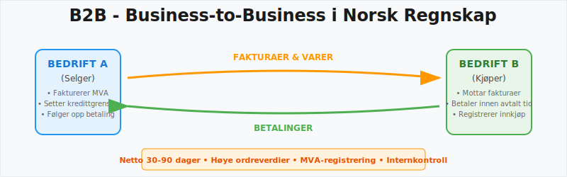
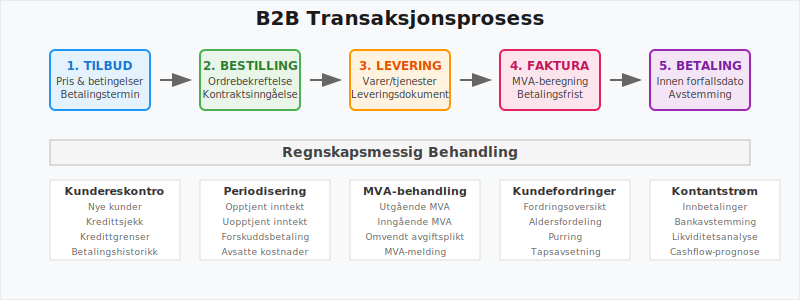
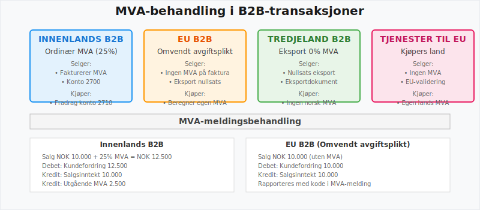
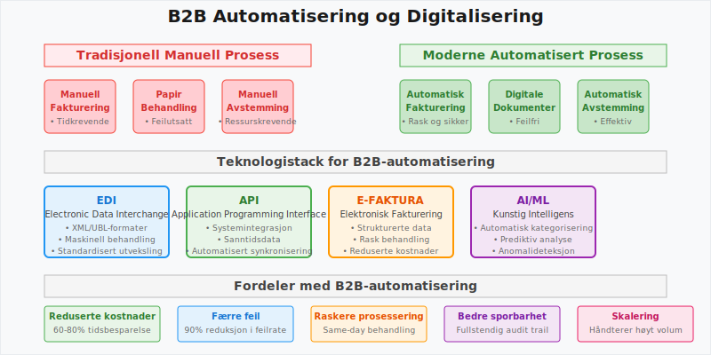

---
title: "Hva er B2B? Komplett Guide til Business-to-Business i Norsk Regnskap"
meta_title: "Hva er B2B? Komplett Guide til Business-to-Business i Norsk Regnskap"
meta_description: '**B2B** (Business-to-Business) refererer til handel og kommersielle transaksjoner mellom **bedrifter**, i motsetning til [Business-to-Consumer (B2C)](/blogs/reg...'
slug: hva-er-b2b
type: blog
layout: pages/single
---

**B2B** (Business-to-Business) refererer til handel og kommersielle transaksjoner mellom **bedrifter**, i motsetning til [Business-to-Consumer (B2C)](/blogs/regnskap/hva-er-b2c "Hva er B2C? Business-to-Consumer i Regnskap"). I norsk regnskap og [bokføring](/blogs/regnskap/hva-er-bokforing "Hva er Bokføring? Komplett Guide til Regnskapsføring") stiller B2B-handel spesifikke krav til fakturering, MVA-håndtering, betalingsbetingelser og regnskapsmessig behandling.

## Definisjon og Betydning i Norsk Regnskap

**B2B**, eller **Business-to-Business**, beskriver salg av varer og tjenester fra én virksomhet til en annen. I norsk regnskap innebærer dette komplekse krav til [fakturering](/blogs/regnskap/hva-er-en-faktura "Hva er en Faktura? En Guide til Norske Fakturakrav"), [MVA-registrering](/blogs/regnskap/hva-er-moms-mva "Hva er MVA (Merverdiavgift)? Komplett Guide til Merverdiavgift") og [regnskapsføring](/blogs/regnskap/hva-er-regnskap "Hva er Regnskap? Komplett Guide til Regnskapsføring").

B2B-handel skiller seg fra [B2C-handel](/blogs/regnskap/hva-er-b2c "Hva er B2C? Business-to-Consumer i Regnskap") ved:

* **Større transaksjonsverdier** som påvirker [balansen](/blogs/regnskap/hva-er-balanse "Hva er Balanse? Guide til Balanse i Regnskap") betydelig
* **Lengre betalingsbetingelser** som krever god [likviditetsstyring](/blogs/regnskap/hva-er-likviditetsstyring "Hva er Likviditetsstyring?")
* **Komplekse avtalestrukturer** som påvirker [periodisering](/blogs/regnskap/hva-er-periodisering "Hva er Periodisering? Guide til Periodisering i Regnskap")
* **Spesialiserte MVA-regler** for internasjonale transaksjoner

## Sentrale Kjennetegn ved B2B-transaksjoner

| Kjennetegn               | Beskrivelse                                                                                          | Regnskapsmessig behandling |
|--------------------------|------------------------------------------------------------------------------------------------------|----------------------------|
| **Langsiktige avtaler**  | Kontrakter med gjentakende leveranser og avtalte betalingsbetingelser                                 | Kræver [periodisering](/blogs/regnskap/hva-er-periodisering "Hva er Periodisering? Guide til Periodisering i Regnskap") av inntekter |
| **Betalingsbetingelser** | Ofte **Netto 30“90 dager**; krever god [internkontroll](/blogs/regnskap/hva-er-internkontroll "Hva er Internkontroll?"), i motsetning til [B2C hvor betalinger](/blogs/regnskap/hva-er-b2c "Hva er B2C? Business-to-Consumer i Regnskap") skjer umiddelbart | PÃ¥virker [kundefordringer](/blogs/regnskap/hva-er-kundefordring "Hva er Kundefordring?") |
| **Høye ordreverdier**    | Større volum og mer komplekse leveranser som påvirker balansen, i motsetning til [B2C med mange små transaksjoner](/blogs/regnskap/hva-er-b2c "Hva er B2C? Business-to-Consumer i Regnskap") | Krever nøye [bilagsføring](/blogs/regnskap/hva-er-bilagsforing "Hva er Bilagsføring?") |
| **MVA-håndtering**       | Omvendt avgiftsplikt og spesifikke MVA-koder ved internasjonale transaksjoner                        | Spesielle krav til [MVA-melding](/blogs/regnskap/hva-er-mva-melding "Hva er MVA-melding?") |

## MVA og B2B-handel

I **B2B-transaksjoner** må selger normalt beregne og fakturere **Merverdiavgift (MVA)**. Ved handel innenfor EU kan **omvendt avgiftsplikt** gjelde, slik at kjøperen selv beregner avgiften.

### MVA-behandling i Ulike B2B-scenarioer

| Scenario | MVA-behandling | Regnskapsmessig håndtering |
|----------|----------------|---------------------------|
| **Innenlands B2B** | Ordinær MVA (25%) | Standard [konto 2700](/blogs/kontoplan/2700-utgaende-merverdiavgift "Konto 2700 - Utgående Merverdiavgift") |
| **EU B2B** | Omvendt avgiftsplikt | Spesialbehandling i MVA-melding |
| **Tredjeland B2B** | Ingen MVA ved eksport | Nullsats med dokumentasjon |
| **Tjenester til EU** | Kjøpers ansvar | Kræver EU-validering |

Ved **omvendt avgiftsplikt** skal:

1. **Selger** ikke beregne MVA på fakturaen
2. **Kjøper** beregne og betale MVA til norske myndigheter
3. **Begge parter** rapportere transaksjonen i [MVA-meldingen](/blogs/regnskap/hva-er-mva-melding "Hva er MVA-melding?")

## B2B-fakturering og Betalingsbetingelser

I B2B-sammenheng krever [fakturering](/blogs/regnskap/hva-er-en-faktura "Hva er en Faktura? En Guide til Norske Fakturakrav") detaljerte opplysninger som sikrer sporbarhet og regnskapsmessig korrekthet:

### Obligatoriske Opplysninger på B2B-fakturaer

* **Spesifiserte betalingsvilkår** og forfallsdatoer
* **Referansenummer** for sporbarhet og [avstemming](/blogs/regnskap/hva-er-avstemming "Hva er Avstemming? Guide til Avstemming i Regnskap")
* **Detaljert varelinjer** med priser eksklusive og inklusive MVA
* **Kontrakts- eller ordrenummer** knyttet til leveranseavtalen
* **Organisasjonsnummer** for begge parter
* **Leveringsdato** og **-adresse** ved varelevering

### Vanlige Betalingsbetingelser i B2B

| Betalingsbetingelse | Beskrivelse | Regnskapsmessig påvirkning |
|---------------------|-------------|---------------------------|
| **Netto 14 dager** | Betaling innen 14 dager | Kort [kundefordring](/blogs/regnskap/hva-er-kundefordring "Hva er Kundefordring?") |
| **Netto 30 dager** | Standard B2B-betingelse | Vanligste praksis |
| **Netto 60 dager** | Lengre kredittid | Økt [arbeidskapital](/blogs/regnskap/hva-er-arbeidskapital "Hva er Arbeidskapital?") behov |
| **Netto 90 dager** | Spesielle avtaler | Krever god [likviditetsstyring](/blogs/regnskap/hva-er-likviditetsstyring "Hva er Likviditetsstyring?") |

## Digitalisering og Automatisering i B2B

Moderne B2B-handel krever effektiv systemintegrasjon og automatiserte prosesser:

### Teknologiske Løsninger for B2B-handel

* **EDI og strukturerte formater** (XML, UBL) for maskinell behandling
* [API-integrasjon og Automatisering](/blogs/regnskap/api-integrasjon-automatisering-regnskap "API-integrasjon og Automatisering i Regnskap") mellom ERP-systemer
* **Automatisk avstemming** av innkommende betalinger
* **Elektronisk fakturering** og **e-faktura**-løsninger
* **Automatisert [purring](/blogs/regnskap/hva-er-purring-og-purregebyr "Hva er Purring og Purregebyr? Guide til Norske Regler og Regnskapsføring")** ved forsinket betaling

### Fordeler med Digitalisering

1. **Reduserte administrative kostnader** gjennom automatisering
2. **Færre feilkilder** ved manuell behandling
3. **Raskere fakturering** og betalingsprosesser
4. **Bedre sporbarhet** og dokumentasjon
5. **Integrert [regnskapsføring](/blogs/regnskap/hva-er-bokforing "Hva er Bokføring? Komplett Guide til Regnskapsføring")** fra ordre til betaling

## Regnskapsmessig Behandling av B2B-transaksjoner

### Viktige Kontoer for B2B-handel

| Konto | Beskrivelse | Anvendelse |
|-------|-------------|------------|
| [1550](/blogs/kontoplan/1550-kundefordringer-pa-selskap-samme-konsern "Konto 1550 - Kundefordringer på Selskap Samme Konsern") | Kundefordringer konsern | B2B innen samme konsern |
| [2400](/blogs/kontoplan/2400-leverandorgjeld "Konto 2400 - Leverandørgjeld") | Leverandørgjeld | Innkjøp fra B2B-leverandører |
| [2460](/blogs/kontoplan/2460-leverandorgjeld-til-selskap-i-samme-konsern "Konto 2460 - Leverandørgjeld til Selskap i Samme Konsern") | Leverandørgjeld konsern | B2B innen samme konsern |
| [2700](/blogs/kontoplan/2700-utgaende-merverdiavgift "Konto 2700 - Utgående Merverdiavgift") | Utgående MVA | MVA på B2B-salg |

### Periodisering i B2B-handel

Ved **langsiktige B2B-avtaler** kreves korrekt [periodisering](/blogs/regnskap/hva-er-periodisering "Hva er Periodisering? Guide til Periodisering i Regnskap"):

1. **Opptjent, ikke fakturert inntekt** på [konto 1530](/blogs/kontoplan/1530-opptjent-ikke-fakturert-inntekt "Konto 1530 - Opptjent Ikke Fakturert Inntekt")
2. **Forskuddsbetalinger** på [konto 1480](/blogs/kontoplan/1480-forskuddsbetaling-til-leverandorer "Konto 1480 - Forskuddsbetaling til Leverandører")
3. **Uopptjent inntekt** på [konto 2160](/blogs/kontoplan/2160-uopptjent-inntekt "Konto 2160 - Uopptjent Inntekt")

## Risikostyring i B2B-handel

### Kredittvurdering og Risiko

B2B-handel innebærer ofte høyere kredittrisiko enn [B2C-handel](/blogs/regnskap/hva-er-b2c "Hva er B2C? Business-to-Consumer i Regnskap"):

* **Kredittvurdering** av nye B2B-kunder
* **Kredittgrenser** basert på kundens [betalingsevne](/blogs/regnskap/hva-er-betalingsevne "Hva er Betalingsevne?")
* **Kredittoversikt** og regelmessig oppfølging
* **Avsetning for tap** på [konto 1580](/blogs/kontoplan/1580-avsetning-tap-pa-fordringer "Konto 1580 - Avsetning Tap på Fordringer")

### Internkontroll for B2B-prosesser

Effektiv [internkontroll](/blogs/regnskap/hva-er-internkontroll "Hva er Internkontroll?") krever:

1. **Segregering av oppgaver** mellom salg, fakturering og innkreving
2. **Godkjenningsrutiner** for kredittgrenser og betalingsbetingelser
3. **Regelmessig [avstemming](/blogs/regnskap/hva-er-avstemming "Hva er Avstemming? Guide til Avstemming i Regnskap")** av kundefordringer
4. **Oppfølging av forfallne fordringer** og [purring](/blogs/regnskap/hva-er-purring-og-purregebyr "Hva er Purring og Purregebyr? Guide til Norske Regler og Regnskapsføring")

## Internasjonale B2B-transaksjoner

### Spesielle Hensyn ved Internasjonal B2B-handel

| Aspekt | Krav | Regnskapsmessig behandling |
|--------|------|---------------------------|
| **Valuta** | Omregning til NOK - se [Big Mac-indeksen](/blogs/regnskap/big-mac-indeksen "Big Mac-indeksen: Komplett guide til valutakurs og kjøpekraftsparitet for norske bedrifter") for valutavurdering | Kursgevinst/-tap på [konto 8150/8190] |
| **Dokumentasjon** | Eksportdokumenter | Kræver spesiell arkivering |
| **MVA-frittak** | Nullsats ved eksport | Spesialbehandling i MVA-melding |
| **Toll og avgifter** | Importavgifter | Inngår i [anskaffelseskost](/blogs/regnskap/hva-er-anskaffelseskost "Hva er Anskaffelseskost?") |

### Vanlige Utfordringer og Løsninger

| Utfordring | Løsning og beste praksis |
|------------|--------------------------|
| **Forsinket betaling** | Klare kontraktsvilkår, automatisert [purring](/blogs/regnskap/hva-er-purring-og-purregebyr "Hva er Purring og Purregebyr? Guide til Norske Regler og Regnskapsføring") og kredittvurdering |
| **Feil i fakturainformasjon** | Standardiserte maler, validering mot [fakturakrav](/blogs/regnskap/hva-er-en-faktura "Hva er en Faktura? En Guide til Norske Fakturakrav") |
| **Manglende MVA-dokumentasjon** | Systematisk MVA-rapportering og periodisk [avstemming](/blogs/regnskap/hva-er-avstemming "Hva er Avstemming? Guide til Avstemming i Regnskap") |
| **Ulik systemintegrasjon** | Bruk av åpne API-er og EDI-standarder |
| **Komplekse betalingsbetingelser** | Detaljerte [avtaler](/blogs/regnskap/hva-er-kontrakt "Hva er Kontrakt?") og systematisk oppfølging, i motsetning til [B2C med umiddelbare betalinger](/blogs/regnskap/hva-er-b2c "Hva er B2C? Business-to-Consumer i Regnskap") |

## Rapportering og Analyse i B2B

### Viktige Nøkkeltall for B2B-virksomheter

* **Gjennomsnittlig betalingstid** - måler kunders betalingsdisiplin
* **Kredittapsprosent** - andel av [kundefordringer](/blogs/regnskap/hva-er-kundefordring "Hva er Kundefordring?") som ikke innbetales
* **Gjennomsnittlig ordrestørrelse** - påvirker [likviditetsbehov](/blogs/regnskap/hva-er-likviditet "Hva er Likviditet?")
* **Kundekonsentrasjon** - risiko ved avhengighet av få store kunder

### Regnskapsrapporter for B2B-analyse

1. **Aldersfordeling av kundefordringer** - viser betalingsmønster
2. **Kredittkvalitetsrapport** - oversikt over kunders [kredittverdighet](/blogs/regnskap/hva-er-bonitet "Hva er bonitet?")
3. **Salgsanalyse per kunde** - identifiserer viktige kunder
4. **Lønnsomhetsanalyse** - [dekningsbidrag](/blogs/regnskap/hva-er-dekningsbidrag "Hva er Dekningsbidrag?") per kunde

## Juridiske Aspekter ved B2B-handel

### Kontraktstyper i B2B

* **Rammeavtaler** - langsiktige leveranseavtaler
* **Spotkontrakter** - enkeltstående transaksjoner
* **Serviceavtaler** - kontinuerlige tjenester
* **Leverandøravtaler** - avtaler om gjentakende leveranser

### Tvister og Konflikthåndtering

Ved **betalingstvister** i B2B-handel:

1. **Minnelig løsning** gjennom direkte dialog
2. **Inkasso** gjennom [inkassoselskap](/blogs/regnskap/hva-er-inkasso "Hva er Inkasso?")
3. **Rettslige skritt** ved større beløp
4. **Avsetning for tap** på [konto 1580](/blogs/kontoplan/1580-avsetning-tap-pa-fordringer "Konto 1580 - Avsetning Tap på Fordringer")

## Fremtidige Trender i B2B-handel

### Teknologiske Utviklingstrekk

* **Kunstig intelligens** for automatisert fakturahåndtering
* **Blockchain** for sikker dokumentasjon
* **Sanntids betalinger** gjennom nye betalingssystemer
* **Integrerte plattformløsninger** for hele verdikjeden

### Regulatoriske Endringer

* **E-faktura obligatorisk** for offentlige kunder
* **Nye MVA-regler** for digitale tjenester
* **Økt krav til dokumentasjon** og sporbarhet

## Vanlige Bransjer og Brukstilfeller

| Bransje                | Typiske varer/tjenester          | Regnskapsmessige hensyn                    |
|------------------------|----------------------------------|--------------------------------------------|
| **Produksjon**         | Maskiner, komponenter            | Lagerstyring, periodisering av inntekter   |
| **Grossist/Engroshandel** | Store varevolumer               | Kundefordringer, kredittstyring            |
| **IT og programvare**  | Lisenser, abonnementer           | Opptjening av inntekter, kontraktsstyring  |
| **Bygg og anlegg**      | Entreprisetjenester              | Prosjektregnskap, påløpte kostnader        |
| **Konsulenttjenester** | Rådgivning, revisjon             | Timeføringer, forskuddsbetalinger          |
| **Helse og farmasi**    | Medisinsk utstyr, legemidler     | Spesialisert MVA-koding, sporbarhet        |

**B2B-handel** krever både teknisk og prosessuell innsikt for å sikre effektiv drift, korrekt regnskapsføring og etterlevelse av norske regelverk. Systematisk oppfølging av betalingsbetingelser, MVA-håndtering og internkontroll er avgjørende for suksess i B2B-markedet.

