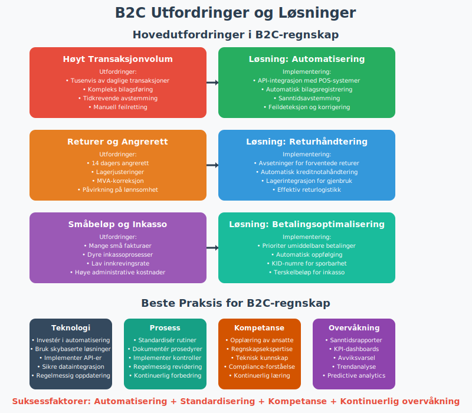

**B2C** (Business-to-Consumer) refererer til handel der en **virksomhet** selger varer eller tjenester direkte til **privatpersoner**. I norsk regnskap har B2C-spesifikke krav til **MVA-behandling**, **fakturering**, **kundefordringshåndtering** og **forbrukerbeskyttelse**.

## Definisjon og Betydning i Regnskap

**B2C**, eller **Business-to-Consumer**, beskriver salg av varer og tjenester fra en bedrift direkte til privatpersoner, i motsetning til [B2B-transaksjoner](/blogs/regnskap/hva-er-b2b "Hva er B2B? Business-to-Business i Regnskap"). I norsk regnskap påvirker B2C blant annet [MVA-behandling](/blogs/regnskap/hva-er-moms-mva "Hva er MVA (Merverdiavgift)? Komplett Guide til Merverdiavgift"), [fakturering](/blogs/regnskap/hva-er-en-faktura "Hva er en Faktura? En Guide til Norske Fakturakrav") og [kundefordringer](/blogs/regnskap/hva-er-debitor "Hva er Debitor? Komplett Guide til Kundefordringer og Debitorhåndtering").

**B2C-handel** omfatter alle former for detaljhandel, fra fysiske butikker til **netthandel** og **tjenesteytelser**. I Norge utgjør B2C-sektoren en betydelig del av [omsetningen](/blogs/regnskap/hva-er-omsetning "Hva er omsetning? Komplett guide til omsetning i regnskap") for mange virksomheter.

## Regulatoriske Rammer for B2C i Norge

### Forbrukerkjøpsloven

Forbrukerkjøpsloven regulerer **salg til forbrukere** og gir særskilte rettigheter som påvirker regnskapsføringen:

| Rettighet | Regnskapsmessig konsekvens | Eksempel |
|-----------|---------------------------|----------|
| **Angrerett** | [Avsetning](/blogs/regnskap/avsetning "Avsetning i Regnskap - Komplett Guide til Avsetninger og Estimater") for forventede returer | 14 dagers angrerett på netthandel |
| **Reklamasjon** | Garantiavsetninger for defekte varer | 2 års reklamasjonsrett |
| **Leveringsfrist** | Forsinket inntektsføring ved leveringsforsinkelse | Lovens presumptive leveringsfrist |
| **Prisavslag** | Justering av [inntekter](/blogs/regnskap/hva-er-inntekter "Hva er inntekter? Komplett guide til inntekter i regnskap") | Kvalitetsmangel gir rett til prisavslag |

### Finanstilsynets Regulering

**Finanstilsynet** regulerer B2C-virksomheter som tilbyr:

* **Finansielle tjenester** til forbrukere
* **Betalingstjenester** og elektronisk betaling
* **Forsikringsprodukter** til privatpersoner
* **Investeringstjenester** for privatinvestorer

## Sentrale Kjennetegn ved B2C-transaksjoner

| Kjennetegn | Beskrivelse | Regnskapsmessig påvirkning |
|------------|-------------|----------------------------|
| **Volum og enkelhet** | Mange små transaksjoner med lavere ordreverdier | Forenklede bilagsrutiner og automatisert [bilagsforing](/blogs/regnskap/hva-er-bilagsforing "Hva er bilagsføring? Komplett guide til bilagsføring i regnskap") |
| **Umiddelbare betalinger** | Kortbetaling, Vipps eller [eFaktura](/blogs/regnskap/hva-er-efaktura "Hva er eFaktura?") | Redusert [kundefordring](/blogs/regnskap/hva-er-kundefordring "Hva er kundefordring? Komplett guide til kundefordringer") og økt [likviditet](/blogs/regnskap/hva-er-likviditet "Hva er likviditet? Komplett guide til likviditet i regnskap") |
| **Forbrukerrettigheter** | Angrerett og forbrukerbeskyttelse etter forbrukerkjøpsloven | Krav til [avsetninger](/blogs/regnskap/avsetning "Avsetning i Regnskap - Komplett Guide til Avsetninger og Estimater") for returer og garantier |
| **MVA-plikt** | MVA beregnes og faktureres ved salg til privatpersoner uten omvendt avgiftsplikt | Standardisert MVA-behandling på 25% for de fleste varer |
| **Sesongvariasjoner** | Betydelige svingninger i salgsvolum | Krav til [budsjett](/blogs/regnskap/hva-er-budsjettering "Hva er budsjett? Komplett guide til budsjett i regnskap") og [likviditetsstyring](/blogs/regnskap/hva-er-likviditetsstyring "Hva er likviditetsstyring? Komplett guide til likviditetsstyring") |
| **Markedsføringskostnader** | Høye kostnader til kundeakvisisjon | Spesielle krav til [kostnadsforing](/blogs/regnskap/hva-er-kostnader "Hva er kostnader? Komplett guide til kostnader i regnskap") av markedsføring |

## B2C-bransjer i Norge

### Detaljhandel

**Detaljhandel** er den største B2C-sektoren i Norge:

* **Dagligvarehandel** (Rema 1000, Kiwi, Coop)
* **Kles- og motehandel** (H&M, Zara, norske kjeder)
* **Elektronikk og teknologi** (Elkjøp, Power, Lefdal)
* **Møbler og innredning** (IKEA, Skeidar, Bohus)

### Tjenesteytelser

**Tjenestebransjen** omfatter:

* **Finans og forsikring** (banker, forsikringsselskaper)
* **Telekom** (Telenor, Telia, Ice)
* **Transport** (Ruter, flyselskaper, ferger)
* **Helse og velvære** (private helsetjenester, treningssentre)

### Netthandel og E-handel

**Digital handel** vokser raskt:

* **Markedsplasser** (Finn.no, Tise, Facebook Marketplace)
* **Abonnementstjenester** (Spotify, Netflix, NRK)
* **Levering av mat** (Foodora, Wolt, Uber Eats)
* **Reiseportaler** (Norwegian.no, Expedia, Booking.com)

## MVA og B2C - Detaljert Behandling

### Standard MVA-behandling

I **B2C-transaksjoner** må selger normalt beregne og fakturere **Merverdiavgift (MVA)** på alle salg til privatpersoner:

| MVA-sats | Produktkategori | Eksempler |
|----------|-----------------|----------|
| **25%** | Alminnelige varer og tjenester | Klær, elektronikk, restaurantbesøk |
| **15%** | Næringsmidler | Dagligvarer, drikkevarer |
| **12%** | Persontransport og overnatting | Fly, hotell, kollektivtransport |
| **0%** | Fritatte varer | Bøker, aviser, legemidler |

### Netthandel og Grenseløs Handel

For **netthandel** gjelder særskilte regler:

* **VOEC-ordningen** (VAT One-Stop-Shop) for EU-handel
* **Terskelverdier** for registrering i andre land
* **Tjenester levert elektronisk** følger mottakerlands MVA-regler
* **Fysiske varer** følger avsenderlands regler til 10.000 EUR

### Fjernleverbare Tjenester

[Fjernleverbare tjenester](/blogs/regnskap/hva-er-fjernleverbare-tjenester "Hva er fjernleverbare tjenester?") har spesielle MVA-regler:

* **Strømmetjenester** (Netflix, Spotify)
* **Programvare** og digitale tjenester
* **RÃ¥dgivning** levert digitalt
* **Undervisning** online

## Fakturering og Betalingsprosesser i B2C

### Betalingsmetoder i B2C

I B2C-markedet er det vanlig med flere betalingsmetoder:

| Betalingsmetode | Andel av B2C-handel | Regnskapsmessig behandling |
|-----------------|---------------------|---------------------------|
| **Kortbetaling** | 60-70% | Umiddelbar [kontantstrøm](/blogs/regnskap/hva-er-kontantstrom "Hva er kontantstrøm? Komplett guide til kontantstrøm i regnskap"), gebyr til kortselskap |
| **Vipps** | 20-25% | Øyeblikkelig betaling, lave gebyrer |
| **Klarna/Afterpay** | 10-15% | Kredit til kunde, risiko for [tap på fordringer](/blogs/regnskap/hva-er-tap-pa-fordring "Hva er tap på fordringer? Komplett guide til tap på fordringer") |
| **Faktura** | 5-10% | Tradisjonell [kundefordring](/blogs/regnskap/hva-er-kundefordring "Hva er kundefordring? Komplett guide til kundefordringer") |
| **PayPal** | 2-3% | Internasjonale transaksjoner |
| **Kontant** | 1-2% | Synkende, hovedsakelig fysiske butikker |

### Elektronisk Fakturering

**eFaktura** og **[EHF (Elektronisk Handelsformat)](/blogs/regnskap/hva-er-ehf "Hva er EHF? Komplett Guide til Elektronisk Handelsformat i Norge")** brukes for:

* **Abonnementstjenester** (strøm, telecom, forsikring)
* **Større enkjøp** hvor kunden ønsker betalingsfrist
* **B2C-tjenester** til små bedrifter
* **Offentlige tjenester** (gebyrer, avgifter)

### Fakturakrav for B2C

**Forenklet faktura** kan brukes for salg under 5.000 NOK:

* **Utstedelsesdato**
* **Selgers navn** og organisasjonsnummer
* **Beskrivelse** av varen/tjenesten
* **Totalt vederlag** inkludert MVA
* **MVA-sats** eller -beløp

**Vanlig faktura** kreves for salg over 5.000 NOK og må inneholde:

* **Løpende fakturanummer**
* **Kundens navn** og adresse
* **Leveringsdato**
* **Betalingsvilkår**
* **Detaljert varespecifikasjon**

## Digitalisering og Automatisering i B2C

### Teknologisk Infrastruktur

Digitalisering gir betydelige fordeler i B2C:

* **Nettbutikk-integrasjon** med betalingsleverandører
* **Automatisk avstemming** av småbeløp
* [API-integrasjon og Automatisering](/blogs/regnskap/api-integrasjon-automatisering-regnskap "API-integrasjon og Automatisering i Regnskap") for realtidsbehandling
* **Personalisert kommunikasjon** ved utsendelse av betalingspåminnelser

### E-handelssystemer

**Populære e-handelsplattformer** i Norge:

| Plattform | Egnet for | Integrasjonsmuligheter |
|-----------|-----------|------------------------|
| **Shopify** | Små til mellomstore bedrifter | Omfattende [API-integrasjon](/blogs/regnskap/api-integrasjon-automatisering-regnskap "API-integrasjon og Automatisering i Regnskap") |
| **WooCommerce** | WordPress-baserte nettsider | Fleksibel tilpasning |
| **Magento** | Store bedrifter | Avansert funksjonalitet |
| **Squarespace** | Enkle nettbutikker | Brukervennlig interface |
| **Norske løsninger** | Lokal støtte | Tilpasset norsk regelverk |

### Automatisering av Regnskapsoppgaver

**Automatiserte prosesser** reduserer manuell arbeid:

* **Transaksjonshåndtering** fra POS-systemer
* **Lagerstyrring** med automatisk vareregistrering
* **Kundekommunikasjon** via chatbots og automatiske e-poster
* **Rapportering** med sanntidsdata

### Kunstig Intelligens i B2C

**AI-baserte løsninger** forbedrer:

* **Prisoptimalisering** basert på etterspørsel
* **Betalingsmønster-analyse** for kredittrisiko
* **Kundeatferd-prediksjon** for lagerstyring
* **Personaliserte anbefalinger** for økt salg

## Vanlige Utfordringer og Beste Praksis

### Operasjonelle Utfordringer

| Utfordring | Løsning og beste praksis | Regnskapsmessig påvirkning |
|------------|--------------------------|----------------------------|
| **Chargeback og misbruk** | Sikker betalingsinfrastruktur og tydelige vilkår | [Avsetning](/blogs/regnskap/hva-er-avsetning "Hva er avsetning? Komplett guide til avsetninger i regnskap") for forventede tap |
| **Angrerett og retur** | Effektive retureprosedyrer og oppdatert kundekommunikasjon | Justering av [inntekter](/blogs/regnskap/hva-er-inntekter "Hva er inntekter? Komplett guide til inntekter i regnskap") og [lagerbeholdning](/blogs/regnskap/hva-er-lagerbeholdning "Hva er lagerbeholdning? Komplett guide til lagerbeholdning") |
| **KID-felt og sporbarhet** | Bruk av [KID-nummer](/blogs/regnskap/hva-er-kid-nummer "Hva er KID-nummer?") for automatisk avstemming | Forbedret [bankavstemming](/blogs/regnskap/hva-er-bankavstemming "Hva er bankavstemming? Komplett guide til bankavstemming") |
| **Håndtering av småbeløp** | Automatisering av betalingsoppfølging og minimal manuell håndtering | Reduserte administrative kostnader |
| **Sesongvariasjoner** | [Likviditetsbudsjett](/blogs/regnskap/hva-er-likviditetsbudsjett "Hva er likviditetsbudsjett? Komplett guide til likviditetsbudsjett") og fleksible finansieringsløsninger | Planlagt [kontantstrøm](/blogs/regnskap/hva-er-kontantstrom "Hva er kontantstrøm? Komplett guide til kontantstrøm i regnskap") |

### Regnskapsmessige Utfordringer

**Spesielle utfordringer** i B2C-regnskap:

#### Høyt Transaksjonvolum

* **Automatiserte bilagssystemer** reduserer manuell registrering
* **Konsolidert rapportering** av småtransaksjoner
* **Effektive avstemmingsprosedyrer** for daglige oppgjør

#### Komplikasjoner ved Returer

* **Returprosedyrer** må reflekteres i regnskapet
* **Lagerjustering** ved returnerte varer
* **MVA-behandling** av kreditnotaer

#### Rabatter og Kampanjer

* **Volumrabatter** påvirker [bruttofortjeneste](/blogs/regnskap/hva-er-bruttofortjeneste "Hva er bruttofortjeneste? Komplett guide til bruttofortjeneste")
* **Kundelojalitetsprogrammer** skaper forpliktelser
* **Sesongkampanjer** påvirker [periodisering](/blogs/regnskap/hva-er-periodisering "Hva er periodisering? Komplett guide til periodisering i regnskap")

### Compliance og Etikk

#### Personvern (GDPR)

**Personvernregelverket** påvirker B2C-virksomheter:

* **Databehandling** av kundeinformasjon
* **Samtykke** til markedsføring
* **Sletting** av kundedata
* **Sikkerhet** ved datalagring

#### Bærekraft og ESG

**Miljø-, sosial- og styringshensyn** (ESG) blir viktigere:

* **Karbonavtrykk** fra transport og emballasje
* **Sirkulærøkonomi** og resirkulering
* **Etisk sourcing** av produkter
* **Sosialt ansvar** i verdikjeden

## Fremtidige Trender i B2C

### Teknologiske Innovasjoner

**Nye teknologier** former B2C-markedet:

* **Kryptovaluta** som betalingsmiddel
* **Blockchain** for leveransesporing
* **Augmented Reality** (AR) for produktvisning
* **Voice Commerce** via smarte høyttalere

### Regulatoriske Endringer

**Kommende regelendringer** påvirker B2C:

* **Digital Services Act** (DSA) i EU
* **Strengere personvernregler**
* **Bærekraftsrapportering** for større selskaper
* **Nye MVA-regler** for digital handel

### Markedsmessige Utviklinger

**Strukturelle endringer** i B2C-markedet:

* **Omni-channel** strategi blir standard
* **Abonnement-økonomi** vokser
* **Direkte-til-forbruker** (D2C) øker
* **Bærekraftig forbruk** blir viktigere

## Sammendrag og Anbefalinger

**B2C-virksomheter** i Norge bør fokusere på:

1. **Effektiv regnskapsføring** med automatiserte systemer
2. **Compliance** med forbrukerlovgivning
3. **Digital transformasjon** for konkurransedyktighet
4. **Bærekraft** som konkurransefortrinn
5. **Kunderfaring** som differensieringsfaktor

Ved å implementere **beste praksis** innen B2C-regnskap kan virksomheter oppnå:

* **Reduserte administrative kostnader**
* **Forbedret kontantstrøm**
* **Økt kundtilfredshet**
* **Bedre compliance**
* **Forbedret lønnsomhet**

For videre informasjon om relaterte temaer, se våre guides om [detaljhandel](/blogs/regnskap/hva-er-detaljhandel "Hva er detaljhandel? Komplett guide til detaljhandel i regnskap"), [omsetning](/blogs/regnskap/hva-er-omsetning "Hva er omsetning? Komplett guide til omsetning i regnskap") og [kundefordringer](/blogs/regnskap/hva-er-kundefordring "Hva er kundefordring? Komplett guide til kundefordringer").
