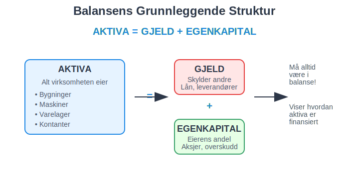
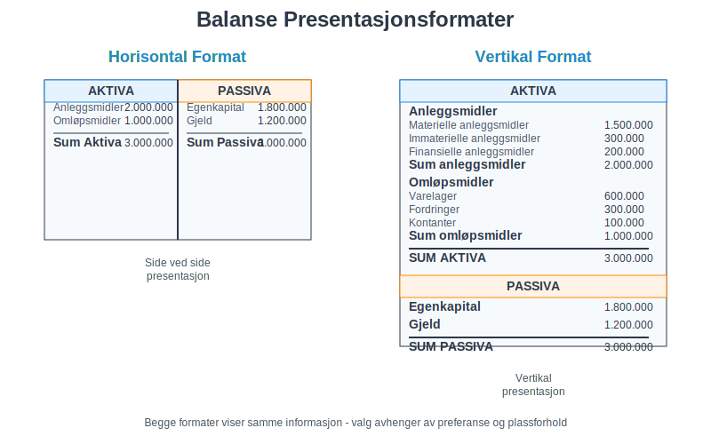
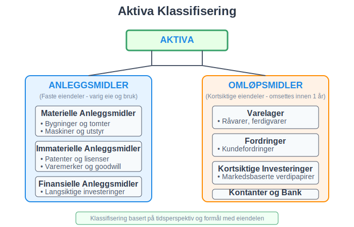
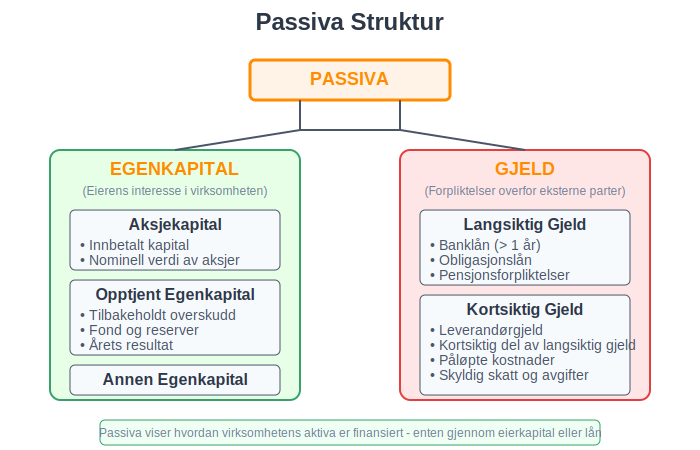
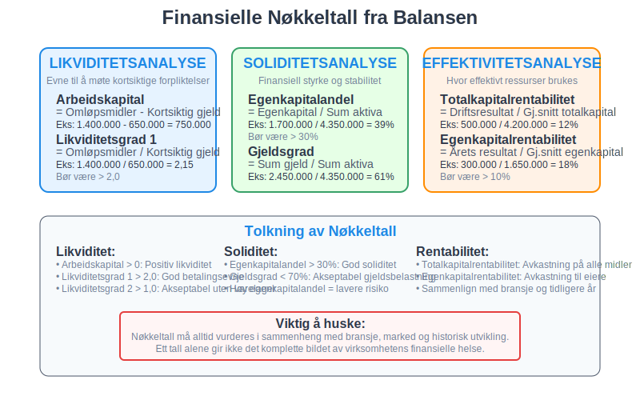
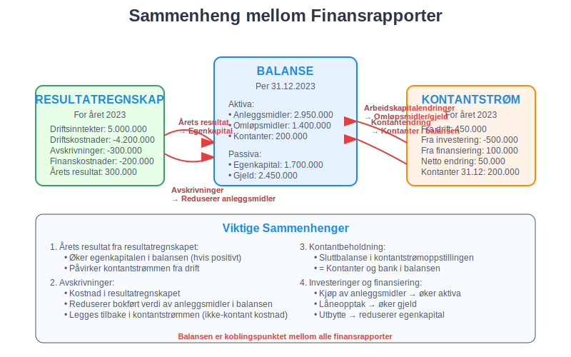
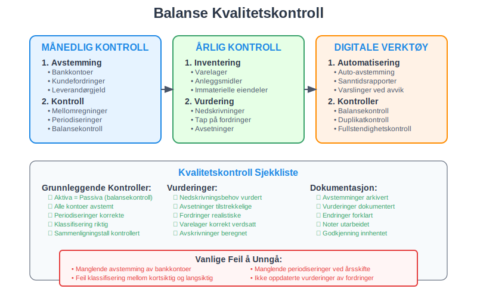

---
title: "Hva er Balanse i Regnskap?"
seoTitle: "Hva er Balanse i Regnskap?"
description: '**Balansen** er et av de mest fundamentale og viktige finansielle dokumentene i regnskapsføring. Den gir et øyeblikksbilde av en virksomhets økonomiske still...'
---

**Balansen** er et av de mest fundamentale og viktige finansielle dokumentene i regnskapsføring. Den gir et øyeblikksbilde av en virksomhets økonomiske stilling på et bestemt tidspunkt og viser forholdet mellom det virksomheten eier ([**eiendeler**](/blogs/regnskap/hva-er-eiendeler "Hva er Eiendeler? Komplett Oversikt over Eiendelstyper"), også kalt **aktiva**) og hvordan dette er finansiert ([passiva](/blogs/regnskap/hva-er-passiva "Hva er Passiva? En Guide til Gjeld og Egenkapital i Regnskap")). Denne artikkelen gir en omfattende gjennomgang av balansens struktur, komponenter og praktiske anvendelse.

## Seksjon 1: Balansens Grunnleggende Konsept

Balansen bygger på den fundamentale **regnskapsligningen** som må alltid være i perfekt balanse:

**Aktiva = Gjeld + [Egenkapital](/blogs/regnskap/hva-er-egenkapital "Hva er Egenkapital? Komplett Guide til Egenkapital i Regnskap")**

Denne ligningen reflekterer et enkelt, men kraftfullt prinsipp: Alt en virksomhet eier (aktiva) må være finansiert enten gjennom lån (gjeld) eller eierens investeringer og tilbakeholdt overskudd ([egenkapital](/blogs/regnskap/hva-er-egenkapital "Hva er Egenkapital? Komplett Guide til Egenkapital i Regnskap")).

### 1.1 Balansens Tidsperspektiv

I motsetning til resultatregnskapet som viser aktivitet over en periode, representerer balansen en **øyeblikksbilde** på et spesifikt tidspunkt. Dette gjør den til et statisk dokument som fanger virksomhetens finansielle posisjon på balansedagen.

### 1.2 Balansens Dobbelte Natur

Balansen kan presenteres på to måter:

* **Horisontal format:** Aktiva på venstre side, passiva på høyre side
* **Vertikal format:** Aktiva øverst, deretter gjeld og egenkapital

## Seksjon 2: Aktiva - Virksomhetens Eiendeler

**Aktiva** representerer alle økonomiske ressurser som virksomheten kontrollerer og som forventes å gi fremtidige økonomiske fordeler. For en detaljert gjennomgang av aktiva, se vår artikkel [Hva er aktiva?](/blogs/regnskap/hva-er-aktiva "Hva er Aktiva? En Komplett Guide til Eiendeler i Regnskap"). For en bredere forståelse av eiendeler generelt, se [Hva er eiendel?](/blogs/regnskap/hva-er-eiendel "Hva er Eiendel i Regnskap? Komplett Guide til Eiendom og Verdier"). For å forstå hvordan eiendeler verdsettes i formuessammenheng, se [Hva er formuesverdi?](/blogs/regnskap/hva-er-formuesverdi "Formuesverdi - Komplett Guide til Verdivurdering og Formuesvurdering").

### 2.1 Anleggsmidler (Faste Eiendeler)

Anleggsmidler er [eiendeler](/blogs/regnskap/hva-er-eiendel "Hva er Eiendel i Regnskap? Komplett Guide til Eiendom og Verdier") som virksomheten har til varig eie og bruk:

* **Materielle anleggsmidler:** Bygninger, maskiner, inventar
* **Immaterielle anleggsmidler:** Patenter, varemerker, [goodwill](/blogs/kontoplan/1080-goodwill "Konto 1080 - Goodwill"), [forskning og utvikling](/blogs/kontoplan/1000-forskning-og-utvikling "Hva er Konto 1000 - Forskning og utvikling?")
* **Finansielle anleggsmidler:** Langsiktige investeringer, aksjer

For mer informasjon om anleggsmidler, se [Hva er anleggsmidler?](/blogs/regnskap/hva-er-anleggsmidler "Hva er Anleggsmidler? Komplett Guide til Faste Eiendeler").

### 2.2 Omløpsmidler (Kortsiktige Eiendeler)

Omløpsmidler er [eiendeler](/blogs/regnskap/hva-er-eiendel "Hva er Eiendel i Regnskap? Komplett Guide til Eiendom og Verdier") som forventes omsatt til kontanter innen ett år:

* **Varelager:** Råvarer, varer under produksjon, ferdigvarer
* **Fordringer:** [Kundefordringer](/blogs/regnskap/hva-er-debitor "Hva er Debitor i Regnskap? Komplett Guide til Kundefordringer og Debitorhåndtering"), andre fordringer
* **Kortsiktige investeringer:** Markedsbaserte verdipapirer
* **[Kassebeholdning](/blogs/regnskap/hva-er-kassebeholdning "Hva er Kassebeholdning? Komplett Guide til Kontanter og Likvide Midler") og bankinnskudd**

## Seksjon 3: Passiva - Finansieringskilder

**[Passiva](/blogs/regnskap/hva-er-passiva "Hva er Passiva? En Guide til Gjeld og Egenkapital i Regnskap")** viser hvordan virksomhetens aktiva er finansiert og består av gjeld og egenkapital.

### 3.1 Gjeld (Forpliktelser)

[Gjeld](/blogs/regnskap/hva-er-gjeld "Hva er Gjeld i Regnskap? Komplett Guide til Forpliktelser og Gjeldstyper") representerer virksomhetens forpliktelser overfor eksterne parter:

#### Langsiktig Gjeld
* Banklån med løpetid over ett år
* Obligasjonslån
* [Pensjonsforpliktelser](/blogs/regnskap/hva-er-pensjon "Hva er Pensjon? Komplett Guide til Norsk Pensjonssystem") - se også [pensjonsrapportering](/blogs/regnskap/hva-er-pensjonsrapportering "Hva er Pensjonsrapportering? Komplett Guide til Pensjon i Regnskap")
* [Utsatt skatt](/blogs/kontoplan/1070-utsatt-skattfordel "Konto 1070 - Utsatt skattfordel")

#### Kortsiktig Gjeld
* Leverandørgjeld
* Kortsiktig del av langsiktig gjeld
* Påløpte kostnader
* Skyldig skatt og avgifter

For en detaljert gjennomgang av gjeldsbegrepet, klassifisering og praktisk håndtering, se vår omfattende artikkel [Hva er gjeld?](/blogs/regnskap/hva-er-gjeld "Hva er Gjeld i Regnskap? Komplett Guide til Forpliktelser og Gjeldstyper").

### 3.2 Egenkapital

[Egenkapital](/blogs/regnskap/hva-er-egenkapital "Hva er Egenkapital? Komplett Guide til Egenkapital i Regnskap") representerer eiernes interesse i virksomheten og utgjør deres [nettoformue](/blogs/regnskap/hva-er-formue "Hva er Formue i Regnskap? Beregning, Typer og Analyse av Nettoformue") i selskapet:

* **Aksjekapital:** Innbetalt kapital fra aksjonærer. Les mer i [Hva er aksjekapital?](/blogs/regnskap/hva-er-aksjekapital "Hva er Aksjekapital? Komplett Guide til Egenkapital i AS")
* **Opptjent egenkapital:** Tilbakeholdt overskudd fra tidligere år
* **Årets resultat:** Netto resultat for inneværende år

## Seksjon 4: Balansens Praktiske Oppbygging

### 4.1 Standardisert Balanseoppsett

Norske virksomheter følger en standardisert struktur for balansen som sikrer sammenlignbarhet:

| **AKTIVA** | **Beløp** | **PASSIVA** | **Beløp** |
|------------|-----------|-------------|-----------|
| **ANLEGGSMIDLER** | | **EGENKAPITAL** | |
| Immaterielle eiendeler | 150.000 | Aksjekapital | 500.000 |
| Materielle anleggsmidler | 2.500.000 | Opptjent egenkapital | 1.200.000 |
| Finansielle anleggsmidler | 300.000 | **Sum egenkapital** | **1.700.000** |
| **Sum anleggsmidler** | **2.950.000** | | |
| | | **GJELD** | |
| **OMLØPSMIDLER** | | Langsiktig gjeld | 1.800.000 |
| Varelager | 800.000 | Kortsiktig gjeld | 650.000 |
| Fordringer | 400.000 | **Sum gjeld** | **2.450.000** |
| Kontanter og bank | 200.000 | | |
| **Sum omløpsmidler** | **1.400.000** | | |
| | | | |
| **SUM AKTIVA** | **4.350.000** | **SUM PASSIVA** | **4.350.000** |

### 4.2 Balansekontroll og Avstemming

En korrekt balanse må alltid ha like store summer på aktiva- og passivasiden. Hvis balansen ikke stemmer, indikerer dette feil i regnskapsføringen som må identifiseres og korrigeres. Dette er hvor [avstemming](/blogs/regnskap/hva-er-avstemming "Hva er Avstemming i Regnskap? Komplett Guide til Regnskapsavstemming") og [avvikshåndtering](/blogs/regnskap/hva-er-avvikshåndtering "Hva er Avvikshåndtering i Regnskap? Prosess, Metoder og Beste Praksis") blir kritisk viktig.

## Seksjon 5: Balansens Rolle i Finansiell Analyse

Balansen er grunnlaget for beregning av mange viktige [nøkkeltall](/blogs/regnskap/hva-er-nokkeltall "Hva er Nøkkeltall? Komplett Guide til Finansielle Nøkkeltall i Regnskap") som brukes til å analysere virksomhetens finansielle prestasjon og stabilitet. Et særlig viktig forhold er [Q-ratio](/blogs/regnskap/hva-er-q-ratio "Hva er Q-ratio (Tobin's Q)? Komplett Guide til Verdivurdering og Markedsanalyse"), som sammenligner markedsverdi med bokført verdi av eiendeler.

### 5.1 Likviditetsanalyse

Balansen gir grunnlag for å vurdere virksomhetens **likviditet** - evnen til å møte kortsiktige forpliktelser:

* **Arbeidskapital** = Omløpsmidler - Kortsiktig gjeld
* **Likviditetsgrad 1** = Omløpsmidler / Kortsiktig gjeld
* **Likviditetsgrad 2** = (Omløpsmidler - Varelager) / Kortsiktig gjeld

Disse nøkkeltallene er grunnleggende for å vurdere bedriftens [betalingsevne](/blogs/regnskap/hva-er-betalingsevne "Hva er Betalingsevne? Analyse, Nøkkeltall og Vurdering av Likviditet") og finansielle stabilitet. For dypere innsikt i arbeidskapital, se [Hva er arbeidskapital?](/blogs/regnskap/hva-er-arbeidskapital "Hva er Arbeidskapital? En Komplett Guide til Working Capital").

### 5.2 Soliditetsanalyse

Soliditet måler virksomhetens finansielle styrke og stabilitet:

* **Egenkapitalandel** = Egenkapital / Sum aktiva
* **Gjeldsgrad** = Sum gjeld / Sum aktiva
* **[Rentedekningsgrad](/blogs/regnskap/hva-er-dekningsgrad "Hva er Dekningsgrad? Komplett Guide til Beregning og Analyse")** = Driftsresultat / Rentekostnader

### 5.3 Effektivitetsanalyse

Balansen brukes også til å måle hvor effektivt virksomheten bruker sine ressurser:

* **Totalkapitalrentabilitet** = Driftsresultat / Gjennomsnittlig totalkapital
* **Egenkapitalrentabilitet** = Årets resultat / Gjennomsnittlig egenkapital
* **Omløpshastighet aktiva** = Omsetning / Gjennomsnittlig totalkapital

## Seksjon 6: Balansens Sammenheng med Andre Finansrapporter

### 6.1 Kobling til Resultatregnskapet

Balansen og resultatregnskapet er tett forbundet:

* **Årets resultat** fra resultatregnskapet overføres til egenkapitalen i balansen
* **Avskrivninger** reduserer verdien av anleggsmidler i balansen. Les mer om [avskrivning](/blogs/regnskap/hva-er-avskrivning "Hva er Avskrivning? Komplett Guide til Avskrivningsmetoder")
* **[Periodiseringer](/blogs/regnskap/hva-er-periodisering "Hva er Periodisering i Regnskap? Komplett Guide til Periodiseringsprinsippet")** påvirker både resultat og balanseposter

### 6.2 Kobling til [Kontantstrømoppstillingen](/blogs/regnskap/hva-er-kontantstrom "Hva er Kontantstrøm? Komplett Guide til Cash Flow Analyse og Styring")

[Kontantstrømoppstillingen](/blogs/regnskap/hva-er-kontantstrom "Hva er Kontantstrøm? Komplett Guide til Cash Flow Analyse og Styring") forklarer endringer i [kontantbeholdningen](/blogs/regnskap/hva-er-kontantbeholdning "Hva er Kontantbeholdning? Komplett Guide til Kontantforvaltning og Likviditet") mellom to balanser:

* **Endringer i arbeidskapital** påvirker [kontantstrømmen](/blogs/regnskap/hva-er-kontantstrom "Hva er Kontantstrøm? Komplett Guide til Cash Flow Analyse og Styring") fra drift
* **Investeringer i anleggsmidler** vises som [kontantstrøm](/blogs/regnskap/hva-er-kontantstrom "Hva er Kontantstrøm? Komplett Guide til Cash Flow Analyse og Styring") fra investeringsaktiviteter
* **Låneopptak og nedbetaling** påvirker [kontantstrøm](/blogs/regnskap/hva-er-kontantstrom "Hva er Kontantstrøm? Komplett Guide til Cash Flow Analyse og Styring") fra finansieringsaktiviteter

## Seksjon 7: Spesielle Balanseposter og Vurderinger

### 7.1 Varelager

Varelager kan verdsettes etter ulike metoder:

* **FIFO** (First In, First Out)
* **Gjennomsnittskost**
* **Laveste verdis prinsipp**

### 7.2 Fordringer

Fordringer må vurderes for **tap på krav**:

* Individuelle vurderinger av store fordringer
* Gruppevise vurderinger basert på historisk tapserfaring
* Nedskrivning av fordringer som anses som tapte

### 7.3 Anleggsmidler og Avskrivninger

Anleggsmidler skal **avskrives** over forventet brukstid:

* **Lineær avskrivning:** Lik avskrivning hvert år
* **[Saldoavskrivning](/blogs/regnskap/hva-er-saldoavskrivning "Hva er Saldoavskrivning i Regnskap? Komplett Guide til Degressiv Avskrivning"):** Prosentvis avskrivning av gjenstående verdi
* **Produksjonsavskrivning:** Basert på faktisk bruk

For immaterielle eiendeler brukes **amortisering**. Les mer i [Hva er amortisering?](/blogs/regnskap/hva-er-amortisering "Hva er Amortisering? En Komplett Guide til Avskrivninger").

## Seksjon 8: Balansens Juridiske og Regulatoriske Aspekter

### 8.1 Regnskapslovens Krav

Norsk regnskapslov stiller spesifikke krav til balansens innhold og presentasjon:

* **Klassifisering** av poster etter art og løpetid
* **Sammenligningstall** fra foregående år
* **[Noter](/blogs/regnskap/noter "Noter - Komplett Guide til Regnskapsnoter i Norge")** som forklarer og utdyper balanseposter

### 8.2 Årsregnskapet og Balansen

Balansen er en integrert del av årsregnskapet sammen med:

* Resultatregnskap
* [Kontantstrømoppstilling](/blogs/regnskap/hva-er-kontantstrom "Hva er Kontantstrøm? Komplett Guide til Cash Flow Analyse og Styring")
[Noter](/blogs/regnskap/noter "Noter - Komplett Guide til Regnskapsnoter i Norge")
* Årsberetning

For mer om årsavslutning, se [Hva er årsavslutning?](/blogs/regnskap/hva-er-aarsavslutning "Hva er Årsavslutning i Regnskap? Komplett Guide til Årsoppgjør og Regnskapsavslutning") og [Hva er avslutningsbalanse?](/blogs/regnskap/hva-er-avslutningsbalanse "Hva er Avslutningsbalanse? Komplett Guide til Årsavslutning"). For forståelse av hvordan balanseverdier overføres mellom perioder, se [Hva er utgående balanse?](/blogs/regnskap/hva-er-utgaaende-balanse "Hva er Utgående Balanse (UB)? Komplett Guide til Saldooverføring").

## Seksjon 9: Praktiske Tips for Balansehåndtering

### 9.1 Månedlig Balansekontroll

For å sikre korrekt balanse gjennom året:

* **Månedlige avstemminger** av alle hovedkontoer
* **Kontroll av mellomregninger** og [periodiseringer](/blogs/regnskap/hva-er-periodisering "Hva er Periodisering i Regnskap? Komplett Guide til Periodiseringsprinsippet")
* **Oppfølging av avvik** og uforklarlige endringer

### 9.2 Årsavslutningsprosessen

Ved årsslutt kreves ekstra grundighet:

* **Inventering** av varelager og anleggsmidler
* **Vurdering** av fordringer og gjeld
* **Beregning** av [periodiseringer](/blogs/regnskap/hva-er-periodisering "Hva er Periodisering i Regnskap? Komplett Guide til Periodiseringsprinsippet") og [avsetninger](/blogs/regnskap/avsetning "Hva er Avsetning i Regnskap? Komplett Guide til Avsetninger og Estimater")
* **Kontroll** av at alle transaksjoner er korrekt klassifisert

### 9.3 Digitale Verktøy og Systemer

Moderne regnskapssystemer tilbyr:

* **Automatisk balansering** og kontroll
* **Sanntidsrapportering** av balansestatus
* **Integrerte avstemmingsverktøy**
* **Automatiske [periodiseringer](/blogs/regnskap/hva-er-periodisering "Hva er Periodisering i Regnskap? Komplett Guide til Periodiseringsprinsippet")**

## Seksjon 10: Balansens Betydning for Ulike Interessenter

### 10.1 For Ledelsen

Balansen gir ledelsen viktig informasjon om:

* **Finansiell posisjon** og stabilitet
* **Kapitalstruktur** og finansieringsbehov
* **Likviditetssituasjon** og betalingsevne
* **Ressursallokering** og investeringsmuligheter

### 10.2 For Investorer og Kreditorer

Eksterne interessenter bruker balansen til å vurdere:

* **Kredittverdighet** og risiko
* **Avkastningspotensial** på investeringer
* **Finansiell styrke** og bærekraft
* **Sammenligning** med andre virksomheter

### 10.3 For Skattemyndigheter

Skattemyndighetene bruker balansen til:

* **Kontroll** av skattemessige verdier
* **Vurdering** av skattepliktige gevinster og tap
* **Oppfølging** av skattemessige avskrivninger
* **Verifikasjon** av rapporterte tall

## Konklusjon

Balansen er et fundamentalt verktøy i regnskapsføring som gir et komplett bilde av en virksomhets økonomiske stilling. Den fungerer som et øyeblikksbilde som viser hvordan virksomhetens ressurser er sammensatt og finansiert. 

Forståelse av balansens struktur og komponenter er essensielt for:

* **Økonomisk styring** og beslutningstagning
* **Finansiell analyse** og risikovurdering  
* **Kommunikasjon** med interessenter
* **Overholdelse** av juridiske krav

En korrekt og balansert balanse krever systematisk arbeid med [saldobalanse](/blogs/regnskap/hva-er-saldobalanse "Hva er Saldobalanse? En Komplett Guide"), grundig avstemming og kontinuerlig kvalitetskontroll. Ved å mestre balansens prinsipper og praktiske anvendelse, legger man grunnlaget for solid økonomisk styring og pålitelig finansiell rapportering.

Balansen er ikke bare et regnskapsteknisk dokument, men et strategisk verktøy som reflekterer virksomhetens økonomiske helse og fremtidsmuligheter. Den forteller historien om hvordan virksomheten har bygget opp sine ressurser og hvordan den har valgt å finansiere sin vekst og utvikling.

## Soliditet og Solvens

Mens balansen gir innsikt i bedriftens finansielle posisjon på et bestemt tidspunkt, fokuserer **[soliditet](/blogs/regnskap/soliditet "Soliditet “ Forståelse av egenkapitalandel og finansiell robusthet")** på bedriftens langsiktige finansielle robusthet ved å måle andelen egenkapital i totalkapitalen. Soliditet komplementerer balansen ved å gi en rask indikasjon på selskapets evne til å tåle tap og finansielle påkjenninger.

