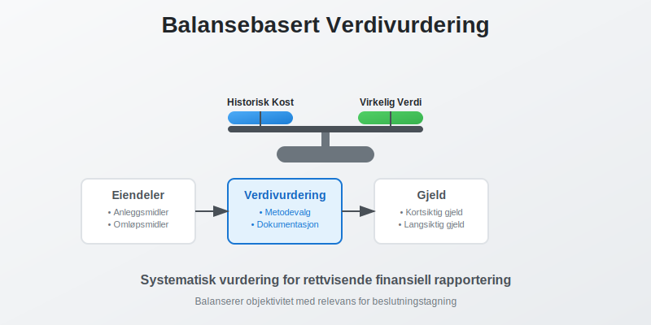
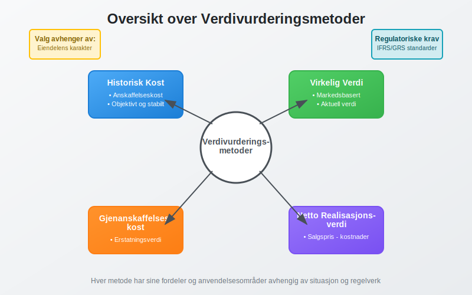
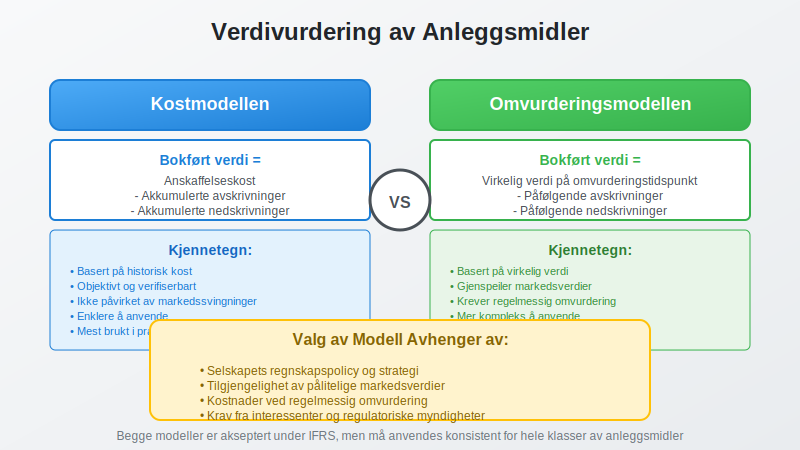
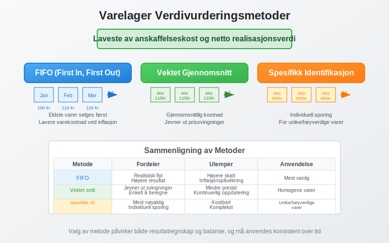
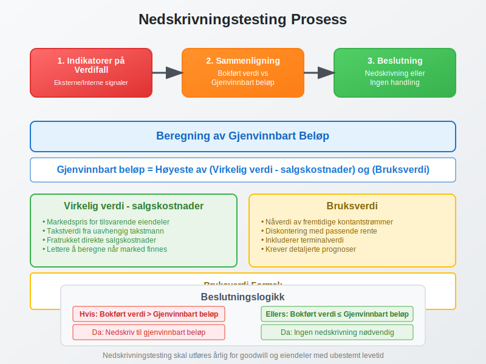

---
title: "Hva er Balansebasert Verdivurdering?"
seoTitle: "Balansebasert verdivurdering | Metoder og regnskapsbruk"
description: "Hva er balansebasert verdivurdering i regnskap? Lær metoder som historisk kost og virkelig verdi, og når de brukes."
summary: "Balansebasert verdivurdering forklart: metoder, bruk og nøkkelbegreper."
---

**Balansebasert verdivurdering** er prosessen med å fastsette verdien av [eiendeler](/blogs/regnskap/hva-er-aktiva "Hva er Aktiva? Komplett Guide til Eiendeler i Balansen") og gjeld i [balansen](/blogs/regnskap/hva-er-avslutningsbalanse "Hva er Avslutningsbalanse? Guide til Årsoppgjør og Balanseoppsett"). Dette er et **grunnleggende prinsipp** i regnskapsføring som påvirker hvordan selskaper presenterer sin finansielle stilling og verdiskapning. I motsetning til [inntjeningsbasert verdivurdering](/blogs/regnskap/hva-er-inntjeningsbasert-verdivurdering "Inntjeningsbasert Verdivurdering - DCF, P/E og Verdsettelsesmetoder") som fokuserer på fremtidig inntjening, ser balansebasert verdivurdering på nåværende eiendeler og forpliktelser. For å forstå sammenhengen mellom markedsverdi og bokført verdi, se [Q-ratio](/blogs/regnskap/hva-er-q-ratio "Hva er Q-ratio (Tobin's Q)? Komplett Guide til Verdivurdering og Markedsanalyse").



## Hva er Balansebasert Verdivurdering?

Balansebasert verdivurdering omfatter **systematisk vurdering** av alle poster i balansen for å sikre at de gjenspeiler deres **reelle økonomiske verdi**. Dette innebærer valg mellom ulike verdivurderingsmetoder basert på:

* **Eiendelens karakter** og bruksområde
* **Markedsforhold** og tilgjengelighet av prisdata
* **Regnskapsstandarder** og lovkrav
* **Selskapets forretningsmodell** og strategi

### Formål med Balansebasert Verdivurdering

Hovedformålene med balansebasert verdivurdering er å:

* **Gi rettvisende bilde** av selskapets finansielle stilling
* **Støtte beslutningstagning** for ledelse og investorer
* **Sikre sammenlignbarhet** mellom selskaper og perioder
* **Oppfylle regulatoriske krav** og regnskapsstandarder
* **Identifisere verdiskapning** og verdiforringelse

## Verdivurderingsmetoder

Det finnes flere metoder for balansebasert verdivurdering, hver med sine fordeler og anvendelsesområder.



### Historisk Kost

**Historisk kost** er den opprinnelige [anskaffelseskosten](/blogs/regnskap/hva-er-anskaffelseskost "Hva er Anskaffelseskost? Komplett Guide til Beregning og Regnskapsføring") for en eiendel, justert for [avskrivninger](/blogs/regnskap/hva-er-avskrivning "Hva er Avskrivning i Regnskap? Metoder, Beregning og Praktiske Eksempler") og nedskrivninger.

#### Fordeler med Historisk Kost:
* **Objektivitet:** Basert på faktiske transaksjoner
* **Verifiserbarhet:** Lett å dokumentere og kontrollere
* **Stabilitet:** Ikke påvirket av markedssvingninger
* **Enkelt:** Krever minimal vurdering og skjønn

#### Ulemper med Historisk Kost:
* **Utdatert informasjon:** Gjenspeiler ikke nåværende markedsverdier
* **Inflasjonspåvirkning:** Ikke justert for prisstigning
* **Begrenset relevans:** Kan gi misvisende bilde av verdier

### Virkelig Verdi (Fair Value)

**Virkelig verdi** er prisen som ville blitt mottatt ved salg av en eiendel eller betalt for å overføre en forpliktelse i en ordnet transaksjon mellom markedsdeltakere.

#### Hierarki for Virkelig Verdi:

| Nivå | Beskrivelse | Eksempler |
|------|-------------|-----------|
| **Nivå 1** | Noterte priser i aktive markeder | Børsnoterte aksjer, obligasjoner |
| **Nivå 2** | Observable input, ikke noterte priser | Rentekurver, valutakurser |
| **Nivå 3** | Ikke-observable input | Interne verdsettelsesmodeller |

### Gjenanskaffelseskost

**Gjenanskaffelseskost** er kostnaden for å anskaffe en tilsvarende eiendel med samme funksjonalitet og kapasitet.

#### Anvendelse av Gjenanskaffelseskost:
* **Forsikringsformål:** Fastsette erstatningsverdi
* **Spesialiserte eiendeler:** Når markedspriser ikke finnes
* **Tekniske anlegg:** Industrielle installasjoner
* **Immaterielle eiendeler:** Programvare og systemer

### Netto Realisasjonsverdi

**Netto realisasjonsverdi** er estimert salgspris fratrukket estimerte kostnader for ferdigstillelse og salg.

#### Typisk Anvendelse:
* **Varelager:** Spesielt for sesongvarer og utdaterte produkter
* **Kundefordringer:** Justert for forventede tap
* **Anleggsmidler:** Ved planlagt salg eller nedleggelse

## Praktisk Anvendelse av Verdivurdering

### Verdivurdering av Anleggsmidler

[Anleggsmidler](/blogs/regnskap/hva-er-anleggsmidler "Hva er Anleggsmidler? Materielle, Immaterielle og Finansielle Eiendeler") kan verdivurderes etter to hovedmodeller:



#### Kostmodellen:
```
Bokført verdi = Anskaffelseskost - Akkumulerte avskrivninger - Akkumulerte nedskrivninger
```

#### Omvurderingsmodellen:
```
Bokført verdi = Virkelig verdi på omvurderingstidspunktet - Påfølgende avskrivninger - Påfølgende nedskrivninger
```

### Verdivurdering av Finansielle Instrumenter

Finansielle instrumenter klassifiseres i kategorier som bestemmer verdivurderingsmetode:

| Kategori | Verdivurdering | Verdiendringer |
|----------|----------------|----------------|
| **Amortisert kost** | Historisk kost + renter - avdrag | Resultatføres ved realisasjon |
| **Virkelig verdi over OCI** | Virkelig verdi | Føres over utvidet resultat |
| **Virkelig verdi over resultat** | Virkelig verdi | Resultatføres løpende |

### Verdivurdering av Varelager

Varelager verdivurderes til **laveste av anskaffelseskost og netto realisasjonsverdi**.

#### Kostnadsmetoder for Varelager:

* **FIFO (First In, First Out):** Eldste varer selges først
* **Vektet gjennomsnitt:** Gjennomsnittlig kostnad for alle varer
* **Spesifikk identifikasjon:** For unike eller høyverdige varer



## Omvurdering av Eiendeler

**Omvurdering** innebærer å justere bokført verdi til virkelig verdi på balansedagen.

### Regnskapsføring av Omvurdering

#### Oppskrivning:
```
Dr. Eiendel (økning i verdi)
Cr. Omvurderingsreserve (egenkapital)
```

#### Nedskrivning:
```
Dr. Nedskrivning (kostnad)
Cr. Eiendel (reduksjon i verdi)
```

### Omvurderingsreserve

**Omvurderingsreserven** er en del av egenkapitalen som inneholder:

* **Urealiserte gevinster** fra oppskrivning av eiendeler
* **Reversering av tidligere nedskrivninger**
* **Valutaomregningsdifferanser** på utenlandske datterselskaper

## Nedskrivningstesting

**Nedskrivningstesting** er prosessen med å vurdere om en eiendels bokførte verdi overstiger dens **gjenvinnbare beløp**.

### Indikatorer på Verdifall

Eksterne indikatorer:
* **Markedsverdifall** på mer enn forventet
* **Negative endringer** i teknologi eller marked
* **Økte renter** som påvirker diskonteringsrente
* **Selskapets markedsverdi** under bokført verdi

Interne indikatorer:
* **Fysisk skade** eller forringelse
* **Endringer i bruk** eller strategi
* **Dårligere ytelse** enn forventet
* **Planer om avhending** eller omstrukturering

### Beregning av Gjenvinnbart Beløp



**Gjenvinnbart beløp** er det høyeste av:

1. **Virkelig verdi fratrukket salgskostnader**
2. **Bruksverdi** (nåverdi av fremtidige kontantstrømmer)

#### Beregning av Bruksverdi:
```
Bruksverdi = Σ (Kontantstrøm år t / (1 + diskonteringsrente)^t) + Terminalverdi
```

Denne tilnærmingen ligner på metodene brukt i [inntjeningsbasert verdivurdering](/blogs/regnskap/hva-er-inntjeningsbasert-verdivurdering "Inntjeningsbasert Verdivurdering - DCF, P/E og Verdsettelsesmetoder"), men anvendes her for å teste om eiendelens bokførte verdi er for høy.

## Verdivurdering i Ulike Bransjer

### Eiendomsbransjen

I eiendomsbransjen er **virkelig verdi** ofte foretrukket for:

* **Investeringseiendommer:** Verdivurderes til virkelig verdi
* **Utleieeiendommer:** Basert på markedspriser og avkastningskrav
* **Utviklingsprosjekter:** Netto nåverdi av fremtidige kontantstrømmer

### Teknologibransjen

Teknologiselskaper har spesielle utfordringer:

* **Immaterielle eiendeler:** Vanskelig å verdsette
* **Rask teknologiutvikling:** Høy risiko for verdifall
* **Forsknings- og utviklingskostnader:** Usikker fremtidig verdi

### Finansbransjen

Finansinstitusjoner har omfattende krav til verdivurdering:

* **Utlånsportefølje:** Justert for kredittrisiko
* **Verdipapirer:** Markedsbasert verdivurdering
* **Derivater:** Komplekse verdsettelsesmodeller

## Regulatoriske Krav

### IFRS-krav

Under **IFRS** er det spesifikke krav til verdivurdering:

* **IAS 16:** Eiendom, anlegg og utstyr
* **IAS 38:** Immaterielle eiendeler
* **IAS 39/IFRS 9:** Finansielle instrumenter
* **IAS 40:** Investeringseiendommer
* **IFRS 13:** Måling av virkelig verdi

### Norske Regnskapsstandarder

**God regnskapsskikk** i Norge krever:

* **Forsiktighetsprinsippet:** Ikke overvurdere eiendeler
* **Sammenstillingsprinsippet:** Matche kostnader og inntekter
* **Konsistensprinsippet:** Ensartet anvendelse over tid

## Utfordringer og Risiko

### Skjønnsmessige Vurderinger

Balansebasert verdivurdering innebærer betydelig **skjønn** som kan påvirke:

* **Resultatmanipulasjon:** Bevisst over- eller undervurdering
* **Volatilitet:** Svingninger i rapporterte verdier
* **Sammenlignbarhet:** Forskjeller mellom selskaper

### Markedsrisiko

**Markedsvolatilitet** påvirker verdivurdering gjennom:

* **Prissvingninger:** Endringer i markedsverdier
* **Likviditetsrisiko:** Vanskeligheter med å realisere verdier
* **Kredittrisiko:** Endringer i motpartens kredittverdighet

## Beste Praksis

### Dokumentasjon

God dokumentasjon av verdivurdering inkluderer:

* **Verdsettelsesmetoder:** Begrunnelse for valg av metode
* **Forutsetninger:** Underliggende antagelser og estimater
* **Sensitivitetsanalyse:** Påvirkning av endrede forutsetninger
* **Kvalitetssikring:** Uavhengig gjennomgang av vurderinger

### Intern Kontroll

Effektiv intern kontroll omfatter:

* **Klare retningslinjer:** For verdivurderingsprosesser
* **Kompetansekrav:** Kvalifisert personell
* **Uavhengig validering:** Ekstern bekreftelse av verdier
* **Regelmessig oppdatering:** Kontinuerlig overvåking

### Rapportering og Transparens

God rapportering inkluderer:

* **Noteopplysninger:** Detaljert informasjon om metoder
* **Sensitivitetsanalyse:** Påvirkning av endrede forutsetninger
* **Usikkerhetsmoment:** Identifikasjon av risikoområder
* **Sammenlignbare tall:** Konsistent presentasjon over tid

## Fremtidige Utviklingstrekk

### Digitalisering

**Teknologiske fremskritt** påvirker verdivurdering:

* **Automatisering:** Redusert manuelt arbeid
* **Big Data:** Bedre datagrunnlag for vurderinger
* **Kunstig intelligens:** Avanserte verdsettelsesmodeller
* **Blockchain:** Økt transparens og sporbarhet

### Bærekraftrapportering

**ESG-faktorer** får økende betydning:

* **Miljørisiko:** Påvirkning på eiendelsverdier
* **Sosiale faktorer:** Omdømmerisiko og verdiskapning
* **Styring:** Corporate governance og risikostyring

### Regulatoriske Endringer

Forventede endringer inkluderer:

* **Strengere krav:** Økt fokus på kvalitet og transparens
* **Harmonisering:** Mer ensartede standarder globalt
* **Teknologitilpasning:** Nye regler for digitale eiendeler

## Konklusjon

Balansebasert verdivurdering er et **komplekst og kritisk område** i regnskapsføring som krever:

* **Grundig forståelse** av ulike verdivurderingsmetoder
* **Solid faglig skjønn** i valg og anvendelse av metoder
* **Kontinuerlig oppdatering** av kunnskap og praksis
* **Effektiv intern kontroll** og kvalitetssikring

Ved å følge **beste praksis** og holde seg oppdatert på regulatoriske endringer, kan selskaper sikre at deres balansebaserte verdivurdering gir et **rettvisende bilde** av den finansielle stillingen og støtter god beslutningstagning.

For mer informasjon om relaterte emner, se våre artikler om [inntjeningsbasert verdivurdering](/blogs/regnskap/hva-er-inntjeningsbasert-verdivurdering "Inntjeningsbasert Verdivurdering - DCF, P/E og Verdsettelsesmetoder"), [anleggsmidler](/blogs/regnskap/hva-er-anleggsmidler "Hva er Anleggsmidler? Materielle, Immaterielle og Finansielle Eiendeler"), [avskrivning](/blogs/regnskap/hva-er-avskrivning "Hva er Avskrivning i Regnskap? Metoder, Beregning og Praktiske Eksempler") og [anskaffelseskost](/blogs/regnskap/hva-er-anskaffelseskost "Hva er Anskaffelseskost? Komplett Guide til Beregning og Regnskapsføring").


