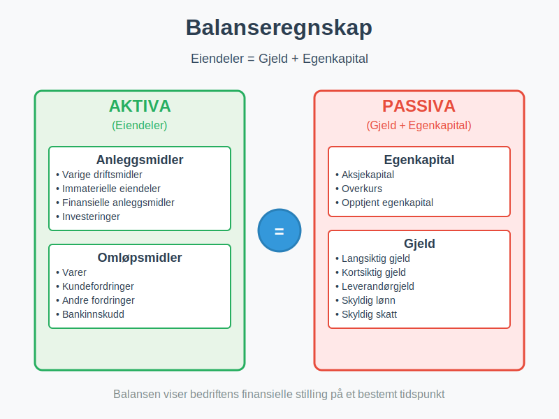
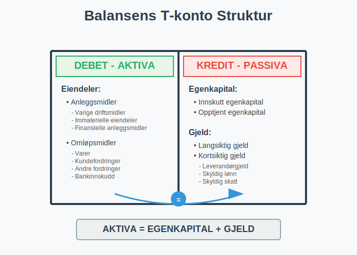
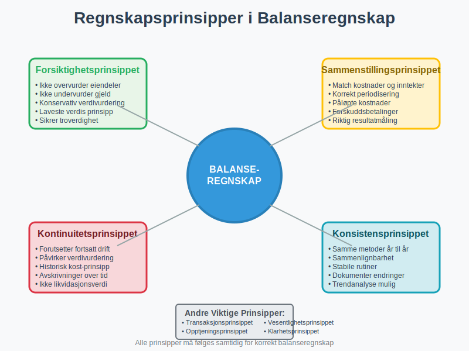
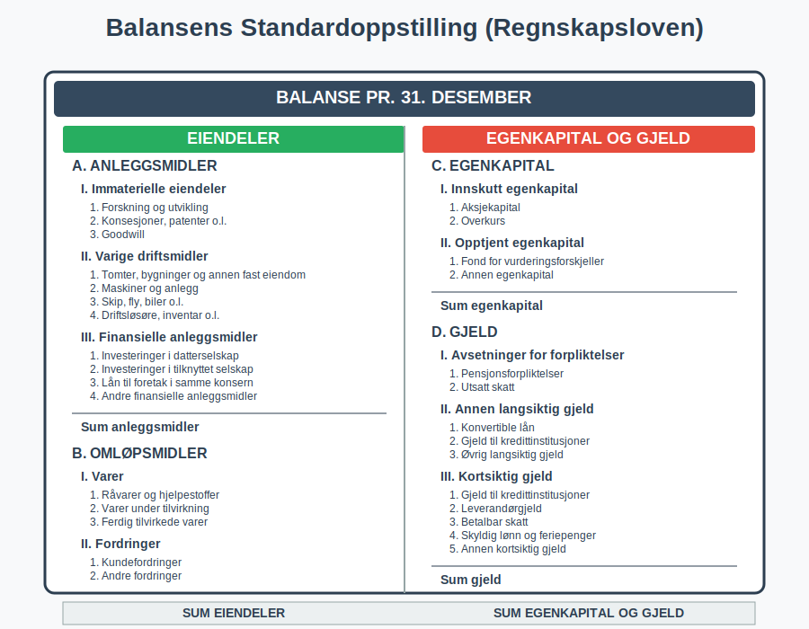
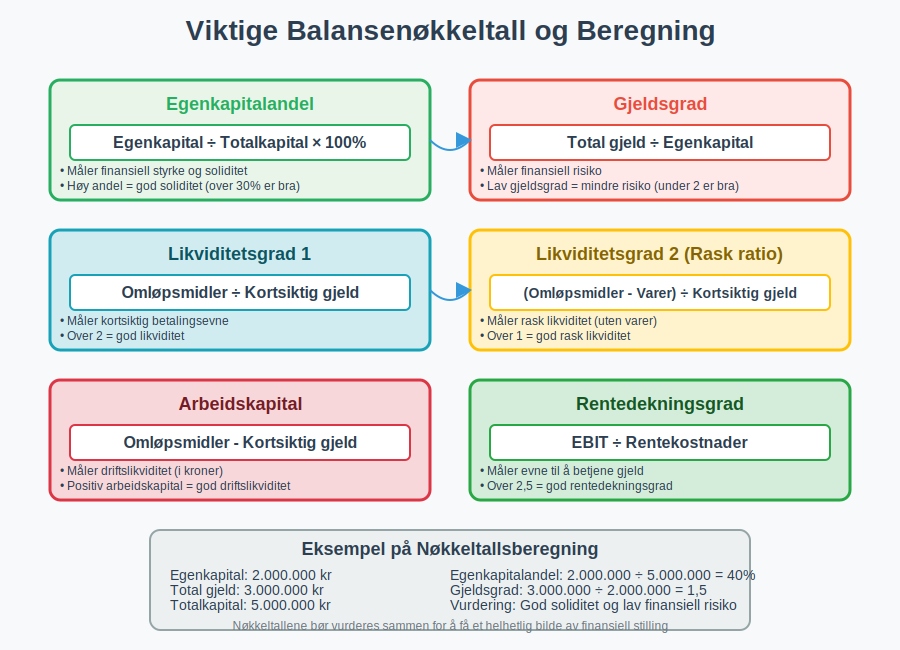
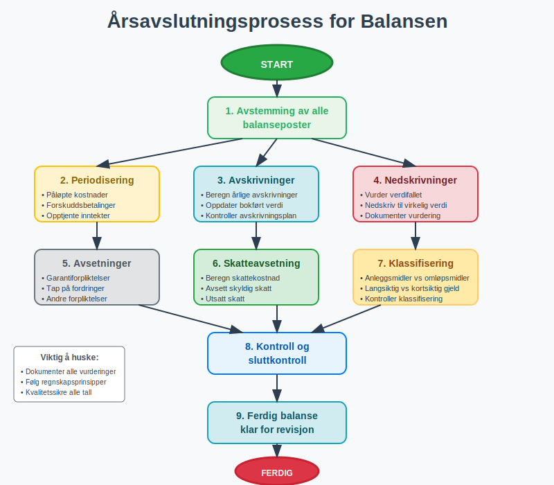
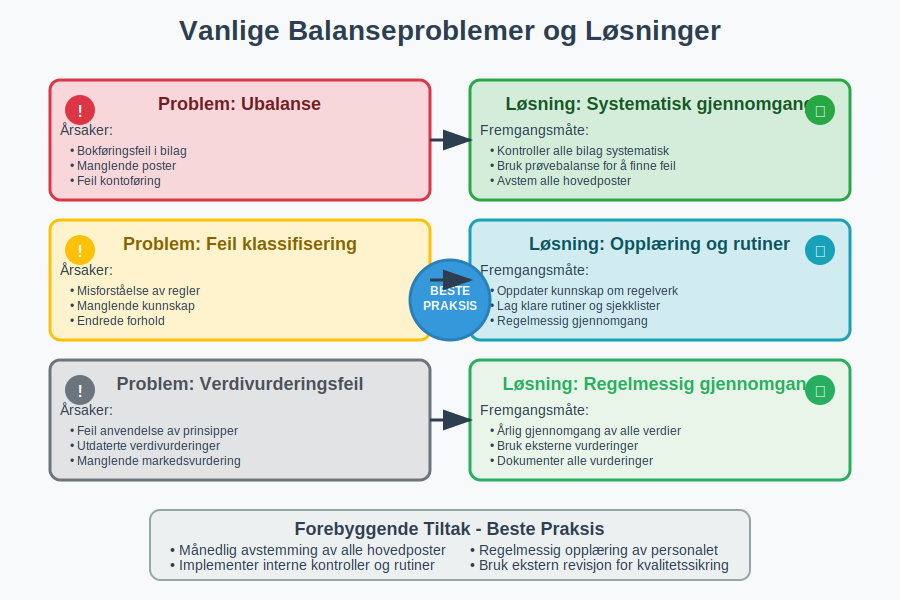

---
title: "Hva er Balanseregnskap?"
meta_title: "Hva er Balanseregnskap?"
meta_description: '**Balanseregnskap** er regnskapsføring og analyse av [balansen](/blogs/regnskap/hva-er-balanse "Hva er Balanse? Komplett Guide til Balansens Oppbygging") som v...'
slug: hva-er-balanseregnskap
type: blog
layout: pages/single
---

**Balanseregnskap** er regnskapsføring og analyse av [balansen](/blogs/regnskap/hva-er-balanse "Hva er Balanse? Komplett Guide til Balansens Oppbygging") som viser bedriftens **finansielle stilling** på et bestemt tidspunkt. Balansen er en av de tre hovedrapportene i [regnskapet](/blogs/regnskap/hva-er-regnskap "Hva er Regnskap? En komplett guide") og følger den grunnleggende regnskapsligningen: **Eiendeler = Gjeld + Egenkapital**. Som en sentral del av [eksternregnskapet](/blogs/regnskap/hva-er-eksternregnskap "Hva er Eksternregnskap? Komplett Guide til Ekstern Finansiell Rapportering") gir balansen eksterne interessenter viktig informasjon om bedriftens økonomiske stilling.

## Hva er Balanseregnskap?

Balanseregnskap omfatter alle prosesser knyttet til **utarbeidelse**, **analyse** og **tolkning** av balansen. Dette inkluderer:

* **Registrering** av alle eiendeler og forpliktelser
* **Klassifisering** av poster i korrekte balansekategorier
* **Verdivurdering** av [aktiva](/blogs/regnskap/hva-er-aktiva "Hva er Aktiva? Komplett Guide til Eiendeler i Balansen") og passiva
* **Presentasjon** i henhold til regnskapsstandarder
* **Analyse** av finansiell stilling og soliditet

### Balansens Grunnleggende Struktur

Balansen er bygget opp som en **T-konto** hvor venstre side viser eiendeler (aktiva) og høyre side viser gjeld og egenkapital (passiva):

## Balansens Hovedkomponenter

### Eiendeler (Aktiva)

**Eiendeler** representerer alt bedriften eier og kontrollerer som kan gi fremtidige økonomiske fordeler.

#### Anleggsmidler

[Anleggsmidler](/blogs/regnskap/hva-er-anleggsmidler "Hva er Anleggsmidler? Materielle, Immaterielle og Finansielle Eiendeler") er eiendeler som skal brukes i virksomheten over lengre tid:

* **Varige driftsmidler:** Bygninger, maskiner, inventar
* **Immaterielle eiendeler:** Goodwill, patenter, programvare
* **Finansielle anleggsmidler:** Langsiktige investeringer, [aksjer](/blogs/regnskap/hva-er-en-aksje "Hva er en Aksje? Komplett Guide til Aksjer og Aksjeinvestering")

#### Omløpsmidler

**Omløpsmidler** er eiendeler som normalt omsettes innen ett år:

* **Varer:** Råvarer, halvfabrikata, ferdigvarer
* **Fordringer:** Kundefordringer, andre kortsiktige fordringer
* **Investeringer:** Kortsiktige finansielle plasseringer
* **Bankinnskudd:** Kontanter og bankinnskudd

### Gjeld og Egenkapital (Passiva)

**Passiva** viser hvordan eiendelene er finansiert - enten gjennom gjeld eller egenkapital.

#### Egenkapital

[Egenkapital](/blogs/regnskap/hva-er-aksjekapital "Hva er Aksjekapital? Betydning, Typer og Regnskapsføring") representerer eiernes andel av bedriften:

* **Innskutt egenkapital:** [Aksjekapital](/blogs/regnskap/hva-er-aksjekapital "Hva er Aksjekapital? Betydning, Typer og Regnskapsføring"), [overkurs](/blogs/regnskap/hva-er-overkurs "Hva er Overkurs? En Guide til Overkurs i Regnskap")
* **Opptjent egenkapital:** Fri egenkapital, årets resultat

#### Gjeld

**Gjeld** er forpliktelser bedriften har overfor andre:

* **Langsiktig gjeld:** Lån med forfallstid over ett år
* **Kortsiktig gjeld:** Leverandørgjeld, skyldig lønn, kortsiktige lån

## Regnskapsprinsipper i Balanseregnskap

### Grunnleggende Prinsipper

Balanseregnskap følger flere **fundamentale regnskapsprinsipper**:

| Prinsipp | Beskrivelse | Betydning for Balansen |
|----------|-------------|------------------------|
| **Forsiktighetsprinsippet** | Ikke overvurder eiendeler eller undervurder gjeld | Konservativ verdivurdering |
| **Sammenstillingsprinsippet** | Match inntekter med tilhørende kostnader | Korrekt periodisering |
| **Kontinuitetsprinsippet** | Forutsetter fortsatt drift | Påvirker verdivurdering |
| **Konsistensprinsippet** | Samme metoder fra år til år | Sammenlignbarhet |

### Verdivurderingsprinsipper

**Verdivurdering** av balanseposter følger spesifikke regler:

* **Historisk kost:** [Anskaffelseskost](/blogs/regnskap/hva-er-anskaffelseskost "Hva er Anskaffelseskost? Komplett Guide til Beregning og Regnskapsføring") minus [avskrivninger](/blogs/regnskap/hva-er-avskrivning "Hva er Avskrivning i Regnskap? Metoder, Beregning og Praktiske Eksempler")
* **Laveste verdis prinsipp:** Laveste av anskaffelseskost og virkelig verdi
* **Virkelig verdi:** Markedsverdi på balansetidspunktet

For en dypere forståelse av hvordan eiendeler og gjeld verdivurderes i balansen, se vår omfattende guide til [balansebasert verdivurdering](/blogs/regnskap/hva-er-balansebasert-verdivurdering "Balansebasert Verdivurdering - Metoder, Prinsipper og Praktisk Anvendelse").

## Balansens Oppstilling og Klassifisering

### Standardoppstilling

Norske bedrifter følger **regnskapsloven** for balansens oppstilling:

### Klassifiseringsregler

**Klassifisering** av balanseposter følger spesifikke kriterier:

#### Anleggsmidler vs. Omløpsmidler
* **Anleggsmidler:** Eies for bruk i virksomheten, ikke for salg
* **Omløpsmidler:** Omsettes eller forbrukes innen normal driftssyklus

#### Langsiktig vs. Kortsiktig Gjeld
* **Langsiktig gjeld:** Forfaller senere enn 12 måneder
* **Kortsiktig gjeld:** Forfaller innen 12 måneder

## Balanalyse og Nøkkeltall

### Viktige Balansenøkkeltall

**Balanalyse** bruker nøkkeltall for å vurdere finansiell stilling:

| Nøkkeltall | Formel | Hva det måler |
|------------|--------|---------------|
| **Egenkapitalandel** | Egenkapital ÷ Totalkapital × 100% | Finansiell styrke |
| **Gjeldsgrad** | Total gjeld ÷ Egenkapital | Finansiell risiko |
| **Likviditetsgrad 1** | Omløpsmidler ÷ Kortsiktig gjeld | Kortsiktig betalingsevne |
| **Likviditetsgrad 2** | (Omløpsmidler - Varer) ÷ Kortsiktig gjeld | Rask likviditet |
| **Arbeidskapital** | Omløpsmidler - Kortsiktig gjeld | Driftslikviditet |

### Soliditetsanalyse

**Soliditet** måler bedriftens evne til å tåle tap og økonomiske tilbakeslag:

* **Høy egenkapitalandel:** Indikerer god soliditet
* **Lav gjeldsgrad:** Mindre finansiell risiko
* **Stabil [arbeidskapital](/blogs/regnskap/hva-er-arbeidskapital "Hva er Arbeidskapital? Beregning, Analyse og Optimalisering"):** God driftslikviditet

## Praktisk Balansehåndtering

### Månedlig Balanseavstemming

**Regelmessig avstemming** sikrer korrekt balanseregnskap:

* **Bankavstemming:** Kontroller banksaldo mot reskontro
* **Kundeavstemming:** Avstem kundefordringer
* **Leverandøravstemming:** Kontroller leverandørgjeld
* **Lageravstemming:** Verifiser varebeholdning

### Årsavslutningsprosedyrer

Ved **årsavslutning** kreves spesielle prosedyrer:

#### Viktige Årsavslutningsoppgaver

* **Periodisering:** Sikre korrekt periodeavgrensning
* **Avskrivninger:** Beregn og bokfør årlige [avskrivninger](/blogs/regnskap/hva-er-avskrivning "Hva er Avskrivning i Regnskap? Metoder, Beregning og Praktiske Eksempler")
* **Nedskrivninger:** Vurder behov for nedskrivning av eiendeler
* **Avsetninger:** Opprett nødvendige avsetninger
* **Skatteavsetning:** Beregn og avsett for skattekostnad

## Digitale Verktøy for Balanseregnskap

### Moderne Regnskapssystemer

**Digitalisering** har revolusjonert balanseregnskap:

* **Automatisk kontering:** Reduserer manuelle feil
* **Sanntidsrapportering:** Oppdatert balanse til enhver tid
* **Integrasjoner:** Kobling til bank og andre systemer
* **Analyseverktøy:** Innebygde nøkkeltallsberegninger

### Kvalitetssikring

**Digitale kontroller** forbedrer kvaliteten:

* **Automatisk avstemming:** Systemet avstemmer automatisk
* **Varslinger:** Advarsler ved ubalanse eller feil
* **Revisjonsspor:** Komplett historikk over endringer
* **Backup:** Sikker lagring av regnskapsdata

## Regelverk og Standarder

### Norsk Regnskapslovgivning

**Regnskapsloven** regulerer balanseregnskap i Norge:

* **Regnskapsplikt:** Hvem som må føre regnskap
* **Regnskapsprinsipper:** Grunnleggende prinsipper
* **Oppstillingsplaner:** Standardiserte formater
* **Notekrav:** Tilleggsinformasjon til balansen

### Internasjonale Standarder

For større bedrifter gjelder **IFRS** (International Financial Reporting Standards):

* **IAS 1:** Presentasjon av finansielle rapporter
* **IAS 16:** Varige driftsmidler
* **IAS 38:** Immaterielle eiendeler
* **IFRS 9:** Finansielle instrumenter

## Vanlige Utfordringer og Løsninger

### Typiske Balanseproblemer

**Vanlige utfordringer** i balanseregnskap:

| Problem | Årsak | Løsning |
|---------|-------|---------|
| **Ubalanse** | Bokføringsfeil eller manglende poster | Systematisk gjennomgang av alle poster |
| **Feil klassifisering** | Misforståelse av klassifiseringsregler | Opplæring og rutiner |
| **Verdivurderingsfeil** | Feil anvendelse av prinsipper | Regelmessig gjennomgang av verdier |
| **Manglende avstemming** | Dårlige rutiner | Implementer månedlige avstemminger |

### Beste Praksis

**Anbefalte rutiner** for godt balanseregnskap:

* **Månedlig avstemming:** Avstem alle hovedposter månedlig
* **Dokumentasjon:** Dokumenter alle vurderinger og beslutninger
* **Kompetanse:** Sørg for oppdatert kunnskap om regelverk
* **Kontroller:** Implementer interne kontroller
* **Revisjon:** Bruk ekstern revisjon for kvalitetssikring

## Fremtiden for Balanseregnskap

### Teknologiske Trender

**Nye teknologier** påvirker balanseregnskap:

* **Kunstig intelligens:** Automatisk kategorisering og analyse
* **Maskinlæring:** Prediktiv analyse og feildeteksjon
* **Blockchain:** Sikker og transparent regnskapsføring
* **Sanntidsrapportering:** Kontinuerlig oppdaterte balanser

### Regulatoriske Endringer

**Fremtidige endringer** i regelverk:

* **Økt digitalisering:** Krav til elektronisk rapportering
* **Bærekraftsrapportering:** Nye krav til ikke-finansiell informasjon, inkludert [**CSRD**](/blogs/regnskap/hva-er-csrd "CSRD - Corporate Sustainability Reporting Directive: Komplett Guide for Norske Bedrifter") for større bedrifter
* **Internasjonalisering:** Harmonisering av standarder
* **Transparens:** Økte krav til offentliggjøring

## Konklusjon

**Balanseregnskap** er fundamentalt for å forstå og styre bedriftens finansielle stilling. En korrekt og oppdatert balanse gir verdifull innsikt i:

* **Finansiell styrke:** Egenkapitalandel og soliditet
* **Likviditet:** Evne til å møte kortsiktige forpliktelser
* **Effektivitet:** Hvor godt eiendeler utnyttes
* **Risiko:** Finansiell risiko og sårbarhet

Ved å følge **etablerte prinsipper**, bruke **moderne verktøy** og implementere **gode rutiner**, kan bedrifter sikre høy kvalitet i sitt balanseregnskap og få maksimal nytte av denne viktige finansielle rapporten.

God forståelse av balanseregnskap er essensielt for alle som arbeider med [regnskap](/blogs/regnskap/hva-er-regnskap "Hva er Regnskap? En komplett guide"), økonomi og bedriftsledelse, og danner grunnlaget for informerte beslutninger om bedriftens fremtid.

