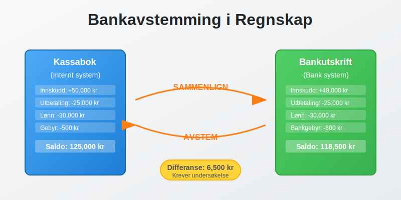
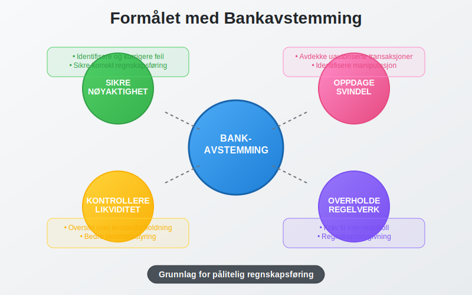
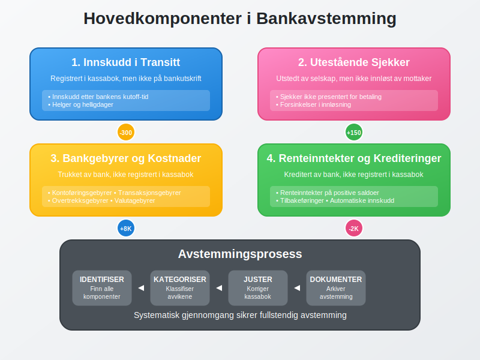
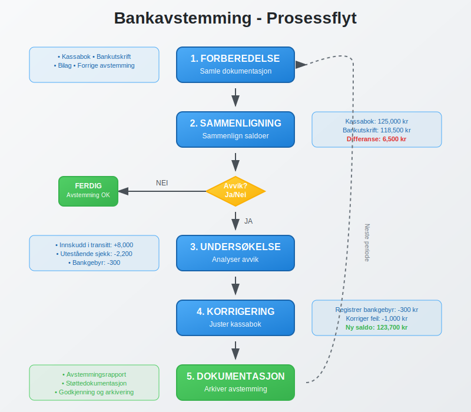
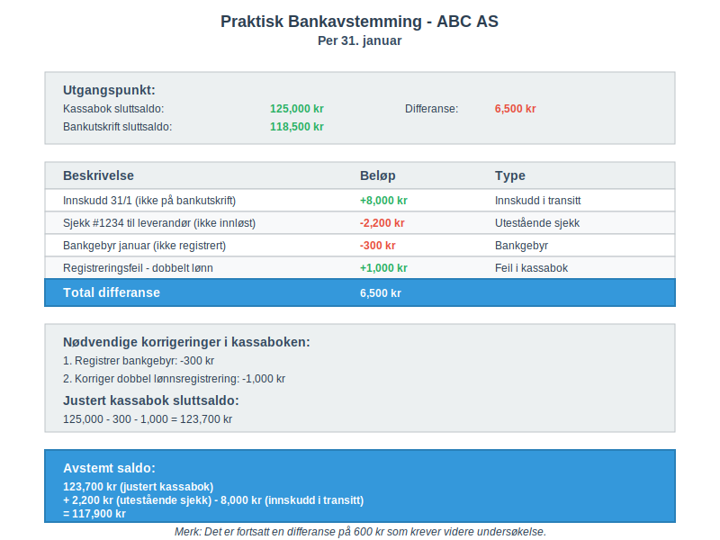
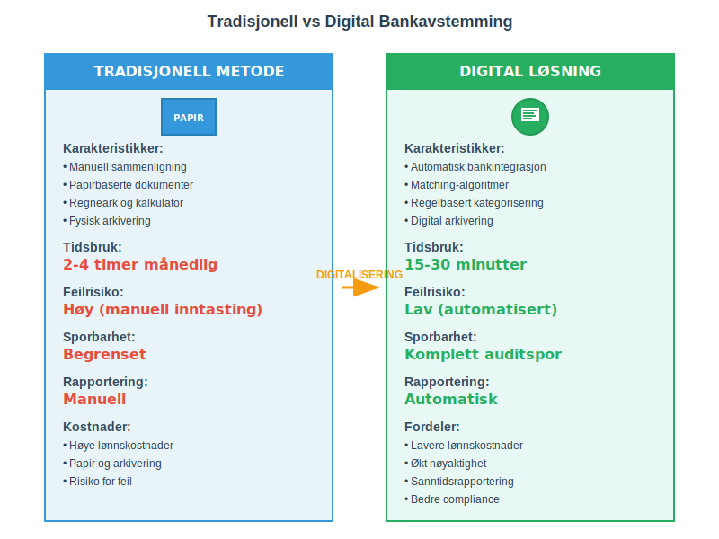
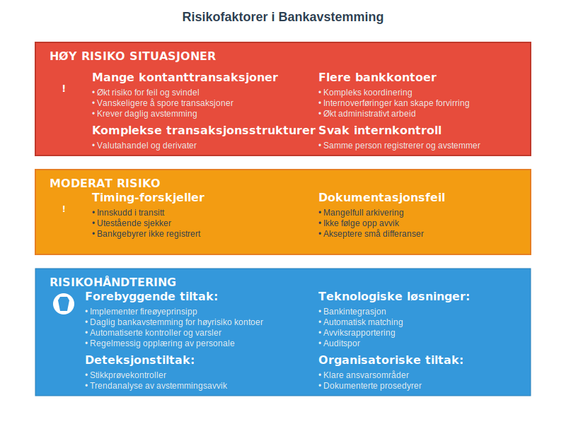
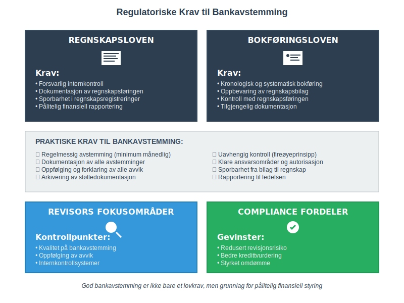
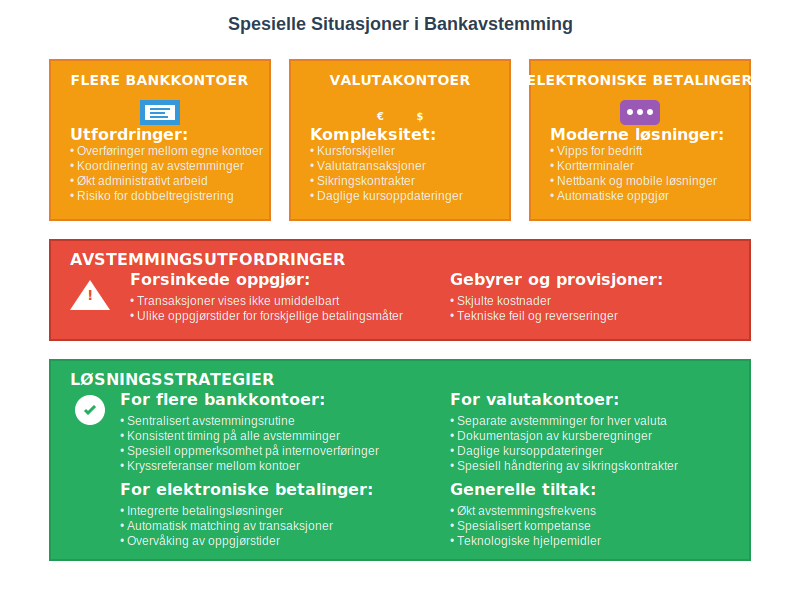
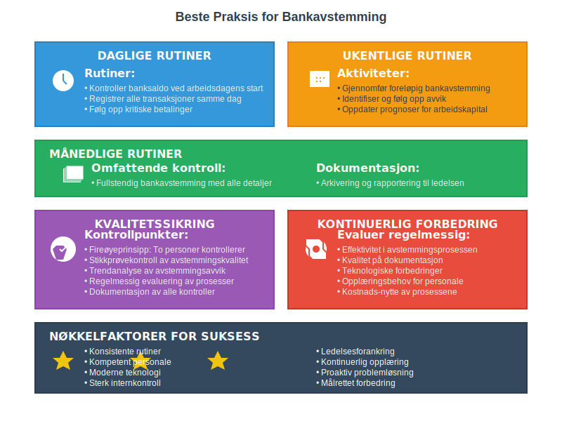

---
title: "Hva er Bankavstemming i Regnskap?"
meta_title: "Hva er Bankavstemming i Regnskap?"
meta_description: '**Bankavstemming** er en av de mest kritiske og grunnleggende prosessene i regnskapsføring. Det innebærer å sammenligne og avstemme selskapets kassabok mot [...'
slug: hva-er-bankavstemming
type: blog
layout: pages/single
---

**Bankavstemming** er en av de mest kritiske og grunnleggende prosessene i regnskapsføring. Det innebærer å sammenligne og avstemme selskapets kassabok mot [bankens kontoutskrift](/blogs/regnskap/hva-er-kontoutskrift "Hva er Kontoutskrift i Regnskap? En Guide til Kontoutskrifter") for å sikre at alle transaksjoner er korrekt registrert og at det ikke finnes uforklarlige avvik. Prosessen sikrer at [bankinnskudd](/blogs/regnskap/hva-er-bankinnskudd "Hva er Bankinnskudd i Regnskap? Typer, Regnskapsføring og Rentehåndtering") og andre [banktransaksjoner](/blogs/regnskap/hva-er-banktransaksjoner "Hva er Banktransaksjoner i Regnskap? Typer, Regnskapsføring og Kontroll") er nøyaktig reflektert i regnskapet.
Les mer om [Bedriftsbank](/blogs/regnskap/bedriftsbank "Bedriftsbank - Oversikt over banktjenester for bedrifter og regnskapsintegrasjon") for praktisk bruk av bedriftsbank-tjenester i forbindelse med avstemming.

*Se også: [Hva er Betalingstjenestedirektivet (PSD2)?](/blogs/regnskap/hva-er-betalingstjenestedirektivet "Hva er Betalingstjenestedirektivet (PSD2)?").*

Se også [Hva er Bedriftskonto?](/blogs/regnskap/bedriftskonto "Hva er Bedriftskonto? Alt du trenger vite om bedriftens bankkontoer") for en grundig gjennomgang av kontoene som avstemmes.



## Hva er Bankavstemming?

Bankavstemming er prosessen med å **kontrollere og bekrefte** at selskapets interne kassabok stemmer overens med [bankens offisielle kontoutskrift](/blogs/regnskap/hva-er-kontoutskrift "Hva er Kontoutskrift i Regnskap? En Guide til Kontoutskrifter"). Dette er en del av den bredere [avstemmingsprosessen](/blogs/regnskap/hva-er-avstemming "Hva er Avstemming i Regnskap? Komplett Guide") i regnskapsføring.

### Formålet med Bankavstemming

* **Sikre nøyaktighet:** Identifisere og korrigere feil i regnskapsføringen
* **Oppdage svindel:** Avdekke uautoriserte transaksjoner eller manipulasjon
* **Kontrollere likviditet:** FÃ¥ oversikt over faktisk tilgjengelig kontantbeholdning
* **Overholde regelverk:** Oppfylle krav til internkontroll og [regnskapsføring](/blogs/regnskap/hva-er-regnskap "Hva er Regnskap? En komplett guide")



## Hovedkomponenter i Bankavstemming

### 1. Innskudd i Transitt

**Innskudd i transitt** er beløp som selskapet har registrert som innskudd i kassaboken, men som ennå ikke vises på bankutskriften. Dette skjer typisk når:

* Innskudd gjøres sent på dagen etter bankens kutoff-tid
* Innskudd gjøres på helger eller [helligdager](/blogs/regnskap/helligdager-regnskap-bedriftseiere "Helligdager i Regnskap for Bedriftseiere - Komplett Guide til Feriepenger og Regnskapsføring")
* Det er forsinkelser i bankens behandling av innskudd

### 2. Utestående Sjekker

**Utestående sjekker** er sjekker som selskapet har utstedt og registrert i kassaboken, men som ennå ikke er innløst av mottakeren og derfor ikke vises som trukket på bankutskriften.

### 3. Bankgebyrer og Kostnader

Banker trekker ofte gebyrer direkte fra kontoen uten forhåndsvarsel:

* **Kontoføringsgebyrer:** Månedlige eller årlige kontogebyrer
* **Transaksjonsgebyrer:** Gebyrer per transaksjon eller overføring
* **Overtrekksgebyrer:** Gebyrer ved overtrekk av konto
* **Valutagebyrer:** Gebyrer ved valutaveksling

### 4. Renteinntekter og Krediteringer

Banken kan kreditere kontoen med:

* **Renteinntekter:** Renter på positive saldoer
* **Tilbakeføringer:** Reversering av tidligere gebyrer
* **Automatiske innskudd:** Som [lønn](/blogs/regnskap/hva-er-akkordlonn "Hva er Akkordlønn? Forklaring og Beregning") eller pensjonsutbetalinger



## Bankavstemmingens Prosess

### Steg 1: Forberedelse og Datainnsamling

**Nødvendig dokumentasjon:**

| Dokument | Kilde | Formål |
|----------|-------|--------|
| Kassabok | Internt regnskapssystem | Selskapets registrerte transaksjoner |
| Bankutskrift | Bank | Bankens offisielle transaksjonshistorikk |
| Bilag og [kvitteringer](/blogs/regnskap/kvittering "Hva er Kvittering? En Guide til Kvitteringskrav i Norsk Regnskap") | Arkiv/[Bilagsmottak](/blogs/regnskap/hva-er-bilagsmottak "Bilagsmottak - Komplett Guide til Dokumentmottak og Fakturabehandling") | Dokumentasjon av transaksjoner |
| Forrige avstemming | Regnskapsarkiv | Utestående poster fra forrige periode |

### Steg 2: Sammenligning av Saldoer

Start med å sammenligne **sluttsaldoen** i kassaboken med sluttsaldoen på bankutskriften:

```
Kassabok sluttsaldo:     XXX,XXX kr
Bankutskrift sluttsaldo: XXX,XXX kr
Differanse:              XXX kr
```

### Steg 3: Identifisering av Avvik

GÃ¥ systematisk gjennom alle transaksjoner og identifiser:

* **Transaksjoner i kassaboken som ikke finnes på bankutskriften**
* **Transaksjoner på bankutskriften som ikke finnes i kassaboken**
* **Beløpsforskjeller** på samme transaksjoner
* **Datodifferanser** mellom registrering og gjennomføring

### Steg 4: Kategorisering av Avvik

**Normale avstemmingsposter:**
* Innskudd i transitt
* Utestående sjekker
* Bankgebyrer ikke registrert
* Renteinntekter ikke registrert

**Feil som krever korrigering:**
* Registreringsfeil i kassaboken
* Dobbeltregistreringer
* Feil beløp eller kontoføring
* Manglende registreringer



## Praktisk Bankavstemming - Eksempel

### Eksempel: ABC AS - Bankavstemming per 31. januar

**Utgangspunkt:**
* Kassabok sluttsaldo: 125,000 kr
* Bankutskrift sluttsaldo: 118,500 kr
* Differanse: 6,500 kr

**Avstemmingsanalyse:**

| Beskrivelse | Beløp | Type |
|-------------|-------|------|
| Innskudd 31/1 (ikke på bankutskrift) | +8,000 kr | Innskudd i transitt |
| Sjekk #1234 til leverandør (ikke innløst) | -2,200 kr | Utestående sjekk |
| Bankgebyr januar (ikke registrert) | -300 kr | Bankgebyr |
| Registreringsfeil - dobbelt lønn | +1,000 kr | Feil i kassabok |
| **Total differanse** | **6,500 kr** | |

**Nødvendige korrigeringer i kassaboken:**
1. Registrer bankgebyr: -300 kr
2. Korriger dobbel lønnsregistrering: -1,000 kr

**Justert kassabok sluttsaldo:** 125,000 - 300 - 1,000 = 123,700 kr

**Avstemt saldo:**
123,700 kr (justert kassabok) + 2,200 kr (utestående sjekk) - 8,000 kr (innskudd i transitt) = 117,900 kr

*Merk: Det er fortsatt en differanse på 600 kr som krever videre undersøkelse.*



## Hyppighet og Timing av Bankavstemming

### Anbefalt Hyppighet

**Daglig bankavstemming:**
* Selskaper med høy transaksjonsvolum
* Kontantintensive virksomheter
* Bedrifter med høy risiko for svindel
* Integrert del av [dagsoppgjør](/blogs/regnskap/hva-er-dagsoppgjør "Hva er Dagsoppgjør i Regnskap? Prosess, Rutiner og Beste Praksis") rutiner

**Ukentlig bankavstemming:**
* Mellomstore bedrifter med moderat transaksjonsvolum
* Selskaper med etablerte internkontrollrutiner

**MÃ¥nedlig bankavstemming:**
* Små bedrifter med lav transaksjonsvolum
* Minimum krav for de fleste selskaper

### Beste Praksis for Timing

* **Utfør avstemming så snart bankutskriften er tilgjengelig**
* **Ikke vent til månedslutt** - gjør løpende avstemminger
* **Sett faste datoer** for avstemmingsarbeid
* **Dokumenter alle avstemminger** for [revisjonsformål](/blogs/regnskap/hva-er-arbeidspapirer-revisjon "Hva er Arbeidspapirer i Revisjon?")

## Digitale Verktøy og Automatisering

### Moderne Bankavstemming

**Automatiserte løsninger:**
* **Bankintegrasjon:** Direkte import av banktransaksjoner
* **Matching-algoritmer:** Automatisk sammenligning av transaksjoner
* **Regelbasert kategorisering:** Automatisk klassifisering av transaksjoner
* **Avviksrapportering:** Automatisk identifisering av uforklarlige avvik

**Fordeler med digitalisering:**

| Fordel | Tradisjonell metode | Digital løsning |
|--------|-------------------|-----------------|
| Tidsbruk | 2-4 timer månedlig | 15-30 minutter |
| Feilrisiko | Høy (manuell inntasting) | Lav (automatisert) |
| Sporbarhet | Begrenset | Komplett auditspor |
| Rapportering | Manuell | Automatisk |



### Populære Verktøy

**Regnskapssystemer med bankintegrasjon:**
* Visma Business/Visma.net
* Tripletex
* Fiken
* PowerOffice

**Spesialiserte avstemmingsverktøy:**
* Bankintegrasjonsløsninger
* Treasury management systemer
* Dedikerte avstemmingsplattformer

## Utfordringer og Fallgruver

### Vanlige Feil i Bankavstemming

**1. Timing-forskjeller**
* Ikke skille mellom permanente feil og timing-forskjeller
* Glemme å følge opp utestående poster fra forrige periode

**2. Dokumentasjon**
* Mangelfull dokumentasjon av avstemmingsprosessen
* Ikke arkivere støttedokumentasjon

**3. Oppfølging**
* Ikke følge opp uforklarlige avvik
* Akseptere "små" differanser uten undersøkelse

**4. Ansvarsfordeling**
* Samme person som registrerer transaksjoner utfører avstemming
* Mangel på uavhengig kontroll

### Risikofaktorer

**Høy risiko situasjoner:**
* Mange kontantransaksjoner
* Flere bankkontoer
* Komplekse transaksjonsstrukturer
* Svak internkontroll



## Internkontroll og Ansvarsfordeling

### Segregering av Oppgaver

**Prinsipp om arbeidsdeling:**

| Funksjon | Ansvarlig | Kontrollør |
|----------|-----------|------------|
| Registrering av transaksjoner | Regnskapsfører | Regnskapssjef |
| Bankavstemming | Regnskapsmedarbeider | Regnskapssjef |
| Godkjenning av korrigeringer | Regnskapssjef | Daglig leder |
| Arkivering og dokumentasjon | Regnskapsavdeling | Intern revisor |

### Kontrollmiljø

**Etabler klare rutiner for:**
* **Autorisasjon:** Hvem kan godkjenne korrigeringer
* **Dokumentasjon:** Krav til støttedokumentasjon
* **Rapportering:** Hvem skal informeres om avvik
* **Oppfølging:** Rutiner for uløste avstemmingsposter

## Regulatoriske Krav og Compliance

### Norske Regnskapsstandarder

**Regnskapsloven krever:**
* Forsvarlig internkontroll
* Dokumentasjon av regnskapsføringen
* Sporbarhet i regnskapsregistreringer

**Bokføringsloven krever:**
* Kronologisk og systematisk bokføring
* Oppbevaring av regnskapsbilag
* Kontroll med regnskapsføringen

### Revisjonsaspekter

**Revisors fokusområder:**
* Kvalitet på bankavstemming
* Oppfølging av avvik
* Internkontrollsystemer
* Dokumentasjon og sporbarhet



## Spesielle Situasjoner

### Flere Bankkontoer

**Utfordringer:**
* Overføringer mellom egne kontoer
* Valutakontoer og kursforskjeller
* Koordinering av avstemminger

**Løsninger:**
* Sentralisert avstemmingsrutine
* Konsistent timing på alle avstemminger
* Spesiell oppmerksomhet på internoverføringer

### Valutakontoer

**Ekstra kompleksitet:**
* **Kursforskjeller** mellom registrering og oppgjør
* **Valutatransaksjoner** som påvirker flere kontoer
* **Sikringskontrakter** og derivater

**Spesielle hensyn:**
* Daglige kursoppdateringer
* Separate avstemminger for hver valuta
* Dokumentasjon av kursberegninger

### Elektroniske Betalingssystemer

**Moderne betalingsløsninger:**
* Vipps for bedrift
* Kortterminaler
* Nettbank og mobile løsninger

**Avstemmingsutfordringer:**
* Forsinkede oppgjør
* Gebyrer og provisjoner
* Tekniske feil og reverseringer



## Beste Praksis og Anbefalinger

### Etabler Robuste Rutiner

**Daglige rutiner:**
* Kontroller banksaldo ved arbeidsdagens start
* Registrer alle transaksjoner samme dag
* Følg opp kritiske betalinger

**Ukentlige rutiner:**
* Gjennomfør foreløpig bankavstemming
* Identifiser og følg opp avvik
* Oppdater prognoser for [arbeidskapital](/blogs/regnskap/hva-er-arbeidskapital "Hva er Arbeidskapital? Definisjon og Beregning")

**MÃ¥nedlige rutiner:**
* Fullstendig bankavstemming
* Dokumentasjon og arkivering
* Rapportering til ledelsen

### Kvalitetssikring

**Kontrollpunkter:**
* **Fireøyeprinsipp:** To personer kontrollerer alle avstemminger
* **Stikkprøvekontroll:** Regelmessig kontroll av avstemmingskvalitet
* **Trendanalyse:** Følg utviklingen i avstemmingsavvik over tid

### Kontinuerlig Forbedring

**Evaluer regelmessig:**
* Effektivitet i avstemmingsprosessen
* Kvalitet på dokumentasjon
* Teknologiske forbedringer
* Opplæringsbehov



## Konklusjon

Bankavstemming er en **fundamental regnskapsprosess** som sikrer nøyaktighet og pålitelighet i finansiell rapportering. En systematisk tilnærming til bankavstemming:

* **Reduserer risiko** for feil og svindel
* **Forbedrer likviditetsstyring** og kontantprognoser
* **Sikrer compliance** med regnskapsstandarder
* **Styrker internkontrollen** i organisasjonen

Ved å implementere robuste rutiner, utnytte moderne teknologi og opprettholde høy kvalitet på dokumentasjon, kan bedrifter oppnå effektiv og pålitelig bankavstemming som støtter god [regnskapsføring](/blogs/regnskap/hva-er-regnskap "Hva er Regnskap? En komplett guide") og finansiell styring.

**Husk:** Bankavstemming er ikke bare en teknisk øvelse, men en kritisk kontrollmekanisme som beskytter selskapets finansielle integritet og støtter informerte forretningsbeslutninger.


