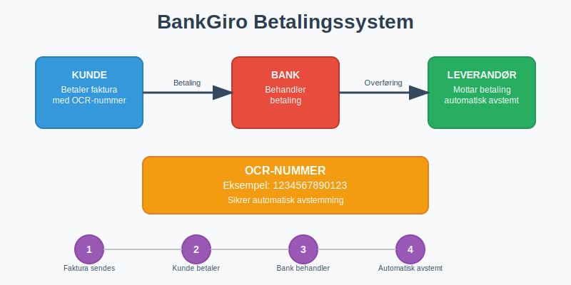
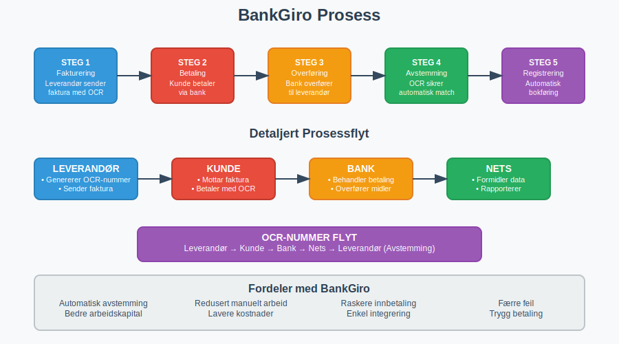
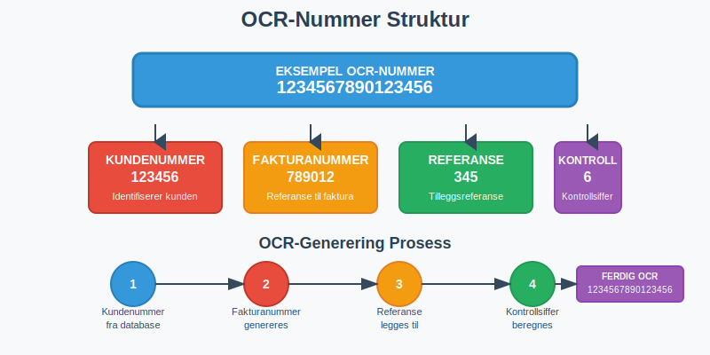
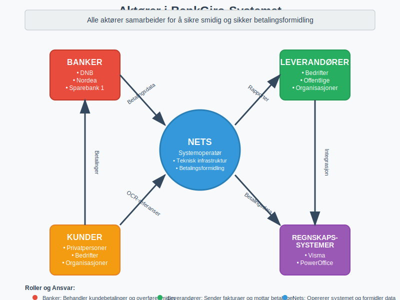
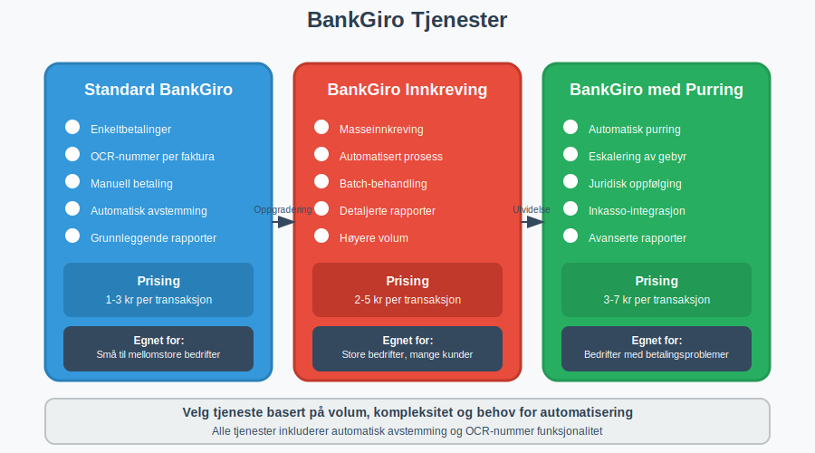
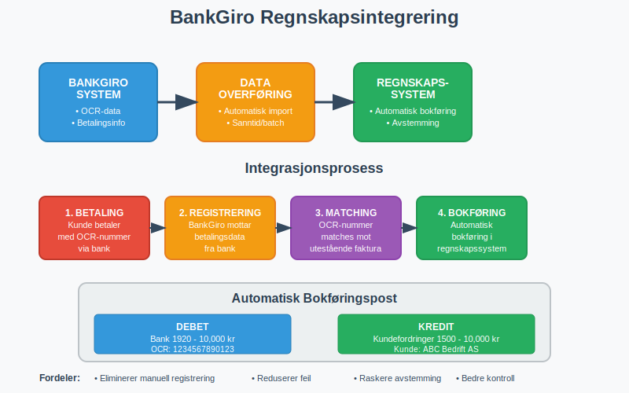

---
title: "Hva er BankGiro?"
meta_title: "Hva er BankGiro?"
meta_description: '**BankGiro** er et av Norges mest brukte betalingssystemer for fakturaer og regninger. Dette elektroniske betalingssystemet gjør det enkelt for både privatper...'
slug: hva-er-bankgiro
type: blog
layout: pages/single
---

**BankGiro** er et av Norges mest brukte betalingssystemer for fakturaer og regninger. Dette elektroniske betalingssystemet gjør det enkelt for bÃ¥de privatpersoner og bedrifter Ã¥ betale og motta betalinger med automatisk avstemming gjennom [OCR-nummer](/blogs/regnskap/hva-er-ocr "Hva er OCR? OCR i Norske Regnskapsprosesser “ En Komplett Guide"). Som en av de tradisjonelle [betalingstjenestene](/blogs/regnskap/betalingstjeneste "Hva er betalingstjeneste? Komplett Guide til Betalingstjenester i Norge") i Norge, utgjør BankGiro en viktig del av det moderne betalingslandskapet.
 
Les mer om [Bedriftsbank](/blogs/regnskap/bedriftsbank "Bedriftsbank - Oversikt over banktjenester for bedrifter og regnskapsintegrasjon") for en helhetlig oversikt over bedriftens bank- og [betalingstjenester](/blogs/regnskap/betalingstjeneste "Hva er betalingstjeneste? Komplett Guide til Betalingstjenester i Norge").



### Hva er BankGiro?

BankGiro er et **elektronisk betalingssystem** som ble etablert i Norge på 1980-tallet som en del av moderniseringen av det norske [giro-systemet](/blogs/regnskap/hva-er-giro "Hva er Giro? Komplett Guide til Giro-systemet i Norge"). Systemet gjør det mulig å betale fakturaer og regninger ved hjelp av **OCR-nummer** (Optical Character Recognition), som sikrer automatisk avstemming hos mottaker.

Hovedprinsippet bak BankGiro er:
- **Leverandør** sender faktura med unikt [OCR-nummer](/blogs/regnskap/hva-er-ocr "Hva er OCR? OCR i Norske Regnskapsprosesser “ En Komplett Guide")
- **Kunde** betaler via nettbank, mobilbank eller bankkontor
- **[OCR-nummer](/blogs/regnskap/hva-er-ocr "Hva er OCR? OCR i Norske Regnskapsprosesser “ En Komplett Guide")** sikrer automatisk avstemming hos leverandør
- **Betalingen** registreres automatisk i leverandørens [regnskap](/blogs/regnskap/hva-er-regnskap "Hva er Regnskap? En komplett guide")

Dette systemet håndterer milliarder av kroner i betalinger årlig og brukes av praktisk talt alle norske bedrifter.



### Hvordan Fungerer BankGiro?

#### Teknisk Prosess

BankGiro-systemet fungerer gjennom en strukturert prosess som involverer flere aktører:

1. **Fakturering:** Leverandør sender [faktura](/blogs/regnskap/hva-er-en-faktura "Hva er en Faktura? En Guide til Norske Fakturakrav") med OCR-nummer
2. **Betaling:** Kunde betaler via bank med OCR-nummer som referanse
3. **Overføring:** Banken overfører beløpet til leverandørens konto
4. **Avstemming:** OCR-nummeret sikrer automatisk avstemming
5. **Registrering:** Betalingen registreres automatisk i leverandørens system
6. **Rapportering:** Leverandør mottar detaljert betalingsinformasjon

#### OCR-Nummer Systemet

**[OCR-nummer](/blogs/regnskap/hva-er-ocr "Hva er OCR? OCR i Norske Regnskapsprosesser “ En Komplett Guide")** er kjernen i BankGiro-systemet og bestÃ¥r av:
- **Kundenummer:** Identifiserer kunden hos leverandør
- **[Fakturanummer](/blogs/regnskap/hva-er-fakturanummer "Hva er Fakturanummer? Komplett Guide til Nummerering og Lovkrav"):** Referanse til spesifikk faktura
- **Kontrollsiffer:** Sikrer korrekt registrering



### Aktører i BankGiro-Systemet

BankGiro-systemet involverer flere viktige aktører:

#### Nets (Tidligere BBS)
- **Operatør** av BankGiro-systemet i Norge
- **Teknisk infrastruktur** for betalingsformidling
- **Rapportering** til leverandører
- **Systemutvikling** og vedlikehold

#### Banker
- **Behandler** kundebetalinger
- **Overfører** midler mellom kontoer
- **Tilbyr** betalingsløsninger til kunder
- **Sikrer** betalingssikkerhet

#### Leverandører
- **Sender** fakturaer med OCR-nummer
- **Mottar** betalinger via BankGiro
- **Avstemmer** betalinger automatisk
- **Rapporterer** til [regnskap](/blogs/regnskap/hva-er-regnskap "Hva er Regnskap? En komplett guide")



### Fordeler med BankGiro

#### For Privatpersoner og Bedrifter som Betaler
- **Enkel betaling:** Kun OCR-nummer og beløp trengs
- **Automatisk avstemming:** Ingen risiko for feil registrering
- **Fleksibilitet:** Kan betales via alle norske banker
- **Sikkerhet:** Etablert og trygt betalingssystem
- **Sporbarhet:** Enkel oppfølging av betalinger

#### For Bedrifter som Mottar Betaling
- **Automatisk avstemming:** Reduserer manuelt arbeid betydelig
- **Forbedret [arbeidskapital](/blogs/regnskap/hva-er-arbeidskapital "Hva er Arbeidskapital? Definisjon og Beregning"):** Raskere registrering av innbetalinger
- **Reduserte kostnader:** Mindre manuell behandling
- **Bedre oversikt:** Detaljerte rapporter fra Nets
- **Integrering:** Enkel kobling til regnskapssystemer

### Typer BankGiro-Tjenester

Det finnes flere varianter av BankGiro tilpasset ulike behov:

#### Standard BankGiro
- **Enkeltbetalinger:** For individuelle fakturaer
- **OCR-nummer:** Unikt nummer per faktura
- **Manuell betaling:** Kunde initierer betaling selv

#### BankGiro Innkreving
- **Masseinnkreving:** For mange kunder samtidig
- **Automatisert prosess:** Reduserer manuelt arbeid
- **Rapportering:** Detaljerte innkrevingsrapporter

#### BankGiro med Purring
- **Automatisk purring:** Ved manglende betaling
- **Eskalering:** Gradvis økning av purregebyr
- **Juridisk oppfølging:** Kobling til inkassoselskaper



### Oppsett og Implementering

#### For Bedrifter som Ønsker å Motta BankGiro

**Tekniske Krav:**
1. **Bankkonto:** Norsk [bankkonto](/blogs/regnskap/hva-er-kontonummer "Hva er Kontonummer? Komplett Guide til Norske Bankkontonummer") for mottak av betalinger
2. **Avtale med Nets:** Kontrakt for bruk av BankGiro-tjenester
3. **IT-system:** Regnskapssystem som støtter BankGiro
4. **OCR-generering:** System for å generere unike OCR-nummer

**Implementeringsprosess:**
1. **Kontakt Nets:** Inngå avtale om BankGiro-tjenester
2. **Teknisk oppsett:** Implementer OCR-generering
3. **Testing:** Test systemet med prøvebetalinger
4. **Integrering:** Koble til regnskapssystem
5. **Lansering:** Begynn å sende fakturaer med OCR-nummer

#### Kostnader og Prising

| Tjeneste | Oppsettskostnad | Løpende Kostnad | Merknad |
|----------|----------------|-----------------|---------|
| **Standard BankGiro** | 5,000 - 15,000 kr | 1-3 kr per transaksjon | Avhenger av volum |
| **BankGiro Innkreving** | 10,000 - 25,000 kr | 2-5 kr per transaksjon | Inkluderer purrefunksjon |
| **Integrerte løsninger** | 15,000 - 50,000 kr | Fast månedspris | Fullintegrert system |

### Regnskapsmessig Behandling

#### Bokføring av BankGiro-Betalinger

**For Leverandør (Mottaker):**
```
Debet: Bank                     10,000 kr
Kredit: Kundefordringer        10,000 kr
```

**Automatisk avstemming** gjør at betalinger kan bokføres automatisk basert på OCR-nummer og kobles til riktig [kundefordring](/blogs/regnskap/hva-er-ansattreskontro "Hva er Ansattreskontro? Guide til Lønnsregnskap").

#### Integrering med Regnskapssystemer

Moderne regnskapssystemer støtter automatisk import av BankGiro-data:
- **Automatisk bokføring:** Betalinger bokføres uten manuell inngripen
- **Avstemming:** Automatisk matching mot utestående fakturaer
- **Rapportering:** Integrerte rapporter for oppfølging
- **Kontroll:** Automatiske kontroller for avvik



### Sammenligning med Andre Betalingssystemer

#### BankGiro vs AvtaleGiro

| Aspekt | BankGiro | [AvtaleGiro](/blogs/regnskap/hva-er-avtalegiro "Hva er AvtaleGiro? Komplett Guide til Automatisk Betaling") |
|--------|----------|------------|
| **Type betaling** | Enkeltbetalinger | Automatiske, regelmessige betalinger |
| **Initiativ** | Kunde initierer | Leverandør initierer |
| **OCR-nummer** | Ja, per faktura | Nei, fast avtale |
| **Fleksibilitet** | Høy, betales når kunde ønsker | Lav, fast dato |
| **Bruksområde** | Alle typer fakturaer | Faste regninger (strøm, forsikring) |

#### BankGiro vs Vipps/Mobilbetaling

| Aspekt | BankGiro | Mobilbetaling |
|--------|----------|---------------|
| **Avstemming** | Automatisk via OCR | Manuell eller semi-automatisk |
| **B2B-egnethet** | Svært godt egnet | Begrenset for større beløp |
| **Integrasjon** | Høy grad av systemintegrasjon | Varierende integrasjonsmuligheter |
| **Kostnader** | Lave transaksjonskostnader | Høyere kostnader per transaksjon |

### Juridiske Aspekter og Regelverk

#### Betalingstjenestedirektivet (PSD2)

BankGiro er regulert under **PSD2-direktivet** som sikrer:
- **Sikkerhet:** Krav til sikker autentisering
- **Transparens:** Tydelig informasjon om kostnader
- **Konkurranse:** Åpning for nye aktører
- **Forbrukerrettigheter:** Beskyttelse av betalere

#### Personvernforordningen (GDPR)

Ved bruk av BankGiro må bedrifter følge **GDPR-krav**:

- **Databehandling:** Lovlig grunnlag for behandling av kundedata
- **Informasjonsplikt:** Informere kunder om databruk
- **Rettigheter:** Respektere kunders rettigheter
- **Sikkerhet:** Sikre persondata mot misbruk

#### Regnskapsloven

BankGiro-betalinger må dokumenteres i henhold til **regnskapsloven**:

- **Dokumentasjon:** Alle transaksjoner må dokumenteres
- **Oppbevaring:** Dokumenter må oppbevares i 5 år
- **Sporbarhet:** Mulighet for å spore alle betalinger
- **Kontroll:** Internkontroll av betalingsprosesser

### Fremtiden for BankGiro

#### Teknologisk Utvikling

**Digitalisering** driver utviklingen av BankGiro:
- **API-er:** Bedre integrasjon med moderne systemer
- **Sanntidsbetalinger:** Raskere behandling av betalinger
- **Kunstig intelligens:** Automatisk håndtering av avvik
- **Blockchain:** Potensial for økt sikkerhet og transparens

#### Konkurranse fra Nye Aktører

Nye betalingsløsninger utfordrer BankGiro:
- **Fintech-selskaper:** Innovative betalingsløsninger
- **Internasjonale aktører:** Globale betalingssystemer
- **Kryptovaluta:** Alternative betalingsformer
- **Ã…pen bankvirksomhet:** Nye muligheter for integrasjon

### Praktiske RÃ¥d for Bedrifter

#### Implementering av BankGiro

**Før implementering:**
1. **Vurder behov:** Analyser betalingsvolum og kundebase
2. **Sammenlign leverandører:** Evaluer ulike tilbydere av BankGiro-tjenester
3. **Planlegg integrering:** Sikre kompatibilitet med eksisterende systemer
4. **Budsjetter kostnader:** Inkluder både oppsett og løpende kostnader

**Under implementering:**
1. **Test grundig:** Gjennomfør omfattende testing før lansering
2. **Tren personale:** Sikre at ansatte forstår det nye systemet
3. **Informer kunder:** Kommuniser endringer til kundebasen
4. **Overvåk nøye:** Følg opp systemet tett i startfasen

#### Optimalisering av BankGiro-Bruk

**For bedre [arbeidskapital](/blogs/regnskap/hva-er-arbeidskapital "Hva er Arbeidskapital? Definisjon og Beregning"):**
- **Kort betalingsfrist:** Reduser kredittid til kunder
- **Automatisk purring:** Implementer automatiske purrerutiner
- **Rabatter:** Tilby kontantrabatt for rask betaling
- **Oppfølging:** Systematisk oppfølging av utestående fordringer

**For bedre kundeservice:**
- **Tydelige fakturaer:** Sikre at OCR-nummer er godt synlig
- **Betalingsinstruksjoner:** Gi klare instruksjoner for betaling
- **Kundesupport:** Tilby hjelp ved betalingsproblemer
- **Fleksibilitet:** Tilby alternative betalingsmetoder

### Vanlige Utfordringer og Løsninger

#### Tekniske Utfordringer

**Problem:** OCR-nummer genereres feil
**Løsning:** Implementer kontrollrutiner og validering

**Problem:** Manglende systemintegrasjon
**Løsning:** Investér i moderne regnskapssystem med BankGiro-støtte

**Problem:** Betalinger avstemmes ikke automatisk
**Løsning:** Sjekk OCR-nummer format og systemoppsett

#### Kundeservice-Utfordringer

**Problem:** Kunder forstår ikke OCR-nummer
**Løsning:** Tydelig informasjon på fakturaer og kundeveiledning

**Problem:** Betalinger kommer ikke frem
**Løsning:** Rutiner for oppfølging og alternativ betaling

**Problem:** Kunder klager på komplisert betaling
**Løsning:** Tilby flere betalingsalternativer og bedre veiledning

### Konklusjon

BankGiro er et **robust og effektivt betalingssystem** som har vært en hjørnestein i det norske betalingssystemet i over 40 år. For bedrifter som ønsker å **automatisere innbetalinger** og forbedre [arbeidskapitalen](/blogs/regnskap/hva-er-arbeidskapital "Hva er Arbeidskapital? Definisjon og Beregning"), er BankGiro en utmerket løsning.

Systemets **automatiske avstemming** gjennom OCR-nummer reduserer manuelt arbeid betydelig og minimerer risikoen for feil. Med riktig implementering og integrering kan BankGiro bidra til mer effektive regnskapsprosesser og bedre kundeservice.

Selv om nye betalingsløsninger utfordrer BankGiro, forblir det et **viktig verktøy** for norske bedrifter, spesielt for B2B-transaksjoner og større betalinger hvor automatisk avstemming er kritisk.

For bedrifter som vurderer BankGiro, er det viktig å **planlegge implementeringen nøye** og sikre god integrering med eksisterende systemer. Med riktig oppsett kan BankGiro være en verdifull investering som forbedrer både effektivitet og kundeopplevelse.


