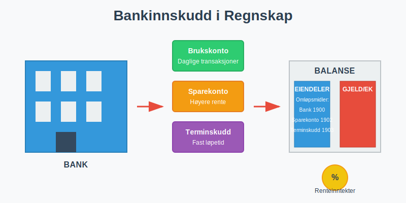
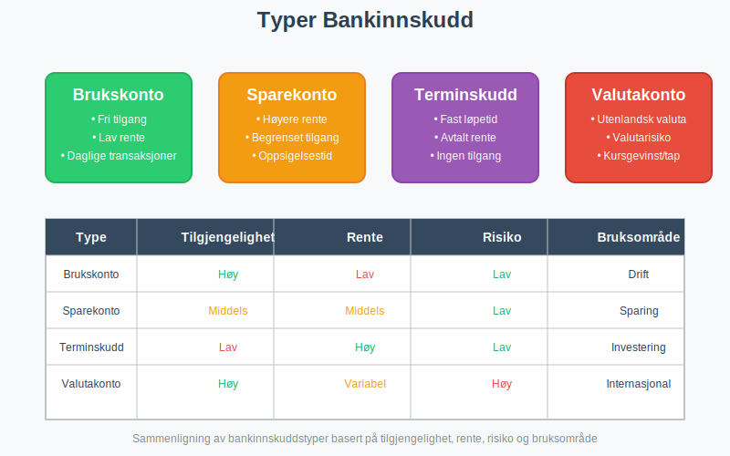
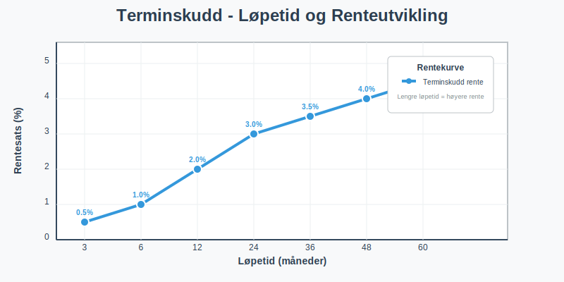
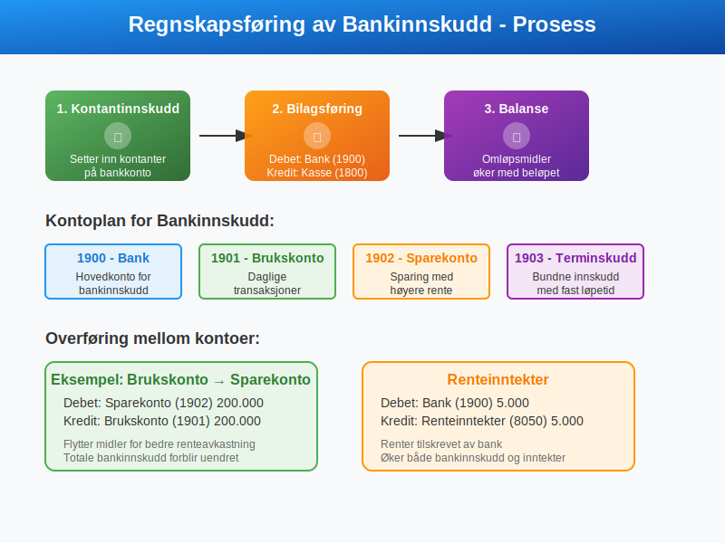
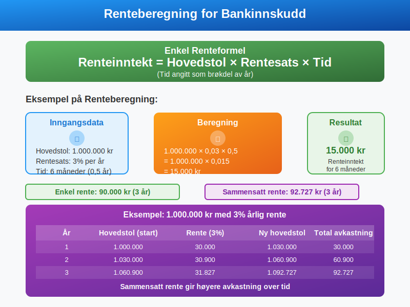
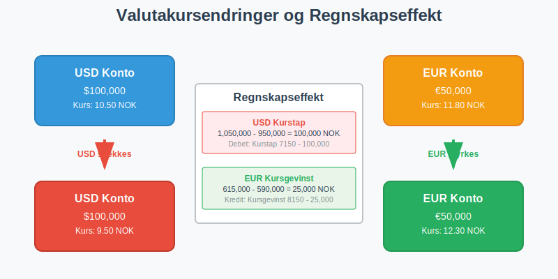
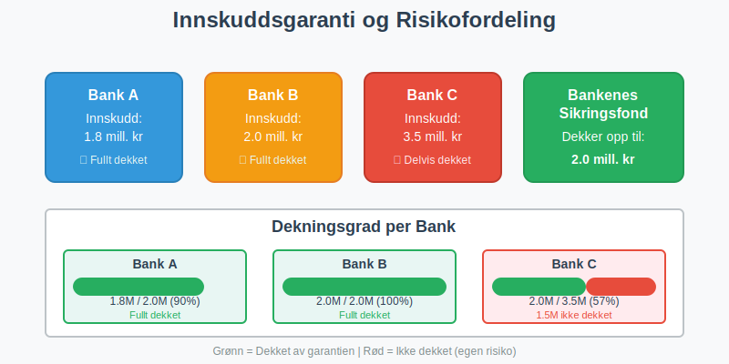
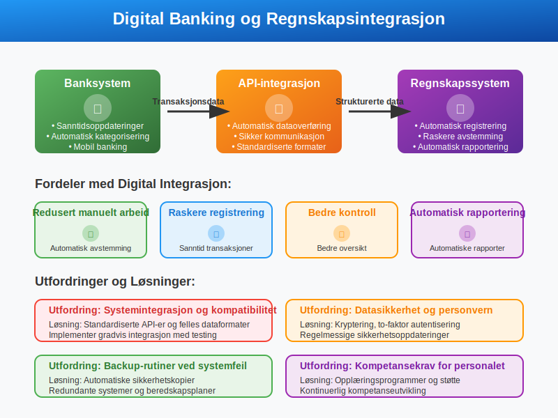
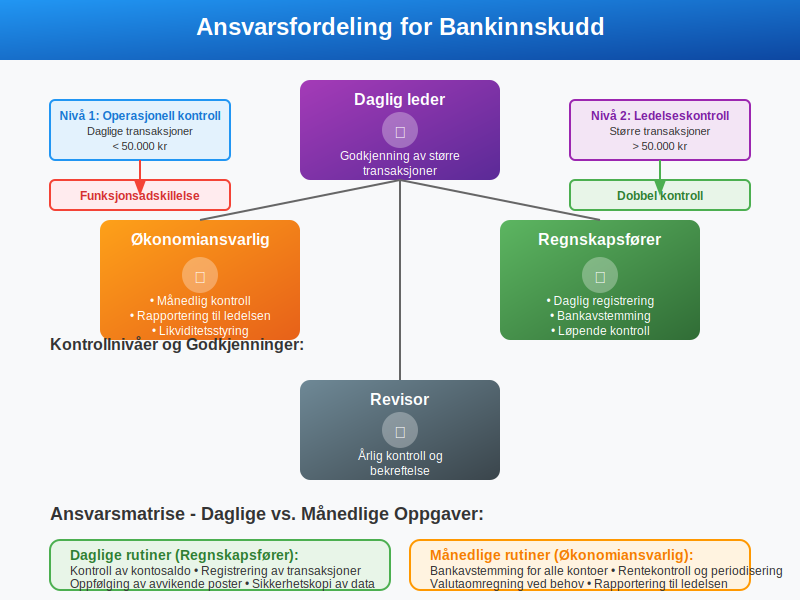
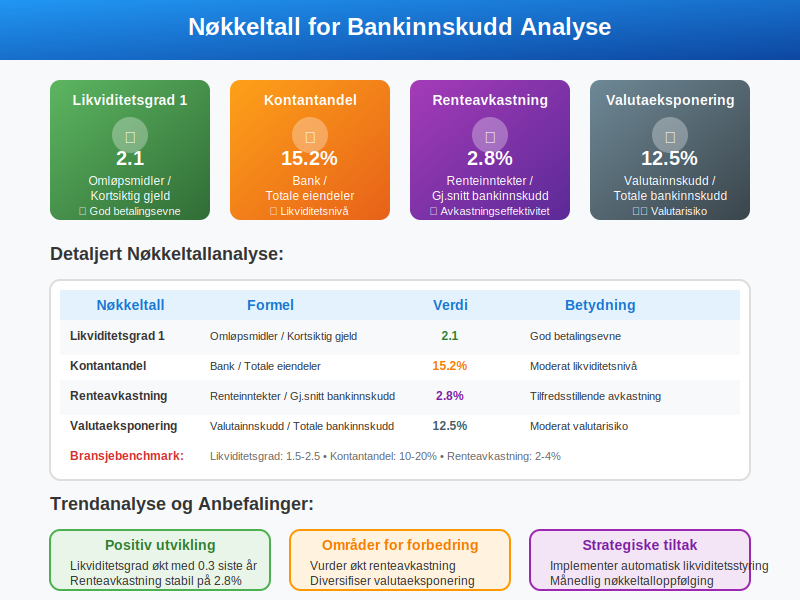

---
title: "Hva er Bankinnskudd i Regnskap?"
seoTitle: "Hva er Bankinnskudd i Regnskap?"
meta_description: '**Bankinnskudd** er penger som bedrifter og privatpersoner setter inn på [bankkontoer](/blogs/regnskap/hva-er-bankavstemming "Hva er Bankavstemming? Komplett G...'
slug: hva-er-bankinnskudd
type: blog
layout: pages/single
---

**Bankinnskudd** er penger som bedrifter og privatpersoner setter inn på [bankkontoer](/blogs/regnskap/hva-er-bankavstemming "Hva er Bankavstemming? Komplett Guide til Avstemming av Bankkontoer") for oppbevaring, sparing eller investering. I [regnskapet](/blogs/regnskap/hva-er-regnskap "Hva er Regnskap? En komplett guide") klassifiseres bankinnskudd som **omløpsmidler** og utgjør en viktig del av bedriftens [arbeidskapital](/blogs/regnskap/hva-er-arbeidskapital "Hva er Arbeidskapital? Beregning og Betydning for Bedriften").
 
 Les mer om [Bedriftsbank](/blogs/regnskap/bedriftsbank "Bedriftsbank - Oversikt over banktjenester for bedrifter og regnskapsintegrasjon") for en komplett oversikt over bedriftens banktjenester.

 Se også [Hva er Bedriftskonto?](/blogs/regnskap/bedriftskonto "Hva er Bedriftskonto? Alt du trenger vite om bedriftens bankkontoer") for en introduksjon til bedriftens primære bankkontoer.



## Hva er Bankinnskudd?

Bankinnskudd representerer **[likvide midler](/blogs/regnskap/hva-er-likvide-midler "Hva er likvide midler? Definisjon, Eksempler og Regnskapsføring")** som er plassert i finansinstitusjoner. Disse midlene er tilgjengelige for bedriften og kan brukes til:

* **Daglige driftsutgifter** og løpende forpliktelser
* **Kortsiktige investeringer** med lav risiko
* **Likviditetsreserver** for uforutsette utgifter
* **Renteoptjening** på overskuddslikviditet

### Karakteristikker ved Bankinnskudd

Bankinnskudd har flere viktige egenskaper som påvirker regnskapsføringen:

- **Høy likviditet:** Lett tilgjengelig for uttak
- **Lav risiko:** Beskyttet av innskuddsgarantien
- **Renteoptjening:** Gir avkastning over tid
- **Valutaeksponering:** Kan være i ulike valutaer

## Typer Bankinnskudd

Det finnes flere typer bankinnskudd med ulike egenskaper og regnskapsmessig behandling.



### Brukskonto (Driftskonto)

**Brukskonto** er den mest vanlige kontotypen for bedrifter og brukes til daglige transaksjoner.

#### Egenskaper ved Brukskonto:
* **Fri tilgang** til midlene
* **Lav eller ingen rente**
* **Ubegrenset antall transaksjoner**
* **Mulighet for overtrekk** (kassekreditt)

#### Regnskapsføring av Brukskonto:
```
Debet: Bank (1900)           100.000
Kredit: Kundefordringer (1500)      100.000
```

### Sparekonto

**Sparekonto** brukes for å plassere overskuddslikviditet med høyere rente enn brukskonto.

#### Egenskaper ved Sparekonto:
* **Høyere rente** enn brukskonto
* **Begrenset tilgang** til midlene
* **Oppsigelsestid** kan kreves
* **Stabil plassering** av midler

### Terminskudd (Bundne Innskudd)

**Terminskudd** er innskudd med fast løpetid og avtalt rente.



#### Karakteristikker:
* **Fast løpetid** (1 måned til flere år)
* **Avtalt rente** ved innskudd
* **Ingen tilgang** før forfall
* **Høyere rente** enn sparekonto

### Valutakonto

**Valutakonto** inneholder innskudd i utenlandsk valuta.

#### Spesielle hensyn:
* **Valutarisiko** ved kursendringer
* **Omregning** til norske kroner i regnskapet
* **Kursgevinst/kurstap** ved endringer
* **Sikringsstrategier** kan anvendes

## Regnskapsføring av Bankinnskudd

### Grunnleggende Regnskapsføring

Bankinnskudd regnskapsføres i [balansen](/blogs/regnskap/hva-er-balanse "Hva er Balanse? Komplett Guide til Balansen i Regnskap") som omløpsmidler.



#### Kontoplan for Bankinnskudd:

| Konto | Beskrivelse | Type |
|-------|-------------|------|
| **1900** | Bank | Omløpsmiddel |
| **1901** | Brukskonto | Omløpsmiddel |
| **1902** | Sparekonto | Omløpsmiddel |
| **1903** | Terminskudd | Omløpsmiddel |
| **1910** | Valutakonto USD | Omløpsmiddel |
| **1911** | Valutakonto EUR | Omløpsmiddel |

### Innskudd av Kontanter

Når kontanter settes inn på bankkonto:

```
Debet: Bank (1900)           50.000
Kredit: Kasse (1800)                50.000
```

### Overføring Mellom Kontoer

Ved overføring fra brukskonto til sparekonto:

```
Debet: Sparekonto (1902)     200.000
Kredit: Brukskonto (1901)           200.000
```

## Rentehåndtering

### Regnskapsføring av Renter

**Renteinntekter** fra bankinnskudd regnskapsføres som finansinntekter.

#### Påløpte Renter (Periodisering):
```
Debet: Påløpte renteinntekter (1590)  5.000
Kredit: Renteinntekter (8050)               5.000
```

#### Mottatte Renter:
```
Debet: Bank (1900)                    5.000
Kredit: Påløpte renteinntekter (1590)       5.000
```

### Renteberegning



#### Enkel Renteformel:
```
Renteinntekt = Hovedstol × Rentesats × Tid
```

#### Eksempel på Renteberegning:
- **Hovedstol:** 1.000.000 kr
- **Rentesats:** 3% per år
- **Tid:** 6 måneder
- **Renteinntekt:** 1.000.000 × 0,03 × 0,5 = 15.000 kr

### Sammensatt Rente

For terminskudd med [**sammensatt rente**](/blogs/regnskap/renters-rente "Renters rente “ Rente på rente i regnskap"):

| År | Hovedstol | Rente (3%) | Ny hovedstol |
|----|-----------|------------|--------------|
| 1  | 1.000.000 | 30.000     | 1.030.000    |
| 2  | 1.030.000 | 30.900     | 1.060.900    |
| 3  | 1.060.900 | 31.827     | 1.092.727    |

## Valutainnskudd

### Omregning til Norske Kroner

Valutainnskudd må omregnes til NOK i regnskapet.

#### Omregningskurser:
* **Dagskurs:** For løpende transaksjoner
* **Balansedagskurs:** For balanseoppstilling
* **Gjennomsnittskurs:** For resultatposter

### Kursgevinst og Kurstap



#### Ved Kursgevinst:
```
Debet: Valutakonto USD (1910)        10.000
Kredit: Kursgevinst (8150)                  10.000
```

#### Ved Kurstap:
```
Debet: Kurstap (7150)                5.000
Kredit: Valutakonto USD (1910)             5.000
```

## Bankavstemming og Kontroll

### Månedlig Bankavstemming

**Bankavstemming** er kritisk for å sikre korrekte bankinnskudd i regnskapet.

#### Avstemmingsprosess:
1. **Sammenlign** bankkontoutskrift med reskontro
2. **Identifiser** forskjeller og uoverensstemmelser
3. **Undersøk** årsaker til avvik
4. **Korriger** feil i regnskapet
5. **Dokumenter** avstemmingen

### Vanlige Avstemmingsposter

| Type | Beskrivelse | Regnskapsføring |
|------|-------------|-----------------|
| **Uregistrerte innskudd** | Innskudd på bank, ikke i regnskap | Debet Bank, Kredit relevant konto |
| **Uregistrerte uttak** | Uttak fra bank, ikke i regnskap | Debet relevant konto, Kredit Bank |
| **Bankgebyrer** | Gebyrer trukket av bank | Debet Bankgebyrer, Kredit Bank |
| **Renter** | Renter tilskrevet av bank | Debet Bank, Kredit Renteinntekter |

## Skattemessige Konsekvenser

### Skatteplikt for Renteinntekter

**Renteinntekter** fra bankinnskudd er skattepliktige inntekter.

#### For Bedrifter:
* **Ordinær skattesats** på 22%
* **Periodisering** etter regnskapsloven
* **Fradrag** for relaterte kostnader

#### For Privatpersoner:
* **Kapitalinntektsskatt** på 22%
* **Kildeskatt** trekkes av bank (25%)
* **Oppgjør** ved [skatteoppgjør](/blogs/regnskap/skatteoppgjor "Skatteoppgjør Guide: Prosess, Tidslinje og Viktige Frister")

### Fradragsrett

Kostnader knyttet til bankinnskudd kan være fradragsberettiget:

* **Bankgebyrer** og kontoholdskostnader
* **Valutasikringskostnader**
* **Rådgivningshonorarer**

## Risikostyring

### Innskuddsgaranti

I Norge dekker **Bankenes sikringsfond** innskudd opp til **2 millioner kroner** per innskyter per bank.



#### Viktige Punkter:
* **Automatisk dekning** for alle banker
* **Per innskyter** og per bank
* **Inkluderer renter** på garantidatoen
* **Utbetaling** innen 7 virkedager

### Spredning av Risiko

For større beløp anbefales **risikospredning**:

* **Flere banker** for å maksimere garantidekning
* **Ulike produkter** (sparekonto, terminskudd)
* **Valutadiversifisering** for internasjonale bedrifter
* **Løpetidsspredning** for terminskudd

## Likviditetsstyring

### Optimalisering av Bankinnskudd

Effektiv **likviditetsstyring** krever balanse mellom tilgjengelighet og avkastning.

#### Strategier:
1. **Likviditetsprognose** for å planlegge behov
2. **Trappeinnskudd** med ulike forfallstider
3. **Automatisk overføring** mellom kontoer
4. **Renteopptimalisering** gjennom forhandling

### Likviditetsreserver

Bedrifter bør opprettholde **likviditetsreserver** for:

* **Sesongvariasjoner** i kontantstrøm
* **Uforutsette utgifter** og investeringer
* **Markedsusikkerhet** og konjunktursvingninger
* **Vekstmuligheter** som krever rask handling

## Digitalisering og Moderne Banktjenester

### Elektroniske Banktjenester

Moderne banktjenester påvirker regnskapsføringen:

* **Sanntidsoppdateringer** av kontosaldo
* **Automatisk kategorisering** av transaksjoner
* **API-integrasjon** med regnskapssystemer
* **Mobil banking** for rask tilgang

### Regnskapsmessige Implikasjoner



#### Fordeler:
* **Redusert manuelt arbeid** ved avstemming
* **Raskere registrering** av transaksjoner
* **Bedre kontroll** og oversikt
* **Automatisk rapportering**

#### Utfordringer:
* **Systemintegrasjon** og kompatibilitet
* **Datasikkerhet** og personvern
* **Backup-rutiner** ved systemfeil
* **Kompetansekrav** for personalet

## Internkontroll og Rutiner

### Etablering av Kontrollrutiner

Gode **kontrollrutiner** for bankinnskudd inkluderer:

#### Daglige Rutiner:
* **Kontroll** av kontosaldo
* **Registrering** av transaksjoner
* **Oppfølging** av avvikende poster
* **Sikkerhetskopi** av data

#### Månedlige Rutiner:
* **Bankavstemming** for alle kontoer
* **Rentekontroll** og periodisering
* **Valutaomregning** ved behov
* **Rapportering** til ledelsen

### Ansvarsfordeling



#### Rollefordeling:
* **Regnskapsfører:** Daglig registrering og avstemming
* **Økonomiansvarlig:** Månedlig kontroll og rapportering
* **Daglig leder:** Godkjenning av større transaksjoner
* **Revisor:** Årlig kontroll og bekreftelse

## Rapportering og Analyse

### Finansiell Rapportering

Bankinnskudd presenteres i **finansielle rapporter**:

#### Balanse:
* **Omløpsmidler** - Bank og bankinnskudd
* **Spesifikasjon** av ulike kontotyper
* **Valutafordeling** ved behov
* **Bundne midler** som egen post

#### Kontantstrømoppstilling:
* **Endringer** i bankinnskudd
* **Renteinntekter** fra finansaktiviteter
* **Valutaeffekter** på kontanter

### Nøkkeltall og Analyse



#### Viktige Nøkkeltall:

| Nøkkeltall | Formel | Betydning |
|------------|--------|-----------|
| **Likviditetsgrad 1** | Omløpsmidler / Kortsiktig gjeld | Betalingsevne |
| **Kontantandel** | Bank / Totale eiendeler | Likviditetsnivå |
| **Renteavkastning** | Renteinntekter / Gjennomsnittlig bankinnskudd | Avkastningseffektivitet |
| **Valutaeksponering** | Valutainnskudd / Totale bankinnskudd | Valutarisiko |

## Fremtidige Utviklingstrekk

### Digitale Valutaer

**Sentralbankens digitale valuta (CBDC)** kan påvirke fremtidens bankinnskudd:

* **Direkte tilgang** til sentralbankpenger
* **Redusert behov** for tradisjonelle bankkontoer
* **Nye regnskapsutfordringer** og standarder
* **Endret risikoprofil** for innskudd

### Bærekraftige Investeringer

Økende fokus på **ESG-kriterier** påvirker valg av bank og produkter:

* **Grønne spareprodukter** med miljøfokus
* **Etiske investeringsalternativer**
* **Rapportering** av bærekraftspåvirkning
* **Regulatoriske krav** til transparens

## Konklusjon

**Bankinnskudd** er en fundamental del av bedriftens finansielle forvaltning og krever nøye regnskapsmessig behandling. Korrekt håndtering av ulike innskuddstyper, renteinntekter og valutaeksponering er kritisk for:

* **Nøyaktige finansielle rapporter** og beslutningsgrunnlag
* **Effektiv likviditetsstyring** og risikokontroll
* **Skattemessig compliance** og optimalisering
* **Internkontroll** og rutiner for finansforvaltning

Ved å følge etablerte regnskapsprinsipper og implementere gode kontrollrutiner kan bedrifter sikre optimal forvaltning av sine bankinnskudd samtidig som de oppfyller alle regulatoriske krav.

For mer informasjon om relaterte emner, se våre artikler om [bankavstemming](/blogs/regnskap/hva-er-bankavstemming "Bankavstemming - Komplett Guide"), [arbeidskapital](/blogs/regnskap/hva-er-arbeidskapital "Arbeidskapital - Beregning og Betydning"), [depositum](/blogs/regnskap/hva-er-depositum "Hva er Depositum i Regnskap? Typer, Regnskapsføring og Praktiske Eksempler") og [balanse](/blogs/regnskap/hva-er-balanse "Balanse - Komplett Guide til Balansen").


