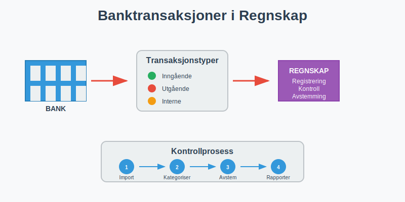
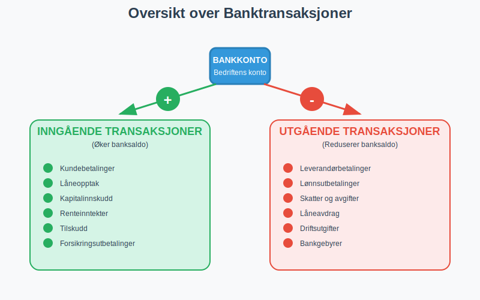
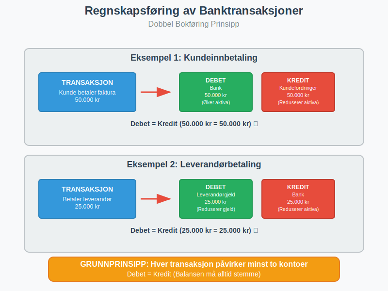
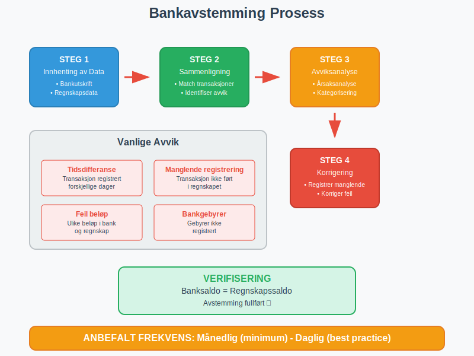
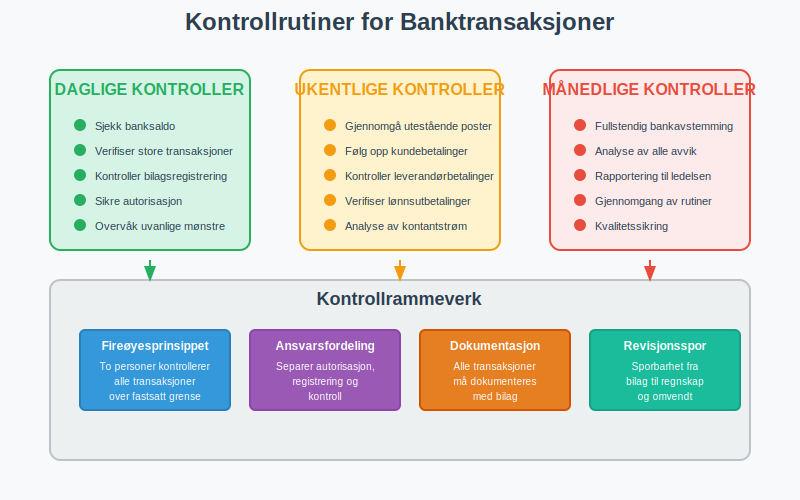
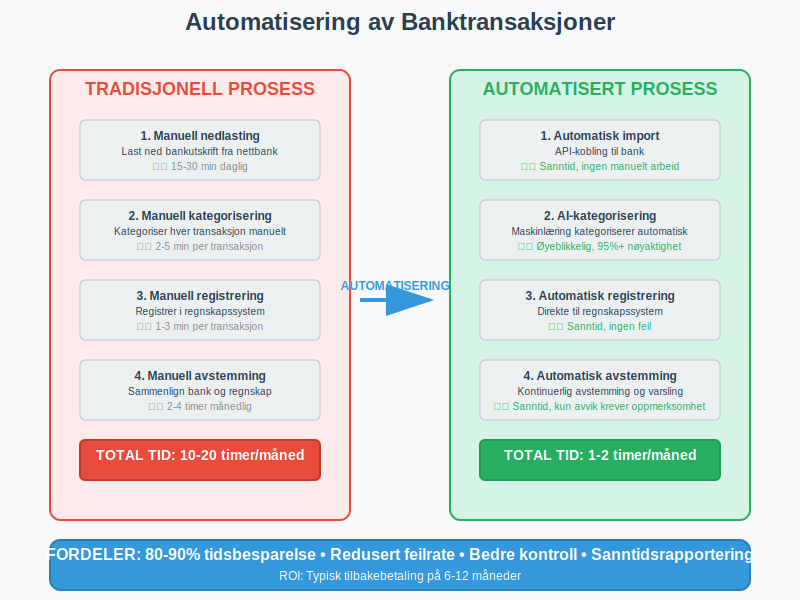

---
title: "Hva er Banktransaksjoner i Regnskap?"
seoTitle: "Hva er Banktransaksjoner i Regnskap?"
description: '**Banktransaksjoner** er alle finansielle bevegelser som skjer gjennom bedriftens [bankkontoer](/blogs/regnskap/hva-er-kontonummer "Hva er Kontonummer? Komplett...'
---

**Banktransaksjoner** er alle finansielle bevegelser som skjer gjennom bedriftens [bankkontoer](/blogs/regnskap/hva-er-kontonummer "Hva er Kontonummer? Komplett Guide til Norske Bankkontonummer"). Korrekt håndtering av banktransaksjoner er grunnleggende for nøyaktig [regnskap](/blogs/regnskap/hva-er-regnskap "Hva er Regnskap? En komplett guide") og sikrer at alle inn- og utbetalinger blir riktig registrert og kontrollert.
 
 Les mer om [Bedriftsbank](/blogs/regnskap/bedriftsbank "Bedriftsbank - Oversikt over banktjenester for bedrifter og regnskapsintegrasjon") for en helhetlig oversikt over bedriftens konto- og [betalingstjenester](/blogs/regnskap/betalingstjeneste "Hva er betalingstjeneste? Komplett Guide til Betalingstjenester i Norge").

 Se også [Hva er Bedriftskonto?](/blogs/regnskap/bedriftskonto "Hva er Bedriftskonto? Alt du trenger vite om bedriftens bankkontoer") for forståelse av bedriftens kontoer i daglig drift.



## Hva er Banktransaksjoner?

Banktransaksjoner omfatter alle **finansielle bevegelser** som påvirker bedriftens bankkontoer. Dette inkluderer både inngående og utgående betalinger som må registreres korrekt i regnskapet for å sikre:

* **Nøyaktig kontantstrøm** og likviditetsoversikt
* **Korrekt regnskapsføring** av alle finansielle hendelser
* **Effektiv bankavstemming** og kontroll
* **Sporbarhet** av alle finansielle transaksjoner
* **Overholdelse** av regnskapsloven og bokføringskrav

### Betydning for Regnskapet

Banktransaksjoner påvirker direkte bedriftens [balanse](/blogs/regnskap/hva-er-balanse "Hva er Balanse? Komplett Guide til Balansen i Regnskap") og resultatregnskap:

- **Bankinnskudd** øker [aktiva](/blogs/regnskap/hva-er-aktiva "Hva er Aktiva? Komplett Guide til Eiendeler i Balansen") (kontanter og bankinnskudd)
- **Bankutbetalinger** reduserer aktiva og kan påvirke kostnader eller gjeld
- **Rentetransaksjoner** påvirker finanskostnader eller finansinntekter
- **Gebyrer** registreres som driftskostnader

## Typer Banktransaksjoner



### Inngående Transaksjoner

**Inngående transaksjoner** øker bankbalansen og inkluderer:

#### Kundebetalinger
* **Fakturabetalinger** fra kunder
* **Kontantbetalinger** ved salg
* **Forskuddsbetalinger** fra kunder
* **Avtalegiro** og automatiske innbetalinger

#### Finansieringstransaksjoner
* **Låneopptak** fra banker eller andre långivere
* **Kapitalinnskudd** fra eiere eller investorer
* **Tilskudd** fra offentlige myndigheter
* **Forsikringsutbetalinger** ved skader

#### Andre Inntekter
* **Renteinntekter** på bankinnskudd
* **Utbytte** fra investeringer
* **Salg av anleggsmidler**
* **Refusjoner** og tilbakebetalinger

### Utgående Transaksjoner

**Utgående transaksjoner** reduserer bankbalansen og inkluderer:

#### Leverandørbetalinger
* **Fakturabetalinger** til leverandører via [direkte remittering](/blogs/regnskap/hva-er-direkte-remittering "Hva er Direkte Remittering? Komplett Guide til Direkte Overføringer")
* **Lønnsutbetalinger** til ansatte
* **[Arbeidsgiveravgift](/blogs/regnskap/hva-er-arbeidsgiveravgift "Hva er Arbeidsgiveravgift? Satser, Beregning og Regnskapsføring")** og andre avgifter
* **Forskuddsbetalinger** til leverandører

#### Driftsutgifter
* **Husleie** og lokalkostnader
* **Strøm, vann og oppvarming**
* **Forsikringspremier**
* **Kontorrekvisita** og driftsmidler

#### Finansielle Forpliktelser
* **Låneavdrag** og rentebetaling
* **Bankgebyrer** og transaksjonsavgifter
* **Skatter og avgifter**
* **Utbytte** til eiere

## Regnskapsføring av Banktransaksjoner

### Grunnleggende Prinsipper

Regnskapsføring av banktransaksjoner følger **dobbel bokføring** hvor hver transaksjon påvirker minst to kontoer:



#### Eksempel: Kundeinnbetaling
```
Debet: Bank                     50.000 kr
Kredit: Kundefordringer        50.000 kr
```

#### Eksempel: Leverandørbetaling
```
Debet: Leverandørgjeld         25.000 kr
Kredit: Bank                   25.000 kr
```

### Kontoplaner for Banktransaksjoner

| Kontotype | Kontonummer | Beskrivelse | Debet/Kredit |
|-----------|-------------|-------------|--------------|
| **Bank** | 1900-1999 | Bankinnskudd og kontanter | Debet øker |
| **Kundefordringer** | 1500-1599 | Utestående kundefakturaer | Debet øker |
| **Leverandørgjeld** | 2400-2499 | Skyldig til leverandører | Kredit øker |
| **Lønnsgjeld** | 2700-2799 | Skyldig lønn og feriepenger | Kredit øker |
| **Avgiftsgjeld** | 2600-2699 | MVA og andre avgifter | Kredit øker |

### Timing og Periodisering

**Kontantprinsippet vs. Opptjeningsprinsippet:**

* **Kontantprinsippet:** Registrering når betaling skjer
* **Opptjeningsprinsippet:** Registrering når transaksjonen oppstår

For banktransaksjoner må begge prinsipper koordineres:

1. **Salg registreres** når varen leveres (opptjening)
2. **Kundefordring** oppstår ved salg
3. **Bankinngang** registreres ved betaling (kontant)
4. **Kundefordring** nullstilles ved betaling

## Bankavstemming og Kontroll



### Hva er Bankavstemming?

**[Bankavstemming](/blogs/regnskap/hva-er-bankavstemming "Hva er Bankavstemming? Prosess, Metoder og Beste Praksis")** er prosessen med å sammenligne bedriftens regnskapsførte banksaldo med [bankens kontoutskrift](/blogs/regnskap/hva-er-kontoutskrift "Hva er Kontoutskrift i Regnskap? En Guide til Kontoutskrifter") for å identifisere og korrigere avvik.

### Månedlig Avstemmingsprosess

#### Steg 1: Innhenting av Data
* **Last ned** bankutskrift fra nettbank, vanligvis i [CSV-format](/blogs/regnskap/hva-er-csv-fil "Hva er en CSV-fil? Komplett Guide til CSV i Regnskap og Bokføring") for enkel import
* **Eksporter** banktransaksjoner fra regnskapssystem
* **Sammenstill** datoer og beløp

#### Steg 2: Sammenligning
* **Identifiser** transaksjoner som finnes i begge systemer
* **Merk** transaksjoner som kun finnes i ett system
* **Beregn** forskjeller i saldo

#### Steg 3: Avviksanalyse
Vanlige årsaker til avvik:

| Avvikstype | Beskrivelse | Løsning |
|------------|-------------|---------|
| **Tidsdifferanse** | Transaksjon registrert forskjellige dager | Kontroller datoer |
| **Manglende registrering** | Transaksjon ikke ført i regnskap | Registrer manglende bilag |
| **Feil beløp** | Ulike beløp i bank og regnskap | Korriger feilregistrering |
| **Bankgebyrer** | Gebyrer ikke registrert | Registrer bankgebyrer |
| **Renter** | Renter ikke registrert | Registrer renteinntekter/-kostnader |

#### Steg 4: Korrigering
* **Registrer** manglende transaksjoner
* **Korriger** feilregistreringer
* **Dokumenter** alle endringer
* **Verifiser** at saldoene stemmer

### Kontrollrutiner



#### Daglige Kontroller
* **Sjekk** banksaldo mot regnskapssaldo
* **Verifiser** store eller uvanlige transaksjoner
* **Kontroller** at alle bilag er registrert
* **Sikre** at betalinger er autorisert

#### Ukentlige Kontroller
* **Gjennomgå** utestående poster
* **Følg opp** manglende kundebetalinger
* **Kontroller** leverandørbetalinger
* **Verifiser** lønnsutbetalinger

#### Månedlige Kontroller
* **Fullstendig bankavstemming**
* **Analyse** av kontantstrøm
* **Gjennomgang** av alle avvik
* **Rapportering** til ledelsen

## Digitale Banktjenester og Automatisering

### Moderne Bankløsninger

**Digitale banktjenester** har revolusjonert håndtering av banktransaksjoner:

#### Nettbank for Bedrifter
* **Sanntids** saldooversikt
* **Automatisk** nedlasting av transaksjoner
* **Betalingsoppdrag** og masseutbetalinger
* **Varsling** om inn- og utbetalinger

#### API-integrasjoner
* **Direkte** kobling mellom bank og regnskapssystem
* **Automatisk** import av transaksjoner
* **Redusert** manuelt arbeid
* **Økt** nøyaktighet
* **Åpen bankvirksomhet** gjennom [PSD2-direktivet](/blogs/regnskap/hva-er-betalingstjenestedirektivet "Hva er Betalingstjenestedirektivet (PSD2)? Påvirkning på Regnskap og Betalingstjenester") som regulerer tredjepartstilgang til bankdata
* **Internasjonale transaksjoner** krever korrekt bruk av [BIC-koder](/blogs/regnskap/hva-er-bic-kode "BIC-kode - Komplett Guide til Bank Identifier Code i Norge") for sikker identifikasjon av mottakerbanker og [IBAN-numre](/blogs/regnskap/hva-er-iban-nummer "Hva er IBAN-nummer? Komplett Guide til International Bank Account Number i Norge") for nøyaktig identifikasjon av mottakerkontoer

### Automatisering av Regnskapsføring



#### Automatisk Kategorisering
* **Regelbasert** kategorisering av transaksjoner
* **Maskinlæring** for forbedret nøyaktighet
* **Leverandørgjenkjenning** basert på kontonummer
* **Standardbilag** for repeterende transaksjoner

#### Fordelene med Automatisering
* **Tidsbesparelse:** Redusert manuelt arbeid
* **Nøyaktighet:** Færre menneskelige feil
* **Konsistens:** Standardiserte prosesser
* **Sporbarhet:** Bedre dokumentasjon

For bedrifter som ønsker helhetlig automatisering av alle forretningsprosesser, inkludert banktransaksjoner, kan **[ERP-systemer](/blogs/regnskap/hva-er-erp-system "Hva er ERP-system? Komplett Guide til Enterprise Resource Planning")** tilby sømløs integrasjon mellom bankdata, regnskapsføring, og andre kjerneforretningsfunksjoner.

## Juridiske Krav og Compliance

### Bokføringsloven

**[Bokføringsloven](/blogs/regnskap/hva-er-bokføringsloven "Hva er Bokføringsloven? Krav, Regler og Praktisk Veiledning")** stiller krav til registrering av banktransaksjoner:

#### Dokumentasjonskrav
* **Alle transaksjoner** må dokumenteres med bilag
* **Bilag** må oppbevares i 5 år
* **Kronologisk** registrering av transaksjoner
* **Sporbarhet** fra bilag til regnskap

#### Oppbevaringskrav
* **Digitale bilag** må være lesbare
* **Backup** av alle regnskapsdata
* **Tilgjengelighet** for kontroll
* **Sikkerhet** mot tap og manipulasjon

### Hvitvaskingsloven

**Hvitvaskingsloven** pålegger bedrifter å:

* **Identifisere** kunder og transaksjoner
* **Rapportere** mistenkelige transaksjoner
* **Oppbevare** dokumentasjon
* **Implementere** kontrollsystemer

### Personvernforordningen (GDPR)

Ved håndtering av banktransaksjoner må bedrifter:

* **Beskytte** personopplysninger
* **Begrense** tilgang til sensitive data
* **Dokumentere** behandlingsgrunnlag
* **Implementere** sikkerhetstiltak

## Vanlige Utfordringer og Løsninger

### Utfordring 1: Manglende Avstemming

**Problem:** Banksaldo stemmer ikke med regnskapssaldo

**Løsninger:**
* Implementer **daglig avstemming**
* Bruk **automatiserte** avstemmingsverktøy
* Etabler **klare rutiner** for registrering
* **Tren personale** i korrekte prosedyrer

### Utfordring 2: Forsinkede Registreringer

**Problem:** Transaksjoner registreres for sent

**Løsninger:**
* **Automatiser** import fra bank
* Sett opp **daglige** importrutiner
* Bruk **varslingssystemer** for nye transaksjoner
* **Delegere** ansvar for daglig oppfølging

### Utfordring 3: Feilkategorisering

**Problem:** Transaksjoner føres på feil kontoer

**Løsninger:**
* **Standardiser** kontoplanen
* Implementer **automatisk** kategorisering
* **Tren personale** i kontobruk
* **Gjennomgå** regelmessig for kvalitetssikring

### Utfordring 4: Manglende Dokumentasjon

**Problem:** Bilag mangler eller er utilstrekkelige

**Løsninger:**
* **Digitaliser** alle bilag
* Implementer **obligatorisk** bilagsvedlegg
* **Standardiser** bilagsformater
* **Kontroller** fullstendighet før registrering

## Beste Praksis for Banktransaksjoner


### Organisatoriske Tiltak

#### Ansvarsfordeling
* **Separer** autorisasjon og registrering
* **Roter** ansvar for å unngå misligheter
* **Dokumenter** alle prosedyrer
* **Tren** personale regelmessig

#### Kontrollmiljø
* **Etabler** klare retningslinjer
* **Implementer** fireøyesprinsippet
* **Gjennomfør** regelmessige revisjoner
* **Rapporter** avvik til ledelsen

### Tekniske Tiltak

#### Systemintegrasjon
* **Koble** bank direkte til regnskapssystem
* **Automatiser** repeterende prosesser
* **Implementer** sanntidskontroller
* **Sikre** datakvalitet

#### Sikkerhet
* **Krypter** sensitive data
* **Begrens** tilgang til autorisert personale
* **Loggfør** alle endringer
* **Backup** regelmessig

### Rapportering og Analyse

#### Månedlige Rapporter
* **Kontantstrømanalyse**
* **Avstemmingsrapporter**
* **Avviksanalyse**
* **Trendanalyse**

#### Nøkkeltall (KPI)
* **Avstemmingshyppighet:** Andel måneder med fullstendig avstemming
* **Avviksstørrelse:** Gjennomsnittlig avvik i kroner
* **Registreringshastighet:** Tid fra transaksjon til registrering
* **Feilrate:** Andel transaksjoner med feil

## Fremtidige Trender

### Åpen Banking (PSD2)

**PSD2-direktivet** åpner for:
* **Tredjepartstilgang** til bankdata
* **Nye** finansielle tjenester
* **Forbedret** integrasjon
* **Økt** konkurranse

### Kunstig Intelligens

**AI og maskinlæring** vil forbedre:
* **Automatisk** kategorisering
* **Svindeldeteksjon**
* **Prediktiv** analyse
* **Intelligent** avstemming

### Blockchain og Kryptovaluta

**Nye teknologier** skaper behov for:
* **Nye** regnskapsmetoder
* **Utvidet** sporbarhet
* **Forbedret** sikkerhet
* **Regulatorisk** tilpasning

## Konklusjon

**Banktransaksjoner** er ryggraden i enhver bedrifts finansielle aktivitet. Korrekt håndtering krever:

* **Systematisk** tilnærming til registrering og kontroll
* **Regelmessig** avstemming og kvalitetssikring
* **Moderne** verktøy for automatisering og effektivitet
* **Kompetent** personale med riktig opplæring
* **Sterke** kontrollrutiner og sikkerhetstiltak

Ved å følge beste praksis og implementere robuste systemer kan bedrifter sikre nøyaktig regnskapsføring, redusere risiko og opprettholde finansiell integritet. Dette danner grunnlaget for pålitelig [finansiell rapportering](/blogs/regnskap/hva-er-regnskap "Hva er Regnskap? En komplett guide") og informerte forretningsbeslutninger.

Investering i gode rutiner for banktransaksjoner betaler seg både på kort og lang sikt gjennom reduserte kostnader, økt nøyaktighet og bedre kontroll over bedriftens finansielle situasjon.


