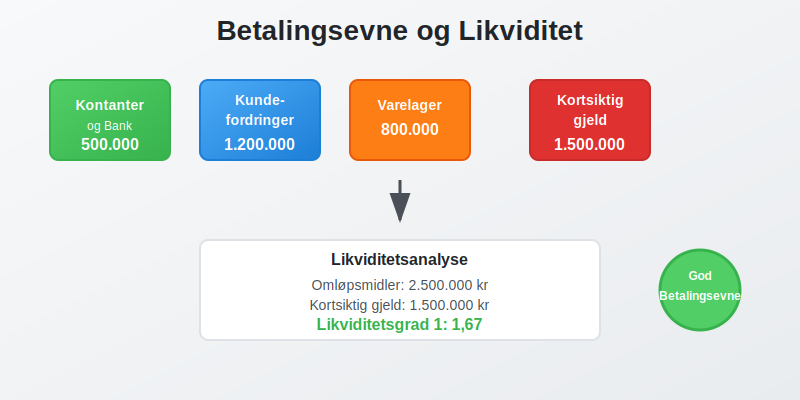
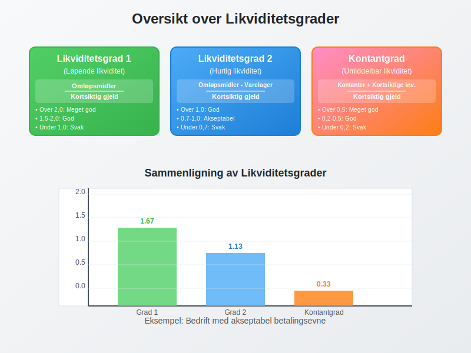

**Betalingsevne** er bedriftens evne til å oppfylle sine **finansielle forpliktelser** når de forfaller. Dette er et kritisk aspekt av [arbeidskapital](/blogs/regnskap/hva-er-arbeidskapital "Hva er Arbeidskapital? Beregning og Betydning for Bedriftens Drift")-styring og påvirker direkte bedriftens overlevelse og vekstmuligheter.

For en oversikt over relevante betalingstjenester og deres regnskapsmessige behandling, se [Hva er betalingstjeneste?](/blogs/regnskap/betalingstjeneste "Hva er betalingstjeneste?").



For å **forbedre kredittrisikoen**, kan bedrifter innhente gjeldsinformasjon fra **[Gjeldsregisteret](/blogs/regnskap/gjeldsregisteret "Hva er Gjeldsregisteret? En Guide til Gjeldsregisteret")** for å få en mer komplett oversikt over en kundes usikrede gjeld.

## Hva er Betalingsevne?

Betalingsevne, også kalt **[likviditet](/blogs/regnskap/hva-er-likviditet "Hva er Likviditet? Komplett Guide til Likviditetsstyring og Analyse")**, refererer til hvor lett en bedrift kan konvertere sine [aktiva](/blogs/regnskap/hva-er-aktiva "Hva er Aktiva? Komplett Guide til Eiendeler i Balansen") til kontanter for å dekke kortsiktige forpliktelser. God betalingsevne sikrer:

* **Kontinuerlig drift** uten avbrudd i leveranser eller tjenester
* **Kredittillit** hos leverandører og finansinstitusjoner  
* **Vekstmuligheter** gjennom investeringer og ekspansjon
* **Konkurransefortrinn** ved å kunne utnytte markedsmuligheter raskt
* **Finansiell stabilitet** som beskytter mot økonomiske sjokk

### Forskjellen på Betalingsevne og Soliditet

Det er viktig å skille mellom **betalingsevne** og **soliditet**:


| Aspekt | Betalingsevne | Soliditet |
|--------|---------------|-----------|
| **Tidsperspektiv** | Kortsiktig (0-12 måneder) | Langsiktig (flere år) |
| **Fokus** | Likviditet og kontantstrøm | Egenkapitalandel og gjeldsgrad |
| **MÃ¥ling** | Likviditetsgrad, kontantbeholdning | Egenkapitalandel, gjeldsgrad |
| **Risiko** | Betalingsproblemer, konkurs | Finansiell ustabilitet, tap |

## Likviditetsanalyse og Nøkkeltall

### Likviditetsgrader

**[Likviditetsgrader](/blogs/regnskap/hva-er-likviditetsgrad "Hva er Likviditetsgrad? Beregning, Analyse og Tolkning av Likviditetsnøkkeltall")** er de mest brukte målene for betalingsevne:



#### 1. Likviditetsgrad 1 (Løpende likviditet)

```
Likviditetsgrad 1 = Omløpsmidler ÷ Kortsiktig gjeld
```

**Tolkning:**
- **Over 2,0:** Meget god betalingsevne
- **1,5-2,0:** God betalingsevne  
- **1,0-1,5:** Akseptabel betalingsevne
- **Under 1,0:** Svak betalingsevne

#### 2. Likviditetsgrad 2 (Hurtig likviditet)

```
Likviditetsgrad 2 = (Omløpsmidler - Varelager) ÷ Kortsiktig gjeld
```

Denne graden ekskluderer [varelager](/blogs/regnskap/hva-er-varelager "Hva er Varelager? Verdsetting og Regnskapsføring") som kan være vanskelig å konvertere til kontanter raskt.

#### 3. Kontantgrad (Umiddelbar likviditet)

```
Kontantgrad = (Kontanter + Kortsiktige investeringer) ÷ Kortsiktig gjeld
```

### Praktisk Eksempel: Likviditetsanalyse

La oss analysere betalingsevnen til **Eksempel AS**:

| Balansepost | Beløp (NOK) |
|-------------|-------------|
| **Omløpsmidler:** | |
| [Kassebeholdning](/blogs/regnskap/hva-er-kassebeholdning "Hva er Kassebeholdning? Komplett Guide til Kontanter og Likvide Midler") og bankinnskudd | 500.000 |
| [Kundefordringer](/blogs/regnskap/hva-er-debitor "Hva er Debitor i Regnskap? Komplett Guide til Kundefordringer og Debitorhåndtering") | 1.200.000 |
| Varelager | 800.000 |
| **Sum omløpsmidler** | **2.500.000** |
| **Kortsiktig gjeld** | **1.500.000** |

**Beregninger:**
- Likviditetsgrad 1: 2.500.000 ÷ 1.500.000 = **1,67**
- Likviditetsgrad 2: (2.500.000 - 800.000) ÷ 1.500.000 = **1,13**  
- Kontantgrad: 500.000 ÷ 1.500.000 = **0,33**

**Analyse:** Bedriften har akseptabel betalingsevne, men er avhengig av å konvertere kundefordringer og varelager til kontanter.

## Kontantstrømanalyse

### Betydningen av Kontantstrøm

**[Kontantstrøm](/blogs/regnskap/hva-er-kontantstrom "Hva er Kontantstrøm? Komplett Guide til Cash Flow Analyse og Styring")** er den faktiske bevegelsen av kontanter inn og ut av bedriften. Selv lønnsomme bedrifter kan få betalingsproblemer hvis [kontantstrømmen](/blogs/regnskap/hva-er-kontantstrom "Hva er Kontantstrøm? Komplett Guide til Cash Flow Analyse og Styring") er negativ. Effektiv [likviditetsstyring](/blogs/regnskap/hva-er-likviditetsstyring "Hva er Likviditetsstyring i Regnskap? Kontantstrøm, Arbeidskapital og Finansiell Planlegging") er derfor avgjørende for å opprettholde god betalingsevne.


### Typer [Kontantstrøm](/blogs/regnskap/hva-er-kontantstrom "Hva er Kontantstrøm? Komplett Guide til Cash Flow Analyse og Styring")

| Type | Beskrivelse | Påvirkning på betalingsevne |
|------|-------------|----------------------------|
| **Operasjonell** | Fra daglig drift | Viktigst for kortsiktig betalingsevne |
| **Investering** | Fra kjøp/salg av [anleggsmidler](/blogs/regnskap/hva-er-anleggsmidler "Hva er Anleggsmidler? Materielle, Immaterielle og Finansielle Eiendeler") | Påvirker langsiktig kapasitet |
| **Finansiering** | Fra lån og egenkapital | Støtter betalingsevne ved behov |

### [Kontantstrømprognose](/blogs/regnskap/hva-er-kontantstrom "Hva er Kontantstrøm? Komplett Guide til Cash Flow Analyse og Styring")

En **[kontantstrømprognose](/blogs/regnskap/hva-er-kontantstrom "Hva er Kontantstrøm? Komplett Guide til Cash Flow Analyse og Styring")** er essensielt for å forutse betalingsevne. For dyptgående analyseteknikker og strategier for kontantstrømoptimalisering, se vår omfattende guide til [kontantstrømanalyse](/blogs/regnskap/hva-er-kontantstromanalyse "Hva er Kontantstrømanalyse? Komplett Guide til Cash Flow Analyse").

```
Kontantbeholdning (slutt) = Kontantbeholdning (start) + 
                            Kontantinngang - Kontantutgang
```

Effektiv [kontantbeholdning](/blogs/regnskap/hva-er-kontantbeholdning "Hva er Kontantbeholdning? Komplett Guide til Kontantforvaltning og Likviditet") krever strategisk planlegging av både kortsiktige og langsiktige kontantbehov.

## Faktorer som PÃ¥virker Betalingsevne

### Interne Faktorer


* **Kredittid til kunder:** Lengre kredittid reduserer kontantinngang
* **Lagerrotasjon:** Treg lageromsetning binder kapital
* **Leverandørkreditt:** Lengre betalingsfrist forbedrer likviditet
* **Sesongvariasjoner:** Påvirker både inntekter og kostnader
* **Investeringsbeslutninger:** Store investeringer kan påvirke likviditet

### Eksterne Faktorer

* **Markedsforhold:** PÃ¥virker salg og innbetalinger
* **Rentenivå:** Høyere renter øker finansieringskostnader
* **Konjunkturer:** Lavkonjunktur kan forsinke kundebetalinger
* **Regulatoriske endringer:** Nye krav kan påvirke kontantstrøm
* **Valutasvingninger:** For bedrifter med utenlandsk handel

## Strategier for å Forbedre Betalingsevne

### Kortsiktige Tiltak


#### Øke Kontantinngang
* **Raskere fakturering:** Automatisere faktureringsprosessen
* **Kortere kredittid:** Redusere betalingsfrist til kunder
* **Kontantrabatter:** Tilby rabatt for rask betaling
* **Effektiv innkreving:** Følge opp forfalte [fakturaer](/blogs/regnskap/hva-er-en-faktura "Hva er en Faktura? Komplett Guide til Norske Fakturakrav") med [betalingspåminnelser](/blogs/regnskap/hva-er-betalingspåmminelse "Hva er Betalingspåmminelse? Komplett Guide til Purring og Inkasso i Norge")
* **[Factoring](/blogs/regnskap/hva-er-factoring "Hva er Factoring? Komplett Guide til Fakturakjøp og Finansiering"):** Selge [kundefordringer](/blogs/regnskap/hva-er-debitor "Hva er Debitor i Regnskap? Komplett Guide til Kundefordringer og Debitorhåndtering") til factoringselskap for umiddelbar kontantstrøm

#### Redusere Kontantutgang
* **Forhandle leverandørkreditt:** Få lengre betalingsfrist
* **Optimalisere lager:** Redusere lagerbinding
* **Utsette investeringer:** Prioritere kritiske anskaffelser
* **Kostnadsreduksjoner:** Kutte unødvendige utgifter

### Langsiktige Strategier

#### Strukturelle Forbedringer
* **Diversifisere kundebase:** Redusere avhengighet av store kunder
* **Forbedre produktmiks:** Fokusere på lønnsomme produkter
* **Investere i teknologi:** Automatisere prosesser
* **Styrke markedsposisjon:** Bygge konkurransefortrinn

#### Finansiell Planlegging
* **Etablere kredittlinjer:** Sikre tilgang til finansiering
* **Bygge kontantreserver:** Opprettholde likviditetsbuffer
* **Overvåke nøkkeltall:** Implementere dashboards og rapporter
* **Scenarioplanlegging:** Forberede på ulike markedssituasjoner
* **[Budsjettering](/blogs/regnskap/hva-er-budsjettering "Hva er Budsjettering? Komplett Guide til Budsjettplanlegging for Bedrifter"):** Systematisk planlegging av kontantstrømmer og likviditetsbehov
* **Alternative finansieringsmetoder:** Vurdere [crowdfunding](/blogs/regnskap/hva-er-crowdfunding "Hva er Crowdfunding i Regnskap? Regnskapsføring, Skatt og Juridiske Krav") eller [crowdlending](/blogs/regnskap/hva-er-crowdlending "Hva er Crowdlending i Regnskap? P2P Utlån, Regnskapsføring og Skattemessige Konsekvenser") for rask kapitaltilgang uten tradisjonelle banklån

## Risikostyring og Betalingsevne

### Identifisering av Likviditetsrisiko

**Likviditetsrisiko** oppstår når bedriften ikke kan møte sine betalingsforpliktelser. Systematisk [likviditetsstyring](/blogs/regnskap/hva-er-likviditetsstyring "Hva er Likviditetsstyring i Regnskap? Kontantstrøm, Arbeidskapital og Finansiell Planlegging") kan bidra til å identifisere og håndtere slike risikoer proaktivt. Tidlige varselsignaler inkluderer:


* **Fallende likviditetsgrader** over flere perioder
* **Økende leverandørgjeld** og forsinket betaling
* **Redusert kontantbeholdning** uten planlagt utgang
* **Vanskeligheter med å få kreditt** fra banker eller leverandører
* **Økte rentekostnader** på grunn av høyere risikopremie

### Beredskapsplaner

En god **likviditetsberedskap** inkluderer:

| Beredskapsnivå | Tiltak | Tidshorisont |
|----------------|--------|--------------|
| **Grønn** | Normal drift, overvåking | Kontinuerlig |
| **Gul** | Reduserte investeringer, økt fokus | 1-3 måneder |
| **Rød** | Akutte tiltak, ekstern finansiering | Umiddelbart |

## Betalingsevne i Ulike Bransjer

### Bransjespesifikke Utfordringer


#### Detaljhandel
* **Sesongvariasjoner:** Store svingninger i kontantstrøm
* **Lagerrisiko:** Mye kapital bundet i varelager
* **Kort kredittid:** Kunder betaler ofte kontant eller kort

#### Bygg og anlegg
* **Lange prosjekter:** Kontantutgang før inntekter
* **Forskuddsbetalinger:** Avhengig av kundeforskudd
* **Værrisiko:** Kan påvirke fremdrift og kostnader

#### Tjenesteyting
* **Lav kapitalbinding:** Mindre behov for arbeidskapital
* **Kundekonsentrasjonsrisiko:** Avhengighet av store kunder
* **Kompetanserisiko:** Tap av nøkkelpersoner

### Benchmarking

Sammenligning med bransjegjennomsnitt er viktig for å vurdere betalingsevne:

| Bransje | Typisk likviditetsgrad 1 | Typisk kontantgrad |
|---------|-------------------------|-------------------|
| **Detaljhandel** | 1,2-1,8 | 0,1-0,3 |
| **Industri** | 1,5-2,2 | 0,2-0,4 |
| **Tjenester** | 1,8-2,5 | 0,3-0,6 |
| **Bygg/anlegg** | 1,1-1,6 | 0,1-0,2 |

## Digitale Verktøy for Betalingsevneanalyse

### Moderne Løsninger


#### Regnskapssystemer
* **Automatisk rapportering** av likviditetsnøkkeltall
* **Integrerte dashboards** for sanntidsovervåking
* **Prognosefunksjonalitet** basert på historiske data

#### Spesialiserte Verktøy
* **Kontantstrømplanlegging:** Detaljerte prognoser
* **Kredittovervåking:** Automatisk oppfølging av kundefordringer
* **Bankintegrasjon:** Sanntids kontosaldo og transaksjoner

### Implementering av Overvåkingssystemer

En effektiv overvåking av betalingsevne bør inkludere:

* **Daglig rapportering** av kontantbeholdning
* **Ukentlige prognoser** for kommende 13 uker
* **Månedlige analyser** av likviditetsnøkkeltall
* **Kvartalsvis benchmarking** mot bransjen

## Juridiske Aspekter ved Betalingsproblemer

### Konsekvenser av DÃ¥rlig Betalingsevne

Når betalingsevnen svikter, kan det få alvorlige juridiske konsekvenser:

#### Konkursrisiko
* **Betalingsudyktighet:** Kan ikke betale forfalt gjeld. Se [Hva er Insolvens?](/blogs/regnskap/insolvens "Hva er Insolvens?") for mer informasjon.
* **Illiquiditet:** Mangler likvide midler til å dekke forpliktelser
* **Konkursbegjæring:** Kan fremmes av kreditorer eller bedriften selv

#### Ansvar for Ledelsen
* **Aktsomhetsplikt:** Ledelsen må handle forsvarlig
* **Informasjonsplikt:** Varsle styret om betalingsproblemer
* **Erstatningsansvar:** Ved uforsvarlig videreføring

### Forebyggende Tiltak

For å unngå juridiske problemer:

* **Regelmessig overvåking** av betalingsevne
* **Tidlig varsling** til styret ved problemer
* **Profesjonell rådgivning** ved finansielle utfordringer
* **Dokumentasjon** av beslutninger og tiltak

## Konklusjon

**Betalingsevne** er fundamentalt for enhver bedrifts overlevelse og vekst. God likviditetsstyring krever:

* **Kontinuerlig overvåking** av nøkkeltall og kontantstrøm
* **Proaktiv planlegging** med prognoser og scenarioanalyser  
* **Balansert tilnærming** mellom vekst og finansiell stabilitet
* **Beredskapsplaner** for å håndtere utfordringer

Ved å forstå og aktivt styre betalingsevnen kan bedrifter sikre stabil drift, utnytte vekstmuligheter og bygge langsiktig konkurransefortrinn. Dette krever både analytiske ferdigheter, strategisk tenkning og operasjonell disiplin.

Husk at betalingsevne ikke bare handler om å overleve - det handler om å skape grunnlag for bærekraftig vekst og verdiskaping. En bedrift med sterk betalingsevne har frihet til å investere, innovere og utnytte markedsmuligheter når de oppstår.


