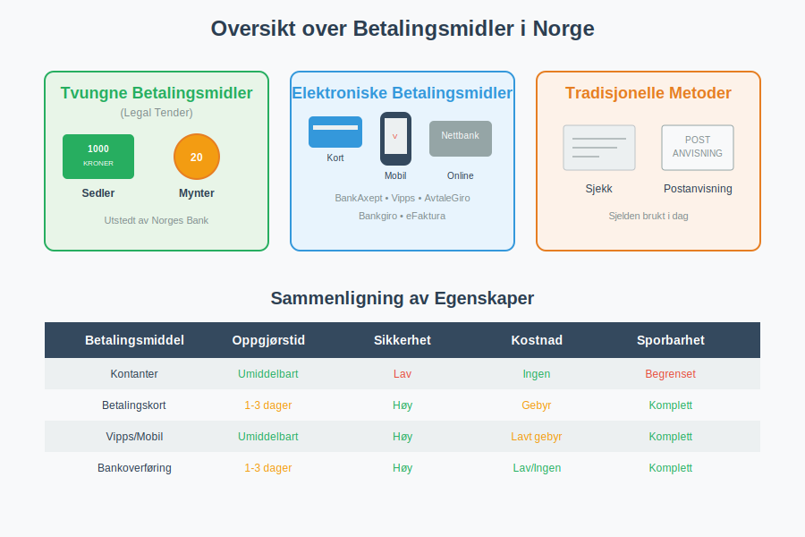
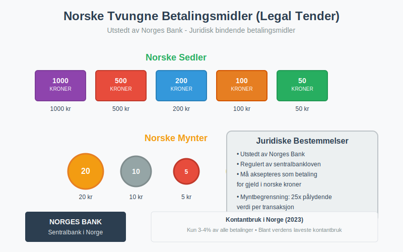
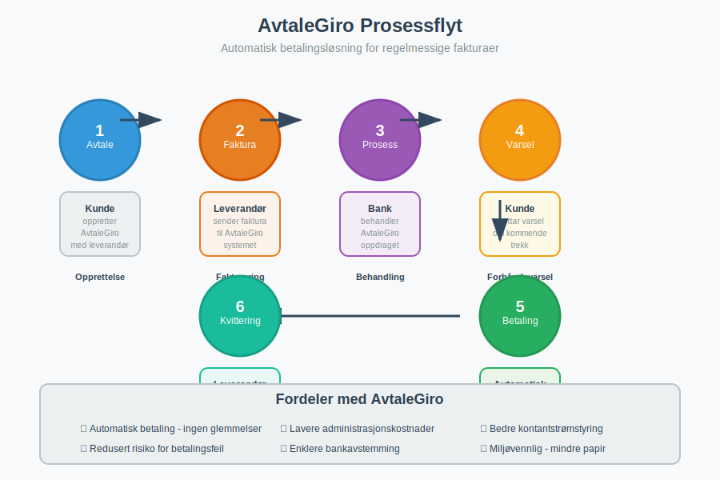
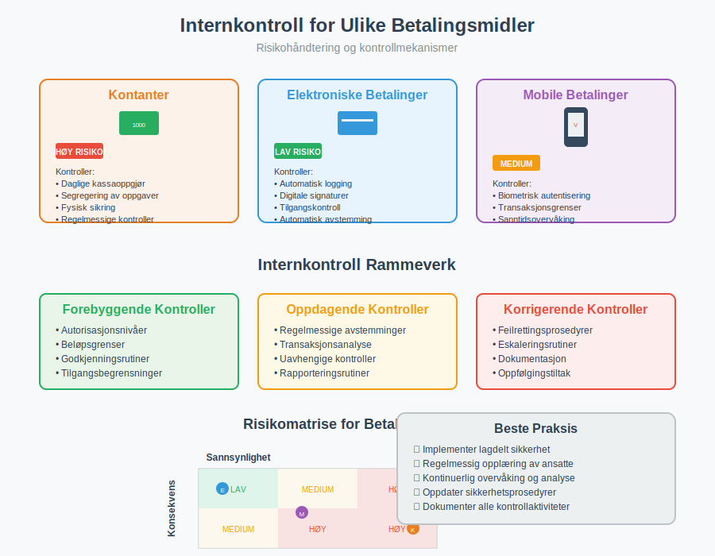

---
title: "Hva er Betalingsmidler? Tvungne, Elektroniske og Tradisjonelle Metoder"
seoTitle: "Hva er Betalingsmidler? Tvungne, Elektroniske og Tradisjonelle Metoder"
description: '**Betalingsmidler** er de ulike metodene og instrumentene som kan brukes for å gjennomføre økonomiske transaksjoner og oppgjør av forpliktelser. I det moder...'
---

**Betalingsmidler** er de ulike metodene og instrumentene som kan brukes for å gjennomføre økonomiske transaksjoner og oppgjør av forpliktelser. I det moderne samfunnet har betalingslandskapet utviklet seg dramatisk, fra tradisjonelle kontanter til sofistikerte elektroniske løsninger. For bedrifter er forståelse av ulike betalingsmidler kritisk for både [regnskapsføring](/blogs/regnskap/hva-er-regnskap "Hva er Regnskap? En Komplett Guide til Regnskapsføring") og effektiv [fakturabehandling](/blogs/regnskap/hva-er-en-faktura "Hva er en Faktura? En Guide til Norske Fakturakrav").

## Kategorisering av Betalingsmidler

Betalingsmidler kan kategoriseres på flere måter, men den mest grunnleggende inndelingen skiller mellom **tvungne betalingsmidler** (lovlige betalingsmidler) og **frivillige betalingsmidler**. I tillegg kan vi skille mellom fysiske og elektroniske betalingsformer.

### Tvungne Betalingsmidler (Legal Tender)

**Tvungne betalingsmidler** er de betalingsformene som juridisk må aksepteres som gyldig betaling for gjeld denominert i samme valuta. I Norge er dette regulert av sentralbankloven og valutareguleringen.

#### Norske Kroner - Sedler og Mynter

Norges Bank har enerett til å utstede norske sedler og mynter, som utgjør Norges tvungne betalingsmidler:

* **Sedler:** 50, 100, 200, 500 og 1000 kroner
* **Mynter:** 1, 5, 10 og 20 kroner

#### Juridiske Begrensninger

Selv om sedler og mynter er tvungne betalingsmidler, finnes det praktiske begrensninger:

* **Myntbegrensning:** Mynter er kun tvungne betalingsmidler opp til 25 ganger pålydende verdi per transaksjon
* **Forretningsmessige unntak:** Private aktører kan nekte kontantbetaling hvis dette er tydelig kommunisert på forhånd
* **Offentlige tjenester:** Offentlige instanser må som hovedregel akseptere kontanter

## Elektroniske Betalingsmidler

Det elektroniske betalingslandskapet i Norge er blant verdens mest utviklede, med høy adopsjonsrate og bred aksept for digitale løsninger.

### Bankbaserte Elektroniske Løsninger

#### BankAxept og Betalingskort

**BankAxept** er det nasjonale debetkortsystemet i Norge, mens internasjonale kort som Visa og Mastercard også er utbredt:

| Korttype | Beskrivelse | Regnskapsføring |
|----------|-------------|-----------------|
| [**Debetkort (BankAxept)**](/blogs/regnskap/debetkort "Debetkort? Komplett Guide til Debetkort i Norge") | Direkte trekk fra bankkonto | Umiddelbar reduksjon av bankinnskudd |
| Kredittkort | Kredittfasilitet med månedlig oppgjør | Kortsiktig gjeld til oppgjør |
| Bedriftskort | Firmakort for forretningsutgifter | Direkte kostnadsføring med attestering |

#### Nettbank og Mobilbank

Moderne bankløsninger tilbyr omfattende betalingsfunksjonalitet:

* **Overføringer:** Direkte overføring mellom kontoer
* **[Direkte remittering](/blogs/regnskap/hva-er-direkte-remittering "Hva er Direkte Remittering? Komplett Guide til Direkte Overføringer"):** Elektronisk overføring av midler direkte mellom bankkontoer
* **[Bankgiro](/blogs/regnskap/hva-er-bankgiro "Hva er Bankgiro? Komplett Guide til Bankgirobetalinger"):** Betaling av fakturaer med KID-nummer basert på det norske [giro-systemet](/blogs/regnskap/hva-er-giro "Hva er Giro? Komplett Guide til Giro-systemet i Norge")
* **Hurtigoverføring:** Øyeblikkelig overføring mellom norske banker

### Automatiske Betalingsløsninger

#### AvtaleGiro

**[AvtaleGiro](/blogs/regnskap/hva-er-avtalegiro "Hva er AvtaleGiro? Komplett Guide til Automatisk Betaling")** er Norges mest brukte automatiske betalingsløsning for regelmessige fakturaer:

**Fordeler for bedrifter:**
* Redusert administrativt arbeid
* Færre betalingsfeil
* Bedre kontantstrømstyring
* Lavere transaksjonskostnader

**Regnskapsmessige konsekvenser:**
* Automatisk registrering av utbetalinger
* Enklere [bankavstemming](/blogs/regnskap/hva-er-bankavstemming "Hva er Bankavstemming? En Komplett Guide til Bankavstemmingsprosessen")
* Bedre sporbarhet av betalinger

#### eFaktura

**[eFaktura](/blogs/regnskap/hva-er-efaktura "Hva er eFaktura? Komplett Guide til Elektronisk Fakturering i Norge")** kombinerer elektronisk fakturamottak med mulighet for automatisk betaling:

* Fakturaer mottas direkte i nettbanken
* Kunde kan velge mellom manuell godkjenning eller automatisk betaling
* Integrert med regnskapssystemer for automatisk bokføring

### Mobile Betalingsløsninger

#### Vipps

**Vipps** har revolusjonert person-til-person betalinger og utvides stadig for bedriftsbruk:

**Vipps-tjenester:**
* **Vipps Regning:** Betaling av fakturaer via mobilapp
* **Vipps Bedrift:** Betalingsløsning for netthandel og fysiske butikker
* **Vipps Faktura:** Elektronisk fakturering via Vipps-plattformen

#### Andre Mobile Løsninger

* **Apple Pay / Google Pay:** Kontaktløs betaling via smarttelefon
* **Samsung Pay:** Samsungs betalingsløsning
* **Internasjonale løsninger:** PayPal, Klarna, osv.

## Tradisjonelle Betalingsmidler

### Kontanter

Selv om kontantbruken i Norge er blant verdens laveste, spiller kontanter fortsatt en rolle:

**Fordeler:**
* Umiddelbar oppgjør
* Ingen transaksjonskostnader
* Personvern
* Fungerer uten teknisk infrastruktur

**Ulemper:**
* Sikkerhetsrisiko
* Administrativt krevende
* Begrenset sporbarhet
* Ikke praktisk for store beløp

### Sjekker

**Sjekker** er nesten helt faset ut i Norge, men brukes fortsatt i begrenset omfang:

* Hovedsakelig i B2B-transaksjoner
* Krever spesiell håndtering i regnskapet
* Lengre oppgjørstid
* Høyere risiko for manglende dekning

## Regnskapsmessige Konsekvenser

Valg av betalingsmiddel har betydelige konsekvenser for regnskapsføring og internkontroll.

### Kontantstrømstyring

Ulike betalingsmidler påvirker [arbeidskapital](/blogs/regnskap/hva-er-arbeidskapital "Hva er Arbeidskapital? Beregning, Analyse og Optimalisering") forskjellig:

| Betalingsmiddel | Oppgjørstid | Kontantstrømspåvirkning |
|-----------------|-------------|-------------------------|
| Kontanter | Umiddelbart | Øyeblikkelig likviditetsendring |
| [**Debetkort**](/blogs/regnskap/debetkort "Debetkort? Komplett Guide til Debetkort i Norge") | 1-2 dager | Kort forsinkelse |
| Kredittkort | 2-5 dager | Forsinkelse + gebyr |
| Bankoverføring | 1-3 dager | Avhengig av bank og tidspunkt |
| AvtaleGiro | På forfallsdato | Forutsigbar kontantstrøm |

### Internkontroll og Dokumentasjon

**Elektroniske betalingsmidler** gir generelt bedre internkontroll:

* **Automatisk dokumentasjon:** Alle transaksjoner logges elektronisk
* **Sporbarhet:** Komplett auditspor fra bestilling til betaling
* **Redusert feilrisiko:** Mindre manuell håndtering
* **Integrerte kontroller:** Automatiske avstemminger og valideringer

**Kontantbetalinger** krever særskilt oppmerksomhet:

* Krav til kvitteringer og bilag
* Daglige kassaoppgjør
* Segregering av oppgaver
* Regelmessige kassakontroller

### Kostnadsanalyse

Ulike betalingsmidler har forskjellige kostnadsstrukturer:

#### Direkte Kostnader

* **Kortgebyrer:** Typisk 0,5-2,5% av transaksjonsbeløp
* **Bankgebyrer:** Faste gebyrer per transaksjon
* **Abonnementsavgifter:** Månedlige kostnader for betalingsterminaler

#### Indirekte Kostnader

* **Administrasjon:** Tid brukt på betalingshåndtering
* **Feilkostnader:** Kostnader ved feilaktige betalinger
* **Sikkerhetskostnader:** Forsikring og sikkerhetstiltak for kontanter

## Fremtidige Utviklingstrender

### Digitale Valutaer

**Sentralbankens digitale valuta (CBDC)** er under utredning i Norge:

* Potensielt supplement til fysiske kontanter
* Direkte utstedt av Norges Bank
* Kan kombinere fordelene ved kontanter og elektroniske betalinger

### Åpen Banking (PSD2)

**[Betalingstjenestedirektivet (PSD2)](/blogs/regnskap/hva-er-betalingstjenestedirektivet "Hva er Betalingstjenestedirektivet (PSD2)? Påvirkning på Regnskap og Betalingstjenester")** åpner for nye aktører og tjenester:

* Tredjepartstilgang til bankkontoer gjennom åpen bankvirksomhet
* Nye betalingsløsninger og innovative tjenester
* Økt konkurranse og innovasjon i betalingsmarkedet
* Strengere sikkerhetskrav med sterk kundeautentisering (SCA)
* Betydelige konsekvenser for regnskapsføring og compliance

### Blockchain og Kryptovalutaer

Selv om ikke anerkjent som lovlige betalingsmidler, påvirker blockchain-teknologi betalingslandskapet:

* Raskere grenseoverskridende betalinger
* Reduserte transaksjonskostnader
* Nye former for digitale eiendeler

For tradisjonelle internasjonale betalinger er [BIC-koder](/blogs/regnskap/hva-er-bic-kode "BIC-kode - Komplett Guide til Bank Identifier Code i Norge") og [IBAN-numre](/blogs/regnskap/hva-er-iban-nummer "Hva er IBAN-nummer? Komplett Guide til International Bank Account Number i Norge") fortsatt den globale standarden for sikker identifikasjon av banker og kontoer i SWIFT-nettverket.

## Praktiske Råd for Bedrifter

### Valg av Betalingsløsninger

Ved valg av betalingsløsninger bør bedrifter vurdere:

1. **Kundepreferanser:** Hvilke betalingsmidler foretrekker målgruppen?
2. **Kostnadseffektivitet:** Totalkostnad inkludert direkte og indirekte kostnader
3. **Integrasjon:** Hvor godt integreres løsningen med eksisterende systemer?
4. **Sikkerhet:** Risikohåndtering og compliance-krav
5. **Skalerbarhet:** Kan løsningen vokse med bedriften?

### Optimalisering av Betalingsprosesser

**Automatisering** er nøkkelen til effektive betalingsprosesser:

* Implementer [AvtaleGiro](/blogs/regnskap/hva-er-avtalegiro "Hva er AvtaleGiro? Komplett Guide til Automatisk Betaling") for regelmessige betalinger
* Bruk [eFaktura](/blogs/regnskap/hva-er-efaktura "Hva er eFaktura? Komplett Guide til Elektronisk Fakturering i Norge") for å redusere manuell fakturabehandling
* Integrer betalingsløsninger med regnskapssystem
* Etabler rutiner for regelmessig [avstemming](/blogs/regnskap/hva-er-avstemming "Hva er Avstemming? En Komplett Guide til Regnskapsavstemming")

### Risikohåndtering

**Betalingsrisiko** må håndteres systematisk:

* Diversifiser betalingsløsninger for å unngå avhengighet
* Etabler backup-løsninger for kritiske betalinger
* Implementer sterke internkontroller
* Sørg for adekvat forsikringsdekning

## Konklusjon

Betalingsmidler utgjør ryggraden i det moderne økonomiske systemet. Fra **tvungne betalingsmidler** som norske kroner til sofistikerte **elektroniske løsninger** som [AvtaleGiro](/blogs/regnskap/hva-er-avtalegiro "Hva er AvtaleGiro? Komplett Guide til Automatisk Betaling") og Vipps, tilbyr dagens betalingslandskap enorme muligheter for effektivisering og forbedret kontroll.

For bedrifter er det essensielt å forstå de ulike betalingsmidlenes karakteristika, kostnader og regnskapsmessige konsekvenser. Ved å velge riktige betalingsløsninger og implementere effektive prosesser, kan bedrifter oppnå betydelige besparelser, bedre kontantstrømstyring og redusert administrativt arbeid.

Det elektroniske betalingslandskapet vil fortsette å utvikle seg, med nye teknologier og løsninger som vil forme fremtidens betalingsmidler. Bedrifter som holder seg oppdatert og tilpasser seg disse endringene, vil være best posisjonert for fremtidig suksess.

For mer informasjon om [betalingstjenester](/blogs/regnskap/betalingstjeneste "Hva er betalingstjeneste?"), se vår dyptgående guide til hvordan betalingstjenester fungerer og bokføres i norsk regnskap.

