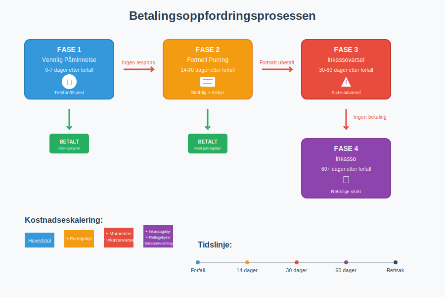
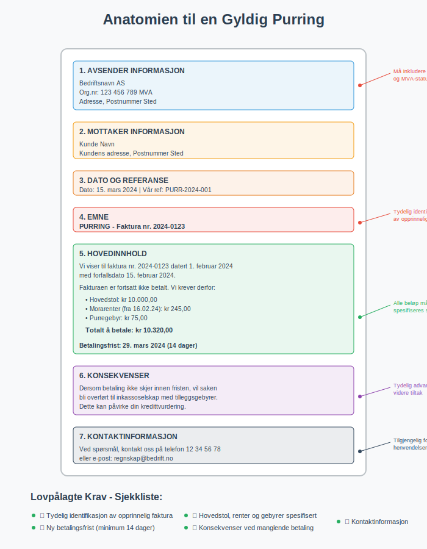
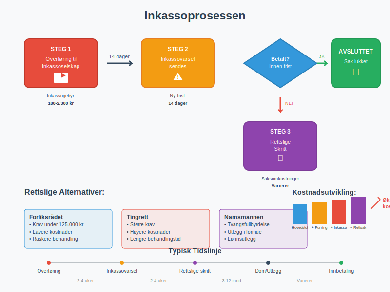
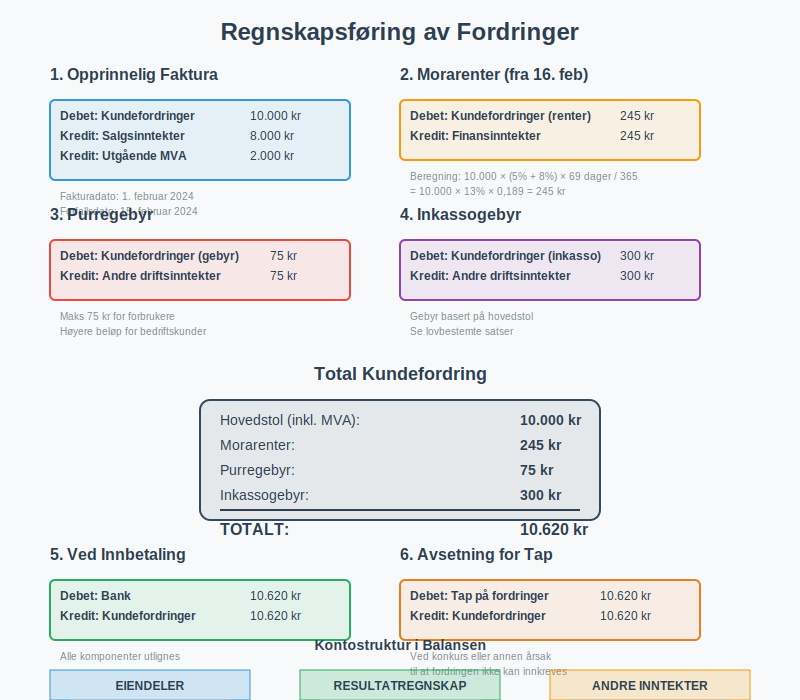
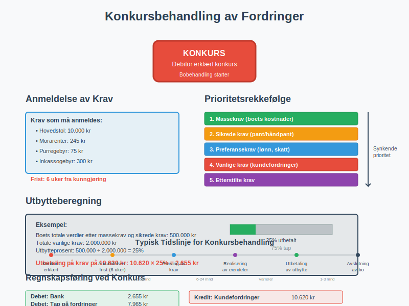

---
title: "Hva er Betalingsoppfordring?"
seoTitle: "Betalingsoppfordring | Stegene fra purring til inkasso"
description: "Hva er betalingsoppfordring? Lær prosessen fra vennlig påminnelse til purring, inkassovarsel og inkasso, med regler og beste praksis."
summary: "Betalingsoppfordring forklart: prosess, regler og gebyrer."
---

**Betalingsoppfordring** er den formelle prosessen bedrifter bruker for å kreve inn utestående betalinger fra kunder som ikke har betalt sine [fakturaer](/blogs/regnskap/hva-er-en-faktura "Hva er en Faktura? En Guide til Norske Fakturakrav") innen forfallsdato. Dette er en kritisk del av [arbeidskapital](/blogs/regnskap/hva-er-arbeidskapital "Hva er Arbeidskapital? Definisjon, Beregning og Optimalisering")-styringen og påvirker direkte bedriftens likviditet og [avkastning](/blogs/regnskap/hva-er-avkastning "Hva er Avkastning? Beregning, Typer og Analyse"). For bedrifter som driver med **[fakturasalg](/blogs/regnskap/hva-er-fakturasalg "Hva er Fakturasalg? Komplett Guide til Kredittgivning og Debitorhåndtering")**, er systematisk betalingsoppfordring essensielt for å minimere kredittrisiko og opprettholde god kontantstrøm.

Prosessen starter vanligvis med en vennlig påminnelse og kan eskalere til formell purring, inkassovarsel og til slutt rettslige skritt. En systematisk tilnærming til betalingsoppfordring er essensielt for å opprettholde god kundeservice samtidig som man sikrer kontantstrømmen.
Ved fortsatt manglende betaling kan det også registreres en [betalingsanmerkning](/blogs/regnskap/betalingsanmerkning "Betalingsanmerkning i Norsk Regnskap"), noe som påvirker kredittverdigheten.

For en detaljert gjennomgang av den spesifikke prosessen med [betalingspåminnelser](/blogs/regnskap/hva-er-betalingspåmminelse "Hva er Betalingspåmminelse? Komplett Guide til Purring og Inkasso i Norge"), inkludert juridiske krav, regnskapsføring og beste praksis, se vår omfattende guide til dette emnet.



## Juridiske Rammer for Betalingsoppfordring

I Norge reguleres betalingsoppfordring av flere lover og forskrifter som setter klare rammer for hva som er tillatt og påkrevd. Den sentrale lovgivningen er **[inkassoloven](/blogs/regnskap/hva-er-inkassoloven "Hva er Inkassoloven? Komplett Guide til Norsk Inkassolovgivning og Regler")**, som regulerer all inkassovirksomhet og beskytter skyldnere mot urettmessig behandling. Denne loven gjelder både for profesjonelle inkassoselskaper og bedrifter som driver egeninkasso.

### Fordringshaverens Rettigheter

Når en kunde ikke betaler innen forfallsdato, oppstår det automatisk **betalingsmislighold**. Fra dette tidspunktet har fordringshaveren rett til:

* **Morarenter:** Rente på det utestående beløpet fra forfallsdato
* **Purregebyr:** Kompensasjon for administrative kostnader ved purring
* **Inkassogebyr:** Dekning av kostnader ved profesjonell inkassohjelp
* **Erstatning:** For dokumenterte tap som følge av betalingsmisligholdet

### Lovpålagte Krav til Purring

For at en purring skal være juridisk gyldig, må den inneholde:

1. **Tydelig identifikasjon** av den opprinnelige [fakturaen](/blogs/regnskap/hva-er-en-faktura "Hva er en Faktura? En Guide til Norske Fakturakrav")
2. **Hovedstol, morarenter og gebyrer** spesifisert separat
3. **Ny betalingsfrist** (minimum 14 dager fra purredato)
4. **Konsekvenser** ved fortsatt manglende betaling
5. **Kontaktinformasjon** for henvendelser



## Betalingsoppfordringsprosessen Steg for Steg

En profesjonell betalingsoppfordringsprosess følger vanligvis en strukturert tilnærming som balanserer effektivitet med kundeservice.

### Fase 1: Vennlig Påminnelse (0-7 dager etter forfall)

Den første kontakten bør være vennlig og ikke-konfronterende:

* **Telefon eller e-post:** Personlig kontakt for å avklare situasjonen
* **Fokus på løsning:** Tilby betalingsordninger hvis nødvendig
* **Dokumentasjon:** Registrer all kommunikasjon for oppfølging

### Fase 2: Formell Purring (14-30 dager etter forfall)

Hvis vennlig påminnelse ikke gir resultat, sendes formell skriftlig purring:

| Element | Beskrivelse | Lovkrav |
|---------|-------------|---------|
| **Purregebyr** | Inntil kr 75 for forbrukere, høyere for bedrifter | Må være rimelig |
| **Morarenter** | Referanserenten + 8% (forbrukere) / 9% (bedrifter) | Automatisk fra forfall |
| **Betalingsfrist** | Minimum 14 dager fra purredato | Lovpålagt |
| **Inkassovarsel** | Advarsel om videre tiltak | Anbefalt |

### Fase 3: Inkassovarsel (30-60 dager etter forfall)

Siste advarsel før saken overføres til inkassoselskap:

* **Inkassogebyr:** Varsling om tilleggsgebyrer
* **Rettslige konsekvenser:** Informasjon om mulig rettsforfølgelse
* **Siste sjanse:** Tilbud om betalingsordning

### Fase 4: Inkasso og Rettslige Skritt (60+ dager etter forfall)

Når andre tiltak ikke fungerer, har bedriften flere alternativer for videre oppfølging. For en omfattende forståelse av **[inkassovirksomhet](/blogs/regnskap/hva-er-inkasso "Hva er Inkasso? Komplett Guide til Inkassovirksomhet og Fordringshåndtering")**, inkludert juridiske rammer, prosedyrer, kostnader og rettigheter, anbefaler vi vår detaljerte guide til inkasso.

* **[Egeninkasso](/blogs/regnskap/hva-er-egeninkasso "Hva er Egeninkasso? Komplett Guide til Selvinkasso og Fordringshåndtering"):** Bedriften driver selv inkassovirksomhet med full kontroll over prosessen
* **Inkassoselskap:** Profesjonell innkreving mot gebyr
* **Namsmannen:** Tvangsfullbyrdelse av fordringen
* **Domstolene:** Rettssak for å få dom på kravet

Valget mellom [egeninkasso](/blogs/regnskap/hva-er-egeninkasso "Hva er Egeninkasso? Komplett Guide til Selvinkasso og Fordringshåndtering") og profesjonell [inkasso](/blogs/regnskap/hva-er-inkasso "Hva er Inkasso? Komplett Guide til Inkassovirksomhet og Fordringshåndtering") avhenger av bedriftens ressurser, juridiske kompetanse og ønsket kontrollnivå over prosessen.



## Gebyrer og Kostnader ved Betalingsoppfordring

Forståelse av hvilke gebyrer som kan kreves er kritisk for både fordringshaver og debitor.

### Purregebyrer

Purregebyrer skal dekke de faktiske administrative kostnadene ved purring:

* **Forbrukere:** Maksimalt kr 75 per purring
* **Bedrifter:** Ingen øvre grense, men må være "rimelige"
* **Dokumentasjon:** Gebyret må kunne dokumenteres som faktisk kostnad

**Purregebyrer** er en type **[fakturagebyr](/blogs/regnskap/hva-er-fakturagebyr "Hva er Fakturagebyr? Komplett Guide til Faktureringsgebyrer i Norge")** som kreves ved forsinket betaling. I motsetning til vanlige fakturagebyr som pålegges ved utsendelse av fakturaer, påløper purregebyrer kun når betalingsfristen er overskredet. Les mer om de ulike typene fakturagebyr og deres lovlige rammer i vår omfattende guide.

### Morarenter

**[Morarenter](/blogs/regnskap/hva-er-forsinkelsesrente "Hva er Forsinkelsesrente? Komplett Guide til Morarenter og Beregning")** (forsinkelsesrente) beregnes fra forfallsdato og frem til betaling skjer:

* **Forbrukere:** Referanserenten + 5 prosentpoeng
* **Bedrifter:** Referanserenten + 8 prosentpoeng
* **Beregning:** Daglig rente på utestående hovedstol

For en detaljert gjennomgang av beregning, lovgrunnlag og praktisk håndtering av forsinkelsesrente, se vår omfattende guide til [forsinkelsesrente](/blogs/regnskap/hva-er-forsinkelsesrente "Hva er Forsinkelsesrente? Komplett Guide til Morarenter og Beregning").

**[Forsinkelsesgebyr](/blogs/regnskap/hva-er-forsinkelsesgebyr "Hva er Forsinkelsesgebyr? Komplett Guide til Morarenter og Forsinkelsesrenter i Norge")** omfatter alle typer gebyrer og kostnader som kan kreves ved forsinket betaling, inkludert morarenter, purregebyrer og inkassokostnader. Les vår omfattende guide for å forstå lovgrunnlaget, beregningsmetoder og praktiske råd for både kreditorer og debitorer.

### Inkassogebyrer

Når saken overføres til inkasso, kan følgende gebyrer kreves:

| Hovedstol | Inkassogebyr (maks) |
|-----------|-------------------|
| 0 - 2.000 kr | 180 kr |
| 2.001 - 5.000 kr | 300 kr |
| 5.001 - 25.000 kr | 590 kr |
| 25.001 - 100.000 kr | 1.150 kr |
| Over 100.000 kr | 2.300 kr |

*Satser gjelder for forbrukerkrav. Bedriftskrav kan ha høyere gebyrer.*

For en omfattende gjennomgang av [inkassosalær](/blogs/regnskap/hva-er-inkassosalaer "Hva er Inkassosalær? Komplett Guide til Inkassohonorar og Gebyrer i Norge"), inkludert prosentbaserte honorarer, bransjespesifikke satser og fremtidige trender, se vår detaljerte guide.

## Regnskapsføring av Betalingsoppfordring

Korrekt regnskapsføring av utestående fordringer og tilhørende gebyrer er viktig for nøyaktig [balanse](/blogs/regnskap/hva-er-balanse "Hva er Balanse? Forklaring av Balansen i Regnskap") og resultatrapportering.

### Bokføring av Morarenter

Morarenter skal bokføres som **finansinntekt** når de påløper:

```
Debet: Kundefordringer (morarenter)
Kredit: Finansinntekter
```

### Bokføring av Purregebyrer

Purregebyrer bokføres som **driftsinntekt** når de kreves:

```
Debet: Kundefordringer (purregebyr)
Kredit: Andre driftsinntekter
```

### Avsetning for Tap på Fordringer

Ved langvarige betalingsproblemer må det vurderes [avsetning](/blogs/regnskap/avsetning "Avsetning i Regnskap - Komplett Guide til Avsetninger og Estimater") for tap:

* **Individuell vurdering:** For store enkeltkrav
* **Porteføljevurdering:** For mange små krav
* **Historisk tapsprosent:** Basert på tidligere erfaringer



## Beste Praksis for Effektiv Betalingsoppfordring

En profesjonell tilnærming til betalingsoppfordring kan redusere tapene betydelig og opprettholde gode kundeforhold.

### Forebyggende Tiltak

* **Kredittvurdering:** Vurder kundens betalingsevne før salg
* **Klare betalingsbetingelser:** Spesifiser forfallsdato og konsekvenser
* **Automatiske påminnelser:** Sett opp systemer for tidlig varsling
* **Betalingsfasilitering:** Tilby [AvtaleGiro](/blogs/regnskap/hva-er-avtalegiro "Hva er AvtaleGiro? Komplett Guide til Automatisk Betaling") og andre enkle betalingsløsninger

### Kommunikasjonsstrategi

* **Profesjonell tone:** Behold respektfull kommunikasjon
* **Dokumentasjon:** Registrer all kontakt og avtaler
* **Fleksibilitet:** Vurder betalingsordninger for kunder i midlertidige vanskeligheter
* **Oppfølging:** Sikre at avtaler overholdes

### Teknologiske Løsninger

Moderne regnskapssystemer kan automatisere mye av betalingsoppfordringsprosessen:

* **Automatisk purring:** Systemgenererte purrebrev ved forfall
* **Kundeportaler:** Selvbetjening for kunder
* **Integrasjon:** Kobling til inkassoselskaper og betalingsløsninger
* **Rapportering:** Oversikt over utestående fordringer og aldersfordeling

## Spesielle Situasjoner og Utfordringer

### Betalingsoppfordring til Forbrukere

Når kunden er en privatperson, gjelder strengere regler:

* **Lavere gebyrer:** Maksimalgrenser for purre- og inkassogebyrer
* **Informasjonsplikt:** Klarere informasjon om rettigheter
* **Angrerett:** Spesielle regler for enkelte typer kjøp

### Internasjonale Fordringer

Ved krav mot utenlandske kunder må man vurdere:

* **Jurisdiksjon:** Hvilket lands lover som gjelder
* **Inkassoselskap:** Lokale aktører med språk- og kulturkompetanse
* **Valutarisiko:** Endringer i valutakurser under prosessen

### Konkurs og Betalingsstandsning

Når debitor går konkurs eller får betalingsstandsning:

* **Anmeldelse:** Krav må anmeldes til boet innen frister
* **Prioritet:** Vanlige fordringer har lav prioritet
* **Sikkerhet:** Panterettigheter gir bedre dekning



## Etiske Aspekter ved Betalingsoppfordring

Selv om man har juridisk rett til å kreve betaling, bør etiske hensyn vektlegges:

### Proporsjonalitet

* **Rimelige gebyrer:** Ikke utnytte situasjonen for profitt
* **Passende tiltak:** Tilpasse innsatsen til kravets størrelse
* **Menneskelighet:** Vise forståelse for kundens situasjon

### Transparens

* **Klar kommunikasjon:** Forklare alle gebyrer og konsekvenser
* **Rettigheter:** Informere om debitors rettigheter
* **Klageadgang:** Tilby mulighet for å klage på gebyrer

## Måling av Effektivitet

For å optimalisere betalingsoppfordringsprosessen bør man måle:

### Nøkkeltall (KPIer)

* **Gjennomsnittlig innkrevingstid:** Dager fra forfall til betaling
* **Innkrevingsprosent:** Andel av utestående som innkreves
* **Kostnad per innkrevd krone:** Effektivitet av prosessen
* **Kundetilfredshet:** Påvirkning på kundeforhold

### Benchmarking

Sammenlign resultatene med:

* **Bransjestandarder:** Typiske tall for din bransje
* **Historiske data:** Utvikling over tid
* **Beste praksis:** Læring fra andre bedrifter

## Fremtidige Trender

Betalingsoppfordring utvikler seg med teknologi og samfunnsendringer:

### Digitalisering

* **AI og maskinlæring:** Automatisk risikovurdering og personaliserte tilnærminger
* **Chatbots:** Automatisert kundekommunikasjon
* **Blockchain:** Sikre og transparente betalingsløsninger

### Regulatoriske Endringer

* **Strengere forbrukervern:** Lavere gebyrer og bedre informasjon
* **Europeiske direktiver:** Harmonisering av regler på tvers av land
* **Bærekraft:** Fokus på ansvarlig utlånspraksis

Betalingsoppfordring er en balansegang mellom å sikre bedriftens likviditet og opprettholde gode kundeforhold. Ved å følge juridiske krav, anvende beste praksis og vise forståelse for kundens situasjon, kan bedrifter oppnå effektiv innkreving samtidig som de bevarer sitt omdømme og kundebase.

En systematisk og profesjonell tilnærming til betalingsoppfordring, støttet av moderne teknologi og tydelige rutiner, er en investering som betaler seg både på kort og lang sikt. Dette gjelder spesielt når det kombineres med god [attestering](/blogs/regnskap/hva-er-attestering "Hva er Attestering? En Komplett Guide til Bilagsbehandling og Godkjenning") av innkommende fakturaer og effektiv [bankavstemming](/blogs/regnskap/hva-er-bankavstemming "Hva er Bankavstemming? Komplett Guide til Avstemming av Bankkonti") for å sikre korrekt registrering av innbetalinger.


