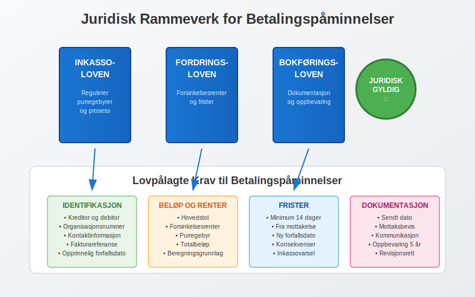
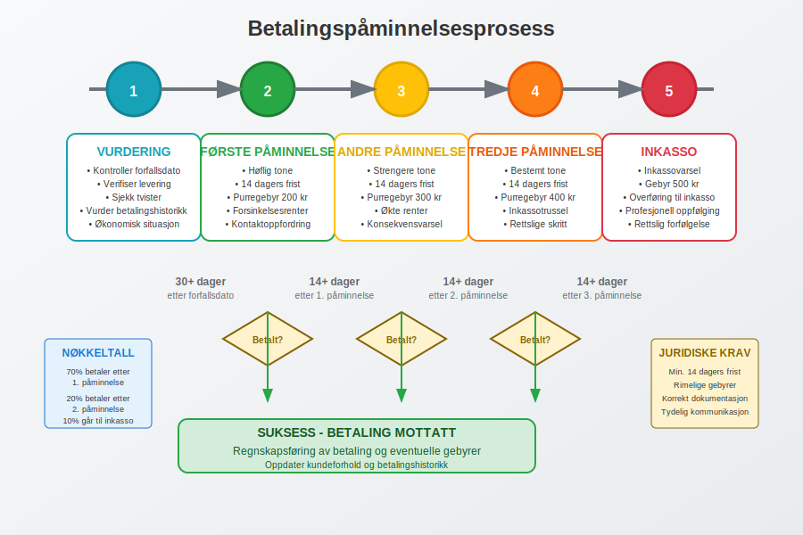
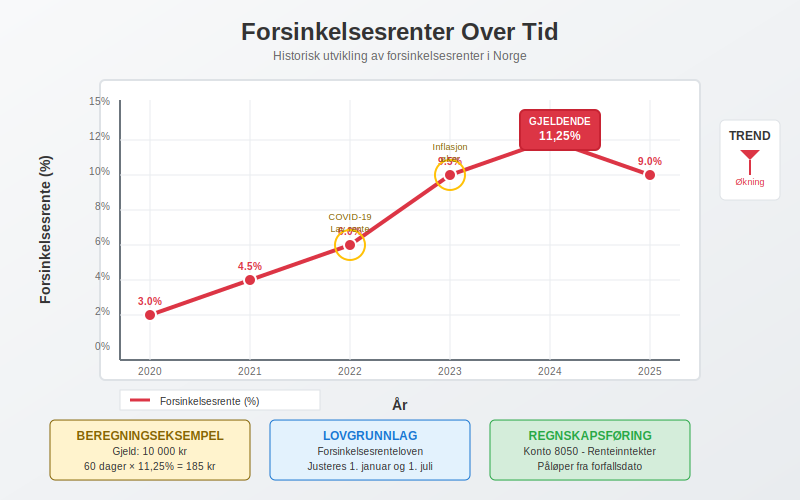
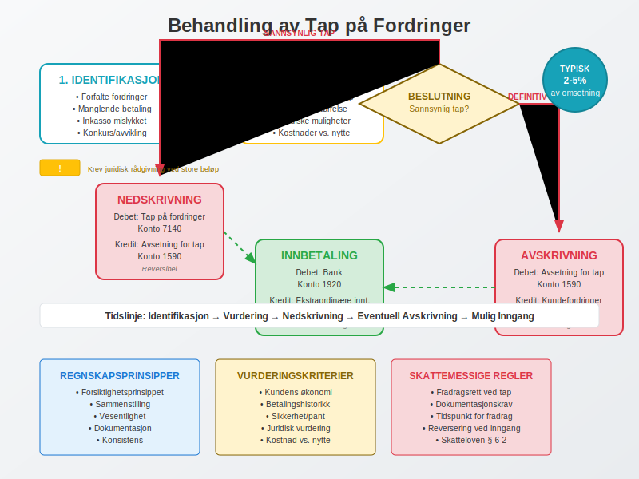

---
title: "Hva er Betalingspåmminelse?"
meta_title: "Hva er Betalingspåmminelse?"
meta_description: 'En **betalingspåmminelse** er en formell oppfordring til betaling av forfalt gjeld som sendes til en debitor som ikke har betalt innen forfallsdato. Dette er e...'
slug: hva-er-betalingspamminelse
type: blog
layout: pages/single
---

En **betalingspåmminelse** er en formell oppfordring til betaling av forfalt gjeld som sendes til en debitor som ikke har betalt innen forfallsdato. Dette er et viktig verktøy i [kundeoppfølging](/blogs/regnskap/hva-er-ansattreskontro "Hva er Ansattreskontro? Komplett Guide til Kundeoppfølging og Fordringsstyring") og regnskapsstyring som sikrer bedriftens [betalingsevne](/blogs/regnskap/hva-er-betalingsevne "Hva er Betalingsevne? Analyse av Likviditet og Finansiell Stabilitet") og kontantstrøm.

For mer informasjon om **purring** og **purregebyr**, se [Hva er purring og purregebyr](/blogs/regnskap/hva-er-purring-og-purregebyr "Hva er purring og purregebyr? Guide til Norske Regler for Purring").

Betalingspåminnelser er en spesifikk del av den bredere [betalingsoppfordringsprosessen](/blogs/regnskap/hva-er-betalingsoppfordring "Hva er Betalingsoppfordring? Komplett Guide til Purring og Inkasso i Norge"), som omfatter hele spekteret av tiltak for å kreve inn utestående betalinger fra kunder.

## Juridiske Grunnlag for Betalingspåminnelser

I Norge er betalingspåminnelser regulert av **fordringslovgivningen** og **[inkassoloven](/blogs/regnskap/hva-er-inkassoloven "Hva er Inkassoloven? Komplett Guide til Norsk Inkassolovgivning og Regler")**. En betalingspåminnelse er det første steget i den formelle inkassoprosessen og må oppfylle visse lovkrav for å være gyldig.



### Lovpålagte Krav til Betalingspåminnelser

For at en betalingspåmminelse skal være juridisk gyldig, må den inneholde følgende elementer:

* **Tydelig identifikasjon** av kreditor og debitor
* **Spesifikasjon av gjelden** med referanse til opprinnelig [faktura](/blogs/regnskap/hva-er-en-faktura "Hva er en Faktura? En Guide til Norske Fakturakrav")
* **Forfalt beløp** inkludert eventuelle renter
* **Ny betalingsfrist** (minimum 14 dager fra mottakelse)
* **Konsekvenser** ved manglende betaling
* **Purregebyr** som er rimelig og forholdsmessig ([se detaljer om purring og purregebyr](/blogs/regnskap/hva-er-purring-og-purregebyr "Hva er purring og purregebyr? Guide til Norske Regler for Purring"))

## Prosessen for Betalingspåminnelser

Betalingspåminnelsesprosessen følger en strukturert tilnærming som sikrer både juridisk gyldighet og effektiv kundeoppfølging.



### Trinn 1: Vurdering av Forfalt Gjeld

Før en betalingspåminnelse sendes, må bedriften:

1. **Kontrollere at fakturaen er forfalt** - vanligvis 30 dager etter fakturadato
2. **Verifisere at varen/tjenesten er levert** som avtalt
3. **Sjekke om det finnes tvist** eller reklamasjon fra kunden
4. **Vurdere kundens betalingshistorikk** og økonomiske situasjon

### Trinn 2: Første Betalingspåminnelse

Den første påminnelsen bør være **høflig men bestemt** og inneholde:

* Referanse til opprinnelig faktura
* Forfalt beløp med eventuelle forsinkelsesrenter
* Ny betalingsfrist (minimum 14 dager)
* Purregebyr (vanligvis 50-200 kroner)
* Oppfordring til kontakt ved problemer

### Trinn 3: Andre og Tredje PÃ¥minnelse

Ved manglende respons eskaleres prosessen:

* **Andre påminnelse**: Strengere tone, høyere purregebyr
* **Tredje påminnelse**: Trussel om inkasso eller rettslige skritt
* **Inkassovarsel**: Siste mulighet før saken overføres til inkassoselskap

## Purregebyrer og Regnskapsføring

**Purregebyrer** er kompensasjon for administrative kostnader ved oppfølging av forfalte fordringer. Disse må være rimelige og kan ikke overstige de faktiske kostnadene ved purreprosessen.

### Maksimale Purregebyrer (2024)

| PÃ¥minnelsestype | Maksimalt gebyr | Lovhjemmel |
|-----------------|-----------------|------------|
| Første påminnelse | 200 kr | Inkassoloven § 10 |
| Andre påminnelse | 300 kr | Inkassoloven § 10 |
| Tredje påminnelse | 400 kr | Inkassoloven § 10 |
| Inkassovarsel | 500 kr | Inkassoloven § 10 |

### Regnskapsføring av Purregebyrer

Purregebyrer skal behandles som **andre driftsinntekter** i regnskapet:

```
Debet: Kundefordringer (1500)    200 kr
Kredit: Andre driftsinntekter (3900)    200 kr
```

Ved betaling:
```
Debet: Bank (1920)    200 kr
Kredit: Kundefordringer (1500)    200 kr
```

## Forsinkelsesrenter

I tillegg til purregebyrer har kreditor rett til **forsinkelsesrenter** på forfalte fordringer. Forsinkelsesrenten er regulert av lov og justeres årlig.



### Beregning av Forsinkelsesrenter

Forsinkelsesrenten beregnes fra forfallsdato til betaling skjer:

**Formel**: `Hovedstol × Rentesats × Antall dager / 365`

**Eksempel**: 
- Forfalt beløp: 10 000 kr
- Forsinkelsesrente: 11,25% (2024)
- Forsinkelse: 60 dager
- Renter: 10 000 × 0,1125 × 60 / 365 = 185 kr

### Regnskapsføring av Forsinkelsesrenter

Forsinkelsesrenter regnskapsføres som **finansinntekter**:

```
Debet: Kundefordringer (1500)    185 kr
Kredit: Renteinntekter (8050)    185 kr
```

## Inkassoprosessen

Når betalingspåminnelser ikke fører til betaling, kan saken overføres til **inkassoselskap** eller **advokat** for videre oppfølging.

### Krav til Inkassoselskaper

Inkassoselskaper må være:

* **Registrert** hos Finanstilsynet
* **Forsikret** for sin virksomhet
* **Følge** inkassoloven og god inkassoskikk
* **Rapportere** til kredittopplysningsbyråer

### Kostnader ved Inkasso

| Tjeneste | Typisk kostnad | Hvem betaler |
|----------|----------------|--------------|
| Inkassogebyr | 200-500 kr | Debitor |
| Inkassosalær | 15-20% av gjeld | Debitor |
| Rettsgebyr | 500-2000 kr | Taper av sak |
| Advokatkostnader | 2000-5000 kr/time | Taper av sak |

For en detaljert forklaring av hvordan [inkassosalær](/blogs/regnskap/hva-er-inkassosalaer "Hva er Inkassosalær? Komplett Guide til Inkassohonorar og Gebyrer i Norge") beregnes, reguleres og varierer mellom bransjer, se vår omfattende guide til inkassohonorar og gebyrer.

## Regnskapsføring av Tap på Fordringer

Når det blir klart at en fordring ikke kan inndrives, må den **nedskrives** eller **avskrives** i regnskapet.



### Nedskrivning av Tvilsomme Fordringer

For fordringer hvor det er **sannsynlig** at tap vil oppstå:

```
Debet: Tap på fordringer (7140)    5000 kr
Kredit: Avsetning for tap (1590)    5000 kr
```

### Endelig Avskrivning

NÃ¥r fordringen er **definitivt tapt**:

```
Debet: Avsetning for tap (1590)    5000 kr
Kredit: Kundefordringer (1500)    5000 kr
```

## Beste Praksis for Betalingspåminnelser

### Forebyggende Tiltak

* **Kredittsjekk** av nye kunder
* **Klare betalingsbetingelser** i avtaler
* **Oppfølging** av forfallsdatoer
* **Automatiserte** påminnelsessystemer

### Effektiv Kommunikasjon

* **Personlig tilnærming** for store kunder
* **Fleksibilitet** ved betalingsproblemer
* **Dokumentasjon** av all kommunikasjon
* **Profesjonell tone** i alle henvendelser

### Teknologiske Løsninger

Moderne regnskapssystemer tilbyr automatiserte løsninger for betalingspåminnelser:

* **Automatisk utsendelse** basert på forfallsdatoer
* **Integrering** med [bankavstemming](/blogs/regnskap/hva-er-bankavstemming "Hva er Bankavstemming? Komplett Guide til Bankavstemmingsprosessen")
* **Rapportering** av aldersfordeling på fordringer
* **Integrasjon** med inkassoselskaper

## Juridiske Konsekvenser og Rettigheter

### Kreditors Rettigheter

Som kreditor har du rett til:

* **Forsinkelsesrenter** fra forfallsdato
* **Rimelige purregebyrer** for administrative kostnader
* **Inkassohjelp** fra profesjonelle aktører
* **Rettslig forfølgelse** av gjelden

### Debitors Rettigheter

Debitorer har rett til:

* **Minimum 14 dagers** betalingsfrist på påminnelser
* **Rimelige gebyrer** som ikke overstiger faktiske kostnader
* **Informasjon** om konsekvenser ved manglende betaling
* **Innsigelsesrett** ved uenighet om gjelden

### Særlige Hensyn for Forbrukere

Ved salg til **privatpersoner** gjelder strengere regler:

* Lavere maksimalgebyrer
* Lengre betalingsfrister
* Strengere krav til dokumentasjon
* Angrerett på visse kjøp

## Rapportering og Analyse

Effektiv styring av betalingspåminnelser krever systematisk **rapportering** og **analyse** av kundefordringer.

### Nøkkeltall for Oppfølging

| Nøkkeltall | Beregning | Målsetting |
|------------|-----------|------------|
| Gjennomsnittlig innkrevingstid | Sum dager / Antall fakturaer | < 45 dager |
| Andel forfalte fordringer | Forfalte fordringer / Totale fordringer | < 10% |
| Tapsprosent | Tap på fordringer / Omsetning | < 2% |
| Purreeffektivitet | Betalte etter purring / Sendte purringer | > 70% |

### Aldersanalyse av Fordringer

En systematisk gjennomgang av fordringenes alder gir verdifull innsikt:

* **0-30 dager**: Normale fordringer
* **31-60 dager**: Første oppfølging
* **61-90 dager**: Intensiv oppfølging
* **Over 90 dager**: Inkassovurdering

## Digitalisering og Fremtidige Trender

Betalingspåminnelsesprosessen blir stadig mer **digitalisert** og **automatisert**:

### Nye Teknologier

* **Kunstig intelligens** for risikovurdering
* **Automatiserte chatbots** for kundeservice
* **Blockchain** for sikker dokumentasjon
* **Prediktiv analyse** for å identifisere risikokunder

### Regulatoriske Endringer

* Strengere krav til **personvern** (GDPR)
* Økt fokus på **forbrukerbeskyttelse**
* **Digitale** kommunikasjonskanaler
* **Standardisering** av prosesser

## Konklusjon

Betalingspåminnelser er et **essensielt verktøy** for effektiv [kundeoppfølging](/blogs/regnskap/hva-er-ansattreskontro "Hva er Ansattreskontro? Komplett Guide til Kundeoppfølging og Fordringsstyring") og regnskapsstyring. Ved å følge juridiske krav, implementere beste praksis og bruke moderne teknologi, kan bedrifter minimere tap på fordringer og opprettholde god [betalingsevne](/blogs/regnskap/hva-er-betalingsevne "Hva er Betalingsevne? Analyse av Likviditet og Finansiell Stabilitet").

En systematisk tilnærming til betalingspåminnelser, kombinert med forebyggende tiltak og effektiv kommunikasjon, bidrar til å opprettholde gode kundeforhold samtidig som bedriftens økonomiske interesser ivaretas. Dette er særlig viktig i dagens konkurranseutsatte marked hvor kontantstrøm og likviditet er kritiske suksessfaktorer.
