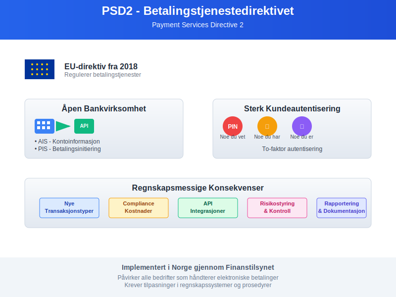
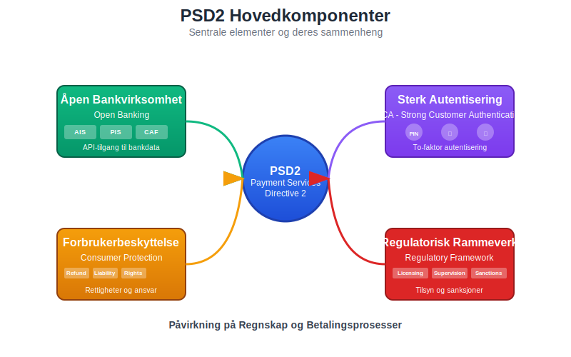
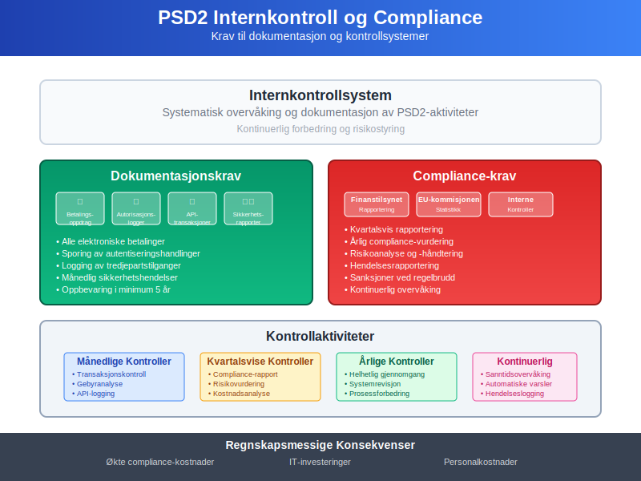
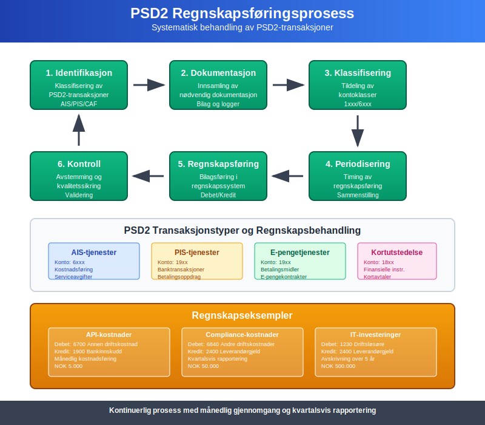
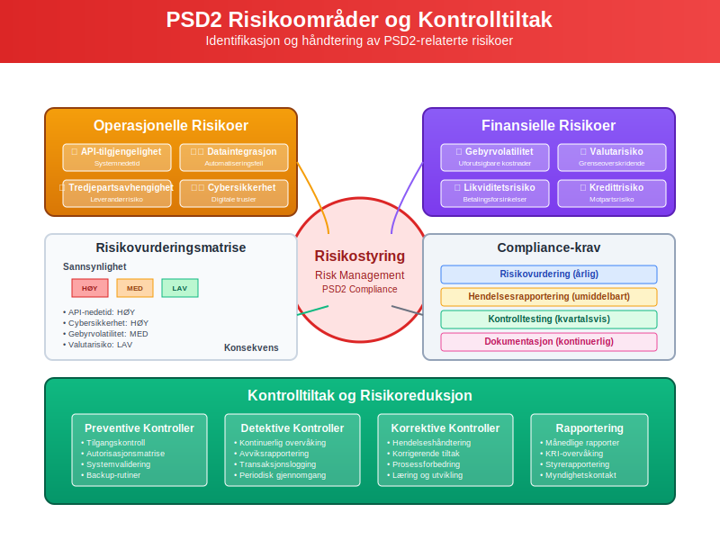
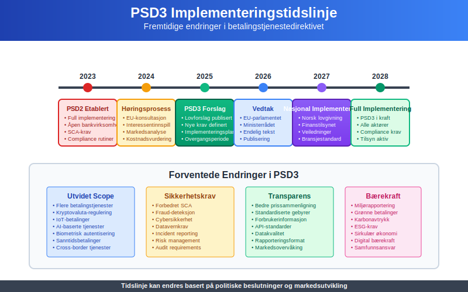

---
title: "Hva er Betalingstjenestedirektivet (PSD2)?"
seoTitle: "Hva er Betalingstjenestedirektivet (PSD2)?"
meta_description: '**Betalingstjenestedirektivet (PSD2)** er EUs omfattende regelverk som regulerer [betalingstjenester](/blogs/regnskap/betalingstjeneste "Hva er betalingstjenest...'
slug: hva-er-betalingstjenestedirektivet
type: blog
layout: pages/single
---

**Betalingstjenestedirektivet (PSD2)** er EUs omfattende regelverk som regulerer [betalingstjenester](/blogs/regnskap/betalingstjeneste "Hva er betalingstjeneste?") og har betydelige konsekvenser for [regnskapsføring](/blogs/regnskap/hva-er-regnskap "Hva er Regnskap? En komplett guide") og finansiell rapportering. Direktivet påvirker hvordan bedrifter håndterer [betalingsmidler](/blogs/regnskap/hva-er-betalingsmidler "Hva er Betalingsmidler? Kontanter, Bankinnskudd og Digitale Betalingsløsninger"), [banktransaksjoner](/blogs/regnskap/hva-er-banktransaksjoner "Hva er Banktransaksjoner? Typer, Regnskapsføring og Automatisering") og **åpen bankvirksomhet**.



## Hva er PSD2?

**Payment Services Directive 2 (PSD2)** er EUs andre betalingstjenestedirektiv som trådte i kraft i 2018. Direktivet har som mål å:

* **Øke konkurransen** i betalingsmarkedet
* **Forbedre forbrukerbeskyttelsen** ved betalingstjenester
* **Fremme innovasjon** gjennom åpen bankvirksomhet
* **Harmonisere regelverket** på tvers av EU/EØS-området
* **Styrke sikkerheten** ved elektroniske betalinger

### Hovedkomponenter i PSD2

PSD2 består av flere sentrale elementer som påvirker både betalingstjenester og regnskapsføring:



#### 1. Åpen Bankvirksomhet (Open Banking)

**Åpen bankvirksomhet** krever at banker gir tredjepartstilbydere tilgang til kunders kontoopplysninger og betalingstjenester:

* **Account Information Services (AIS):** Tilgang til kontoinformasjon
* **Payment Initiation Services (PIS):** Mulighet til å initiere betalinger
* **Confirmation of Availability of Funds (CAF):** Bekreftelse av tilgjengelige midler

#### 2. Sterk Kundeautentisering (SCA)

**Strong Customer Authentication** krever to-faktor autentisering for elektroniske betalinger:

* **Noe du vet:** PIN-kode, passord
* **Noe du har:** Mobiltelefon, token
* **Noe du er:** Fingeravtrykk, ansiktsgjenkjenning

## PSD2s Påvirkning på Regnskap

### Regnskapsføring av Nye Betalingstjenester

PSD2 introduserer nye typer betalingstjenester som krever spesifikk regnskapsmessig behandling:

| Tjenestetype | Regnskapsmessig behandling | Kontoklasse | Dokumentasjon |
|--------------|---------------------------|-------------|---------------|
| **AIS-tjenester** | Kostnadsføring av tjenesteavgifter | 6xxx | Serviceavtaler |
| **PIS-tjenester** | Behandling som [banktransaksjoner](/blogs/regnskap/hva-er-banktransaksjoner "Hva er Banktransaksjoner? Typer, Regnskapsføring og Automatisering") | 19xx | Betalingsoppdrag |
| **E-pengetjenester** | Særskilt behandling som [betalingsmidler](/blogs/regnskap/hva-er-betalingsmidler "Hva er Betalingsmidler? Kontanter, Bankinnskudd og Digitale Betalingsløsninger") | 19xx | E-pengekontrakter |
| **Kortutstedelse** | Behandling som finansielle instrumenter | 18xx | Kortavtaler |

### Internkontroll og Compliance

PSD2 stiller **strengere krav** til internkontroll og dokumentasjon:



#### Dokumentasjonskrav

* **Betalingsoppdrag:** Alle elektroniske betalinger må dokumenteres
* **Autorisasjonslogger:** Sporing av alle autentiseringshandlinger
* **API-transaksjoner:** Logging av alle tredjepartstilganger
* **Sikkerhetsrapporter:** Månedlig rapportering av sikkerhetshendelser

#### Regnskapsmessige Konsekvenser

**Økte compliance-kostnader:**
```
Debet: 6840 Andre driftskostnader
Kredit: 2400 Leverandørgjeld
```

**Investeringer i IT-systemer:**
```
Debet: 1230 Driftsløsøre, inventar o.l.
Kredit: 1900 Bankinnskudd
```

## Implementering i Norge

### Finanstilsynets Rolle

**Finanstilsynet** er ansvarlig for implementering og overvåking av PSD2 i Norge:

* **Lisensering** av betalingstjenesteytere
* **Tilsyn** med compliance og sikkerhet
* **Rapportering** til EU-kommisjonen
* **Sanksjoner** ved regelbrudd

### Norske Særregler

Norge har implementert PSD2 med enkelte nasjonale tilpasninger:

| Område | EU-krav | Norsk implementering | Regnskapsmessig påvirkning |
|--------|---------|---------------------|---------------------------|
| **Rapportering** | Kvartalsvis | Månedlig for store aktører | Økte administrative kostnader |
| **Kapitalkrav** | €125.000 minimum | NOK 1.250.000 minimum | Høyere [aksjekapital](/blogs/regnskap/hva-er-aksjekapital "Hva er Aksjekapital? Beregning, Endringer og Regnskapsføring") |
| **Forsikring** | €1 million | NOK 10 millioner | Høyere forsikringspremier |
| **Revisjonsplikt** | Ikke spesifisert | Obligatorisk for PSD2-aktører | Økte revisjonskostnader |

## Regnskapsføring av PSD2-Transaksjoner

### Grunnleggende Prinsipper

Regnskapsføring av PSD2-relaterte transaksjoner følger **normale regnskapsprinsipper**, men med særlige hensyn:



#### 1. Identifikasjon og Klassifisering

**Alle PSD2-transaksjoner** må identifiseres og klassifiseres korrekt:

* **Betalingstype:** Direkte, indirekte eller tredjepartsinitiiert
* **Gebyrstruktur:** Faste avgifter, prosentbaserte eller kombinerte
* **Valuta:** Innenlandsk eller utenlandsk valuta
* **Motpart:** Bank, betalingstjenesteyter eller kunde

#### 2. Timing og Periodisering

**Periodiseringsprinsippet** gjelder for alle PSD2-relaterte poster:

```
Ved betalingsinitiering:
Debet: 1500 Kundefordringer
Kredit: 3000 Salgsinntekt

Ved gebyrbelastning:
Debet: 6700 Annen driftskostnad
Kredit: 1900 Bankinnskudd
```

### Spesielle Regnskapsområder

#### API-Kostnader og Lisensavgifter

**Tredjepartstilgang** til bankdata medfører nye kostnadstyper:

| Kostnadstype | Regnskapsføring | Periodisering | Eksempel |
|--------------|----------------|---------------|----------|
| **API-avgifter** | Løpende kostnadsføring | Månedlig | NOK 5.000/måned |
| **Lisensavgifter** | Forskuddsbetalte kostnader | Årlig fordeling | NOK 50.000/år |
| **Sertifiseringskostnader** | Immaterielle eiendeler | [Avskrivning](/blogs/regnskap/hva-er-avskrivning "Hva er Avskrivning i Regnskap? Metoder, Beregning og Praktiske Eksempler") over 3 år | NOK 100.000 |
| **Compliance-kostnader** | Driftskostnader | Løpende | NOK 20.000/måned |

#### Sikkerhetsinvesteringer

**SCA-implementering** krever betydelige investeringer:

```
Investering i autentiseringssystem:
Debet: 1230 Driftsløsøre, inventar o.l.    500.000
Kredit: 2400 Leverandørgjeld                      500.000

Månedlig avskrivning (5 år):
Debet: 6040 Avskrivning på driftsløsøre     8.333
Kredit: 1239 Akk. avskr. driftsløsøre              8.333
```

## Risikostyring og Internkontroll

### PSD2-Spesifikke Risikoer

**Nye risikoområder** som følge av PSD2:



#### Operasjonelle Risikoer

* **API-tilgjengelighet:** Risiko for systemnedetid
* **Dataintegrasjon:** Feil i automatiserte prosesser
* **Tredjepartsavhengighet:** Risiko knyttet til eksterne leverandører
* **Cybersikkerhet:** Økt eksponering mot digitale trusler

#### Finansielle Risikoer

* **Gebyrvolatilitet:** Uforutsigbare transaksjonskostnader
* **Valutarisiko:** Eksponering ved grenseoverskridende betalinger
* **Likviditetsrisiko:** Forsinkelser i betalingsoppgjør
* **Kredittrisiko:** Motpartsrisiko ved nye betalingstjenester

### Kontrolltiltak og Dokumentasjon

#### Månedlige Kontrollaktiviteter

**Systematisk oppfølging** av PSD2-compliance:

* **Transaksjonskontroll:** Avstemming av alle PSD2-transaksjoner
* **Gebyranalyse:** Kontroll av betalingstjenestegebyrer
* **API-logging:** Gjennomgang av tredjepartstilganger
* **Sikkerhetsrapporter:** Evaluering av autentiseringsfeil

#### Kvartalsvis Rapportering

**Regelmessig rapportering** til ledelse og myndigheter:

| Rapporttype | Innhold | Mottaker | Frist |
|-------------|---------|----------|-------|
| **Compliance-rapport** | PSD2-etterlevelse | Finanstilsynet | 30 dager etter kvartal |
| **Risikorapport** | Operasjonelle risikoer | Styre | 15 dager etter kvartal |
| **Kostnadsanalyse** | PSD2-relaterte kostnader | Ledelse | 10 dager etter kvartal |
| **Sikkerhetsrapport** | Cybersikkerhet og SCA | IT-komité | 5 dager etter kvartal |

## Fremtidige Utviklinger

### PSD3 og Kommende Endringer

**EU-kommisjonen** arbeider med PSD3 som vil innføre ytterligere endringer:



#### Forventede Endringer

* **Utvidet scope:** Flere betalingstjenester inkluderes
* **Strengere sikkerhetskrav:** Forbedret SCA og fraud-deteksjon
* **Økt transparens:** Bedre prissammenligning og gebyrstruktur
* **Digital identitet:** Integrering med eID-løsninger
* **Bærekraft:** Krav til miljørapportering for betalingstjenester

#### Regnskapsmessige Konsekvenser

**Forberedelser til PSD3** bør starte allerede nå:

```
Avsetning for fremtidige compliance-kostnader:
Debet: 6840 Andre driftskostnader        200.000
Kredit: 2180 Annen kortsiktig gjeld              200.000
```

### Teknologiske Trender

**Nye teknologier** vil påvirke PSD2-implementering:

* **Kunstig intelligens:** Automatisert fraud-deteksjon
* **Blockchain:** Desentraliserte betalingsløsninger
* **Biometri:** Avanserte autentiseringsmetoder
* **IoT-betalinger:** Betalinger fra tilkoblede enheter
* **Kryptovaluta:** Regulering av digitale valutaer

## Praktiske Råd for Bedrifter

### Implementeringsstrategi

**Systematisk tilnærming** til PSD2-compliance:

#### Fase 1: Kartlegging og Analyse (1-2 måneder)

* **Gjennomgang** av eksisterende betalingsprosesser
* **Identifikasjon** av PSD2-påvirkede områder
* **Risikovurdering** av nye krav
* **Kostnadsestimering** for implementering

#### Fase 2: Systemtilpasninger (3-6 måneder)

* **IT-systemoppdateringer** for SCA-støtte
* **API-integrasjoner** med tredjepartstjenester
* **Regnskapssystemtilpasninger** for nye transaksjonstyper
* **Rapporteringsverktøy** for compliance-overvåking

#### Fase 3: Testing og Validering (1-2 måneder)

* **Funksjonstesting** av alle betalingskanaler
* **Sikkerhetstesting** av autentiseringsløsninger
* **Regnskapstesting** av nye transaksjonstyper
* **Brukeropplæring** og prosedyredokumentasjon

#### Fase 4: Produksjonssetting og Overvåking (Løpende)

* **Gradvis utrulling** av nye tjenester
* **Kontinuerlig overvåking** av ytelse og sikkerhet
* **Regelmessig rapportering** til myndigheter
* **Løpende forbedring** basert på erfaringer

### Kostnads-Nytte Analyse

**Evaluering** av PSD2-investeringer:

| Kostnadskategori | Engangsbeløp | Årlige kostnader | Potensielle besparelser |
|------------------|--------------|------------------|------------------------|
| **IT-systemer** | NOK 2.000.000 | NOK 300.000 | Reduserte manulle prosesser |
| **Compliance** | NOK 500.000 | NOK 600.000 | Unngåtte sanksjoner |
| **Opplæring** | NOK 200.000 | NOK 100.000 | Økt effektivitet |
| **Konsulenter** | NOK 800.000 | NOK 200.000 | Raskere implementering |
| **Totalt** | **NOK 3.500.000** | **NOK 1.200.000** | **Varierer per bedrift** |

### Valg av Leverandører

**Kriterier** for valg av PSD2-leverandører:

#### Tekniske Krav

* **API-kompatibilitet:** Støtte for PSD2 API-standarder
* **Sikkerhetsertifisering:** QWAC og QSEAL-sertifikater
* **Skalerbarhet:** Håndtering av økende transaksjonsvolum
* **Integrasjonsmuligheter:** Kompatibilitet med eksisterende systemer

#### Kommersielle Forhold

* **Prismodell:** Transparente og forutsigbare kostnader
* **SLA-avtaler:** Garantert oppetid og ytelse
* **Support:** 24/7 teknisk støtte på norsk
* **Fremtidssikring:** Roadmap for PSD3-forberedelser

## Konklusjon

**Betalingstjenestedirektivet (PSD2)** representerer en fundamental endring i det europeiske betalingslandskapet med betydelige konsekvenser for [regnskapsføring](/blogs/regnskap/hva-er-regnskap "Hva er Regnskap? En komplett guide") og finansiell rapportering. Bedrifter må tilpasse sine prosesser, systemer og kontroller for å sikre compliance og utnytte mulighetene som åpen bankvirksomhet gir.

### Viktigste Takeaways

* **PSD2 påvirker** alle aspekter av betalingshåndtering og regnskapsføring
* **Åpen bankvirksomhet** skaper nye muligheter og risikoer
* **Sterk kundeautentisering** krever betydelige teknologiinvesteringer
* **Compliance-kostnader** må budsjetteres og følges opp systematisk
* **Fremtidige endringer** (PSD3) krever kontinuerlig oppmerksomhet

### Anbefalinger

1. **Start tidlig** med PSD2-implementering for å unngå stress og ekstraordinære kostnader
2. **Invester i teknologi** som støtter både nåværende og fremtidige krav
3. **Etabler robuste kontroller** for å sikre compliance og redusere risiko
4. **Utdann personalet** i PSD2-krav og nye arbeidsmetoder
5. **Følg utviklingen** av PSD3 og andre regulatoriske endringer

Ved å ta en **proaktiv tilnærming** til PSD2 kan bedrifter ikke bare sikre compliance, men også posisjonere seg for å dra nytte av de nye mulighetene som det digitale betalingslandskapet tilbyr.


