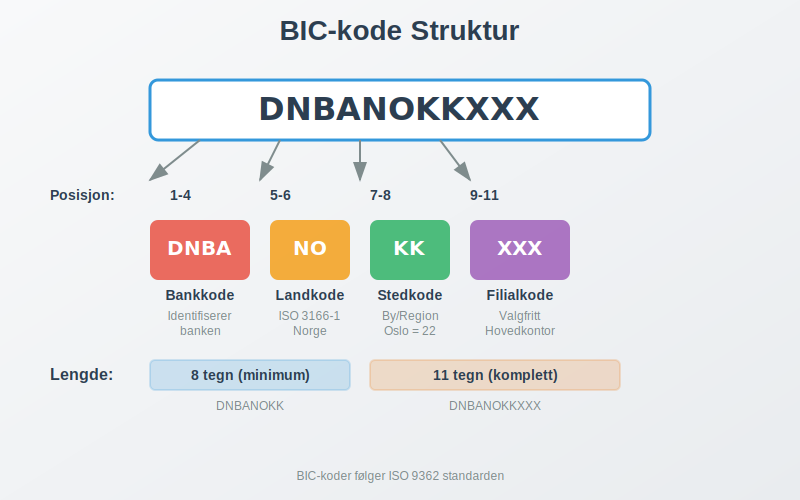
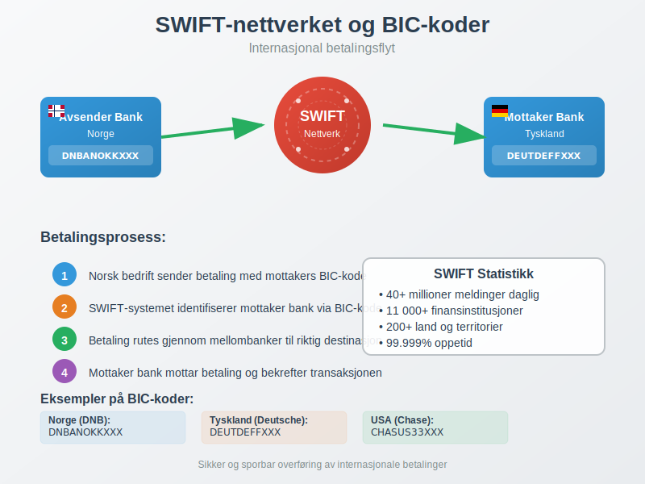
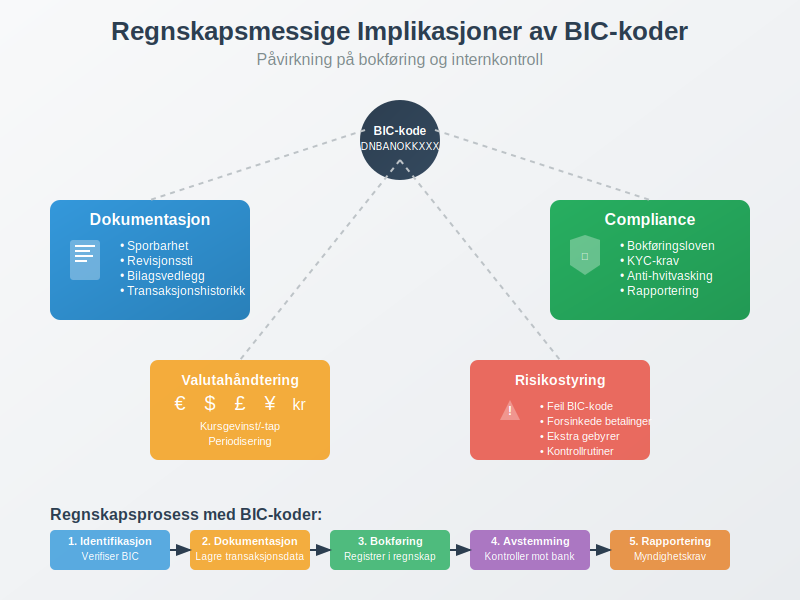

---
title: "Hva er BIC-kode?"
seoTitle: "Hva er BIC-kode?"
description: '**BIC-kode** (Bank Identifier Code) er en internasjonal standard som brukes for å identifisere banker og finansinstitusjoner ved grenseoverskridende betalinger...'
---

**BIC-kode** (Bank Identifier Code) er en internasjonal standard som brukes for å identifisere banker og finansinstitusjoner ved grenseoverskridende betalinger og finansielle transaksjoner. For norske bedrifter som driver med internasjonal handel, er forståelse av BIC-koder essensielt for korrekt håndtering av [banktransaksjoner](/blogs/regnskap/hva-er-banktransaksjoner "Hva er Banktransaksjoner? Komplett Guide til Registrering og Bokføring") og [valutahandel](/blogs/regnskap/hva-er-betalingsmidler "Hva er Betalingsmidler? Tvungne, Elektroniske og Tradisjonelle Metoder").

BIC-koden fungerer som en digital adresse for banker i det globale finanssystemet og er uunnværlig for korrekt [bokføring av internasjonale transaksjoner](/blogs/regnskap/hva-er-bankavstemming "Hva er Bankavstemming? Komplett Guide til Avstemming av Bankkonti") og oppfyllelse av regnskapsmessige krav.

## Hva er BIC-kode?

BIC-kode står for **Bank Identifier Code** og er også kjent som **SWIFT-kode**, oppkalt etter [SWIFT](/blogs/regnskap/hva-er-swift "Hva er SWIFT? En Komplett Guide til SWIFT-nettverket og Internasjonal Finanskommunikasjon") (Society for Worldwide Interbank Financial Telecommunication) som administrerer systemet. Denne koden er en unik identifikator som sikrer at internasjonale betalinger når frem til riktig bank og filial.

### BIC-kodens Struktur

En BIC-kode består av **8 eller 11 tegn** og er bygget opp som følger:

| Posisjon | Lengde | Beskrivelse | Eksempel |
|----------|--------|-------------|----------|
| 1-4 | 4 tegn | **Bankkode** - Identifiserer banken | DNBA |
| 5-6 | 2 tegn | **Landkode** - ISO 3166-1 alpha-2 | NO |
| 7-8 | 2 tegn | **Stedkode** - Identifiserer byen/regionen | 22 |
| 9-11 | 3 tegn | **Filialkode** - Identifiserer spesifikk filial (valgfritt) | XXX |

### Eksempel på Norske BIC-koder

Her er noen eksempler på BIC-koder for store norske banker:

| Bank | BIC-kode | Forklaring |
|------|----------|------------|
| DNB | DNBANOKKXXX | DNB Bank ASA, Norge, Oslo |
| Nordea | NDEANOKK | Nordea Bank Norge ASA |
| Sparebank 1 | SPRONO22 | Sparebank 1 SR-Bank |
| Handelsbanken | HANDSESS | Svenska Handelsbanken (norsk filial) |

## BIC-kodens Rolle i Internasjonale Betalinger

BIC-koder er fundamentale for **[SWIFT-nettverket](/blogs/regnskap/hva-er-swift "Hva er SWIFT? En Komplett Guide til SWIFT-nettverket og Internasjonal Finanskommunikasjon")**, som håndterer over 40 millioner meldinger daglig mellom mer enn 11 000 finansinstitusjoner i over 200 land. For norske bedrifter betyr dette sikker og sporbar overføring av [betalingsmidler](/blogs/regnskap/hva-er-betalingsmidler "Hva er Betalingsmidler? Tvungne, Elektroniske og Tradisjonelle Metoder") på tvers av landegrenser.

### Hvordan BIC-koder Fungerer i Praksis

Når en norsk bedrift skal sende en internasjonal betaling, skjer følgende prosess:

1. **Identifikasjon**: Mottakers BIC-kode identifiserer riktig bank
2. **Routing**: SWIFT-systemet ruter betalingen gjennom riktige mellombanker
3. **Levering**: Betalingen ankommer mottakers bank med korrekt identifikasjon
4. **Konfirmasjon**: Bekreftelse sendes tilbake til avsender

Dette systemet sikrer at [banktransaksjoner](/blogs/regnskap/hva-er-banktransaksjoner "Hva er Banktransaksjoner? Komplett Guide til Registrering og Bokføring") kan spores og dokumenteres korrekt for regnskapsformål.

## BIC-kode vs. IBAN - Forskjeller og Sammenheng

Mens **BIC-koden** identifiserer banken, identifiserer **[IBAN-nummeret](/blogs/regnskap/hva-er-iban-nummer "Hva er IBAN-nummer? Komplett Guide til International Bank Account Number i Norge")** (International Bank Account Number) den spesifikke kontoen. Begge er nødvendige for internasjonale betalinger:

| Aspekt | BIC-kode | IBAN |
|--------|----------|------|
| **Formål** | Identifiserer bank/finansinstitusjon | Identifiserer spesifikk bankkonto |
| **Lengde** | 8 eller 11 tegn | Opptil 34 tegn (15 i Norge) |
| **Struktur** | Bankkode + Landkode + Stedkode + Filialkode | Landkode + Kontrollsiffer + Bankkode + Kontonummer |
| **Eksempel** | DNBANOKKXXX | NO93 8601 1117 947 |

### Praktisk Anvendelse

For en komplett internasjonal betaling trenger du:

* **BIC-kode** for å identifisere mottakers bank
* **IBAN** for å identifisere mottakers spesifikke konto
* **Betalingsreferanse** for korrekt [avstemming](/blogs/regnskap/hva-er-avstemming "Hva er Avstemming? Komplett Guide til Regnskapsmessig Avstemming")

## Regnskapsmessige Implikasjoner av BIC-koder

For norske bedrifter har BIC-koder flere viktige regnskapsmessige implikasjoner som påvirker både [bokføring](/blogs/regnskap/hva-er-regnskap "Hva er Regnskap? En Komplett Innføring i Norsk Regnskapsføring") og [internkontroll](/blogs/regnskap/hva-er-attestering "Hva er Attestering? En Komplett Guide til Bilagsbehandling og Godkjenning").

### Dokumentasjon og Sporbarhet

BIC-koder bidrar til:

* **Fullstendig dokumentasjon** av internasjonale transaksjoner
* **Sporbarhet** av betalinger for revisjonsformål
* **Korrekt identifikasjon** av motparter i regnskapet
* **Overholdelse** av bokføringslovens krav til dokumentasjon

### Valutahåndtering og Kursrisiko

Ved internasjonale betalinger med BIC-koder må bedrifter håndtere:

* **Valutakurser** på transaksjonstidspunktet
* **Kursgevinster og kurstap** i regnskapet
* **Sikringsstrategier** for valutarisiko
* **Periodisering** av valutaeffekter
* **[Fjernleverbare tjenester](/blogs/regnskap/hva-er-fjernleverbare-tjenester "Hva er Fjernleverbare Tjenester i Regnskap? MVA-regler og Bokføring")** har spesielle MVA-regler ved grenseoverskridende levering

## BIC-koder i Norsk Banksektor

Den norske banksektoren har implementert BIC-koder som en integrert del av det internasjonale betalingssystemet. Dette påvirker hvordan norske bedrifter håndterer [bankinnskudd](/blogs/regnskap/hva-er-bankinnskudd "Hva er Bankinnskudd? Typer, Renter og Regnskapsføring") og internasjonale transaksjoner.

### Norske Bankers BIC-struktur

Norske BIC-koder følger et konsistent mønster:

* **Landkode**: Alltid "NO" for Norge
* **Stedkode**: Vanligvis "22" for Oslo, men kan variere
* **Bankkode**: Unike 4-tegns koder for hver bank

### Implementering i Norske Betalingssystemer

Norske banker har integrert BIC-koder i:

* **Nettbanktjenester** for privatpersoner og bedrifter
* **[BankGiro](/blogs/regnskap/hva-er-bankgiro "Hva er BankGiro? Komplett Guide til Norsk Betalingssystem")**-systemet for internasjonale betalinger
* **Regnskapssystemer** for automatisk bokføring
* **Rapporteringssystemer** for myndighetskrav

## Praktiske Råd for Bedrifter

For norske bedrifter som håndterer internasjonale transaksjoner, er det viktig å etablere gode rutiner rundt BIC-koder:

### Beste Praksis for BIC-håndtering

* **Verifiser alltid BIC-koder** før du sender betalinger
* **Oppbevar dokumentasjon** av alle internasjonale transaksjoner
* **Implementer kontrollrutiner** for å unngå feil i BIC-koder
* **Tren personalet** i korrekt bruk av BIC-koder

### Vanlige Feil og Hvordan Unngå Dem

De mest vanlige feilene ved bruk av BIC-koder inkluderer:

1. **Feil BIC-kode**: Kan føre til forsinkede eller returnerte betalinger
2. **Manglende BIC-kode**: Kan resultere i ekstra gebyrer eller avvist betaling
3. **Utdaterte BIC-koder**: Banker kan endre sine koder ved fusjoner eller omorganiseringer
4. **Feil kombinasjon**: BIC-kode som ikke matcher IBAN-kontoen

### Kontrollrutiner for BIC-koder

Etabler følgende kontrollrutiner:

* **Dobbel verifikasjon** av BIC-koder før betaling
* **Regelmessig oppdatering** av BIC-database
* **[Attestering](/blogs/regnskap/hva-er-attestering "Hva er Attestering? En Komplett Guide til Bilagsbehandling og Godkjenning")** av internasjonale betalinger
* **Oppfølging** av betalingsstatus

## Fremtiden for BIC-koder

BIC-systemet utvikler seg kontinuerlig for å møte nye krav i det globale finanssystemet. Viktige utviklingstrender inkluderer:

### Digitalisering og Automatisering

* **API-integrasjoner** for sanntids BIC-validering
* **Automatisk BIC-oppslag** i regnskapssystemer
* **Kunstig intelligens** for feildeteksjon
* **Blockchain-teknologi** for økt sikkerhet

### Regulatoriske Endringer

* **Økt rapporteringskrav** for internasjonale transaksjoner
* **Strengere KYC-krav** (Know Your Customer)
* **Anti-hvitvasking** regulering
* **GDPR-compliance** for databehandling

## Konklusjon

BIC-koder er en fundamental komponent i det moderne internasjonale finanssystemet og spiller en kritisk rolle for norske bedrifter som driver med grenseoverskridende handel. Korrekt forståelse og anvendelse av BIC-koder sikrer:

* **Effektive internasjonale betalinger** uten forsinkelser eller feil
* **Korrekt regnskapsføring** av internasjonale transaksjoner
* **Overholdelse** av regulatoriske krav
* **God internkontroll** og sporbarhet

For bedrifter som ønsker å optimalisere sin håndtering av internasjonale betalinger, er det essensielt å etablere robuste rutiner for BIC-koder som en del av den overordnede [bankavstemming](/blogs/regnskap/hva-er-bankavstemming "Hva er Bankavstemming? Komplett Guide til Avstemming av Bankkonti") og regnskapsprosessen.

Ved å følge beste praksis og holde seg oppdatert på utviklingen innen BIC-systemet, kan norske bedrifter sikre smidig og sikker håndtering av sine internasjonale finansielle transaksjoner.

